Advanced Dungeons & Dragons®
2nd Edition

PLANE SCAPE™
CAMPAIGN EXPANSION

# PLANES OF LAW

**PLANE SCAPE**TM
CAMPAIGN EXPANSION

# PLANES OF LAW

A
PLAYER'S
GUIDE
TO LAW

# A PLAYER'S GUIDE TO LAW

## CONTENTS

Welcome to the Planes of Law 2
The Code of Law 4
Magic on the Planes of Law 4
How to Get from Here to There 6

ACHERON: CLASH AND CONFLICT 8
The Mines of Marsellin 11
Mesk 13

ARCADIA: MERCY-TEMPERED ORDER 14
The Ghetto 17

BAATOR: DECEPTION AND DEPRAVITY 18
Darkspine 21
Garden 22

MECHANUS: ULTIMATE UNFEELING ORDER 24
Haven 27

MOUNT CELESTIA: RIGHTEOUS WRATH 28
The Tower of Fire 31

## CREDITS

**Designer**: Colin McComb ✦ **Editors**: Michele Carter, Dori Hein
**Project Coordinator**: Andria Hayday
**Cover Artist**: Robh Ruppel ✦ **Interior Artist**: DiTerlizzi ✦ **Cartographer**: Rob Lazzaretti
**Graphics Coordinator**: Sarah Feggestad ✦ **Art Coordinator**: Peggy Cooper
**Electronic Prepress Coordinator**: Tim Coumbe ✦ **Typography**: Angelika Lokotz
**Border Art**: Robert Repp ✦ **Graphic Design**: Dee Barnett, Dawn Murin

TSR, Inc.
201 Sheridan Springs
Lake Geneva
WI 53147
U.S.A.

TSR Ltd.
120 Church End
Cherry Hinton
Cambridge CB1 3LB
United Kingdom

2607XXX1901

ADVANCED DUNGEONS & DRAGONS and AD&D are registered trademarks owned by TSR, Inc. PLANESCAPE and the TSR logo are trademarks owned by TSR, Inc. All TSR characters, character names, and the distinctive likenesses thereof are trademarks owned by TSR, Inc. © 1995 TSR, Inc. All Rights Reserved. Printed in the U.S.A. Random House and its affiliate companies have worldwide distribution rights in the book trade for English-language products of TSR, Inc. Distributed to the toy and hobby trade by regional distributors. Distributed to the book and hobby trade in the United Kingdom by TSR Ltd. This material is protected under the copyright laws of the United States of America. Any reproduction or unauthorized use of the material or artwork contained herein is prohibited without the express written consent of TSR, Inc.

Acheron, Arcadia, Baator, Mechanus, Mount Celestia — some berks have this notion that the planes of law are stuffy places, full of self-righteous, bombastic addle-coves spreading conversion, be it good or evil. Well, forget the "stuffy" and drop the "bombastic." Why? First, the chant's

# WELCOME TO THE PLANES OF LAW

wrong. Second, labeling the natives is a quick way to end up in the dead-book. Just because they're lawful don't mean they take insults.

Most sods only envision Mechanus when they think of the planes of law. True, the Clockwork Universe is the ultimate place of rigid order, but a berk's got to realize there's actually five planes practicing the lawful tenets.

What's more, two of 'em ain't exactly on the side of goodness and light either. Baator and Acheron are two

of the worst places a body can

find himself, bar none. Some cutters think the Abyss is their worst nightmare, but they'd be wrong. In the Abyss, the tanar'ri will just kill a berk; on Baator, the baatezu will play with his head a while before they kill him. Acheron ain't much better. There the plane itself can get a sod. Take a look at all the scars marring the iron cubes drifting through the plane. Watch them smash together from time to time — then imagine what happens to a body caught between collisions.

On the other hand, Arcadia and Mount Celestia pretty much fit the image of goodness. 'Course, some berks disagree with that viewpoint, pointing out that even the forces of good don't always see eye to eye. Of the two, the Mount's closer to what most people think of as "pure good" (though those who've felt the wrath of the archons there might disagree!). Arcadia's known as the Land of Perfect Good, and its denizens are even rougher on chaotics and evils. The militia-men there don't suffer law-breaking as kindly as, say, the denizens of Ysgard might. To Arcadians, preserving law is as important (if not more so) than fostering goodness. Still, on Mount Celestia and Arcadia it's easier to avoid ending up in the dead-book than it is on the other three lawful planes . . . but if a berk can't keep his bone-box from rattling, he'll end up there just as fast.

SOME LIKE IT HOT; SOME LIKE IT COLD. ME? I JUST LIKE IT LAWFUL.

— A TRUMPET ARCHON, AFTER SEVERAL PINTS OF MEAD

Then there's Mechanus, the plane of supreme, perfect order — except that sometimes it doesn't seem all that precise. The plane of clockwork and cogs has an order, all right, but its pattern isn't always obvious to any mind less keen than a power's. Truth be told, even most of the powers don't have much of an idea what all the gears are for. What's more, there's some strange creatures living on those gears, just odd and nasty enough to give any berk the pause.

The planes of law ain't any kinder than the chaos five. They might be more civilized (at least to prime eyes), but they're every bit as menacing as the Abyss. Woe to the cutter who meets up with a baatezu and is taken in by its polite smile. Just because the baatezu didn't kill him on sight doesn't mean the fiend hasn't got a heart of darkest evil. A visitor to the lawful planes has to tread carefully wherever he goes — some of the lawful good beings have an attitude problem even bigger than the tanar'ri.

✦ 2 ✦

IT'S A NICE NIGHT, BERK.
WHAT DO YOU SAY
WE GO FOR A WALK?

— A LINE UTTERED
BY A TIEFLING

# ✦ THE CODE OF LAW ✦

There's this misperception that, because they're called the planes of law, every aspect of life on Acheron, Arcadia, Baator, Mechanus, and Mount Celestia is regulated by myopic laws and commandments. Some say that the beings of these planes try so hard to avoid offending each other that they end up a great, colorless mass of indistinct nonentities. Well, it just ain't so. What is true is that these five planes are regulated internally by those who believe in the code of law as defined for their plane. Even the evil bashers who live on Baator or Acheron are dedicated to making sure chaos doesn't run rampant through their home, that the integral order of the multiverse is maintained in a coherent fashion.

Lawful folk don't make up arbitrary laws for people to follow; neither do they kill someone just for violating a rule (unless it's a pretty important rule, of course). Lawfuls leave that to the chaotics. Furthermore, edicts on the lawful planes are generally established for the benefit of travelers to those planes; natives intuitively know the right way to behave, and they can catch any outsider who's trying to pass himself off as a fellow citizen simply by observing the way he acts.

<mark>The denizens of the planes of law live and die by an internal code, which they follow above all else.</mark> This code typically reflects the predominant attitude of the plane, modified by the part of the plane that isn't law but is instead good or evil. Thus, the code of law that rules on hellish Baator is understandably different from the one that holds sway on heavenly Mount Celestia. Likewise with Acheron and Arcadia. Only on Mechanus is the code of law most purely law — and yet there law is taken to a degree almost incomprehensible to non-natives.

Some say that law is logic and chaos is emotion, that lawful cutters always pause to think before doing, while chaotics just do it. This ain't necessarily so. Lawful creatures have an ingrained sense of order, and making them do something that goes against that grain is almost as hard as making a chaotic give up its freedom. Lawfuls know what's right and best, especially since their internal rules often echo the code of the plane on which they live. They aren't drones, berk — they just can't find happiness at the expense of order.

As is true with all the Outer Planes, belief plays a crucial part in defining the planes of law. Just as the independent nature of the petitioners of Ysgard holds the pieces of that plane together, so too do the beliefs of the inhabitants of the five lawful planes keep their respective layers from sliding into other planes.

Lawfuls will tell a cutter that order underlies everything, even chaos. They point out that anything that happens can be traced back to a primal cause, a reaction to some prior action, and so on, and so on.

What's more, Law isn't just about strict order and being tied down by so many rules that no basher could follow them all. Law's also about identification and classification — understanding the nature of the multiverse. Law's about definition and trying to see why creatures act the way they do, why plants grow the way they do, and why events take certain turns and twists. Law's about discovery and naming and knowledge. Law's the belief that knowing the way the multiverse is ordered can bring a body power, and that only the strong rise to the top — because they know the order below them. Success comes from learning the order above.

There's good and there's evil in law, just as there's good and evil in nearly everything. Some choose to accentuate one over the other, while others choose to follow law undiluted. The Guvners understand all this, and they believe in law fervently. To them, and to many others, law is everything.

And anyone who says otherwise can pike it.

# MAGIC ON ✦ THE PLANES OF LAW ✦

Since the planes of law are about classification and codification (among many, many other things), the inhabitants here have discovered a few more rituals and spells to give a planewalker that extra little edge. Spells like *spirit wrack*, *cacofiend*, and *true name* — all detailed below — have been developed on the planes of law. These spells're especially popular on Acheron, where they're put to good use.

## SPIRIT WRACK (Evocation/Abjuration)

* **Level**: 6
* **Range**: 10 feet plus 10 feet per level
* **Components**: V, M
* **Duration**: Special
* **Casting Time**: Special
* **Area of Effect**: Special
* **Saving Throw**: Special

A *spirit wrack* spell is a very strong protection and punishment spell against the powerful creatures of the nether planes, but to employ the magic the spellcaster must know the name of the target of the spell. Prior to actually uttering this spell, the wizard must prepare an illuminated sheet of vellum, carefully inscribing the spell and the target's name. He must use special inks made from powdered rubies and the ichor of a slain tanar'ri, then ornament the vellum with gold leaf. This preparation requires 8 to 32 (1d4×8) hours and costs 6,000 gp for all supplies. If the outer-planar creature is present, the caster can then begin the actual incantation. During each round of reading, the target has a 25% cumulative chance to concede without any inducements.

✦ 4 ✦

When the caster begins reading the document, the target creature is immobile unless it makes its magic resistance roll; even if this succeeds, the monster is discomfited and is 90% likely to retreat to its own plane if it can. Regardless of the roll's result, the target is powerless to attack the wizard while he reads the spell. Reading the first part continues for 1 round, with the target's discomfiture increasing. During the second round, the creature loses 1 hit point per Hit Die it possesses (for example, a 9-Hit Die tanar'ri loses 9 hit points). At the end of this round, the target is in extreme pain. The third and final round of the spell reduces the creature's remaining hit points by 50%, causes excruciating pain, and exiles the creature to its home plane — there to remain imprisoned for the number of years equal to the level of the wizard.

Target creatures become the sworn foes of these wizards, a fact few spellcasters care to deal with. Most wizards are far more likely to create the document and use it as a threat to force a creature into submission rather than actually cast the spell itself.

# CACOFIEND (Conjuration/Summoning)

**Level**: 7
**Range**: 10 feet
**Components**: V, S, M
**Duration**: Special
**Casting Time**: 1-8 hours
**Area of Effect**: Creature summoned
**Saving Throw**: Special

This perilous spell summons a powerful fiend: a true tanar'ri, a greater baatezu, or a great yugoloth. (Cacofiend isn't powerful enough to summon a unique fiend, and lesser sorts can't be summoned via this spell.)

If the caster is interrupted during the casting time, his spell fails. If an interruption occurs after the cacofiend has appeared, there is a 10% chance that the fiend can escape its boundaries and attack the wizard. This percentage is cumulative for each round of interruption. A fiend is entitled to a saving throw against this spell; if the fiend rolls greater than the caster's level on 2d10, the spell fails. When this occurs, either the name used was not perfectly correct or the named fiend is already imprisoned or dead, so the caster must call on another fiend.

In any event, the caster must know the name of the creature he is summoning. A fiend so summoned is most angry and vilely disposed. The caster must be warded and protected by a *protection from evil* spell, and the fiend must be confined within a magical diagram if the wizard is to avoid being slain or carried off bodily. The summoned fiend can be coerced to perform some deed in one of three ways, as follows:

1) By threatening to cast a *spirit wrack* spell, the wizard can force the monster to swear an oath to follow a certain course of action, freeing the fiend only when the creature completes the service. This method is extremely dangerous, for a fiend will seize on any minor error in such a bargain to spoil the desired outcome or to simply kill the summoner. Further, the fiend will bear great hatred for the wizard after such forced obedience.

2) By offering tribute (blood and sacrifices), the summoner may convince the fiend to serve willingly. The caster is well advised to have ample protection and power to defend himself, for the fiend might decide the offer is insufficient and not accept the proffered bargain.  Though the fiend must abide by a pledge, since its name is known, it must hold only to the exact word of the agreement, not the spirit. However, only highly evil mages are likely to attempt such a bargain, and a summoned cacofiend might be favorably disposed toward such a character.

3) The summoned fiend can be the target of a *trap the soul* spell. In this case, the wizard will not speak with or bargain for the creature's service, although the cacofiend might be eager to reach an agreement with the mage before being forced into imprisonment. Attempting to trap the fiend is risky only if proper precautions are ignored, for failure means only that it escapes to its home plane. If trapped, however, the fiend remains imprisoned until the owner of the confining object breaks it and frees the fiend, at which time the wizard must ask the fiend to perform a service before it returns to the Lower Planes. If the person freeing the fiend fails to demand a service when the monster asks what is required of it, the fiend is under no constraint not to slay its liberator on the spot. If a service is required, however, the creature must first do its best to perform the task and then must return to its home.

The fiend serves only for a limited duration unless it serves willingly. Any action which is impossible or requires more than a week to perform is 50% likely to free the fiend from its obligations. A liberated fiend may seek revenge against the caster, for the creature can remain on the plane it was summoned to for up to two years.

The components of the spell include white wax, mandrake root, a bottle of red wine, a piece of parchment inscribed with the target's name, and an offering that would tempt a fiend.

5

# TRUE NAME (Enchantment/Alteration)

**Level**: 7
**Range**: 30 feet
**Components**: V, S
**Duration**: Special
**Casting Time**: Special
**Area of Effect**: Thing named
**Saving Throw**: Neg.

True name grants a wizard great power over any living thing that has a name, generic or individual, known to the caster. Naturally, most true names aren't known, even by the creatures themselves, for the common names of most things aren't their true and secret names. True names are discovered through hard work, spying, extensive use of *legend lore*, and diligent sagecraft. Casting a *true name* spell requires the wizard to call out the true name of the subject and then begin reciting a verse which describes the nature and history of the subject. This involves a casting time of 3. Thereafter, in rhyming verse, the caster must describe the desired result of the spell. The results are variable and have varying casting times, as noted below.

* **Multiple suggestion**: The verses can contain from one to four *suggestion* spells, each treated as a separate spell. Each verse requires a casting time of 1 to recite.

* **Weakness and surrender**: Each subsequent verse reduces the target's MR, attack rolls, damage rolls, and then saving throws by 1. With each verse, the target must save versus paralyzation or meekly surrender. The meekness lasts as does a *charm person* spell.

* **Polymorph**: The verses change the target into something else, just as if a *polymorph other* had been cast. No system shock roll is required. The number of verses and the casting time vary depending on the degree of change: mineral to animal = 10, mineral to vegetable = 9, vegetable to animal = 8, animal to animal = 4, vegetable to vegetable = 3, and mineral to mineral = 2. The subject returns to its natural form in time; the spell lasts for 6 turns per level of the caster minus 1 turn for every verse required for the transformation.

* **Transport**: The target is teleported without error. The number of verses required depends on the destination: same plane = 5, one plane removed = 6, two planes removed = 7, and three planes removed = 8. Greater distances are not possible.

* **Domination**: The target is allowed a single save; if unsuccessful, the target must serve the caster to the best of its ability for a single day. If it's required to perform an act highly against its code of ethics (for example, a paladin being forced to slay a village of innocents), the target's allowed another save. Every failed save means that its next save is made at a cumulative -1 penalty. Those under domination are aware of what their body's doing, but are helpless to stop it. Failure to save doesn't affect their alignment in any way, but most good creatures want to atone for any atrocities committed.

If the subject is willing, it makes no saving throw or magic resistance roll. If the caster is interrupted during the casting of *true name*, the magic fails and the spell is lost. The would-be victim can then do whatever it likes to the caster, for it's no longer bound by the restrictions of the spell. Thus, most mages using this spell make sure they've got plenty of guards against interruption.

# HOW TO GET FROM HERE TO THERE

The planes are infinite, right? So how does a body get from one point to another? More important, how does a planewalker get off a particular plane without going through a portal? The answer's easy: paths. Paths wind through every known plane, aiding the traveler in his or her quest to get somewhere. In some places, paths are just what the name suggests, trails worn into the plane by the passage of many feet. In other places, paths are nearly invisible or might not even be physically present. In the infinite distances of the cosmos, without paths a traveler could literally walk forever.

Of course, everyone knows about the four Great Paths, the routes that span planes. These are the Rivers Styx and Oceanus, the Tree Yggdrasil, and Mount Olympus.

Well, not everyone wants to use  these paths to get from one place to another; furthermore, a number of these paths don't even cross the lawful planes. As such, taking a Great Path is best used as an interplanar route.

So how does a planewalker figure out which way to go, what to do? There's several ways. A body can always hire a guide. There are (of course) guides found in each of the five lawful planes who're only too

✦ 6 ✦

happy to sign on with a party, explaining local flora and fauna as well as local customs and laws. The guides're often Guvners or other natives who're looking to make a quick bit of jink - irritating berks who want to make sure a party doesn't muck up the natural order. But some adventurers - particularly green primes - prefer to go it alone. This sort of haphazard guessing's not a sure way to get anywhere, especially on the lawful planes. No, the best way to travel the planes of law is to understand how travel works there.

See, every lawful plane's got its own system for determining how people travel and how fast they get there. However, one aspect is the same for all of them: <mark>It takes chaotics far longer to get around on the planes of law than it does lawfuls.</mark> Unless chaotic planewalkers are accompanied by lawful companions, they'll find their journey made longer by a factor of two or three times. They just ain't got the proper mindset to appreciate how travel works on each plane, which is outlined below.

✦ **ACHERON**: This plane's probably the most straightforward of the five lawful planes, at least travel-wise. The cubes, being finite in size, all have a certain distance to them. Though the plane they float in is infinite, the cubes themselves aren't. Of course, it's not a uniform distance from cube to cube, so if a body's crossed one and wants to get to another, he'll have to find a way himself. Fortunately, such travel isn't too difficult. There's portals to the other cubes, if a body can find 'em, and there's also spells that allow a berk to traverse the cube. They're pretty much common knowledge on Acheron, though a basher might have to pay a steep price for one, depending on who's doing the asking and who the selling.

The distance from one place to another on Acheron is simple. It's measured in days' marches. A place close by is a quarter-day march, while something on a different cube might be a three-day march.

✦ **ARCADIA**: All a body has to do on Arcadia is find one of the numerous roads that cross the plane and start walking. Unfortunately, unless a body's lawful or traveling with someone who is, it's going to take him longer to get where he's going - the roads just don't carry chaotics and neutrals well.

Rumor has it there're path keys that activate the various roads of Arcadia. If the correct word is uttered while standing on the right path (or so goes the chant), the cutter and his friends'll get whisked to his destination. Where a body learns these words is uncertain, for they're a well-guarded secret. They can't be bought; they can only be earned from someone who knows them and who's willing to reveal the secret.

✦ **BAATOR**: There's all sorts of devious ways for a body to get around Baator. The plane's laced with the hidden paths common to all planes, but those on Baator

are far harder to find.

The guides who know where the paths are can only be trusted as far as the literal word - a berk's got to make certain the terms of his agreement are exact, with no room for interpretation by the guide. Otherwise, there's a good chance a cutter's going to get bobbed or sold as slaves to the baatezu. By the way, these guides are notoriously expensive, and anyone using them had better have deep pockets.

In some places on the plane, how long a body takes to get someplace is dependent on his age - age in years equals the number of days it takes to reach a destination. In other places, travel depends on the focus of the traveler - that is, how much he's concentrating on reaching his destination. Those who don't focus on their destination don't reach it. In still other places, a body's got to avoid thinking about his destination. There's also a part of the plane where a body has to have a guide, where the amount of garnish given to the guide reduces the number of days traveled. That's the value of a guide on Baator: pricey but worth it.

✦ **MECHANUS**: The only secret here is learning the dark of the Labyrinthine Portal, or the Labyrinth as it's also called. It's a maze of gates, conduits, and portals that'll deposit a body anywhere on Mechanus - if that person knows where he's going, and if he's got the right frame of mind. A person whose mind is organized is a lot more likely to get where he's headed than a person whose mind runs off on all sorts of tangents.

The Labyrinth isn't a collection of walls. It's all in how a body chooses to go through the gates - the order of the gates, which side of the gate a body enters, and the frame of mind a body travels with. All of these parameters are important, for they can determine where a gate deposits a basher. If the Labyrinth is traversed correctly, a cutter can make a gate take him somewhere that the gate never went before. It's all in knowing how to fit through the loopholes of the Labyrinth's law.

✦ **MOUNT CELESTIA**: This one's tricky. First off, a body's got to choose a path to travel, which is a way of virtuous living as well as a physical trail. Only when a cutter's learned from this path can he get to the next layer of the Mount. Then, he can either choose a new path or continue on the old one. When he gains the next layer, he can choose yet another path to follow.

It's not easy following a path - try to imagine learning perfect valor, perfect love, perfect anything. Yet it's a lot easier for a planar than a petitioner. A planar can quit the path simply by leaving the plane. A petitioner doesn't have that choice — it has to continue along until it's reached union with its power.

✦ 7 ✦

# ACHERON: CLASH AND CONFLICT

FIRST. YOU'RE IN THE ARMY NOW.
SECOND. I'M IN COMMAND.
THIRD. IF YOU DISOBEY, I'LL FLAY YOUR SKIN.
ADD IT UP.
IF YOU DON'T LIKE THE MATH, JUST TRY TO QUIT.

— GRANOG TEN-BONES, ORC COMMANDER

Acheron's the plane of battle, pure and simple. It's a place of marching armies and solid metal cubes hurling through the air. It's unforgiving and brutal, the last resting place of heroes without a cause and soldiers without hope. It's Acheron, and it has to be seen to be believed.

There're armies drilling across the surfaces of the cubes, organized groups that rumble through the wastelands. There's no love in this place — only grudging respect. A body's got to earn respect if it wants any kind of reward, but that don't come easy to the battle-hardened hearts of those who live here. The natives here're mercenaries, soldiers who've sold their spirits for a bag of silver. They're berks who couldn't decide between order and evil, and they found out neither won.

Acheron is the place where evil's an afterthought in the quest for organization and order. Advancement in the military life's what these sods strive for. There's no emotions on Acheron but the darker flames of anger and hatred, jealousy and envy. Here it's function over form, use over beauty. No one cares for jeweled swords or works of art, except in their use against the enemy. This place is the death of hope and the crushing of compassion.

Every layer of Acheron's got some sort of solid that floats through the air. It's on these pieces of flotsam and jetsam that the creatures of Acheron live. Some of these solids're cubes, some're plates, and some're other geometric shapes — regardless, they're all called cubes here. The sizes of cubes vary even within a layer. Some are hundreds of miles across, while others are scant feet. The cubes ain't stationary, and they run into each other enough that being crushed between them is a real danger. Cubes hurt — a lot — when they smash into a body. If a berk sees an accident about to happen, he'd better either

dive into a tunnel or, if he can't, take cover in some of the pitted craters. If he gets inside a tunnel, he's safe,

> LOOK OU+!
> MERCYKILLERS!
> HAVE WE BROKEN ANY LAWS?

> — A PRIME MAGE WHO DOESN'+ QUITE GE+ +HE POIN+

though a bit bruised from being bounced around after the impact. If he opts for a crevice to hide in, he gets a saving throw versus death magic for half damage. And if the

poor sod gets caught empty-headed, he's red paste.

Size is generally unrelated to how fast a cube moves — even the largest can move fast enough to give a body serious pause. The strange thing is, once a body's on a cube, it seems as if the cube's stationary. It's the other cubes that look like they're moving about at incredible speeds. Oddly, no one can prove which is which. The wind doesn't whistle about a body's head, which'd sure be the case if the cube were moving. Chalk it up to another mystery of the planes.

The cubes are riddled with tunnels and caverns, like a bad apple. The tunnels are uniform and are always circular, while the caverns tend to be the shape of the solid they're in. They provide at least a measure of protection when the cubes collide; they're also excellent hiding places for any loot the inhabitants may have gathered over time. On the really big cubes, the tunnels and caverns can serve as marshaling points for armies, even holding entire fortresses. Some tunnels run straight through a cube, while others curve and wind their way to dead ends.

Though the berks here are constantly struggling, there's no real point to it, and they know it. They fight because that's what they've been led to do, and because there's precious little else to do on Acheron's vast emptiness. They fight to become victorious and to

impose their will on all others. Few realize that their struggles are pointless and futile, that the wars they fight can never be over.

Acheron's got four layers: Avalas, the battleground; Thuldanin, the layer of waste; Tintibulus, the layer of perfect geometry; and Ocanthus, layer of the whirling razors. Each layer has its own perils and, strangely, each has its own savage beauty. When most folks speak of Acheron, they mean Avalas. It's the most inhabited of all the layers, despite being one of the most outwardly dangerous. Still, Avalas does have realms and cities, just about all of which are in direct opposition to each other.

The other three layers are equally bad places to be, by all accounts. For more details, though, a berk's going to have to visit the place himself — though if he does that he might get tangled up with one of the many powers that makes Acheron its home. There's the goblin and orc pantheons, each locked in an eternal war against each other. There's also oriental human deities,

and then there's Laduguer, the patron of the duergar dwarves. He's led them to the second

layer, where they produce some of the finest weapons on Acheron. 'Course, these weapons are just turned around and used for the next battle held on Acheron. There's not much point in making a fine weapon for a

pointless war, but some of duergar weapons make their way to other planes.

The Mercykillers, ruthless in their pursuit of lawbreakers but considering themselves above the law, have established a serious presence in Avalas, Acheron's first layer. They're not evil, but they know that showing considerable power on Acheron ensures that their brand of philosophy's welcome somewhere.

Magic on Acheron has a few twists to it, but there's no going halfway with a spell. It's either all or nothing. Even if a spell doesn't take full effect on the enemy, it's going to drain what's possible to drain from the caster. The chant is that there's a conservation of energy on Acheron. It's said that what one mage gains, another must lose. The truth of this hasn't been determined, nor is it exactly clear what this means. But it sounds nasty. And if it's nasty on Acheron, it's probably true.

The second layer of Acheron, Thuldanin, is the dumping ground of the multiverse. The chant is that anything destroyed and discarded ends up here. Toppled buildings, huge ships smashed asunder, and crippled flying devices of every description stock these open blocks. Everything's inoperative, turned to stone by the long exposure to the magical nature of the plane. Sometimes living creatures, perhaps wayward

10

survivors of a shipwreck or building demolition, are caught by the plane's insidious magic and transformed into cold statues.

Weapons and devices of war are also transformed. Creations of science, technology, blind luck, and magic are all jumbled together in these huge hollow blocks. Some of them're fairly recent additions, and so they remain in their original condition. Some items have been here for millennia — they, of course, have become the black iron-stone that covers each cube. Every creature and object is susceptible to crystallizing into this stone. It's said that creatures turned to ironlike stone can only be restored by a *crystalbrittle* spell followed by *stone to flesh* (or else by a *wish* spell). Items thus transformed lose all their magical properties, and they can only be restored to their original material by a *dispel magic*. It's a bit of a risk, but finding some ancient piece of machinery and restoring or copying it has been more than one princeling's desire in the game of war. Even better is finding the occasional weaponry that hasn't yet turned to stone; such good fortune only needs a bit of repair before it can be hurled at the endless enemy.

Rust dragons, yugoloths, bladelings, and other creatures native to Acheron are supposed to be immune to the effect of turning into stone. Other beings like modrons, baatezu, and archons risk their lives scavenging for materials in Avalas, despite not being immune to turning into iron-stone. More than a few such beings stand as mute testimony to the risks of mining the layer of Thuldanin. It's dark whether anyone who's turned into stone is still alive; if they are, it's a horrible half-death kind of life, because a stone berk can't even use magic or mental prowess to save himself. By now, those trapped and alive must be barmy.

# THE MINES OF MARSELLIN (Site)

A cutter can find scavenging sites all over Thuldanin, the second layer of Acheron, but one place shines with the brightest lures: the Mines of Marsellin. These famous mines are treasure-troves of artifacts, magic, and strange jeweled machines. Heaps of spelljammers, enormous weapons, and steam-driven carriages are scattered everywhere. Unfortunately, most of them have been fused into lumps of solid black iron; even so, their outlines are visible, and a peery cutter could put a picture together for smiths and stonecutters to make a copy of the original. It's a shame that most paper plans are transformed into blank sheets of iron themselves.

The dark of the mines is truth: The mines are a source of magic and machines. The Mines of Marsellin seem to generate new material daily; no one knows where the junk comes from, though the Athar suspect that every *disintegrate* spell cast simply dumps the "disintegrated" object into the mines. The mines are riddled

with thousands of shafts and cluttered by mounds of squarish iron tailings — all genuine mining refuse. The best-kept secrets in all of Acheron are which mineshafts lead to the interior caverns, those echoing, hollow spaces filled with the castoffs of the multiverse. Most shafts are dead ends, sunk into the black iron cubes by hopeful prospectors; they're inhabited by scavengers, predators, and bands of outlaws. The bands occupy the mines in rotating shifts — it doesn't do a body good to be here for too long, what with the possibility of turning into iron-stone and all.

Every cutter among the cubes knows that the mines have yielded a mass of rich treasures. Of course, these treasures ain't without a guardian. The trove's overseen by Coirosis, an ancient rust dragon. Coirosis hates the modrons who constantly scour the junk and sort it into tidy piles, and she occasionally attacks modron sorting and gathering parties. Her greatest hatred is reserved for those who'd steal from the mines, for she regards the entire site as her personal hoard.

The Mercykillers have attempted to convert Coirosis, with some success. As a result, Mercykiller patrols frequently sweep through the mines looking for escaped criminals and scofflaws. When a patrol gets going, word spreads through the mines like wildfire — the sods here are usually willing to stick together and hide a fellow; no one wants to get caught by the Mercykillers. 'Course, there's times when personal grudges silence a mouth or two, and bashers're caught and dragged back to Vorekhan, the Mercykiller fortress found on the first layer. The mines are a nest of criminals and greed-ridden berks, and claimjumping, slaughter, and theft are common here.

Some of the tailings are heaped in piles hundreds of feet high, and some of the blocks dug out of the region weigh hundreds of tons. The creatures that dig in the mines are powerful, sometimes more powerful than the proxies of the powers sent to retrieve them. Even the dwarf powers are said to have once taken an interest in the diggers of Acheron, hoping to use them to their own strange benefit. That interest passed long ago, however, leaving only the realm of Hammergrim as a backwater remnant of the dwarves.

The mines are home to special breeds of scavengers, fiercely competitive and willing to kill all claimjumpers and interlopers. Those sods lucky enough to have escaped the monsters' clutches report the incident with all haste. See, the mine monsters are known only by reputation, a reputation developed when some sod disappears and only a pile of ossified entrails mark his passing. Mere rumor of a mine monster's enough to keep a tunnel from seeing outside intrusion for months on end.

There's other creatures here in the mines, too. Noble dao sometimes come here on long pilgrimages from their home in the Great Dismal Delve, on the Elemental Plane of Earth. Duergar and modrons fight

11

battles to the death over the crumbled remnants of eons long past, the duergar hoping to ensure the future through remnants of iron shards. Why the modrons fight is dark.

Other than the dangers of ambush and theft, the mines are treacherous because they convert everything entering them into their own substance:

black iron. Life here in the Mines of Marsellin is even more dangerous than life out in Avalas proper. Any berks who want to go scavenging despite this can consider themselves warned. The statues that fill the tunnels are proof that too many sods think something of value can be pulled from the mines — without paying a price.

*each face of the cube takes on attributes of river's destination.*

It's been said that the River Styx flows erratically on Acheron because there's no stable place for it to go. Well, that ain't entirely true. It's got the cube of Wreychtmirk in Avalas, and that's enough for completists. Wreychtmirk isn't a realm because it has no power living there, but it is an important place in Avalas — for it contains the town of Mesk and the River Styx.

What this means is that Wreychtmirk's an excellent invasion point for baatezu or tanar'ri, assuming they'd ever want to come to Acheron for more than just drill practice or recruitment of troops. It also means that Wreychtmirk's eagerly sought after by those who want to escape Acheron and don't care how they do it.

The way the River Styx works on Acheron is this: It flows around all six sides of the massive cube, like a network of wine-dark veins. The river's a uniform depth and width (exactly 330 feet for both), and it's as potent here as anywhere. However, there's one important difference in Wreychtmirk that doesn't exist anywhere else in the Styx — here a body can figure out where he's going when he clambers aboard a boat. 'Course, he's still got to pay a marraenoloth's fee.

On other planes, a berk's got to guess where he's going to end up. On Acheron, each side of the cube takes the river only one place, and the cube face takes on the attributes of the destination. Therefore, the side of Wreychtmirk that leads to Baator is an orderly cesspool of logic, while the opposite side (which, naturally, leads to the Abyss) is jumbled and disorganized, with viper trees and other malevolent flora growing all over the place. Other sides of the cube will take a berk to Carceri, Gehenna, Limbo, and Pandemonium. It's the same on these sides, with no attributes intruding on the others. When the river flows over the edge of the block, it's not

sharing water with the other sides — it's going straight to the plane indicated. 'Course, a berk traveling the Styx on Acheron is going to know which of six planes he can choose as his destination, but only the marraenoloths patrolling the Styx know the way to Acheron.

There's only one town on Wreychtmirk (everyone else was too smart to come here unless they were needing the Styx). It's a horrid little place called Mesk, and the 1,000-plus people aren't any friendlier than they have to be in order to get by. Mesk is nestled in a crack on the cube face, its series of docks leading to where the Styx flows over the edge. Mesk is in a rusting valley, with the ever-present tang of oxidizing metal in the air.

The people make a living by fishing the Styx, hauling slimy, scaly fishlike creatures from the polluted river. After serious preparation, the fish're sometimes even edible, though the fish are typically caught for their scales, which are usable as thin metal. The Meskers trade scales and cuts of fish to the other cubes in exchange for materials that can't be found in Wreychtmirk. They also charge a modest fee just for stepping on their docks; of course, this fee's paid by the passenger, not the boatman.

The leader of Mesk is a short, slender man with a fringe of white hair. He enforces the law through magic

and both physical and mental coercion. Some say he learned his spells from the baatezu. Others disagree, telling stories as to how he really is a baatezu, herding the villagers in such a way that he can take them through to Baator one at a time. Of course, there's no way to test this, since Endal's not going to let anyone do anything to him that he hasn't asked for, and even then he's going to be peery. It's lonely at the top, especially on Acheron, but it's better to be lonely than dead.

The law of Mesk is simple: Give a laugh and get the rope. Disagreements between townsfolk go right to Endal, who mediates the right of it. Even if he's wrong, he's right; there's no berks in the village who're addle-coved enough to challenge him. Typical disputes are over fishing rights or interference with another's catch. Regardless of whether it's a serious offense, Endal usually decrees a sentence of death for one of the two antagonists. Keeping the peace is easy in Mesk.

The villagers are allowed a measure of independence, which is probably what keeps the village together — if they didn't get it, they'd probably kill each other. They're also held under a tight rein while they're in the village, and Endal brooks no dissent. He has no compunction about killing those who cross him, which usually cows those who might like to voice a problem with him. Though they'd like to see him scragged, they don't dare lift a finger. Besides, anyone who'd replace him would probably be worse.

✦ 13 ✦

# ARCADIA: MERCY-TEMPERED ORDER

Though it's the plane of law and neutrality tempered by good, Arcadia engenders almost as many feuds as Ysgard. The powers who live on Arcadia have some distinct ideas about what law, neutrality, and goodness entail, and most of them are anxious to let others know just how what they think.

The plane's orderly in nearly every way. Its orchards consist of trees growing in straight lines, all without having been planted that way. Its fields glimmer with grass that grows to a certain height and no higher, much like a rich berk's lawn. Its streams flow straight, taking right-angle turns when they bend. And its animals are willing to do what they can for the common good of the plane. Foxes willingly give up their silver fur. Geese line up at the chopping block. Even bees don't attack anyone reaching for honey — if the berk's lawful and neutral or good.

WE'D L$\oplus$VE +$\oplus$ HAVE A FEW
EX+RA BASHERS IN $\oplus$UR MILI+IA —
PR$\oplus$VIDED Y$\oplus$U +HINK LIKE WE D$\oplus$.

— CLINE BRAKAL,
HARM$\oplus$NIUM PA+R$\oplus$L LEADER

Arcadia's a place where everything's bound by order. Even the seasons are exactly numbered, with four seasons of three months each, with 27 days (or three times three times three) in each. The change in seasons is abrupt, not gradual. Day and night are also abrupt, controlled by the Orb of Day and Night. The orb is a perfect sphere nestled atop Arcadia's tallest peak, and it rotates to give the inhabitants a 24-hour day. There's no dawn and dusk; there's only the two extremes. Night comes as a straight line across the field, spreading a blanket of stars behind it. Day comes just as quickly, filling the air with a bright blue. For those going to Arcadia for the first time, it's a good idea to close one's eyes when the dividing line comes, unless a body doesn't mind seeing spots for a minute or two.

Roads cross all over Arcadia, a good thing considering that the einheriar (the militia of the plane) get a bit peery of anyone not lawful enough to stick to a road. Those who don't use the roads are generally chaotic, in which case they aren't welcome on Arcadia — or they're looking to hide something, which makes them even less welcome.

It's said that there's three layers to Arcadia. However, it's been a long time since anyone's gotten past the first layer because the Arcadians aren't too keen on outsiders coming through and mucking with the natural order. They'll turn back anyone who tries to go through the gates, and they're willing to do it hard.

No one knows why the Arcadians are so vigilant about the second layer. It's said that, years ago, it was still permitted for a body to travel freely between the layers (alignment permitting). Now it's virtually impossible for a planewalker to get past the first layer. What's more, it's getting harder all the time to travel around Arcadia without being questioned more and more frequently — and testily.

Those who live on Arcadia (regardless of whether they are petitioners, planars, or powers) tend to be just a little fanatic about the way the world ought to be. They feel the greatest good comes when an individual makes a sacrifice for the greater number, and Arcadians are willing to see that folks make that sacrifice. All Arcadians are willing to sacrifice themselves to save others; it's no crime to them to go down in defense of good.

The petitioners of Arcadia come in all shapes and sizes. There's no emphasis placed on height, weight, age, gender, race, or species. Despite differences of appearance, Arcadian petitioners have quite similar philosophies: They're fanatic about keeping their plane pure, and most of them join the einheriar militia at one point or another.

People who aren't lawful good might want to reconsider visiting this plane. Chaotic good folks are tolerated, as long as they respect the laws. Neutral goods are asked to finish their business and leave. Neutrals of any other sort are escorted to the nearest gate leading out, and folks who've followed the path of evil are attacked immediately — no questions asked. So, unless a body's lawful good, or has magic that can mask his aura, he's best advised to steer clear of Arcadia.

Besides, the chant is it's real boring here — a rumor fostered by certain powers, though it's unknown which one or ones. The known powers of Arcadia include Clangeddin Silverbeard and Reorx of the dwarves; Meriadar of the mongrelmen; Ra and Osiris, who share the realm Heliopolis with Isis and Horus; Izanami and Izanagi, powers of land and creation; Lu Hsing of the bureaucrats; and Azuth of Toril. The powers generally don't squabble with each other, even though each has definite ideas on what are the best ways to achieve that common good. 'Course, that doesn't mean their proxies and followers don't fight, but the powers try to discourage it. The best way to achieve the common good is to work together, a philosophy that's attracted the Harmonium faction.

The Hardheads have a known interest in this plane, and nothing they say can disguise that. They're drawn to the "Greatest good for the greatest number" line that the folks here hold; surprisingly, the Harmonium's ideal of what's good is very close to the Arcadians' ideal. The two groups get along very well indeed.

There's a few things a berk should know about Arcadian magic, and no one — not even the Harmonium — is likely to pass that information on, so listen close. The most important thing anyone should know about magic cast on Arcadia is that it takes twice as

long to cast a spell here as anywhere else, regardless of the spell or spell-

caster. Also, there's a number of spells that can't be cast if the caster's thinking only of the benefits to himself. This is the plane of the common good, so small groups of good folks can't use harmful magic on large groups of good folks. If the larger group's evil, fine. Otherwise, forget about the spell.

✦ 16 ✦

# THE GHE++
### (Town)

Bloods know there are sanctuaries on Arcadia — places hidden away from the prying eyes of the petitioners and the einheriar patrols, where a body can relax and escape from the constant attempts to force him into a mold. Of course, these hideaways are few and far between, because the Arcadians don't much like the fact that people can come and go on Arcadia, and the locals tend to squeeze out such places.

One such sanctuary is the Ghetto. This one, however, might last a bit longer, nestled as it is between two mountains in a secluded valley on the first layer. There's a nearby lake offering fresh water; it's filled with the pure run-off from the snowy mountains above. There's also dense wood surrounding the area, hiding it from further scrutiny. Moreover, the Ghetto's supposed to be a splinter from Meriadar's realm. For those who aren't in the know, Meriadar's the god of humanoids who aren't evil. To wise bloods, Arcadia makes a logical choice for placing the Ghetto, because Meriadar's oriented toward peace instead of conflict.

Meriadar also stresses the importance of trusting others without depending on them, so anyone who comes here is told not to tell anyone else. The Ghetto is ready to pick up and move at a moment's notice — just in case someone turns out to be untrustworthy. Who knows when the Arcadian patrols might come to roust the place and its inhabitants out of Arcadia?

The ruler of the town, Ennis Saimin, isn't placing absolute faith in Meriadar to protect the town from such patrols, however. It might be because of his questioning attitude toward the power that Ennis is also a high priest of Meriadar. Ennis is an orc/ogre crossbreed, standing about 7 feet tall. His face, despite appearing stupid and brutish, hides a quick wit and a genius's mind. He doesn't hide his intelligence, however, knowing that a quick word is sometimes the best way to quell hatred and prejudice. Other times, he's just as happy to crush those who're too leatherheaded to understand that looks ain't everything.

The Ghetto holds about 5,000 permanent residents, almost all of whom live out of tents. Fully

three-quarters of the population isn't human, though all of them are good-aligned or at least trying to lean that way. The other quarter is made up of people who've run afoul of the Arcadian patrols, or who make a living by sheltering those who have.

There's a central marketplace that all the tents are arranged around. Though it typically features only the handmade goods of the inhabitants, sometimes there's also other items of interest to be found here. It's said that artifacts have been uncovered in the Ghetto, as well as other objects of power. Hidden under the veneer of ordinary junk, these items sometimes lie for centuries before being rediscovered. On Arcadia, as always, it pays to look below the surface.

The services available in the Ghetto really depend on who's living there. Sometimes a traveling blacksmith (called Wayland) stops off at the town, though more often than not he's off somewhere else. He usually comes to the Ghetto only when he's heard there's a need for his services. There's also a mage of considerable power (called the Silvermage) who travels with the refugees. People come and people go from the Ghetto. What's there once won't be there again.

The Ghetto's different from Arcadia in that the town most truly comes alive at night, while it slumbers during the day — a reverse of typical Arcadian life. This is partly because most of the patrols have gone home, and partly because the Ghetto's humanoids see far better at night. Though there are always people up and about at any given hour, the town's busiest in the dark hours. Anyone hoping to accomplish anything with the people from the Ghetto should figure a way to twist the town's schedule, because the Arcadian patrols sure won't let any berks wander around at night until they find the place.

The Ghetto's a fairly happy town, though the residents are almost always on edge. They've been evicted from their homes so often they have no desire to move again. They won't resort to violence to defend their home, since that's a certain way to sic the other Arcadians on them, but it's a sure

bet they won't take the next invasion of einheriar calmly.

✦ 17 ✦

# BAATOR: DECEPTION AND DEPRAVITY

LE+'S JUS+ SAY
I'D RA+HER BE DEVOURED
BY A GORIS+RO
+HAN MAKE A DEAL
WI+H A BAA+EZU.

— A WISE PLANAR

Baator, the Nine Hells, the Stinking Pit — whatever a cutter calls it, this plane is the one place in the multiverse he *doesn't* want to get caught. The Nine Hells are home to sheer, unmitigated evil, where the smallest infraction can commit a body's spirit to tortures literally impossible to imagine. The Stinking Pit is also home to the baatezu, perhaps the most malignant race the multiverse has ever seen. They're right quick to show a berk why the Nine Layers of Baator are among the most feared places in the known cosmos.

There's a single word of advice for berks who want to visit Baator: DON'T. Baator's not a place for sightseeing or meeting interesting people. The land itself has a malicious rudimentary intelligence. Coupled with the malevolent inhabitants, it's a no-win situation for any sod. Each of the nine layers has its own perils and pitfalls. Anyone barmy enough to visit Baator's got to know all of them — and maybe that'll give a sod enough time to utter a prayer before he dies.

PLACE +HIS +HINK
NO+ I LIKE.

— RUBIX, A XAOSI+EC+,
UPON EN+ERING +HE
NINE HELLS

**B**aator's like an inverted mountain. The nine layers (or three times three; remember the Rule of Threes?) feel wider toward the upper reaches of Baator, and they become steadily more claustrophobic as a body heads down toward Nessus, the ninth layer. The River Styx flows through three layers, and is extremely powerful in Stygia, the fifth layer. (Anybody trying to muck with the Styx is hereby warned.) The nine layers, from top to bottom, are Avernus, Dis, Minauros, Phlegethos, Stygia, Malbolge, Maladomini, Cania, and Nessus. Descriptions of most of them are available, but the information on Nessus is mighty scarce, since the layer's the meeting place of the Dark Eight, overseers of the Blood War.

No sod in his right mind would ever want to visit the Nine Hells. Even the most addle-coved barmy from Pandemonium has enough sense not to go near Baator. But if a planewalking berk has it in his head he wants to go sightseeing, the text in this chapter'll hopefully dissuade him . . . though there is a town where a basher's likely to be safe, if he's gotten into Baator legally and can prove it. It's called Darkspine, and it's located not far from the Cursed Gate by Ribcage. It used to be located out in the Outlands, 'til it got sucked in by Baator — the plane itself, not its powers or inhabitants. There's more about Darkspine on the next page.

Contrary to popular belief, there's more than just baatezu living on Baator. There's a host of powers and their petitioners, and there's also the remnants of planars clustering together in the ruined Darkspine. Traders occasionally traverse the plane, risking their spirits to trade with the baatezu for untold profits. More power to 'em, but a sensible cutter's going to keep his deals to himself. Engaging in dealmaking on Baator's a sure shortcut into the dead-book.

The powers known to live here include Bargrivyek of the goblin pantheon; his enemy (and the enemy of most every other power) Kurtulmak of the kobolds; Sekolah of the sahuagin; Set of the Egyptian pantheon; Hecate of the Greek pantheon; Takhisis from Krynn; and Tiamat of the evil dragon pantheon. These powers've all got petitioners in the form of shades, which usually

retain their human form, though sometimes they're given a new form by their power. Sometimes shades wander away from their power or are kidnapped and taken away. If they leave their realm, they're in a world of pain, because shades are a favorite victim for the baatezu to torment.

There's other petitioners here on Baator, and they're more or less fodder for the baatezu. They're the larvae and lemures, gross beings whose spirits were twisted by the evil in their hearts when they came to the Nine Hells. These creatures are the building blocks of the baatezu army. Whenever the upper ranks of the baatezu hierarchy need filling, lemures are drawn at random, being promoted to spinagon, a form of least baatezu.

Some say the baatezu are even worse than the tanar'ri. Hard to believe, but it just might be true. The tanar'ri are passionate and full of fiery hatred, and would just as soon tear a berk's guts out as look at him. But the baatezu take it a step further. They'll trick a sod into selling body and soul for some foolish mortal bauble, and then tear his guts out.

While the tanar'ri trade on sensation and immediate gratification, the baatezu work on more intellectual evils such as pride, greed, and power. They'll cut a deal with any berk they can, and woe to the sod who agrees to their terms — and dire woe to any sod who thinks he can skirt the agreement! The baatezu've been making deals since before most Prime worlds cooled from the heat of creation; they've learned just about all the loopholes. A basher with the best chance of outwitting a baatezu'd be a Guvner, but the faction's learned enough about laws not to even try it.

The baatezu have as strict a hierarchy as the archons or modrons, but the ranks aren't as clear-cut. Sometimes a fiend has to be demoted to a lower form before it can rise to a higher form. They're always looking out for themselves, trying to impress their superiors enough to advance them, and they'll do whatever they can get away with under baatezu law to gain another level. See, baatezu struggle to advance so they can reach the point where they inflict pain, rather than have it inflicted on them.

In general, low-level baatezu are cruel and stupid. Those that show some intelligence are the ones promoted to a higher level. The midlevel fiends are still cruel, but they're more likely to play with a body's mind before resorting to physical harm. The highest ranks of baatezu focus almost exclusively on subversion through psychology; ironically, they're also the most powerful in physical combat.

Curiously, illusion magic works just fine on this lawful plane, though wild magic's almost completely useless here. Speculation has it that deception is such an integral part of life on Baator that such spells are required. Otherwise, there's not much in the way of surprises here, magically anyway.

YOUR FRIEND IS
ONE OF +HE
DARK EIGH+?
WHY NO+ WAI+ HERE
WHILE I SEND SOMEONE
+ CHECK?

— ABISHAI GUARD
A+ RIBCAGE,
CALLING A PLANEWALKER'S BLUFF

✦ 20 ✦

# DARKSPINE
## (Town)

Here's what they believe in Darkspine: Strength rules over everything. Hide from those a body can't destroy, and crush those a body can. It's a sure bet a Darkspiner will come after a cutter, just like hyenas slinking toward a carcass.

Darkspine's the latest in a long line of gate-towns recently sucked into Baator. It's a blasted town now, torn apart by intrigue, hatred, and jealousy. Fire's reduced much of the town to ashes, and looting's ruined almost all the rest. Survivors of the transfer from the Outlands to Baator huddle in the rubble, hunting for whatever valuables might remain in the ruins and fighting viciously for whatever's found.

The nominal ruler of Darkspine is Lord Alfredo Mazillik. He was the leader of the town on the Outlands' side of the Cursed Gate, and the baatezu continue to let him rule on this side — the price he requested in return for his aid in helping deliver the town to Baator. But Mazillik's become a shattered man, for in his eyes the baatezu turned stag on the rest of the agreement. (Which ain't exactly true; Mazillik just forgot to read the fine print.) He does almost nothing to rule the town, save for watching it crumble around him. His lackeys have abandoned him, and he sits alone in the Great Hall brooding about his lost plans.

None of the berks in Darkspine are willing to accept responsibility for their fate, declaring it was others whose evil ways pushed the town over the edge. (Interestingly, the Darkspiners are especially kind toward travelers, though whether that proves their point or they're trying to atone for past actions is anyone's guess.) Those who were willing to admit their evils stepped forward long ago and were taken away by the baatezu. It's said the people were killed and made into lemures, but the baatezu probably put them to work converting the folks in Ribcage to law and evil.

Darkspine has no militia, though there are numerous squads of four abishai each marching through the streets. The squads look for three types of interlopers: 1) those who can't prove they're new to Baator, 2) those who haven't sworn fealty to Bel (the warlord of the armies of Avernus), and 3) those who haven't paid their trader's dues. The sods the abishai find are taken away for "a gentle talking to."

There's precious few who've returned from these heart-to-heart chats whole and in one mind. Most come back blasted in body and spirit, with the sigil of Bel branded onto them. If a body volunteers to pay up or swear fealty, he can usually get away without harsh punishment — he retains the use of his limbs, doesn't get burned with the branding iron, and still has free will. All in all, a decent trade, eh?

There's traders (hapless fools) who make Darkspine their base; they leave their goods and wares here while they travel through the rest of the plane looking to make deals with fiends. There's a few shops set up in Darkspine, most of which sell equipment for surviving the lower layers. Here's a little secret: Ask the merchants for warranties regarding the quality of their wares, and see if they don't hustle into the back to bring out better gear. The merchants here accept gems and gold as payment if they're traveling back to the Outlands, or services and spirits if they're traveling deeper into Baator. The baatezu like gems well enough, but they prefer more intangible assets.

The chant is there's a small resistance gaining new ground in Darkspine. It's not sure who they are or where they're hidden, or even if it's a true dark, but the baatezu overlords seem to be more than just a little worried about it. Even honest citizens (or as honest as a body gets on Baator) are being harassed by the militia. Even jink won't keep the baatezu from pestering a body nowadays, and people who try to give the militia the laugh are hunted down.

The Darkspiners have taken to gathering in some of the blasted taverns. It's being whispered about that there's a disturbance growing near the gate, that the baatezu are massing there. The locals figure it means one of two things: either Darkspine's going back through to the Outlands, or Ribcage is getting ready to be sucked into Avernus, Baator's first layer. Either way, it probably means a chance to return to the Outlands for those who live in Darkspine.

21

# GARDEN
## (Site)

Baator's full of ugliness and hatred, right? There's nothing redeeming about the place (except as a crucible for law and evil), right? That's the chant at least. How, then, does a body explain the Garden, hidden away in Avernus?

Despite its distance from the other landmarks of the First Layer, such as the River of Blood, the Pillar of Skulls, or Darkspine, the Garden still manages to draw a fair number of planewalkers far from the beaten path. Rumor has it that the Garden's a safe place in the middle of Avernus, a place where baatezu fear to tread.

What is the Garden? A place of beauty in the blasted terrain of the First Layer? A spot where the normal laws of Baator don't apply? It's this, and more. Here, trees grow to heights rivaling the trees of Arborea, and bushes groan under the weight of berries. It's a known fact that travelers can subsist on these berries alone for weeks at a time. Unfortunately, the berries have a slight soporific effect, so it's not wise to eat too many at once, but otherwise they're said to be very good.

> S⊕THEN I SAYS,
> 'YEAH, S⊕ WHA+ IF Y⊕U ARE
> A PI+ FIEND?'

> — DARGASH +HE ILL-FA+ED,
> +⊕ A GR⊕UP ⊕F LIS+ENERS
> IN DARKSPINE

The Garden has meandering brooks, with willows trailing their fronds in clear, pure water. There's bits of swamp and rolling hills, as well as wide lakes touched with a red glimmer from Avernus's sky overhead. Trees of all shapes and sizes march across the landscape, their fruits and flowers hanging well within reach. The scents of blossoms fill the air. The drone of insects can lull a body to a comfortable, dreamless sleep, and the trill of birds can awaken one refreshed. It's said that the more often people travel to the Garden, the larger it gets. It's also said that more and more people are venturing to this paradise of the Nine Hells.

It's no dark that the Garden is a place a body can flee to when the hordes of Bel are nipping at his heels, or when he's angered the petitioners of Draukari. The Garden welcomes anyone, and they're free to stay as long as they've got the need. There's always someone wandering around in the Garden, apparently content with his lot, because he's not rattling his bone-box to anyone. Every once in a while, a body can even run across a baatezu that's lost its way, but the fiends're always frantic to leave the Garden as soon as possible,  by the shortest route they can find. It's almost like they think they're going in the dead-book if they stay too long. Who knows — maybe they are?

An interesting side effect of the Garden is that it makes any violence impossible. There's just no way to attack someone here, whether physically, mentally, or magically. Anything that's got a harmful intent won't work, and that's that. That might be why the fiends steer clear of the place. Then again, it might not. Still, it instills a mighty sense of confidence in the bashers who come this way — with no threats to a body, what's there to worry about? All earthly cares go by the wayside, because there's no need to hunt for food, drink, or a place to sleep. Everything a body needs is here. Paradise, right?

People are happy here in the Garden, maybe a little too happy. Every now and then it seems as if someone a body's seen just a day or two before has vanished. It's usually one of those berks who seem happiest here, the ones with glazed stares who look more like barmies than planewalkers. Most visitors to the Garden figure the basher just got tired of the place and left for the rest of Baator, or perhaps he found a way to get back home. No one suspects foul play, because violence can't be committed in the confines of the Garden.

The sods who disappear are always alone when they vanish, leaving behind most of their possessions. There might be a pile lying at the base of a tree, or folded neatly at the edge of a lake. Of the person, however, there's no sign. Tracks lead only a short way and then disappear, as if the berk had been swallowed by the ground. People checking the lakes find nothing — if the barmy drowned, the corpse sank through the silt at the bottom of the lake, because there's no finding the bones.

Most bashers who ain't actually in the Garden are peery of the whole idea of this place right in the middle of Avernus. For one thing, if it's a place of beauty and rest, what's it doing on Baator? Wouldn't the fiends have destroyed it long ago if it offered solace? And why do they so willingly allow cutters to travel here?

There's plenty of theories as to the Garden's purpose, though none have been verified yet. Some speculators say Garden was designed to lull planewalkers into a false sense of security so that they'll be easy prey for the baatezu. Others say the Garden itself is a giant living creature, one that feeds selectively so as not to scare off its prey. So say the Garden's detractors, explaining away the disappearances of so many of those who've vanished into the depths of the place.

Naturally, the baatezu plead ignorance about the Garden's origin and reason for existence, and there's nothing that can wrest the answer from them. Maybe, for once, they're telling the truth, but those who know the baatezu believe there's something more sinister about the whole setup.

22

the skies here
are always red

Northern corner
of the town of
GARDEN

As with just about everything on Baator, the truth of the Garden is a well-hidden puzzle, and the only way to uncover it is to investigate it personally. Many have tried, but none, so far, have succeeded. Who knows? It could just be a beautiful place, built to withstand the depredations of the fiends, free of malice or taint of evil.

YESSS.
QUITE FREE OF MALICE
OR EVIL...

— ANONYMOUS ONLOOKER

✦ 23 ✦

# MECHANUS: ULTIMATE UNFEELING ORDER

I+'S AGAIIIS+
+HE LAW
+O SAY
WE'RE +OO S+RIC+;
YOU'RE UIIDER ARRES+.

— GUVNER SERGEAN+
WILF FRAMMING

The Xaositects tend to paint the Clockwork Universe as a place where nothing ever changes, where everything's locked into static permanence and every motion is dictated by the movement of the great gears and cogs. Like elsewhere in the planes of law, this belief's false, too.

These berks keep forgetting that clockwork moves, that it changes into new and different variations. Sure, the Gear Plane doesn't have the random displays of chaos a cutter might see on Limbo, but the changes in gear movements and cog rotations can make for some exciting displays. And regardless of whatever happens on Mechanus, the plane and all its myriad parts just keep on moving.

Mechanus is a plane where the sky's a uniform black all the way across. There's no stars, no sun, no moon - the only light in the place comes from the shining gears, which radiate light according to their own cycles. The gears are constantly

THA+ ANSWER IS WRONG, HUMAN: 8×8=64, N+ 62.

— SEP+IEMBRE, A SEP+ON MODRON IN CHARGE OF A QUIZ SHOW FOR EN+ER+AINING OFF-WORLDERS IN REGULUS

turning, and all are interconnected: If one turns, they all turn. It's been said that if even a single gear were to disconnect from the rest of the machinery, the entire plane'd fall apart, or time would stop, or the multiverse'd come to an end. Since no one's really sure what all the gearwork's for, no one's really sure what would happen.

But the results would be spectacular — if disastrous.

sations with the raising of an eyebrow and the length of an indrawn breath.

**T**he inhabitants of Mechanus are a serious-minded lot, keeping well away from games and emotions. They've got an unswerving devotion to law and order, and they're not going to sacrifice that by succumbing to any foolishness. This isn't to say that there's no emotion on Mechanus; feelings are just kept under a tight rein here or, better yet, made to serve the cause of law. It's no crime to shed a tear on the Gear Plane — but that's not to say crying couldn't become a crime unless it occurred at the prescribed time; after all, the inhabitants here like to make sure just about everything's regulated.

The Guvners, obsessed with law and its loopholes, naturally gravitate toward Mechanus. Their establishment, the Fortress of Disciplined Enlightenment, is open to any berk with a lawful bent. They keep a vast library of laws here, enough to fill hundreds of rooms with volumes both thick and thin. The Guvners' fortress fills an entire cog.

A number of powers make their homes on Mechanus, each more orderly than the last. There's the human powers, like Helm and Mystra from Toril. There's also Nai No Kami, Shang-ti, Rudra, Varuna, and Yama. Then there's Psilofyr, the fungal power of the myconids. Finally, there's Primus, the ruler of the modron race; it's considered by many to be the most incomprehensible power in the multiverse.

The most omnipresent of the beings living on Mechanus (bar none) are the modrons. There's not much known about the geometrical and mathematical constructs, including their goals, their functions, and their minds. Some say that to know a modron, a body has to become a modron — and then there's no going back to being an individual. The short of it is that modrons are largely unknowable by humans. Some say modrons're even more dangerous than the baatezu. There's some truth in that, for at least a baatezu's firmly evil — a modron's agenda remains dark to all but the modron immediately above it and below it.

The petitioners of Mechanus come in whatever shape they wore in life or whatever shape it pleases their power for them to have. However, all petitioners have a few similarities that visitors should be aware of. First, petitioners here are notoriously honest and literal. They don't interpret statements, and they'll never, ever lie (unless ordered to do so by a higher power). Both such actions can lead to chaos, which is something every Mechanus petitioner labors to avoid. Some of them are so afraid they'll bring chaos by an accidental misinterpretation of a command that they've gone beyond language into a realm of communication consisting primarily of a smile and a shrug. There's folks on Mechanus who're known to carry on entire conver-

In the realm of absolute law, a body'd have to expect there'd be some restrictions on magic. Some say magic's a perversion of the natural order, and as such shouldn't even function on Mechanus. Well, two facts refute that idea wholeheartedly: 1) Mystra (goddess of magic) has her realm here, and 2) some modrons cast spells as readily as any human. Magic's magic, and it has a place in every order, even an order as orderly and rigid as found on the Gear Plane.

But yes, there are restrictions on spellcasting on Mechanus. Most notably, illusionary and wild magic are completely inoperable here. Illusions produce a thin fizzle, while wild magic on this plane of law simply fails to function. Since one relies on deception and the other on chaos, it's no surprise neither school works.

The most important realm on Mechanus is Regulus, home of the modrons. It's here that the central seat of Mechanus law is situated — a place chosen by the modrons, naturally. ('Course, no one else dared propose a different locale.) Regulus is arguably the most organized place in the cosmos, and it's here a body can obtain any of the hundreds (some say thousands) of permits necessary to take action on Mechanus. The laws in this plane are far too many to list here in this chap-

26

ter, but a body planning any kind of trip to Mechanus ought to pick up the 300-volume, "portable" law summary found at any of the bureaus in Regulus. References are a good and necessary thing on the Plane of Ultimate Order.

# HAVEN
### (Town)

Some places on Mechanus exist where modron law has no validity — that is, where chaos is frowned on but not stamped out. These are the kind of safehouses where a cutter can go to relax after a long day negotiating with the Guvners. The most famous of these spots is Haven.

The town is located not too far from the center of Mechanus, where the gears cluster most thickly. It's an easy place to find, even through the Labyrinthine Portal, though all doors to the city lead only to a spot outside the walls. There's no getting into Haven without a sponsor.

Existing outside the rules and regulations of the rest of Mechanus, Haven is nevertheless not in any danger of slipping over the planar boundary. Chaotics and neutrals are welcome here, as long as they don't cause a disturbance for the lawfuls. What's more, there's no difference as to whether a body's good or evil, just as long as there's no fights erupting in the streets. That's about the only law there is in Haven.

The leader of this town, Earl Landrum, is the fifth mayor of Haven. The town was originally established so that lawful cutters could live free from the stultifying rules imposed by Guvners and modrons, yet still live lawfully. Haven's walls have now become a place of refuge to all, regardless of alignment. Earl Landrum and his force of fighters make sure it stays that way, for two reasons. First, they can't bear the presence of the sodding Guvners or modrons. Second, because it's the law that Haven would be a sanctuary from those berks. None of Earl's bashers want to violate the law.

That's all well and good, people say, but how's that keep the town from slipping over the boundary (especially when there's a large contingency of chaotics)? Well, those who want to enter the town each have to find a resident inside willing to sponsor them — if they can't, they'll be escorted to the gate and dumped back onto some far-off cog on Mechanus. These berks've got about an hour to get inside Haven. The locals can only sponsor a single person at a time, and they'll generally only vouch for someone who seems trustworthy — a pretty chancy operation for adventurers without an in. It's for just this reason that the Guvners like to keep a patrol within sight of the gate, and it's routine procedure for them to stop and harass most anyone they don't recognize coming in or out of Haven.

Of course, if there were a portal back to Sigil in Haven, the Guvners wouldn't be able to do anything to catch them — the laws of one plane don't apply to Sigil, no matter how much the Guvners would like them to. Still, this doesn't give a body free rein to cause trouble on Mechanus; if angry enough, the Fraternity of Order might storm Haven, they might convince the people inside not to sponsor a body, or they might just make life in Sigil miserable for the berk who's tried to give them the laugh.

THE ANSWER IS +⊕⊕ 62! LE+ ME SHOW YOU MY MA+H . . .

— GIB H+IMSEN, BEFORE BEING FORCIBLY EJEC+ED FROM +HE COMPE+I+ION

The city itself is completely walled — that goes for above and below, as well as on all sides. From the outside, it appears as a big block, perfectly square on all sides. Inside, it's broken into eight levels, each of which is divided into sevenths, with a circle firmly in the middle of each level. There are six main passages that lead to the central area from the gates, and five stairs leading from one level to another. There are four sets of smaller passages, made up of three passages apiece. Two hidden passages in each level, which lead to a single spot overlooking the central circle, round out the town.

It's an easy place to get lost in if a body doesn't have the right logic working. However, once a cutter learns how the place is laid out, or once he learns how the architect was thinking, he'll never get lost again. Everyone who lives here had to learn the logic first, before they could move in. The chant is that anyone who discovers it can move to Haven, but it's no dark that a body's got to be lawful (or at least comprehend how to think lawful) before he can ken it.

It's said that the Guvners are secretly working to overthrow Haven from the inside out. They're supposed to be working to change the laws, so it doesn't make sense that they're accused of breaking the laws of Haven. Still, the locals're worried that the Guvs are starting to care less about law and more about revenge, and the Haven townsfolk are planning armed resistance against any Guvners who come this way. If that were to happen, it's a sure bet the Guvners would ignore Haven's "less upright" laws and just invade.

27

# MOUNT CELESTIA: RIGHTEOUS WRATH

YOU KNOW.
IF YOU KEEP
AC+ING +HA+ WAY,
YOU'LL NEVER
GE+ PAS+
+HE FIRS+ LAYER.

— LAN+ERN ARCHON
+O A +RAVELER NEW
+O +HE MOUN+

I+'S A SHAME
+HE ZOVERI
DIDN'+ LE+ YOU
DROWN.

— A HOUND ARCHON
+O +HE
SAME +RAVELER

The Seven Heavens is a plane of goodness and purity, from its bottom layer, where the Silvery Sea crashes melodiously against its shore, to the top layer, where radiance and benevolence dazzle all who arrive. It's said that even those of evil alignment are willingly suffered here, as long as they're looking to mend their vile ways.

Mount Celestia's a place of beauty, all right — but it ain't no resting place. Those who come here work harder than almost anywhere else in the multiverse, because they've got to do it honestly, which means no shortcuts. People here have come to achieve perfection, and a body doesn't get to be perfect without work. Diligence isn't a trait that comes naturally to most.

There's certain rules everyone's got to follow when they're on Mount Celestia, and the most important is that nothing here should be harmed, unless it's something evil intent on doing evil. A "good" berk who comes here slaughtering every "evil" thing in sight's going to get a big surprise when the high-ups among the archons come to investigate.

The top of all seven layers on the Mount is wreathed about with fog, preventing a body from seeing into the next layer from the one below. Each layer's fog shines down on the layer below, which provides light as the sun and moon for those striving to reach the next layer. And even though there's all the layers in between, blocking sight of the higher layers, the Seventh Heaven still shines through, provided a body looks for it. Cutting across the Mount and connecting all the heavens is a series  of crisscrossing paths and trails.

Lunia, the first layer of the Mount, is ringed about by a silvery ocean of holy water. The sky's never graced by the presence of daytime, but the blazing stars above more than compensate.  There's no entrance into Mount Celestia without coming through Lunia, and there's no help for a body but to fall into the sea when traveling to the Mount. A cutter who knows will come prepared to be  doused. Those who can't swim should  be ready to thrash about loudly, because there's help waiting for such berks: Creatures called the zoveri are on constant vigilance in the Silvery Sea. They'll willingly aid any drowning basher who can't handle himself. Woe betide the occasional fiend or undead invader, for the Sea's made of holy water, and it'll burn without mercy.

> YOUR HUMAN GUISE FAILS YOU, BEL — FLEE OR DEFEND +HYSELF!

> — THE ARCHON ISRAFEL +O +HE PI+ FIEND, AS ISRAFEL'S SILVER +RUMPE+ BECOMES A SWORD

The Sea's dotted with small island fortresses perched atop polished white cliffs, each with different architecture and different occupants. Word has it that there's all sorts of cutters living in these structures — even some evil sorts who're learning to mend their ways.

Few folks have an easy time of it on Mount Celestia, however. A body's got to be ready to seize an opportunity for lawful advancement, yet also be ready to offer a helping hand to those in need. This is one of the few places where a basher can get ahead by stopping to help someone less fortunate — where it's easier for a cutter to travel by helping others along than by moving himself. That's not always true, but it's no dark that compassion and self-sacrifice work far better here than on Baator, or even on Ysgard.

There's a host of powers to be found on the Mount, each of whom is devoted to serving the cause of law and goodness. Among the nonhuman deities are Moradin's pantheon of dwarves, Jazirian of the feathered  serpents, Yondalla's pantheon of halflings, and Bahamut of the good dragons. The human deities include Paladine of Krynn, Amaterasu, Berrenor, Brihaspati, Chung Kuel, Kuan Yin, Mitra, Surya, the Shifukujin, and Trishina.

Petitioners not attached to the dwarf, halfling, or dragon deities wind up as archons unless given a specific form by their power. All such petitioners start out as lantern archons, which are balls of hovering light  with a rudimentary intelligence and a will to do good. From there, they progress through the hierarchy of the archons, gaining intelligence, power, and a more perfect understanding of law and good. It's a hard path to travel, and many lanterns never make it to the higher ranks. But that doesn't stop them all from striving, because that's in their very nature.

The higher archons serve as guardians for those who come to the Mount and as protectors of the lower archons.  High-ranked archons also rule over cities and realms. Some of them even serve as proxies to the various powers of Mount Celestia. In nearly all regards, archons are the very pinnacle of nobility, compassion, and goodness.

There's a sect making its home base here on the plane, and it's called the Order of Planes-Militant. The plane's devoted to building up the cause of law and goodness. It will accept those who've been evil in the past, as long as those berks're sincerely looking to reform their villainous ways. The Order of Planes-Militant is a sect that's especially popular with paladins and priests, for they earn the excuse to eliminate evil wherever they can and convert the unbeliever, thus building glory. They're not allowed to make swordpoint conversions — the leaders of the order are far too intelligent to fall into that trap. However, that doesn't prevent more fanatical members from beating nonbelievers into a pulp.

The changes to magic on Mount Celestia are obvious. First, spells cast by those of pure spirit and good heart have a far greater chance of succeeding than those of impure and evil casters. Second, spells that promote chaos, evil, or harm to others are simply uncastable on this plane — there's little call for such rapacious spells on the Mount, and it's far more humane to bind a creature than inflict wounds upon it from afar.

✦ 30 ✦

# THE TOWER OF FIRE
### (Site)

WHA+
+REACHERY
IS +HIS?!
A HUMAN
ENCHAN+ED
+ LOOK LIKE BEL
ENCHAN+ED +0 LOOK
LIKE A HUMAN . . . ?

Far out in Lunia's waters, there's a tower encased entirely in flame rising from one of the marble buttresses. The waves crash around it, sending misty spray high into the air, but they never seem to damp the blue fire that dances on top of the pillar. This particular column is made entirely of smooth marble, rising hundreds of feet above the surface of Lunia. There's no obvious dry way to get to the Tower of Fire, but it sure ain't dark among those who've traveled to Mount Celestia that the easiest way to get there is just to get wet.

— ISRAFEL,
UPON DRAWING HIS SWORD
FROM +HE HAPLESS
VIC+IM'S BODY

Flyers can't get to the Tower, nor can any enter the site by trying to teleport or use some other arcane method. Flyers are knocked out of the air by a mighty slap of water; teleporters find themselves appearing about 200 feet above the waves, to be deposited ignobly in the churning waters below; and boats develop mysterious holes, sinking rapidly into the silver waves. There really is no way to approach without enduring a good soaking in the Silvery Sea, but there's no danger of drowning. As soon as a basher's immersed in the water, he's lifted by the waves to a door at the base of the tower, where the heat instantly dries him and his equipment.

Once he enters the tower, he'll find that the interior is made of blue fire. This fire doesn't burn, even when someone puts his hand straight through it. The flames gives off an eerie blue light that makes everyone's skin ghastly pale. The ceiling of the foyer in the tower rises hundreds of feet above the ground, yet seems as close and comfortable as the ceiling in a taproom.

Several schools of thought abound regarding the purpose of the tower. One says that the Tower of Fire was built eons ago as a beacon for ships on the Silvery Sea, both those heading for the shores of Lunia and those leaving its ports. As with so many other mysteries, its purpose isn't likely to be unraveled any time soon, though enterprising explorers are doing their best to be the ones to find the dark of it.

Countless rooms in the tower haven't been explored yet, for the structure seems to shift as fire shifts — without apparent rhyme or reason, but obeying laws of its own. The rooms change their shapes every sevenday, some disappearing into the void from which

31

they came, others reappearing periodically. The tower calls forth new rooms,

destroys old ones, and occasionally reveals treasure-troves previously unfound. It's the lure of a treasure hoard that brings the curious and the gullible flocking to the tower, as well as those who're more serious about their search for monetary gain.

The tower might also be a reward to those whose hearts and minds are pure, for it's no dark that the paladin Syklo Valis found himself a weapon of power in the upper levels of the tower. Though he later perished in Dis, his legacy remained. This kind of thinking, too, keeps the inquisitive coming 'round.

There's still another chant, one that says the tower was designed to burn away impurities and thoughts of greed. If that's the case, it's an excellent temptation for anyone who doesn't mind getting wet. The only question is, how do the greedy go away without being cleansed? Is the tower more subtle in its teachings? Perhaps it's designed to make the greedy think about their motives, because, without exception, they leave empty-handed if they don't let go of all thoughts of gain while they're in the tower.

Lately, there's been a group of primes who've holed up in the tower. They say they're searching for something, but they don't rattle their bone-boxes about it any more than that. They don't dissuade others from coming to the tower, but they do break off whatever they're doing when someone comes into a room they're in. Some say that the primes are getting closer to what they're looking for, though what that might be is anyone's guess. Others claim the primes are getting close to unlocking the tower's secrets; they say the tower's fighting back, that members of the group have been vanishing with the changing rooms. This has never happened before in the history of the tower, at least as far as anyone knows, so it's taken as a sign that the clueless actually have a clue.

There's some who have reported that they've seen creatures looking suspiciously like fiends lurking in the dark recesses of the tower's lowest levels. If that's true, then there's got to be some other way into the tower,

or the fiends figured out a way to get past the holy water surrounding the place. Either way, there's cause for worry. Still, the archons haven't been seen approaching the tower, which they surely would if tanar'ri or baatezu had really found a way into Mount Celestia.

Finally, it's being bandied about that those who spend too much time in the Tower of Fire begin to take on the attributes of blue flame. Sometimes it's only hair color that changes, while other times the tower kindles a flame in a cutter's eyes that's never extinguished, even in death. Some have even had fingertips turn into blue flame, which, though it doesn't burn, can cause damage to the undead. Such a new

found ability also destroys gloves and the like,

making a body none too pleasant to be around. The chant is that the more fiery a body's temperament, the more likely the change'll be something noticeable and permanent. As with all transformations, there's good and bad points walking hand in hand. The course of such a transformation is in the purview of a higher power — if indeed such a transformation actually occurs to adventurers staying at the Tower of Fire.

Regardless of what happens in the tower, Mount Celestia's got a lot of intrigue to offer — and a lot of pitfalls most green primes just ain't going to see.

✦ 32 ✦

S+RIC+ PA++ERNS OF LAW:
+WIS+ING +HROUGH +HE INFINI+E,
BINDING IN+O ONE.

+HIS IS NEW INFORMA+ION FOUND NOWHERE
ELSE, BERK, SO READ I+! +HE REVELA+IONS
INSIDE PROVIDE +HE PROPER MINDSE+ FOR
DEALING WI+H +HE IN+RICACIES OF
+HE PLANES OF LAW.

HERE’S +HE CHAN+:
+HIS BOOK IS FOR +HE DUNGEON MAS+ER
AND PLAYERS BO+H.

PLANESCAPE, the Lady of Pain logo, and the TSR logo are trademarks owned by TSR, Inc.
©1995 TSR, Inc. All Rights Reserved.

2607XXX1901

# PLANE SCAPE™
CAMPAIGN EXPANSION

# PLANES OF LAW

# ACHERON

# ACHERON

## CON+EN+S

*   BATTLEFIELDS OF ACHERON ................................................................................. 2
*   Physical Conditions ................................................................................................. 2
    *   Paths and Portals .......................................................................................... 4
*   Magical Conditions ................................................................................................. 5
    *   Seals and Wards ............................................................................................ 6
    *   Spell Keys ...................................................................................................... 7
    *   Power Keys .................................................................................................... 7
*   ACHERON'S INHABITANTS ........................................................................................ 8
*   The Powers ............................................................................................................. 8
*   The Proxies ............................................................................................................. 9
*   The Petitioners ........................................................................................................ 9
*   Rogue Armies ......................................................................................................... 9
*   The Mercykillers ..................................................................................................... 11
*   Other Encounters ................................................................................................... 11
*   THE LAYERS OF ACHERON ...................................................................................... 12
*   Avalas ................................................................................................................... 12
    *   The Blue Cube ............................................................................................. 13
    *   Clangor ........................................................................................................ 14
*   Nishrek .................................................................................................................. 16
*   Istvarhan ................................................................................................................ 17
*   Resounding Thunder .............................................................................................. 18
    *   Vorkehan, City of Fumes .............................................................................. 19
*   Thuldanin ............................................................................................................... 21
    *   Hammergrim ................................................................................................ 21
    *   The Mines of Marsellin ................................................................................ 22
*   Tintibulus ............................................................................................................... 23
    *   The Hopping Tower ..................................................................................... 23
*   Ocanthus ............................................................................................................... 24
    *   Zoronor, the City of Shadows ...................................................................... 24
*   ACHERON ADVENTURES .......................................................................................... 26
*   Little Lost Gear Spirit ............................................................................................. 26
*   Hand of Fate .......................................................................................................... 28
*   How Many Rust Dragons Does It Take to Get to the Center of an Iron Cube? ...... 30
*   ACHERON: PORTALS AND PATHS ........................................................................... 32

## CREDI+S

Designer: Wolfgang Baur ✦ Editor: Michele Carter
Box and Cover Artist: Robh Ruppel
Interior Artist: DiTerlizzi ✦ Conceptual Artist: Dana Knutson
Cartography: Rob Lazzaretti ✦ Graphics Coordinator: Sarah Feggestad
Art Coordinator: Peggy Cooper ✦ Electronic Prepress Coordinator: Tim Coumbe
Typography: Angelika Lokotz ✦ Border Art: Robert Repp
Graphic Design: Dee Barnett, Dawn Murin
Proofreader: Karen Boomgarden ✦ Special Thanks: Bill Slavicsek

TSR, Inc.
201 Sheridan Springs
Lake Geneva
WI 53147
U.S.A.

2607XXX1902

TSR Ltd.
120 Church End
Cherry Hinton
Cambridge CB1 3LB
United Kingdom

ADVANCED DUNGEONS & DRAGONS and AD&D are registered trademarks owned by TSR, Inc. PLANESCAPE, MONSTROUS MANUAL, and the TSR logo are trademarks owned by TSR, Inc. All TSR characters, character names, and the distinctive likenesses thereof are trademarks owned by TSR, Inc. © 1995 TSR, Inc. All Rights Reserved. Printed in the U.S.A. Random House and its affiliate companies have worldwide distribution rights in the book trade for English-language products of TSR, Inc. Distributed to the toy and hobby trade by regional distributors. Distributed to the book and hobby trade in the United Kingdom by TSR Ltd. This material is protected under the copyright laws of the United States of America. Any reproduction or unauthorized use of the material or artwork contained herein is prohibited without the express written consent of TSR, Inc.

Some cutters would rather die in chains than obey another sod's orders; Acheron's a place that'll thwart even that, because the armies of Acheron aren't interested in the sufferings of principled berks.

# BA++LEFIELDS OF ACHER⊕N

The underlying laws and order of Acheron all serve conformity and evil, and evil thrives in war. The plane's laws and strict organization force all creatures to do battle. Give fiends the power of life and death, and soon there's nothing but a wasteland.

The iron-shod battle plains of Acheron are the most lawful of the evil planes, bridging the gap between the highly organized and evil realms of Baator and the ultimate organization of the clockwork disks of Mechanus.

Acheron's the home to those who inflict evil as an afterthought, between the desire for organization and order. Many armies wander through Acheron, though they have surprisingly few leaders, for the nature of leadership demands those who are capable of initiative to drift toward planes with more definite alignments.

Acheron's one of the hinterlands of the Great Ring. The few berks who scratch out their living from its iron ground are too busy stabbing each other in the back to notice the opportunities of the rest of the multiverse, the poor sods. It's almost as if the Rule of Threes limits their ambitions; their sights are set on plunder, provisions, and power — nothing more. If they are ever united under a single power, the petitioners might be a force equal to the archons, but until then they're just despairing soldiers unable to leave the war and the jaded merchants who'll profit from it. Hope and decency are in short supply in Acheron.

> ACHER⊕N IS
> +HE H⊕ME ⊕F DREAMIS
> G⊕NE WR⊕NG.
>
> — DEVA ISAB
> ⊕F +HE
> BEN+ WING

## ✦ PHYSICAL C⊕NDI+I⊕NS ✦

Acheron's divided into four layers, each layer stressing order over evil, the group over any single soldier. Only the first layer is thickly inhabited, and even that's a stretch. After all, Acheron isn't made to support life. Each layer consists of enormous iron cubes floating in an airy void, cubes that collide in jarring, echoing blows like the ring of swords in battle. The cubes themselves are pitted and scarred with craters, cracks, and dents from their many collisions, though in the orderly plane of Acheron the cubes always rust or fracture along straight lines and at right angles. Not even weeds grow in Acheron.

All four layers drift in a void of air that supports life and flight. Gravity here conforms to the shape of the solid, always pointing to the center. Thus, armies can range on all six sides

of one of the immense cubes, or they can walk on both the top and bottom of Ocanthus's drifting plates. Travelers in Avalas and Thuldanin must be wary of collisions between the cubes, since everything between the two masses is crushed. Nearing cubes are seen a day or two in advance,

depending on size, giving just enough warning to escape. (So pitched are some of the wars between legions that they fight until crushed, ignoring all other perils.)

The plane's lit by a gray, fluctuating light that varies slightly between bright moonlight and a dark, cloudy day: never bright enough to harm the eyes of orcs or the goblin races, but never so dim that a cutter can't see the hand in front of him. Though the source of this illumination has never been found, it's strong enough that the cubes break the light up into shafts and shadows, and some recently collided cubes have surfaces shiny enough to reflect the shafts of light in odd directions. Some say that a single cube somewhere glows bright enough to light the rest of the plane, and that it's been glowing forever — after all, that's the only way it could light an infinite space. Regardless of the explanation, the light is there.

Acheron's weather's best described as brooding, and none too warm, either. On the first layer, Avalas, the cold metal cubes sap the heat from travelers. Blizzards, waterless realms, ice storms, and the sudden appearance and disappearance of the River Styx all confound armies marching across the land. At least the blizzards are useful for predicting periods free of collisions; they're taken as signs that no collision is imminent, since snow forms around a cube only when it's floated in the void for long months, far from other cubes. Only one area has predictable weather: Thunder always signals the approach of Lei Kung's free-floating realm.

As for the other layers, Thuldanin's weather is usually ignored since most berks only see its caverns, but it's prone to hail and ice storms. Tintibulus has no real weather, only a constant cool

temperature. Ocanthus has only one form of weather, the constant rain of razor-sharp shards of black ice.

Some armies have found a way to create magical, mobile fortifications for their constant wars; necessary, since immobile structures are crushed flat whenever the cubes collide. These mobile fortresses are called hassitorium, after the immeasurably ancient race that first created them, the hassitor, a race known only through its works and monuments. The hassitor citadels are a product of ancient necromancy combined with bizarre architecture and stonemasonry: Hordes of slaves are built into the walls of the hassitorium. The iron walls of the hassitorium are half-living, half-metal, and constantly in pain; the slaves within them must drag the iron ramparts along on rough iron skids. Slaves that fail to keep the grueling pace of their masters may stumble and fall, but even as they are smeared into a rusty paste, they serve to smooth the progress of the citadel onward over the echoing battlefields. Eight of these citadels are known to exist on the first layer of Acheron, but the wreckage of many more has been found in the scrapheap of Thuldanin, the second layer.

Many of the cubes of Acheron are hollow and pierced with tunnels, some of them collapsed into scrap or riddled like wormy cheese. The tunnels are uniform, always circular and about 20 feet in diameter. Cubes that are cratered or laced with tunnels are favorites for permanent habitation, because cities or structures built on the flat surfaces of cubes are always crushed sooner or later, when the cubes collide. Interior caverns are often square like the cubes themselves, and a few of them serve as strongholds, hiding places, and treasuries for the armies that struggle on the surface. The tunnels are also crucial sources of food, for they support humid, fertile mushroom beds and a strange form of woody, black, earthy fruit called provender stones. Provender stones are edible, though just barely. The stones are square, black blocks that sit on the iron plains like dark boulders and seem to grow constantly, for the largest are house-sized or larger, sufficient to feed an army. A few sages have even suggested that stones allowed to grow large enough are somehow transformed into the iron cubes. Army regulations among all the combatants require that the white seeds of provender stones be immediately planted, to provide future provisions. Failure to do so is punishable by immediate execution in all the major armies.

## PA+HS AND POR+ALS

The River Styx meanders from cube to cube on Avalas, providing a (rather unreliable) method of transportation for those unable to fly. Thing is, the Styx doesn't wander as a normal river does, flowing in loops and bends. It literally meanders, flowing over the iron in vast sheets, plunging into caverns only to reappear on another cube entirely, washing over entire cities and realms, leaving behind only wreckage and drowned sods. Marraenoloths provide the usual ferry services in the few places where the river remains confined to its banks for long periods of time.

Though the Styx flows erratically here and a cutter's hard-pressed to find a quick river-route out of Acheron, the cubes themselves are littered with portals. In fact, the entire plane's linked with a series of portals, much like the gate-mazes of Mechanus. Sages and mages have found that gates can connect any two blocks that have collided, and one day every cube will be connected to every other. Some say that that's when the plane will dissolve — or evolve — into something else, though a cutter won't find two graybeards who agree on what that "something" is.

In Acheron, there's two kinds of permanent portals to and from other planes: tethered and free-floating. Tethered portals are simply those anchored to a specific cube, making them reliable entry and egress points. Problem is, the natives of the plane have marked each portal and usually have some kind of watch on them, to track who and what comes through. Not the best way for a cutter to make a stealthy entrance.

The real dark of Acheron's that its barren iron plains are cluttered with many strange relics of ancient times, living, mechanical, and magical. Long-forgotten armies come boiling over the edge of a cube, as fresh as the day they were first marshalled before a banner. Cubes drift out into the void, returning centuries later as if it were mere days or months. Some barmies say that time flows differently on every cube, and the Guvners blither on about how it only changes "in relation to a cube's proximity to others," but here's the chant: Time simply stops on the cubes of Acheron if they sail through the void without colliding with another cube. Some say this proves the existence of the powers, since it keeps the poor marooned berks on a cube from starving if there are no tethered gates on their cube (see "Paths and Portals" below). A blood finds herself a way out or opens her own gate quickly, before centuries pass back in the Cage.

Free-floating portals hang at set points in space while blocks slowly orbit around them. Planewalkers who pass through this type of portal float in space and are slowly drawn to the nearest large block, finally landing at a powerful, dangerous speed (20d6 points of damage). Bloods know to have flying spells and items that provide flight ready when they travel through a free-floating permanent portal into Acheron.

✦ 4 ✦

Whatever the type, each portal's spherical and activated by touch. The sound it makes when activated tells a cutter where the portal leads. A sphere that rings with a harmonious chord leads to Mechanus, a discordant sphere leads to Baator, and silent spheres lead to the Outlands. Gates to the Astral and to other layers of Acheron sound a single note, not a chord. A map of the major permanent (tethered) portals, cubes, and routes between them is provided on page 32.

## MAGICAL CONDI+IONS

Magic in Acheron's usually straightforward, and proceeds with frightening order and precision. There's no half measures, no gray, no maybes or power-sharing. Every magical action has a magical reaction. What one mage gains, another must lose.

What's this mean for a cutter who's just arrived from across the Great Ring? Well, for each new spirit that enters Acheron, another spirit must die. For each ice storm, a fire storm occurs elsewhere. For each healing, someone suffers. Each of these reflections appears at the moment the spell takes effect and then rushes off, just like a whizzing spell crystal. It don't matter what it's called, it's the reversed, frozen form of another spell, resembling an ioun stone or a spell crystal from some prime world. The reflections can be captured by a spectral hand, a Bigby's hand spell of any kind, and certain magical gloves.

If captured, reflections are used to undo the magic that created them, so long as death ain't involved. A berk polymorphed into a snail returns to her own form if touched by the crystal formed when her shape was first shifted; a berk frozen by a *cone of cold* becomes unfrozen, and regains the hit points lost to the spell in the first place. Reflections last one hour per level of the spell; there's not much point to tracking down the reflection of a *magic missile* (even if it could be found within an hour), but the chance to undo a wish gone awry is certainly worth the chase. Most reflections are useful only as counter-

measures to negate malevolent spell effects, but current chant's that some ambitious magelings are conducting research to determine if the reflections may be turned to other purposes.

These spell reflections have a thousand different colors, patterns, and shapes, and some less-than-honest members of the Fraternity of Order claim to know the dark of which reflection holds what spell. Half of them offer a "concordance" or a "guide" to the powers of Acheron's reflections, but every last one of them's a sheer farce. Mercykillers don't take kindly to frauds and cheats, so these knights of the post usually don't hawk their ragsheets for long.

Finally, casting spells with material or somatic components when two cubes collide is impossible — the reverberations and aftershocks last for as much as an hour, as the cubes' impact diminishes and the two bodies slowly separate. Otherwise, the conditions for casting spells are pretty good, though the difficulty in scrounging material components can bring even a great mage to his knees.

*ConJuRaTIon/SuMmoninG*. Creatures summoned to Acheron must always obey the letter of any command, though they strive to avoid the spirit; no order can be refused, no matter how suicidal. Since elementals, fiends, and other creatures have no chance of disobeying a caster's commands or slipping from his control, these summoned creatures are often used as suicide troops to break strongpoints and strategic locations.

There's a price for such perfect obedience, however. For each creature summoned, the mage who calls must provide a petitioner or planar in its place as a sort of magical hostage; in the case of summoned baatezu, this duty usually results in the death of the unfortunate victim.

The hostage automatically trades places with the intended summoned creature. The intended victim's entitled to a saving throw versus death magic to avoid the effect. If the victim makes the save, the caster must then make a saving throw versus death magic to avoid being drawn in as a hostage. If both victim and caster save, the summoning spell fails. If the caster fails and is pulled away, the desired creature arrives without magical restraint — unfortunately for whomever's left in the area.

*Divinarion*. Divinations in Acheron can never be used to spy on opposing forces; the nature of the plane requires careful scouting and encourages surprise attacks. This applies only to divinations that might have military significance; it has no effect on civilians or adventuring individuals, objects, or places with little strategic value.

Omens are common and are often skewed to show the worst possible result. Any positive or negative omen (from an *augury* or *divination*) always applies to the entire group that the caster belongs to, whether that group is a party of heroes or an army of thousands. For this reason, casters who report too many bad omens to their generals rarely live to enjoy their old age.

*Necromancy*. Acheron's a good plane for raising armies of the undead, for any number of followers can be raised here to serve as an army. However, other forms of necromancy are less successful. All necromancy on Acheron depends on the magical aptitude of the caster. If his life force is greater than the life force of his target, his spells succeed. Specifically, if the caster's level or Hit Dice are greater than the target's, then the spell works. Trouble is, if the caster's life force is weaker, his spells reverse and redouble against him, draining hit points equal to twice the level of the failed spell. For instance, a cutter tries to fend off a rust dragon with an *enervation* spell, but the rust dragon has 10 Hit Dice and the necromancer only has 7, and so the necromancer loses 8 hit points (twice the spell's level) himself.

*Witd Magic*. The effects of wild magic are sharply reduced on Acheron. Wild mages lose two levels of spellcasting ability when on the plane, including their available number of spell slots. All wild magic spells have range, duration, and other factors reduced appropriately, and wild mages can memorize only the spells available at the lower level. Their normal level of ability returns when they leave the plane. In addition, wild surges simply don't occur on Acheron.

*Elemental*. With the right keys, elemental magic works well on Acheron, especially the magics of fire and water. Earth magics have absolutely no effect on the iron cubes of the plane. Air magic works, though only on the surface of cubes — within the cubes all air magic fails. Fire magic affects everything, including the iron of the cubes, which reacts as if under a *heat metal* spell near any fire. The diameter of the heated metal is 10 feet per level of the fire spell involved. A *fireball*, for instance, heats the metal in a 30-foot radius. Water magic works normally within the cubes, but on the surface such magic only rusts the iron within a radius of 10 feet per level of the spell.

## SEALS AND WARDS

Acheron is a place of order, propaganda, strict hierarchies, and organized violence. Service in its armies is almost slavery, both humiliating and deadly. Magic helps enforce that servitude. The following wizard spells help generals and other leaders keep their followers in their place, by preventing desertion. These spells are widespread in Acheron, though little known elsewhere.

**GATE WARD (Abjuration) Reversible**

* **Level**: 2
* **Range**: 0
* **Components**: V, S, M
* **Duration**: 1 round/level
* **Casting Time**: 3
* **Area of Effect**: 1 gate
* **Saving Throw**: None

✦ 6 ✦

Like a lesser version of surelock, the gate ward spell temporarily shuts down any one gate between the cubes of Acheron. A sealed gate displays the seal of the mage who cast the spell. The gate wards of mages who have no personal sigil display the face of the caster. If the spell is cast just as a creature enters a gate, the creature vanishes into the gate and immediately reappears out of it. Anonymous versions of the spell are said to exist, though no confirmed example of this has been verified. The material component of the spell is a bar of steel engraved with the wizard's seal and bent into a circle.

## GATE SEAL (Abjuration) Reversible

*   **Level**: 3
*   **Range**: 0 or special
*   **Components**: V, S, M
*   **Duration**: 1 turn/level
*   **Casting Time**: 4
*   **Area of Effect**: 1 gate or battlefield
*   **Saving Throw**: None

The gate seal spell is a more powerful gate ward; the difference lies in the duration of the spell. Gate seal has one additional benefit, however: When cast on a battlefield, all cubehopper spells fail within the area of the ongoing battle. The material component of the spell is a bar of steel.

## CUBEHOPPER (Alteration)

*   **Level**: 6
*   **Range**: Infinite (plane of Acheron)
*   **Components**: V, S, M
*   **Duration**: 1 hour/level
*   **Casting Time**: 1 round
*   **Area of Effect**: 2 cubes of Acheron
*   **Saving Throw**: None

The cubehopper spell opens a temporary door between any two cubes, providing quick, safe transportation for small raiding parties. The spell lasts until a number of creatures equal to the caster's level have passed through or until its duration expires. The caster can dispel the cubehopper portal at will. Leaders of orcish and goblin armies are notorious for using this spell to escape routs and massacres (providing, of course, that their opponents haven't been quick enough to cast gate seal over the battle).

The material component of this spell is a chip of iron from each of the cubes to be connected.

Rumors state the cubehopper spells can be used to teleport between the layers of Acheron, but this is said to require a special spell key, which the rumormongers never seem to know.

# SPELL KEYS

The keys to unlocking magic in Acheron are rigidly defined but otherwise meaningless sets of words, motions, and substances. Precise ritual and adherence to form are required for each key; tradition and the battle mages' desire for order and precision have given many of these spell keys names, such as the blood key for magic missile, the gray key for invisibility, the lesser fire key for burning hands, the great fire key for all elemental fire spells, and the swords key for enchanted weapon.

There are no known spell keys for any form of wild magic in Acheron. Wild mages don't advertise their presence, for those who fall into the hands of Acheron's warring armies are quickly enslaved and set to disrupting enemy formations. The mere thought of chaos magic is enough to panic some of Acheron's soldiers.

# POWER KEYS

Power keys in Acheron are very rare outside the vast armies that roam the Battleplains. Orc, goblin, and hobgoblin officers (captains, generals, and chaplains) are often entrusted with power keys for the spheres of Combat, Guardian, Healing, Necromancy, Protection, and War. These keys are common enough in armies that some officers sell them for the proper bribe (at least 1,000 gp per key), since they can always claim they were lost in battle. These keys always resemble arcane marching orders or commissions, complete with seals, ribbons, and florid handwriting.

Most keys are only good for a given duration (with the expiration sometimes written in the language of the baatezu on the key itself), and some unscrupulous officers sell theirs shortly before they expire. There's no penalty for selling a key, especially if the money's used to hold the loyalty of mercenaries. Owning a stolen key, however, is a crime punishable by a huge fine and banishment from the ranks, a mistake no military blood'll make twice. The armies may be rigid and over-disciplined, but they're canny as fiends, and they'll take a cutter's jink twice if she's not careful — once for a key, and once for the fine.

Lei Kung's power keys are sparks of lightning and claps of thunder, which must be absorbed into the caster (making him into a living lightning rod). They're released whenever a spell is cast, a little at a time, and each spell cast thunders, sparks, and growls to reflect Lei Kung's concerns and sphere of influence. The number of "charges" varies, though each charge seems to work for any level spell. The power key can only be removed by slaying its holder and catching his dying breath in a vial, which shimmers and sparkles until it's infused into the next holder of the key.

The power keys of Laduguer are items forged by the caster himself, then blessed by a duergar priest and lucky enough to attract Laduguer's notice. They only function for their maker.

✦ 7 ✦

Acheron's the home of battalions and armies constantly at war, encouraged by powers that thrive on strife and destruction. Unlike the battlefields of Ysgard, though, there's no honor, glory, or comradeship in Acheron, only maneuvers and drills, victory or death. Each soldier fights as part of a whole and must slavishly obey his superiors.

# ACHERON'S INHABITANTS

The three lower layers are nearly abandoned wastelands, devastated and shattered ground worse than the festering layers of the Abyss. In the Abyss, the garbage, manure, and rot at least give rise to compost and strange new growths — Acheron's lower layers are sterile and barren. Few creatures are powerful enough to survive the plane alone. Those that are deserve a wide berth.

## ✦ THE POWERS ✦

Lei Kung is the only power of Acheron whose realm's not devoted to war. As a result, his realm is a sanctuary for traitors, deserters, and cowards. Lei Kung's many converts are put to good use, defending the borders, gaining the allegiance of others, and scouting for approaching armies.

Lei Kung's converts flee from the wars between Maglubiyet (chief power of the goblins and hobgoblins) and Gruumsh (chief power of the orcs). The legions of the goblin and orcish pantheons clash daily, and both sides maintain large citadels. Most of their time is spent besieging one another.

It may be Gruumsh's preoccupation with unwinnable wars that has led to the poor state of his pantheon, and his poor petitioners have traveled from Gehenna to Baator to Acheron, fleeing to one plane after another. The goblin races have fared better, for they are long established on Acheron, and worship of Maglubiyet unites the two races. His two lieutenants watch over the races separately, loyal Khurgorbaeyag over the goblins and their slaves, and Nomog-Geaya over the hobgoblins.

> IT'S BETTER FOR SOME BERKS
> TO BE IN CHAINS THAN
> TO BE FREE. YOU, FOR INSTANCE.

— TALL TALLY OF THE MERCYKILLERS

Laduguer, god of the duergar, has long been exiled from the dwarven realms of Mount Celestia and the Outlands. He rules a gloomy realm in the second layer, far from the strife of the goblins and orcs. Though he demands constant toil from his petitioners, those who work hard are well rewarded, and the magical weapons that he forges are often needed to protect the realm from others.

Amatsu-Mikaboshi, a god of evil, rules a small realm in the first layer of Acheron. He rules over everything done in darkness, and some believe that he's the secret patron of the bladelings. Those who enter his realm are often entrapped into becoming his worshipers or petitioners, for the temptations that he and his petitioners offer are greater than most cutters can resist.

✦ 8 ✦

# THE PROXIES

Gruumsh's and Maglubiyet's proxies vary between motley packs of fiends, powerful groups of undead remnants from the battlefields, and orcish and goblin champions. These champions rise and fall faster than jink changes hands in Sigil.

The best known of the orcish proxies is Makrete "Ironskull" of the Three Fang Tribe, an orog spirit who commands an army of thousands from the rear ranks (Px/ ♂ orog/F12/LN). He got his nickname from the plate of metal covering a head wound that never healed properly; it still bleeds and oozes pus when Makrete's forced into hand-to-hand combat. Apart from the battlefield, he's a likable sort when his wound's not paining him, always willing to lift a glass with his lieutenants and with strangers who may bear interesting news. Though his head wound bothers him from time to time, driving him into pain-maddened tempers, he hasn't lost any of his tactical or strategic brilliance, countering every one of Rostorhan's thrusts and advances with flanking movements and countercharges.

The best of Maglubiyet's proxies is Rostorhan the Foul, an exiled baatezu (Px/ ♂ cornugon baatezu/LE). Rostorhan is obsessed with defeating Makrete, his counterpart among the orcs, and he tortures visitors to learn what they know of his nemesis. The two have met in battle twice, but both encounters resulted in a stalemate.

## THE PETITIONERS

Orcs, goblins, and hobgoblins make up the majority of Acheron's petitioners, but even these warrior creatures are confined to their realms on the first layer. A realm of duergar ekes out a gaunt and gloomy existence in the second layer, but they are few in number. In fact, most of Acheron is an empty wasteland.

Scholars of Sigil are convinced that Acheron can never be a crowded place. The *Book of Bindings*, kept in the Rare and Dangerous Volumes vault of the Hall of Records, the library of the Cage, states that:

> <mark>"The absolute number of spirits in Acheron is a conserved quantity; the number can neither increase nor decrease. For this reason, the armies of Acheron take no prisoners: each enemy they slay provides an opening for an allied warrior's soul to enter. The massacres of Acheron will never end until all the petitioners of one side or the other are slain."</mark>

Arguments still rage as to whether planars and proxies are counted in the conservation of spirits. Most generals assume that the principle of conservation of spirits only applies to petitioners, not planars. For this reason, captured mercenaries are sometimes spared. After all, most sell-swords are quick to change allegiance if payments from a dead employer don't seem to be forthcoming.

## ROGUE ARMIES

With so many military endeavors setting off in search of glory and plunder, it's no surprise that a few of them go astray. Mutiny and madness soon destroy most of these rogue armies from within, but a few reorganize themselves in one of two fairly standard forms: either a mass of undead or automatons serving a single powerful priest or mage, or a ragtag gang of scavengers that survives only so long as it can take supplies from others by force. These latter armies are generally whittled down to nothing within a few years or decades at the most, so only the armies of automatons can be considered a permanent feature of the plane.

Though they are more often encountered as legends and bard's entertainments than as breathing foes, rogue armies do travel the ravaged hinterlands of Acheron, aimless but ever hungry for battle. Each rogue army serves its own agenda, because it lacks any greater cause, a realm to defend, or even a steady supply of provisions. Most of the rogues are undead, but armies of mechanisms, magical constructs, energy-creatures, and divinely-animated beings have been sighted as well — the last transformed by the aura of Thuldanin, the junkyard of magic and loss.

9

The most famous of the rogue armies is that of Boretti the Necromancer-King. Boretti is a lich, and his army of sword wraiths, ghouls, zombies, and skeletons keeps growing. Every soldier he meets becomes either an officer or a foot soldier. A few diviners who have taken the risk of scrying on Boretti claim that he lives with a single obsession: to rule an entire realm as a god.

Other armies are more obscure. Some say that a hapless emperor-saint of the kuo-toans once lost his way in the Styx and arrived in Baator, only to quickly escape through the nearest portal to Acheron. His fishy followers have long since become oddly mummified soldiers sustained through the magical intervention of their goddess, though they still take every drop of water from travelers they meet.

The third of the famous rogue armies is the personal army of the House of Reddirk, the lost clan of the bladelings, those who sought another haven and still wander the cubes, having found none. The few bloods who've survived meeting them claim that fully half the army consists of blade golems, and the other half are well on their way to becoming them with the help of modron mechanics. Bladeling patrols have a standing offer of 88,000 gold bezants (the number has some mystical significance for their priest-king) for anyone able to locate this army and lead them to it.

✦ 10 ✦

# THE MERCYKILLERS

The Mercykillers keep a large presence on the plane, offering food and safety in exchange for loyalty and a set period of service throughout the planes; these slave-soldiers are treated well enough, though they are always the first to be sacrificed when a breach opens or the ranks of the enemy must be distracted or broken. The Mercykillers side with the roaming armies of the Battleplains only when necessity compels them to. The elite legions of the Red Death are justly feared.

The local leader of the Mercykillers is Tall Tally (Pl/♂ fiend (osyluth)/Mercykiller/LE), the Warden of Vorkehan. He's assisted by the Justicants, a council of ten judges who preside over the trials of arrested sods. In Acheron, those found guilty of any crime are left to slowly wither in the Wells of Vorkehan, inky black pits dug into the iron cubes and lined with the bones of past perpetrators.

Mercykiller courts and arbitrators decide the final punishment appropriate for all infractions in several towns; they are eager to provide courts, marshals, and punishments. Roving executioners called Inquisitors serve the goblins and the orcs, the duergar and the bladelings equally. Inquisitors seek to purge evil from the multiverse, and claim they answer only to a higher law.

Though it's kept deep and dark, Mercykiller sages and smiths are constructing the first new hassitorium in centuries, as a beacon and rallying point for their cause. They hope to use it to establish perfect law and justice among those unfortunates who have not yet agreed to be ruled by Mercykiller justice.

# OTHER ENCOUNTERS

Achaierai, baatezu, bladelings, imps, modrons, rakshasas, rust dragons, rust monsters, and yugoloths are all encountered here. Only yugoloths and rakshasa are truly native, the others coming only to recruit or scavenge or feed. Yugoloths occasionally serve as proxies to Lei Kung or the hobgoblins or orcs, but this role's limited at best. More often they pursue their own unfathomable plans. Rumors say that an entire yugoloth city exists under the black surface of one of the cubes of Avalas, but the city has never been found — or at least, never reported.

Rakshasa clans rule several hidden cubes throughout Acheron, all led by a singularly powerful maharajah. The clans vie for his attention by kidnaping petitioners from other realms (and sometimes planewalkers as well) to serve as slaves in their palaces and mansions. The rakshasa realms are cloaked by powerful illusions, and most sods know enough not to go looking for them.

> MADNESS DOESN'T EXCUSE YOU FROM SERVICE.
> INJURY AND DEATH DON'T EXCUSE YOU FROM SERVICE.
> ONLY I DO, AND I'M NOT DONE WITH YOU YET.

> — NECROMANCER-GENERAL BORETTI

Though they are not natives of the plane, the modrons maintain a large presence on Acheron, with mining colonies scattered throughout the two lower layers. Some say that they gather new cogs for Mechanus by carving out the blocks, and when every block of Acheron has taken its place in Mechanus, the Great Ring will be broken, replaced with the perfectly mechanized workings of the modrons.

The hinterlands of Acheron are haunted by unimaginably enormous rust monsters, called rust dragons. Even a barmy can see that they're some sort of insectoid creature, not true dragons at all, but they're terrors no matter what a cutter calls them. The rust dragons live on a steady diet of metal etched and

eaten out of the plane's blocks themselves. Unfortunately for the dragons' palates, the cube metal is a bit like eating gruel every day; the rust dragons are always eager for a change, particularly a change consisting of magical or specially-forged metals. The armies of the first layer keep wooden and stone weapons available to destroy rust dragons, to prevent losing their entire stores of arms and armor. Many planewalkers are not so lucky.

Bladelings haunt the depths of the fourth layer, occasionally venturing into the upper layers in search of some obscure ingredient for the Hopping Mage (see page 23) or for their own conjurers. Though they are sometimes confused with golems, bladelings are actually a race of living metallic creatures. They can be enslaved and forced to serve by mages who know the proper spells (some say that the undead form of a bladeling becomes a blade golem), but otherwise they keep to themselves. Their leader or high priest (the difference is too subtle for outsiders to appreciate) is a powerful shaman called Iron Feather (Pl/♂ bladeling/P12/LN); he's said to rule a great hidden city on the fourth layer, Ocanthus.

Finally, every traveler should know that Acheron is a place for enormous flocks of birds: Ravens, pigeons, sparrows, vultures, gulls, bloodhawks, and swallows tumble on the chill autumn winds. Some eat provender stones and small insects, others devour the dead of Acheron's many battles, but all of them travel in great wheeling flocks. Solitary birds are considered a very bad omen in Acheron.

11

# THE LAYERS OF ACHERON

Acheron has four layers: Avalas, Thuldanin, Tintibulus, and Ocanthus. None of them are pleasant, but most bashers say the lower layers are the worst. (That's a general truism about the Great Ring, anyway; as a rule, the farther out a body goes, the more hazardous the terrain. Even the higher layers of Mount Celestia aren't any place for a clueless berk.) Avalas is the plane of battles, Thuldanin is an enormous planar scrapyard, Tintibulus is a plane of perfect geometry and law so absolute that almost nothing can survive, and the razorblades of Ocanthus destroy almost everything they touch.

> IF YOU S+AY HERE LONG ENOUGH, YOU REALIZE +HA+ ALL HOPE DIES.
>
> — TWO-DEA+HS, GELUGON

## AVALAS

Also called the Battleplains, Avalas is the topmost plane of Acheron, the one with the greatest number of block-like worlds, and the most inhabitants. On average, the cubes of Avalas collide every week with booming crashes that echo throughout the plane; the cubes themselves are huge, ranging from city to kingdom-sized, though older cubes have sometimes been worn down through constant collisions. New, untrodden cubes sometimes appear, but most of the inhabitants avoid these; they are both barren of edible food and dangerous during collisions, since there are no craters or tunnels to seek shelter in during a collision. Any structure caught in a collision is instantly destroyed, and collapses among the tunnels are common.

The gate to Rigus in the Outlands is known to vary among three locations — the Battle Cube of the orcs and goblins, the Blue Cube, and the Mercykiller city of Vorkehan — according to patterns and timetables set by the number of deaths in Rigus the prior week (some hint darkly that rashes of seemingly senseless slayings are actually attempts to manipulate the gate's destination). The gate to Mechanus is said to exist only in the Mines of Marsellin or in Zoronor, the shadowed city of the bladelings. Zoronor is rumored to contain gates to Baator as well.

The outskirts of Resounding Thunder are said to be the site of a gate to the Palace of Judgment in the Outlands, though there's not a single basher who'll talk about it. Those who know are generally mutes, tongueless prisoners who've escaped Resounding Thunder.

12

# THE BLUE CUBE
### (Site)

**HEARSAY.** A bluish cube surrounded by a pale halo of flickering light drifts through the void of Acheron, a powerful cube possessed by evil spirits chained to its iron core. Those who step onto the cube die instantly, consumed by lightning spirits. Some say the cube contains a conduit to the Quasielemental Plane of Lightning; others say it's simply a joke by some band of Xaositects with nothing better to do.

**DESCRIPTION.** The Blue Cube has only a single inhabitant: Teslor, a blue dragon with ragged, tattered wings. Teslor has suffered much abuse, and desperately wants to leave the cube. At the end of each day, Teslor suffers total amnesia. To combat this, he has begun etching notes into the iron of the cube itself, which he reads each day to remind himself of his history, his enemies, and his attempts at escape.

Lei Kung brought Teslor here after the dragon gathered too much power for himself in the realm of Resounding Thunder (see page 18). Eating a steady diet of provender stones hasn't done much for the dragon's health or his sanity, and his ribs are visible. In his spare time, Teslor gathers an enormous static charge into himself for his lightning breath weapon. By drawing one charge into himself, of course, Teslor creates an opposite charge in the cube, and this's what gives the cube its ozone smell and its bluish-purple nimbus. The pale electrical glow is reflected and strengthened by the cube's shining metal surfaces, scratched into silvery reflectiveness by the constant scraping of the dragon's claws and belly as it drags itself over the cube.

Teslor has painstakingly dug an elaborate lair from the iron cube, one that allows him to hide from armies, powerful mages, or Lei Kung's servants who might seek to enslave him. These burrows are all perfectly square, and, since Teslor has nothing but time, he has dug dozens of burrows beneath the shining iron cube, all interconnected.

**SPECIAL FEATURES.** Sparks fly when a basher steps onto the conducting iron surface of the cube, or just before it collides with another cube lightning arcs between the two surfaces. This spark shower causes 2d6 points of damage, half if a saving throw versus breath weapon succeeds.

Likewise, Teslor's breath weapon is more powerful, since the magical charge is much stronger than usual. Both creatures' and items' saving throws versus his first breath attack suffer a -4 penalty.

# CLANGOR
*(Realm)*

**CHARACTER.** Work, drill, drill, work. Order is strength, strength is victory, and victory is the meaning of life. Orcs are less worthy than the dust beneath a basher's boots; take no prisoners. Discipline must be strictly maintained, for disorder brings weakness and defeat.

**POWERS.** Maglubiyet and his lieutenants Khurgorbaeyag and Nomog-Geaya (MM). Khurgorbaeyag and Nomog-Geaya are fierce rivals for Maglubiyet's attention.

**DESCRIPTION.** Deafening drills, the organized frenzy of preparations for war, and the constant arrival and departure of scouting parties and patrols — these are the sights and sounds of Clangor. The realm is a single great set of barracks for the goblin nations and their eternal war, built on and tunneled under the face of an iron cube opposite the realm of the orcs.

The towers and walls of Clangor are laid out with deadly, mathematical precision to inflict the greatest damage on any attacking force. The tunnels come in two sizes; main access tunnels large enough for humans, githzerai, tieflings, orcs, and hobgoblins (and even bariaur), and smaller tunnels that goblins or thin dwarves can barely walk through in single file.

Cold and dry, much of the goblin realm is a dusty and flat desert, where a basher's breath always fogs his sight. The climate breeds strong, sturdy wolves for the goblin's elite riders, and the powers of the goblins believe the harsh weather makes their followers stronger. The infirm are simply shoved out into a blizzard when they can no longer heft a lance, draw a bow, or march with the ranks. Plants grow slowly, and the realm has been stripped of most burnable material; the goblins warm their rations over dried wolf dung.

# YES. I HEAR +HE SCREAMS ON +HE RIGH+ FLANK. THEY COVER +HE SOUND OF OUR CAVALRY ADVANCE VERY NICELY.

### — HOBGOBLIN GENERAL XO

Ruled by a rigid hierarchy, the hobgoblins' and goblins' towns are orderly and safe, if not comfortable. The streets are clean, and visitors are always higher on the hierarchy than the rank-and-file. Harassment is almost always at the hands of officers and officials who make strangers miserable, simply because they can. It may stick in a basher's craw, but it's better to run from official bullies than to stand up to them in Clangor, since the rest of the city obeys their orders, not some planewalker's.

enslaved or put to death. Visitors are not allowed to wear red, white, or black, and only officers in the goblin armies may wear cloaks.

In addition to watching their clothing and insignia, visitors must also don an identifying visitor's bracelet. It's a well-kept secret that the goblin officers can speak a command ("Maglubiyet compels you!") to paralyze the wearer as per a *hold person* spell; the target is still entitled to a saving throw. These magical jade bracelets are often given as gifts or signs of favor to mercenaries serving with the goblin armies. The bracelets are also used to enslave the poor sods captured in battle. If the bracelets are used against goblins or hobgoblins, their magic fails.

Crooked berks and lazy slaves are routinely tortured until they confess their crimes; indeed, Nomog-Geaya often sends omens to his priests through the tortured cries of prisoners. The chant's that deep beneath the mesa an enormous prison complex lies filled with thousands of goblins who failed in their duties. They are kept alive only to prevent the law of conservation of spirits from bringing another orc spirit into Acheron.

<mark>PRINCIPAL NONPLAYER CHARACTERS.</mark> The most important characters of Clangor are the war captains, closely followed by the priests and shamans of the powers and the baatezu "advisers" to the generals. Standard-bearers are especially honored among the goblins, since they are often the first to be cut down when the orcish and goblin armies clash. Visitors are sometimes offered this honorable position as a sign of status (and to conserve more valuable goblin troops).

<u>PRINCIPAL TOWNS.</u> The goblins' greatest city is Shetring, the home of Khurgorbaeyag and the site of his greatest temple. The city sprawls on both sides of the great River Lorfang, with five strong bridges linking the two sides. The river itself wells up from a spring, circles the realm, and plunges into the cube again not far from where it first rises out of the earth. Maglubiyet himself is said to live at the bottom of the plummeting waterfall, and great sacrifices are offered to him there before every major campaign.

Judge-Executioner Thorbrik Necksnapper (Pe/♂ hobgoblin/LE) is the officer in charge of justice for foreigners (defined as all creatures unfortunate enough not to be goblins or hobgoblins). Since planars and primes are not believed to follow the rule of conservation of spirits, they are generally executed rather than punished, to save the time and trouble of more complex punishments or imprisonments. The only exceptions are prisoners who might be ransomed as dictated by the Rule of Threes: faction, friends, or family. Ransoms are demanded in iron, worked metal, leather, or rations as often as in gold or silver.

The capital of the hobgoblins' part of the realm is a smaller but better-defended town, Redspike, built on, in, and around a mesa of rust-red granite at the center of the realm. The town itself looks like a gigantic tower; the hobgoblins have not just settled the mesa, they've also built into all its exterior surfaces, tunneled into its heart, and built two enormous spiral ramps around the outside, leading to the top.

<mark>SERVICES.</mark> Clangor has enough of a surplus to offer supplies to travelers, for a hefty fee. Everything's strictly regulated and inspected, from the thickness of a cloak to weapon lengths to the weight of a day's rations, so at least a cutter can be sure she won't be getting a short measure in Clangor. Quality ain't high, but it's consistent.

Apart from both of these is Grashmog, the Heart of Battle, the warrior's retreat and sacred place of Maglubiyet's mysteries. Its priests rule from behind every great army, and its elite warriors, called the Steelbiters, are respected throughout the goblins' realm. The Steelbiters are dragoons, elite cavalry mounted on winter wolves and answerable only to Maglubiyet's proxies.

The goblins produce some of the finest composite bows on the planes, though they're small ones. They also breed the finest riding wolves, though they're puzzled by the fact that few other races seem to appreciate this. The hobgoblins produce excellent, unbreakable shackles and a wide variety of implements of torture and persuasion.

<u>SPECIAL CONDITIONS.</u> Like the modrons of Mechanus, everyone in Clangor knows his place, and stepping out of line gets a basher cut down in the street. Laws regulate what colors and garments each rank can wear, and those who defy the laws are fined. Those who can't pay are quickly

✦ 15 ✦

# NISHREK
*(Realm)*

**CHARACTER.** The strong rule and the weak must die, for the good of all. Runts and cripples are more than a burden; they are a sign of disfavor from the One-Eyed God, who is strength and wisdom and perfection. That which does not kill makes a cutter stronger. Goblins are made to die at the hands of their betters. When the legions strike together, all opposition trembles and disappears.

**POWERS.** The orcish pantheon, specifically Gruumsh, Bahgtru, Ilneval, and Luthic (MM). Gruumsh rules three of the cube's sides, while Bahgtru rules two and Ilneval rules the last. Luthic sends forth her plagues from deep within the heart of the cube, where her realm is said to lie.

**DESCRIPTION.** The realm of Nishrek is the stronghold of the orcish pantheon, the center of their military efforts, and the site of constant fights over dominance. Though the realm is orderly, with a clear chain of command and might, determining the changing fortunes of individuals constantly saps the energy of the orcs. Of course, the brunt of their energy is directed at the goblin realm on the other side of the cube.

> NO PLAN SURVIVES
> +HE FIRS+ MINU+E
> OF BA++LE.
> — FIELD-MARSHAL S+EIGLI+Z

Nishrek is scored with four deep trenches to protect its side and two more across the center to form a cross, and these connect with similar trenches at the cube's edges. The lowest rank of orcs lives within these trenches, in continuously growing towns built roughly with whatever materials are available: ruined helmets, goblin bones and armor, beams from siege machinery. Ghouls and worse haunt the dark lower passages of the trenches, ready to devour orcs who wander about alone. The trench-orcs can rise out of the trenchtowns through valor, luck, or treachery, to reach the much-improved cities in the four quarters of the realm.

The higher ranks of orcs have their own quarters in each town: The archers are given their own barracks apart from the shamans, and the spearmen are separated from the siege engineers. In each city, the four quarters all surround the central eye and pyramid of Gruumsh's great temple, where the priests and shamans of all the tribes and clans mingle and vie for the One-Eyed God's attention.

**PRINCIPAL TOWNS.** Nishrek has no proper towns, with streets and shops and homes; the dwellings of the orcs are more like barracks or field camps than anything else. There are only six towns in Nishrek, one on each quarter between the trenches, one in the trenches, and one at the center of the realm, built on an enormous pile of bones. Each of these towns is ruled by one of the six great clans of the orcs. The towns of Gruumsh are the towns of the Rotting Eye, White Hand, and Three Fang clans. Bahgtru's warriors live in the Iron Fist and Broken Skull clans, and Ilneval's warriors are the Blood Armor clan. Hundreds, perhaps thousands of lesser tribes follow these great ones. Luthic's tiny following of the Black Claw clan remains independent only because of its control of healing and fertility.

**SPECIAL CONDITIONS.** Orcs and their allies — orogs, ogres, and sometimes yugoloths — are the only creatures tolerated here, and all magic directed against them suffers. Orcs automatically make saving throws in Nishrek, and damage from combat spells is always the minimum. Spells with variable durations always last for the minimum time.

**PRINCIPAL NONPLAYER CHARACTERS.** Makrete Ironskull of the Three Fang tribe rules the armies in the field as Gruumsh's proxy, but other, more dangerous leaders rule within the realm itself. The greatest of these chieftains is Arderott (Px/♂ orc/F8/LE), who rules from the Rotting Throne, a disgusting mass of dead prisoners and captured plunder and standards. He commands the town called the Rotting Eye. The chant's that Arderott names almost everything the "rotting" something; this's an orc's idea of a clever pun on his own name.

Moragrek (Px/♂ orc/F9/Fated/LE) is a much simpler ruler; a follower of Bahgtru, he knows that he rules only so long as his strength holds. As long as that's the case though, Moragrek takes everything he can, and his grasp is strong enough to hold onto it for quite a while. He rules halfway up the trenches at Broken Skull, where many orcs try to climb out. He enjoys making sure not many of them survive the attempt.

Tamurrda (Px/♀ orc/P6/LE) rules the caverns and the realms of shadows below the surface of the cube, providing aid and comfort to warriors honorably wounded in battle, especially those of the Broken Skull, Iron Fist, and Black Claw clans. She's hated, feared, and respected for her powerful healing broths and salves, and her ability to read omens and predict the success of any strategy. Her skin is bleached dusky white from the long years she's spent underground.

**SERVICES.** Slaves are freely available in Nishrek, as are weapons, armor, and the materials of war, from boots to cooking pots to whetstones. The orcish materials are generally of inferior quality, but they are plentiful, and the prices are reasonable. Many items are obviously plunder of goblinish make — the spoils of war include skillets as well as swords.

✦ 16 ✦

# <mark>ISTVARHAN</mark>
## <mark>(Mobile Town)</mark>

<mark>CHARACTER.</mark> Istvarhan is the heart of the melee, the point at the center of the storm, the rallying point in the vanguard. Its warriors are the strongest defenders in any battle and the toughest skirmishers on the walls during a siege. Not a single step back. Stand to the last man.

<mark>RULER.</mark> The Grand Headsman is Estrak Longtooth (Pl/ ♂ half-orc/F9/LE), executioner, diplomat, and warrior among the tribe of the Walking Tower. Estrak has some human blood in his veins, enough to bring him more success than most orcs. He's as savage and cold-blooded in his intrigues and battle plans as any full orc, but his skill at diplomacy, his interest in technology, and his wisdom in accepting almost any planar into his tribe as a "blood brother" have made him exceptional. After a series of crushing victories, most other orcish tribes of Nishrek recognize his skill, and blooded warriors are beginning to flock to his banner. Soon he'll lead a grand army forth from his domain (or send a deputy to do it), though not every orc is certain that the target is to be the goblins.

<mark>BEHIND THE THRONE.</mark> Though Estrak's commands are always carried out, there are ways to get things done for a quick cutter with a purseful of jink and an eye for the warrior who needs a bit of garnish. Most of the petitioners in the rank and file are starving, poor, and surly. The burly, hulking orog named Big Thog knows everyone, knows who owes who a favor, and knows what it'll cost (Pr/ ♂ orog/T7/LE). He often feigns ignorance when questioned by higher-ranking orcs, and his large size seems to help him fool those who think every mammoth creature must be a moron.

<mark>DESCRIPTION.</mark> Like all the hassitorium, Istvarhan is an enormous forest of half-living, half-iron walls, with watchtowers and a large inner courtyard constantly surrounded by the cries of the carrier-slaves. There's no privacy anywhere, for the walls themselves do have eyes and ears.

Istvarhan's central tower is the axle of the entire iron circle-fortress; in great battles, the entire fortress spins around the central axle, knocking away scaling ladders and making assaults impossible. Even flying creatures are momentarily disoriented by landing on it, giving defenders enough time to overwhelm intruders. The sheer momentum of the fortress can carry it into the heart of an enemy, breaking their line and forcing a rout.

Istvarhan doesn't spin all the time; gathering the inertia exhausts the carrier slaves, and the toothed gears always kill many of the slower slaves when the rusted iron edges get up to speed. Istvarhan moves whenever strategy demands it or when imminent collision threatens to destroy it. The jerky, bouncing motion makes standing, walking, or spellcasting difficult, and a character must make a successful Dexterity ability check each round when trying any action more complicated than sitting down.

<mark>MILITIA.</mark> The bailiff, the gatekeeper, and the marshal of the watch are the three most important officers of Istvarhan. As rivals, they spend many hours trying to usurp each other's privileges.

The bailiff, Thurbin Bonegnasher (Pr/ ♂ dwarf/T8/N), minds his own business, concerned mainly with overseeing supplies and provisions and making sure gear and machinery remain in good running order. His greatest responsibilities and his greatest fears are the keys and commands that set the fortress in motion with the labor of the carrier-slaves.

The gatekeeper is Merrina, a (Pl/ ♀ human/F16/Believers of the Source/LN), a quiet, deceptively gentle woman who nevertheless gives the peery eye to everyone who enters or leaves. Her *gem of true seeing* makes illusions and other disguises risky at best, and her immunity to bribes and blackmail is well known. Jink, threats, and bluster all leave her as grim and unsmiling as compliments and gifts. Play it straight with her, berk.

Moraster Darkeye (Pl/ ♂ tiefling/P9/Mercykiller/LE), the Marshal of the Watch, is justly famous for more than just his pure black eyes. His command of the armed forces is both efficient and ruthless, and his soldiers respect his abilities on the field. Moraster expects that the leadership of the fortress'll soon be his, and his stock of untraceable poisons might ensure that he's right.

<mark>SERVICES.</mark> Istvarhan is a strongpoint, not a merchant's hall. It keeps a well-stocked supply of raw iron (to replace worn skids), ballista and catapult ammunition, and comfortable boots. Other than these military necessities, its supplies are minimal — every pound slows the progress of the fortress. Even the food and water stores are often perilously low, and visitors may be offered safety from pursuit in exchange for food or, better, strong drink. Gold and silver aren't worth much here; the best goods are only bartered or traded away for a term of service.

Thieves, deserters, and spies are all punished by being added to the walls themselves. The process is quick, transforming the strongest and most willful criminals into obedient, agonized slave-soldiers in mere minutes. The rumors of a method to reverse the bonding process have never been confirmed. Creatures that cannot be bonded to the walls — spirits like the rakshasa and metal creatures like the bladelings — are destroyed.

<mark>LOCAL NEWS.</mark> Rumors of a coup by Moraster are rife as a result of Estrak's recent involvement with a cunning orcish shaman named Nyrolaen (Pl/ ♀ orc/P5/LE), a native of Nishrek who claims to be the proxy of Luthic. Estrak now seems to need Nyrolaen's approval for everything, and anyone who challenges her (or even disagrees with her) quickly finds himself bonded to the walls.

✦ 17 ✦

# RESOUNDING THUNDER
## (Realm)

**CHARACTER.** Let words ring loud and clear, for if failure strikes no one mourns, and if victory is won everyone knows whose skill prevailed. Honor is everything, even among traitors. No price can pay for dignity. A sharp blade and a clever strategy alone win the battle, but a sharp blade, a clever strategy, and an impressive noise win it and make heads turn. The Celestial Bureaucracy is ponderous, efficient, and unstoppable, and Lei Kung's petitioners have as great a role in it as Yen Win Yang's.

**POWER.** Lei Kung (LL). The Duke of Thunder rules absolutely and without question, and his decrees are instantly turned into actions by his servitors and proxies. The realm revolves around his slightest whim, with fleet messengers and heralds to spread his decrees, and silent and efficient bureaucrats to make his word into deed.

**DESCRIPTION.** The Firecracker Palace is the center of Lei Kung's dark, cloudy domain, which also includes a fortress, scriptorium, and archives that stretch for miles. The bell tower of Resounding Thunder is a needle thrusting through the clouds that surround and support the realm, with an enormous gate at the top. This is a realm of bombast, sound, and fury, where the storm clouds gather and the bells peal like thunder.

The streets of Resounding Thunder are paved with dark red bricks, and bright green lanterns light its streets. The houses are roofed with green or black tiles, and guardian statues of baked black pottery flank every doorway and peer from every set of eaves.

Lei Kung's petitioners are bounty hunters, mercenaries, executioners, and others who serve the cause of retribution. The realm is dotted with prisons, execution grounds, and other sites of punishment. Unlike those in most other realms, the petitioners of Resounding Thunder sometimes leave it to spy among on the misdeeds of those outside the realm, and return as informers. Others

leave to strike against their power's foes, for they are told that those who die seeking vengeance for Lei Kung are instantly unified with their god. These armies of retribution are universally feared in Acheron.

**PRINCIPAL TOWNS.** More an extension of Lei Kung's will than a settlement of his petitioners, the Hall of Retribution and the Nine-League Prison surround Lei Kung's Firecracker Palace, also called the Exploding Palace after Lei Kung's famous tantrums. The palace is a glaring monstrosity of bright red, yellow, and blue, a loud and echoing place where the power sits in judgment against all transgressors against the Celestial Bureaucracy. The Nine-League Prison is an entire town to itself, devoted to keeping its inhabitants prisoners and keeping track of their day of judgment. One entire wall of the Nine-League Prison contains nothing but announcements of sentences handed down against bandits and other criminals, and the rewards for their apprehension. Rewards are paid promptly by the clerks in the Jade Corridor of the Hall of Retribution, and the wrongdoers are swiftly arraigned and punished in the courtyard.

Nihao's the largest petitioners' town, a gate town leading to Mechanus. Eight-Devils-Laughing is a gate town leading to Baator. Smaller but no less important is Black Water, a lake town where much of the realm's food is grown and where many of the most successful proxies live when they are not chasing after vengeance.

**SPECIAL CONDITIONS.** All lightning and electrical spells produce a rolling thunder when first cast that acts as a *thunder staff* spell within 30 yards. The clap of thunder deafens and stuns all creatures within 20 feet who fail a saving throw versus spell, ruins spellcasting, and makes most nearby creatures easy prey for possession by vengeful spirits (-4 to saving throws against the attacks of haunts, poltergeists, and the like).

The spirits of all wrongdoers slain in Resounding Thunder become petitioners serving Lei Kung, and these bring more wrongdoers before the Hall of Retribution for justice. As petitioners, their spirits cannot be released by resurrection or raise dead spells except by Lei Kung's permission. His permission's easily granted, but he always demands that the reborn spirit return a powerful wrongdoer to his halls as payment. Failure to do so means that Lei Kung's minions pursue the oathbreaker to the ends of the multiverse.

**PRINCIPAL NONPLAYER CHARACTERS.** Spirit-killer (Px/♂ fiend (gelugon)/LE) helps Lei Kung find and punish spirits that have transgressed the precepts of the Celestial Bureaucracy. Spirit-killer shows no emotion and operates almost mechanically, like a golem. Some say that Lei Kung sometimes possesses his servant, and this has destroyed the fiend's mind.

Wei Do (Pl/♂ human/P14/Harmonium/LE) is Lei Kung's Minister of Justice, a quiet, hunchbacked man who seeks to punish the world for the hardships he himself has suffered. Wei Do's eyes shine with a zealot's light. Everyone brought before him is either fined, flogged, incarcerated, or executed. In his eyes, no one is innocent.

Among the soldiers, one human archer has become a legend. Her name's Mei Soo Ling, the Even-handed (Pl/♀ human/F9/LN), but everyone calls her Pear Blossom. She's a heavy-set woman with a strong jaw and muscles like cords of iron from drawing the string on her heavy crossbow. She accepts help from no one, and expects others to make their own way. Her reputation as both an utterly loyal and utterly ruthless mercenary has made her feared and respected, even by Lei Kung's proxies.

**SERVICES.** Noisemakers of every kind are available in Resounding Thunder, from firecrackers to gongs to thundering drums. These are used in services to honor the power of the realm, but are also sold to travelers.

The realm's also known for producing highly-specialized magical items: wards against thunder and lightning, staves of thunder and lightning, and permanent thunder staves (see *Tome of Magic*). These items are only for sale to worshipers, earnest converts, or those with enough money to overcome all objections.

# VORKEHAN, CITY OF FUMES
### (Town)

**CHARACTER.** Mercy is weakness, and weakness is death. No one is innocent. Punishment breaks souls and makes them worthy of service to their superiors. Slavery is just. The basher who recants is spared; the basher who defies the law and shields criminals must be punished as harshly as those they protect. Make examples of the stubborn and the misguided alike; when the number of martyrs is great enough, rebellion collapses.

**RULER.** The Warden of Vorkehan is a powerful outcast fiend named Tall Tally (Pl/♂ fiend (osyluth)/Mercykiller/LE), exiled for showing mercy, though he's never repeated that mistake. Tally's a bone fiend, and he has a marked liking for lean — some bashers would say starving — troops. Tally never spends much attention on grub and ale, leaving troops to forage for themselves. Nothing annoys him so much as fat, round, or even stout soldiers. Dwarves and halflings from the Prime are favorite targets. Tally himself eats constantly, though he remains whip-thin.

**BEHIND THE THRONE.** Though the fiend is good for show, most of the day-to-day machinery of the town is kept running by the scribes and bureaucrats of Vorkehan; they oversee and route the shipments of war material,

> I DON'T LIKE
> YOUR SMILE, BERK.
> LOSE IT, OR YOU'LL BE
> DANCING ON AIR BY DAWN.

— CONSTABLE NORGO
OF THE
VORKEHAN MILITIA

19

keep the payroll, copy orders for maneuvers, delegate duties, and write the orders. The chief scribe, Ollecin (Pl/♂ human/W3/Revolutionary League/CN), takes great delight in creating havoc among the war machine. His underscribes live in terror of him, and none dare to question his whims and his eccentric rewriting of Tally's orders. Oddly enough, none of the transposed numerals, misdirected troops, or incorrect war goods and materials seem to have hindered the Mercykillers' war effort in the slightest.

Vorkehan is small but well maintained and utterly merciless to intruders; those who break its strict laws often dance their final jig from its gallows. Passwords and countersigns are expected at every

<mark>DESCRIPTION.</mark> The home of the Mercykillers is a pocket realm hidden from the eyes of most foraging armies by powerful magic. Built on the corner of a cube, Vorkehan's a city of gleaming metal walls welded, fused, and bolted together. Its streets are a perfect grid of shining titanium with gutters of lead. Its gleaming brilliance is partly due to the fumes that clog its streets from the city's fountains, which flow with gurgling, purifying acid.

picket line, bridge, and gatehouse. The entire city's constantly under the watchful gaze of an impossibly tall, slim tower of curiously woven and braided iron, which bends like a reed under the weight of the lookouts as they clamber up and down, yet never breaks. Called the Eye of Rigelus, the tower records all the actions of every citizen of the city, so that no one can escape just punishment.

Vorkehan's fumes don't seem to bother the Mercykillers, but they do bother others. The effect is equal to a stinking cloud spell, though a body's entitled to a saving throw once a day; if it fails, the poor berk's crippled by wracking coughs, watering eyes, and the dry heaves. Once a saving throw is made, the character can walk about with only the occasional twinge.

Trial for the felon taken to the Gaoler's Row lockup is swift, and there's no escaping the lash when he's already in the hands of the guardsmen. If they arrested him, he must be guilty, right? Judges pass down sentences according to how well the prisoner pleads for mercy, how troublesome he is, and how much garnish is put in the judge's pocket.

At the corners of the city the winds are strongest, and gravity shifts by 90 degrees as a berk passes over the edge. Characters must make a Dexterity check whenever they cross the corners of the cube. Some poor sods always lose their footing and sail off into the void.

<mark>MILITIA.</mark> The Garrison Commander of Vorkehan is "Stubby" Lurrie (Pl/♂ human/F8/LN), a short but powerfully-built man covered in thick red hair. Though Stubby's an excellent tactician in the field, the real brains behind the operation is Stubby's daughter, Lestrina "Double-Time" Lurrie (Pl/♀ human/B3/N). Her relentless drilling, inspections, and discipline keep the troops as sharp as a dwarven axe, and her insight into the minds of opposing commanders has kept the Mercykillers one step ahead of the armies of the orcs and goblins.

Vorkehan's streets and buildings echo with every footstep, and each slammed door sounds like a propmaster's thunder. Attempts to hear noise in the city suffer a -20% penalty because of the echoes and distractions.

<mark>SERVICES.</mark> The Mercykillers provide a few services, most of them oriented toward combat: A cutter can buy excellent marching boots, bedrolls, tents, whetstones, banners, drums, trumpets, and armor in Vorkehan. The rations are still miserable, though.

The Mercykillers' headquarters itself is called the Hall of Dark Gables, consisting of the Umber Cloisters, the Sacrarium, Bailey Court, the Chapterhouse, the Treasury, Nightshade's Close, Bleak Court, Maelephant House, the Arsenal, Gaoler's Row, and the Courtyard of the Leafless Tree. The Umber Cloisters and the entrance to the Hall of Dark Gables are constantly guarded by two maelephants. The remainder of the complex, including the Bailey, is guarded by faction members, most ranging between 3rd and 6th level of ability. The factol's quarters are protected by an honor guard of 12 9th-level warriors at all times, ranging from a paladin to a tiefling fighter/thief. Baatezu are commonly given lodgings in Bailey Court, the guest quarters.

Excellent blades, light sources, and mounts are also available, though only to faction members. They are sold at cost, though a canny cutter should tip generously for the best service.

<mark>LOCAL NEWS.</mark> The Wells of Vorkehan have been filled lately with a larger-than-usual number of miscreants and gibbering barmies. No one is sure what's behind the crime wave, but the prisoners are mostly strangers, not locals.

Reports have also filtered into town of roaming predators on the outskirts of town: achaierai, some say, or rust dragons. Several patrols and merchants have failed to return to the safety of the city walls after short trips to outlying settlements.

The entire complex is made of steel and oily black stone set with magically burning adamantite spikes, its walls topped by rolling tubes of steel and towers set with enormous weathervanes, likewise sputtering and flaring with magical flame called witchfire. The bluish-green fires of the Mercykillers' fenceposts are landmarks to wanderers miles away; their light's too intense to stare at directly. Never prone to wasting resources, the Mercykillers also use the witchfires as one of their forms of punishment; offenders are forced to stare into their baleful light until their eyes fail, and the resulting blindness is then made permanent through necromantic magic.

In fact, the two events are related, for a small rogue army stumbled across the city by accident and has gathered outside the walls of Vorkehan, hoping to take the city by treachery. So, far the messengers inside the walls have failed; most are captured, the others have not successfully bribed the gate wardens to lower the spells and wards and open the town gate. The army, of course, is capturing everyone who discovers their presence outside town.

✦ 20 ✦

# THULDANIN

The second layer of Acheron is Thuldanin, the scrap heap for all manner of unusual creations made either through design or accident. The blocks of this plane are all hollow, and their surfaces are pockmarked with pits. These pits lead down a few miles into the interiors of the

blocks, which are filled with the broken scraps of thousands of devices, much like some titan's toy box. Great ships that have burst asunder, toppled buildings, and flying devices of every description can be found within these open blocks. Everything's inoperative, turned to ironlike stone by the long exposure to the magics of the plane. Each month an item is left on this plane, it

> IT'S GOT A GENUINE COLDFORGE SILVER SURFACE, A 40-PIT STEEL LADDER, THE MAKER'S MARK, AND A PROOFER'S MARK. THIS BLADE WAS TEMPERED IN DRAGON'S BLOOD. AIN'T IT GOOD ENOUGH FOR YOU, BERK?
>
> — HIGH SMITH NERSTOC OF COLDEMBER

must succeed with a saving throw versus crushing blow or turn to stone. Magical items gain a bonus to the saving throw equal to their attack bonus. Petrified items lose all magical properties.

Thuldanin has no natives other than the hidden realm of the duergar, but visitors from Avalas often venture here to seek something to ensure victory. Weapons and devices of war are piled among the transformed items. Creations of science, technology, blind luck, and magic are all jumbled together in these huge hollow blocks.

## HAMMERGRIM
### (Realm)

**CHARACTER.** Don't strike out for new territory, but defend home and hearth to the last breath. Fear nothing, for the god protects the duergar. Invest spirit in a blade and it never turns against its maker. If a cutter wants something made properly, he'd better get out his tools and pump the bellows. If it isn't dwarven, it isn't right.

**POWER.** Laduguer (MM). This grim, brooding deity may now regret his self-imposed exile from the halls of the other dwarven gods; his realm in Acheron has certainly not prospered.

**DESCRIPTION.** Hammergrim's an inward-turned realm of gray light, gray stone, and somber clothing. Even the duergar festivals are grim, with much sonorous chanting and invocations of protection against the threats of Acheron's creatures. It ain't just the naturally pessimistic nature of the duergar that makes them so gloomy — they've been losing their battles against achaierai incursions for many years, and they know it.

The towns of the duergar are built for defense. No windows open up on the ground floor, and precious few doors. Most entrances are either deep underground through long tunnels, or at the top of a set of stairs carefully arranged

within a courtyard to be open to crossbow fire from all directions. Duergar ain't known for welcoming just any sod, unless she's carrying gold and lots of it at that.

Lots of berks who want to impress a cutter about what great planewalkers they are complain about the "constant noise in Hammergrim" — but if a cutter's been there, he'll name them liars. Sure, there's lots of noise during the day, but the hammers of the duergar fall silent each day promptly at nightfall, when the bells and gongs ring out to signal the end of the workday. Those who toil after nightfall risk being taken by the rakshasas, the slaver-spirits who steal petitioners out of the realm to become slaves in their mansions. That's the chant, anyway.

The duergar speak no language other than their own, and have little interest in learning the ways of other folk. Best learn theirs, berk.

**PRINCIPAL TOWNS.** Coldember, Hopeglimmer, Forgegloom, Deathknell — the names of the duergar towns are as cheerful as the dour sourpusses themselves.

Most forgecraft and ironmongery's done at Coldember, and it's the place to get custom-forged weapons. Hopeglimmer's a site for pilgrimages and miracles, for it has the realm's largest temple, complete with a leaning spire and a supposedly miraculous sunken altar in the underground crypts.

Deathknell is the town nearest the realm's borders, and the site of its strongest defenses. Patrols enter and leave it on a regular schedule, and its deep, tolling bells sound alarms and carry messages to the rest of the realm.

Forgegloom is the site of the Court of Memory, and its haunting spirits keep most petitioners away. Those few chieftains, advisers, and servants who have no choice but to reside here live brief lives, for the damp and chill of Forgegloom pervades everything, leading to many deaths from exposure and disease.

The Court of Memory is stranger than it first appears. The duergar don't announce it, but most cutters have tumbled to the real name: the Court of the Idiot King. Trouble is, the duergar chieftain doesn't truly rule alone; he's advised, haunted, and possessed by the spirits of his ancestors and predecessors. When he's possessed by these spirits, he gains their abilities and skills; the High Chieftain may be a priest one day, a master strategist the following day, and an illusionist the next. But he pays a price for these abilities: The hauntings slowly destroy his own core of strength and will, until eventually he can rule only when possessed, thus becoming the idiot king. At all other times he's a limp rag doll, good for nothing but eating, sleeping, and breathing. Some say this's the curse of the mad derro god Diirinka on the duergar, his hated rivals. Others claim that Diirinka is completely confined to the Abyss, unable to lash out at the other dwarven powers.

21

The individual spirits haunting the Court of Memory include numerous duergar chieftains and other, stranger spirits from the Styx, Baator, or Mechanus. The best known include Seventy-seven, a rogue pentadrone; Scab, a subtle and insightful hamatula; Rathgar the Great, the founder of Forgegloom; and Manguer, the first High Chieftain.

The Court itself is a single huge chamber surrounded by a walkway set apart with richly-carved arches and columns, like the close of a chapterhouse. At the center of the Court is an immense block of dark serpentine, larger than the taproom in one of Sigil's taverns and heavier than even a pit fiend could lift. The High Chieftain's the only one who ever climbs the narrow, steep stairs carved in one side of the block, and as he climbs the steps, the spirits and memories of the court enter into him. When his work is done, he descends the stairs, calm as a Dustman and just as resigned, back into drooling madness.

<mark>SPECIAL CONDITIONS.</mark> Creating magical weapons is easy in Hammergrim, though only for dwarves. Enchanted weapons can be made once a year by any dwarf with a forge and the proper tools who invests at least a month in the process. The odds of success depends on the weaponsmith's skill. If the nonweapon proficiency check succeeds with a -4 penalty, the weapon's enchanted a +1 bonus. Each additional check incurs another -4 penalty, but each success provides another +1 bonus.

<mark>PRINCIPAL NONPLAYER CHARACTERS.</mark> The duergar follow their (relatively) newly appointed High Chieftain Rathgar in both war and peace (Px/♂ duergar/F9/LE). For the most part, Rathgar's content to have his followers mount expeditions to Marsellin from time to time; he has no interest in the war of Avalas or the inhospitable cubes of Tintibulus.

Special expeditions of powerful nobles sometimes travel to quarry bits of ice from the bottom of Ocanthus, to bring new knowledge to the High Chieftain. Any planar bearing such a gift would be warmly received, and exiles are likewise allowed to redeem themselves if they can return with a chunk of black memory ice. Rathgar has put out a call to adventurers for as much black ice as can be gathered, in a seeming attempt to stave off the inevitable curse of the constant possessions. He intends to place his own memories in the ice, thinking to keep them safe even through the cycle of possessions. No one's yet inquired exactly how he intends to accomplish this, and it's speculated that Rathgar'd pay a pretty price if someone'd give him a sure way of keeping himself sane.

<mark>SERVICES.</mark> Magical weapons of every description can be had in Hammergrim — for a price. Dwarven favorites like crossbows, hammers, axes, and picks cost only twice their experience point value in gold. Other weapons must first be made to order, and cost 10 times their experience point value in gold. The duergar never sell to primes or dwarves, and rarely to chaotic or good characters. When they do, they double or triple their prices. Since most weapons of Acheron don't work well elsewhere, the trade in magical weapons is limited.

# THE MINES OF MARSELLIN (Site)

<mark>HEARSAY.</mark> The mines are a treasure-trove of artifacts, magic, and strange jeweled machines. Heaps of spacefaring ships, enormous weapons, and steam-driven carriages are scattered everywhere. Unfortunately, most of them have been fused into lumps of solid, black iron; even so, their outlines are visible, and a peery cutter could put a picture together for smiths and stonecutters to turn into a copy of the original. It's a shame that most paper plans are transformed into blank sheets of iron themselves.

<mark>DESCRIPTION.</mark> This cube on Thuldanin's a particularly well known and excavated mining site. The dark of the mines is that the chant's true: They are a source of magic and machines. The mines seem to generate new material daily; no one knows where the junk comes from, though the Athar suspect that every disintegrate spell simply dumps the "disintegrated" object into Marsellin. The mines include hundreds, even thousands, of strip mines, bottomless well-like shafts, and mounds of squarish iron-stone tailings. The best-kept secrets are which mineshafts lead into the interior caverns, those echoing, hollow spaces filled with the cast-offs of the universe. Most are dead ends, sunk into the black iron cubes by hopeful prospectors, and inhabited by scavengers, predators, and bands of outlaws.

Every cutter among the cubes knows that the mines have yielded a mass of rich treasures. The area's overseen by Coirosis, an ancient rust dragon (M/♀ rust dragon/LE). Coirosis hates the modrons who constantly scour the junk and sort it into tidy piles. She also hates anyone who tries to steal from the mines.

The Mercykillers have attempted to convert Coirosis, with some success. As a result, Mercykillers patrol the area frequently, in an effort to solidify their claim on the mines. Claimjumping, slaughter, and theft are common among the mines and piles of tailings. Some of those tailings are heaped in piles hundreds of feet high, and some of the blocks dug out of the region weigh hundreds of tons — the creatures that dig in the mines are powerful, sometimes more so than the proxies sent to retrieve them. Even the dwarven powers are said to have once taken notice of the site, though that passed long ago, leaving only the realm of Hammergrim as a backwater remnant of the dwarven interest.

<mark>SPECIAL FEATURES.</mark> Even beyond the usual danger of the layer, the Mines of Marsellin convert everything that enters them into ironlike stone (not true iron, to the surprise of every would-be miner armed with metal-affecting spells). Every creature and object is susceptible to it: Objects must save versus crushing blow weekly, and creatures must make a saving throw versus petrification once each month. Items thus transformed lose all their magical properties, and they can only be restored to their original material by a dispel magic effective against 30th-level magic. Creatures turned to stone can only be restored by a crystalbrittle followed by stone to flesh, or by a wish spell. Rust dragons, yugoloths, bladelings, and other creatures native to Acheron are

22

immune to this effect, but modrons, baatezu, and others are not, and more than a few of them stand as mute testimony to the risks of mining the lore and machinery of Marsellin.

Other than the considerable danger of being transformed into ironlike stone, the mines are home to special breeds of scavengers, fiercely competitive and willing to kill claim-jumpers and interlopers. Ambushes and theft are common. Duergar and modrons fight battles to the death over the crumbled remnants of eons long past. In addition, noble dao sometimes come here on long pilgrimages from their home in the Great Dismal Delve, on the Elemental Plane of Earth.

#  TIN+IBULUS 

The third layer of Acheron is Tintibulus, a place filled with blocks of many regular shapes: six-sided, eight-sided, twelve-sided, and so on. The blocks are solid throughout and made of gray volcanic stone. When collisions occur, the stone fractures along natural fault lines, creating huge hexagons of various dimensions on the surfaces of the blocks. Tintibulus has no native life, but the emptiness of the layer often attracts magical researchers.

## THE HOPPING TOWER
### (Site)

*Hearsay.* A mad mage lives in the strange oscillating building called the Hopping Tower. Once a master of wild magic, the Hopping Mage is now a powerful priest who serves a nameless, faceless power of travelers, theft, and darkness. The Tower itself is an ancient construct from before the time of the mage-priest, built by a rogue army of spectres, some of whom still haunt its halls.

*Description.* The Hopping Tower lies at the center of an empty region called the Sea of Stones, also sometimes called the Chiming Stones for the ringing tones they make when they collide. The Sea is extremely dangerous, for a single stone is large enough to crush travelers flat. Most cutters think they know the chant, and believe they can reach the tower by making some sort of sacrifice to the power that the Hopping Mage worships, though not even the Guvners are sure what power that is. That's not the dark of it, though; the true secret of the Hopping Mage is a spell that allows him to avoid the stones entirely.

The Tower's made of ferny, moss-covered stone cemented by a magic-resistant purple mortar (rumored to be made with silver, fiend's blood, and the magic of a customized wall of stone). Because the tower doesn't rest on solid ground, it has five round doors equally spaced in a spiral pattern along its length, each protected by a guardian yugoloth. A slick, domed glassee roof caps each end of the tower.

The Hopping Tower is the home of Lysander the Hopping Mage (Pl/♂ human/W16/LN), a former member of the Sensates whose life changed when he put on a helm of opposite alignment. Previously a resident of Pandemonium, Lysander's still more than a little mad, since he believes that he can control the flying shards of Ocanthus. He's not entirely wrong, as his *Lysander's bladestorm* spell is much

feared among the armies of the upper layers. He's also perfected the spell called *Lysander's kaleidoscope*, which supposedly draws on the Quasielemental Plane of Radiance to create a whirling madness of rioting color, enough to make a basher's eyes bleed. Thus far, no one's been able to pry the cursed spells from Lysander's grip by fair means or foul.

*Special Features.* Even once the Chiming Stones are bypassed, getting onto the tower itself is difficult due to its constant vertical and horizontal motion — it halts for just an instant at the top and bottom of its arc. Getting on it safely requires an aerial riding skill check for adventurers with mounts, or a Dexterity check for those flying under magical power. Failure indicates that the tower changes direction and brushes past the flyer, bumping and scraping him for 1d6×1d6 points of damage.

The slow rise and fall of the Hopping Tower makes many visitors queasy; those who fail a Constitution check are nauseated and woozy as long as they remain in the tower. They suffer a 25% chance of spell failure, a -4 penalty to all attack rolls, and a -3 penalty to Dexterity. The effect can be neutralized with any cure spell.

The following two spells are the exclusive creations of the Hopping Mage.

### LYSANDER'S KALEIDOSCOPE (Alteration) 

* **Level**: 3
* **Range**: 20 yards
* **Components**: V, S, M
* **Duration**: 1 turn/level
* **Casting Time**: 3
* **Area of Effect**: 1 creature
* **Saving Throw**: Neg.

This spells transforms the target's eyes into bulbous, prism-like compound ones, like those of insects or rust dragons. Anywhere but on Ocanthus, this fractures the target's vision into a thousand overlapping images and prismatic light, causing dizziness and nausea. The target suffers a -4 to all melee attack rolls, cannot make missile or long-range spell attacks, and loses 5 points of Dexterity for the duration of the spell. *Cure blindness* spells have no effect, since the target can still see, though poorly. *Dispel magic* works normally, though a system shock roll is required for the transformation to avoid bleeding from the eyes. If the system shock roll fails, the victim suffers 1-10 points of damage and suffers permanent blindness, curable only through a *cure blindness* or *regeneration* spell.

On Ocanthus, the strange oily black eyes allow the target to see and avoid each and every razor shard nearby. Otherwise, vision is normal.

### LYSANDER'S BLADESTORM (Conjuration/summoning)

* **Level**: 7
* **Range**: 10 yards/level
* **Components**: V, S
* **Duration**: 1 round/level

✦ 23 ✦

**Casting Time**: 7
**Area of Effect**: 10 yard radius/level
**Saving Throw**: 1/2

When cast on any layer of Acheron, the *bladestorm* spell summons 1d6 shards of the razor-ice of Ocanthus. Each shard strikes with a THAC0 of 11 and does 1d8 points of damage per level of the caster, plus severing the target's head on a roll of 20. The victim who makes a saving throw versus spell takes only half damage, but there's no protection against beheading other than a *protection from normal missiles* spell or a *brooch of shielding*, both of which deflect shards directed at their owner. The shards strike once per round until they hit a target and then shatter, leaving only bits of murky water behind.

# OCANTHUS

The final layer of Acheron has no blocks, only razor-thin shards, some barely an inch across, others miles in width. Here's the chant: The plates are enormous shards of black ice, frozen into thin layers. Their collisions break them into progressively smaller shards, eventually into needles and then dust. The shards must all come from some single source, and some say that all the shards first are chipped from the night-black bottom of Ocanthus, which's covered by a single sheet of infinite, magical black ice.

Although the plates could support life (the larger ones can bear weight without breaking or moving), it's too dangerous here. The plates slice through the darkness like knives, striking creatures like vorpal blades (THAC0 11, ignore armor — Dexterity bonuses only apply, Dmg 1-6 to 4-32, behead the target on a 20). The bladelings are the only creatures able to survive the layer easily, and they are said to have but one great city — Zoronor, the City of Shadows.

The mage Lysander has said that the sheet of ice at the bottom of Ocanthus is either the source or the final destination of the River Styx. Lysander claims that every memory stolen by the river still exists, frozen in the black ice, and each memory — whether that of a godling or a petitioner, a crazed tanar'ri or a shining deva — can be opened and absorbed through the use of a simple *knock* spell. No one is sure whether or not to believe him, 'cause he's barmy if he's gone to the bottom of the black ice. Barmy or not, if he did take and survive that trip, he may very well know the dark of it.

# ZORONOR, THE CITY OF SHADOWS (Town)

**CHARACTER**. Silent, dark, and bloody, the City of Shadows is a puzzle wrapped in an enigma; almost abandoned, like a shadow, it is a vision without substance, where blood becomes smoke. At the edge of darkness, it is best not to be noticed. Drifting is safer than fighting the tide of darkness, and much can be within among the border of light and darkness. A black razor may not be as glorious and heroic as a shining sword, but it cuts just as deeply.

**RULER**. Iron Feather (Pl/♂ bladeling/P12/LN) is the spiritual leader of the bladelings, the priest-king and prophet of a reclusive race of native planars long tormented and neglected. He took his people on a years-long odyssey into the wild vastness of the Great Ring to find a place of safety. Having found it and having built Zoronor at a huge cost of lives and magic, Iron Feather doesn't plan to throw it all away through reckless trust of strangers. To prevent word of the city from leaking out, Iron Feather has pursued a xenophobic policy of isolation and racial hatred, sacrificing every stranger caught within the walls to the bladelings' dark gods. It pays to be as gentle, delicate, and polite as a diplomat to the baatezu, 'cause those who find the city usually don't live to tell.

Iron Feather lives in the past, thinking of and commemorating his past accomplishments. He leaves most of the work of rulership to Nightsilver, the chief judge and commander of the bladelings' military.

**BEHIND THE THRONE**. Nightsilver, the Protector-General (Pl/♂ bladeling/F8/LE), spends much more time on rulership, judgments, and decrees than Iron Feather does. He believes that the bladelings must leave their isolation if they are ever to become rich through commerce and important in the affairs of the planes, but he keeps his opinion to himself.

The High Priestess of the cult of the forest, Bloodsmoke (Pl/♀ bladeling/P9/LE), has only one concern: gathering more power for herself. In an effort to free herself from Iron Feather's control, she has made several attempts to establish a second city elsewhere. No one's sure whether or not this has succeeded, but her continued presence in Zoronor seems to indicate the attempts have failed.

**DESCRIPTION**. Zoronor is surrounded by the Blood Forest, a spherical shell of wood that prevents the flying shards from destroying the city; the entire outer surface of the Forest is nothing but a thick layer of embedded shards. This layer prevents later shards from penetrating, though sometimes an iceberg-sized shard of razor ice does open a hole and destroy a small section of city. Since that kind of shard then plugs the gap it made, such intrusions are less and less frequent as the city ages.

The bladelings worship the Blood Forest as a lesser god, which they call Hriste, the Gray Whisper. The bladelings believe that it's Hriste's duty to protect its people from the razor shards, and to give birth to new bladelings. Stories say that the blades embedded in the Blood Forest slowly become charged with the life energy of the fleshy wood, and after long years a new bladeling rises to seek fame in the City of Shadows, and to make offerings to the forest that created it.

Though Zoronor's protected from the worst of the razor shards by the Blood Forest, some of the deadly missiles still get through. These fragments are called the dark birds; they fly through Zoronor until they embed themselves in a wall or roof. Creatures struck by them take between 1d6 and 12d6 points of damage, half if they make a successful saving throw versus death magic; most bladelings believe that being struck by one of the dark birds is an unlucky omen,

24

and most bladelings go through ritual purification after a dark bird strikes them. This purification involves an acidic bath (3d6 points of damage) following by a trip through a fire tunnel, a sort of flaming, red-hot, coal-lined sauna for bladelings (Constitution check or lose consciousness and suffer 2d6 points of damage).

The city proper is a blend of textures — the gray, dead flesh of the Blood Forest, strangely rubbery to the touch, hung on supporting beams made from shards of black ice. The buildings bend and sway whenever the city is struck by a large chunk of razor ice, but they don't collapse. Roofs are tiled with chunks of black ice, which never melt.

The strange, druidlike religion of the bladelings calls for sacrifices impaled on shards of black ice and festooned with iron scales shed by the bladelings, in an attempt to create more of their own kind. The sacrifices are frequent, since bladelings are fanatical in their devotion. Troupes of the creatures go out under the direction of Bloodsmoke to capture creatures to sacrifice for Hriste. These sacrifices serve a second function; they provide the hostages required for conjuration and summoning spells.

<mark>MILITIA.</mark> Nightsilver's men are called the Blackwater Guards, an elite corps that has won the hearts and minds of the common folk, both for the legends and history of their role in protecting the bladeling race in their time wandering the planes and for their work bringing sacrifices to Hriste. The Blackwater Guards function as city watchmen, secret police, and army, and no bladeling could rule without their support.

Honor guards keep the peace between Iron Feather and the priestesses of Hriste. Iron Feather's guards are the Sable Legion. Within the Blood Forest, the priestesses have an honor guard of woodsmen called the Shadowbrook Rangers. The rivalry between the two reaches its peak each year at the Red Ring Gathering, a festival of sports, political maneuvering, and military prowess.

<mark>SERVICES.</mark> Almost none, though some bladelings are willing to serve as guides for outsiders, and spell components for summonings are easily available. A bladeling named Ghost Walker (Pl/♂ bladeling/F5/LN) is known for leading travelers around the town for a hefty fee. Summoned servants are available for a high price; everything's available, from escorts to mercenaries to advisers from the nether planes.

<mark>LOCAL NEWS.</mark> A baatezu called Pagwort the Pustulant (Pl/♂ fiend (barbazu)/LE) and the cleric Morwen of Ribcage (Pl/♂ human/P6/LE) are attempting to build a small shrine to Dispater, the Lord of Iron, on the

outskirts of town. They've harangued the bladelings, seeking converts and offering the power and glory of Baator to the deeply skeptical bladelings. The bladelings are more amused than anything else, but the priestesses are less amused by the infringement than most. The bladelings all expect a clash, and many are already bidding to rebuild the site of the shrine as a tavern,

smithy, or tanner's shop. Others believe that the shrine will be entirely absorbed into the forest one night; crowds gather to gawk each morning, checking to see if the shrine still stands.

# ACHERON ADVENTURES

Adventures in Acheron have as much to do with law, treachery, and politics as with armies and bloodshed. 'Course, the armies of Acheron provide a thousand potential adventures: Supply trains are ambushed, scouts must be ransomed, and enemy weapons and magics can be sabotaged or stopped before they upset the balance of power. But Acheron's also a plane of dead and ancient races, of forgotten secrets waiting to be discovered.

**NUMBER OF PCs:**
Two to six.

**LEVELS:**
Low (1-4).

**PCs PREFERRED:**
Any.

**FACTIONS:**
Any.

**SYNOPSIS:**
The PCs discover the existence of the bladelings and must retrieve a valuable living artifact from their hands.

## LITTLE LOST GEAR SPIRIT

**BACKGROUND:** Though the modrons are the main NPCs involved in this adventure, the PCs are not hired by the modrons. After all, the modrons are too efficient to need help, and besides, they are much too busy organizing a cube-by-cube search of Avalas, where they believe they have "temporarily misplaced a valuable into an inappropriate environment." Quizzing the modrons for the object of their search could be a frustrating exercise for the PCs, but it isn't dangerous unless they use threats or force. If they do, the scurrying modrons immediately form a defensive perimeter, then attempt to capture the offenders and take them to their leader for an efficient trial, judgment, and sentencing. This adventure is over, though the adventure of surviving the modron legal system could be quite interesting all by itself ("Please, judge, don't throw me into that pool of primal chaos, it's a gate to Limbo," said the Xaositect).

If the PCs offer to help, the modrons reveal what they're looking for. They call it a "spirit of the land," "nature-spirit," or a "soul of the plane," but most outsiders call these mechanical dryads by one of two names: Mechanus dryads (for scholars), or gear spirits.

**OUTLINE:**

I. **WHAT IS IT, ANYWAY?** The modrons are scurrying like denizens of a disturbed mechanical anthill because they're searching for a crossbreed between a machine and a living thing, a type of nature spirit unique to Mechanus. Somehow the gear spirit escaped its role (or confinement, depending on who tells the tale) in Mechanus, and the modrons desperately want it back; one of the disks of Mechanus is inoperative without it, and in the lawful environment of Mechanus the problem is escalating in a domino effect.

Though they're not evil, the modrons don't see any option other than returning the gear spirit by force: they're convinced that it "broke down" when it escaped its proper place, or that it wandered and became lost. The modrons constantly refer to it as a machine that they need to fix; rarely do they refer to anything that indicates it's alive. Their duty is to help it return to its proper place. The gear spirit doesn't see it quite that way. It enjoys its newfound freedom and wants to wander Acheron for a while longer, experimenting with the odd mechanical trinkets it has found.

The gear spirit is named Padlock, and it served in Mechanus as the deputy synchrogyron regulator inspector: a sort of brakeman responsible for regulating seasonal changes on an agricultural disc. It looks like its namesake: half square and half rounded, encased in a hard metal shell with keyholes for eyes and hands that can become hooks, hammers, saws, chisels, or any other tool the spirit desires. It can merge with any form of worked metal or machinery as a *meld with stone* spell. It can command any mechanical device to obey its will to a limited extent: Locks and gates open, ballistae fire, and windmills and waterwheels turn as it commands.

26

# ACHERON ADVEN+URES

# THE BLADELINGS ARE AS NERVOUS AND VICIOUS IN +HEIR HOME CI+Y AS A DRAGON BROODING EGGS.

## — SARGO +HE MERCYKILLER

**2. CONVINCING THE GEAR SPIRIT.** In fact, the modrons haven't found Padlock because it's in the company of a group of four bladeling rogues who hope to take it back to Zoronor with them, where they think they can put it to

use in the Blood Forest. They aren't quite sure what to do with it yet, but they are sure it's valuable, since the modrons are so stoically frantic about it. The PCs find the bladelings and the gear spirit in a tavern called the Great Wyrmhouse, a rusty dive in Vorkehan or one of Acheron's gate-towns that caters to travelers.

The bladelings long since figured out that they can't tie up, lock up, or shackle a gear spirit, so they've promised it a home among the metal forest of Zoronor and persuaded it to tag along. Padlock is playing tricks with the spit in the common room of the Great Wyrmhouse when the PCs first see it, sending the goose on it whirling this way and that.

If the PCs appeal to its wanderlust, the gear spirit befriends them but sees any return to the modrons as a betrayal. It can't freely depart with them; the bladelings will violently oppose anyone trying to steal "their" find. They also hold a piece of Padlock's home gear invested with its essence, having convinced the spirit it was safer in their hands. If forced to leave this bit of metal, the gear spirit withers and dies within a month, much as a dryad taken away from her tree inevitably perishes.

**3. STANDOFF.** The bladelings are trying to get their captive home inconspicuously, but they're trapped in Avalas, unsure of how to get back to Ocanthus. If the PCs try to persuade the gear spirit to abandon the bladelings, the latter attack. Should the PCs try to coax the bladelings into handing it over peacefully, they pretend to consider it while gauging the PCs' abilities and planning an attack.

The bladeling conjurer Fograzor (Pl/♂ bladeling/W(C)5/LE) has a scroll of *Mordenkainen's disjunction*, which he's fairly certain can kill the gear spirit. He's hesitant to use it, but if pressed he'll kill the spirit rather than allow anyone else to take it. He has a 25% chance of successfully casting the spell from the scroll.

**4. RESOLUTIONS.** Once the battle is won, the PCs may either keep the gear spirit or take it to the modrons and let them deal with it. If the PCs take it to the modrons, they receive a voucher good for the "proper, stipulated inducement for this contingency" — in other words, modron-speak for a reward. Claiming the reward is an adventure in itself, since the voucher can only be cashed at the Office of the Sub-Bursar in Mechanus.

If the adventurers choose to keep the gear spirit, they must fend off the pursuing modrons. Members of the Fraternity of Order refuse to aid them with information, and may send bounty hunters out to recover the gear spirit for their own uses. Chances are the adventurers let it go eventually; if not, refer to the information on modron justice in "Background," above.

✦ 27 ✦

# ACHERON ADVEN†URES
## HAND OF FA†E

**Number of PCs:**
Two to five.

**LEVELS:**
Mid (5-9).

**PCS PREFERRED:**
Warriors and priests.

**FACTIONS:**
Any.

**SYNOPSIS:**
A general of the hobgoblins has received an omen of his death, and he believes his officers are plotting against him. He hires the PCs to protect him from his own.

**BACKGROUND:** Since the moment he first heard the prophecy of his own death, General Xo couldn't sleep, couldn't eat properly, couldn't even bring himself to humiliate his junior officers in the mornings when they gathered to receive orders. The spirit has gone out of him, and he fears that his officers are just waiting to remove him from his command. He spends every available moment searching the sky of Avalas, waiting for the appearance of the cube that heralds his fate.

The exact wording of the prophecy is important, though it should only be revealed if a PC asks for it. The general knows that one of his own is fated to turn against him; he knows that "inferior outsiders" don't qualify as his own, so he discounts the PCs as agents of his fate. The exact prophecy states: "Every orcish hand has always been turned against you, but the hand of your own will be your death within three days after the passing of the Blue Cube."

**OUTLINE:**

1. **A DEATH FORETOLD.** Finally, the Blue Cube appears on the horizon, and the general is jolted into action. Xo chooses a scraggly, miserable footsoldier to carry his message to the PCs. The ragged goblin approaches, grovels and whines, and tells them what little he knows. Unfortunately, all he's really sure of is that his master has a problem, so he tells whatever outrageous lies he believes will appeal to the PCs and bring them to Clangor. He offers anything — weapons, food, guidance, or gold — in exchange for their indulgence and trouble. He knows that if he fails, the general will find him and slowly flay him alive.

Of course, the general kills the messenger as soon as he returns with the PCs (to assure that the goblin can't betray him), and then informs the PCs that they are his new officers. He asks them to swear a simple oath of loyalty to military discipline and order, and to the hobgoblin's cause for three days. Those who refuse are held as hostages for the good behavior of the rest, kept as slaves by one of the hobgoblin's magical jade bracelets and used as brute labor, digging trenches and raising palisades.

The PCs' duties are simple. They must accompany General Xo everywhere, even into battle. They gain a great share of the plunder. And they must help him cheat fate.

**DM NOTE:** Of course, the PCs may ignore the messenger goblin, or slay him out of hand. If the DM doesn't mind railroading the PCs into the adventure, use a spell crystal as a summoning device that plops the PCs right into the general's camp. As soon as the adventurers arrive, the general kills the summoning mage to ensure that they can't leave.

Also, the priest who made the prophecy died slowly. PC priests who try for more information might suffer a similar fate.

2. **THE KILLING FIELD.** Shortly after they arrive, the PCs are dragged into the midst of a battle with orcs and ogres. The sudden raid erupts just as the Blue Cube is parallel to the Battle Cube; as the battle progresses, it begins to pass.

The PCs must strive to protect the general, which proves to be more difficult than they might have thought. First, Xo insists on diving into the middle of the fray (he's not afraid of enemies, only of his own troops). Second, enemies have a clear shot at the general's back during the swirl of combat. Third, a huge, determined ogre bears down on the general, who is finishing off a squad of orcish warriors. Xo is too absorbed to see the threat. Regardless of how quickly the PCs spring to the general's aid, the ogre lands one devastating blow — with a sweep of his huge battle axe, he slices the general's left hand off at the wrist. The hand goes swirling off into the void.

The PCs must defeat the ogre before it has a chance to finish the job. With magical aid, the wound heals over cleanly (he insists the PCs do the healing, however; Xo no longer trusts his own shamans).

28

# ACHERON ADVENTURES

3. <mark>PARANOIA</mark>. The loss of his hand drives Xo even closer to the edge; his distrust of his own officers and troops reaches new heights. He refuses to let anyone but the PCs into his tent, and insists they stand guard at all times. He demands they try his food and wine before he dares a taste. As the first and second days pass without incident, Xo grows more and more agitated, cursing the "disloyalty" of his troops and pleading with the PCs to protect him.

4. <mark>THE HAND OF HIS OWN</mark>. Before the dawn of the third day, one of Xo's prominent chieftains has had enough. He decides to assassinate the general and take his position; after all, Xo's actions have proven him unfit for rule. He gathers a goblin wolfrider squadron and launches a bold attack at the general's tent. The rest of the chieftains and shamans wait it out, believing the general's fate is finally upon him. The PCs battle the goblins and wolves, while Xo cowers in his tent.

As the battle progresses, Xo comes under attack by his own — his own hand, animated by an orcish shaman into a crawling claw (*Monstrous Manual*™). The claw creeps into the tent and launches itself at the general's neck, attempting to strangle him. The PCs hear his struggles for breath, but are in the midst of their own fight; if they don't aid General Xo within 1d4 + 2 rounds, the general dies. The claw is programmed to attack only Xo.

5. <mark>AFTERMATH</mark>. If the general dies, the PCs may choose to assume command of the soldiers (the hobgoblins accept them as their new leaders). If they do so, however, Maglubiyet senses the affront to his military regime and sends a powerful monster — a flesh golem — built out of the bodies of his followers to wreak vengeance on the interlopers. It wears Xo's face.

If the PCs simply abandon the army, they must wander for days to find their way back to civilization. The smartest course is to command the troupe's shaman to open a temporary portal, then escape that way. Otherwise, the PCs may have to fend off a small troop of hobgoblin steelbiters on winter wolves while wandering the iron wastes.

If Xo survives the attack, he rewards the PCs with plunder gained from the orcs. He is eager to send them on their way, fearing that their continued presence will indicate he remains afraid of his own troops.

# ACHERON ADVEN+URES

# HOW MANY RUS+ DRAGONS DOES I+ TAKE +O GE+ +O +HE CEN+ER OF AN IRON CUBE?

**NUMBER OF PCs:**
Four to six.

**LEVELS:**
High (10+).

**PCS PREFERRED:**
Warriors and mages.

**FACTIONS:**
Mercykillers.

**SYNOPSIS:**
An iron cube quakes and collapses in upon itself in Acheron, and a citywide monster-stomp ensues.

**BACKGROUND:** The achaierai are plotting the overthrow of Vorkehan, and they're doing a good job of it: They've used a gigantic brood of newly-arrived rust monsters and their rust dragon shepherd as a sapping engine to eliminate the supports underneath the city. Like gigantic termites, the ravenous beasts have devoured entire sections of the undercity, enough so that the city has experienced a few mild shocks recently. The Mercykillers have ascribed the tremors to impacts with other, smaller cubes and remain unaware of the danger they're in — until things go horribly wrong.

**OUTLINE:**

1. THE BIG QUAKE. The adventure begins when the entire town of Vorkehan tilts, its foundations crumble, and the cube threatens to collapse entirely. Vorkehan's acid fountains pour into the rotten tunnels below, creating clouds of poisonous gases and obscuring the vision of anyone entering the tunnels. The gas smells like vinegar and has the same game effects as a cloudkill spell.

Henchmen and hirelings die in droves, and panic quickly reduces the populace to a mob. A few of the most powerful surviving citizens may join the PCs in scouring the depths, searching for the cause of all this; others plead for help or simply flee into the fields around the city.

2. INTO THE DEPTHS. The tunnels are shifting and unsafe, with collapses, rifts, and bits of debris everywhere. Screams echo from many tunnels as henchmen, hirelings, and Vorkehan's citizens meet untimely ends.

Splitting the party here is a terrible idea; collapses make the split permanent, and collapses might kill party members who could be saved by their companions. Each collapse does 6d10 points of damage, with a saving throw versus breath weapon for half. Prime dwarves have their usual 4-in-6 chance to detect unsafe passages.

Initially the PCs only need to deal with the collapses, the poison gas, and the streams of acid that have poured down from the surface. (Remember to require item saving throws if the PCs are foolish enough to enter the stuff!) This exploration stage is also a good time to plant clues: a single, bedraggled achaierai feather, the open spun-metal husk of a hatched rust monster, signs of new digging, or the like. The worst is yet to come.

3. WHAT WAS THAT? The PCs run into hordes of rust dragon hatchlings. Most of them flee in the same direction, toward a rumbling source of small quakes. The leader of the achaierai handlers and guards (who brought the rust dragons here and are behind the quake) is hiding in the tunnels as well.

The hatchlings' normal instinct is to spread out in different directions and search for their own food and territory immediately after hatching. These hatchlings remain together only due to the attention and care of their handler, the achaierai Mnarknak. The hatchlings all scatter if their handler is killed.

The achaierai is the PCs' only chance to learn about the true villains behind this catastrophe, but it doesn't stick around to answer the PCs' questions. If they take it alive and magically induce it to speak to them, Mnarknak makes it clear that an army of achaierai is waiting in the wings for its signal to storm the town. The achaierai want a permanent base of operations but they can't build one themselves, so they hope to simply evict the current inhabitants of Vorkehan. Whether the forces outside town constitute a full-blown rogue army or are just a flock of stragglers is up to the DM.

30

# ACHERON ADVEN†URES

4. <mark>MEETING THE HIVE-MOTHER.</mark> The rust hatchlings seem to be the offspring of the enormous elder wyrm named Patynara, a powerful beast who looks as if she's the mother of all rust dragons though in fact she's of no more than venerable age (884 years old).

> JUSTICE
> IS NO† LAW.
> — MERCYKILLER
> PROVERB

The PCs won't know what this creature is, so the DM should take time perplexing them. Describe the dragon's enormous, resplendent majesty, her odd color and antennae, her odd-looking but slavering jaws, and her sniffing at the scent of PCs' metal magical items.

If they survive the encounter, the PCs should learn that rust dragons are the transformed adult form of rust monsters. The elder wyrm is watching over a cluster of spun-metal chrysalises, but they are not her eggs — she merely hopes to form a herd of rust dragons to better scavenge metals from the armies on the battlecubes. The rust dragon defends the chrysalis clusters fiercely, but not to the death. If Patynara is wounded, she retreats into the deeper tunnels, hoping to return later by burrowing under the chamber and catching any remaining intruders by surprise (her burrowing is as much a magical destruction of the iron cube as a noisy physical process of mining).

5. <mark>JUST REWARDS.</mark> If the PCs help the Mercykillers freely and without demanding a reward, Tall Tally (the local leader of the faction) reveals the secrets of the Mines of Marsellin. It seems that the Mercykillers are beginning a concerted effort to explore and catalogue the contents of the mines. He invites the PCs to help inventory the mines, and may even offer to pay them if they agree to travel with the Mercykiller teams and fight off the powerful scavengers there. Of course, the chance to discover a magical artifact or two should be reward enough . . . if the PCs can get them away from the Mercykillers.

✦ 31 ✦

# PORTALS AND PATHS

## ACHERON

*   **Palace of Judgment, Outlands**
*   **Resounding Thunder**
*   **Baator**
*   **Sigil**
*   **Mechanus**
*   **Vorkehan**
*   **Lower Planes**
*   **AVALAS**
    *   **Clangor**
    *   **Battle Cube**
    *   **Rigus, Outlands**
    *   **Nishrek**
    *   **The Gray Waste**
    *   **Wreychtmirk**
*   **Blue Cube**
*   **THULDANIN**
    *   **Mines of Marsellin**
    *   **Hammergrim**
    *   **Baator**
    *   **Sigil**
*   **Quasielemental Plane of Dust? (unverified)**
*   **Mechanus**
*   **TINTIBULUS**
    *   **The Hopping Tower**
*   **OCANTHUS**
    *   **Zoronor**
    *   **The Gray Waste**

**Legend**
*   Planar Boundary
*   Portal (dotted line)
*   Path (solid line)

# SNOW FALLS ON IRON, DARKENING THE BATTLEFIELD: BLOOD BLANKETS THE LAND.

TRAVEL FROM THE BATTLE-SCARRED CUBES OF AVALAS TO ZORONOR, THE SHADOWED CITY OF THE BLADELINGS; VISIT THE MINES OF MARSELLIN AND ADMIRE THE STATUES — OR BECOME ONE.

HERE'S THE CHANT:
THIS BOOK IS FOR THE
DUNGEON MASTER ONLY.

PLANESCAPE, the Lady of Pain logo, and the TSR logo are trademarks owned by TSR, Inc.
©1995 TSR, Inc. All Rights Reserved.

2607XXX1902

# PLANE SCAPE™
CAMPAIGN EXPANSION

# PLANES OF LAW

# ARCADIA

# ARCADIA

## CON+EN+S

* The Greater Good of Arcadia 2
  * Physical Conditions 2
  * The Orb of Day and Night 4
  * The Roads 4
  * The Storm Kings 4
  * Magical Conditions 6
  * Spell Keys 7
  * Power Keys 7
  * Arcadian Items 7
* Arcadian Inhabitants 8
  * The Powers 8
  * The Proxies 9
  * The Petitioners 9
  * The Harmonium 10
  * Other Encounters 10
* The Land of Perfect Good 12
  * Abellio 12
* Mandible 13
* Marduk 15
* Mount Clangeddin 15
* Buxenus 18
* Azuth 18
* Heliopolis 19
* Melodia 22
* Training Camps" 23
* Nemausus 24
* Hierarchies of Arcadia 25
* Arcadian Adventures 26
  * Scrambled Eggs 26
  * Chase 28
  * Discovery 30
* Arcadia: Portals and Paths 32

## CREDI+S

* **Designer:** Colin McComb
* **Developer and Editor:** Michele Carter
* **Interior Artist:** DiTerlizzi
* **Conceptual Artist:** Dana Knutson
* **Cartography:** Rob Lazzaretti
* **Cover Artists:** Henry Higginbotham (3-D background), DiTerlizzi (color inset), Robh Ruppel (planar photography)
* **Graphics Coordinator:** Sarah Feggestad
* **Art Coordinator:** Peggy Cooper
* **Electronic Prepress Coordinator:** Tim Coumbe
* **Typography:** Angelika Lokotz
* **Border Art:** Robert Repp
* **Graphic Design:** Dee Barnett, Dawn Murin
* **Proofreader:** Karen S. Boomgarden

**TSR, Inc.**
201 Sheridan Springs
Lake Geneva
WI 53147
U.S.A.

**TSR Ltd.**
120 Church End
Cherry Hinton
Cambridge CB1 3LB
United Kingdom

Advanced Dungeons & Dragons, AD&D, and Forgotten Realms are registered trademarks owned by TSR, Inc. Planescape and the TSR logo are trademarks owned by TSR, Inc. All TSR characters, character names, and the distinctive likenesses thereof are trademarks owned by TSR, Inc. © 1995 TSR, Inc. All Rights Reserved. Printed in the U.S.A. Random House and its affiliate companies have worldwide distribution rights in the book trade for English-language products of TSR, Inc. Distributed to the toy and hobby trade by regional distributors. Distributed to the book and hobby trade in the United Kingdom by TSR Ltd. This material is protected under the copyright laws of the United States of America. Any reproduction or unauthorized use of the material or artwork contained herein is prohibited without the express written consent of TSR, Inc.

2607XXX1903

Arcadia's a plane of rolling fields and gently-sloped valleys, where well-ordered orchards produce fruit of the perfect size and texture. Everything here works toward the common good, a flawless form of existence. In the Land of Perfect Good, nothing intrudes on the harmony — at least it better not, or it's going to get scragged.

# THE GREA+ER G⊕⊕D ⊕F ARCADIA

Anyone of chaotic or evil persuasion might want to think twice before coming to Arcadia. The people, devoted to seeking the greatest good for the greatest number, tend to be more than just a little fanatic in their pursuit of happiness and rightness. They don't take kindly to souls coming here who don't share their views, and they express this feeling forcefully.

The chant's that there's three layers to Arcadia, but most people don't get past the first. The einheriar — the petitioner protectors — of the plane like to make sure chaotic and evil berks don't make it any farther. Of course,

this makes everyone all the more curious about what they're hiding, and thus increases the security the einheriar have to devote to patrolling the plane.

It's said (mostly by the inhabitants of the place) that everything in Arcadia is as perfect as it can be, neither as strictly regimented as Mechanus nor as devoted to the perfection of the individual as Mount Celestia. Well, that ain't entirely true. There's a dark underside to the plane that the inhabitants are blind to, mostly because they're a part of it. They're so convinced of their own rightness that they can't see their flaws, and this has proven a problem for them time and again.

In short, the plane itself is as perfect as it's going to be, if a cutter likes everything neatly ordered and in its place. It's the people who're the problem.

BIRDS IN +HE F⊕RES+S,
FL⊕WERS IN +HE
MEAD⊕WS,
AND EVERY+HING
IN I+S PLACE —
WHY ARGUE
WI+H PERFEC+I⊕N?

—ARCADIAN
PE+I+I⊕NER

## PHYSICAL C⊕NDI+I⊕NS

If a body's lawful and good, there's very little for her to worry about when she gets to Arcadia. She can wander the fields and forests, admiring their perfection, their safety, and their other idyllic qualities. This is a place where order permeates everything, including nature. Everything is devoted to the common good, and everything seems to work toward a common goal. The animals are all larger than on most prime worlds (maximum hit points), and all provide more to those who harvest them. Forget nature here; everything works in an obvious, predetermined order to grant the greatest good to the greatest number.

There's nothing native to the plane that doesn't contribute to making this a place of perfection and peace. The fields and forests all bear as

✦ 2 ✦

much fruit and grain as possible, existing in perfect rows of tree and stem. There're no trees in the fields, there's no grain in the forests; everything sits within its own purview in neat rows, and never intrudes on the domains of the others. Even the "wild" flowers're separated by color, and always grow the same height as the neighboring grasses of the plains around. The trees are straight and tall, with bends or twists coming at lengths that just *seem* predetermined.

The beasts of the forests and fields don't usually seem all that interested in attacking a berk, preferring to let travelers alone. However, there're times when a cutter upsets something in the strictly regimented order, and this

brings the flora and fauna down on his head. The dark of it's that the creatures are as attuned to the Arcadian order of things as the trees and grass, and they just don't like to see sods messing with a pattern that's best left alone.

It's said there's three layers to Arcadia. Unlike most of the other Upper Planes, this one slopes downward through the layers, so that the third layer (or where it used to be) is hidden in fogs at the bottom of a great valley. The dark of it is that there's only layers two right now. For more information, read on and consult the Mechanus book as well. The natural order's gone just a bit awry, and that's reflected in the inhabitants of the plane.

Arcadian seasons are abrupt but mild. There's three months of 27 days for each season, but there's no moon to mark the time and there's no lengthening or shortening of the days to indicate the seasons — not that a body needs day length to tell it in Arcadia. The seasons are each distinctive, each the perfect season of its type. Winter blankets the land in snow, falling evenly where it's needed and leaving the places where it's not. Spring sees everything in bloom, and the scent of sweet flowers is omnipresent. Summer is a warm time, though not extremely hot. Autumn tints everything with an aura of sadness, and also with underlying hope for the new year. The seasons of the first two layers are exactly opposite, so spring in Abellio means it's fall in Buxenus. The switch might be a little abrupt for some, but those who're prepared for it don't find it too difficult to adjust.

## THE ORB OF DAY AND NIGH+

Night and day are determined by the orb on top of Arcadia's tallest peak. Half of the orb radiates light, the other half darkness. It rotates evenly and without fail, spreading light and dark across the entire infinite plane. There's no in-between period of dusk or dawn, there's only light and dark.

A body can see the darkness coming across the plain, just like she can see when the morning's about to hit the land. Though it's a good system, and it's easy to see when a day's about to begin or end, it's also rough on the eyes; there's no chance to adjust one way or another to the change in light. Anyone who's not used to it suffers two rounds of disorientation while their eyes change.

The night cast by the Orb is not one of total, inky blackness. Instead, it's a starry night, such as a body might see while looking up at a prime night. No one knows what the stars really are, but there's cutters who've tried to learn the dark of it, most especially the Guvners. It's rumored they're the actual realms of the powers of Arcadia, and those who reach the realms on the layers are transported to the stars. Unfortunately, that doesn't explain why there're so many stars, but it's certainly the most popular explanation.

## THE ROADS

Arcadia's criss-crossed with roads. There's a road network that leads from every important site to every other important site. It's even said that if a body knows the right path key (a series of words or a particular phrase), she can step on the road and have it carry her almost immediately to her destination. The words are kept dark, except for the high-ups in Arcadia, but a body can bet that there's people willing to pay a lot of jink for those keys.

Now, one of the side effects of having all these roads all over the plane is that it means that people've got to use them. Unless a body's got business tramping about in the fields or woods (such as farming or harvesting), he's likely not to be from around here. And if he's not from around here, he's got to be stopped and questioned — extensively, since law-abiding folk all use the roads, and anyone who doesn't must have a certain contempt for the law. The militia patrols therefore question nearly anyone they see who's off the road in the wilderness of Arcadia — even farmers. Who knows? It could be a spy dressed in farmer's clothing.

## THE S+ORM KINGS

The weather in Arcadia's controlled by the Storm Kings, four bloods who've mastered the shifting vagaries of clouds and wind, rain and lightning. Each of the kings controls one of the elements of the weather, and they work in tandem to produce startling displays. Of course, they can manifest their elements singly, but the Rain King and the Lightning King usually choose to reserve their abilities for use with Wind and Cloud. When they work singly or in pairs, the Storm Kings provide normal weather; when they work in threes or all together, they generate the storms. When it storms in one place in Arcadia, it storms across the whole plane. The Storm Kings can exempt areas from the storm, but they rarely choose to do so.

They follow their own laws, laid down eons ago by some forgotten power. Though the weather sometimes seems as chaotic as on any prime world, the Storm Kings do have a set of rules by which they determine the weather for the plane. It's no dark that there's never a storm that lasts more than 24 hours, or one rotation of the Orb of Day and Night. Any storm that comes is at least three days after the last one, and they're never separated by more than one week.

The Storm Kings live in citadels spaced evenly around the Orb of Day and Night, at what a prime would call the compass points of the plane. Each of them is infinitely far from the spire of the Orb, yet can be reached in 3-18 days of travel. The citadels reach high into the skies — the peaks of the citadels cannot be seen, for they vanish into a mysterious haze 1,000 feet into the air. Chant's that from the peaks of the citadels the Kings watch over the plane and send the weather where it's needed.

The castles are always surrounded by the type of weather that particular king controls — that is, clouds around the castle of the Cloud King, constant breezes and gales around the Wind King, and so forth. If the Kings want to keep someone from their castles, the weather becomes much more intense around the area of the castle. This is effective even against unwanted powers who decide to come calling. Even if the power happens to have immunity to or dominion over the element, they have no control over it in the realm of that particular Storm King.

The Storm Kings are four actual, physical beings, once mortals who've assumed the mantles vacated by their pred-

✦ 4 ✦

ecessors. The Storm Kings are said to be demipowers in their own right, in that they have control over a piece of the plane and are nearly invincible in their own realms. This isn't to say that they're invulnerable and unkillable, however. To the contrary, they can be killed like any ordinary berk (though of course ordinary sods don't command the weather, and aren't at least 15th level).

Because they can be killed, and because it's a necessity that the four Storm Kings always exist, there's always someone waiting in the wings to take up the mantle of Storm King. Each King is responsible for training a circle of acolytes, each of whom can take up the mantle of Storm King when one of the current lords passes away. The acolyte who steps up must be at least 10th level, and they don't have all the innate abilities of their office until they learn how to master the weaker ones.

### ✦ THE CLOUD KING

Since there's almost always clouds someplace in Arcadia, the Cloud King (Pl/♂ half-elf/T15/LN) is always exerting himself. Since

he has little time to rest, he's not as powerful in sheer ability as the other Kings. Nonetheless, his office is one of the most important among the four Kings, for without the clouds, both rain and lightning would find it much harder to manifest. His abilities include, in addition to anything having to do with fog or clouds, *cloudkill*, *stinking cloud*, *wall of fog*, *death fog*, *control weather*, *fog cloud*, *incendiary cloud*, *solid fog* and anything in the illusion school (which he casts without the usual penalties for illusions in Arcadia) at will.

## ✦ THE WIND KING

The Wind King should more properly be called the Wind Queen (Pl/ ♀ human/W16/LN), but the title for the office has been Wind King for so long that it'd just confuse people if it changed. She's important in her own right, but, like the Cloud King, she's not as powerful as the last two Kings because she's always expending her energy; rare is the day when there's no wind in Arcadia. However, her role may be as important as the Cloud King, for he can't move his clouds without her assistance. Her abilities include anything having to do with wind, and she can cast the following spells at will: *Air walk*, *airy water*, *clairaudience*, *conjure (air) elemental*, *control weather*, *control winds*, *fly*, *gust of wind*, *levitation*, *wind walk*, *wind wall*, and *wraithform*.

## ✦ THE RAIN KING

The Rain King is also in fact a Queen (Pl/ ♀ tiefling/B18/LN), but, like the Wind King, continuity in the title's more important than accuracy. She's usually dependent on the Cloud King for her weather to take effect, but not always. Conversely, the Cloud King relies on her for the creation of his realm, and so they have an excellent relationship.

Her demeanor changes like a summer rain becomes a hailstorm, like the sleet of winter becomes a gentle spring shower. She commands all manner of water, and is nearly as powerful as the Lightning King. She and her acolytes are always bards, hearing music in the hissing fall of the rain. At will, once per round, she can cast *airy water*, *color spray*, *control weather*, *create water*, *distance distortion*, *free action*, *lower water*, *magic font*, *Otiluke's freezing sphere*, *part water*, *prismatic spray*, *reflecting pool*, *transmute rock to mud*, *transmute dust to water*, *wall of ice*, *water breathing*, and *water walk*.

## ✦ THE LIGHTNING KING

The Lightning King (Pl/ ♂ human/F20/LN) is, unsurprisingly, the most volatile of the Storm Kings and the most powerful in combat. He's got a quick temper, and when he strikes, it's hard to anticipate where he's going to hit. He's a mean basher, and it's best not to cross him. Though he still abides by the rules established for his dominion, he's the most likely of the Storm Kings to abuse his power for personal ends. His innate abilities include those spells involving light or electricity, such as *chain lightning*, *control weather*, *dancing lights*, *forcecage*, *heat metal*, *lightning bolt*, *power word (blind)*, *protection from lightning*, and *pyrotechnics*. His abilities are designed only to hurt, never to heal, and he wields a great sword +4 shaped like a lightning bolt. He always carries 10 *javelins of lightning*.

# ✦ MAGICAL CONDI+IONS ✦

Magic in Arcadia's a tricky business. All spells are ritualized, taking twice as long to cast, for Arcadia's a plane of law and neutrality as well as a plane of good. Furthermore, there're quite a few spells that just don't work if the caster doesn't have the good of more than a single person in mind, and spells that don't work if they're for the good of a smaller group used against a larger group. Most of these depend on the caster's frame of mind; if the caster's simply thinking selfish thoughts, the spell might not work.

'Course, there's evil mages who've learned the trick of painting their thoughts with sweetness and light while they're casting. It's a tough stunt, but some bloods'll do what they can to gain an edge in Arcadia.

Creatures native to the plane (not including petitioners) are completely immune to illusions and phantasms, unless those phantasms are cast by a power or a being of the same stature. Furthermore, the natural animals (such as deer, foxes, wolves, and so forth) of the plane aren't affected by prime spells that would summon or control their counterparts on the Prime. However, if the spell's cast by a planar, the beast has no natural resistance to the magic worked on it. As usual, it's only the primes who're at a disadvantage.

CONJURATION/SUMMONING. If used for a noble purpose, or something that's to the greater good, summonings and conjurations automatically have the best result possible. Summoned creatures serve willingly and to the best of their ability. However, if used selfishly or for something that goes against what's best for the plane, the weakest result's a sure bet, and summoned creatures fight against the spellcaster's control whenever they can.

DIVINATION. Only divinations used to determine the course of a group larger than four people are effective here; spells of this school cast for smaller parties reveal absolutely nothing (unless the spell is one designed specifically for a single person).

ENCHANTMENT/CHARM. Every being who's the target of a charm spell (or charm-type spell, such as *suggestion* or *geas*) gets an automatic save. If the spell already allows a saving throw, the target gets a bonus of +2 to the save. If the "victim" makes the save, the caster of the spell must save versus spell (no penalties or bonuses) or fall under the sway of the intended recipient.

Spells that enchant items or imbue them with some sort of power suffer no changes in Arcadia.

ILLUSION/PHANTASM. Illusions cast in Arcadia are obviously illusions; magic of a deceptive nature ain't welcome here, and it shows in the plane's reaction to the spells. Any illusions cast here have some feature that reveals them as falsehoods, though it's not always immediately apparent. However, the creatures native to the plane (though not the petitioners) know immediately how to look at an illusion and see that it's false. Everyone else saves versus spell at -2.

✦ 6 ✦

**Necromancy.** Necromantic spells used to promote the common weal and health are twice as effective in Arcadia. Spells that deal with raising the dead and killing work only when used for the common good — that is, they work only when used in the defense of a town, or when conquering in the name of good for the largest number. However, if used for reasons besides these, necromantic spells fail, and fail miserably. Summoned or animated undead turn on the summoner, and harmful spells turn back on the caster.

**Wild Magic.** Like the other lawful planes, Arcadia's got a nullifying effect on wild magic. Any wild magic cast here is diminished as if the caster were two levels below her true level. The range, duration, and other factors of such spells are all reduced appropriately, and wild mages can memorize only the spells available at the lower level. Their normal level of ability returns when they leave the plane. In addition, wild surges simply don't occur on Arcadia.

**Elemental.** The land itself responds to the needs of those it deems worthy. Spellcasters whose hearts are attuned to the land (read: lawful neutral with good tendencies or lawful good with neutral tendencies) can double the effectiveness of their elemental spells. Those who don't qualify can cast spells at an ordinary level, unless they're chaotic or evil. In the case of these spellcasters, the spells fail to function at all.

## SPELL KEYS

The spell keys of Arcadia're all symbolic of the nature of the plane and of the school of the spell being cast. For example, one known divination spell key is clear water from an Arcadian spring, bounded by a rectangular container. A spell key for illusions is that same water and container, with mud from a riverbank thrown in to make it murky. A mage looking for an elemental spell key would seek out that element, taken from its natural surroundings, and bounded by an ordinary shape. A conjurer, on the other hand, would find something from the plane to tempt the creature she wanted summoned. In all ways, the spell keys must be a part of the plane bounded by the caster's desire.

## POWER KEYS

The power keys of Arcadia are even more strictly regulated than those of Mount Celestia; the only plane where they watch over their power keys more carefully is Mechanus. The power keys are granted only where it's thought they'll do the most good. Since most keys lose their powers weekly, it's difficult for a basher who's not favored by the powers to keep hold of one. Though the keys can be stolen or lost, most just ain't effective past a week.

The desert powers' (Ra, Osiris, Isis, and Horus) keys are usually in the shape of ankhs or scarabs, made from silver or petrified wood. The two dwarven powers (Clangeddin and Reorx) bless their chosen with small replicas of anvils, golden battle axes, or mithral hammers. Meriadar's key is a decorated silver bowl; those who'd cast spells with this key must place any components for the spell inside the bowl, and raise it above their heads.

There's other powers in Arcadia, of course, and their keys are all somehow tied to their worship. A cutter who's interested in getting one of these keys'll have to see this for himself.

## ARCADIAN ITEMS

There's some magical items specifically designed for use in Arcadia. Though they don't often travel outside the bounds of the plane, most of 'em still function fairly well. Some of them are standard use with the militia patrols, while others are rarely seen outside a ruler's grasp.

**Chains of Light:** These chains, forged from solid sunbeams, are reputed to have been designed by the power Reorx himself. Whether they came from his halls, or from the halls of Clangeddin Silverbeard, or from the more ordinary smithies of the plane, the fact remains that these chains are hugely effective when used against the right targets.

They appear as shiny metallic chains, but when used to bind an evil creature, they glow with intense light, equal to a *continual light* spell. Those of evil or chaotic bent who look upon this light must save versus spell or be blinded (-4 to attack and damage rolls, -2 to AC) for 1d6 rounds. Lawful good and lawful neutral creatures who gaze into the light can see the creature bound within surrounded by a bright light, but take no penalties from watching it.

If the creature bound tries to escape, the chains heat (or cool, depending on which would do more damage to the creature), causing 1d2 points of damage the first round, 1d4 the second, 1d6 the third, and so on to a maximum of 1d12. This heat ceases immediately when the creature ceases its struggles.

**Vambraces of Evil's Warding:** These armbands, when worn and invoked, can protect the wearer from missiles fired by evil berks. They're shiny metallic pieces of armor, graven with warding runes, that fit snugly over the arms of whatever creature dons them. When the runes are traced by the wearer, the vambraces glow blue for an instant, and then fall back to apparent quiescence.

Once triggered, they're active until removed. If someone of evil alignment fires a missile (sling, arrow, quarrel, javelin, and so on) at the wearer, the attack roll's made at -4. If the attack fails, the missile's attracted to the vambraces and bounces off harmlessly. Even magical weapons are subject to this stricture, though they still have their magical bonus. Weapons that automatically strike the victim continue to do so, and melee weapons are unaffected by the power of the vambraces. Area effect attacks such as breath weapons and spells have normal effect.

It's said that the vambraces were created from the spirits of fallen petitioners, and their desire to combat evil still lives within the items. This theory's borne out by the fact that when an evil sod dons the vambraces, she suffers 2d8 points of damage per turn she wears them.

✦ 7 ✦

Many beings find the order and harmony of Arcadia's nature to their liking. It's not only petitioners, proxies, and powers who've decided to make their homes here, there's also a large population of primes who want security and safety, and if they fit into Arcadia, so much the better. Of course, the trans-

# ARCADIAN INHABITANTS

planted folk've got to pitch in for the safety of the plane, but nobody here really seems to mind - but then, that's the attitude Arcadia fosters or seeks to foster in everyone it can.

Problem is, the loss of the third layer has taken this attitude to an unpleasant extreme. Everyone's gotten much more suspicious and wary of outsiders, ready to interrogate them on the slightest chance they might be chaotic or evil. Arcadia's inhabitants figure that since they've already lost part of their

plane, they've got to be extra careful to be certain they don't lose any more.

There's no vast armies of organized creatures here like the modrons of Mechanus, the baatezu of Baator, the archons of Mount Celestia, or the humanoids of Acheron. The creatures of Arcadia tend to be people cobbled together from all ends of

the spectrum. None're barred from Arcadia, as long as they've got the right beliefs. Still, the Arcadians tend to be humanoid, though there are exceptions to this.

Arcadia's a place of disparate individuals bound together, through no con-

nection other than their beliefs. For the most part, they don't judge a body by his looks (though it's true that a sinister-looking cutter's going to watched a lot more closely); everyone's welcome, as long as they believe the same. That's the triumph and glory of Arcadia.

> HELLO THERE, SIR!
> YOU FROM AROUND HERE?
> NO?
> THEN COME WITH ME.
> YOU'RE UNDER ARREST.

> — CLINE BRACKAL,
> AN OVEREAGER
> HARMONIUM
> PATROL LEADER

## THE POWERS

Arcadia's not just a popular place for regular cutters, it's also home to numerous powers. Many of them are based on specific human cultures, but there's a power or two that appeal to a different breed.

Among the human powers are Izanagi and Izanami, powers of land and creation; Lu Hsing, power of bureaucrats and rewards; and four desert powers all sharing one realm: Ra and Osiris are the dominant powers of Heliopolis, with Isis and Horus holding secondary realms there. Azuth of Toril's fame, a power of energy and mages (though, importantly, not of magic), also has a realm hidden away in the plane. As a demipower, his realm's not especially large, but it's very important to those who cast spells.

One of the nonhuman powers is Clangeddin Silverbeard of the dwarves, power of war and battle. Another dwarven power making his home here is Reorx, patron of dwarves on the prime world of Krynn.

The power most out of place here is Meriadar, the patron of mongrelmen and humanoids who've given up their evil ways. Of course, being mongrelmen and humanoids doesn't help their survival in Arcadia, where most sods, despite their good bent, often tend to judge a soul by its appearance. Meriadar keeps his realm hidden to berks who don't know any better, and opens it to those who've learned to see beyond the veil of the flesh.

Surprisingly, the powers of Arcadia rarely enter disputes with one another. They work together to make their plane all the greater. They also leave the squabbling to their minions, keeping themselves above the petty mortal concerns. None of them (and that's an emphatic *none*) play in politics when they've assured their counterparts that they have not. It's a matter of honor for them. They don't exactly go out of their way to discourage their more ardent followers; but if someone's going to create a problem, they may well step in to solve it, one way or another.

8

# THE PROXIES

The powers of Arcadia like to make sure that everything's running as they've planned it. For that reason, they designate quite a number of proxies. The proxies each patrol different regions of the plane, and the gods rarely overlap their proxies. It's exceedingly rare to see two proxies within 50 miles of each other (or, to tell the truth, within 500 miles), but it can happen in emergencies involving the plane, or in battles when the two've disagreed about some major (to them) point.

The proxies come in as many shapes and sizes as there are powers. Of course, the proxies also approximate the forms of their powers, or at least attempt to emulate them. For example, Clangeddin Silverbeard's main proxy, Gidral Two-axe (Px/ ♂ dwarf/F16/LN), attempts to act and dress as much like his power as possible, even going so far as to dye his beard and carve his weapons in the same way. He's a fanatic, all right, and he's trying to make sure everyone sees the light his master sheds, or sees the dark of a coffin. It's all the same to him.

Of course, there's a proxy to Meriadar as well, someone who preaches peace and tolerance to Clangeddin's war and conquering. Naturally, it'd have to be someone from a race with whom the dwarves have a natural enmity; unfortunately for the lawful dwarves of Arcadia, they can't very well destroy the people who're looking for peace — it'd practically be a goblinoid tactic! The proxy making sure the dwarves realize this is Magruntal Dent-head (Px/ ♀ bugbear/P(sp)15 (Meriadar)/LN). She wanders near the dwarven enclaves and through dwarf encampments, always hovering near Mount Clangeddin but never close enough for Clangeddin himself to notice her directly. She preaches peace and understanding to the dwarves, at least regarding those goblinoids who've forsworn evil. Her efforts are making some progress, and there's no one who'd like to put a stop to it more than Gidral. Still, he's constrained by the laws of Good, and until Magruntal attacks outright, he's powerless to harm her.

Azuth's main proxy is Kerellos Rune-twisted (Px/ ♂ human/W21/Harmonium/LN(g)), a bent old man who, to the average berk, looks harmless. The average berk'd be wrong. The Rune-twisted's one of the more powerful bloods a body's likely to encounter this side of powerhood. He enjoys the subterfuge of decrepitude, but always keeps his defenses up, just in case he runs into a sod who's got no respect for the law. Anyone who can see magic discovers this old barmy's wreathed in magic, and so they pay him the respect due him. Those who can't see it have no idea of the power at this man's command, and so treat him as they would any muttering barmy who claims to have vast power at his disposal.

If Kerellos takes a shine to a young mageling he meets, the proxy might very well slip the youngster a scroll or two containing magic far beyond the mage's ability. This is a test of sorts; if the mage casts the spells immediately, she's got no foresight, and so Kerellos leaves her to suffer her fate. If the mage saves the spells, she's got the long view that Kerellos prizes, and he'll help her later in her life.

This isn't a complete list of the proxies: There's the Sphinx, a shared proxy of Ra and Osiris; the proxy of the dwarven power Reorx, a blustery dwarf named Flint; and, of course, a score of other proxies who aren't as recognizable or influential as any of the above. Still, they wander about the plane, doing their deeds. After all, they ain't proxies for the fame, they're proxies because it's the right thing to do.

# THE PETITIONERS

The petitioners of Arcadia appear as they did in their lives, though markedly more healthy and robust. Therefore, there's all sorts of people here, without regard for color, height, age, or species. That's about as individual as they come, though, because they're all fanatically devoted to making sure the common good of their home is maintained. They're among the most rabid in patrolling their plane for outsiders, though few of them are brave enough to leave the boundaries of the plane to pursue their ideas of law and good. Only the dwarves of Mount Clangeddin feel any great need to leave the plane for their raids, and they're regarded as heroes by the rest of Arcadia's petitioners for their willingness to suffer the ultimate oblivion outside their home plane.

The disruption of the plane as a result of the loss of the third layer has had its greatest effect on the petitioners of Arcadia. Every petitioner of Arcadia has the ability to know alignment at will, and since the natural order's been disrupted, they use this ability as much as they can. In addition to being the plane of law, neutrality, and good, this has also apparently become the plane of great suspicion. The petitioners use their ability even on people they've known for a while, perhaps hoping to catch a fiend that's forgotten to renew its alignment shielding. They're especially suspicious of strangers, and they're sure to use their ability on anyone they've never met before. It's not considered rude for them to do this; the petitioners see it as a compliment to a body that they hold him in high enough regard that they've got some worries about him.

✦ 9 ✦

If they catch someone who's not supposed to be here (read: chaotic or evil, or, basically, anyone not like them), the militia has three options. In the case of chaotic or neutral but good, the visitor's tolerated as long as the laws are respected. Those who've chosen chaos and neutrality, or true neutrality, are asked to finish their business and leave. Those who have any tint of evil are immediately attacked, no questions asked. The petitioners have no tolerance of evil, and they're willing to sacrifice their lives to stamp it out.

A body shouldn't take this to mean that the Arcadians are all militant and cruel. Their fanaticism has a gentle edge to it, for their intentions're only to make sure that the greatest amount of good comes to the greatest amount of people. They aren't doing this to kill or to punish, they're doing it to correct wayward sods and to exterminate evil. 'Course, sometimes they go a little too far, but at least they mean well. They're not looking to get control for themselves, and that's what makes their efforts frightening — they only want the best, and people who've had experience with some of those who only "want what's best for everyone" know that it sometimes means "what's best for our crowd." People are leery of coming here for precisely that reason, and that suits the Arcadian petitioners just fine.

As on Mount Celestia, the petitioners here must follow a path to achieve union with their plane or power. When they've achieved the right mind for one layer, they move on to the next layer. However, they don't really have a choice as to the path they want to follow. It's all one path, or they simply don't advance.

Interestingly, the further advanced a petitioner is, the older she looks. They appear this age no matter how long they've actually been on the plane. Those who live on the first layer appear young, between 18 and 25 (human) years of age. Those who've earned their way to the second layer appear between 30 and 40 human years. Once they've achieved the third layer, they appear to be 45+ human years of age, with those closest to achieving union with the plane looking exceptionally decrepit.

With the third layer being gone, there's no place for the "older" petitioners to go, and so they're forced to stay on the second layer. Of course, this means that there's an abundance of petitioners on that layer, and so there's some spillover back to the first. With all the petitioners coming back to the first layer, some of the "younger" ones have been displaced to the second; now it's one big mess, and there's petitioners of all sorts throughout the plane. No one knows where they're supposed to be, and that's putting everyone on edge.

It should be noted for those berks who think the appearance of age demonstrates actual age that the petitioners who look to be older are just as skilled as the younger ones. They've not lost any skill or ability with the gaining of experience; if anything, they've gained it. Let those who'd peel them beware.

# THE HARMONIUM

Arcadia's the plane the Harmonium finds itself most drawn to, finding the theme of organized good most especially to its liking. Hardheads enjoy it most especially because of its "We're right, and if you don't agree with us, you're wrong and probably should be punished for it" attitude. At least, that's the way they see the plane, and who's going to argue with them? They're not exactly people a body can disagree with, or even apologize to later.

The Harmonium controls a town called Melodia on the second layer. With Arcadia being the Hardhead's primary plane of influence, it's a wonder that the faction doesn't control more. Well, it does. Faction member've got their feelers in the major burgs of the plane, and though they might not be in charge in all of these places, they've at least got some influence there.

Indeed, Harmonium patrols watch over the gates to the other layers and from other planes. They have, by right of silence from powers concerned (that is, no powers or their proxies have ever complained), the duty of examining those who would travel in Arcadia. They also have the duty of making sure only the correct people can make it to the second layer, a duty they perform with great happiness. Once the patrols have full control over who comes into Arcadia as a whole, they feel they'll be well on their way to controlling the whole plane. 'Course, they're the only ones who believe this.

There're those on the plane who oppose the Harmonium, but they do it quietly. After all, the Harmonium's one of the best organized factions in Sigil, and it can muster members like nobody else. If a body's going to go against the Hardheads, it's best done discreetly. Known resistance members include a lesser proxy of Meriadar, some Anarchists and Indeps (carefully disguised, of course), and some of the petitioners who don't like what the faction's been doing to their plane. Everyone else is far too canny to let slip even that much of their identity.

# OTHER ENCOUNTERS

There's plenty of other creatures that make Arcadia their home. The creatures and inhabitants of Arcadia include various aasimon, devas, giant versions of normal creatures, hollyphants, shedu, t'uen-rin, and, of course, the ever-present einheriar militia.

Formation of einheriar patrols isn't the same all over the plane. They tend to take on the forms of rule of the realms or towns closest to them. Thus, an einheriar patrol near Heliopolis would have one overseer, with the rest of the patrol peasants or trained infantry. The same patrol near Meriadar's realm would have all beings equal, with a spokesman acting on the wishes of the group. Otherwise, there is no set standard for an einheriar patrol.

The native formians have their hive-cities sprinkled throughout the plane, though usually in out-of-the-way locations. Even though the cities are considered trade towns, the formians don't go out of their way looking to attract visitors.

There're also buseni roaming the tunnels of Arcadia, patrolling the passages between the layers and preventing evil intruders from slipping through. Though encounters with these legendary beings are rare, it's not likely a berk'll forget meeting these shifting, implacable creatures.

10

WHY ARE WE WA⊕CHING YOU?
WE'RE IUS+ WAI+ING F⊕R YOU
+⊕ GIVE US
AN EXCUSE +⊕ REFORm YOU.
N⊕, REALLY.
G⊕ ABOU+ Y⊕UR BUSINESS.

— ARCADIAN
MILI+IA CAP+AIN

There're three layers - in accord with the Rule of Threes - in Arcadia, though only the first one is familiar to most planar travelers. The einheriar and

# THE LAND OF PERFECT GOOD

the Harmonium make sure of that by blocking the known entrances into the second layer, allowing only high-ups and those who know the dark of things through. The third layer's currently gone missing, which is why the second layer's so well guarded; the

Harmonium and the residents of Arcadia're trying to keep the loss a secret until they get it back.

The first of the three layers is Abellio. It's the best known of the layers, as it's the only one that's open to planewalkers. It's here that the Orb of Day and Night rotates, and here that most of the einheriar militia patrol. It's covered with plains and woods, with occa-

sional mountains purpling the horizon. The layer's one of beauty and order, laid out in perfect rows without the benefit of a mortal gardener.

The second layer is Buxenus, a land dominated by rolling terrain. Still, for every area of hills there's an area of plain. For every stream, there's a dry patch. The whole layer's evenly divided among its elements, and all are laid out in straight lines of one sort or another. It's not like the Outlands, where everything's met in equal measure; the layer is, after all, mostly hills. But each line of hills is contrasted with a patch of plain, no matter how small. Though the land division's not equal, it's still something a body should know.

The third layer, Nemausus, is currently not a part of Arcadia. It exemplified the perfect merging of good and law, and the goal of Arcadian petitioners was to settle there before merging with the plane. Unfortunately, because of the goings-on there (see below for details), the layer slipped away into Mechanus, where it's watched over by Guvners, modrons, and other Mechanus denizens. For now, Arcadian petitioners must make do with Buxenus, and hope that Nemausus is recovered soon.

> TELL YOU WHAT — YOU LIVE PEACEABLE-LIKE WITH THESE BASHERS, OR I'LL CREASE YOUR SKULL. SOUND FAIR?

— MAGRUNTAL DENT-HEAD, PROXY OF MERIADAR

The layers are separated by geographical markers, and the easiest way for a body to get through to another layer is by passing through two of these markers. The markers are usually huge, rune-carved plinths standing 40 to 50 feet tall. They don't change their location, and they're always guarded to make sure only the right people get through. The perpetual mist that wreaths them serves as a reminder of the transience of a petitioner's spirit. Of course, petitioners still have free rein to travel through the plinths these days, but all others are held and checked. A body who walks around the markers (instead of through) remains on the layer instead of traveling on to the next. Those who do travel through are slightly disoriented, as the mist grows brighter and brighter, until they emerge on the other side. Behind them are the mist-shrouded menhirs, ahead the brightness of a new day in Arcadia.

## ABELLIO

Abellio, the first of the three layers, is largely flat land, though there are mountains and hills spread across the layer in certain patterns. There are forests and fields here, as well as lakes and streams. It's a layer of plenty, with everything, even the common beasts, dedicated to providing for the common good.

12

Of course, there's the planars who've moved here and the beings that seek to take pieces of Arcadia for themselves. They're the ones who make this a chancy place to be, the ones who've disrupted the harmony of Abellio, at least in a small way. It's commonly thought that they're the ones who taught the petitioners of this layer to be as paranoid as they are now. Of course, this is thought the Hardheads encourage, to avoid questions about their own role in it.

Petitioners on this layer seek to achieve peace and freedom through service and belief. This is the reason the best of them form the einheriar militia, and the reason they're so fanatic about protecting the plane. They all want to make sure they've mastered the correct beliefs, and allowing outsiders to pollute these beliefs sets them back. Only right-thinking outsiders are therefore allowed.

Hidden away far from any other sites on the layer, the town of Ghetto provides a hiding place from the constant einheriar patrols. The town's as good and lawful as the rest of the plane, but its inhabitants are less militant than the rest. For more on this sanctuary, see *A Player's Guide to Law*.

# MANDIBLE
## (Town)

**CHARACTER.** Law doesn't have to be a sterile thing — it can be an organic, living being. All that's necessary's a bit of patience and the willingness to change in an ordered pattern. There's all kinds of law and there's all kinds of people. The greatest good can be achieved by understanding everything.

**RULER.** There's said to be three rulers or one ruler of Mandible, depending on whom a berk talks to. The dark of it's that there are three rulers, and there's only one. The true ruler of the entire formian city is Queen Mother K'l'tk'thra (called Clarity by the humans who come here) (Pl/♀ formian/9+9 HD/LN(g)). However, there're also three immature queens, hatched from Clarity's brood, who uphold her directives in the three districts of the city.

General I'tra-kell (or Kell) (Pl/♀ formian/9+3 HD/LN(g)) maintains the fighting forces and soldiers in the event of hostilities. She also governs the Soldiers' Ward. Her sister, Merchant n'Xir-ks'tl (or Xerxes) (Pl/♀ formian/8+6 HD/LN(g)) rules the section of the city open to foreigners, and watches over the workers throughout the city. The final queen is Hive Matron e'Crp'tal-isk, also called Talis (Pl/♀ formian/7+6 HD/N(g)). She governs the one area in the city that foreigners aren't allowed into. It's thought that this area's where the bulk of formians live, as well as the area of birthing chambers for the three queens. Talis also dictates the actions of the myrmarches.

The three young queens've recently changed posts — each commands a different area of the city, so that they'll have experience in governing each of these sectors. When they've run all three, the Queen Mother will send 'em on their way with some workers and a few myrmarches and best wishes to colonize another part of the plane. Then the Queen Mother'll promote three more immature queens to these posts. In this way she keeps the city fresh and vital — and also keeps a pattern of change cycling through Mandible's history, as the new queens make mistakes and learn from them.

**BEHIND THE THRONE.** There's no one behind the throne in Mandible. Though there's several non-formians who can bend the queen's ear at any given time, there's little chance she'll do anything that won't be in the best interests of her city.

There's a better chance of influencing one of the lesser queens, but even they're not inclined to go against the Queen Mother's wishes. If there's ever a question in their minds about the wisdom of a course of action, they accede to the Queen Mother's experience.

**DESCRIPTION.** This's a fairly typical formian city but for the fact that it's far more open than most, which allow visitors only aboveground. Mandible follows the same general construction guidelines — a small human-style city above, antlike tunnels below. The city above is called Mercantus, and is the gathering point of merchants from all over the planes. Only good-aligned creatures need come here, because the ant-centaurs won't let evil folks inside the city walls.

Below Mercantus is the Soldiers' Ward, where the army of Mandible drills constantly in preparation for any activity that might threaten the well-being of the city. Visitors are welcome here, provided they're not obviously spying on formian tactics. The ceilings rise high into the air, and ramps and

◆ 13 ◆

shafts allow a basher to go where necessary. Chambers turn into tunnels, which wind through miles of underground. They twist and turn unexpectedly, yet it all seems right. The architecture is stunning, but word has it that it's nothing like what's below the Soldiers' Ward.

In the lowest levels lies the Hive, where the Queen Mother lives and breeds. This is also the living quarters of most of the formians, and it's completely off-limits to non-formians. The Hive hides the Place of Eggs and the Royal Chamber, where the future of the city is ensured. The tunnels angle ever farther downward, though they spring upward at surprising intervals. It's almost impossible not to become lost in these tunnels, and the occasional pile of bones is left here to discourage curious intruders.

<mark>MILITIA.</mark> The militia of Mandible's made up of bands of 10 warrior formians (Pl/♀ formian/3 + 3 HD/LN(g)) led by a single myrmarch (Pl/♀ formian/6 + 6 HD/LN(g)). When dealing with problems, they'll try to negotiate with troublemakers first and leave it at that if they feel the issue's been addressed. They'll attack to injure only if life is threatened by a being's actions; otherwise, they'll subdue the being and deposit it outside the city.

<mark>SERVICES.</mark> As a fairly major trading point in Arcadia, there's little that's not available in the markets of Mandible. Mandible's merchants generally don't deal in magic, and there's not much of a demand for illegal items; other than that, there's just about anything a body could want in these markets.

<mark>LOCAL NEWS.</mark> There's word that formians from the Prime've discovered a way to reach the Outer Planes. If the prime formians are as civilized as their planar brethren, there'll be no problem. Unfortunately, it's said that formian primes are territorial and aggressive, and their appearance in Arcadia might herald war — a truly lamentable event for the peaceful residents of Mandible.

Some wag's been spreading the word that Xerxes or Kell is looking to turn stag before the Queen Mother's ready to turn them loose. Though it's doubtful that these rumors're true, it's been known to happen before. And with Mandible's history of repeating cycles, it may very well be that one of the immature queens is going to be leaving before she's ready. This's got the visitors to the city a bit frightened that a civil war's going to erupt, with them caught in the middle of it. There's not much chance of it happening, but trade's already beginning to wane.

✦ 14 ✦

# MARDUK
## (Realm)

**CHARACTER.** Order is nothing without beauty, and there's no beauty without order. There's good and evil in everything, but with the proper control, only the good is nurtured, while the evil is left to wither away.

**POWER.** Marduk, Binder of Dragons, controls this realm entirely. He's a power with four eyes, four ears, and a mouth at shoots flames when he speaks. It's said that he and Tiamat, the Lady of Dragonkind, each emerge from their lairs every 100 years to wage war on each other, to determine who's to hold the upper hand for the next century.

**DESCRIPTION.** The realm's built in an arid land, though it's not as much a desert as Heliopolis (see page 19). The sun is hot, but not scorching. The air is dry, but not desiccating. There are trees and grasses here, and rivers that flow through the light earth. Of course, they're all in the order that Arcadia demands, with each element firmly entrenched in its place and intruding nowhere else. Only when there's a harmonious mixture called for do the disparate pieces of the realm intermingle.

The people are generally short and swarthy, wearing white woolen skirts and sandals. They're good-natured and hard-working sods, but most of 'em are as clueless as any prime. They've got little mind of their own, preferring to let their rulers speak for them. And since all their rulers eventually answer to Marduk, the power's got almost absolute control over the realm. Of course, the bashers who live here aren't all so complacent; some've got ambition and insight, and they're the ones who rise to the top.

**PRINCIPAL TOWNS.** The only city of Marduk (the realm) is the great city *also* called Marduk, a huge burg that spreads over the miles. The city's one of the most beautiful on the plane, with the rivers Luar and Kath winding their way through the white marble and adobe city. There's vast open parks and stands of well-maintained trees. There's wide streets and friendly vendors, and an unobtrusive einheriar presence — the kindari who patrol the city to make sure order is kept and harmony and beauty prevail.

The kindari also watch to make sure that the merchants are honest and the outsiders don't pollute the minds of the residents. They're also on constant watch for members of the local thieves' guild, which operates under the city. When a thief (or any criminal, for that matter) is caught, the lawbreaker is brought swiftly to court, where a black-robed judge makes an even quicker decision, after which the lawbreaker's head is posted outside the gate as an example for those who scoff at laws.

**SPECIAL CONDITIONS.** Because of Marduk's (the power's) status as Binder of Dragons, all dragons and dragon-kin (from playful faerie dragons to a mage's pseudodragon familiar) are forbidden to enter this realm. Those that do are hunted until they're found; good dragons are ejected from the realm, while evil and neutral dragons are slain on the

spot. Lawful good dragons are invited to leave politely, and chaotic and neutral good dragons are removed forcefully. While in Marduk, a dragon cannot call on any of its abilities, and can only attack with its teeth, wings, claws, and tail. This makes them a far easier prey than they would otherwise be. If a dragon somehow manages to elude the kindari, it's hunted personally by Marduk to the borders of the realm.

**PRINCIPAL NONPLAYER CHARACTERS.** The High Judge of Marduk is Glimesh Shatur (Pl/♂ human/P(sp)10 (Marduk)/ Harmonium/LN), a man who's totally convinced of the rightness of Marduk's (the power) law. He's heard just about every excuse there is to hear for thievery or murder — and he doesn't care. His impression is that life in Marduk is so good for everyone that stealing is absolutely inexcusable. Unfortunately, he's never stopped to consider that maybe not everyone has a life as good as his, and so he passes harsh sentences on those who break the law for any reason. He passes most of them along to the Executioner.

The Executioner is a cutter (so to speak) by the name of Tryaga Hendrac (Pl/♀ githzerai/T12/LE), one of the most enthusiastic Executioners this city has ever seen. 'Course, she's got her alignment shielded well enough that she can't be detected. A double irony is that she's also the head of the thieves' guild in Marduk — her best thieves can thus "escape," or they can face a grisly mock death. She can arrange for those who cross her to meet with the kindari to be arrested, and in this way she disposes of those who've caused her problems. Tryaga's happy to rule the guild, which she does with absolute control, but she's got ambition to be more. Unfortunately, the only way up is through the High Judge.

**SERVICES.** Marduk (the city) has anything anyone in an honest trade might ever desire. Unfortunately, the tools are mostly of bronze or softer metals, and there's not much technology available. For those who like their fun on the illegal side, there's also the thieves' guild. It's as orderly and bureaucratic as any government found topside, and can offer help to any of its members. Membership is based on a flat fee plus a cut of the proceeds from thefts. Those caught breaking the guild's many rules suffer even more than they would under the Executioner.

# MOUNT CLANGEDDIN
## (Realm)

**CHARACTER.** It's battle and glory, straight formations marching off cheerfully into the teeth of destruction. It's sweat and blood and friendship, honor and glory and triumph all rolled into one. It's drills until a body's ready to drop from exhaustion, the only will remaining the desire to do the power proud.

**POWER.** Clangeddin Silverbeard (*Monster Mythology*), dwarven god of battles, overlooks this realm. Having modestly named it after himself, he expects his domain to be as perfect as he perceives himself to be.

15

**DESCRIPTION.** The perfectly conical mountain rises from the plains around it. It stands well over 30,000 feet tall, its peak wreathed around by clouds and storms. Like any good dwarven home, the mountain's riddled with passageways and tunnels that open out into the light of Arcadia and into caverns filled with vast wealth. The passageways that open to the outside do nothing to mar the perfection of the cone. Of course, they're extremely well defended, both by dwarven einheriar and ingenious traps, though there's no one in their right mind (or their wrong mind, to be perfectly frank) who'd ever dream of assaulting Mount Clangeddin, even when the power's not at home.

The halls within the Mount are perfectly straight, running until they hit a wall or somehow wrapping around the mountain to continue on in an endless loop. The looping passageways aren't marked, but the dwarves know where they are, and they use them to maximum effect when they're drilling.

Strangers are welcomed here, though the dwarves keep a close eye on them. The petitioners have a perverse desire to show outsiders just how formidable dwarves (even once-dead ones) can be. At the same time, the dwarves're jealous of their military secrets, and they won't show any of their special maneuvers to an outsider. Still, it's possible a visitor might wander through a mock battle and catch a glimpse of the end result of one of these maneuvers. Since the battles rage throughout the halls of Mount Clangeddin and over the plains and rolling hills outside, there's never a dull moment in the Mount, day or night.

**PRINCIPAL TOWNS.** There's only a single city running throughout the mountain. It's divided into nine parts, each ruled over by a thane. Three thanes report to each of the three overthanes, who report to a single king, who reports, so it's said, directly to Clangeddin Silverbeard himself. Each of the nine parts of the city specializes in one aspect of dwarven life or another.

For example, there's Prieston, where a body can speak with the proxies and priests of Clangeddin, to be healed or to receive instruction in the mysteries. Then there's Forjereth, where the bulk of the smithies in the mountain are found. There's sub-cities of residence, and drilling for battle, and mining, and so forth. Each city has aspects of the others, so a body doesn't have to go from the top of the mountain to its roots to get needed services. Still, the best quality at the best price comes from the sub-city devoted to that work.

There's an underside to the city, too, that's not as savory as most of the dwarves might like. There's some rough dealings here, and not all of the dwarves who come here are exactly pure of heart. This's the place the dregs of society or those rejected by the raiding forces go, and they're angry and bitter about their lot. They work hard, sure, but they play even harder, and their play ain't nice. Most of it's drink-fueled fights, but there're rumors of dark deeds that the power seems to turn a blind eye to. Whatever

the case, a body traveling through the Lowest Hall had best be on her guard.

# THERE IS NO GREATER GLORY THAN THE GLORY OF RIGHTEOUS BATTLE!

### — A DWARF PETITIONER

**SPECIAL CONDITIONS.** All dwarf petitioners here are trained for battle, and all expect that their fate is to die the final death outside of Mount Clangeddin. They go raiding into the Lower Planes without any thought of reward, with only the glory of their power in their heads. What they don't realize is that Clangeddin watches over the children who die in his name and gathers their spirits back to himself. Therefore, the einheriar who die outside the realm in Clangeddin's service don't suffer oblivion, but achieve the union that's every petitioner's dream. None of the dwarves realize this, because it'd demean their bravery if they did — their sacrifice is all the more noble because they think nothingness awaits them.

Clangeddin is the only known power with the ability to retrieve the spirits of his petitioners who die outside the plane.

**PRINCIPAL NONPLAYER CHARACTERS.** The king and the three overthanes are probably the four most important people in the mountain. However, there's little chance of any berk just happening to stumble across these cutters, or even making it into an audience with them. The rulers of Mount Clangeddin have better things to do than chat with itinerants. No, most sods are likely to run into the people who support the rulers, the ones who run the show from behind the scenes and who know how things work in the mountain.

The most important of these is the King's Steward, Trovol Hardearth (Pe/♂ dwarf/C1/Harmonium/LN). He's willing to help a cutter with aid and equipment, as long as it'll serve the dwarven cause and further the plans of the king or overthanes. It's not easy getting in to see the Steward, but it's a far cry easier than seeing the king.

Among the einheriar, there's one lieutenant noted by planewalkers as being more tolerant than most. Ladri Hammerstrong (Px/♀ einheriar/F10/LN) earned her place in the front ranks of Clangeddin's legions in life and continues to prove her worth as a spirit warrior. She's known as particularly independent for one of the einheriar, and the chant says that quality of independence is the reason Clangeddin seems to favor her as one of his most trusted proxies.

If some addle-coved berk's got the urge to go looking for the underside of the dwarven realm, he'd do well to find a cutter by the name of Drax (Pr/♂ dwarf/F5,T6/LN). He knows the darkest turns of the Lowest Hall, and is willing to lead a berk there for a pouchful of jink. 'Course, that's no guarantee the dwarves there will let the poor sod back out.

**SERVICES.** Like any other dwarven city or realm, Mount Clangeddin's full of halls, forges, and armories. A body with the right amount of jink can find a formidable weapon here — it's said that the dwarves of Mount Clangeddin've learned a way to make ordinary weapons that'll affect even creatures harmed only by magic or silver. They haven't been seen yet, but the creatures of Acheron and Baator are dread-

✦ 16 ✦

ing the day that the dwarves come marching in with 'em.

For a fee, the dwarves can construct a weapon specially for a body. If a cutter's willing to wait a few days while the dwarves do the work, and willing to pony up the 500 gp *minimum* price, he can get a weapon that's +1 to attack and damage just because of its balance and construction. It's not magical, and it won't hurt magical creatures, but it'll put a hurt into those that ain't magical.

For those looking to muster an army, Mount Clangeddin's got a number of einheriar who're willing to leave the safety of their realm to war on evil and chaos. For an incredible sum and the promise of aiding lawful or dwarven causes, a body can buy the services of a company. They're also willing to go to Acheron, clash with the armies of goblinkind on the great cubes, and die there for the glory of Clangeddin. 'Course, none of them really expect to die, but they know it's possible.

# BUXENUS

The second layer is a mustering ground, where the forces of Arcadia gather their might for yet another attempt to take back the third layer. This layer's well guarded by einheriar watching the plinths on the first layer, and by more waiting on the other side. Those coming through had better be authorized or undetectable, or they'll find themselves coming back right quickly. Anyone who doesn't explain her presence immediately might find herself coming back to the first layer in just a little more pain than she left it.

'Course, there's some entrances into Buxenus that aren't well known, which a resourceful cutter could make his way through. The layers are separated by a tremendous mountain range, riddled with long-unused paths both over and underneath the mountains. If a body tries to get through these, though, he'll find that some of them are guarded by watchdogs more fearsome than a legion of einheriar. It's not entirely known what these creatures are, but it's said that they can devour a spirit and leave the empty shell to wander around the hills of the plane. Those who travel to Buxenus are hereby warned.

The faction of the Harmonium has its "Training Camps" here; they've been importing barrels of the curative waters from the city of Empyrea on Mount Celestia in an attempt to cleanse the minds of their recruits. Though it's not yet proven effective, they're willing to do anything to convert every sod they can.

What recruits? Well, the Harmonium's known for harsh methods and stern love, but this time they've really gone too far. They've been stealing those of chaotic and neutral alignments to try to modify their mindsets. The Hardheads want to see if it's possible to change a naturally chaotic creature to a lawful mindset, and they've established camps throughout Buxenus (and Nemausus, before it disappeared) to regulate the lives of the kidnapped chaotics. By placing these creatures on a strict regimen of scheduling, allowing them little time for fancy and their own pursuits, the Harmonium hopes to gain back the ground they've lost to Mechanus. Of course, they've only got the greater good in mind.

Unfortunately, what they don't know is that their pursuit of the greater good is what drove Nemausus away from Arcadia in the first place. Their methods of securing this good are so draconian that the land was pulled away from the plane of good toward a more evil tone (in that neutrality contains more evil than good). Still, the Hardheads haven't realized this, and they've stepped up their efforts to gain new recruits. They watch these good creatures wither and die away from their homes, and simply go out to get more. They don't realize it, but they're helping to destroy the plane.

**CHARACTER.** Magic is made of rituals, and rituals make life. Therefore, magic is life, and there's no sense in not surrendering to the awe and majesty of magic.

**POWER.** Azuth of Toril (FORGOTTEN REALMS® Campaign Setting), lord of mages, watches over this realm. As a demipower, the realm's not exactly huge, but it's suitable for his purposes. His purposes? No one knows, but Azuth's not complaining about the size of his realm.

**DESCRIPTION.** Hidden in the side of a hill in Buxenus, the cavern of Azuth is a place of marvels and astonishing sights. The entrance is hidden between three split oaks and disguised by a powerful glamour. Only those of wizardly bent can see the opening, though they can lead others through it. Once inside, there's a staircase that winds its way down into the heart of the earth, supported by nothing visible. The craggy stone of the cavern emanates an eerie glow, bright enough to see by but dim enough that there's plenty of shadows.

When the endless stair finally reaches the bottom, the whole cavern of Azuth suddenly becomes visible. It's decorated with points of light dancing about the spires of the town in the center of the miles-across cave. There're all sorts of caves branching off from the main cavern that reach back hundreds of yards. Each one is slightly scarred by the effects of magic gone awry, but the tunnels heal themselves over time. Lights flash and a medley of noises sound, but the traveler need not fear the results of the magical displays, for lingering over everything's the presence of the power.

**PRINCIPAL TOWNS.** There's only one town in Azuth, a burg called Mage's Rest. It's a haven for anyone who studies the Art, and is an excellent place for a body to learn more about it. There's taverns and castles, spires and pits, all within a few paces of each other. Though it may sound chaotic, there's an underlying order to it that's apparent to those who cast spells. The whole city's got an air of ritual and mystery — the intangible something that got so many people involved in magic in the first place.

Of course, the more powerful mages have the more impressive residences, but even a mere stripling can lay claim to citizenship here, as long as her magical ability's true. It's not unheard of for the powerful mages to take an apprentice here, and it's a place for the older ones to learn as well. There's no dearth of learning here, for Azuth spreads his knowledge liberally among his chosen worshipers.

**SPECIAL CONDITIONS.** All wizardly magic in Azuth works normally, even those spells that are normally unavailable in Arcadia. It's a realm of magic, and Azuth has decreed that there's no limiting the flow of wizardry in his realm. However, anyone who uses magic intentionally to harm another in the realm is subject to Azuth's wrath. The form the pun-

18

ishment takes is directly related to the form of the attack — that is, someone striking his enemy with a magic missile receives the same number of missiles in return, while an ice storm causes a localized ice storm on the caster. It doesn't heal the wounded party, but it does provide a measure of revenge.

Also, anyone who uses wizardly magic is welcome here, whether they're good or evil, lawful or chaotic. As long as they agree to abide by the rules established here, they're given safe haven.

**Principal Nonplayer Characters.** Jack Crosseyes (Pl/♂ human/W9/Harmonium/LG) rules Mage's Rest. He's a tall man, but stands stooped so that everyone can see into his eyes. One eye's green, the other a deep hazel. Here's the chant: The green eye makes all those it spies tell the truth, while the hazel eye strips away illusion and false auras. Only one eye can focus on a sod at a time, so Jack's got to think about which one he's using. It's almost impossible to slip anything by Jack, but it's whispered that resourceful thieves have walked right past him without even flinching, and some have even stopped to chat!

Jack's doing everything he can to quelch these rumors, knowing that disbelief in the primary lawgiver of the town might erode its borders and expose it to chaos. Unfortunately, his scrutiny on this subject has led to blindness on others, and so he's losing control one way or another.

Some say that Jack Crosseyes's undoing'll be the work of Gabeau Lelenhart (Pl/♀ human/W11/Harmonium/LN), a blood of a sorceress who's not at all happy about the way Jack's been running the town. She hasn't openly espoused rebellion, but it's known that she'd like more emphasis on law and less on goodness, thinking that more law is good for everyone. It's anyone's call who'll win this battle, because Jack and Gabeau aren't going to be able to fight it openly; they're going to have to wage it subtly, in words and innuendo instead of arms and magic.

**Services.** 'Course, this being the realm of magic, there's all sorts of magical goodies hidden away in the realm — all a body has to do to get one is ask a blood who might know and pay the price asked. Sometimes the price is jink, but more often it's service or a quest. The body seeking it is best advised to think hard on whether the price is worth it. Sometimes it is, sometimes it ain't. It all depends on how bad a soul wants something.

# HELIOPOLIS
## (Realm)

**Character.** Burning sand underneath a scorching sun, giving way to the cool of evening and the songs of nature. The stirring beneath the sands might not be life, but at least it's not evil. The blazing sun is set above everything, but there's rest and relaxation to be had in Heliopolis.

**Powers.** Ra, Isis, Osiris, and Horus (*Legends & Lore*) all share this realm, though they divide it into three parts (reflecting the Rule of Threes). Since Ra's purview includes destroying the undead, and Osiris is a protector of the dead (and nondestructive undead), the two don't exactly see eye to eye on how undead should be handled. Osiris and Isis are married, so their realms often overlap, but each still has a distinct influence. And since Ra is the great-grandfather of both of these two, he can enter their realms with impunity, if he so desires. Still, each of the three usually respects the dominion of the others, and awaits their permission to enter the other realms.

Horus travels all three realms, since he's related to all the gods and because he's too chaotic to hold a realm of his own. Instead, he wanders Heliopolis and avenges those who need avenging.

The three ruling powers switch the duties of rulership occasionally; when Ra finds something that demands his attention, he allows Osiris to rule Heliopolis. If Osiris has pressing business, Isis becomes the ruler. The nature of the land changes with each ruler — under Ra's rule, Heliopolis is markedly warmer, even inside and in shadow. Under Osiris, the temperature is noticeably cooler, even under the sun. Only under Isis is the realm divided between warm and cool, with the temperature as it should be.

**Description.** The realm's laid out like a triangle, and each of the powers occupy roughly equal space in it. The triangle's divided into three parts, with separate realms inside it. The largest realm is, of course, Ra's. As the leader of the pantheon's Great Ennead, he's no pushover, and all the powers give him his space. Ra's realm is devoted to the sun. Every day, he mounts his barge *Manjet*, and rises above Manu, Hill of Sunrises. When the day is done, *Manjet* turns into *Mesektet*, a funeral barge that Ra guides across the underworld, briefly lighting the realm of Osiris on the way. The cycle repeats every day, and this is the only place in Arcadia where the light's not provided by the Orb of Day and Night. Though the time Ra is in the air above the First Realm coincides with the time the Orb shines daylight into his realm, Ra provides the light.

Ra's realm is a realm of bright sun and burning desert. There's little life on the sands in his realm, for during the day, it's almost unbearably hot. At night, the temperature plummets. That's when the lion and camel wander the land. Still, there's precious little to forage here; creatures seeking sustenance would be better advised to seek out the Second Realm of Isis.

The Second Realm occupies the middle ground between Osiris and Ra, a sloping land that leads from the realm of Ra

✦ 19 ✦

to the valley where Osiris's realm begins. Isis's land is moderate in all things, and is the source of all animals and creatures that are born in Heliopolis. There's nothing that can be born, grow, and live in Heliopolis without her blessing. Her realm is the most lush of the three powers', spread over with thick grass and dotted with fig and palm trees.

The realm of Osiris is located both above and below ground. In the underworld, the spirits of dead kings who ruled wisely in life now rule over the spirits of those who served them in the living world. The undead are free to walk here, provided they are free of the taints of evil and malice. They are accepted as regular cutters by the petitioners who live here, though evil undead are immediately attacked without fear of life and limb.

Osiris commands Memphiria. Horus has no cities, but watches over all of them equally, avenging the wrong done to any by hunting the wrongdoer across the realm and into Buxenus at large, if he discovers some great crime or if the other powers ask him to intercede.

Thekele-re's wide open to the sun, and there's few constructed roofs in the town. Instead, the cutters who live here use tents to keep the warmth of the sun from cutting too deep. The city's got a monstrous open-air market, and the swarthy natives are more than willing to cut a deal with a traveler. Their wares aren't first-rate, but they also aren't the worst a body can find. Prices're reasonable, and that's about all anyone can ask.

**PRINCIPAL TOWNS.** In each of the smaller triangles of Heliopolis, there's a single burg of importance. In Ra's area, there's Thekele-re. Isis keeps watch over Gizekhtet, while

Gizekhtet's the most planar-normal city in the realm. Its buildings are mostly white stucco and brick, and the air is fairly temperate. The River Isis runs through the city (and only through the city), providing cool, clear water to everyone along its length. There's a magic about it that prevents it from ever becoming polluted, no matter what's put into it. It acts as holy water within the

✦ 20 ✦

city, but once taken beyond, it's normal water. There's craftsfolk and workers, the wealthy and the poor (though not too poor - that's not much of an afterlife, especially in Arcadia). As befits the realm of balance in Heliopolis, there's nothing too extreme in this city, and anything out of the ordinary is balanced by something on the other extreme.

Memphiria's a place where everything's built of white marble, and the residents all move slowly about their business. The chill emanating from the underworld keeps anyone from moving too quickly. There's not much in the way of goods and services in Memphiria, since it's mostly a residential city. The residents aren't as lively as petitioners in most other places, but they also seem fairly satisfied with their lot.

# HEY, BERK, YOU DON'T ATTACK ANYTHING IN OSIRIS'S REALM — ESPECIALLY A MUMMY!

# — SPEROTHIS, A HIGH-UP IN MEMPHIRIA

**SPECIAL CONDITIONS.** Each of the tripartite realms has special rules governing it, sometimes directly contrary to one another. For example, undead cannot venture into Ra's realm under any circumstances at all - they wither, explode, and die one round after crossing the border into his land.

Osiris's realm, on the other hand, is the realm of reverence for death, and so it's not uncommon to see mummies wandering the land. Of course, they can't be evil mummies, but rather undead who've returned to mete out their vengeance on the despoilers of their graves. Likewise, other nonevil undead are welcome here as well. However, they've got no special powers while in the realm. A mummy generates no fear or mummy rot, a vampire drains no levels. Thus, there's two types of undead who come here: Those who wish for a return to their normal, mortal life (or a close approximation) and those who're looking to complete some sort of quest, after which they'll leave the realm as soon as possible.

Isis isn't concerned with the undead, but in addition to her other talents she's a goddess of magic - and like Azuth, she favors the free and open exchange of information and ideas. She's far less restrictive, though, trusting her followers to use their abilities wisely. All spells are available within her realm without qualification. If magic is used for an evil purpose, however, the caster's immediately stripped of his spellcasting ability and regains it only after leaving Heliopolis. Isis may be a tolerant power, but use of magic in ways she considers "wrong" constitute a betrayal of her good will, and she's not so tolerant she'll suffer that.

**PRINCIPAL NONPLAYER CHARACTERS.** The one creature who has free reign across the entire realm is the Sphinx (M/$\varnothing$ androsphinx/15 HD/LG), an indirect proxy of all three powers and the symbol of the realm itself. It's a huge androsphinx with 15 HD instead of the usual 12, and it can cast spells as if it were a 14th-level priest. It can cast any spell from the major spheres of its masters, and has the same number of spell slots as a 14th-level priest. Oddly, the creature has none of the prejudices a normal androsphinx develops, and it loves puzzles and riddles. However, it never challenges someone to a puzzle test at the cost of a life — unless its opponent is a danger to the realm, at which point the Sphinx insists on it. The Sphinx has no sovereign power in the realm, but the petitioners and planars  who live here often seek out the Sphinx for its advice and wisdom.

Then there's the rulers of the three towns, who answer only to their powers. In Thekele-re, there's Adnus Skorpios (Px/$\delta$ human/P(sp)15 (Ra)/LG), the brother of Set's proxy Nekrotheptis (see the Baator book). Adnus is almost the exact opposite of his brother, blunt where his brother's sly, straightforward where his brother's subtle. He's also much more friendly, though he tends to deal only with those of similar social standing. Still he's fair and just, and on the whole is far better than his brother.

In Gizekhtet, the ruler's Lamia Nightblossom (Pl/$\text{\venus}$ tiefling/W14/LG), a lady who's nothing like the creature she's named after. She too is fair and just, but she's also got the compassion that Adnus lacks. She's willing to overlook slight infractions of the law, as long as any damages caused are compensated to the injured. If the criminal's unrepentant, Lamia's just as willing to mete out harsh justice. Her city's a matriarchy, but there's no enmity between the sexes - everyone's judged on equal terms, and no one's willing to break the covenant on which the city was built. Though Lamia's not a proxy, Isis trusts her implicitly with the rulership of Gizekhtet when the power's gone to her realm in Elysium.

Memphiria's looked after by Khallis Mhektis (Px/$\delta$ half-elf/Pa13/LG), a basher whose blood's the purest of any of the kings in the realm. He's a sad-eyed fellow, but he rules more justly than anyone else known in Arcadia. He's fair, he's wise, and he's impartial. His laws are gentle, his enforcers harsh on those who break them. His only interest lies in serving Osiris well in the city of the dead.

**SERVICES.** There's any number of services available in Heliopolis, as mentioned above. The peasants in the fields can provide food and shelter for free, though they don't like to be taken advantage of, and they'll expect a body to pitch in with the work for these services. Either that, or they'll ask a basher to do a favor for them in the cities, where the peasants're forbidden to go unless they're bringing in the harvest or have other pressing business. These errands can be small, but usually they involve fetching something for the entire extended family.

✦ 21 ✦

# MELODIA
(Town)

**CHARACTER.** When people live together, work together, and love together, they begin to know the patterns of each others' lives. With love and some discipline, everything else just falls into place — almost like pieces of a puzzle. The ends usually justify the means.

**RULER.** Nicolai Mabru (Pl/ ♂ tiefling/W10/Harmonium/LN) is the dominant power in this town. He's a short-looking berk with a hairless head and a ready smile. He's whip-thin and moves quickly. Still, there's an undefinable aura around him, something that makes him seem altogether bigger. Some people report seeing an entirely different person's visage flashing at them when the light is right, but no one can back this up.

Here's the dark: It's Nicolai's tiefling heritage manifesting. His spirit's occasionally reflected on the outside as a tall, dark man, with flashing eyes and floating hair framing an angry face. This aspect's usually set off when Nicolai's cool temper is finally ignited, so he does his best to make sure he maintains his composure. The result is that he's one of the most collected sods the PCs will ever meet.

Nicolai rules the town with an open hand; the people know how to act and what to do. He gets involved only when outsiders're acting like leatherheads in his town. Even then, he can usually count on the militia or the townsfolk to keep the disturbance to a minimum.

**BEHIND THE THRONE.** The true ruler of Melodia is Killeen Caine (Pl/ ♂ half-elf/W15/Harmonium/LN), a high-up in the Harmonium secondary only to the factol. He's above giving direct orders to Mabru, which is just as well, but he does offer suggestions to the mayor which are never declined. Since both are members of the faction, and Caine outranks Mabru, there's really nothing Mabru can do to disobey without turning stag completely. Mabru's a little resentful, but dares take no action against Caine. Caine, of course, realizes this and tries to keep his influence to a minimum; but when there's an action that'll benefit the Harmonium, well, how can he help but act?

**DESCRIPTION.** This is the home town of the Harmonium, the police force of Sigil. It's also one of the nicest places a body can find — if that body likes law and order, peace and quiet, and secure knowledge that criminals're going to be caught sooner or later. The whole town (about 10,000 people of one flavor or another) is like a great big family, and everyone seems to know everyone else.

To tell the truth, they at least know each other's faces, and can spot a new person immediately. They'll follow and scrutinize that soul until the rulers of the city and the militia are satisfied that the visitor means no harm. This can take anywhere from minutes to years.

As is often the case with lawful types, the people of Melodia've learned to live with each other so well that they work as a single organism. One group finishes what another starts, so there's no extra work for any one group. There's also precious little entertainment — Melodia's idea of fun is to listen to speeches in the central square, or to sing hymns in the local church, or to make sure that everyone's taken care of. Their idea of fun, in short, would stifle an archon. They're about as normal and staid as people get.

They also all seem to be members of the Hardheads. They know what's best, and they know how they want to get it. Since they work together, they all know the law intuitively, and know when it's being broken.

There's not much of interest in the town, except for the faction headquarters right in the center of town. The Harmonium keeps a huge base in Melodia — larger even than the one in Sigil, or so goes the chant. It's an imposing palace, dozens of stories tall, and it extends into the ground as deeply. It's a large block of a building, and it runs for hundreds of yards on a side. Inside, they've got numerous prisons for the guilty, meeting halls, and places where they can retrain those who've strayed from the Harmonium's idea of goodness. If a berk's not a member of the Hardheads, she doesn't belong there, and she's going to find that out but fast.

> WELCOME TO MELODIA,
> BROTHER!
> WHAT?
> YOU'RE NOT A MEMBER
> OF THE HARMONIUM?
> GUARDS!
> GUARDS!

### — MERCHANT OF MELODIA

**MILITIA.** The militia is, as a body might expect, the Harmonium. These cutters've been trained on the streets of Sigil (or maybe those on the streets of Sigil were trained here — it makes little enough difference). There's countless foot patrols of three, with a watchman commanding the three. The patrols (Pl/var/F1-3/Harmonium/LG or LN) have absolute power on the streets; anyone defying them is automatically guilty of something. Anyone who tries to run finds that the streets fill up with soldiers in a hurry, what with the whistles the patrols use to signal each other. It's tough life, being a criminal in Melodia.

Thing is, here the Harmonium has absolute power. They don't have the Guvners watching over them to see that everything's strictly legal. No, the Harmonium has all the time in the world to make sure that a body's not thinking wrong thoughts. Someone who's not willing to try to deceive to the Harmonium interrogators might be looking at a long time here.

**SERVICES.** Of course, it's easy to rustle up the militia here, but what else has Melodia got to offer? Not much, according to the average planewalker. It's got people who're trained in rehabilitating broken minds, and training grounds for soldiers, and forges and smithies and all that. There's precious few inns or restaurants or anything else a traveler might need, because Melodia's a place for people to settle in, not visit. If a body doesn't like that, well, a night in the jail might make them change their mind.

✦ 22 ✦

Of course, there's the Indeps who've set up secret shop here, who make it their trade to spring those trapped inside the prison. The best of these is Galli Springer (Pl/♂ tiefling/ T12/Free League/CG), who can't bear the thought of anyone being imprisoned. He, like the other members of his group, wear medallions masking their alignments. He plays along with the deadly dullness of town, but he's learned to truly hate the Harmonium in his time here. He'll spring a body for free if it'll hurt the Harmonium, but he does ask for donations so his work can go on undetected. Of course, the group works in utmost secrecy, for there've been several close calls that have nearly gotten the whole setup scragged.

# WE MUS+ +AKE CER+AIN LIBER+IES IN +HE NAME OF FREEDOM.

## — CHANCELLOR MARGU+E OF +HE HARMONIUM

*LOCAL NEWS.* There's precious few secrets in Melodia — what one body knows, she feels the rest should know. Still, those items that're best kept secret from visitors are kept well. However, it's barely known that the high-ups in headquarters have declared an all-out offensive on the berk allowing known criminals to give the laugh to the Harmonium jailers. There's got to be some trickery there, and anyone who's not well known to the leaders is suspect.

Also, there's rumors that the Hardheads are planning another attempt to take back Nemausus — soon. It's not known what form the attack'll take, but it's going to be epic, that's for certain. The Guvners and modrons are working together on keeping it, and it's strained relations back in Sigil. This is major, and there's no denying it.

truest sense of the word — they use clubs to beat sense into those creatures whose natures are too chaotic. Sometimes they go a bit overboard, and there's graveyards outside of certain camps that are growing bigger. Fortunately, most of the guards and trainers here are more conscientious — they believe it's in the best interests of everyone to be good and lawful, and a body can't be good and lawful if it's dead. They don't want to exterminate their enemies; they want to make them see the light.

# "TRAINING CAMPS"
### (Site)

*SPECIAL FEATURES.* Naturally, this is all done in "the name of good." There's little freedom in the camps, but there's usually plenty of patience for those who've got trouble adjusting. And, of course, there's magic to keep prisoners in line. A "tranquility field" surrounds each camp, controlled by a Harmonium mage permanently stationed inside. Anyone who enters a camp must save versus spell at -2 or find it's suddenly difficult to disobey the commands of the guards.

*HEARSAY.* The Harmonium's always been enthralled with law and order, and recent chant is they're "training" chaotic creatures to learn to love the law. Some say the Harmonium's been kidnaping berks from the streets of Sigil instead of turning them over to the Guvners for trial — but there's no evidence to be found. If it's true, the Hardheads' methods have been too subtle for anyone to discover.

*DESCRIPTION.* Scattered across the second layer of Arcadia, the Harmonium's training camps are the best kept secrets on the plane. Harmonium enforcers search the planes and Sigil, spiriting chaotic and evil creatures to these training camps, hoping to force them to see the light. Of course, there's some resistance to this training, and that's the whole point of the camps — to break down resistance, and make the creature involved realize there's a whole new side of life it might not've been aware of.

The camps are organized around the regulation of schedules, forcing the prisoners to adhere to a daily order. The meals come only at specified hours, breaks aren't granted, and there's punishment for those who ain't willing to accept regulation. Finally, each "guest" is made to drink from and bathe in the imported waters of Empyrea every single day. The Harmonium believes that the water from Mount Celestia's fifth layer has a purifying effect on the inmates.

Extremely tough cases (those who don't accept the training or who show a greater resistance to it) are referred to a special detail of guards. These cutters are bashers in the

✦ 23 ✦

HEY! WHA+'RE ALL +HESE GEARS DOING HERE?
I'M S+ILL IN ARCADIA, AREN'+ I?

— A PLANEWALKER WHO'S FINALLY SUCCEEDED IN GE++ING +O NEMAUSUS

Those trying to creep in might find that they've "grown to like it" in the camps. The field's specifically tailored to ignore Harmonium members, who can go in and out whenever they like.

Even though they've established these camps in the name of good, the Harmonium realizes that it's not exactly something that'll endear them to the population of the cosmos. The guard patrols are very competent (average of 5th level) and very frequent. They'll come down hard on any berk they catch trying to sneak in or out. Even Hardheads without a reason to be in the area are regarded with extreme suspicion.

## ✦ NEMAUSUS ✦

The third layer of Arcadia technically no longer exists. It's transmigrated to Mechanus, where the Guvners and the modrons keep a close eye on it. It's still got some good tendencies, but the constant attempts by the Harmonium and the other inhabitants to take it back are so often flavored with evil and selfishness that the layer isn't in any danger of returning anytime soon. For more information regarding this layer, see the realm of Nemausus in the Mechanus book.

Nemausus can still be reached by gates in Arcadia, but all the known portals're even more closely watched than those leading to Buxenus. The Hardheads don't want anyone, petitioners included, to reach Nemausus and possibly corrupt it further. Besides, Nemausus is the site of their greatest defeat, and it's not likely they'd want anyone studying that too closely.

# HIERARCHIES OF ARCADIA

## MOUNT CLANGEDDIN

**CLANGEDDIN**: The power himself is said to take part in the rule of the town, and to speak directly to his proxy, the king.

**KING**: The figurehead of the realm, the king oversees the three overthanes and interferes only in the direst emergencies or at the command of Clangeddin. He also issues the calls to battle for the armies.

**OVERTHANES**: There are three overthanes, each of whom oversees three of the subcities found in Mount Clangeddin. Each of them reports directly to the king.

**KING'S STEWARD**: Though the king and the overthanes make policy, it's the king's steward, Trovol Hardearth, who keeps things running with the help of his loyal staff.

**THANES**: Each thane rules a piece of the city in the Mountain. The thanes are, order of importance: The Battle Thane, the Priest Thane, the Planning Thane, the Smith Thane, the Mining Thane, the Refining Thane, the Growing Thane, the Home Thane, and the Guest Thane (the castellan).

**GENERALS**: These dwarves command the petitioner armies, and lead them to the Lower Planes for the glory of Clangeddin Silverbeard. There are nine generals for each subcity, but each of them ultimately answers to the Battle Thane and her superiors.

**ARMIES OF EINHERIAR**: Composed of the vast numbers of petitioners who've come here to fight, the armies are always well equipped, and they're always thirsty for the blood of enemies.

**STEWARD'S STAFF**: Those few citizens who don't (for whatever reason) join the einheriar and who prove their worth to the steward become his assistants. Though not respected, the staff members believe they're the real reason anything gets done around the mountain at all.

**CITIZENS**: The petitioners who've not earned the right to fight in the battles, and those who've been deemed unfit. Though it's not a dishonorable position, it's one that most petitioners here want no part of. The most clever and sharp-minded may join the steward's staff.

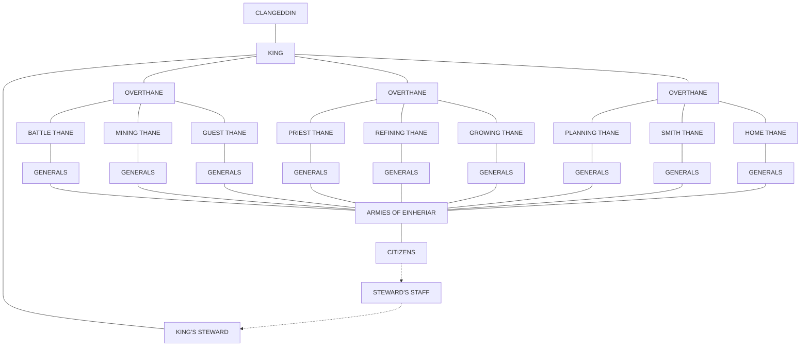

## MELODIA

**FACTOL**: As a result of the situation with Nemausus, Factol Sarin maintains a close eye on Melodia, and depends on the high-up to keep him informed of the slightest change.

**HIGH-UP**: Killeen Caine, a highly placed member of the Harmonium.

**MAYOR**: Nicolai Mabru, the nominal ruler of the town, gives ground when necessary to the Harmonium's high-up.

**FACTION MILITIA**: The enforcement arm of the Harmonium, they're as tough here as they are in Sigil.

**ORDINARY FACTION MEMBERS**: Though not as important as others in Melodia, they're also pieces of the Harmonium's machinery, and they play their part with gusto.

**NONFACTION CITIZENS**: There's precious few of these in town, and those that do live here are treated only as well as necessary.

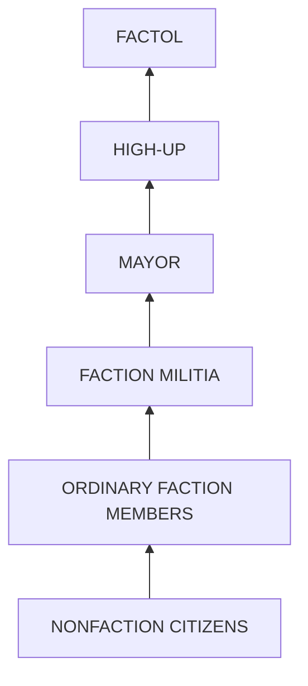

25

# ARCADIAN ADVEN+URES

**NUMBER OF PCs:** Four to six.
**LEVELS:** Low (1-4).
**PCs PREFERRED:** Thieves and rangers.
**FACTIONS:** The factions aren't involved in this adventure.
**SYNOPSIS:** The PCs are hired to retrieve a bronze dragon's egg from a formian nest.

Adventures in Arcadia often involve the conflict between law and good, and what happens when adherence to the one begins to overshadow the other. Arcadian natives are, at the heart, afraid that their perfect paradise can be tainted by the beliefs and actions of outsiders - and that fear often makes them overreact.

Though the Harmonium's often a convenient adversary, it should be noted that the Hardheads are not the ultimate collection of evil on the planes. They're just so wrapped up in their own ideas that they've got no room for anyone else's. They can be as generous and good and friendly as the next faction - they're just particularly stubborn.

## SCRAMBLED EGGS

**BACKGROUND:** For years beyond counting, there've been strange creatures living in relative harmony in Arcadia's reaches. But even in the Land of Perfect Good, there's always discord to be found. The PCs are about to stumble into some.

Dragons are notoriously heavy creatures, and when one sits on something, it tends to leave a mark. Not long ago, a bronze dragon mistakenly sat on the ground above a formian city, destroying the caverns beneath it. Even more unfortunately, one of these caverns happened to hold a queen's choice egg. The formians vowed revenge, and set their soldiers out to discover where the foolish bronze had made its lair. Once they had, they stole the dragon's egg and brought it back to their city. Now they're trying to decide what to do with it. And the dragon's looking for help in retrieving it.

**OUTLINE:**

1. **EMPLOYMENT.** While the PCS traverse the roads of Arcadia, they spy an unmistakably draconic form winging swiftly toward them, borne by the easy air of Arcadia's first layer. Without sight-enhancing magic they can't determine if it's got a rider (it hasn't) or even what color it is, but the dragon certainly seems intent on reaching the party's location.

It alights behind a copse (or a sand dune, if the PCs are in Heliopolis), and seems to disappear completely. If the party goes to investigate, they spy only the huge clawprints where it touched down. The land itself seems to be hiding where the creature's gone.

An hour or two later, the PCs are approached by a matronly woman dressed in shining bronze armor. She gives her name as "Baragarri" and attempts to enlist them in her cause. She asks them to enter a formian city to retrieve a dragon's egg, which is held hostage by the "evil insect-men." She can offer the gratitude of the dragon to which the egg belongs, and the pick of a magical item apiece from the dragon's horde if they successfully (and safely) return the egg. If asked about the dragon the PCs saw previously, she says that was indeed the dragon whose egg was stolen, and that it had sent her to contact the PCs.

The woman (actually the dragon in disguise, of course) is trying to find an alternative to her first impulse (to level the city), and she's come to the PCs to help her find one. She's hiding her anger only by a hairsbreadth; if the PCs hot-headedly decide to assault the city, she'll assume her true form and lead them to it to burn and destroy. If the PCs are of a more lawful bent and decide on a calmer course of action, she lets them go, urging them to be both quick and careful with the egg. Baragarri won't go into the city herself, saying that she's already known as the dragon's go-between to the formians, and that she'd never make it out. In reality, she's afraid she'd lose control, and she doesn't want the PCs to see a dragon functioning at the same emotional level as a human.

2. **DIPLOMACY.** Once the PCs reach the formian city, they'll have no trouble getting inside. The formians of this city, patterns of green on yellow mottled on their skins, are friendly and open to visitors. They've never dealt with attacks on their city (with the exception of the dragon), and they're willing to meet with outsiders.

26

# ARCADIAN ADVEN†URES

Here's where the PCs have to be inventive. The formians grant the PCs access to the upper city, but are loath to let them in the undercity. The PCs have to sneak in, convince the formians that it's necessary to see the queen, or find some other method to achieve their mission. One way or another, the PCs are sure to let drop that they know something about the dragon's egg.

From talking to nearly any formian, the PCs can discover that the formians have stolen the egg in retaliation for past damages: They explain that the "great winged beast" deliberately sat upon one of their great underground cities, destroying large sections and crushing a valued queen egg. To avenge their lost potential queen, the formians followed the dragon back to her lair and stole her egg.

They haven't decided yet whether to smash the egg in revenge or to hold the baby dragon hostage when it hatches. Some of them even believe they can train the young dragon as a sort of pet and powerful defender (the ant-centaurs are truly unaware of the extent of a dragon's power and strength of personality). They're not foolish, however; they've got the egg well guarded, and they won't let it go without a struggle or some sort of restitution. The PCs have to decide which tack to take — whether they're going to try to sneak the egg out, arrange for negotiation, or leave the two factions to battle it out. The formians seem more inclined toward combat than letting their prize slip through their fingers (again, they're largely oblivious to the fact that the elder dragon could destroy their city with a few well-placed blasts with her breath weapon). If this is explained to them, they'll consider taking a term of service from the dragon or half the dragon's hoard in payment for their suffering.

3. <mark>NEGOTIATION</mark>. The best of all possible courses has the PCs negotiating a settlement between the two camps. The formians are willing to meet with the dragon outside the city, in a location of their choosing. The PCs are to serve as moderators for the two sides, both to keep the dragon from flying into a rage and to keep the formians from swarming her in anger. It'll be a tough negotiation, as the dragon demands her egg back, while the formians refuse to consider these demands without compensation for the lost queen. Both parties agree that the situation as it stands is intolerable (both being lawful and good creatures), and that while negotiation is an excellent tactic, there's only so much a reasonable being can stand. They set a time limit of one rotation of the Orb of Day and Night.

The bargaining lasts until well into the night. The PCs have to make Charisma and Wisdom checks every so often (when the debate stalls or one of the parties makes a particularly telling point), but the DM can reward good role-playing and convincing arguments by not requiring them to make the die rolls at all. One way or another, the session ends when the Orb of Day and Night sweeps its arc across the assemblage, bringing a new day with it. If no settlement has been reached, the dragon turns to the PCs, politely thanks them for their efforts, and pivots back to attack the formians. The formians respond, throwing themselves whole-heartedly into the battle. At this point, the best the PCs can do is get out of the way.

4. <mark>RESOLUTION</mark>. Depending on how the PCs have handled the adventure, they may have made some powerful friends or some vicious enemies. If they play their cards right, they can be recognized as excellent mediators by both sides, who'll be happy to recommend the PCs for additional crises as they develop. The dragon, of course, can be both an intelligent and powerful ally, and she's been in Arcadia long enough to know some of the behind-the-scenes manipulations going on. The formians extend an invitation for the PCs to visit any time, and may even make them official members of this colony.

On the other hand, if the PCs fail to retrieve the egg, the dragon is not above sullying their names as ineffective bumblers. If the PCs stole the egg (that is, took it from the formians without their permission), the formians revile them far and wide as abusers of hospitality. Only if the PCs take the moderate middle course of negotiation can they come out ahead.

✦ 27 ✦

# ARCADIAN ADVENTURES

## CHASE

**NUMBER OF PCS:**

One or more.
**LEVELS:** Medium (5-9).
**PCS PREFERRED:** Any.
**FACTIONS:** The Harmonium and the Anarchists both have a stake in this adventure.

**SYNOPSIS:** The PCs pursue a thief — and supposed Harmonium member — through Arcadia, only to find that the Harmonium takes care of its own.

**BACKGROUND:** A thief in Sigil had best be careful, or had better have some high-ups to back her up when she slips. This adventure involves one who's got nothing but her native wits to keep her alive. She's an Anarchist who goes by the name of Alina Startread (Pl/♀ human/T11/Revolutionary League/CN). Unfortunately, she's allowed her path to cross that of the PCs, and they're now hot on her heels. Still, she's got some talents they don't know about, and she's going to use them all to escape the PCs.

**OUTLINE:**

1. **PURSUIT.** The PCs are pursuing a criminal in Sigil. The reason they're doing this is best left to the DM: Perhaps the thief has stolen something from the PCs, or the PCs have been set on her trail by other interested parties in Sigil. Whether they're doing this for personal reasons or because they've been hired to do it, they're on her trail. In an extended scenario, the PCs might search for the thief's identity for weeks or months before they find her. Despite any other information they discover, they should not learn she's an Anarchist.

Regardless of the situation, they find themselves chasing her through the streets of Sigil, though it's not necessarily a high speed chase. She knows she's being pursued, and the PCs know she's the target of their pursuit. She's surreptitiously putting on Harmonium insignia as she moves, and she's leading the PCs straight to Harmonium headquarters! Alina's been masquerading as a Harmonium member for a few months, finding it a perfect cover for her larceny; after all, who's going to believe that one of the Hardheads is deliberately breaking the law?

As she reaches the door, she calls back to the PCs, "See you in Arcadia!" Naturally, it's not the smartest thing in the world to announce where a wanted body's going, but she's confident the PCs can't get to her there — considering that they'll probably have to go through a contingent of Harmonium guards to get to her. She plans to get to Melodia and lie low for a while, at least until the PCs get off her back.

She's so confident in her plans that she doesn't even tell the Harmonium guards that the PCs are chasing her; she figures they'll drop the trail once they see where she's gone.

The Harmonium guards won't believe that the charming young woman who just came through is a criminal, and they won't lift a finger to stop her. Arguing with the guards is futile; they've seen Alina come and go from Harmonium headquarters several times, and she's been nothing but a perfect guest. Should the PCs persist with their accusations to the point of annoying the guards, they may be arrested for "disturbing the peace" or "false allegations" or any number of other offenses the Hardheads can devise.

If the PCs just say that they intend to travel to Arcadia through one of the Harmonium's portals without mentioning the thief, they're questioned about their intentions and purpose in visiting the plane, but are eventually granted access to the gate. (As much as the Harmonium would like to completely restrict access to Arcadia, the faction knows it'd never get away with it.) If the PCs decide to avoid Harmonium entanglements, a little digging can get them the location of another gate to Arcadia from Sigil.

Regardless of how the PCs get to Arcadia, they wind up in Abellio, near the realm of Marduk. Obviously, it's going to be nearly impossible to pick up a trail on an infinite plain, but fortunately it turns out to be fairly easy here — planar travelers (or Marduk kindari) the PCs run across mention that a single Harmonium woman matching Alina's description passed their way not too long ago . . . maybe an hour or two if the PCs followed her immediately. She's headed straight for the border between the layers, to the Harmonium checkpoint.

28

# ARCADIAN ADVENTURES

2. <mark>AT THE GATE.</mark> Of course the Harmonium's not going to want to let the PCs through to the second layer. Once the PCs arrive at the checkpoint, they discover this themselves. The guards (Pl/var/F4-8/Harmonium/LG or LN) are deadly serious about repelling invaders. Only Harmonium members and Arcadian petitioners are allowed through. The guards freely admit that Alina came through, that she's headed for Melodia, and that they're not going to let the PCs follow. They'll let Harmonium members through if they've got a good reason to visit Melodia, but not even a voucher for the other members of the party gets those berks through. There're enough guards here to make fighting them an invitation to suicide.

As the PCs leave, one of the guards calls after them, "Maybe you oughtta try the tunnels!" This is greeted by laughter from the other guards.

If the PCs do any research at all, they'll discover that secret tunnels link the layers, but these tunnels are guarded by fearsome creatures seemingly built from the darkness

itself. If the PCs spread some jink around, they can learn of a tunnel not too far away — unfortunately, it's an ill-fated one (at least according to the PCs' source), so it's a chancy bet at best.

3. <mark>INTO THE TUNNELS.</mark> If the PCs take the chance and head through the tunnels, they'll blunder about for a bit before encountering the guardians of this particular passage — two buseni. The buseni take the forms of an upright human and an extremely large snail (though it's much, much faster than the average snail). It's the snail who does the telepathic communicating, though in typical buseni fashion, it allows the PCs to make the first move toward contact.

If the PCs attack, the buseni wade in gladly. They're designed to protect Buxenus from invasion, not negotiate, so they're just as happy to fight. However, they're willing to listen to reason, and carefully consider any explanations the PCs offer. Here, the PCs get better results if they're truthful; the buseni are outraged that the thief would be allowed to pass through freely while those pursuing law and goodness are stopped. If convinced that the PCs have a valid reason to reach Buxenus, the buseni let them pass without regard to alignment — providing none of the party's evil.

4. <mark>FINDING THE THIEF.</mark> Once they reach Buxenus, it's not much of a trip to Melodia, the city of the Harmonium. Unless they disguise themselves, the PCs are not going to be too welcome in the city. Still, they can arrange a meeting with Killeen Caine (Pl/♂ half-elf/W15/Harmonium/LN), a high-up of the Harmonium, or

find someone who can connect them with him, though this takes some time.

Caine considers the evidence

the PCs present very carefully, listens to their requests, and denies all of them. Lost in thought, he returns to the Harmonium's headquarters in Melodia, and sends out an answer, of sorts, later that day. Alina's body is sent out to the PCs, with all the stolen possessions still on it. The Harmonium escort with the body warns the PCs to say nothing of this matter, for to besmirch the name of the Harmonium is tantamount to declaring war on the faction. With this warning delivered, the city of Melodia closes itself to the PCs.

5. <mark>EPILOGUE.</mark> What happens after this adventure is over is entirely dependent on the actions of the PCs. The Anarchists aren't going to take kindly to one of their members being hunted down, while the Harmonium isn't going to want it known that they were so thoroughly befuddled by an infiltrator. In addition, if the PCs capture Alina without establishing her guilt, the Harmonium's going to be looking to get her back. Both factions will probably want to silence the PCs in one way or another, whether through bribes, threats, or outright attacks.

# ARCADIAN ADVEN+URES

## DISCOVERY

**NUMBER OF PCs:** One to six.
**LEVELS:** High (10+).

**PCs PREFERRED:** Paladins and priests will probably be most influential.

**FACTIONS:** The Harmonium is most involved with this adventure; every other faction would love to get a hold of this kind of information.

**SYNOPSIS:** The PCs, doing a favor for a friend or employer, discover that the third layer of Arcadia's gone missing.

<mark>BACKGROUND:</mark> As described earlier in this book, Nemausus, the third layer of Arcadia, has slipped over to Mechanus because of the interference of the Harmonium. The secondary factol of the Harmonium, Killeen Caine, is planning a new expedition to take back Nemausus. His methods include using the reconditioned creatures of the training camps to storm the layer.

Well, there're people who've noticed the layer's absence, or at least the strangeness involved in the planar shift. An agent from the PCs' faction has gone to investigate this planar shift, and has only recently returned. The PCs' factol, very worried, calls them for help.

<mark>OUTLINE:</mark>

1. <mark>A STRANGE CHANGE.</mark> The PCs have recently received a request from one of the PC's factols, delivered as *extraordinarily* urgent. At the designated meeting place, their contact (a high-up in the faction) informs them of her agent's mission and subsequent condition. She asks the PCs to investigate exactly what it was that drove her agent to this condition.

The agent should be a character with whom the party is moderately familiar. This basher's a jolly fellow, with a chaotic streak a mile wide — or at least he was. When the PCs come to see him, he's much more subdued, his emotions in severe check. In fact, his once-rumpled and stained clothes have been replaced by a modest gray, and he's become impeccably groomed.

The dark of the matter is that he's been conditioned by the Harmonium's camps, taught to repress anything that doesn't promote law. When he got the chance he escaped — but now he's far more lawful. Still, his chaotic side breaks through occasionally, and in far more intensity than it ever did before. The poor berk's become unhinged. While he's in his lawful mode, he'll try to pretend nothing's wrong, as he appreciates learning to control himself. When his chaotic side breaks through, he'll try to relate everything he can, but his information's more jumbled than not. When the PCs leave, they should have only the vague idea that there's something that subdues chaos hidden away on Arcadia's third layer.

2. <mark>TRAVEL.</mark> The only way to discover the dark of it is to go and find it out. The PCs travel to Arcadia, seeking out the passage through the first layer to the second. Here they encounter Arcadian einheriar patrols, buseni, formians, and whatever other confrontations the DM has up his or her sleeve. None of these are necessarily important until the party reaches Buxenus. Once they reach the second layer, they're going to begin looking for the gate to the third layer, or they're going to question the natives about the "chaos destroyer" in Nemausus. They're also going to avoid the constant Harmonium patrols who sweep the layer for unauthorized berks.

Nobody has the faintest idea what the PCs are asking about. If the party thinks to use magic to see if the locals are lying, the answer's still negative. However, the petitioners of Azuth and Heliopolis can point out the way to the third, if the PCs're still interested in going there. As another option, the PCs may encounter a proxy of Meriadar, who realizes their purpose here and decides to show them the way.

3. <mark>TRAINING.</mark> On the way to the gate to Nemausus, the PCs run across one of the Harmonium's training camps. The camp, laced around with metal walls, has the Harmonium's symbol engraved into the gate; a watchtower rises above the grounds, with guards keeping a keen eye both on the inmates and those who would travel here.

The PCs can stop off to investigate, if they so desire. They probably will, considering that inside are the sounds of hundreds of different creatures howling, screaming, or making any number of different noises. If the party looks over the walls, they'll see chaotic creatures being forced into artificial routines — eating, drinking,

✦ 30 ✦

# ARCADIAN ADVEN+URES

and sleeping in a pattern determined by their Harmonium guards. Any being demonstrating chaos is gently remonstrated. Some creatures are more incorrigible than others, and thus require a heavy beating to teach them the error of their ways.

It seems unnatural to see wood elves formed into ranks, or gibberlings standing in neat lines, or gremlins drilling like an army. The entire camp, to the PCs' eyes, should feel like a perversion of the natural order, with the instincts of creatures repressed and restrained to fit more perfectly the vision of the architect of the camp.

No matter what precautions the PCs take, their presence is noted by the Harmonium guards (Pl/var/F5-12/Harmonium/LN). The more precautions the PCs take, the longer it takes them to be noticed; but they will eventually be found. And when they are, a group of the Harmonium guards'll give chase. If the characters are thinking of stopping to fight, remind them that killing these guards may very well bring down the wrath of the entire faction on the party's collective head.

Conveniently, the guards' chase drives the PCs to the gate to the third layer. It's recognizable for what it is (another plinth, though if the PCs stop to examine it they'll notice gearlike shapes embedded in it), and the PCs are well aware of the moment they pass through the gate — just as they're well aware when they arrive on the other side that they're not in Arcadia any more.

4. <mark>REALIZATION</mark>. It might give the party pause to realize that the third layer of Arcadia's no longer in Arcadia — it's in Mechanus. And standing nearby is another Harmonium-inscribed palisade, its doors burst asunder. If the PCs go inside, they'll find a Harmonium overseer who's gone completely over the edge (Pl/♀ human/W8/Harmonium/LN). She's regimenting nonexistent chaotics, and she'll do her level best to impress the PCs into her chaos-removal program.

If the PCs don't go inside, they can escape through the Labyrinthine Portal, easily losing the Harmonium guards who followed them. When the party goes to report its findings, their contact tells them to keep quiet about what they've found, as the Harmonium would immediately declare

war on any group that spread the information around. She tells the PCs that they'll be rewarded for their efforts, but that they should never let it be known that the Harmonium is apparently responsible for losing an entire layer of the plane — unless they're keen on having the Harmonium hound them to the edges of eternity.

This gives the PCs some insight into faction politics, if they didn't have it already. It also demonstrates to the PCs that information is a viable and necessary part of the politics of Sigil. With these facts, the PCs should realize they've got a powerful — if extremely dangerous — bargaining chip with the Harmonium, one the Harmonium will do nearly anything to eradicate. And other factions, if they get wind of this, will do nearly anything to learn the full dark of what the PCs have discovered.

5. <mark>EPILOGUE</mark>. Depending on how the PCs handled it, the Harmonium's either going to owe them a tremendous debt or is regard them as mortal enemies. However, if they play their cards right, the Harmonium can't do anything to them without completely tipping its hand and revealing itself as a group of leatherheads who lost a whole layer to another plane. Of course, any dealings the PCs ever have with the Harmonium in the future will be tense, but the high-ups may (eventually) recognize the dedication and abilities of the PCs, and might even try to recruit them — if for no other reason than to keep them silent.

PORTALS AND PATHS

# ARCADIA

## ABELLIO

*   Citadel of the Cloud King
*   Marduk $\rightarrow$ Prime
*   Citadel of the Wind King
*   Citadel of the Rain King $\rightarrow$ Sigil
*   Mandible $\rightarrow$ Sigil
*   Fortitude, Outlands
*   Citadel of the Lightning King $\rightarrow$ Prime
*   Izanagi and Izanami $\rightarrow$ Mount Celestia
*   Prime $\rightarrow$ Mount Clangeddin
*   Mount Clangeddin $\rightarrow$ Dwarven Mountain, Outlands
*   The Ghetto

## BUXENUS

*   Melodia $\rightarrow$ Sigil
*   Azuth $\rightarrow$ Astral
*   Harmonium Training Camps
*   Heliopolis $\rightarrow$ Elysium
*   Prime $\rightarrow$ Baator
*   Meriadar's Realm $\rightarrow$ Acheron
*   NEMAUSUS, Mechanus

**Planar Boundary**     
**Portal** .....................
**Path** ————————

An intricate network of roads connects every major site in Arcadia.

Dwarven Mountain, Outlands

# WINDS DANCE IN PA++ERNS: +HE DIC+A+ES OF PARADISE, LAWS OF HARMONY.

PERFEC+ HARMONY, PERFEC+ ORDER, PERFEC+ VIR+UE — HOW COULD ANYONE DEFY SUCH +ENE+S? ONLY +HE EVIL AND MISGUIDED RESIS+ +HE CALL OF GOODNESS AND LAW, AND I+ FALLS +O +HE RIGH+EOUS +O SHOW +HEM +HE ERROR OF +HEIR WAYS.

HERE’S +HE CHAN+: THIS BOOK IS FOR +HE DUNGEON MAS+ER ONLY.

PLANESCAPE, the Lady of Pain logo, and the TSR logo are trademarks owned by TSR, Inc.
©1995 TSR, Inc. All Rights Reserved.

2607XXX1903

# PLANE SCAPE™
## CAMPAIGN EXPANSION

# PLANES OF LAW

# BAATOR

# BAATOR

## CONTENTS

*   <mark>THE DEPTHS OF DEPRAVITY</mark> 2
*   How to Get In 4
*   How to Get Out 5
*   Physical Conditions 5
    *   The River Styx 6
*   Magical Conditions 6
    *   Spell Keys 7
    *   Power Keys 7
*   <mark>DENIZENS OF THE PIT</mark> 8
*   The Powers 8
*   The Proxies 10
*   The Petitioners 10
*   The Baatezu 10
    *   The Blood War 12
    *   The Dark Eight and the Lords of the Nine 12
*   Other Encounters 13
*   <mark>LAYERS OF THE PIT</mark> 14
*   Avernus 14
*   Draukari 16
*   Dis 17
*   Minauros 17
    *   Jangling Hiter: City of Chains 18
*   Phlegethos 19
*   Stygia 20
    *   Ankhwugaht 21
    *   Sheyruushk 22
*   Malbolge 22
*   Maladomini 23
    *   Grenpoli: City of Diplomacy 23
*   Cania 24
*   Nessus 25
*   <mark>BAATIFIC ADVENTURES</mark> 26
*   Hot Time in Darkspine 26
*   Desert's Night 28
*   Inner Workings 30
*   <mark>BAATOR: PORTALS AND PATHS</mark> 32

## CREDITS

**Designer**: Colin McComb ✦ **Editor**: Dori Hein
**Cover Artists**: Henry Higginbotham (3-D background), DiTerlizzi (color inset), Robh Ruppel (planar photography)
**Interior Artist**: DiTerlizzi ✦ **Conceptual Artist**: Dana Knutson ✦ **Cartographer**: Rob Lazzaretti
**Graphics Coordinator**: Sarah Feggestad ✦ **Art Coordinator**: Peggy Cooper
**Electronic Prepress Coordinator**: Tim Coumbe ✦ **Typography**: Angelika Lokotz
**Border Art**: Robert Repp ✦ **Graphic Design**: Dee Barnett, Dawn Murin ✦ **Proofreader**: Michele Carter

TSR, Inc.
201 Sheridan Springs
Lake Geneva
WI 53147
U.S.A.

2607XXX1904

TSR Ltd.
120 Church End
Cherry Hinton
Cambridge CB1 3LB
United Kingdom

ADVANCED DUNGEONS & DRAGONS, AD&D, and MONSTROUS COMPENDIUM are registered trademarks owned by TSR, Inc. PLANESCAPE and the TSR logo are trademarks owned by TSR, Inc. All TSR characters, character names, and the distinctive likenesses thereof are trademarks owned by TSR, Inc. © 1995 TSR, Inc. All Rights Reserved. Printed in the U.S.A. Random House and its affiliate companies have worldwide distribution rights in the book trade for English-language products of TSR, Inc. Distributed to the toy and hobby trade by regional distributors. Distributed to the book and hobby trade in the United Kingdom by TSR Ltd. This material is protected under the copyright laws of the United States of America. Any reproduction or unauthorized use of the material or artwork contained herein is prohibited without the express written consent of TSR, Inc.

The Pit, the Nine Hells, the Nine Layers, the Depths of Depravity. These names and many others mark this place, but they all mean one and the same: the ultimate plane of law and evil, the epitome of cruelty and corruption. Baator is arguably the worst place in all the multiverse. Sure, there's the Abyss and Acheron and all the other evil planes, but they really don't hold a candle to Baator. The Abyss may be infinite, stretching from one end of eternity to the other, full of tanar'ri and other horrific beasts, but

# THE DEPTHS OF DEPRAVITY

all they do to a body is kill it. Once a berk runs into a tanar'ri, the choices are simple: Stand and fight, or give it the laugh. And Acheron isn't much more than one big battlefield. If a sod doesn't want to fight an endless

war, the solution is simple: <mark>Don't go.</mark> Carceri's a prison, all right, and one of the worst. The petitioners are all lying berks, but once a cutter recognizes this, the denizens are relatively easy to deal with, at least in comparison to bargaining with baatezu. Gehenna's a plane without charity or

mercy, without even a glimmer of what those qualities mean. The Gray Waste is a place of sadness and despair, somewhere to go if a berk feels there's no point to anything anymore. Pandemonium will only drive its visitors crazy with loneliness.

All these places are evil in their own right, but none really compares to the sheer vileness of Baator. The fiends here are more cunning, more subtle, and far more dangerous than the other fiends of the Lower Planes. Sure, the tanar'ri are fierce, and the gehreleths and yugoloths are powerful. The difference is that the baatezu are *intelligent*, and they delight in peeling those unlucky enough to fall into their clutches. A berk can never tell when a baatezu is going to release him, kill him, or hunt him later. Every baatezu of any power whatsoever has its own agenda, and each is willing to use pawns (read: adventurers, the unlucky sods) to obtain its goals.

> TELL YOU WHAT, BERK.
> I'LL MAKE YOU
> AN OFFER
> YOU CAN'T REFUSE.

> — ZATOSK,
> RED ABISHAI,
> TO A PLANEWALKER
> NEW TO BAATOR

Naturally, Baator's the first place the clueless want to go. Maybe it's the same sort of attraction candleflame holds for moths; whatever, clueless primes are leatherheaded enough to want to venture into Baator's depths. They are correct when they think they can usually come here without being slaughtered outright, unlike if they entered the Abyss. Trouble is, all of them want to prove they're smarter than any baatezu. The clueless figure they can get in, fleece a high-up baatezu, and give it the laugh before it catches on. Well, bar that. Any blood worth his salt knows the baatezu aren't to be trifled with. In the same circumstance, a tanar'ri will seek vengeance right away; a baatezu, however, sits and stews and plans, showing up when the cross-trader who peeled the fiend least expects it. A baatezu is perfectly willing to wait until the cheating berk is on his deathbed, make an appearance, and drag the old man down to the lowest pit in the Nine Layers for an eternity of suffering. A simple word to the prime excited about rushing off to Baator should suffice: Don't. It should suffice, but it won't.

✦ 2 ✦

Baator is shaped like a mountain turned on its head. There's nine layers to the plane: Avernus (the broad, topmost layer), Dis, Minauros, Phlegethos, Stygia, Malbolge, Maladomini, Cania, and Nessus (the bottom tip). Each layer has its own distinct character. From the icy caverns of Cania to the flaming hot gorges of Phlegethos, Baator's a place of extremes, none of them good. The broadest part of the plane is found on the first layer of Avernus, the base of this inverted mountain. Each layer a cutter descends takes him farther along this peak, giving him a better view of the plane as a whole. The layers fit together like the pieces of a puzzle, and each subsequent descent allows a traveler to see how the puzzle comes together.

The chant is that anyone who makes it to Nessus (the ninth layer) under his own power will be granted the status of a cornugon or higher level baatezu. No one's been that far and returned to tell the tale, but it sounds plausible, knowing the baatezu. If people actually have made the attempt, perhaps they

really have turned into baatezu without going through the intervening steps most petitioners must follow. Or perhaps they just died in the attempt.

## ✦ HOW ✣ GE+ IN ✦

Getting into Baator is a bit harder than a cutter might think. Baator's an extremely well defended plane, mostly because the tanar'ri and their infinite hordes often come calling. The best route in is via a gate located in Ribcage, that "quaint little village" on the edge of the Outlands. The Cursed Gate, as it's called, is in a heavily fortified part of town; in fact, it's accessible only through the citadel of Lord Paracs, the ruler of Ribcage. Getting to the gate is the easy part. Getting *through* is another matter altogether. Travelers to Baator need an official, written invitation from one of the Lords of the Nine, the mysterious rulers of the plane. And obtaining an invite, naturally, requires a good reason (to the baatezu), lots of jink, and knowing which high-up to request it from. The warrant then theoretically allows safe passage through Baator's layers until the traveler reaches his destination. Theoretically, of course.

Truth is, the Lords of the Nine have more important matters to attend than making out invites to foolish sods wanting to travel through their lands. Thus, the lord of Ribcage and the baatezu guards on this side of the gate have come to a tidy little agreement, one that profits both sides and doesn't bend the laws too far. Basically, the two parties bob travelers through the gate for whatever they can get, giving the hapless people an "Official Invitation" in return. Ironically, lesser baatezu respect this worthless piece of paper, giving those who bear it a wide berth; they fear the supposed power behind the invite. Greater baatezu who know about the arrangement find it amusing, maliciously waiting for the moment when those involved in this little cross-trade attract the attentions of the true Lords of the

Nine. None of them have been stirred by the falsified invitations yet, but time will tell.

There are, naturally, other ways to get into the plane. The most obvious way is by finding one of the portals in Sigil, the City of Doors. The portals to Baator, unlike those that lead to various other lawful planes, tend to vary in a cunning pattern, moving from one location to another. The pattern appears to be random and haphazard, but sages say it's just a reflection of the twisted logic of the baatezu. These savants also say the portals can be found easily, once a berk knows the pattern. Sadly, most of those who claim to have discovered the secret of the portals have either suffered grisly deaths soon thereafter or disappeared altogether. The known, fixed portals into Baator are always heavily guarded, and the gods help the berk who tries to burst through unannounced!

There's also the occasional random portal that the baatezu can't always guard. Of course, the problem with such portals is that their very randomness makes them difficult to locate. If a cutter were to discover a way to reliably find them, he could surely find buyers for the information and live handsomely — at least until the baatezu found him and shut him up.

✦ 4 ✦

# ✦ HOW TO GET OUT ✦

This is, of course, what most berks *really* need to know, much more so than how to get in. Once people have traipsed across even a small portion of the Nine Layers, they'll surely be ready to find a way out. Most berks who do escape Baator (and strangely enough, a fair percentage of those who go in do leave the Nine

Hells) are battered physically, mentally, emotionally, or spiritually. Most often they leave with a combination of such scars.

Very few make it out of Baator without making deals with the baatezu for safe escort. These deals often involve exchanges of some sort, whether they're for material or less tangible assets. Unless a cutter's unusually canny, deals made with a baatezu eventually put a traveler in the dead-book or, worse yet, pressed into service as a lemure.

A safer bet for any blood, then, is to look for a way out on his own. Like everything else in these fiendish layers, however, this is far easier said than done. Most of the known gates are two-way and are extraordinarily well guarded, preventing both entrance and egress. Anyone hoping to escape via these gates had better think twice, because the baatezu won't when they catch the poor sod. Most of these portals are built inside the fortresses of the major fiends of the layers. No one knows if the fortresses sprang up because of the portals, or if the portals just happened to appear in the fortresses after construction. 'Course, no one's really asking.

Fortunately, there are fiends and other cutters who're willing to sell maps to a wayfarer. As with the portal maps in Sigil, it's buyer beware. The map might be bogus or (worse yet) it might be accurate, with the seller rushing off to notify its superiors that some poor sod's taken the bait.

A traveler has to cover the loopholes when making an agreement with a baatezu. The fiend won't break its word, provided someone can make a contract binding. When a map's bought from a baatezu, it'd better have a promise attached to it: that the fiend won't betray the berk, and that it won't cause him to be unduly noticed on Baator. A buyer ought to make the conditions of that promise as legally binding as possible so there aren't any loopholes the fiend can wiggle through.

Of course, an adventurer can also look for one of the shifting gates or try his luck on the River Styx. Neither of these methods is particularly appealing, since no one's completely sure where either ends up. The Styx will deposit a sod on one of the other Lower Planes, though, while a shifting portal is just a shot in the dark.

Although there are only a few reliable ways of getting out of Baator, an imaginative plane-hopper should be able to figure a way — at least she'd better. See, if she can find a way to sneak in but she can't figure a stealthier way out, she's fiend-meat.

# ✦ PHYSICAL CONDITIONS ✦

Each of Baator's nine layers has a discrete physical aspect, and each offends the senses in distinct ways. For example, fireballs in Avernus appear, dart around, and explode at seemingly random intervals. Their manifestation is heralded only by a slight hissing and the sudden stench of sulfur. Sometimes the balls explode close enough to cause damage, or they may even explode directly on a person. No one seems to know what causes the fireballs, and only the Guvners have bothered to check. Results are, sadly, inconclusive. The baatezu might know, but since they're immune to fire, they don't care enough to tell anyone.

The ice of Cania and the sleet of Minauros are features of the plane itself and are vigorously regulated; as such,

✦ 5 ✦
[signature: t.e.f.]

there really isn't "weather" on Baator. The Pit is a lawful place, which means nothing's extraneous on this plane of stinking evil. Any weather patterns that arise do so for a reason.

The rules for getting around each of the nine layers are found in the description of that layer. Also noted is any damage explorers might take if they don't travel right. However, there are three basic rules for traveling through Baator that apply to all layers. Echoing the Rule of Threes, these laws are as follows:

* *Rule #1.* DON'T. If a berk simply has to go there, refer to Rule 2.

* *Rule #2.* Hire a guide rumored to be trustworthy who also knows his way around the Nine Layers, or just the one layer the traveler's business is on. Note that finding a reliable guide is a herculean task in itself.

* *Rule #3.* Get out as quickly as possible, and don't stop to talk to the natives.

Anyone violating these rules deserves whatever he or she gets. Baator's not a friendly place, and though its denizens might act nice at first, they're natives of the plane of law and evil for a reason. If business is really that pressing, a body is best advised to bring quick wits, a ready blade, and a mind brimming with spells.

# THE RIVER S+YX

The polluted waters of the River Styx enter Baator in exactly three places: Avernus, the first layer; Stygia, the fifth layer; and Nessus, the ninth and lowest layer. Only a few know of the tiny stream that flows into Nessus, and this route is jealously guarded by pit fiends, gelugons, and cornugons. Anyone entering Nessus via the Styx who isn't a baatezu of their level or who isn't in the company of one is immediately slaughtered - no questions asked.

Some say the Styx has its headwaters in Stygia. It's true the waters do flow through the Lower Planes and return to Stygia, where there's an entrance and an egress for the Styx on the fifth layer. The water grows progressively more polluted, for it starts off with all the detritus and flotsam from Stygia and then picks up more debris from the Lower Planes. Ultimately, this pollution comes full circle and is deposited on the icebergs of Stygia when the waters return.

The waters of the River Styx are exceedingly potent in Stygia. The merest drop of fluid from the river forces a traveler to successfully save versus spell at -4 or forget everything he's ever learned. If this roll is unsuccessful, an additional save versus paralyzation is required to see if the unlucky berk retains his motor skills and speech. (And if

this save isn't made and he's left behind, odds are he'll turned into a larva. If he's lucky, maybe he'll be taken to the Gatehouse in Sigil, there to be "treated" for his "illness" at the asylum.) If the first save is made, the traveler still forgets the events of the past year. Even the most powerful magical interventions have only a 50% chance to return lost memories to those who lose their minds to the Styx.

In Avernus and Nessus, the usual rules for the Styx apply: A touch or taste of its waters, and the victim must save versus spell or lose knowledge of his past life. Even a successful save renders the past day forgotten.

The River Styx remains an excellent way to get into and out of Baator. Unfortunately, it only winds through the Lower Planes, so anyone hoping to get away from a really bad situation had better look somewhere else first. Using the Styx to escape Baator's dangers is like jumping from a high cliff and hoping to find cushions below - and nothing's there but rocks.

# MAGICAL CONDI+IONS

Being on the lawful side of the Great Ring and being one of the Lower Planes, there's some special conditions to spellcasting on Baator. Curiously, illusion and phantasm spells don't suffer any penalties here, despite the chaotic nature so often ascribed to them. The dark is the baatezu and the other natives of the place work so hard at deception that these spells are required for simple survival in the Nine Hells.

CONJURATION/SUMMONING. Attempting a conjuration on Baator is a tricky matter at best; the baatezu and the powers here don't much like the thought of some berk disrupting the natural order or, worse still, controlling one of their ilk. Also, conjuration and summoning spells on Baator require a rigorous ritual, including a binding cast upon the creature to be summoned. If the binding's not perfect, the summoned creature's under no obligation to obey the spellcaster. Unfortunately, however, the summoned creature is also stuck here, so it's likely to vent its frustrations on the berk who brought it to Baator. To check the correctness of the binding, the caster must make a successful spellcraft proficiency roll or, if he doesn't have that, a successful Intelligence check at -5.

DIVINATION. On Baator nothing's really cheery or happy. Any divination spell cast here has a grim tone to its result, and the news is presented in the worst possible light — usually involving the appearance of fiends on the scene. Of course, Baator being one of the planes of law, there's going to be some kernel of truth in the divination's result. Something bad is always attracted by divination spells on Baator;

6

those who cast these spells are practically begging for trouble. Roaming fiends are naturally drawn by that kind of magic. Of course, priests casting divination spells suffer the same penalties as always for attempting to cast spells on a plane that's not their power's home.

The keys of the first three layers almost never change. Those of the next three (the heart of Baator) change regularly every 100 years or so. Lastly, the remaining three layers switch their keys like the portals into and out of Baator — without apparent rhyme or reason — but with some pattern. It's useless to list what the keys are because they'll be different by the time any berk with this information gets there.

*Necromancy.* Necromantic spells that grant life or healing perform badly on Baator; the powers living here aren't interested in beneficial magic. Those who cast these spells must make a save versus spell to see if their magic succeeds; if the save fails, so does the spell. On the other hand, necromantic spells that cause damage or pain or control the undead perform exceptionally well; they are actually cast as if the spellslinger were one level higher.

*Wild Magic.* Wild magic is diminished on Baator. All wild mages are reduced by one level per layer while here; thus, a 5th-level mage in Dis (the second layer) becomes a 3rd-level mage. However, this mage would still have the proficiency slots of a 5th-level mage. If the spellcaster were to travel to Stygia, the fifth layer, he wouldn't be able to cast any spells at all. What's more, all wild-magic spell effects above 4th level simply fail. The spells aren't forgotten (though a spell still disappears from memory if a caster attempts to cast it), and they can be used normally after the mage leaves the area.

## POWER KEYS

The power keys on Baator are those granted by the gods of the Nine Layers themselves. The deities hand out the keys to whoever they think will give them an advantage. Every sod who thinks she's got a key better be sure it's actually the real thing, that it's granted by her power. Since the gods here end up trying to bob each other, false power keys are often handed out to rival powers' priests. These keys range from the nonfunctional to the embarrassing to the potentially deadly. Priests of the powers who dwell on Baator are thus advised to make very sure they've got the right key.

*Elemental.* As on all the Outer Planes, elemental magic is altered on Baator. There are varied effects throughout the plane for elementalists; for example, on Cania, the layer of ice, water magic is intensified while fire magic is impossible to call forth without a spell key. Likewise, Phlegethos's fiery nature makes it extremely difficult to cast water-based spells. Avernus is good for fire and earth, while Cania works for air and water. The Dungeon Master must judge the circumstances for each elemental spell based on what layer the party's on.

The power who gives out the key, whether a true key or not, naturally determines when, where, and under what conditions a key functions. Usually, a key works best in the deity's realm, but it's effective all over the power's layer. More powerful keys function throughout Baator, but these are exceedingly rare.

The most common spheres covered by the power keys of Baator are Charm, Combat, Necromantic, Law, Thought, War, and Wards. The powers will occasionally grant keys to other spheres.

A power key most often resembles the unholy symbol of the deity that made it, or it is carved from the bone or spirit of a petitioner of the plane. If it's a false key, there's usually something just slightly askew with it; if a body knows what to look for, there might be some evidence that'll save a priest or two. As a matter of fact, it's a good idea to look closely at everything on Baator before sealing any bargains or making any judgments. It could save a berk a lot of grief.

## SPELL KEYS

The spell keys on each layer are fairly easy to remember, but they aren't always easy to discover. On Avernus, any spell can be cast with a simple key: a chunk of obsidian from the River of Blood that flows through the explosive plain. Each layer requires progressively more keys (3 for Dis, 9 for the third layer, 27 for the next, 81 for the one after, and so forth) as a traveler descends down the pit until by Nessus, the final layer, it almost seems that every spell requires a specific key. This ain't the case, of course, but there's so many keys to remember in Nessus that the few berks who make it to the lowest layer don't even bother with magic while they're there.

✦ 7 ✦

Baator and the baatezu are inextricably linked, but that's not to say there aren't other beings that call the Pit home. Some of these creatures are relatively harmless, while others could make a go at a pit fiend and live to tell

# DENIZENS OF THE PIT

about it. There're monsters living in the cracks of the rocks in Avernus, and there're those swimming in the Styx. In Maladomini, there are denizens living underneath the ruins that make even the fiends leery. There are also the shapes frozen under Cania's ice — shapes of creatures whose names are best left unspoken.

The population here isn't made up of just baatezu, though the fiends are the most prevalent. Living on Baator are also some genuinely evil planars, petitioners doomed to this land, and powers and their proxies. Each layer's inhabitants are

proud of their ability to withstand the suffering their home inflicts, believing it makes them stronger and better equipped for marching forth to conquer other planes. They wear their hardship like a badge, daring others to outdo them. Regardless of who or what they are, every Baator resident's got attitude. Whether this perspective is a byproduct of the plane or an innate attitude of the denizens, one thing's for certain: Both the plane and its inhabitants are downright rotten. Both are tough and brutal, and no one here takes no for an answer.

RUN, PREY, RUN!

— A KYTON OF JANGLING HITER

## ✦ THE POWERS ✦

There's no surfeit of powers who make their home on Baator. Many of those who do aren't even human. Among these are Bargrivyek of the goblins, Kurtulmak of the kobolds, and Sekolah of the sahuagins. There're also powers worshiped mainly by humans, but they've got some inhuman followers as well. These deities include Set of the Egyptian pantheon, Hecate of the Greek (she keeps her secondary realm here — her primary realm is in the Gray Waste), and Takhisis of Krynn.

Most people don't seem to realize that Takhisis and Tiamat, mother of the evil dragons, are awfully similar. There's some who say they're the same, since their avatars both appear as five-headed dragons of many colors and command the respect of evil dragonkind. Other bloods, equally as knowledgeable, assert that Takhisis and Tiamat are as different as night and day. They point out that the denizens of Krynn revere Takhisis as a greater power, while Tiamat's nothing more than a glorified watchdog to the second layer of Baator. (Both sides have a piece of the truth, but the dark of it is that no one really knows.) Still others say Tiamat's a reflection of Takhisis, and they leave it at that. Regardless of the truth, both Takhisis and Tiamat are fiendishly clever and possess godlike powers. They're probably better left alone, and that's all anyone really needs to know.

Certainly there are more powers living on Baator. So many creatures follow law and evil that it's hard to imagine that the ones noted above are all the powers living in the Nine Hells. Doubtless there are others who have chosen to remain hidden, or others who simply haven't advertised their presence too widely.

✦ 8 ✦

# THE PROXIES

The best known proxies on Baator are the minions of Set. They're active all throughout Baator, most especially in Set's realm of Ankhwugaht. The minions're also often seen outside the Nine Layers. Often found roaming the upper three layers of Baator in his human form is the most powerful minion of Set; his name is Nekrotheptis Skorpios (Px/♂ minion of Set/F13,T15/LE). Nekrotheptis is Set's highest placed and most visible agent, and he's an outwardly friendly cutter. Once he's gotten what he wants from someone, though, or if he can't get his way, he's one of the most vile berks a body'll meet. He'll use a cutter until he's sure he can wring no more pleasure or aid from her. Then he'll destroy her slowly, undermining her belief in herself and turning her own thoughts against herself. His greatest joy is in a trust betrayed (though he'll never go back on his promise, for he regards himself as a man of his word). He's as subtle as a sidewinder serpent, as cunning as a hyena in the desert, and as deadly as a scorpion at midnight.

The other powers have proxies, who encompass a range of subtlety and treachery as great as Baator is deep. There's Bargrivyek's First Proxy, Gruchulak Spinesnapper (Px/♂ goblin/P(sp)13 (Bargrivyek)/LE), who's arguably even more inhuman than the worst baatezu. He embodies all the brutality of law and evil, but uses none of their subtlety. Then there's Hecate's proxy, Mistress Thorne (Px/♀ human/W16/LE); a body never sees her in a place different than where he first met her, but she's been spied in the deepest parts of Baator and even on the Outlands. She never uses violence, though she's not above using others to put her enemies in the dead-book. She's sly enough that most of her minions aren't even aware they're serving her. Some of them even think they're allied with the cause of good.

# THE PETITIONERS

There are several kinds of petitioners found on Baator. The first and most common are lemures, the infantry for the vast armies of Baator. Only the most evil of mortals can achieve status as lemures, and they're here regardless of who they worshiped in life. As long as their actions promoted both law and evil, it doesn't matter who the god was — they're doomed to serve forevermore in the baatezu armies.

Those mortals who were selfish, proud, and ambitious, but not evil enough to make the initial cut as lemures, find themselves petitioners in the form of mindless larvae instead. At this stage they must wait to be sold to the baatezu or tanar'ri before they can be promoted to lemure or imp.

Lemures, of course, are the spit-upon dog droppings of the baatezu race, and one in a thousand makes its way to a higher form of baatezu. Still, it can be truly said that any baatezu a traveler encounters is (or, more appropriately, was) a petitioner of either lemure or larva status. After all, those high-ranking fiends had to come from somewhere, right?

There're other petitioners in Baator as well. Once mortals who consciously chose to follow the dictates of the evil powers, these beings now take the form of shades who worship the gods of law and evil. They can, however, take a multitude of other forms, depending on the will of the power. The spirits are found only in the realms of their gods, though there have been cases of such petitioners accidentally wandering outside their power's realm. These unfortunates either have to find their way back or suffer along with the lemures and larvae in the cesspools of pain.

In Set's realm, many petitioners appear as crocodiles, hyenas, scorpions, or, most commonly, as ordinary brown-skinned humans. Unless elevated to the special status of one of Set's minions, the petitioners are stuck in these forms until they are needed.

Most other powers on Baator operate along similar guidelines. Petitioners in their realms take on the form (or forms) most favored by that particular power.

Bargrivyek grants his followers the appearance of goblins, even if those followers were of another race, and Sekolah converts his followers to sahuagin. It's all a matter of the power's personal preference.

Note that these spirits aren't here because they're being punished. They cannot die through the torments and tortures of the plane (though they can die if someone outright attacks them), for they willingly live on Baator. They chose a path of law and evil in life, and they're looking to extend that evil into the future. In effect, they're choosing to spend eternity on Baator, though they may not have made the decision consciously. They have set themselves on a path to become baatezu, proxies, and possibly even "heroes" in the never-ending Blood War.

# THE BAATEZU

The largest part of the population of Baator is made up, of course, of baatezu. These berks are real terrors, and their race is responsible for half the Blood War. Their fiendish minds and subtle cunning drive them to greater depths of evil than any tanar'ri could reach, and they seek to spread that evil (bounded, of course, by order) wherever possible.

The most common way baatezu extend their evil is by cutting a deal with some sod who doesn't know any better. The fiends have a distinct advantage in that far too many cutters think they can outsmart a baatezu. Even powerful mages and upright warriors have failed to fleece these

◆ 10 ◆

fiends. Here's the chant: Baatezu have been at this deal-making business for so long they recognize virtually all the loopholes.

The baatezu will keep a deal with a berk, but they'll twist his words so much he might not recognize what he's said once the deal's made. Nevertheless, baatezu won't seize anything they don't think they've got the right to snatch. Because of their lawful nature, they have a backhanded sort of honor, but they'll try all manner of tricks to persuade themselves that what they're doing is the correct thing to do. If a body can convince a baatezu he's found a flaw in its logic, or that it left an escape clause in the deal, the fiend's got no choice but to let him go.

If a person's going to deal with the baatezu, whether by summoning them to the Prime or by traveling to Baator to meet face to face, he or she should remember a few important facts: Baatezu always have

that means that every encounter they have, they're looking for a way to gain from it.

Now, it shouldn't be assumed that just because every baatezu is expanding its race's base of power that each fiend doesn't have its own best interests in mind as well. Far from it. Baatezu are evil, and that means they look out for themselves before they do anything else. If they can get away with it, they'll turn stag for greater profit. However, the greatest profit baatezu can get is a promotion to the next rank in their hierarchy, and there's no chance they'll be promoted if their loyalty is anything less than true. Still, if there's only a fiend or two in the way of the next promotion, there's a good chance the "obstacles" will disappear. After all, while baatezu believe in law, they're still evil. They're exceedingly clever, too, and so they plan for as many contingencies as possible. Astute fiends fight off

their own best interests in mind; they're always looking for ways to cheat a berk; and they always assume some sort of hidden bargain or tacit agreement on the part of the person they're dealing with. Even if the agreement isn't verbalized, the baatezu might assume the dealer's actions have sealed the contract. When dealing with a baatezu, a cutter's got to have all his exits and conditions covered. No deal is ever straightforward — especially not the really "simple" ones,

> HELLO, LI++LE MOR+AL!
> I HOPE YOU DON'+ +HINK
> YOU SCARE ME WI+H YOUR
> HOLY SWORD —
> AND I SINCERELY HOPE
> FOR YOUR SAKE
> YOU'RE NO+ GOING +O +RY +O
> HI+ ANYONE WI+H I+.

those beneath them and defend themselves from those above.

The baatezu seek advancement as blindly as humans seek money or love. There's next to nothing fiends won't do to get ahead in the baatezu hierarchy. Whether this is an instinctive urge or perhaps a reaction to the tortures endured as lemures and larvae no one can say. It might be that the lower ranks don't see the higher ones taking much abuse, for the higher-level baatezu are a lot less likely to get scragged

> — BONESKIN,
> AN OSYLU+H,
> +RYING +O BLUFF A PALADIN

where the fiends agree to provide great wealth and power to someone in exchange for a small task or two.

For example, the poor berk who makes one of these deals might have to only

in the line of duty. 'Course, that's not the only benefit: Tremendous power also goes along with being a high-up in the baatezu organization. This translates into the pleasure of pushing around lesser baatezu and the chance of getting even with a tormentor

from an earlier stage. The baatezu's hierarchy is found on the back of the Baator poster map.

read the words written on a scrap of parchment at some point in the future. Unfortunately, that scrap might contain words promising the sod's unending service to the baatezu with whom he made the deal, written in a language that's been dead for millennia and is now indecipherable beforehand. Or the parchment might contain a summoning spell that brings the baatezu in question to that location, to do as it will for how long it likes.

Sure, there're stories about people getting the best of a fiend. However, such tales are either entirely made up or they're mistakes that a fiend isn't going to make twice. Sometimes, too, it's all part of a fiend's plan to let a sod think he's put one over on the baatezu, when really the fiend's just biding its time.

The fiends of lower ranks (the larvae, lemures, nupperibos, spinagons, abishai, and barbazu) are typically of minimal intelligence. They are less able to plan for their future, and they're the most easily fooled of the baatezu. They're convinced their superiors are always watching them to make sure they're doing a good job and following the rules. Despite such imagined surveillance, these fiends are the ones most likely to break the rules. That is, they'll put someone in the dead-book the moment they discover they've been bobbed — if they think they can get away with it. As such, they're a lot like low-level tanar'ri and given to wayward impulses. When promoted to the level of spinagon, abishai, or barbazu, these fiends often seize on the advancement as an opportunity to do whatever they like. Promotion from these ranks is mostly a matter of chance or a result of casualties in the Blood War.

Obviously, the best way to make sure a berk doesn't get bobbed by a baatezu is by not making a deal in the first place. Each baatezu is brilliant in its own way, and they're all looking to extend their race's control over the multiverse. They're willing to do it one person at a time . . . and

✦ 11 ✦

The midlevel baatezu (the osyluths, kocrachons, erinyes, and hamatulas) are both tougher and smarter than the lesser fiends, but they're still prone to an occasional mistake or two. However, promotion at this stage requires nearly flawless performance, and so their mistakes are very rare and not easily noticeable. When these fiends do make mistakes, chances are they'll be civilized about it — that is, they won't tear their antagonist to pieces. Of

## LOOK, BASHER, I'LL +ELL YOU ONLY ONCE — YOU DON'+ MIESS WI+H A BAA+EZU. EVEN A LOW-RANKER.

— BUARIGON, A GUIDE HIDING IN DARKSPINE

course, some fiends new to this level might inter-

pret a contract as the opportunity to rend a bargainer limb from limb. After all, if it wasn't specifically stated . . . Still, every fiend quickly learns that this sort of behavior is strictly off-limits — especially when the reprimand comes from a pit fiend.

Above the midlevel baatezu are the cornugons, gelugons, and amnizu, all greater baatezu. These berks're extremely intelligent and powerful in combat. If they make a mistake it usually spells demotion, though if it's not too serious they might get away with severe punishment. Generally, however, gelugons and cornugons will keep their word and enforce those of other baatezu. Anything less would promote chaos, and that's the last thing baatezu want. The amnizu aren't quite so amenable to order; they're convinced they're more qualified to rule than the pit fiends, and so they try to undermine pit-fiend rule whenever they can. If their machinations fall through, however, they'll back down right away. Despite the amnizu's pretensions, the greater baatezu are highly united and loyal.

The mightiest among the baatezu ranks are the pit fiends, bloods who've worked their way up from the lowest baatezu ranks to take control of the fiend armies and chart the course of the entire race. Some of these cutters are so powerful they give minor powers the pause. What's more, there's eight pit fiends who're absolute terrors — they're the ones who command the baatezu armies in the Blood War.

## THE BLOOD WAR

The baatezu, as most cutters who've ever walked the planes know, are always looking for a way to get ahead in the Blood War, that immense, never-ending struggle in the Lower Planes between the baatezu and the tanar'ri. The baatezu design intricate, nefarious plans, which they carry out in lightning-fast strikes at the heart of tanar'ri territory. Moreover, the baatezu recruit other creatures so that the fiends don't bear the brunt of the war effort on their own shoulders.

Unfortunately for the baatezu, there are several factors that prevent them from winning the Blood War outright. (These same problems make the baatezu struggle hard for every advance they do make.) Despite their great cunning and their vast numbers, the baatezu

are nevertheless outnumbered by the even more massive forces of the tanar'ri. One on one, the tanar'ri are typically

stronger than the baatezu, and there are hordes of them living on each layer of the Abyss. Even if there were but a single tanar'ri per layer, that would still be an infinite number of tanar'ri since there are infinite layers to the

Abyss. The horrible truth is that there're literally millions of tanar'ri on infinite layers. Sounds like they've got the edge, right?

Wrong. The baatezu have two great advantages going for them: order and organization. Though individual baatezu may not be able to stand up to individual tanar'ri, a squad of baatezu'll put any tanar'ri squad in the dead-book for sure. When a baatezu general orders an attack on a distant flank, the attack happens, right then and there. The same can't be said for tanar'ri orders.

Indeed, when a tanar'ri general gives an order that might prevent the destruction of its army, the high-up's subordinates begin offering their "opinions" on the matter, usually punctuated by physical or magical emphasis. While the tanar'ri commanders bicker, their armies are being harvested by the opponents, leaving the baatezu holding the field.

Of course, battles in the Blood War don't always happen this way. The baatezu have suffered nearly as many defeats as the tanar'ri. The two sides are far too evenly matched for one to gain lasting ascendancy over the other. Naturally, everyone else in the multiverse regards this as a blessing; with these two hateful races pitted against each other, they don't have much time to spare for corrupting the rest of the cosmos.

## THE DARK EIGH+ AND +HE LORDS OF +HE NINE

Two groups rule the baatezu and Baator: the Dark Eight and the Lords of the Nine. The Dark Eight are the generals of the Blood War; these eight pit fiends hold council four times a year. They are not to be confused with the Lords of the Nine. While the Dark Eight rule the baatezu below them and determine the course of the Blood War, it is the Lords of the Nine who rule the layers of Baator.

The Dark Eight was founded by the pit fiend Cantrum, who was later slain by a paladin from Mount Celestia. The paladin, of course, didn't survive his trip out of Baator, but a severe blow was nonetheless dealt to the Dark Eight. Still, Cantrum's creation lived long after he did, and the Dark Eight continued to meet, with Zaebos joining Baalzephon, Corin, Dagos, Furcas, Pearza, Zapan, and Zimimar. These eight pit fiends rule the baatezu beneath them, meeting in

12

the fortress of Malsheem in Nessus, the deepest pit of Baator. There they determine the advancement of lesser baatezu and plot strategies in the great Blood War. They most often reside in Nessus, though occasionally they travel to other planes in search of power or information to aid their side in the Blood War. Wherever they go, they travel in human shape, changing into their true forms only when sorely set upon or when want to teach a lesson to a lesser creature. Despite their might, the Dark Eight are pikers compared to the Lords of the Nine.

The Lords are set as far above the Dark Eight as the Eight are above the rest of the baatezu. They are the overlords of the Nine Pits, the princes and archdukes who each command a layer. As their name indicates, there are only nine of them, one for each layer, and each is supreme in its own land. For them, the Blood War doesn't mean that much. Their concern is in making sure the Nine Layers are correctly run; the considerations of war weigh in only when it affects their layers directly.

No one's really sure what the Lords of the Nine are. Are they pit fiends? Powers? Or something of both? Some say the deities of Baator are the Lords of the Nine, but there's few who actually believe this. After all, the known powers have better ways to spend eternity than governing a single layer. Perhaps the Lords of the Nine are a whole new breed beyond the Dark Eight - a level of power of which mortals only dream, capable of moving baatezu about like pawns on a chessboard. A body can't conceive of the politics these beings play, but one thing's certain: A berk doesn't want to get caught by them.

A few of the Lords are known by name. The names of others remain dark, perhaps by design or a desire for privacy. Certainly few berks have ever seen the Lords of the Nine and lived to tell about it, let alone describe them. The portrait on page 9 is a sketchy one at best.

The known Lords are called on by insignificant primes to the point where it gets to be a bother. Of course, these primes more often than not disappear from their homes, caught with inadequate magical protection when summoned by the Lords. Only some of the gods have sufficient protection to encounter the Lords; mortals certainly don't stand a chance.

The Lord of the First is unknown, though it's said that he's delegated much of his power to the pit-fiend general Bel. The Lord of the Second is the archduke Dispater, who watches over the layer from his tower of lead and stone. The Lord of the Third remains dark; some say his name is Minauros, since that's the name of the layer and the city. The Lord of the Fourth's name is dark too, but rumor has it she's got a fiery temper.

The Lord of the Fifth is Prince Levistus, who sits brooding in his keep of ice and seaweed. The Lords of the Sixth and Seventh keep themselves hidden from mortal knowledge. The Lord of the Eighth is Baron Molikroth, who takes an active interest in Cania from the citadel Mephistar, which overlooks the glacier Nargus. The Lord of the Ninth is dark; he keeps all details of his layer hidden, including his name.

Sometimes there's some confusion between the Lords of the Nine and the Nine Layers. When referring to a Lord, one always says, "The Lord of the First" (or whatever). The Nine Layers are then simply the Nine, or the First of the Nine (being Avernus) and so forth.

# O+HER ENCOUN+ERS

HMMM.

A NEW +OY.
A NEW +OY.
DROP I+ IN +HE GLACIER
AND WE'LL WA+CH I+ DIE
FOR A FEW YEARS.

— BARON MOLIKRO+H,
LORD OF +HE EIGH+H

There's all sorts of creatures a body can meet in the Nine Hells, but most of them don't want to be met and most of them will show a berk why they live on Baator. Among these creatures are hellcats, hell hounds, imps, kytons, sympathetics, and larvae. Some of the rarer monsters include bloodworms, eyewings, maelephants, nightmares, and rakshasas. That's certainly not all, but they do make up a large part of the nonbaatezu population. There are also the planars who've settled here, either to mingle and trade with the baatezu or to build fortresses against the fiends and hound them from one end of eternity to another. What most of these berks — whether they

mingle or make war — don't realize is that the baatezu have neither love nor respect for them. The sods are seen as diversions, as a way to idle away the time until the next opportunity for advancement or skirmish in the Blood War presents itself.

No faction identifies its home plane as Baator. Even the most hard-core faction would have a rough time trying to recruit people, what with the notoriety of the plane and the fiends who make their home on Baator.

13

There are, as every cutter knows, nine layers to Baator, which is three times three as well as the division of the baatezu into least, lesser, and greater — two features once again reflecting the Rule of Threes. The layers (in order of first to ninth) include

# LAYERS OF THE PIT

Avernus the Blasted; Dis of the Iron City; Minauros the Stinking Mire; Phlegethos of the Flame; Stygia, the Great Sea; Malbolge the Crushing; Maladomini of the Ruins; the Glacier Cania; and Nessus, the Deepest Pit.

Phlegethos typifies what primes most often envision when they think of Baator. They don't realize that the eight other layers are equally as horrible. Oddly, however, as one descends deeper into the Pit, the chance of being attacked outright decreases significantly. Yet the danger lies in the fact that the fiends deeper down

become more powerful and intelligent — and ever more dangerous.

## ✦ AVERNUS ✦

Avernus, the First of the Nine, is an ideal battleground and launching pad for Baator's mighty armies. Its blasted, rock-strewn fields gape like festering wounds under a crimson sky. Neither stars nor sun brighten the infinite reach of this layer's sky, for the blood-red light emanates from the air itself. There's no way to keep time in Avernus, save by the screaming of petitioners doomed to suffer until they're promoted to some sort of meaningful status.

LIKE THE VIEW?
IT'S ALL YOURS
FOR A PRICE. . . .

— MALKARESH
OF BAATOR

The wasteland of Avernus is scattered with rocks of obsidian and quartz. There're mountains dotting the blood-dusty plain, and foothills march across the land like the overturned tracks of some gargantuan, unknown beast. The rocks and boulders present a danger for those who decide to move at a pace faster than a brisk walk. Every round that someone decides to move that bit faster requires a Dex check. Failure indicates a stumble, driving the unfortunate down into the scree; the poor sod takes 1d3 points of damage for each fall.

Some of the rocks of Avernus seem to have tormented faces etched into them, or occasionally take the vague form of some berk caught in the stone. No one knows if there're petitioners caught in the stone, tormented there for a time, or if it's just happenstance and the will of the powers.

For nourishment in Avernus, there're no rivers or lakes or streams — none as an ordinary planar understands 'em, anyway. For example, the Lake of Blood spills from the Stigmaris Mountains into the River of Blood, and the waters wind their way along the plains and through the gulches until they eventually flow into the polluted Styx. It's rumored that there's a whole system of rivers and lakes that are nothing but the blood and fluids and solids from various mortal creatures, all of which drain into the Styx.

The Styx runs right through the middle of Avernus. It used to be right on the edge of the layer, but, due to the success of the recruiting plan for the gate-towns like Ribcage and Darkspine, Baator's been gaining territory. There's a line of ruined towns leading from the gate by Ribcage ever farther

✦ 14 ✦

into the layer. Each one represents a gate-town successfully lured in by the baatezu, and a victory for Baator.

One of the greatest dangers of Avernus for the planewalker is the ever-present threat of fireballs - great big balls of flaming energy that appear around the layer without an apparent reason, weave about a bit, and explode in a fiery furnace, inflicting 5d6 points of damage to all within their radii (save versus spell for half damage).

These fireballs're exactly like the wizard spell of the same, but they can't be dispelled or controlled by anyone. Some sages say the fireballs represent the will of the nameless archduke of the layer.

I'VE GOT
5,000 IN GOLD. . . .

— OLD MAN WINTER,
NOW KNOWN AS
THE 'GULLIBLE EVETS'

Speaking of the archduke: Bel, the pit-fiend commander of the armies of this layer, leads immense legions across the plane, scouring every inch of it for invaders and searching for honors from the archduke. Bel organizes the squadrons, battalions, and armies that leave the plane to go hunting for tanar'ri meat, lining them up to go through the portals he's found. The other generals, whether pit fiend or otherwise, bow to Bel's experience and political muscle — he's been appointed by the Dark Eight, so he's not one to be crossed.

The armies that Bel controls are comprised mostly of the lower-level baatezu: Lemures, nupperibos, and abishai make up the large bulk of his armies. Still, what these cutters lack in power they make up in numbers and savagery. They aren't the types to stop and ask questions of those they encounter; though they may suffer for it later, their first impulse is almost always to rend and destroy. The ones who learn to master this impulse (very rare, among these lower creatures) are often the ones who are noticed when it comes time for promotion. When a body spies an army in Avernus, it's usually a good idea to run or hide. The front waves of the army don't understand the concept of surrender, and anyone coming up from behind's going to be cut down as well. Right in the middle of the armies are the commanders, and it's nearly impossible to get through to talk to them.

One place the armies of the First don't go is Kurtulmak's realm, Draukari. This isn't necessarily because the kobold petitioners within are particularly fierce fighters; it's because Kurtulmak takes an avid interest in his realm, and immediately slaughters any fiends of less than "lesser" status.

## DRAUKARI
### (Realm)

**CHARACTER.** A frantic scrabble through the tunnels, a collapsing gnomish mine, and the glory of bloodshed: these are the things to be sought after. Gold and revenge are the two things worth having, and anything else is extra. Pain comes to everyone — make sure to be on the giving end of it.

**POWER.** Kurtulmak (see *Monster Mythology* [2128]), god of the kobolds, stages battles throughout his realm. Even though he's only an intermediate god, he keeps close attention both here and on the Prime, looking after his kobold charges and seeking revenge on the gnomes.

Some say Kurtulmak's gone insane after all these years of impotent hatred for the gnomish gods and people; others say bar that, insane hatred's about on par with the rest of the kobold race. Whatever the case, gnomes of any variety are best advised not to come here. Kurtulmak instantly senses the arrival of a gnome in his realm, and goes into an immediate rage. This rage affects all the petitioners of the realm, and they converge on the site of entry into the realm, and hunt the gnome from there.

**DESCRIPTION.** There's a small cave in the hills near the Pillar of Skulls, just off the shore of the River of Blood. A berk venturing into this cave and following it down for several thousand feet finds herself in Draukari.

Life in Draukari is, to borrow a phrase, nasty, brutish, and short — especially short, considering the petitioners here, though a body should take care not to let the petitioners hear that word uttered. It's a place of mud and tiny tunnels, where a breeze can carry the stench of death or sacrifice from the central halls. Life and death are cheap here, and all the kobold petitioners have bad attitudes.

Draukari's contained completely underground, a sprawling mess of tiny passageways networked together under the ground of Avernus. These caverns are exceedingly easy to get lost in; the kobold petitioners all have an unfailing sense of direction in this realm, so they needn't worry about it. Visitors, on the other hand, must make an Intelligence check every hour they travel the caverns without some sort of guide or method to keep them from losing their way. If they fail, they're lost. They've got a 10% chance every hour thereafter of regaining familiar ground.

**PRINCIPAL TOWNS.** The towns of Draukari are really big warrens, and there're three of them. Nibellin is the biggest, holding a population of over 40,000. The next largest is Frekstavik, with 30,000. The smallest of the three is Snjarll, holding a mere 5,000. They all radiate from one huge central cavern, spreading off into warrens and tiny crawlspaces where kobold clans make their homes and plan for war and revenge on the other clans.

**SPECIAL CONDITIONS.** Except as noted above, there's nothing that taxes traveler unduly in this realm — assuming they're 3 feet tall. Otherwise, they've got to crawl through most of the realm, for which they lose one place of Armor Class and suffer a -3 to attack and damage rolls with bludgeoning or slashing weapons.

**PRINCIPAL NONPLAYER CHARACTERS.** The clan chiefs of Draukari are always locked in with internal strife against each other, and they're willing to hire on travelers to get the edge against the others. The most notable chieftains are recent additions to the realm, but they've risen fast. Fragallax (Pe/♂ kobold/2HD/LE) and Karlanaat (Pe/♂ kobold/1HD/LE) were enemies in life, and even though they don't remember why, they struggle against each other again. Intelligent visitors to the realm will play the two off each other, rather than allowing the two to use the visitors as pawns in their struggles.

**SERVICES.** Anyone looking to get a gnome killed needs look no further than Draukari. The kobolds are even willing to leave the plane of Baator behind to go gnome hunting, if someone can tell them where to go. The kobolds are also expert sappers and miners, and produce some of the best gems this side of the Lower Planes. Unfortunately, the kobolds sell these to the highest bidders, and the cutters on Baator can afford a lot. It's usually easier to take the gems out from under the kobolds' noses than to pay their price... for which reason thieves aren't too welcome in Draukari.

There's another power who makes her home in Avernus. Tiamat, the Lady of Dragonkind, guards the only known stable entrance to the next layer. It's only through her lair that one can arrive in the verdigrised plains near the Iron City of Dis. The mere thought of approaching her lair's enough to turn back most berks; those that don't go back are definitely the ones with something to prove. It's for this

16

reason that Tiamat (or her guards) even bother to speak with those who approach — they know that the cutter doing it's either extremely powerful, extremely brave, or extremely driven. The guards to the Second Layer appreciate all three of these qualities, and may very well bargain with any planewalker who summons the courage to approach them.

Of course, if a berk comes in too cocky, the dragon guards might just decide to fry him outright. No one appreciates a sod who doesn't know when to keep his bone-box shut.

Once a body gets past Tiamat and her consorts, he proceeds through the iron doors at the back of the Cave of Greed. Walking through the gate, a cutter sees a slope heading down a mountain and into the Iron City of Dis.

## ✦ DIS ✦

As far as people can tell, there's Dis, the Second Layer, and then there's Dis, the City of Pain. It's hard to tell where the city begins — even though the city's walled. Spurs of blackened iron thrust their way into the ash-green skies in the

blasted plains around the city, until they get so thick they can actually be considered walls. There are roads here that wind among the ever-thickening spurs. Coming into the city's quite abrupt; rounding one of the iron escarpments, a traveler suddenly notices that there's all sorts of sods. If she looks behind herself, she sees that she's far into town. The burg looks like it extends forever, with the streets vanishing into the horizon. Even though the city's ringed about by mountains, it also looks to be infinite in scope.

Abishai perch on the outer walls, keeping watch over the petitioners doomed to toil within and without the city. Some of the dead are lemures, while others are shades who've been granted memories of their past lives so that they can more fully appreciate the excruciating torment they're undergoing. The petitioners perform the detail work ordered by Dispater, the iron-fisted ruler of the city — work that the sods think is meaningless. For example, one group of the condemned might be paving a street to lay metal plates, while another group one block away is tearing up a newly paved street to set down cobblestones. Such illogic doesn't make a whole lot of sense, but then that's Dispater's way.

The blackened iron walls of Dis smoke with intense heat, burning horrific wounds into those who brush against them; likewise, the streets sear feet shod in all but the heaviest boot leather. The avenues echo with the screams of petitioners who must touch the burning iron during the course of their work. Anyone who wanders down these narrow streets without proper protection is subject to agonizing burns. Those unprotected suffer 1d6 points of damage per brush against the walls. Thick cloth and padded armor are the best protection here; metal armor gets unpleasantly hot in Dis's inferno.

That doesn't mean there aren't any amenities here for planewalkers and traders. In the section of town devoted to such folk, there're hangings on the walls and carpets on the floors to protect visitors from the heat, though Dis is still an uncomfortable place to be.

The central feature of Dis is Dispater's private structure of iron and lead, called the Iron Tower (among many epithets). Some berks say it's called the Iron Tower because of the metalwork on its windows and doors; others say the moniker reflects the iron rule of Dispater. For more information regarding Dispater's tower, see the PLANESCAPE™ adventure *Fires of Dis* (2608).

In the city of Dis, rumors abound that construction is going on in the plains just beyond the city's borders. Moreover, reports are that the area is heavily guarded — nothing less than pit fiends stand watch to ensure that no one sees what's being constructed. It's impossible to tell from a distance what the structure is, but all accounts say it's massive.

These same secretive sources say the baatezu are planning something unheard of in all the history of Baator: They are building a life-size, working model of Sigil so that

they can study ways to break the locks the Lady of Pain uses to control her city.

> AAAGH!
> AAAGH!
> AAAAAAAAA. . . .
>
> — A PE+I+IONER
> IN +HE
> IRON CI+Y OF DIS

The baatezu think that if they learn how to manipulate the City of Doors, this will tip the balance of the Blood War so far in the favor of the baatezu that the tanar'ri'll never have a chance to recover. If this is true, the construction of the city won't be finished for many a year (if ever), but its existence touches a

finger of dread to the heart of any planar who likes the status quo.

Of course, there're the sources who say building a model of Sigil to attack the tanar'ri is an absolutely barmy idea, and a false one at that. After all, what reason could the baatezu have for creating such a device other than to prepare for an upcoming attack on Sigil?

## ✦ MINAUROS ✦

Minauros is best described as a stinking bog. The polluted rain washes down from a leaden sky like the burning tears of a lesser power. The rain is usually followed by sleet, which strikes travelers crossing the layer and sticks to them. The icy coating slowly melts to leave behind an oily residue that can't be removed while in the layer. After the sleet comes the hail, jagged and razor sharp, flaying skin from the bones of those unfortunate enough to be trapped outside. There're only two options for shelter in this layer: behind the nomadic ridges of volcanic glass and rock, slith-

✦ 17 ✦

ering eternally through the mire (which is to say, no shelter), or within the mighty fortress city of Minauros.

Here's the dark of Baator's third layer. First, think of how vast a desert can be. Then think of it encompassing an entire country, an entire continent, an entire world. Picture it as spreading past the stars, blanketing the view for as far as a berk could conceivably ever see. Turn that desert into a fetid mire of muck and misery; dim the sky to an eternally overcast gray; slap a city the size of a world in the middle of it; and call the whole thing Minauros. That's the picture someone coming here ought to get of this layer.

Worse yet, the main city in Minauros (also quite imaginatively called Minauros) is slowly sinking into this muck. 'Course, it's been doing that since the beginning of time as mortals know it, so some berks say there's not much to be worried about. That ain't entirely true. See, the fiends are extremely worried about their sinking city, and they're trying to find more stone to shore up Minauros. In the baatezu's eyes, Minauros will be gone soon, perhaps after only several more eons. They've been panicking for some time now, but they've hit upon the solution of sending petitioners out into the bog to bring back pieces of the volcanic stone ridges. That was all well and good for the first few eons, but there's precious little for the petitioners of today to find anywhere close to the city. They have to range farther afield into the fetid muck. That means the baatezu have to delegate valuable fiends to patrol rock-gathering missions. While this ensures that the hapless petitioners don't seize the opportunity to escape, it also means that the Blood War is suffering for lack of troops.

It might be for this reason that the hamatula are so common in this layer. The fiends hunt down those petitioners who do escape into the swamp. They also make sure all's well in this layer. When the hamatula need a few more petitioners for labors, they journey to the stone pillars just outside Minauros. These columns are sinking a little slower than the rest of the city, and petitioners here face the impending doom of drowning. They stand manacled to the stone pillars, shivering in the cold and fetor until they're sucked under or until they're brought into Minauros to labor away their miserable existences. Small wonder, then, that the petitioners flee when they can. Occasionally, the hamatula let a prisoner loose just for the pleasure of chasing him across the swamp.

Now, there're other places in Minauros, the Third of the Nine, than just Minauros the Sinking City. It's simply that the city, covered in vines and muck, occupies so much of the layer. Of course, there's ruins underneath the city — remnants of the old on which the new is built. Still, outside the walls exist other features of note, especially Jangling Hiter (the City of Chains) and Aeaea, Hecate's realm. There're also cities of petitioners, escaped berks who've banded together to fight off any fiends that come to take them back to the mines. Then there are the underwater realms where giant shadow creatures roam. Finally, there's also rumors of a city (or perhaps "hive" would be a better term) of mosquitolike insects, but no one who's gone to see it has ever returned.

# JANGLING HI+ER: CI+Y OF CHAINS

**CHARACTER.** The feel of a rust-slimed chain slithering across the back of a body's neck; the terror of a long fall within enclosed spaces; the rank smell of decay and old, greased metal — these are the sensations of the City of Chains. There are no weak links here.

**RULER.** The ruler of Jangling Hiter is a seemingly apathetic hamatula named Pollus Windscreamer (Pl/♂ baatezu (hamatula)/7HD/LE). He'd far rather be patrolling the layer Minauros for a living than guarding a small burg outside of Minauros the Sinking City.

**BEHIND THE THRONE.** It's rumored that the kytons really control this city, and that that's why Pollus is so apathetic — he's been made into a figurehead. People can't get close enough to Pollus to ask him, and there's no talking to the kytons (at least not rationally). Not that many really care — the town practically runs itself, since everyone's terrified of the kytons and afraid to step out of line.

**DESCRIPTION.** The entire city is built from chain strands that disappear into the infinite sky above. What the chains are connected to above isn't known, but it and the chains are strong enough to keep Jangling Hiter from disappearing into the muck, unlike Minauros the Sinking. Buildings, cellars, tents, and all other structures are composed entirely of chains.

'Course, since chains have holes in them, the structures don't do much for shelter, and the rusty rain, hail, and sleet can fall even on those clustered indoors for shelter. The best place to stand to avoid getting wet is under a great concentration of chains. There's still some dripping, but the full force of the blast isn't nearly as bad as being out in the open. Naturally, most of the other occupants of the burg have the same idea, so it gets mighty crowded under the chains, and tensions flare all the time.

The chains're coated with slime, moss, and algae, making them hard to get a grasp on and nearly impossible to climb. Some wit has also ensured that a number of the chains are studded with barbs and razors, so anyone climbing too high gets a fistful of blood.

Speaking of climbing, some berks have tried to climb up to the sky on one of the massive support chains. Well, it

✦ 18 ✦

just don't work. Though a cutter might climb forever, he'll never get more than 50 feet (if he ever looks down) above the ground, though he might think he's making better progress than that. Still, climbing a chain is a good way to escape from someone. Not only does a body get out of the way, the chain's illusions work to fool the chaser into believing his prey is always farther ahead.

The city's laid out in square wards, including a Merchants' Quarter, a Fiends' Quarter, the Visitors' Quarter (also known as the Meat Quarter), and the Kytons' Quarter. There's only one of these places a soul wants to be, and that's the Merchants' Quarter. Anywhere else and he's fair game for whatever horrors lurk in the city of dangling chains. Unfortunately, the Merchants' Quar-

ter is right next to the Meat Quarter, and it's awfully easy to get lost when the chains are clustered around a body's head. . . .

There's not much trade in Jangling Hiter these days. Those berks who do come here are either desperate or crazy. And anyone who can stand the constant drip of rusty water and the grating tinkle of chains has to be a little bit of both.

The town's practically free of thievery and wrongdoing, and the rules are easy to follow: Don't steal, don't kill, and don't create chaos. Those who do find that there's a reason the town's mostly trouble free, and they end up regretting their

actions.

**MILITIA.** The only militia in town is composed of the creatures known as kytons. The grinning monstrosities swing their way through the city, seeming to appear just where they're needed. Their methods are brutal, and their justice immediate. There are no appeals made to kytons, and there's little chance of escaping them in the city. Any offense, no matter how small, is dealt with summarily and in the same way: death by chains. Whether it's a flogging, a

strangling, or any of the numerous other ways one can die, there's only one result. Most people hiding from the kytons wind up in the Visitors' Quarters, where they're hunted by kytons until they die from inflicted wounds or sheer terror.

**SERVICES.** Jangling Hiter produces the best chains known to exist, whether they are light and fine for gossamer curtains or heavy and thick for galleon anchors. Magical or ordinary, metal or wood, there's no finer chain known to exist. There's not much demand around here for anything else, and people don't come here to trade or barter for anything else. The city doesn't produce much else.

**LOCAL NEWS.** Gossips in the inns here say that the dwindling trade has forced the kytons to take some desperate measures to survive. The rumormongers say the merchants are being arrested by kytons for no cause. More frightening, they say kytons are leaving the city behind, seeking out new places to spin their chain webs and ensnare travelers. If this is the case, there may soon be infestations of kytons across the Outer Planes. Pollus seems overjoyed that some of the kytons are leaving. Perhaps that's why he's discouraging trade to the city.

# PHLEGETHOS

Phlegethos is the layer most envision when they talk about the horror of Baator. A brutal place, Phlegethos is filled with volcanoes and rivers of fire. Tortured petitioners are dropped into the lava flows and magma lakes by the cruel, gleeful fiends who watch over them.

The place is hot enough and painful enough that being here's like being on the Elemental Plane of Fire — only a lot more malevolent. The flames here have a purpose: to burn the unwary and the unworthy. The flames actually curve toward those who aren't expressly authorized by the baatezu to be here, wrapping them in fiery tendrils until the victim is charred flesh and smoking bone or until a fiend takes over. There's not much else known about this layer. The flames prevent many people from traveling here, and the baatezu guards capture unauthorized intruders to take them to the palace in the city for questioning.

There's only one known city here, with no other burgs to speak of. Even powers leave this layer alone. The city is Abriymoch, seated inside a volcano that erupts only occasionally. The walls of the city are barely cooled magma, obsidian, and crystal, all of which combine to create the illusion of a tortured god breaching the surface of the lake of lava surrounding Abriymoch. The governor of Abriymoch, the pit fiend Gazra, boasts that this is indeed the case — that the city's the husk of a power who lost its way.

Gazra rules Abriymoch with a velvet fist, overseeing his police force of 5,000 hamatulas from his castle of crystal statues. The pit fiend's not in charge of Phlegethos, but he does oversee the first four layers of Baator with his army. His duties include making sure that there's no serious corruption among the officers of the fiend armies, and that deserters and fleeing petitioners don't get far. He's not a hands-on commander in his army;

19

he supervises those who are. Because Gazra's one of the high-ups of the baatezu, he's got a constant guard of 20 hamatula. When one rests or recuperates from foiling an assassination, another immediately takes its place, so Gazra's never without his full complement.

Additional hamatula patrol the pit fiend's castle and the city of Abriymoch, seeking out those who shouldn't be there. When they find them, the poor sods who were spying about the place find out more than they ever wanted to know. For example, they learn that the inquisitors in the prisons under Gazra's palace know some exquisite tricks  with fire, and that they can wring screams from even the driest    throats.

Because the layer's so well patrolled, most bloods give this one a wide berth. Cutters would be wise to do the same, unless they want to end up in the dead-book. If something's absolutely necessary to do here, a body is best advised to come quietly and leave even more so.

The hamatula of Phlegethos are without mercy and are under orders not to negotiate with intruders. There's simply no bargaining with them, even for the most enticing deals — the fiends have seen too many brethren caught in deals with Gazra disguised as an intruder.

Constant lightning wipes the sky clean; any flyer with a maneuverability class lower than B has a 50% chance of being struck by lightning every turn it's in the sky. Damage caused by one of these lightning bolts is 5d6 points (save versus spell for half damage). Following in the wake of the lightning is the thunder, rumbling across the icy plain and creating a steady, subdued roar.

Ice floes are the dominant surface here, upon which cities and castles are built. The greatest city of the layer is Tantlin, the City of Ice. Tantlin is haphazardly governed by a pit fiend whose name is unknown. Her presence is feared, for it spells doom for any unlucky soul in the vicinity. Her only law is that the strong should survive, and she leaves it at that.

This flexible regimentation has given rise to an interesting situation. Gangs of baatezu and planars roam the streets, each trying to dispense its own brand of law. They agree on only one thing: They shouldn't damage those who're important to the welfare of the city (such as traders and petitioners involved in repairs), because otherwise the pit fiend might stir herself to root out the gangs. Those who remain uninvolved in the disputes are generally left alone. Each gang controls a section of the city, hoping to expand this territory. Open warfare sometimes spills out into the streets, and it's then that a body should seek cover. Despite the chance for bodily harm, the city's an important trading point, located as it is on the Styx. A canny merchant can buy wares in the Gray Waste, trade them in the Abyss, and sell the traded goods in Tantlin — if he can negotiate the Styx that far and find a way past the baatezu guards.

# ✦ STYGIA ✦

Nearly the entire infinite layer of Stygia is a great frozen sea, a place of crushing ice floes and mammoth icebergs. The sea's open only where the River Styx moves fastest, the current preventing the surface from totally icing over.

Tiny arctic plants grow in some places, sending root tendrils deep into the ice to take what little nourishment there is to be found on this layer. Where the plants grow the thickest are areas of icy swamps, places that aren't totally inhospitable. Unfortunately, the danger of falling through the ice increases exponentially in these warmer areas, and the swamps are also home to a wide variety of creatures that find these areas significantly more comfortable than others.

Some bloods say the headwaters of the River Styx are found here, hence the name of the layer. Regardless of the truth, the waters of the Styx are particularly concentrated here, and anyone who comes into contact with the river is in danger of losing more than his life. His entire memory is at risk, and with it his spirit.

There's another important ice floe near Tantlin. Prince Levistus rules this layer from inside this ice. Though he's frozen deep within the iceberg, he's fully aware of what's happening in his layer, and he deploys his troops accordingly. The chant is that he's the one who controls the amnizu, and that's the reason they're so untrustworthy  when it comes to the pit fiends. Here's the dark of  it: Levistus is marshaling his forces to take over another layer, and he can't do that while the pit fiends support the Lords of the Nine equally. He's got to find a way to tip the balance in his favor. Rumor has it he's using the amnizu to affect the pit fiends.

There's more to Stygia than Prince Levistus and Tantlin and the city's unnamed pit fiend. There's also Sheyruushk and Ankhwugaht, the realms of Sekolah and Set, respectively. One of them's below the sea, the other above; the rulers of both are vying to wrest control of the layer from Levistus. One's brutal and straightforward, the other subtle as a scorpion in the shade.

✦ 20 ✦

# ANKHWUGAH+
### (Realm)

**CHARACTER.** This is the realm of the midnight desert, of the sighing winds across the poison sands. Here is the sting of scorpion, the kiss of adder. Hear the bellowing of the crocodiles on the riverbed at night and bow down before the power of almighty Set.

> WHA+'S A DESER+ DOING IN +HE LAND OF SNOW AND ICE?

**POWER.** Set (see *Legends & Lore* [2013]), Lord of Evil and Defiler of the Dead, commands this piece of the plane, sending forth his minions and plotting for dominance of the layer, the plane, and the entire multiverse from his great pyramid in the middle of his realm. When Set sits in the room at the base of the pyramid, he can see the entire realm on the side of the monument he faces, as if the wall of the pyramid were a huge, magnifying window. He can even see indoors and into the minds of those in his realm, if he so chooses. He uses this to spy on his competition, to keep an eye on his realm, and to keep himself apprised of possible leverage against his enemies.

**DESCRIPTION.** In sharp contrast to the cold of Stygia, Ankhwugaht's a place of hot breezes and desert air. When a body crosses over into this realm, the heat's a palpable thing, a slap in the face after the shuddering cold of the rest of Stygia. Sighing sands, palm trees, and rivers run through the land. It's possible to irrigate, but the land's a little too dry to make it easy.

The central feature of Ankhwugaht, and one that attention turns to, is the black pyramid that seems to rise to the tallest point in the sky. It's visible no matter where a cutter is in the realm — even if he's got his back turned to it, the shadow of the pyramid casts itself onto whatever surface is nearby. The only way to escape the ever-present shadow is to remain indoors or underground. Direction in Ankhwugaht's told in relation to the pyramid: "toward the dark" to move closer to the pyramid, and "into the shadow" to move away from it.

Set's realm is one of constant dusk. The sky is always sooty black, streaked with bloody reds and oranges that change position around the spire of the pyramid depending on the time. The colors are brightest at noon and nearly invisible at midnight.

**PRINCIPAL TOWNS.** Khas-tep and Tukhamen are the two burgs of note here. Both are laid out on the same lines, with a small pyramid in the center where priests of Set, petitioners, and Set's proxies go to worship and draw power every day. Both towns have populations of about 20,000. Justice administered from the pyramids is harsh and swift and always within the letter of the law.

There're more petitioners who live and work in the fields, building fences against the creatures of the desert and tilling the not-so-fertile soil of Ankhwugaht. Set delights in tormenting the petitioners with the possibility of proxyhood. The fact that few ever become proxies spurs the petitioners into working harder and legally undercutting their neighbors.

**SPECIAL CONDITIONS.** Evil creatures of the desert have a unique affinity for this place, particularly (of course) mummies. Scorpions, hyenas, crocodiles, and serpents of all varieties have a special home here. Here, these animals are of greater than normal intelligence for their species, and they've got the ability to detect good at will. The beasts will attack good creatures upon detection and signal to others of their kind that there's an interloper in Set's realm. Only those beings accompanied by a proxy or priest of Set, or those who escape into the civilized areas of the realm, are free from such attack.

Necromantic spells, if used for evil purposes, are at double strength here.

**PRINCIPAL NONPLAYER CHARACTERS.** Omikrostis (Px/♂ greater mummy/10HD/LE) is the nominal ruler of Khas-tep, though it's well known that he receives his instructions straight from the mind of Set. He's unlikely to aid planewalkers unless their mission intersects his power's; he's much more likely to hinder.

There's also a priest of Osiris here, working to reclaim spirits unlawfully stolen by Set. The man (Pl/♂ human/P(sp)12 (Osiris)/Harmonium/LG) goes by the code name Ibis, and he works against Omikrostis when he can. He's hidden by magic and a power key granted by Hecate, who's looking to one-up Set. Ibis looks for those of similar religious bent and tries to enlist them in his struggle. Omikrostis knows about Ibis, though he hasn't revealed the existence of the priest to Set yet, fearing that Set might remove Omikrostis's proxy status.

**SERVICES.** Ankhwugaht's fields produce the intoxicating blossom known as desert's night, a sedative said to set one's mind wandering. For an exceedingly high price (usually about 1,000 gp a blossom), a traveler can purchase the deadly bloom. It's used by sniffing the flower, which requires a save versus poison. A failed save sends the user into raging paranoia, and if he's not cured within three days, he goes berserk and attacks everyone in sight until he's cut down. A successful save, however, means he spends an enjoyable and profound day exploring his own mind, recovering memories and healing psychic damages. This is the only known remedy for restoring memories lost to the Styx (save versus spell at -6; success indicates a restored memory).

21

# SHEYRUUSHK
### (Realm)

**CHARACTER.** The depths of the cold, cold ocean hold horrors beyond compare. Waves come and go, but the ocean remains, as do all the creatures in it. Endurance is a virtue, and the weak must be eliminated. The stinging bite of the briny sea is the taste of victory and defeat.

**POWER.** Sekolah (see *Monster Mythology* [2128]) of the sahuagin makes its home here, though the great shark also swims throughout Baator wherever it can find water enough for maneuverability and prey worth hunting. Its realm remains in Stygia while it goes on its frequent raids. Sekolah's always looking for a way to expand Sheyruushk, and if that means attacking Prince Levistus, so be it. Sekolah's convinced the Prince would be sharkmeat if he'd only leave his iceberg.

**DESCRIPTION.** Sheyruushk is hidden just a short distance from Tantlin, packed into a valley between icebergs on the surface. Under the surface, Sekolah's realm is far larger. The sahuagin petitioners swim where they will, though they avoid going too far from the center of the realm — after all, there're creatures far bigger and far more dangerous outside a certain radius.

The center of the realm is called the Coral Throne, and it is the seat of Sekolah's power. When it adopts the form of a sahuagin, the god sits on the Throne and reviews its realm. Schools of petitioners flock to the Throne to ask for guidance and Sekolah's blessing. More often than not, though, the power vacates its Throne to its proxy and goes hunting in the depths of Understygia.

Coral speckles the sandy ocean floor, and there're currents sweeping past sandbars that can drag an unwary berk deep into the realm. Sharks and barracudas are common, almost as common as the petitioners of the realm. Occasionally Sekolah brings back prisoners for its subjects to hunt, but this is rare, as Sekolah usually keeps the hunt to itself.

The waters are cold, practically freezing, but only visitors notice that. The petitioners have been granted immunity to it. They rip apart those who complain, seeing them as weak and worthless.

**PRINCIPAL TOWNS.** There are no cities here, only schools of sahuagin and sharks. The strongest of them survive, feeding on the lesser schools and weaker sahuagin petitioners. The most famous of the schools is the Barbed Fin, which is in a clear dominance struggle with the Webbed Hand. Visitors are advised to avoid any schools, but if they must swim here, the best school to deal with is the Eye of the Deep. These sahuagin, less brutal than their cousins, are also more intelligent and recognize the value of a good trade. However, they also know the value of a good betrayal, so let the cutter who'd deal with them beware.

**SPECIAL CONDITIONS.** The petitioners of Sheyruushk are immune to the forgetfulness effect of the Styx, and those who travel with them or the servitors of the power are rendered similarly immune. While in Sheyruushk, the Styx has no power, but once travelers leave the realm, they are again susceptible to the tainted waters.

**PRINCIPAL NONPLAYER CHARACTERS.** Sythissal (Pe/♂ sahuagin/10HD/LE) is a recent addition to the underwater realm of Sheyruushk. Formerly a king in the prime-material world of Toril, Sythissal has been granted all memories of his former life in order to more fully appreciate his status as a personal vassal to Sekolah. Though Sythissal worshiped Talos the Destroyer, Sekolah had a prior claim to this particular spirit and demanded him for its own. Sythissal rules the realm in Sekolah's absence, doing so fiercely and well; he knows the fate of the last warden of Sheyruushk and doesn't want to share it. Occasionally, Sekolah brings Sythissal along on the hunt for baatezu and the creatures of the deep.

**SERVICES.** Frankly, there just aren't any services to speak of in Sheyruushk. The sahuagin swim and hunt and feed, and that's it. Sometimes they take people on squid hunts or provide extra muscle, but that's all they offer. Perhaps the baatezu are planning on drafting the sahuagin to fight in the watery layers of the Abyss.

# MALBOLGE

The whole layer of Malbolge's on a tilt underneath the boiling, steaming sky. There's no naturally occurring flat place for a body to sit and rest a spell. The variation of the tilt goes from mild (10 to 15 degrees, the closest thing to a flat spot outside) to severe (75 degrees or more). Since there's no place truly horizontal, falling's a constant danger here. A body can fall from 10 to 10,000 feet before coming anywhere close to a landing.

The scary thing about falling is that it's not even the gravest danger. Nor are the baatezu or petitioners the major perils. The true danger is the constant avalanche of boulders from higher slopes. Those who want to walk the layer must scale the boulders that constantly roll down the hill, or else dodge them to avoid being crushed. There's no set path from one boulder to another, as they're usually moving and shifting — all in a prearranged pattern too complex for a mortal mind.

Sometimes, when boulders stand still for a time, they form dark tunnels and passageways that are safe to travel through. Of course, there's no telling when they're going to start moving again, so it's best to hurry through these passages to avoid being crushed.

There aren't any particular cities in this layer; there's too much of a slope and too many boulders rolling to make building viable. Instead, copperclad fortresses exist all along the slopes of the layer; the fortresses struggle to repel the worst of the stones. Generally, the only clue the inhabitants get that boulders are colliding against the walls is the clanging as the rocks carom away. The mysterious Lord of the Sixth is said to travel between these fortresses as the need suits her. She travels in disguise to see what kind of reception she gets at each; if she's attacked outright, she lays waste to the citadel, for she doesn't want mindless brutality from her subjects. She insists on questions first, torture later.

22

Occasionally, boulders shift enough to reveal passages into the stone beneath. Whether this stone is the source of the rocks, a collection of compacted granite, or one great big boulder itself is dark, but there're still tunnels into it (or them). Some say cities lie underneath, along with ancient monsters that predate even the baatezu. Others say bar that, that it's just a random series of tunnels. But what's random on Baator?

# MALADOMINI

This is the layer of ruins, a place of hard labor under a blood-black sky. Granite and wasted cities scatter the surface of the land, and polluted canals clog up and spill effluvium across the scarred surface of the layer.

This layer's a druid's nightmare because everything natural's been defaced or destroyed in some way. Strip mines belch filth into the air, slag heaps burn whatever stunted trees might have once survived in this layer, filth litters the poorly maintained roads crisscrossing the land, and crumbled ruins demonstrate the imperfection of structures. The petitioners here continue to defile a land which once, eons ago, might have been beautiful. They dig, without tools, deeper into the scarred land, looking for more stone and mineral to carve out a new city for the archduke of the layer.

The archduke, apparently, is never satisfied with his cities. Instead of forcing renovations, he demands entire new cities be built to satisfy his whim, passing his messages along through his pit fiend servants. He leaves the old cities standing to serve as abject reminders of work already performed and scorned. The ancient cities might have displayed glory and triumphs long ago, but the abilities of the petitioners to build such structures any more have been beaten out of them. The archduke is a harsh taskmaster, devoted to making life miserable for others. After all, what's power for?

The old cities are homes for petitioners who've fled their masters, native Baator creatures who've lost their territories, and beasts from other planes who found their way here. The cities are often cannibalized for stone to construct new cities. The city currently under construction, Malagard, is the best that anyone who saw the old incarnations can recall, but they're certain it's not going to be good enough to please the archduke.

Beneath all these old cities and into the slag mines lie tunnels honeycombing the layer. Petitioners, whether lemures or more intelligent creatures, avoid these tunnels. Even lesser fiends don't tread there, for fear of what's rumored to lurk in the passages. Greater baatezu generally don't travel there either, though they say it's because they already know what's down there and it holds no interest for them. Maybe that's the case and maybe it ain't, but something down there's got most fiends pretty frightened, and no one seems to know what it is. The chant is that it's one of the original denizens of Baator, even though no one knows what they are.

Besides the city of Malagard, there's another burg or two in the layer. None of them approach Malagard for majesty and size, but they've got functions nonetheless. The most important of these is the city Grenpoli, a training ground for betrayal and treason.

## GRENPOLI: CITY OF DIPLOMACY

**CHARACTER.** Subtlety and treachery, a place where one day's friend is the next day's enemy. Shifting allegiances and alliances as insubstantial as the wind. Loopholes in every law, and everyone takes advantage of everything to advance themselves and condemn their neighbors.

**RULER.** The ruler of Grenpoli is the erinyes Mysdemn Wordtwister (Pl/♀ baatezu (erinyes)/6+6HD/Fraternity of Order/LE), who commands the city with a fist of satin-covered adamantite. She built the city from the ground 300 years ago and holds onto her power jealously. She's one of the few erinyes who never travels to the Prime because her services are more useful here.

**BEHIND THE THRONE.** Though nearly anyone in the city could be Mysdemn's shadow advisor, the truth is that no one here plays the game of politics quite as well as she does. If she ever finds someone who can manipulate law better than she can, she'll either bolt for a safer place or dispose of her potential enemy.

**DESCRIPTION.** The domed city of Grenpoli is accessible only through the Four Gates, each located equidistant around the circular city. Entrance through the gates requires a thorough search — any weapons found are tagged and placed in a well-guarded storeroom by the gate. The owners of the weapons are given receipts for their weapons so that they can reclaim the items when they leave; anyone who loses his receipt simply doesn't get his equipment back. 'Course, the keepers of the gates don't tell visitors that — those who know keep their receipts, and those who don't learn the hard way that they should have kept a closer watch on their slips.

Mysdemn refuses to allow strife or open displays of power in her town. Carrying weapons or casting offensive spells are crimes punishable by death — immediate and without appeal. Life here almost seems idyllic; the people seem warm and friendly, even solicitous. However, first-time visitors should be warned that here, even more so than on the rest of Baator, things aren't entirely as they seem.

This is the ultimate town of politics, the place that best typifies the baatezu's love of deceit and trickery. Here fiends learn to put on friendly faces and lure foolish mortals to their respective dooms. Perhaps the baatezu were forced to

23

specially hone these skills, for outright acts of violence are absolutely prohibited. Such tactics are punishable by a trip to the headsman, one of the few cutters in town allowed to carry a weapon.

**MILITIA.** The militia in Grenpoli is a mixture of baatezu and tough humans. Every company is comprised of only one race, each looking to upstage the others. They search for lawbreakers and discipline them with their bare hands before dragging them off to prison or court, where Mysdemn makes judgment on them. The militia doesn't kill someone for committing a crime; that honor's reserved for the headsman.

**SERVICES.** Naturally, there's plenty of people who've been bobbed out of their weapons and other equipment and who're anxious to get such items back. A thriving cross-trade has sprouted in the dark underbelly of the town, with pleasantly smiling gents and ladies willing to creep into the warehouses to retrieve lost weapons. The best of these is Zena Caraton (Pl/♀ tiefling/T7/ Revolutionary League/NE), who's all too willing to give the laugh to Mysdemn's guards — for a hefty price. As a secret member of the Anarchists, she just wants to tear down the power structure, but she's not averse to making a little jink on the side while doing so.

'Course, some of the cross-traders are spies for Mysdemn, who wants to know when people are breaking the law. Any cutter trying to engage the services of one of the warehouse thieves had best be circumspect; the spies only arrest a body after he directly states he wants to hire someone to break into the storage.

There're bloods here who know the dark of politics better than nearly anywhere else in the known multiverse. For a hefty fee or unimaginable services, these cutters might be willing to teach newcomers the basics of the craft. This is called the Political School, and it's here that the best and brightest baatezu come to learn how to twist their ways through the loopholes of an agreement, yet entrap their  opponents in those same laws.

There're few beings more devious than the teachers at the Political School. Here people learn about the feint, counterfeint, and riposte  within a conversation; the plots, counterplots, and counter-counterplots  of a negotiation; and the points, sidepoints, and counterpoints of a debate — all the intricacies that keep Baator running. It's said that once a blood masters the Political School he'll know the portals into and out of Baator. Further, it's said that a graduate of this school has learned to think so much like a baatezu that nothing on Baator is beyond his grasp.

**LOCAL NEWS.** Once again there's a newcomer in Grenpoli who's posing a threat to Mysdemn's power — perhaps the first serious contender in a century. This mysterious stranger appears to know as much about the deadly game of politics as Mysdemn, but there's no solid evidence the sod exists. However, a list of offenses Mysdemn has committed against the people of Grenpoli is appearing outside the Political School each morning, and each morning the list grows longer. No one's been caught yet posting the list, despite the guards Mysdemn has stationed nearby. Unless the situation's resolved soon, the whole city might go up in political flames.

Also, word has it that weapons are being stockpiled somewhere in the city, but the guards can't find where. If someone's interested in taking over Grenpoli, he or she certainly won't find much armed resistance.

# CANIA

While Stygia is a frozen sea, Cania is a place of ice and land even harsher than the fifth layer. At least Stygia offers the relative comfort of the River Styx. Cania has no such comfort, and it's much, much colder than Stygia. The cold is like that on the Paraelemental Plane of Ice, and the jagged mountains war with the frigid glaciers, each grinding fiercely away at the other. Avalanches holding thousands of tons of snow rush down from the mountains regularly, crushing anyone slow and foolish enough that they can't escape the white death thundering down from above.

Cania is also home of the gelugons, the second mightiest of the baatezu. Though they work as the servants and messengers of the pit fiends, make no mistake: The gelugons are the number-two cutters in this organization. They don't make a secret of it, either. Indeed, most berks aren't welcome on this plane, be they baatezu or planar. Even the pit fiends don't spend much time in the frigid cold of this layer. Only the kocrachons are even mildly comfortable here but, for the most part, they leave the discipline of petitioners to the gelugons.

There're few notable features to this plane, the most exciting of which is the Citadel of Mephistar. From here the Archduke Molikroth rules, looking out across the glacier Nargus. Mephistar's walls are carved from glacial ice; the citadel is like a white-blue  jewel perched at the edge of a dizzying drop. Inside it's a startling contrast to the outside, and the sudden warmth exudes huge clouds of steam when the immense doors are opened.

Molikroth is one of the known Lords of the Nine, and he takes an active, direct interest in the governance of his layer. Though he's deep in the Pit, he's also constantly on his guard against losing ground to anyone. The chant has it he's peery of Prince Levistus of the Fifth, and Molikroth's just waiting to see what the Prince's next move is. Anyone who comes here better have a good reason; Molikroth regards everyone as a spy from Levistus and often has berks

✦ 24 ✦

tossed between a few glaciers. This provides a few years of entertainment for Molikroth while the poor sod is crushed to death.

There're shapes frozen in the ice of some of the glaciers. The ice distorts the images so that it's nearly impossible to see what the shapes actually are, but some enterprising Guvners have taken the time to melt passages through the ice to the shapes. They came back shaken, reporting that some of the figures turned out to be frozen devas and archons battling spined creatures of unknown origin. Other shapes were cities crushed by the glaciers of Cania. What lived in the cities, none can say.

The only known portal from Cania to Nessus (the ninth layer) leads directly to the fortress Malsheem. To enter the portal, a body first has to get to the bottom of a deep glacial pit in Cania. Then, he has to beat off the 9,999 gelugons standing guard at the portal. Assuming a berk somehow gets past this little obstacle, he must plunge into the icy lake at the bottom of the pit and swim downward through the near slush. Swimming is no problem for fiends, who don't really need to breathe anyway, but the 1,001 fathoms a mortal has to swim through might prove rather . . . difficult. At the bottom of the lake is a portal of ice and corrupted silver, and through the portal is Malsheem.

> DON'+ YOU KNOW YOU'RE NO+ ALLOWED HERE?

> — ONE OF +HE 9,999 GELUGONS GUARDING +HE POR+AL +O NESSUS +O AN UNPREPARED +RAVELER

# NESSUS

This is the peak of the inverted mountain, the lowest area in all Baator, yet it affords the best view of the rest of the plane. Malsheem, the citadel of Baator's overlords, exists here. The Dark Eight meet in Malsheem, where they are guarded by overzealous cornugons and gelugons, all of whom kill on sight anyone who's not authorized to be here — including other pit fiends, if they haven't been invited.

The Ninth is a plain crisscrossed by rifts and trenches, cut into the blasted land. Some of these ditches are little more than gashes on the surface of the land, only a few feet deep. Others are deeper than anything a prime could imagine, extending hundreds or even thousands of

miles down through the ground. In the deepest pit of all stands Malsheem, the Citadel of Baator. It's a monstrously huge structure that's easily hundreds of miles on every side, including the vertical. It's the largest

known citadel in the Outer Planes, greater even than Khin-Oin in the Gray Waste. No one's ever gone inside of their own accord, and only the barmiest cutter would even think of it. It's a place of power and pain, death and undeath. Even the gods surely fear to tread there. Of course, it's unmapped and undescribed.

The River Lethe flows through Nessus, dropping into the trenches and trickling its way across the layer. That's all anyone knows about the layer, for there're few souls who've gotten in — and a berk can count on one hand the ones who've gotten out. The fiends of this level are highly sophisticated, but they don't take chances on deals. This is their stronghold, and they don't let strangers roam around uninvited.

It's said that the Dark Eight are slowly gathering together millions of larvae in a plan that'll rock the tanar'ri to their very foundation. Though reports are sketchy, the chant is that the baatezu are attempting something called The Bringing, and that they're willing to sacrifice millions of potential future baatezu to see it accomplished.

Now, if a body were to get himself invited here, maybe as part of a deal, he could learn all sorts of things. On the other hand, nobody's stupid enough to try to cut a deal with those who control this layer . . . is he?

25

# BAATIFIC ADVENTURES

**NUMBER OF PCs:** Four to six.
**LEVELS:** Low (1-4) levels are best.

**PCs PREFERRED:** Any.

**FACTIONS:** No factions have any significant interest in the outcome of this adventure.

**SYNOPSIS:** The PCs take a wrong turn in Sigil and wind up on Baator. This adventure serves as a brief introduction to the horrors of the plane.

**WARNING:** Use this adventure only on PCs who are foolish, malevolent, or somehow deserving of the DM's wrath! "Hot Time in Darkspine" should serve as a warning, not as a punishment.

Adventures on Baator typically involve blackmail, deceit, backstabbing, and other fiendish activities. It's true the baatezu play a prominent part in most adventures focusing on the Nine Hells, and rightly so. They are cunning adversaries, and they come in a wide variety - perfect for adventurers of varying levels. The adventure outlines presented below are just three ways for a Dungeon Master (DM) to introduce his or her player characters (PCs) to the alien and malevolent minds of the baatezu.

## HOT TIME IN DARKSPINE

While in Sigil, the PCs have offended some high-up with more than a bit of influence, or they've attracted the unwanted attention of a Harmonium patrol, or they've done something so addle-coved they're being pursued through the Hive. When the PCs round a corner, they travel through an archway. Choose something unique on the lead PC's body to act as a key, and suck the party through a portal to Avernus.

**OUTLINE:**

1. **AIN'T MISBEHAVIN'.** The heroes find themselves in the former gate-town of Darkspine. At first, they might not realize the trouble they're in. The town is burning around them, and though the flames seem to consume the buildings, there's always new (if still blasted-appearing) structures around the next corner. Fireballs flare occasionally through the streets (though they miss the PCs), and furtive bands of looters move through the rubble. There's a strong baatezu presence in this town, though most of the force seems to consist of only abishai. The fiends march through the street or fly through the air in diamond formation. They're looking for invaders, looters, holdovers from the old regime, and people who haven't yet sworn allegiance to Bel (their leader). They're looking for berks just like the PCs.

* <mark>If the PCs take pains to hide from the abishai</mark>, they can escape notice for many hours. They can also then observe the passersby, all of whom either have the mark of Bel (a triangle with a circle in the middle of it) branded on them or who carry large, official-looking notices close to their chest. If the PCs stop any of the branded folks to inquire as to the nature of the marks, the sods yell for the nearest abishai patrol to come and arrest the intruders. If this happens, proceed directly to the "2. The Wall."

* <mark>If the party tries to take the papers from one of the nonbranded people</mark>, the papers immediately burst into flame, inflicting 1d4 points of damage on whoever's holding onto the paper at that time. This, too, will bring the baatezu patrol running.

Eventually, no matter how careful the PCs are, they're going to attract the attention of the abishai; they'll be forced to fight or flee through the streets of Darkspine. If they choose to fight, an additional patrol of four abishai arrives every 5 rounds. Refer to the PLANESCAPE™ MONSTROUS COMPENDIUM® Appendix for statistics on black abishai.

If the PCs choose to flee, they can lead the abishai on a merry chase through the bombed-out streets of Darkspine.

2. **THE WALL.** The abishai shouldn't catch the PCs, though the party can be given the impression that the abishai are gaining on them. The patrols begin to converge on the area where the PCs have begun their flight. It looks grim for the heroes . . .

. . . when suddenly, hands reach out of a wall and pull the lead PC through! A face pokes out a moment later and furiously gestures to the remaining PCs to come through the wall. <mark>If the PCs wait more than 1 round to decide what they're doing</mark>, the abishai round the corner and the chase begins again. <mark>If the remaining PCs choose to go through the wall in sight of the abishai</mark>, everyone (including the PCs and the people trying to help them) is captured, the resistance leaders executed, and bad things happen to all. <mark>If the PCs choose to flee around the block again and then join the lead PC</mark>, they can make it inside the wall before the abishai catch sight of them. If they try to go around yet again, the wall is solid and the PCs are doomed.

Beyond the illusory wall is a small, dingy room dimly lit by candles. Five hooded people here identify themselves as members of the resistance of Darkspine. They say they're working hard to ensure that the town takes its rightful place back on

26

# BAA+IFIC ADVEN+URES

the Outlands' side of the gate. However, they're being hunted down and exterminated. The resistance would love to help the PCs get out, but first the leaders require the party to make some promises about aiding the revolt from the other side.

*If the PCs choose not to help*, the resistance leader, a basher named Coidon Madcom (Pl/ ♀ tiefling/F6/N) thanks them for their time. She has some lackeys deposit the PCs on an out-of-the-way street. *If the PCs choose to help (and swear to this)*, the leader sets her plans in motion to get the PCs through the Cursed Gate and into Ribcage.

3. <mark>JIVE TALKIN'</mark>. The Cursed Gate back to Ribcage is, of course, heavily guarded by humans, tieflings, and baatezu. It'll take some fast talking and some heavy jink to even get close. The leader of the resistance has uncloaked herself, but assures the PCs that she's also wearing a magical disguise — she doesn't have to trust them too far, she says. While the leader's talking to the guards and trying to pull in favors, the PCs can try to slip through or they can try to talk their own way past the guards as well.

A successful Charisma check for each guard is necessary to get through. Each PC needs to pass 1d6 guards to reach the gate, though the heroes have the option of breaking into a run when there're only two guards left. If a PC tries to talk a friend through as well, the Charisma check is made at -2. Coidon would prefer the PCs go through individually, but will allow them to go as a group.

A failed check simply means the PCs can't get past that guard. A check failed by -3 results in the PC being escorted from the gate area. A check failed by -6 or more indicates the guards will try to arrest the PC. Someone who flees through the gate will be followed but, as Lord Paracs likes to keep his city fairly autonomous of the baatezu, any pursuers from Ribcage will be restrained from following. (Paracs would prefer there be no interaction between his people and the fiends)

4. <mark>NO PLACE LIKE HOME</mark>. If the PCs manage to return to Sigil, perhaps they'll have learned their lesson. Unless the high-up they offended is a member of a particularly harsh faction, they'll probably be let off with a light warning; after all, a visit to Baator's got to be worse than nearly anything the high-up could devise. The Harmonium faction members are still going to be interested in questioning the PCs if they were fleeing from the Hardheads, however. This interest will die down in a few months' time, but the PCs might want to lay low until then.

The PCs might have to perform a service for the resistance groups of Darkspine. Whether this involves bringing in weapons or delivering a message, they're beholden to those who have saved their lives. Though

the resistance members are lawful evil or true neutral, they'll expect full repayment for their services. This could even turn into a full-fledged campaign as the PCs struggle to help return Darkspine to the Outlands.

# BAA†IFIC ADVEN†URES

## DESER†'S NIGH†

There's a little-known secret in Ankhwugaht, Set's realm on Baator. The desert's night blossom has been shown to cure memories lost to the Styx. However, the keeper of the blossom's glade, a petitioner named Khat Khaibit (Pe/♂ human/0-level/nil/LE), has disappeared from the realm. He's been kidnapped by a kyton seeking worthy prey, and he's being held as bait for whoever is fool enough to come rescue him.

For some reason, the PCs have entered Ankhwugaht. Perhaps they've been hired by the Sensates to retrieve a desert's night blossom, or maybe they're on a mission from the Mercykillers to hunt down someone who's been stealing flowers from the grove. They might even be there to recover a blossom for one of their hapless friends, a friend whose memory has been washed clean by the polluted waters of the Styx. Regardless of their motivation, they should find themselves in Ankhwugaht, preparing to enter the grove.

### OUTLINE:

1. <mark>Your Mission, Should You Choose To Accept It.</mark> The grove is in a walled garden, the only known place where desert's nights can be cultivated, and only because of the gardener's intimate knowledge of the flower. The door is standing wide open, swinging in the slight breeze of the early evening. As the PCs enter, they hear a slight chatter, as of metal links tapping softly against each other. There's a few drops of blood on the ground, but they're hardly visible. Indeed, only those accustomed to checking for such things will even notice!

After the PCs have been in the garden for several minutes and had no success in finding the gardener, a patrol from the nearby town of Khas-tep arrives. The eight patrol members claim they were investigating complaints of screams and mad tittering from the garden. They claim that since the PCs are still here, they must be the ones causing the ruckus. When the patrol members find the patches of blood on the ground, they state that they have their evidence: The PCs killed the gardener.

The leader of the patrol offers the PCs three (of course) choices. *The first* is to fight the patrol and probably go down in the brawl. *The second* is to come along peaceably and probably be executed for their part in this matter. *The third* is to accept a geas to seek out what's truly happened to Khat Khaibit. Chances are the party's going to take the third option. One way or the other, it's all the same to the patrol which option the PCs choose — the patrol will be exonerated from blame any way the PCs turn.

<mark>Khas-tep Patrol (7th-level Fighters) (8):</mark> THAC0 14; #AT 1; Dmg 1d8 (long sword); AC 5; hp 45 each; MV 12; SA nil; SD nil; MR nil; SZ M (6 feet); AL LE; ML elite (13); XP 975 each.

If the PCs accept the geas, the leader of the patrol is as good as his word. The wording of the geas is such that the PCs need only to retrieve Khat Khaibit, or at least retrieve true information about where he is.

✦ 28 ✦

BAA†IFIC ADVEN†URES

2. **DAISY CHAIN.** Once the PCs have accepted this mission, they can search the garden. It's obvious the plants are dying without the gardener to tend them. If the PCs investigate more closely, they find a length of chain wrapped around a post. A broken link on the end looks as though it was snapped off a much larger chain. A nearby petitioner mentions there are places in the layer of Minauros that routinely use chains. If the PCs question the fellow further, they discover that he's either been magically forced to tell them this or been intimidated into doing so. He does not tell the party that it's Jangling Hiter, the City of Chains, they're looking for, though he'll admit to having heard of it if the PCs mention the place. He suggests that the PCs visit the City Minauros to find more information there.

**NUMBER OF PCs:**
Four to six.

**LEVELS:** Medium (5-8) levels are preferred.

If the PCs take the bait, they'll eventually wind up in Minauros the Sinking City. Before they can even enter the city, they've got to fabricate some reason to enter or figure a way inside. Of course, if they do that they're in the city illegally — baatezu law can be brought against them, something the PCs assuredly don't want. However, the price of entry can be haggled between the characters and baatezu willing to bend the rules.

**PCs PREFERRED:** Any.
**FACTIONS:** Any. The Sensates would be glad to have the secret of the blossom (so they can play in the Styx with relative impunity), and the Mercykillers would like to see the plant kept secret (so all sorts of people don't violate the laws of Baator).

If the PCs bring the length of chain with them to Minauros the Sinking City, a metalsmith or a hamatula, native to this layer, can identify it as a link from the City of Chains. Of course, this knowledge doesn't come without a price. The metalsmith, a petitioner who says he feels he's been wrongly placed in this plane, wants the PCs to smuggle him out. (He's really checking to see if they'll break the laws.) If the heroes encounter the baatezu, it demands that the PCs carry an extra length of chain of its own to leave in Jangling Hiter. The chain is magical, and the DM is encouraged to play with why the baatezu would want the PCs to carry the item to the city. Once the PCs are armed with the information they need to reach Jangling Hiter, it's only a matter of time before they reach the City of Chains.

**SYNOPSIS:** The PCs have to find a petitioner who holds a valuable secret - but has turned up missing.

3. **KHAT AND MOUSE.** Once the PCs reach Jangling Hiter, the trail becomes ridiculously easy to follow. If the PCs ask anyone in the City of Chains about Khat, the natives happily give answers. Even those new to town say they saw a small parade of kytons carrying a struggling human through the streets to the Visitors' Quarter. They describe the visitor as short and swarthy, bearing the black pyramid of Set on his forehead.

If the PCs think to ask why the natives are being so helpful, the DM should make it obvious that the locals have been cowed into directing the heroes to the Visitors' Quarter. The only question that remains is why. Intelligent PCs will realize that simply knowing Khat Khaibit is held in the Visitors' Quarter dispels the geas. Compassionate PCs will still want to rescue the poor lout. And mercenary heroes who want to get their desert's night blossoms will realize the only way they're going to get any is to save Khat.

Once the PCs are inside the maze of chains that makes up the Visitors' Quarter, the game of cat-and-mouse begins. The kytons start by trying to separate the PCs, using walls of chains to do so. Then the monsters set out to terrify the heroes before killing them. The PCs have to find Khat and make their way out, hopefully without becoming meat for the predatory kytons. The kytons won't follow the PCs out of the city, but they'll remember the party as cunning foes and seek to lure the heroes back for more fun and games.

4. **NO THANKS.** Naturally, the shades in Set's realm feel little gratitude for the safe return of one of their own - after all, evil creatures find it hard to show gratitude. Still, those who need the grove's blossoms and Khat himself are indebted to the PCs. They'll do what they can to ensure that the debt is paid off quickly (only so there won't be additional demands for slow repayment). They have seen Baator's politics for too long to fall prey to such an obvious (to them) ruse.

In addition, whoever sent the PCs is likely to give them a big bonus for going above the call of duty in rescuing Khat. On the other hand, maybe not. It's all in the nature of who sent them.

29

# BAAFIFIC ADVEN+URES

**NUMBER OF PCs:**
Three to five.

**LEVELS:** High (9+) levels, the higher the better.

**PCs PREFERRED:** Any PCs could work, though an emphasis on stealth and magical ability is suggested. Also, lawful-good characters are not recommended as this adventure is better suited for neutrals.

**FACTIONS:** The Harmonium would certainly be interested in this adventure and might even set the PCs up with the good creature. The Dustmen and the Fated might be interested in seeing why a tanar'ri would willingly travel to Baator. The Fraternity of Order would be outraged at this breach of protocol (that is, a tanar'ri traveling through Baator), and the Revolutionary League might ask the PCs to go along with the good creature to gain some tidbit of information to hold over the other factions.

**SYNOPSIS:** A powerful good creature asks the PCs to follow a tanar'ri lord to Baator.

## INNER WORKINGS

As every berk knows, the Blood War's been raging since time immemorial. The tanar'ri and the baatezu have been at each other's throats for so long that the lifespan of the oldest elf seems but a heartbeat in comparison. Frankly, it's best for everyone else that these two forces continue fighting, for the destructive might of the two sides combined would certainly cause destruction and pain across all the Outer Planes.

That war may soon be close to ending. A deva in Sigil overheard a balor tanar'ri and a pit fiend baatezu discussing the balor's upcoming visit to Baator. The pit fiend swore no harm would come to the balor as long as it caused no harm. The deva, in shock at such a display of cooperation, began looking for options. The PCs are that option.

**OUTLINE:**

1. **FOLLOW THE BOUNCING COBBLESTONE.** The PCs may be between adventures when they are approached by a deva, wearing an expression of extreme concern on its celestial features. It introduces itself as Belephon of the Harp (Px/$\varnothing$ deva/8HD/LG) and mentions the conversation it overheard. The deva takes pains to point out the disastrous consequences if the tanar'ri and baatezu should set aside their differences to sweep across the planes. Belephon says that even now the flow of the Blood War is ebbing, that the battles being fought are smaller and less fierce. It promises the PCs celestial favors if they'll be good enough to follow the balor into the Nine Layers to see what nefarious plans the two beings have laid. Belephon can haggle for more of a reward, but it assures the PCs that they don't have time to haggle and catch up to the balor, which is about to begin its trip through Baator.

The deva tells the PCs exactly where to pick up the balor's trail — at the entrance to the Grand Bazaar in Sigil. Then, in a flurry of feathers, it rushes from the meeting place to warn its comrades of a possible coalition between the two evil forces. The PCs must now decide whether to look into the matter or ignore it. If they ignore it, the adventure's over. They are left wondering if the alliance will actually occur.

If, on the other hand, the PCs choose to follow the balor, they can find it making its way through the crowd in the Bazaar. Naturally, the people here tend to give the fiend a wide berth, so it's not too hard to track the tanar'ri. The PCs will have to be careful that it doesn't spot them following it — if the balor does, it'll do its best to lose them. If that fails, the fiend will try to kill the heroes as quietly as possible.

Eventually, the fiend ducks into a narrow alley. If the PCs look into the alley, they see the balor throw a cobblestone from the street in such a way that it rebounds three times from the alley walls and into a sewer grating. The hole glows blue for a moment, and the balor drops through the portal.

2. **HOT ON THE TRAIL.** This part begins when the PCs actually arrive on Baator. They may have contacts who can allow them access to Baator, but chances are the PCs aren't exactly welcome in a place like Baator. Being high level, it's more than likely they've had a run-in or two with the baatezu (though it's just as likely that they've picked up some baatezu allies along the way as well). Still, a party powerful enough to attract the attention of a deva must be able to find their own way onto Baator. Just following the balor's certainly not going to cut it, unless the PCs can hang back far enough to avoid notice.

Regardless of how they get there, the PCs can pick up the balor's trail in Darkspine. For the sake of the adventure, the PCs should be able to catch the fiend just as it sets out from the city. Strangely, it doesn't seem to have any trouble traveling through the streets of the baatezu-controlled city. The lesser fiends back away from the tanar'ri lord, while the higher-ranking ones eye it with hatred in their glares. Nonetheless, the tanar'ri remains unmolested. If the PCs ask any fiend why, the baatezu spit on the ground and report that the tanar'ri has safe passage from the Dark Eight.

30

# BAA†IFIC ADVEN†URES

The balor moves through the Nine Layers with ease. The PCs have to contend with the elements, but the tanar'ri has no such difficulty. It sticks to its feet instead of flying, walking through the infinite layers to the next gate. This is a fine opportunity for the PCs to have a tour of the plane, though they won't have the safe passage the tanar'ri does. Unless they can convince the baatezu that they're with the balor or that they've also got safe passage, they might be in for a few conflicts with disappointed baatezu.

3. <mark>BOTTOM OF THE NINTH</mark>. The end of this adventure occurs inside the fortress of Malsheem in Nessus, the ninth layer. If the PCs make it this far, they'll see the results of the final meeting between the balor and the pit fiend. Even if the PCs can somehow get past the 9,999 gelugons guarding the portal to Malsheem, they probably won't make it past the guards posted outside the palace. From inside, they'll hear the roaring of voices raised in argument, and then fiendish laughter booming forth.

Finally, the balor walks forth from the fortress. One of the pit-fiend hosts stops the tanar'ri and says loudly enough for the PCs to hear, "By the way, it seems you've caused some harm here on Baator. Our reputations have suffered because of your presence. It is with great sadness that I terminate this relationship."

The other seven of the Dark Eight step forward — they make short work of the balor.

As the pit fiends head back into the fortress, one of them smiles in the direction of the party. It then turns and follows its brethren inside.

4. <mark>EPILOGUE</mark>. The results of this adventure depend on several factors: how far the PCs got; if they were discovered; what actions they took if they were discovered; how they escaped from Baator; who they informed about it. This is a case in which the DM will have to adjudicate the results based on all these factors.

The DM will also have to decide if this was a ploy to lure a high-up tanar'ri to his doom or if it was an even more devious scam than that. There's certainly no limit to the ingenuity of the baatezu.

160

# PORTALS AND PATHS

**BAATOR**

### Legend
**Planar Boundary**: [Oval shape]
**Portal**: [Dotted line]
**Path**: [Solid line]

### AVERNUS
*   **Prime** (Portal)
*   **Bel's Fortress**
*   **Bargrivyek's Realm**
*   **Draukari**
*   **River Styx** (Path to Lower Planes)
*   **Tiamat's Lair**
*   **Darkspine** (Portal to Ribcage, Outlands)

### DIS
*   **Dis** (City)

### MINAUROS
*   **Jangling Hiter**
*   **Minauros** (City)

### PHLEGETHOS
*   **Abriymoch**

### STYGIA
*   **River Styx** (Path to Lower Planes)
*   **Tantlin**
*   **Ankhwugaht** (Portal to Prime)
*   **Sheyruushk**

### MALBOLGE

### MALADOMINI
*   **Grenpoli** (Portals to Outlands and Sigil)
*   **Malagard** (Portal to Sigil)

### CANIA
*   **Mephistar**

### NESSUS
*   **Malsheem**
*   **River Styx** (Path to Lower Planes)

[signature: LAZZ 94]

# VOICE OF DECEPTION:
# BARTER THE PRICE OF SPIRIT,
# EVIL'S VELVET GLOVE.

LOOKIN' TO MAKE A DEAL, BERK? BAATOR'S THE PLACE! IT'S ALL HERE — MONEY, POWER, FAME, EVEN (OR SO IT'S SAID) ETERNAL LIFE. A SOD WON'T NOTICE THE PRICE HE'S PAID UNTIL THE BILL COMES DUE.

HERE'S THE CHANT:
THIS BOOK IS FOR THE DUNGEON MASTER ONLY.

PLANESCAPE, the Lady of Pain logo, and the TSR logo are trademarks owned by TSR, Inc.
©1995 TSR, Inc. All Rights Reserved.

2607XXX1904

# PLANE SCAPE™
CAMPAIGN EXPANSION

# PLANES OF LAW

## MECHANUS

# MECHANUS

## CON+EN+S

The Turning of the Gears 2
Getting In and Getting Out 4
Physical Conditions 4
The Gears 5
The Labyrinthine Portal 5
The Law 7
The Language 7
Magical Conditions 7
Spell Keys 9
Power Keys 9

Mechanus's Inhabitants 10
The Powers 10
The Proxies 10
The Petitioners 11
The Fraternity of Order (The Guvners) 11
The Mathematicians 12
The Modrons 13
Modron Castes 13

Modron Goals 14
Rogue Modrons 14
The Great March 15
Other Encounters 15

The Infinite Gears 16
Delon-Estin Óti 16
The Fortress of Disciplined Enlightenment 18
Mycelia 20
Nemausus 22
Regulus 23
The Modron Cathedral 24

Mechanical Adventures 26
Ghost in the Machine 26
Haywire 28
The End of Time 30

Mechanus: Portals and Paths 32

## CREDI+S

Designer: Colin McComb

Editor: Karen S. Boomgarden ✦ Conceptual Artist: Dana Knutson

Cover Artists: Dana Knutson (3-D background & color inset), Robh Ruppel (planar photography)

Interior Artist: DiTerlizzi ✦ Cartography: Rob Lazzaretti ✦ Poster Hierarchy Designer: Dori Hein

Graphics Coordinator: Sarah Feggestad ✦ Art Coordinator: Peggy Cooper

Electronic Prepress Coordinator: Tim Coumbe ✦ Typography: Angelika Lokotz

Border Art: Robert Repp ✦ Graphic Design: Dee Barnett, Dawn Murin

Proofreader: Michele Carter

TSR, Inc.
201 Sheridan Springs
Lake Geneva
WI 53147
U.S.A.

TSR Ltd.
120 Church End
Cherry Hinton
Cambridge CB1 3LB
United Kingdom

2607XXX1905

ADVANCED DUNGEONS & DRAGONS and AD&D are registered trademarks owned by TSR, Inc. PLANESCAPE, MONSTROUS MANUAL and the TSR logo are trademarks owned by TSR, Inc. All TSR characters, character names, and the distinctive likenesses thereof are trademarks owned by TSR, Inc. © 1995 TSR, Inc. All Rights Reserved. Printed in the U.S.A. Random House and its affiliate companies have worldwide distribution rights in the book trade for English-language products of TSR, Inc. Distributed to the toy and hobby trade by regional distributors. Distributed to the book and hobby trade in the United Kingdom by TSR Ltd. This material is protected under the copyright laws of the United States of America. Any reproduction or unauthorized use of the material or artwork contained herein is prohibited without the express written consent of TSR, Inc.

As predictable as the drip of a water clock and as subtle as a fleeting breeze, Mechanus is a place of law and logic, of cold passions and premeditated

# THE TURNING OF THE GEARS

plans. Though it's true that the Clockwork Universe is logical and ordered, it's just as true that the order of certain people and places on the plane remains dark to any berk who's not a native. Some things are just too complex for a mortal to understand.

Still, that doesn't keep some sods from trying. Xaositects, Guvners, and the powers and proxies from every point in the planes come here to study the gears that compose the plane and figure out what they're for. Some lawful types

say that understanding the gears yields an understanding of the multiverse, while the chaotics generally seek

ways to disrupt the cogs and

bring disorder and anarchy to the supreme plane of law.

What can a cutter say about Mechanus? Some, most especially the Xaositects, say the plane of supreme law's got to be one of the most boring places in the multiverse, worse even than Mount Celestia is reputed to be for those whose inclinations don't tend toward law and good. These sods say any place that requires law is plainly a place completely devoid of pleasure. It's one of the few places that the Clueless don't long to go, except (perhaps) as sightseers. There's not many physical challenges, and the natives aren't as unfriendly or uplifting as they are on other planes. They're "just there," and the challenges are more of the mental and spiritual variety. Say the plane's detractors, it's not the place a body'd want to visit.

OBEY THE LAW AND ALL ELSE FOLLOWS.

— PENTADRONE 58 OF THE 1st ENGINEERS

It's obvious these berks have never been to Mechanus. Just because it's the Plane of Ultimate Law doesn't mean it's a static form, held forever in tormenting boredom. Mechanus, like the rest of the Outer Planes, has its share of excitement hidden in the giant gears. Rogue modrons, agents of chaos, and more lurk in the cogs, but these are minor players when compared to the

✦ 2 ✦

machinations of the high-ups in the plane. A berk had best be on her closest guard in Mechanus, or she might find herself acting as a pawn in one of the devilishly subtle games played here.

The plane's as straightforward as one could want, and as subtle, too. Every kind of law's tucked away here, from the plain-as-day to the twisted paths of logic so favored by fiends.

If a body knows where to look for it, it can be found. The place compels people to learn of the hidden paths of law, teaches them to look for law in chaos. They say there's law in everything.

# GE++ING IN AND GE++ING OU+

There's several ways into Mechanus, but the best known's through the gate-town of Automata. To get in during the day, a body's got to get through the clerks and tabulators and accountants. There's forms to fill out, high-ups to petition, and guards to pass (with authorization only!) just to reach the gate. Then there's the interminable wait while the gate's gears turn ever so slowly, mirroring the location where the gate'll appear inside the plane. That's part of the reason a body has to go through the tabulators: to make sure the cutter winds up exactly where she wants to be (or where the bureaucracy decides she'd best be put). The guards are there to make sure a body goes through at the right time.

If a body doesn't want to go through all this rigmarole, his best bet is to go through the gate at night, when (hypothetically) everyone's in bed. There's only a small contingent of guards watching the gate at night, and they're easy to bribe or distract. Of course, going through at night means that a body's got to take his chances on where he arrives in Mechanus, but it's better than having to deal with the endless bureaucrats.

Of course, there's other ways into Mechanus, as many as there are gates and portals into other planes. After all, an infinite plane's a big place, and it'd be folly to assume there's only one way to get into it. The gate from Automata extends to many places on Mechanus, but not, by any means, most of them. There's secret points of access to counterbalance the known ways, and all of them fit into a neat little pattern.

This pattern ain't known, of course, but there are ways of getting in. Some take portals from Sigil, while some pass from Arcadia or Acheron into Mechanus. Then there's the ways known to the modrons, who have (or so goes the chant) learned just about all there is to know about their plane. Follow them long enough, and a body's apt to find a way in and out of Mechanus. The trip might take a few years, but at least a cutter'd find it, right?

Some'd say that these gears are just for show, that nothing truly lawful could ever change. Well, these berks've got to understand that law don't mean static — it means order and orderly movement. The change that happens here is planned and governed by some logic, even if none of those sods outside can understand it.

This change's usually manifested in the movement of the cogs, the turning of the gears that marks time. When one cog rotates, even a fraction, the whole plane turns. Everything on the plane's interconnected, so there's nothing that happens one place that's not noted someplace else. It's like chaos theory: The smallest event has repercussions across the whole place, though the results ain't always apparent.

Now, a body'd think that a place full of machinery beyond mortal ken would be no place for berks to set up residence. With all the turning gears and inexplicable machinery, it just wouldn't be safe. Besides, how's a body to breathe air that wouldn't need to exist? No, they reason, Mechanus just isn't a livable place.

That just ain't true. There's air that anyone can breathe (but don't ask how; even water-breathing creatures can survive in the air of Mechanus). There's life on the great cogs — life, and powers, and beings the likes of can't be imagined by clueless addle-coves. Mechanus's full of life, and just about all of it's devoted to furthering the cause of law and order.

The gears allow habitation on both sides. All a body has to do is walk to the edge of one cog and step over the side, and she'll reorient herself to the gravity of the gear on the other side. It's as simple as that. Gravity is basically oriented to the plane of the gear. It changes from gear to gear, since some are "vertical," at least in relation to others. Still, no one's ever fallen off one gear and onto another. The trip has to be made by flying or walking.

It's said that there's spirits of the gears who watch over them and make sure everything turns properly. Most people haven't seen these spirits, but they're there, and they serve under the modrons. Like dryads and trees, the gear spirits protect their gears from the depredations of fools and the constant erosion of entropy.

Though they ain't the gear scrubbers the modrons are, gear spirits play an important part in maintaining the plane. Likewise, there's the moignos — strange little two-dimensional creatures running about the plane.

Adventurers are likely to see them, but unless they offer up a mathematical conundrum, it's unlikely the moignos'll take any notice.

## PHYSICAL CONDI+IONS

Mechanus is, as the name suggests, a huge collection of paraphernalia, a plane of gears, cogs, and pulleys linked together inextricably. There's no sun, moon, or stars in Mechanus. There's only the gears, turning and clicking eternally around each other, stretching off into the inky blackness for as far as the eye can see — and much, much farther, too.

4

# THE GEARS

No one's exactly sure what the gears're for, but there's some theories that've never been disproved. The most popular one is that the gears are the machinery of the multiverse: Without their movement, natural law as it's known in the multiverse would cease to exist. Time would stop, no science or research'd have any meaning, and chaos unbounded by law would reign in every reality.

Then again, that might not be the case at all. Mechanus might be yet another balancing act on the Great Ring, with its gears having no significance at all except to serve as a visual symbol of absolute Law.

There's as many ideas about the gears as there are those who think about them. It's likely that all of them hold some grain of truth, and just as likely that none of 'em are completely correct. Because Mechanus ain't about to allow too-wild imaginings within its borders, most ideas contain at least a kernel of truth — at least, that's how the Guvners explain it. Frankly, most people who come here can let their imaginations roam as free as they like, but that don't necessarily mean they're right, does it?

Unfortunately, it's been shown time and again that something a berk imagines about Mechanus probably has an analogue (though not necessarily an exact duplicate) someplace in the plane. It's similar to the effects of Limbo, yet almost exactly opposite. In Limbo, all a cutter has to do is have sufficient force of will to imagine something into being, and he'll own it for as long as he remembers to keep it. In Mechanus, a body first has to imagine something, and then travel the infinite cogs to see if he can find the picture his mind's laid for him. Nearly anything a planewalker can imagine might be hidden here somewhere, if he allows the plane to have its influence on him; all he has to do is find it.

Of course, greedy planewalkers have tried for years to make the plane yield riches. They figure that since the place is the Plane of Ultimate Law, it's got to have everything represented inside it somewhere, right? So there must be treasure-troves beyond imagining, places to increase a body's abilities to equal those of a power (and beyond that), and more, right?

Well, that's not entirely true. These places might exist, or they might be mere extrapolations of a mortal's mind. If a berk imagines a grassy field floating between the cogs, she's not likely to find it. What she might find is a single blade of grass trapped between the gravities of two cogs. That's about it.

There's a group called the Mathematicians whose members've devoted themselves to discovering the truth behind the conjecture. Their idea is that if they can figure a way to find all the things they imagine . .. why, then they'll be the rulers of the universe! There's others who say these cutters're absolutely barmy, but then, folks always say that about every faction 'cept their own.

# THE LABYRIN+HINE POR+AL

There's some who say that the best way to travel through Mechanus is the Labyrinthine Portal, a maze of portals and conduits that link the great cogs together. When there's no obvious way to reach a cog, a cutter's going to have to find the piece of the Labyrinth that connects to that cog.

Rumor has it there's a map of the Labyrinthine Portal in the realm of Regulus, the home of the modron power Primus. 'Course, to get there, a body's got to get through the armies of modrons wandering the area and find a way to the great display. After that, a berk might understand the way through the Labyrinth, but it's not likely.

> LEARNING
> +HE DARK OF THE
> LABYRIN+HINE POR+AL
> IS ALMOS+ AS BAD AS
> ENDURING +HE HOWLING WINDS
> OF PANDEMONIUM!
>
> — VERRANDOL,
> A PLANEWALKER

Now, the Labyrinth isn't some great big maze with twisty walls and a minotaur in the center of it. It's more a mental

construct, based on the way a body travels through the portals that compose the maze. If he goes in one side of a portal, he ends up one place; if he goes in the other side, he winds up someplace else. And if a body goes through the right pattern, through the right portals, in the right way, he's likely to find himself in a place where that portal just don't ordinarily go.

Of course, this entails following the directions exactly with no variation whatsoever from the original plan. Even the slightest variation can destroy the whole point of traveling through the Labyrinth. That might be the reason why only modrons and other similarly minded creatures can use the Labyrinth with total certainty.

Of course, there's bashers who're willing to guide travelers through the maze. Some of 'em are cutters who've done this hundreds of times before, but there's also a significant number who do it to peel the unwary first-time visitor to Mechanus. 'Course, it's against the law, but few people want the tedium of filling out the forms to make a complaint, given the relative harmlessness of the crime. Still, there's some die-hards who're willing to wait days to make sure a criminal's brought to justice. Others'd rather just call in the Mercykillers.

✦ 5 ✦

![A detailed pencil and ink illustration depicting a complex mechanical or industrial scene. The image features several figures in armored or specialized suits, some appearing upside down or in a state of weightlessness. Large gears, pipes, and metallic structures dominate the background and foreground, creating a sense of a vast, intricate machine. The style is reminiscent of steampunk or sci-fi concept art, with heavy shading and fine line work. A small signature or mark "DIT ERD 1221" is visible in the upper right.](page_144_image_1_v2.jpg)

# THE LAW

If someone knowingly breaks a law in Mechanus (and it is possible, despite what some ill-informed berks might say), what's there to do about it on the Plane of Ultimate Law? What happens to a lawbreaker on this plane, where respect for the law is usually higher than respect for a body's own life? It's a sure thing that there's Xaositects and Anarchists and just plain barmy berks who're going to want to come here and make some craziness on the plane. How do the residents deal with chaos-bringers and lawbreakers?

That's easy. They take the lawbreakers to court and then, most times, they kill the criminals. (Adventuring thieves, take warning!) The reasoning goes something like this: Law is more important than life, so any life without law ain't worth living. Sure, the outlaws all get a trial, but there's usually enough evidence to convict anyone, considering that there's never a shortage of witnesses willing to testify — and if there is a shortage, the lawmakers are sure to find a way to gather evidence. They've learned in their eons here how to draw evidence from the plane itself in the pursuit of keeping the law whole. No one's sure how they do it, but chant is that they do.

Though the plane's full of lawful berks, few of them'll lift a hand to stop a criminal. What they do raise is their voice, immediately looking for those whose job it is to enforce the law. They'll follow criminals, if they can, but they'll never apprehend them. They leave that to the patrols.

Those who protect the law in Mechanus are, for the most part, strictly licensed. There's four varieties of law-givers in Mechanus, and each of them's a bad one to run into. First, there's the modron patrols (usually five pentadrones each), who work the plane over with a ruthless efficiency. They generally don't kill their prey, taking them instead to Regulus to be judged. Then there's the Guvner patrols — consisting of groups of nine — who've worked out an agreement with the modrons and who also take their charges to Regulus.

Then there's the vigilantes, bashers who've been licensed by one group or another to hunt down lawbreakers. These berks don't travel in any established numbers or groups — each group's different. What they do with their prey is entirely up to those who provided the license. Some kill the criminal, while others drag the offender off to one court or another.

The worst by far, though, are the Mercykillers (traveling in groups of six). They ain't licensed, and they ain't authorized. Whenever they hunt someone in Mechanus, they're breaking the law, but they don't care. They only want to punish the criminal. Long ago, they left criminals trussed up outside one court or another, but when the courts dismissed the cases because of the way in which the offenders were arrested, the Mercykillers began outright killing those they caught. They usually leave Mechanus between hunts, but enter regularly to make sure no crimes have been committed in their absence.

The Central Office for the Punishment of Offenders is located in Regulus, along with the rest of the bureaucracy.

# I+'S LIKE +HIS, BERK. YOU BREAK +HE LAW, WE BREAK YOU.

### — GALLARON OF +HE MERCYKILLERS

Regular folks haven't got

enough conception of absolute law, and so the modrons've agreed (or forced the sods around them to agree) that the central seat of law in Mechanus should be in Regulus. Here's where the judge sits, along with the executioner. Death isn't always the final verdict, of course, but it's handed down in many cases. In those where the criminal's simply ignorant of the law and willing to undergo rehabilitation, the judge is often lenient enough to let the lawbreaker off with only a minor punishment.

Of course, there's those who say that the modron court has no power over humans, whose comprehension of total law is, of necessity, less than the logic of the modrons. There's no way, say these cutters, that humans could possibly live up to the harsh standards of modron justice. Thus, the modron court, though it's the central court of Mechanus, isn't the only one here. Some of the powers have courts near or in their realms, and the modrons don't come near 'em. Basically, it all depends on what jurisdiction someone commits a crime in.

## THE LANGUAGE

Here's a puzzler: If two people from different worlds meet on Mechanus, what's the chance they'll be able to understand each other? Most bashers'd say it'd be a minimal one. Unfortunately (or fortunately, depending on whose side you're on), they'd be wrong. For some reason, there is no language difference in Mechanus; everyone speaks the same language as long as they're within the confines of the plane.

No one knows why this is — it just is. Even if two cutters speak a different language going in, they're going to understand each other in Mechanus. Once they leave they'll be mutually incomprehensible again, but within the confines of the plane there is no dispute over language.

## ✦ MAGICAL CONDI+IONS ✦

Of course Mechanus is going to alter the nature of the spells cast here. It's too rigid a place to allow these things to go unchanged. There's the obvious effects, like the fact wild magic and illusionary magic simply don't work. Then there's the subtle changes, like those to the elemental school. A spellcaster traveling on Mechanus had best be aware of these conditions, or she's going to suffer when her back's to the wall.

✦ 7 ✦

**CONJURATION/SUMMONING.** Anything summoned in Mechanus is a perfect slave; it has no choice but to obey the caster of the spell. These spells summon only lawful creatures, whether they're good, evil, or neutral. Chaotic spellcasters, or casters with an alignment opposite the creature that arrives, can expect the summoned creatures to obey only the letter of the command. They won't infer anything from the spellcaster's words, doing only what is required of them and no more. If the alignment is similar (for example, a lawful-neutral caster summons a lawful-good creature), the summoned will apply some interpretation to the command, if necessary. If the alignments are the same, the summoned creature will do whatever is necessary to carry off the orders, even going so far as to ask the caster his exact intentions.

**DIVINATION.** Divination spells cast by a chaotic being have no effect on Mechanus; those cast by a lawful being work as usual.

**ILLUSION/PHANTASM.** These spells don't function on Mechanus. The illusion does not even manifest. The school is entirely nullified on this plane.

**NECROMANCY.** Necromancy's a basic violation (or at least a bending) of the laws of nature, and as such, is a difficult school to cast in Mechanus. Even healing magic don't work too well. All necromantic spells, if they are to be effective, require a piece of the caster's body as one of the spell components. The more powerful the spell, the more of the caster's flesh is necessary. Now, this doesn't mean chopping off an arm. Fact is, it's translated into hit points lost or given up. The approximate spell-level-to-hit-point ratio is:

* 1st level: 1 hp
* 2nd level: 4 hp
* 3rd level: 8 hp
* 4th level: 12 hp
* 5th level: 16 hp
* 6th level: 20 hp
* 7th level: 24 hp
* 8th level: 28 hp
* 9th level: 32 hp

**WILD MAGIC.** There is no wild magic in Mechanus; the school is entirely nullified. As with illusions and phantasms, this Plane of Ultimate Law has no patience with wild magic and wild mages. Anyone attempting it can easily bring down the wrath of those who protect the law.

**ELEMENTAL.** Any spell of elemental air requires that the caster breathe across the components (or her palm, if there are no other components to the spell) before the spell goes off. A caster of earth spells must cast a handful of dirt native to Mechanus into the air before beginning the rest of the spell. (If a spellslinger's able to scrape together a little cog-wheel dust, that's native earth. However, peery cutters'll want to make the trek to Nemausus — and peery DMs'll want to read the entry on that realm, and make the trip worth the effort.) To cast a fire spell, a cutter's got to strike a spark from one of the cogs as part of the casting. Water spells require a wizard to spray water from a leather waterskin into the air before the spell can be finished. (The prior mention of Nemausus goes for water, too.)

## SPELL KEYS

There's two kinds of spell keys in Mechanus. The first is a piece of a cog, one-twelfth of it to be exact, marked with the sigil of a spell school and colored appropriately. Each piece corresponds to a school (including all four elemental schools, excluding only necromancy), and the keys can be joined together to create a whole cog. When all twelve keys are gathered and fitted together, the caster has the option of taking the key into herself. If she does so, she'll be able to cast any spell at will within the confines of Mechanus, but all her spells will function at half efficiency outside its confines. If she does take the key, it sinks into her body, leaving a cog-shaped tattoo in the place where it entered. The key can never be removed from her; if she's killed it dissolves, and if someone tries to excise it (even magically), the trauma kills her.

The second spell key is the necromantic key. This key is a piece of a modron and a muttered formula directed at the realm of Shang-ti. This is a general spell key, but the formula is kept hidden, for necromancy is usually regarded as a twisting of the law, though not necessarily an outright break. Cutters who use it here just aren't well liked. The best thing about this key, though, is that it doesn't require the flesh and blood the spells would otherwise demand.

## POWER KEYS

Without exception, the power keys of Mechanus are in the shapes of little cogs. Even the powers of Mechanus don't change this basic form, seeing it as an excellent way to identify a key for the priests and also as something difficult to lose. Though they're easily identifiable, the powers of Mechanus make sure that unbelievers don't get their hands on 'em for long — every Mechanus power key is good for one day and one day only.

The Mechanus power keys have the added property of returning to the realm of their power at the end of that day — along with the person carrying it. Once the key and its user are in the realm, the power (or one of its proxies) decides whether to renew the key again. Regardless of the decision, the rightful owner of the key's returned to the place from which he was taken. Anyone who steals a key or gains one illicitly should realize that they're going to wind up facing the power or its proxy at the end of the day — this simple concept has made Mechanus one of the safest places to own a power key.

9

Despite it being a place of cold, forbidding metal and darkened sky, Mechanus's still proudly called home by plenty of folks. Power and proxy, planar and petitioner — all find this a plane that rings truest to their secret hearts,

# mECHANUS'S INHABIFAN+S

and they've given it their all. There's still others who come here to trade, but they've not got the love of the law in their hearts, and they usually leave as soon as

they can. It's a place that's not hospitable to those who don't love the law with their whole being. Though it does nothing specific to drive them away, the unremitting glare of pure Law is enough.

## THE POWERS

There aren't too many powers who make their homes in the absolute gears of Mechanus. Among those who do is Primus, ruler of the modrons, watching over 64 cogs and perhaps

the machinery of the multiverse. Helm and Mystra of Toril share a realm, though more out of familiarity than any sense of love one might have for the other. Indeed, some say that Mystra travels to Arcadia to be with Azuth rather more frequently than necessary — though this might just be because he's teaching her more of the ways of magic. Of course, this last is usually said with a wink and a nod by those who find such speculation titillating, and who can't picture the powers as beings completely above any kind of dalliance.

> EVERYONE HERE LIVES, EA+S, BREA+HES, AND SLEEPs LAW. DON'+ BREAK I+.

> — YSSIS SERPEN+SHEAD OF +HE GUVNERS

Among the other powers who make their homes in Mechanus are Nai No Kami of the Earthquake, Shang-ti in the Jade Palace of Judgment, Rudra the Diseased, Varuna, Upholder of Cosmic Order, and Yama, the First of the Dead and Judge of the Dead.

Psilofyr, lord of the myconids or fungus people, also lives here. It's said that his realm is hidden on the underside of one of the far gears, that it can be approached only by going away from it and can be sought only by not seeking it. When a body understands this paradox, the chant is she's ready to enter the realm of Psilofyr.

Another power who's rumored to live here is Horus. Well, as a chaotic power, he's not too likely to find Mechanus to his liking. Truth is, he spends his time in Arcadia, living in the shadows of his mother and father. It's thought that some inexperienced Guvner just didn't check his facts right. Rumor is this scribe was sent to Acheron to study how another kind of law works; it's a guarantee he won't be making the same mistake again.

## THE PROXIES

Primus has no proxies, though it's got plenty of non-modron admirers. Those who might be referred to as its proxies (by some Clueless berks) are its secundi. The humans and demihumans who revere Primus'll never learn how to be modron enough to be its proxies, though there's rumors of humans taking instruction under modron tutors.

There's three proxies of note who've got a presence in Mechanus. The first is Helm's proxy, a giant of a tiefling named Michil Franzt (Px/♂ tiefling/F16/LN). Michil's a proud man, secure in his knowledge that there's rarely been a better guardian than he. None are sure if he's a prime, planar, or petitioner, but the chant is Michil can see ill-will coming miles away. His

10

word's his bond, and so he speaks only rarely. His tiefling heritage shows in his skin, which is far redder than any human's has a right to be.

Psilofyr's proxy is a shortish myconid by the name of Cybin Decayer (Px/ ∅ myconid/P(sp)12 (Psilofyr)/LN). Cybin doesn't like to venture outside the realm of Mycelia, but does so when Psilofyr bids it. It keeps to shadows whenever possible and avoids dealing with humanoids as much as it can. It speaks in a whisper, trying never to draw attention to itself. It's quick to use its abilities for self-defense if violent humanoids present a threat.

Mystra's proxy is Twilitha Daysbreak (Px/ ♀ half-elf/W15/LN), who's rejected the chaos inherent in the life of elves. She believes spellcraft is the only aspect of life that gives reason to living, and she finds comfort in the rituals and laws of magic. She's a lonely woman, not given to dealing with crowds, but she forces her dislikes into the back of her mind; she believes a magical society is the only answer to life's questions, and she'll do most anything to achieve it.

# THE PETI+IONERS

The petitioners of Mechanus can take on many shapes, but inside they're almost all alike. They are frighteningly honest, for to lie is to invite chaos. They are exceedingly (some might say notoriously) literal, for to interpret is to invite chaos. Indeed, some petitioners are so afraid of misinterpreting a command because of vagaries in the language that they simply do not take instruction. Life in Mechanus is a constant test of their understanding of law and order — or so they believe.

They've got no special abilities except for those their powers grant. They're not transformed into modron shapes or sold as levies to some other power. They aren't part of the armies that defend the plane. In short, they're unassuming and stolid, seeking only to spread law as far as they can before they're absorbed into the plane. Each power's got its own agenda its petitioners have to complete before they can ascend, but all of them involve shaping the spirits of the dead into a more perfect form, one more in accordance with the power's special needs.

# THE FRA+ERNI+Y OF ORDER
*(The Guvners)*

Of course, there's not just powers, proxies, and petitioners here. There's also groups of planars who find making laws and exploiting their loopholes a thing of transcendent beauty. This refers, of course, to the Fraternity of Order, better known as the Guvners.

The Guvners believe the universe is run by laws, and anyone who can know these laws and exploit the loopholes in 'em is going to learn to rule the multiverse. To help focus their studies, they've got a headquarters located in the Plane of Ultimate Law, and they're always looking for the clue that'll unlock the universe for them. If they can find loopholes in the most carefully constructed law in the universe, they know they'll have it made.

11

# THE MA+HEMA+ICIANS

**SECT PHILOSOPHY.** Discover the lost treasures of Mechanus through a rigid application of logic. When the keys to Mechanus are unlocked, so too are the keys to the multiverse.

The Mathematicians are a splinter group of the Guvners, a group that's drawn even more strongly than the

Fraternity of Order to the gears of Mechanus. They believe that anything a body can imagine in Mechanus exists in some form, perhaps on a far-off cog of the plane, and they're looking for the way to find it. They work from logic, symbolism, and a math that makes the calculus of astronomers seem childishly simple. Mathematicians aren't foolish enough to believe that everything someone imagines can be found in that exact form, but are sure that there are treasures undreamed of hidden away in the far cogs of Mechanus.

They're not wild dreamers, nor are they greedy berks blinded by the light of gold. They're serious thinkers convinced that they can discover the secrets of the plane through some hard thinking and calculation.

Their symbol is an abacus mounted within a gear wheel. This symbolizes both the strenuous thinking the Mathematicians must perform and the place best suited for them to do it.

**PRIMARY PLANE OF INFLUENCE.** Mechanus. Fact is, sect members only leave the plane if they're on the trail of some esoteric bit of knowledge that relates to the gears.

**ALLIES AND ENEMIES.** The Mathematicians are loosely allied with the Guvners, the Harmonium, and the Mercykillers. Anyone with a free spirit or a hatred of the chains of logic is naturally against the Mathematicians.

**ELIGIBILITY.** Only lawful characters can join the Mathematicians, and then only those of Intelligence 17 or higher — those who aren't smart enough could never understand the significance of the holy numbers.

**BENEFITS.** Members of the Mathematicians can, with 1d3 turns of calculation, figure a way through the Labyrinthine Portal to reach any place they've been or any place that's been described to them in detail.

**RESTRICTIONS.** Mathematicians must share any findings about Mechanus with their brethren, and may not discuss their works with those who haven't joined the sect.

# THE MODRONS

As the baatezu are to Baator, so are the modrons to Mechanus. Leastways, that's what the Guvners'd have a berk believe, and that's what most visitors to this plane believe without any help from the Guvners. The modrons seem to be just about everywhere, even in the realms of the powers (unless specifically forbidden to enter).

Rumor has it they're the keepers of the plane, the maintainers of the gears and the polishers of the cogs. They're the tiny machines that keep the whole place running smoothly and cleanly, and without them, the place'd break down.

Of course, there's sods who've thought to test this theory by figuring a way to kill the modrons. Unfortunately for them, it's pretty much impossible to be entirely rid of a modron. See, when a modron dies, its life force is absorbed back into the communal pool. Then, a modron of the rank below is promoted (and so on down the chain), and then a new monodrone, made from the essence of the dead modron, is formed to take the place of the promoted monodrone.

The existence and function of the modrons has been well documented elsewhere (the PLANESCAPE™ Campaign Set *Monstrous Supplement*), so it's not necessary to go into them here. However, it should be noted that, lately, speculation has come to rest on the theory that perhaps the modrons are descended from insectile intelligences, resulting in an incredible hive mind, and have somehow learned to place energy into and draw energy from a central pool in Regulus. This theory would explain how a modron's instantly promoted, and how, once one of these intelligences is killed, it starts over at the bottom of the pool. There's no proof of this theory, and there's really no way to check. If anyone were to investigate modron life too thoroughly, it's said she'd turn into a modron herself, and no one in her right mind wants to understand 'em that badly — except maybe a Guvner.

The modrons, as the natives of Mechanus, have convinced just about everyone who comes here that they're the ultimate creatures of law. Their minds are alien to most creatures, and their logic is deviously twisty. They've been pitted against — and have beaten — baatezu at games of logic. But games are one thing, and warfare quite another. In terms of combat and sheer cruelty, the modrons're usually the losers.

Some say modrons're actually worse beings to deal with than baatezu. At least with baatezu, a body knows where he stands. He knows that the creatures are evil, and as long as he keeps in mind that all they want is more evil,

he's in as good a shape as he can be, all things considered. With modrons, a sod never knows what they're looking for, or what they'll do to achieve their goal. Sometimes they're helpful, sometimes they're cruel — and they're always undependable, because no one but other modrons can read modron expressions or guess at their agenda. Only a leatherhead'd trust a modron, even if it agreed to help him — it might have different orders from above, and it's sure not going to think twice about those.

Modrons don't care about good or evil. All they care about are order and law, even if that order's not immediately visible to a human eye. Their good is order, their evil chaos. Though they don't put it in these terms, that's the best way to describe it. If a body were to speak to a modron about good and evil, it'd look at him blankly. It could speak about what is best, and what is worst, but it couldn't define good and evil.

## MODRON CASTES

There's 15 divisions of modrons, only 14 of which are even remotely comprehensible to normal folks.

The fifteenth is Primus, overlord of all the modrons and equivalent to a greater power in Regulus. Though Primus is a power, it can also be killed (admittedly a difficult thing).

> NOTHING IS QUITE SO SATISFYING TO THIS ONE'S SENSORY APPARATUS AS A FINELY TUNED ARCANOCOUPLING GEAR.

> — HEXADRONE 5 OF THE 7TH BRIGADE OF THE 1ST SECTOR

The other 14 castes perform the duties Primus assigns, the orders filtering down from the top, all the way down to the monodrone level. From the governance of entire cogs to polishing individual gear teeth, there's almost nothing they don't do. They've been seen wandering all over the planes, acting in all manner of incomprehensible ways. Their function's unknown, but they stick strictly with their assigned duty.

Because the modrons only communicate with the modrons immediately above and below them in the caste system, every higher-ranking modron's sure to have an inferior around to perform manual labor or act as a messenger. This trait's even more noticeable in the hierarch castes, where the modrons are of a finite number and have tasks that involve overseeing huge tracts of space. The governors and rulers of the modrons are always certain to have underlings surrounding them, who likewise surround themselves with underlings.

Though modrons of a lower level can barely conceive of the intelligence of a modron above it, they can certainly remember the modron castes below them. However, their system is such that there's no point in trying to speak to a modron further than one caste below themselves, for it could in no way understand the creature speaking to it.

13

Modrons *always* cooperate. There's no such thing as individuality prompting them to be proud of their tasks, no sense of personal accomplishment detracting from their desire for unity and order. That's not to say they're not intelligent creatures; at the higher levels, they're smarter than most humans. However, because modrons haven't any sense of self, they accept the orders of a higher-level modron with an amount of consideration prime humans'd call sheer instinct. They have no compunction about dropping whatever tasks they are currently performing to follow the orders of a superior modron.

DOUBT?
WE DO NOT QUESTION.
WE DO.

— MODRON TRICALUS

## MODRON GOALS

There's no telling what modrons eventually hope for. Do they want total law imposed over the rest of the cosmos? Are they simply the keepers of the machinery of the multiverse, the repair unit of infinity? Or are they something in-between, devious players hoping to eliminate their competition? These questions'll probably never be answered, and there's a host more that might never be asked. Above all, modrons remain a mystery.

## ROGUE MODRONS

Of course, every rule has its exception; the exceptions to all of the above are the rogue modrons. They're modrons who, for one reason or another, suddenly find that they cannot accept the orders of another modron, or that they have lost conception of modron society. Rogues most often begin as modrons who spend long periods alone, or those who have many superiors. Naturally, the modrons have tried to cut down on the factors that lead to roguehood, but there's an indefinable something that they can't isolate or identify.

The most dangerous aspect of rogue modrons is their retention of the power of command over lesser modrons. Though most rogues tend to explore the individuality they've discovered, it's not unheard of for a rogue to gather lesser modrons about it. The army then goes forth to conquer, though for what purpose only a rogue could tell.

It's for these reasons that the modrons pour almost every resource they have into hunting down and destroying rogues. Sometimes they can't tell when one goes rogue, and that one can wreak havoc on the modron order 'til it's brought down. Although no modron understands the concept of evil, every modron knows this: Rogue modrons are the evil (the worst, in their terms) in the life of the modrons.

By the way, no modron'll ever tell a modron of a lesser caste, "Disobey your superiors." It's one sure way of getting branded a rogue, for no modron — rogue or otherwise — would *ever* tell another to disobey. That would be tantamount to blasphemy.

✦ 14 ✦

=038:D

## THE GREA+ MARCH

Once every cycle (when all the cogs of Mechanus complete one full turn, approximately every 17 years), the modrons marshall a vast army and march forth from Mechanus to tour the Great Ring. They pass through the gate-towns and through the layers of all the planes, often suffering huge losses along the way. The attacks don't always take place in the Lower Planes, either, because the modrons have no compunction about walking right over those who're in their way in the Upper Planes. By the time this force makes it back to Mechanus, there's often only a few of 'em left, and they troop straight in to their superiors to report. What they say is dark, and the subject of serious speculation. Some say it's a progress report on the modron invasion, while others say it's a report on the state of the multiverse. Whatever the case, it's inexplicable.

## ✦ O+HER ENCOUN+ERS ✦

There's einheriar here — either sods from Arcadia who've lost their way or who're looking for the lost realm of Nemausus, or more vigilant Mechanus einheriar. There's also, of course, the modrons and the hulking maruts. Next to modrons, the most common sight are moignos, two-dimensional mathematical constructs that act as the calculators for modrons. These tiny, strange beings are obsessed with finding the absolute value of pi. In the meantime, they perform all the necessary calculations regarding gear movements, passing this information on to the modrons and to gear spirits, which are also native to Mechanus. Finally, mediators are the last of the creatures that make this their native plane.

There just ain't any natural creatures here, at least not natural in the way an ordinary prime would see 'em. Any animals seen here are imported from someplace else, and most of them hate it. Their minds run a little more wild than Mechanus will allow, and the smell of law troubles them.

✦ 15 ✦

# THE INFINITE GEARS

There are theoretically an infinite number of layers to Mechanus, and theoretically none. The disks that make up the plane all interlock, so there is no part of the plane that is not connected to some other part. Since all the cogs are linked, there're few boundaries that one can see, though a body can certainly feel them.

The dark of it is this: Mechanus is one big plane, all of it able to visited without the hubbub associated with visiting other planes. There ain't any places a cutter can't get to in Mechanus if she's determined enough. Of course, that determination often means a body's going to be filling out a lot of paperwork and waiting in a number of lines, as well as sweating her way through the Labyrinthine Portal and maybe looking for the place for years. Still, with persistence, she'll eventually gain access to the place she's looking for.

> THE
> PLANES
> ARE GOVERNED
> BY LAWS.
> LAWS CAN BE
> LEARNED.
> LEARN THE LAWS
> AND YOU RULE
> THE MULTIVERSE.
> THAT IS OUR GOAL.
>
> — FACTOL HASHKAR
> OF THE GUVNERS

## ✦ DELON-ESTIN ✦
### (Town)

*Character.* This's a town of peace and tranquility, a place where everything has become so ordered and so habitual the citizens have learned to anticipate the course of time and the flow of conversation based on what has come before. Its people hold entire conversations with no more than a raised eyebrow and the breath of a sigh.

*Ruler.* There's no ruler as such in this town; the citizens are so attuned to the prevailing mood of the burg that any one of them can make decisions for the whole place. Unfortunately, most of them have forgotten how to speak as normal people do, so there's a specialized few who hold on to the old ways of communication. These folks act as intermediaries between the other residents and outsiders, and are therefore alienated from both groups. They're chaotic enough compared to the other townsfolk that they can't completely understand the currents of feeling from within the town, but orderly enough that most visitors are uncomfortable around them.

The person who most often deals with travelers and who's therefore most often perceived as ruler is Jarua Britin (Pl/ ♀ human/Fraternity of Order/LN), a shaven-headed female who's willing to lay down the law to those she meets. She's got no illusions about being the true ruler of the town; she knows that the people would forcibly remove her if she claimed that honor for herself. She can explain the nature of the town to those who ask, but she's got an irritating habit of saying "I knew you'd do that," as if she were keen on letting others know that she's as much a part of this town as anyone. She's horribly literal, and unless a body phrases a question in just the right way to her, he's not likely to get the full answer.

Jarua's not the power in the town, and she knows it. It galls her horribly, and she's likely to do anything that'll bring her closer to rulership. If it'll mean she belongs, she's willing to betray the Guvners, or at least quit their ranks. Unfortunately for her, she doesn't realize that her personal ambition to be part of the town is all that's holding her back.

✦ 16 ✦

**BEHIND THE THRONE.** The
Guvners would love to claim this town as one of their own, but even they don't have a sufficient grasp on law to be able to understand it, and if they did, they wouldn't want to rule it anymore, comprehending it as a society of perfect equals. They've got people who work to make the town theirs, but the real townsfolk know these people and keep them from the
important areas. Even Jarua can't get some places, and if she does access an important one, the townsfolk've already relocated whatever it is that makes the place significant.

**DESCRIPTION.** Delon-Estin Óti is a perfectly symmetrical town, with twenty walls bordering it. There's gates in only two of those walls, located on opposite ends of town, and there always seems to be someone there to watch both of 'em. Just inside the gate there's all sorts of agricultural plots, places where fruits and vegetables are raised to blemish-free perfection, and animals're nurtured until their deaths. Seen from above, the town looks like a spiderweb, with concentric roads radiating from its center. At the hub there's a great big open space, lightly covered with grass. There's three trees in the center of this circle, and underneath them is a bare dirt patch. Apparently, it's here that the townsfolk meet.

All the buildings are residential; there doesn't seem to be an inn or a hostel in the entire town. However, because residents have died or moved away, some houses have opened up that visitors're welcome to stay in.

Folks who live here are quiet, generally going out of their way to avoid outsiders. The town's picked up a reputation as a place where seers are born and to where they gravitate, and so there's a constant influx of visitors seeking to get the future told to them. While it's true that the people can read the patterns of the future, it's also true that they could no more communicate them to the outsiders directly than a man could speak to an ant.

> GODS PR$\oplus$T$\in$C+ US
> FR$\oplus$M +H$\in$ B$\oplus$R$\in$D$\oplus$M
> +HA+ IS M$\in$CHANUS!
>
> — FAC+$\oplus$L KARAN,
> CHA$\oplus$SMAN

**MILITIA.** The militia is based on whoever's supposed to be there at the time. This ain't exactly clear, but it's the way it is. Sometimes one berk shows, sometimes another. The populace (Pl/var/F1-3/LN) all knows what their duties are, and sometimes their duty takes them to the walls and streets for protection of the city. They fight with the perfection of modron hierarchs, almost never rolling for initiative,
always attacking in the round when they need to. They always attack for maximum effect, knowing when they'll disrupt a spell cast or foul someone's blade.

Against lawfuls, they're nigh invincible (AC -6, attack as F13s, cause 8 or 12 points of damage per hit, with 40 hp). Against neutrals, they're not as tough (AC 0, attack as F8s, cause 1d8 points of damage per hit, 30 hp). Against chaotics, they have the toughest time. First, they must roll for initiative, and their AC is only 4. They attack as F4s, cause only 1d6 points of damage per hit, and have 20 hp.

**SERVICES.** There's no nightlife, no manufacturing of goods, and nothing really of value in the city. Mercenaries don't get hired here, there's no gossip or news a body's going to want to hear. So what's to bring a planar to this place? There's just apparently no future in Delon-Estin Óti.

That's where a body'd be wrong. There's plenty of future here, because the one thing the residents do know is how to interpret patterns — even to the point of making predictions. If a visitor can somehow persuade one of the speaking residents to translate what the locals can say, he can get a glance into the future. Since the residents of Delon-Estin Óti are experts at determining the course of events based on a few phenomena (at least those in the plane of Law), they can predict the course of the future with a high degree of probability. If the person they're telling the future for (the querent) is lawful, they can accurately tell the future for one week for that person. If the querent is neutral, they can tell it for only a day. For chaotic querents, the seers can't read anything; that alignment indicates the individual delights in breaking patterns, and the future for such a person is therefore unreadable — at least in this town.

Oddly, there's no price for this. There are, however, a few conditions that ought to be made clear. First, the residents don't predict the future for everyone: only for those whom they've decided are worth it. Second, the speaking residents are speaking residents because they don't completely understand what the others have to say and how they say it, so the prophecy's likely to be somewhat garbled. Third, the translator might choose to charge some jink for his time, even if the seer doesn't.

✦ 17 ✦

**LOCAL NEWS.** There's no local news — at least not any a traveler's likely to hear. The people have nothing they want to say to a casual traveler, and there's precious little that surprises them. Those who do speak also tend to be the ones starved for word from the outside world, so they're not full of news.

However, these folks have noticed that the residents of the town are tending to keep to themselves even more, as if they feared an upcoming event or some sort of taint. Occasionally, they'll look sadly into the sky at one of the gears (no one knows exactly which one it is), and hurry away. If someone asks them a question, there's never any answer. Visitors are becoming more than just a little anxious, fearing that something major's about to happen to the gears.

# THE FOR+RESS OF DISCIPLINED ENLIGH+ENMEN+

### (Town)

**CHARACTER.** Law is a series of rules. Rules can be learned. Once a rule is learned, there's knowledge to find a way around it. And once a body can find a way around the law, there's nothing can stop him.

**RULER.** Lady Nancias Garabutos (Pl/♀ human/W11/Fraternity of Order/LN) rules the Fortress of Disciplined Enlightenment. Her jurisdiction's fair and just, always adhering to the letter of the law laid down before her; she tries to be true to the spirit of the law, finding the loopholes in the old laws and using them as she needs them. She also closes off loopholes she can't use personally, seeing them as a liability that someone else could use against her. She's canny and careful, and has a firmer grasp on the laws of the Fortress than most of the scholars studying in the archives below.

**BEHIND THE THRONE.** The true leader of the Fraternity of Order is back in Sigil, playing the game of politics with the other factions. However, Factol Hashkar has plans other than governing the Guvners in Mechanus. He leaves the day-to-day administration to Lady Nancias, but will intervene or take temporary rule if he sees it necessary.

**DESCRIPTION.** This is the home of the Fraternity of Order, better known as the Guvners. Since few of them care to say "The Fortress of Disciplined Enlightenment" every time they speak of their home, they usually shorten it to just "The Fortress." It sits on its own cog, its spires and towers rising high into the clear darkness of Mechanus's night. Guards constantly patrol the parapets, keeping a vigilant watch for someone who's not concerned with the law and the wrath of the Fraternity of Order.

The Fortress is thousands of yards through the middle, and there're literally hordes — though they're the most organized hordes anyone's ever seen — of clerks, functionaries, warriors, and other seekers using the Fortress for this and that. The Fortress is nonagonal (nine-sided), and there's nine sections dividing the interior. There's no intermixing the sections — the

kind of work done in one area is never done in another — though all sections are devoted to making sure the Guvners can come out on top in their struggle to understand the universe. The sections include: the farms, the barracks, the eatery, the court, the training ground, the bureaucracy, the libraries, the bazaar, and the Lady's Palace. They work as a harmonious whole, making this an organized hive where each specialty contributes to make a greater creation.

The libraries extend far underneath the Fortress, with room upon fireproofed room of legal volumes from all over the multiverse. This is the most inhabited part of the Fortress, for there's bloods studying the law all the time. There's no question that the libraries are the focal point of the keep — which is all well and good, because it's in the court that the Guvners come ever closer to discovering the truth of Law through their endless debates and tireless arguments.

The Fortress has one of the largest bureaucracies in Mechanus, second only to that of the modrons. They have nearly as many enforcers, a squadron of licensing bureaus, committees and studies, and everything else that makes certain folks believe that law's stuffy, tiresome, and boring. However, that's just the way some folks like it, and if other berks don't, they can pike it.

<mark>MILITIA.</mark> The militia is, of course, composed entirely of Guvners. Most of the militia have trained with defectors from the Harmonium who've set up shop here in the Fortress, or members of the Transcendent Order who've decided that thought and law aren't mutually exclusive, or traveling mercenaries who're good with a sword. However, despite all this training, they're not exactly excellent fighters. The typical patrol includes a human fighter of 4th level leading eight others of 1st-3rd level.

<mark>SERVICES.</mark> If a body's got an escort and a pass, the Guvners'll let him peruse their vast library of laws. They've got the most complete collection of laws from all over the multiverse here, from Baator to the city of Waterdeep on the Prime Material. The library under the Fortress is one of the largest known to mortalkind, and it's stuffed full of laws. Chances are that if there's a law a body's looking for, it's going to be here. Everything's exhaustively cross-referenced, so a cutter

✦ 19 ✦
1

can look under subject, originating world, places where the law's applicable, and so forth. There's even histories of laws and how they've changed, if that's the sort of thing a basher's looking for.

Though it's not well known, the fighting instructors of the Guvners are discontent, and would love to train somebody who's not a scholar. Their fees are reasonable, they can give a body training to the 15th level, and they also offer instruction in nearly any weapon. They are among the finest fighters anywhere, and they're contractually bound to stay near the Fortress. Their contracts say nothing against students coming to them.

Also, the Fortress can grant licenses to those who'd like to go hunting outlaws. The official in charge of this ain't above taking a bit of garnish, so if a cutter wants a vigilante license and has been turned down someplace else, this berk's likely to sell one to him. All it takes is enough jink to buy his stamp — and his silence.

<mark>LOCAL NEWS.</mark> There's rumors that certain underlings are planning to find a way to discredit Lady Nancias. The chant is, they've discovered laws that clearly demonstrate she's not qualified to rule here, and that they do. Some say that the laws these berks've found are forgeries, artificially aged to appear far older than they are. Nonetheless, this presents the Lady with one of the first serious challenges to her power, and it should be an interesting spectacle to watch: two camps debating obscure points of law.

Other rumors have it that the Guvners are coming close to finding the ultimate loophole to the plane. When that happens, it's likely the Guvners'll be able to take over the plane on a technicality — and if they're right about the function of the gears in the place of the multiverse, they'll have absolute control over the cosmos. It sounds barmy, and it's a rumor that's been there for centuries, but the whispering campaign's much more noticeable now than it ever was before.

# MYCELIA
## (Realm)

*CHARACTER.* Spores floating in a still cavern. Mushrooms growing on the side of a rotted log. The cool texture of firm fungus on a feverish brow, and the sweetly sour promise of dripping water in an empty cavern.

*POWER.* Psilofyr, philosopher-god of the myconids and an intermediate power, controls this realm. It's a power of nonconfrontation, of peace with a body's environment. It disdains humanoid company, and encourages the same in its petitioners, because the flesh-people are stupid and violent and hasty. They have no grasp of what's best in life.

*DESCRIPTION.* Psilofyr's realm is hidden from most who seek it (see "Special Conditions" below). Once they find it, this is what they'll see and sense.

Standing at the top of a stair, a body can see an immense cavern hollowed into the great gear. The cave's got to be at least 100 miles across, but a body can still see the far side with ease. The cavern's perfectly rounded, all the stalactites and stalagmites perfectly ordered so that it's clear they were placed that way on purpose. The smell of long-decayed organic matter wafts gently up past one's nose, a smell almost sweet and never nauseating. The light's a dim purple, and it emanates from the giant mushrooms covering the floor like a carpet.

Closer inspection of the floor reveals that it's mulched organic matter, though its origin isn't exactly certain. It's all covered with damp and dew, and tiny fungi spring up throughout the realm. Some say these fungi are the unformed bodies of myconids preparing to be reborn in Mycelia, and so it's a good idea to walk carefully around them.

Myconids wander all around the area and evince some curiosity toward nonfungal visitors. However, they're all polite enough not to approach a body until invited to do so. Normally, myconids'll spray spores at the intruder to induce rapport, so that the two parties can have a mind-to-mind talk. However, thanks to the special properties of Mechanus — the ones that allow everyone to understand everyone else's speech — that's not necessary here. Any cutter in their presence'll be in two-way telepathic communication with the myconids. They're interested in what news they can get of the world outside, but not enough to leave the realm.

> WE'VE FOUND YOU
> GUIL+Y OF VIOLA+ING
> PARAGRAPH 3Y,
> AR+ICLE 12A,
> OF LAW XXVC —
> +O WI+. YOU WORE A RING
> ON YOUR +HIRD LEF+ FINGER
> WHILE EN+ERING +HE FOR+RESS.
> THE SEN+ENCE IS DEA+H.

— NARACYL CLARAKIS,
GUVNER JUDGE

*PRINCIPAL TOWNS.* There's no burgs in Mycelia; the myconids all live together under the roof of the gear. The only structure is the Palace of Psilofyr, a huge, hollow mushroom in the center of the realm. The mushroom's in the middle of a

20

lake that's apparently bottomless, or so it seems — a basher can swim and swim and never reach the bottom. Likewise, Psilofyr keeps everyone away from its house — there's no reaching it if the power doesn't want company.

**SPECIAL CONDITIONS.** As said before, there's no approaching Mycelia unless a body's moving away from it, no finding unless a body's not seeking. It's a paradox of nonviolence, a thought pattern Psilofyr's established to keep out those whose minds are too turbulent to understand fully what Mycelia offers.

While in Mycelia, there can be no violence. Those who entertain violent thoughts find themselves transported away across Mechanus, without their companions. To find their way back, they must atone for their transgressions, and vow to relinquish control of themselves for judgment by the Circle (a group of nine myconid kings) when they return to Mycelia — if they ever do. If the Circle finds a basher guilty, they sentence him to a horrible, rotting death (see "Myconid" [Fungus Man] in the *Monstrous Manual*™).

The air in Mycelia is laden with spores from one myconid ceremony or another. Every hour a body's in Mycelia, she's got to save versus poison or breathe in one of the six

types of spores that myconids produce. A smart basher'll bring along a mask to minimize this risk.

If a body concentrates hard enough, he can see anyplace in the realm to which he's got a direct line of sight (that is, unobstructed by rock, structure, or other impediment). This means a body can see over 100 miles, if he really wants.

**PRINCIPAL NONPLAYER CHARACTERS.** The most important non-power a body can talk to here is King Amaratta (Pe/∅ myconid/6 HD/LN). It's late of a plane-shifting mountain — it ran afoul of snake-men, and left its people without a leader. It's fairly friendly, having worked with nonfungi before, but its attitude toward flesh-people is still noncommittal.

**SERVICES.** For those with the proper attitude and the right amount of jink, there's all sorts of fungal derivatives available here. Poultices, potions, and inks are the most common, though there's also a brisk trade in the myconid hallucinatory spores — they're excellent for disabling someone peacefully, and pacifists the plane over use them against those who'd cause harm.

✦ 21 ✦

# NEMAUSUS
## (Realm)

**CHARACTER.** The thin line between neutrality and good is one easily crossed. Tough causes lead to hard results. The extent of a body's training is the measure of a body's respect for the law.

**POWER.** None. Nemausus is actually the third layer of Arcadia, pulled over the border lands and into neighboring Mechanus because of the nature of the layer's inhabitants. The Harmonium's training camps pushed the layer over and freed the chaotic beings imprisoned there. For more information, see the Training Camps on the layer of Buxenus on p. 24 in *Arcadia*.

**DESCRIPTION.** As the former third layer of Arcadia, this is a cog richly forested and verdantly covered. Though the grasses all grow to a certain height and the trees march in straight lines, there's also a certain recklessness here, the result of the freed essences of the chaotic creatures who were once imprisoned in Nemausus. Though they no longer linger in the realm, finding Mechanus far too orderly, a little piece of them remains behind, making free thinkers of those who come here. Nonetheless, it's still a part of Mechanus, so the effect is limited merely to richly imaginative daydreams and nightmares while in the realm. It's even said that one can dream of something here that doesn't have a reflection somewhere else in the plane.

This was once the place that Arcadia's petitioners aspired to, the most beautiful and peaceful of the three layers of Arcadia. Its petitioners learned the hard way that though they sought the common good, the common good's something that people've got to strive for willingly. The Harmonium fouled the plane with their training camps, trying to impress a desire for the good of all on creatures by nature more concerned with smaller matters. Now, Nemausus is tainted by the Plane of Ultimate Law; it's an object lesson, teaching that a body can't force her viewpoint on another and expect not to suffer retribution.

There's still Arcadian petitioners on the plane, but they've learned something of chaos and hatred for those who'd restrain the good to be found in Nemausus. The petitioners've gone underground, digging warrens all the way down to the cog. To keep the modrons and Guvners confused, the petitioners wisely retained a Xaositect to plan the warrens for them. There's no order through these warrens, but the hiding petitioners've learned what's where, and they're used to the chaotic arrangement.

There used to be a realm or two in Nemausus, the largest of which was Meriadar's. The realms were dumped into Buxenus (the second layer of Arcadia) when the plane shifted, because there's no way to make a power go where it doesn't want to go. Still, hidden away in the woods is Meriadar's old realm, looking as if everyone just up and walked away from it without a care for what they were doing — which is about the dark of it. There's said to be some treasure hidden there, but there's no one who's found it yet.

Nemausus has become something of a battleground for elemental wizards, since it's most accessible place in Mechanus with good black earth and clear fresh water. Clever DMs can take this idea and run to the edge of the farthest cog with it, making life alternately (or simultaneously) interesting and miserable for cutters in their campaigns.

**PRINCIPAL TOWNS.** There are no towns in Nemausus; it's a totally pristine land in that regard. However, there are the fortresses built by the modrons and the leftover training camps from the days of the Harmonium. There's some salvage from the camps, and none near the fortresses. The modrons patrol the area with (what else) total precision, but they're not perfect, and an intelligent cutter can sneak past the guards.

**SPECIAL CONDITIONS.** Anyone wandering this realm is likely to encounter either a band of rebel petitioners or a patrol of the Law. Either way, a body's got to talk fast, because both sides're totally suspicious of anyone they don't

recognize. Every cutter visiting here'd be well advised to recognize one group from another, so as to tell a convincing story — it's either lie, or get scragged.

D$\Phi$ N$\Phi$+ +HINK,
D$\Phi$.

— M$\Phi$N$\Phi$DR$\Phi$NE 439
$\Phi$F +HE 7+H BRIGADE
$\Phi$F +HE
9+H SEC+$\Phi$R

WHA+ HE SAID.

— ANARISA
$\Phi$F +HE CHAMELE$\Phi$NS

**PRINCIPAL NONPLAYER CHARACTERS.** There's a contingent of modrons and Guvners guarding the realm, trying to hold it against the incursions of the Harmo-

nium and the forces of Arcadia (and those ravening elemental wizards). The most important of the modrons is Bluestreak (Pl/$\varnothing$ modron/10 + 10 HD/LN), the commander of the modron forces here. It's a decaton with a blue slash striped across its side, and its orders are to get rid of the resistance — at whatever cost.

The leader of the petitioner resistance is Endivar Lithinal (Pe/♂ half-elf/F1/formerly Harmonium/LG), a half-elf who used to work with the Harmonium camps. Now that he's in Mechanus, he's trying his best to make sure he can return the layer to Arcadia before he's killed. His guilty secret makes him work all the harder against the occupation, and he's deathly afraid that he'd be killed by his own people if word ever got out that he used to work with the Harmonium. What he doesn't realize is that most of them already know, and they've already forgiven him — they recognize his planning genius, and value him for his other traits.

There's also a proxy of Azuth here, working to keep the resistance hidden from the modron hunters. Jamal Hsirani (Px/♂ human/W14/LN) is a tall man with dark skin and

✦ 22 ✦

curly hair. He dresses in the skin of a lion and carries a bone staff the size of a full grown man. He's fond of grand entrances and sneaky disappearances, so he was a natural choice in aiding the folks who live here. It's due to him that the resistance has achieved its current level of success.

Another proxy here works with Jamal. This one, Feryli Krenurum (Px/♀ orc/F14/LN), is a proxy of Meriadar who volunteered to stay here when the whole layer shifted. She's working to keep the petitioners from letting their rage get to them. She counsels them in the ways of goodness as well as law, keeping them from transmigrating to yet another plane. Her efforts so far have met with some success; the petitioners have learned to think of their movement as a resistance, their enemies as misguided berks instead of beings to be hated.

<mark>SERVICES.</mark> There aren't any services to speak of in Nemausus. The occupation's destroyed anything left from the old regime, and there's no bargaining with the new one. A body'd be best advised simply to steer clear of the place, unless she's interested in taking on near-hopeless causes.

# ✦ REGULUS ✦

### *(Realm)*

<mark>CHARACTER.</mark> There is no "I," there is only "we." There is no "me," there is only "us." There's no such thing as individuality, and if there were, it'd be stamped out.

<mark>POWER.</mark> Regulus has 64 sectors. Each sector occupies a single cog, making this the largest realm in all of Mechanus. Each sector's governed by an octon, who makes the important decisions regarding that cog if not specifically ordered to do otherwise. Four sectors make up a region, each of which is overseen by one of the 16 quartons. Four regions make a quarter, which is ruled over by one of the four secundi. Primus, Supreme Controller of the Entire Modron

Race, rules over it all.

Primus's agenda isn't known, but bloods speculate it's looking for nothing less than dominance of the whole multiverse through the application of logic and law. It is a being of supreme logic, able to see through the eyes of any of its subordinates though it can only command them through the strict chain of communication established an infinity ago. However, it's also been said that Primus is only concerned with the functioning of the cosmos, that the Gear God is a power established to watch over the workings of reality.

There's no understanding Primus, nor is there understanding the modrons. To understand a modron is to become a modron; to empathize with one is to completely misunderstand it.

<mark>DESCRIPTION.</mark> The realm of Regulus is as orderly as clockwork and as coolly logical as can be. This is the realm that dominates Mechanus, the largest of any found on the plane. Regulus is a place devoted to the absolutes of law, and therefore has few of the extremes found in other planes. Extremes can be encountered only when they serve as examples of the parameters of the law.

The 64 cogs of Regulus seem to be stacked in a pyramid, if viewed from the side. A huge rod, nearly as thick around as the spire in the Outlands, runs through the center of these gears and is apparently the agent by which they turn (if they don't turn it instead).

There's all manner of halls, courts, and buildings arranged on the 64 gears. Most of it's devoted to the maintaining of proper records. Some of it's courthouses for those who've broken the law in Mechanus, and some of it's bureaus where a traveler can get permits to make the illegal legal.

SO I PAIN+ED HIS HEAD
A LI++LE OU+ OF PROPOR+ION —
WHA+ ARE YOU GOING +O DO,
KILL ME?

— AN+ONIAS DYLERRIZ,
FAMED AR+IS+,
SHOR+LY BEFORE
HIS EXECU+ION

There's also execution places, both public and private. The modrons see no difference in where a body's executed, as long as it's not someplace where a monodrone's going to have to come in and clean immediately.

Every building of a certain nature is built exactly the same: All the bureaus are the same as each other, all the record houses for one subject are the same. This makes them easily recognizable, as long as a body's familiar with which sort of building is which.

**PRINCIPAL TOWNS.** A body'll find no separate towns in Regulus. It's like one great, giant city, spread out over a region that makes the city of Dis in Baator seem tiny.

**SPECIAL CONDITIONS.** Regulus isn't any different from the majority of Mechanus. However, this is a place where a DM could really catch the players off guard. There's bound to be something planewalkers do that's illegal in Regulus — all a DM has to do is figure out what it is.

**PRINCIPAL NONPLAYER CHARACTERS.** There's no particular people a group ought to look for; there's no individuality among the modrons to mark them. The most common modron type folks are likely to run into is the quadrone, which works in a basic bureaucratic position. To speak to one of a higher rank, a body's got to petition a quadrone, which'll get in touch with its superiors, and all the way up the line until there's an approval for a berk to meet one of the high-ups. Then a body's got to go through the whole process again. Regulus isn't a place for those in a hurry, unless they happen to know someone who can spin the wheels a little faster.

Guides hover around outside Regulus, anxious to steer people through the realm. Each of 'em's bonded and licensed — only an addle-cove would try to bob someone this close to the central seat of law in the multiverse. They know the city, and they've each got specializations. One might be familiar with the record-keepers, while another might specialize in the courts. Most of them've got licenses that permit them to talk to high-ups, getting their companions around the interminable bureaucracy of the lower levels.

The best of these is Black Pete (Pl/♂ gz/F6 W6/FO/LN), a githzerai of questionable background. Still, he's smart, tough, and peery, and he knows his way around the realm like the back of his hand. He's got licenses from just about every bureau, and if he doesn't, he knows cutters who can get them for him. Black Pete is, quite simply, the best guide to Regulus there is. And he knows it. He charges a minimum of 50 gp a day, without guaranteed results. If a body wants that kind of guarantee, the price can range as high as 2,000 gp.

**SERVICES.** There are no services to be offered in Regulus that travelers couldn't find elsewhere. Likewise, there's mighty few services offered elsewhere that a body couldn't get in Regulus. Only those services that are illegal elsewhere, or those that require actual humanoids or living creatures, are unavailable here.

It's whispered that Primus secretly manufactures chaos in select modrons so that it might study them and learn how to incorporate madness into law. Unfortunately, those modrons it's corrupted have either gone entirely rogue or are so well programmed that there is no chaos in their seemingly spontaneous actions. If a body could figure how to ensure programmed chaos for Primus, there's no doubt the high-up'd be very pleased. 'Course, this might just be a ruse to get Xaositects to reveal themselves to Primus, and thus to open themselves to destruction.

# THE MODRON CATHEDRAL
### (Site)

**HEARSAY.** Hidden deep in the heart of Regulus, there stands a tower that's apparently in defiance of all the laws around it. It seems too slender for its height, and it reaches far, far into the sky. But inside, it's a vast place, far vaster (wider, taller, deeper) than the outside would indicate, with its vaulted ceiling disappearing into darkness. There's something in there that the modrons've been working on for years, and to look upon it is to go mad. It's said Primus uses this place to keep track of the goings-on across the infinite planes, and that's why it's sent modrons everywhere — if Primus sees something it wants changed, it sends modrons out to rectify it.

**DESCRIPTION.** The Modron Cathedral rises out of the central gear of Regulus, not far from Primus's Tower. It's surrounded by lesser buildings, resembling nothing so much as a huge church steeple rising high into the sky.

The Modron Cathedral isn't nearly as tall as the tales would have one believe, nor is it bigger on the inside than the out. Because of some tricks the modrons've played with perspective, it only appears that way, but if a body were to go over it, measuring the whole thing, it'd measure up just right. It's an illusion using the natural laws of the place, something modron hierarchs are adept at.

Modrons're constantly buzzing across the place, keeping it polished, adding fixtures, taking some away, and guarding the place against intruders. Those who'd come in must have a pass specifically for the Modron Cathedral from the Central Office of Processing and Requests, and even then they must have an escort of at least two pentadrones per person.

Inside, the building's absolutely huge. The stone walls support vaulted ceilings that spring into the sky, their upper reaches lost in shadows from below. Balconies on hundreds of floors ring the open space in the center, and modrons of one rank or another constantly move along these balconies on errands that normal folks can't even guess at.

The central feature of the place is the Orrery, a gigantic model of gears that're constantly spinning and moving about. Modrons occasionally perch on the Orrery, swabbing or scuffing one surface or another. There's symbols on the spheres that rotate about the central point, a needle that rises into the steeple of the Cathedral. The symbols, if a body can get close enough, are those of the planes, suggesting that this is a working model of the multiverse!

24

**SPECIAL FEATURES.** Those who watch the Orrery long enough might be able to decipher its meaning. Sure enough, it's a model of the multiverse, incredibly detailed and infinitely complex. Those who concentrate on a particular feature or place on the Orrery find themselves drawn closer in. If they focus in the correct way, it's possible to use the Orrery as a giant scrying device, seeing what transpires on the planes outside the Cathedral.

A body who knows how can focus on a particular place, viewing from the top, bottom, or side. While no sounds come through, a body can read the lips of a creature viewed in this way. One can also observe the movements of an army or a vast horde of creatures as if from a vantage point high in the air. In short, using the Orrery as a crystal, one of the few limits to what it can see is the user's imagination. 'Course, powers can block someone from viewing their realm, if they're aware of the intrusion. Also, extremely powerful creatures (such as pit fiends, balors, solars, and proxies) radiate an area of fog that keeps anyone from watching their movements. Additionally, people who're ordinarily protected from scrying are invisible to the Orrery.

There's a couple of disadvantages to using the Orrery to look for someone. First, unless the user knows exactly where a person is, she's going to be looking for a long time across the infinite planes. Second, unless a body's already comprehended the infinite vastness of the planes, using the Orrery can drive her barmy. A first-time user has to make a Wisdom check at -8 to retain her sanity; after that, she can use it whenever she pleases (when the modrons'll let her) without worrying about it. If she fails her check, she's driven barmy for 1d6 years, with a 25% chance of permanent insanity until a remove curse followed by a heal spell are cast on her. She'll have no memory of using the Orrery when she recovers, and if she tries using it again, she must make another check at the same penalty.

To use the Orrery for scrying, a body's got to make a successful Intelligence check at -6. It takes a round to concentrate on the place, a round to get one's mind into the place desired, and then a round for each dimension traveled. That is, to adjust height takes a round, length takes a round, and depth one more. Thus, it's at least a minimum of 5 rounds to establish any decent vantage, and then additional rounds to skim across the planes.

A body's got to be careful when scrying across the planes — if he's watching from a perspective that matches his height and normal perspective, he's liable to find out one of the other special features of the Orrery: teleportation. A cutter who

matches his own height'll suddenly find himself standing in the place he's watching. This is fine for those who're watching some place fairly harmless, but absolutely deadly for those who don't know the dangers and who're watching, say, factols or other creatures who usually don't bear spying too well.

Some people come to use the Orrery expressly for transport purposes — the chant among the bloods who know of it is that it's one of the ways the modrons get to the places they need to be. For those who've got an understanding with the modrons, that's fine. For those who don't — well, they've got to get past the modron guards and concentrate long enough on the Orrery to find the place they need to be without anyone catching them. Those who are caught are usually killed, no questions asked.

BY +HE G$\oplus$DS!
I+'S FULL $\oplus$F S+ARS!

— DAFFYD AP WHYZ,
VIEWING +HE $\oplus$RRERY
IN +HE M$\oplus$DR$\oplus$N
CA+HEDRAL

64

# MECHANICAL ADVEN+URES

**NUMBER OF PCs:**
Four to six.
**LEVELS:** Low (1-4). Higher levels probably won't be bullied by the Guvners.

**PCs PREFERRED:** Any and all are good for this adventure.

**FACTIONS:** The Guvners are the only ones who really involve themselves in this adventure, though the Xaositects would certainly like to have one of their members pay a visit to the cogs of the plane.

**SYNOPSIS:** The PCs learn what it means to break a law on the Plane of Ultimate Law.

Adventures in Mechanus usually involve the disruption of Order, whether it's turmoil in the modron hierarchy or attempts to disturb or alter the turning of the gears. It's obvious how the plane functions (or at least, it seems obvious), and that makes it a tempting target for those who like to throw a wrench into the works.

Mechanus also provides adventures involving the different interpretations of Law, and the disputes between disagreeing parties. Mechanus adventures are about the true meaning of Law — and whose interpretation of the true meaning will prevail.

## GHOS+ IN +HE MACHINE

**BACKGROUND:** Chaos and its agents have always tried to gain a foothold on Mechanus. There's been all sorts of mischief planned, none of which has actually succeeded. Now, however, a chaotic wizard's hit upon what he thinks is the solution: Destroy the workings of the gears, and a body introduces glorious chaos throughout the multiverse. To this end, he's sent a group of chaos imps to Mechanus.

**OUTLINE:**

1. **IGNORANCE IS NO EXCUSE.** When a body's in Mechanus, she should know the laws. Unfortunately, not all the laws're obvious, and it's easy to break a law in the Clockwork Universe. The PCs are bound to break one sometime, and, as relatively clueless berks, they're under watch from the Guvners. Perhaps the PCs sneaked into Mechanus, or maybe they're wearing the wrong color clothes for the day of the week. Regardless, the Guvners see this as their chance to show the PCs who's boss here, and see the party's minor transgression as the perfect time to make an object lesson of them.

While the PCs stay in some town or realm, a party of Guvners approaches them (in the company of the local militia) and presents them with a writ for their arrest. It's all good and legal, notarized by the ruler of the realm or town they're in. If the PCs try to fight, they'll probably be killed. After all, they're clearly in the wrong, and even the locals will help the Guvners once the Fraternity makes it clear that the PCs are lawbreakers.

2. **CRIME AND PUNISHMENT.** Of course, the Guvners do everything by the book. Once the PCs are arrested, they're taken to Regulus to stand trial for their "crimes." The modron judge hears the case, allows the PCs to speak in their own defense (in accordance with the law), and then judges them guilty, no matter how persuasive their arguments. It sentences them to hard labor — the polishing of a small cog in Sector 112 of Mechanus. Their supervisor will be a tridrone, who is permenently assigned to the gear and will watch over them, bring them food, and make sure they're doing the job correctly.

With that said, the modron judge instructs the Guvners to lead the PCs through the Labyrinthine Portal to the cog. Anyone who can make an Intelligence check at -6 can remember the route for possible use later. The Maze leads through Mechanus, the landmarks changing with dizzying quickness. Eventually, after about 10 minutes of travel, the PCs arrive at their penal site.

3. **WORKING AT THE COG WASH.** The gear, though the modron judge described it as "small," will easily take 10 years to polish! The tridrone assures the PCs that it can summon help almost immediately if they should try anything rash, so they'd best be on good behavior. On saying this, the tridrone hands them scrub brushes and buckets of some strange greenish slop. It demonstrates how to polish a gear, and then leaves them to their duty.

It regularly returns (about every 20 minutes) to make sure they're still there and to bring them nourishment at intervals. As long as they do their job conscientiously,

26

# MECHANICAL ADVEN+URES

it treats them well. If they begin to shirk their duties, it's willing to bring in reinforcements to remind them how to do their job.

After a backbreaking day of polishing, the modron allows them to sleep. It wakes the PCs bright and early, and heads off to fetch their breakfast. It announces its intent to return in exactly 21 minutes, 33 seconds.

However, it doesn't return in 21 minutes, 33 seconds, nor does it return on the half-hour. If the PCs know modrons at all, they'll know this means something must have happened to their keeper. And if any of the PCs can make an Intelligence check, they know that the Guvners and the modrons will blame them if they don't check it out.

It doesn't take long to figure out where the modron went. There's the adjoining gears, but the tridrone wouldn't abandon its assigned duty to explore them. This leaves only the underside of the cog. It takes the PCs about 15 minutes to get there.

When they do (assuming they go), the PCs see the tridrone, motionless, being swarmed about by strange creatures.

4. <mark>LET SLIP THE IMPS OF CHAOS.</mark> The creatures near the modron's body are chaos imps. The chaos imps are doing what they can to muck up the gears, hoping to bring perfection in chaos to Mechanus. However, when they see the PCs arrive, they forget their task for the moment to delight in tormenting these new subjects. They'll infest the PCs' possessions, if they can, and mutate them into strange new shapes. They can't actually harm the PCs, but they can try to make PCs hit each other, destroy their items, and so forth.

The PCs aren't likely to have the knowledge necessary to defeat the imps on their own — but they can capture the creatures by attacking them, allowing them to infest their weapons or possessions, and presenting these to the Guvners or the modrons, who'll know what to do with them.

5. <mark>EPILOGUE.</mark> If the PCs are polite and deferential to the agents of law, whether Guvners or modrons, they'll have earned themselves allies, and perhaps a single favor to be levied later. At the very least, the party will have earned respect from one or both of these groups, and that never hurts.

The lead chaos imp'll commune with its master (or masters, depending on how involved the DM wants to get), letting it know that the quest was foiled by the PCs. The agents of chaos will certainly want to remember those who were responsible for this minor setback.

If the PCs fled from their duties, rather than confronting the chaos imps, the Guvners and the modrons both send search parties after them to bring them to justice.

# MECHANICAL ADVEN+URES

## HAYWIRE

**Number of PCs:**

Four to six.

**LeVeLs:** Medium (5-9).

**PCs PreferreD:** Any.

**Factions:** None.

**SYnopsIs:** A high-ranking modron's gone rogue, and marshalled an army behind it.

**Background:** Every once in a long while, a modron goes rogue. It's usually the result of a promotion or the induced chaos of Primus, but there are other causes that drive a modron insane, and few of them're known.

For whatever reason, a high-ranking modron (a nonaton, to be exact) has slipped over the edge. However, it's smart enough to know that its chances of survival are slim to none. It's been consolidating its power below its level, preparing to battle the inevitable modron armies that'll come to destroy it. Cleverly, it's instructed its inferiors that an army of rogues is likely to come for it, and that they are to defend its person at all costs.

It's into this mess that the PCs traipse, whether by accident or design.

**OUTLINE:**

1. **HalT, or We'lL...** The PCs are on their way through Mechanus, running some errand or another, when they spy a force of pentadrones heading their way. There are 15 of these creatures in the group, and they demand, in unison, that the PCs come with them to their encampment. If the PCs resist, the pentadrones release paralyzing gas to immobilize the party. Once the PCs're paralyzed, the modrons tie them up efficiently and quickly.

2. **TakE You To Our Leader.** Once the party's either surrendered or immobilized, the pentadrones cart them off to the nearby modron encampment. There, a nonaton and a decaton wait for the PCs to be unbound. Once the decaton has dismissed the pentadrones, the nonaton tells the characters what they must do. There is no asking, and there is no talk of reward. If the PCs bring up the subject of compensation, the decaton scurries off to fetch a chest of gold. It holds exactly 2,137 gp, and is going to be held for the PCs until they complete their mission.

The nonaton tells the PCs that it has been tracking a rogue nonaton, one that's apparently kept most of its wits and therefore gathered a force of lesser modrons around it. The rogue isn't willing to deal with the nonaton face-to-face (for good reason), but can entertain non-modrons. Lesser modrons entering the presence of the rogue are confused and take commands from the rogue as if it were a true modron. Thus, the nonaton concludes, the party must enter the rogue nonaton's camp and destroy it. The PCs can decline the mission, but the nonaton advises them that it would not be in their best interests to do so.

Assuming the PCs accept, the nonaton points out the way to the rogue's camp — through the Labyrinthine Portal. It's even thoughtful enough to provide the way back.

3. **ForcE Ten oF Pentadrones.** When the PCs finally reach the area of control of the second nonaton, another force of pentadrones comes out to meet them. Again, they demand the PCs' surrender, and gas the party if the characters refuse. Again, the pentadrones escort the party into the presence of a decaton and a nonaton.

The nonaton tells the PCs it knows why they're here: They've been sent by the rogue nonaton to destroy the one sent to destroy it. The new nonaton tells them that they're the fourth group the rogue has sent, and each has failed. It invites the PCs to attack it, but notes the presence of the five decaton lieutenants, each of which has multiple

28

# MECHANICAL ADVEN+URES

modrons under its command. It points out that the party would hardly be likely to survive such an attack.

If the PCs are hesitant to attack, this nonaton also offers the PCs 2,137 gp to go attack the rogue. The nonaton has no proof that it's the true modron but the word of its lieutenants. Both it and its rival were recently promoted, which is often a cause of a modron turning stag. However, there's no significant difference between the two's actions, so the PCs'll have to work it out. The nonaton says that it'll accept the PCs' judgment on the case if it can find no flaw in their logic.

4. <mark>EENIE, MEENIE, MINIE, ROGUE.</mark> The PCs must now decide which is the true rogue, and which is the one empowered by its superiors. The easiest way to do this, of course, is to ask both of them to send for their supervisors or to return to Regulus. The modron destroyed by its superiors is, obviously, the rogue.

However, neither is willing to leave its camp, and both are ready to spring to seize the other as soon as it leaves the relative safety of its camp. The rogue's willing to leave camp once the other promises that no harm will befall it until the two reach Mechanus — the other doesn't trust the rogue, fearing that its version of law might be tainted with evil or chaos, and therefore believing that the other would break its word. The PCs might not catch this subtlety, and the true nonaton isn't going to point it out to them. Obviously, the PCs are going to be doing quite a bit of traveling between the two camps.

I+ N⊕+ WE
WHO FUNNY SPEAK IS.
WE +HE LAWS ⊕F LANGUAGE
F⊕LL⊕W.

— QUAR+⊕N JAG-EDGE

It's up to the DM to determine which is which. Both of the nonatons are acting within the limits of a normal modron, though each is a bit paranoid of the other. The DM can even keep the options open until the very end of the adventure, playing each as if it were the rogue or the true nonaton. This'll keep the PCs in a state of nerves, and make it that much more difficult for them to choose which is which.

5. <mark>EPILOGUE.</mark> The modrons don't know gratitude to individuals. They can't really offer the PCs anything for helping to defeat the rogue — the one commodity in which they trade (law) they're not willing to bend on. There can be no exceptions to law, not even for someone who's averted a serious threat to the modron society. The gold offered by the first nonaton is all the reward the PCs can receive from this mission, unless they can think of something the modrons might be able to offer that would be a reasonable price for such services as the PCs could render.

✦ 29 ✦

# MECHANICAL ADVENTURES
## THE END OF TIME

**NUMBER OF PCS:**
Four to six.
**LEVELS:** High (10+).
**PCS PREFERRED:** Any are appropriate.

**FACTIONS:** Almost every faction will want to make sure the Brigadiers of Law fail in their mission.

**SYNOPSIS:** A splinter faction of the Guvners may have found a way to manipulate the gears of Mechanus, and the members are set on wreaking havoc with their power.

**BACKGROUND:** There's people who seek to establish laws for everyone, and then there's people who want absolute law over everything. There's a significant difference between the two, and that's what led to the formation of the Brigadiers of Law. Originally associated with the Fraternity of Order, the Brigadiers thought the Guvners were more concerned with classification and less oriented toward the promotion of ultimate Law. They splintered off into their own group, and took over a small cog in the far reaches of Mechanus, well away from Regulus and the Fortress of Disciplined Enlightenment.

They believe that if a single cog is separated from the rest of Mechanus, the whole plane will come to a grinding halt — and if the whole plane comes to a halt, so does the rest of the multiverse, ceasing motion and entropy, thus creating the ultimate triumph of Law!

They're going to cut the cog loose by rusting it heavily and then opening a gate to the plane of Magma to cut through the rest of it. From there, the cog'll spin off on its own, thus disrupting the machinery of Mechanus, and therefore the machinery of the whole universe.

**OUTLINE:**

1. **WANTED: EXTERMINATORS.** The PCs have become fairly well known by now (or at least they should be, at their level!). They're passing through Mechanus when a Guvner envoy stops them, begging a moment of their time. He asks them to accompany him to the Fortress of Disciplined Enlightenment, where, he says, all will be made clear.

If the PCs accept, they're led through the Labyrinth to the Fortress. Once there, they're whisked past guards and bureaucrats with hardly a second wasted, and ushered into the presence of Lady Nancias Garabutos. Once the aide's stepped outside, she tells the PCs an alarming fact: A routine Guvner patrol has discovered a shipment of rust monsters and young rust dragons in the heart of Mechanus. Apparently it was misdelivered, and only good fortune saved the plane from an infestation of these creatures. She'd like the PCs to investigate this — she's willing to admit that regular Guvner patrols'd end up in the dead-book against the kind of power necessary to keep a rust dragon caged. In return, she's willing to grant each of the PCs a favor to be named later from the Fraternity of Order, though it can't be in excess of 25,000 gp in value.

If the PCs agree, Lady Garabutos gives them a map to the place where the shipment was intercepted, and turns them loose. If they're willing, she assigns them a Guvner guide, who can answer questions and lead them through parts of the Labyrinth.

2. **RUST NEVER SLEEPS.** The PCs arrive at the area of the misplaced shipment. Modrons are busy cleaning up the corpses of rust monsters and a very young pair of rust dragons. They're taking great care to avoid touching the creatures. The huge crates in which the creatures were packed are being torched as the PCs arrive. The crates are also marked with points of origin, which the PCs can notice if they make a Wisdom check at -6. The origin point is a cube in Acheron. If the PCs don't notice this, one of the modrons can tell them when the crates have completely burned.

If the PCs follow the trail back to Acheron, it leads to a Mercykiller stronghold. Through some judicious garnish and some mention of justice, the PCs can learn the destination of the crates — a remote gear in Mechanus, far from Regulus and well off the beaten path. The intended recipient was to be a fellow with the title of Grand Brigadier of the Order of Law. The Mercykillers figured that the Brigadiers of Law couldn't intend to harm Mechanus, and so they captured the creatures and sent them off-plane. They explain that they sent several shipments, and the fact that the PCs only found one must mean the rest reached their intended destination.

✦ 30 ✦

# MECHANICAL ADVEN+URES

The Mercykillers are happy enough to provide the PCs directions to the cog where the crates were to be sent. The party'll require a guide through the Labyrinth (that's how the shipment was misrouted in the first place), for the cog's hidden far off on the plane.

3. <mark>GRINDING TO A HALT</mark>. The PCs arrive at the home of the Brigadiers of Law just as the group's getting ready to open the portal to the Paraelemental Plane of Magma. The rust monsters and young rust dragons are being herded back into their cages while the group's mage readies her spell. The PCs also see the cog's gear spirit being held in a metal cage, suspended high above the gear, along with three pentadrones and a decaton modron in another cage.

There're about 30 Brigadiers here. Most of them are 3rd- to 4th-level fighters, but there are five priests of 7th level; the leader, who's an 11th-level fighter; and the 10th-level mage. There're also the twenty rust monsters and two young rust dragons, who the Brigadiers will set on the party.

The PCs can get an impression of the danger they're in when the air directly over one of the gear teeth starts to glow a deep red; a wave of heat washes out over the group, along with a stench of sulfur and burning stone. The mage hasn't stopped her incantations, and the rest of the Brigadiers step between her and the party to prevent them from disrupting her spell.

The rust creatures flee as soon as one of them has been killed; there's enough metal in this place that there's no point in dying for it. The Brigadiers, however, fight until they can fight no more, for this is their crowning achievement. The Grand Brigadier will stop to talk to the PCs, if they so desire, for that'll buy the mage more time, and will also give him the chance to explain the nobility of his venture.

The mage requires five rounds of uninterrupted spellcasting to pull off the spell. If she succeeds, magma comes pouring out of the interplanar rift, and severs the gear tooth just before it turns. The cog misses a beat. . . .

4. <mark>EPILOGUE</mark>. The end result of this adventure is really up to the DM. If the Brigadiers succeed in their plan, does all time stop? Does the universe grind to a halt? Or does the gear simply float off the plane, to add its matter to another?

If the PCs are successful in stopping this plot, they've still got to deal with rust dragons and rust monsters crawling all over the Plane of Ultimate Law. It doesn't have to be the PCs doing the mop-up work, but the folks of Mechanus'll be even more kindly disposed toward the PCs if they do.

Of course, no matter what happens at the end of the adventure, the remnants of the Brigadiers of Law will surely come looking for the PCs to repay them for the destruction of their dreams.

# PORTALS AND PATHS

**MECHANUS**

*   **Anywhere? (unverified)**
*   **Modron Cathedral**
*   **Delon-Estin Ótí**
*   **Automata, Outlands**
*   **Mount Celestia**
*   **Arcadia**
*   **Baator**
*   **Acheron**
*   **Sigil**
*   **Outlands**
*   **Sigil**
*   **Regulus**
*   **Haven**
*   **Arcadia**
*   **The Fortress of Disciplined Enlightenment**
*   **Mycelia**
*   **Nemausus**

<table>
    <tr>
        <th>Legend</th>
        <th></th>
    </tr>
    <tr>
        <td>**Planar Boundary**</td>
        <td>    </td>
    </tr>
    <tr>
        <td>**Portal**</td>
        <td>.....................</td>
    </tr>
    <tr>
        <td>**Path**</td>
        <td>—————</td>
    </tr>
</table>

# UNIVERSAL TRUTHS: WORKINGS OF THE MULTIVERSE, TURNING OF THE COGS.

ULTIMATE LAW OR ULTIMATE DOMINATION? MODRONS OR GUVNERS? A SOUL'D THINK THE PLANE OF LAW ITSELF WOULD HOLD ONLY ANSWERS — BUT THAT AIN'T THE CASE. WHICH LAW'S THE RIGHT ONE?

HERE'S THE CHANT:
THIS BOOK IS FOR THE
DUNGEON MASTER ONLY.

PLANESCAPE, the Lady of Pain logo, and the TSR logo are trademarks owned by TSR, Inc.
©1995 TSR, Inc. All Rights Reserved.

2607XXX1905

# PLANE SCAPE™
CAMPAIGN EXPANSION

# PLANES OF LAW

# MOUNT CELESTIA

# MOUNT CELESTIA

## CONTENTS

<table>
  <thead>
    <tr>
        <th>THE SPLENDOR OF MOUNT CELESTIA</th>
        <th>2</th>
    </tr>
  </thead>
  <tbody>
    <tr>
        <td>Physical Conditions</td>
        <td>3</td>
    </tr>
    <tr>
        <td>Magical Conditions</td>
        <td>4</td>
    </tr>
    <tr>
        <td>Spell Keys</td>
        <td>5</td>
    </tr>
    <tr>
        <td>Power Keys</td>
        <td>5</td>
    </tr>
    <tr>
        <td>Magic of the Archons</td>
        <td>6</td>
    </tr>
    <tr>
        <td> </td>
        <td> </td>
    </tr>
    <tr>
        <th>MOUNT CELESTIA'S INHABITANTS</th>
        <th>8</th>
    </tr>
    <tr>
        <td>The Powers</td>
        <td>9</td>
    </tr>
    <tr>
        <td>The Proxies</td>
        <td>9</td>
    </tr>
    <tr>
        <td>The Petitioner-Archons</td>
        <td>9</td>
    </tr>
    <tr>
        <td>Fallen Archons</td>
        <td>10</td>
    </tr>
    <tr>
        <td>The Factions</td>
        <td>10</td>
    </tr>
    <tr>
        <td>Other Encounters</td>
        <td>10</td>
    </tr>
    <tr>
        <td>The Order of the Planes-Militant</td>
        <td>11</td>
    </tr>
    <tr>
        <td> </td>
        <td> </td>
    </tr>
    <tr>
        <th>THE SEVEN MOUNTAINS OF GOODNESS AND LAW</th>
        <th>12</th>
    </tr>
    <tr>
        <td>Lunia, the Silver Heaven</td>
        <td>12</td>
    </tr>
    <tr>
        <td>Heart's Faith</td>
        <td>13</td>
    </tr>
    <tr>
        <td>Nectar of Life</td>
        <td>14</td>
    </tr>
    <tr>
        <td>Mercuria, the Golden Heaven</td>
        <td>15</td>
    </tr>
    <tr>
        <td>Bahamut's Palace</td>
        <td>15</td>
    </tr>
    <tr>
        <td>Goldfire</td>
        <td>15</td>
    </tr>
  </tbody>
</table>
<table>
  <thead>
    <tr>
        <th>Venya, the Pearly Heaven</th>
        <th>16</th>
    </tr>
  </thead>
  <tbody>
    <tr>
        <td>The Glass Tarn</td>
        <td>16</td>
    </tr>
    <tr>
        <td>Green Fields</td>
        <td>17</td>
    </tr>
    <tr>
        <td>Solania, the Electrum Heaven</td>
        <td>18</td>
    </tr>
    <tr>
        <td>Erackinor</td>
        <td>18</td>
    </tr>
    <tr>
        <td>The Soul Forge</td>
        <td>20</td>
    </tr>
    <tr>
        <td>The First Monastery of the Planes-Militant</td>
        <td>21</td>
    </tr>
    <tr>
        <td>Uroboros, the Gates of Wisdom</td>
        <td>21</td>
    </tr>
    <tr>
        <td>Mertion, the Platinum Heaven</td>
        <td>22</td>
    </tr>
    <tr>
        <td>Arvenna, the Chanting Grounds</td>
        <td>22</td>
    </tr>
    <tr>
        <td>Empyrea, the City of Tempered Souls</td>
        <td>22</td>
    </tr>
    <tr>
        <td>Rempha, the City of the Sands of Time</td>
        <td>23</td>
    </tr>
    <tr>
        <td>Soqed Hezi, the City of Swords</td>
        <td>24</td>
    </tr>
    <tr>
        <td>Jovar, the Glittering Heaven</td>
        <td>25</td>
    </tr>
    <tr>
        <td>Yetsirah, the Heavenly City</td>
        <td>25</td>
    </tr>
    <tr>
        <td>Chronias, the Illuminated Heaven</td>
        <td>25</td>
    </tr>
    <tr>
        <td> </td>
        <td> </td>
    </tr>
    <tr>
        <th>CELESTIAL ADVENTURES</th>
        <th>26</th>
    </tr>
    <tr>
        <td>A Crown of Light</td>
        <td>26</td>
    </tr>
    <tr>
        <td>A Gauntlet Thrown</td>
        <td>28</td>
    </tr>
    <tr>
        <td>The Silent Aasimon</td>
        <td>30</td>
    </tr>
    <tr>
        <td> </td>
        <td> </td>
    </tr>
    <tr>
        <th>MOUNT CELESTIA: PORTALS AND PATHS</th>
        <th>32</th>
    </tr>
  </tbody>
</table>

## CREDITS

**Designer**: Wolfgang Baur ✦ **Editor**: Karen S. Boomgarden
**Interior Artist**: DiTerlizzi ✦ **Conceptual Artist**: Dana Knutson ✦ **Cartography**: Rob Lazzaretti
**Cover Artists**: Henry Higginbotham (3-D background), DiTerlizzi (color inset), Robh Ruppel (planar photography)
**Graphics Coordinator**: Sarah Feggestad ✦ **Art Coordinator**: Peggy Cooper ✦ **Electronic Prepress Coordinator**: Tim Coumbe
**Typography**: Angelika Lokotz ✦ **Border Art**: Robert Repp ✦ **Graphic Design**: Dee Barnett, Dawn Murin
**Proofreader**: Michele Carter

*Special Thanks to Jon Pickens for the shield of the archons and the crown of brilliance*

TSR, Inc.
201 Sheridan Springs
Lake Geneva
WI 53147
U.S.A.

TSR Ltd.
120 Church End
Cherry Hinton
Cambridge CB1 3LB
United Kingdom

2607XXX1906

ADVANCED DUNGEONS & DRAGONS, AD&D, FORGOTTEN REALMS, and DRAGONLANCE are registered trademarks owned by TSR, Inc. PLANESCAPE and the TSR logo are trademarks owned by TSR, Inc. All TSR characters, character names, and the distinctive likenesses thereof are trademarks owned by TSR, Inc. © 1995 TSR, Inc. All Rights Reserved. Printed in the U.S.A. Random House and its affiliate companies have worldwide distribution rights in the book trade for English-language products of TSR, Inc. Distributed to the toy and hobby trade by regional distributors. Distributed to the book and hobby trade in the United Kingdom by TSR Ltd. This material is protected under the copyright laws of the United States of America. Any reproduction or unauthorized use of the material or artwork contained herein is prohibited without the express written consent of TSR, Inc.

The single sacred mountain of Mount Celestia rises from an infinite sea of holy water to heights

# THE SPLENDOR OF MOUN+ CELES+IA

barely visible and utterly incomprehensible. The whole plane is the ideal model of justice, kindness, and order, of celestial grace and inhuman mercy, where the watchfulness of many eyes holds the ramparts against evil. It's one of the few places on the planes where cutters can let down their guard.

Mount Celestia is the heavenly home of the best and brightest petitioners, the paradise that all other planars would conquer if they could. At least, that's what the petitioners of the place all seem to think; a body can't pay a visit without hearing a sermon about its virtues. All petitioners are striving to reach

their own goals, to perfect themselves and help others to do the same. 'Course, not everyone wants to be perfected, least not all at once. Here's the place to live in joy and harmony - if a cutter can stand the discipline and embrace the plane's ideals. Mount Celestia's a promise, too, a promise of betterment and ultimate union with the powers of Goodness and Law - for those that're worthy enough to climb the plane's path through the six portals to the Heavenly City, and then into the Illuminated Heaven.

> A CU++ER WHO COMES +O MOUN+ CELES+IA FOR EASY ANSWERS +O HIS +ROUBLES IS, WELL, HE'S CLUELESS. GOOD AND LAW MAY BE LO+S OF +HINGS, BU+ +HEY AIN'+ EASY.

> — PALADIN OF +HE ORDER OF +HE E+ERNAL SUN

For many others, Mount Celestia's path is too demanding. These archons stay lanterns forever, eventually fading and withering, or they wander away entirely or fling themselves as heroic sacrifices against invading fiends, modrons, or others. Their sacrifice is honored by the survivors, for even these deaths have their place on Mount Celestia, creating martyrs as examples of the order and majesty of the plane.

Only the elect are permitted onto the heights of the mountain, for Mount Celestia's a plane of marvels that most creatures couldn't bear to look upon. If Mechanus is the home of the laws and machinery of the Great Ring, Mount Celestia is the guardian of its spirit.

# PHYSICAL CONDI+IONS

From the seashore at the bottom of the first layer to the heights of the seventh, paths wind up the many peaks, ridges, canyons, gorges, and valleys of the plane. Somehow, every incline looks up to the next layer, which shines like the sun on the layer below. Each rift eventually leads down past arching waterfalls and rushing brooks to the Silver Sea. The sea sings to itself with a rush of chimes when each wave breaks on the shore, marking the time like the tolling of bells or the ringing of carillons. When storms rage across the ocean, its waves crash with resounding thunder, a noise that obscures the voices of creatures in the depths singing the praises of the archons. Many strange creatures live in the Silver Sea's depths, and in calm weather their choruses can sometimes be heard from the shore, calling the sailors back to the sea.

Away from the coast the land rises steeply and quickly into thinner air and colder winds. The sharp, clear air of Mount Celestia constantly scours the mountain peaks and alpine meadows. The pure air is invigorating: Creatures of good and nonevil lawful alignments (LG, LN, NG, CG) receive the benefit of a bless spell as long as they remain on the mountain, and lawful good creatures gain the effects of a protection from evil spell as well.

Mount Celestia's purifying influence increases as pilgrims travel up the mountainside from layer to layer. The second layer slows the effects of poison, affecting each creature there with the equivalent of a slow poison spell; the third layer neutralizes poisons; the fourth layer purifies its visitors as a *remove curse*; and the fifth layer cures diseases, even magical ones like lycanthropy or mummy rot. The sixth layer of Mount Celestia acts as a *restoration* spell once per year. There's not a blood in Sigil who knows the dark of the effects, never mind that they've taken water, earth, or air back with them and tried to figure out how it all works. It just does. 'Course, most of them don't stand a chance of seeing the effects of any layer past the first.

Life on the slopes is hard, especially on the upper layers. Avalanches, rock slides, and sudden storms can all send a body tumbling. Likewise, flying is dangerous near Mount Celestia because of crossdrafts, downdrafts, and updrafts. A few of these violent gusts actually lead from one layer to another, but most just smash a body against the mountainside. The archons seem to navigate between the winds without much trouble.

If the air above Mount Celestia is very dangerous, the waters at the foot of the mountain are much more soothing — at least to the pure of heart. The sweet, Silver Sea is holy water, and affects all undead and fiends accordingly. Even the most powerful fiends and undead can't survive long when immersed.

Mount Celestia is also home to a network of gates and portals to other planes; the Clueless often think of "Mount Olympus" when they're really searching for Mount Celestia. The gates lead from one layer to the next, to the Prime Material Plane, to Sigil, and to Bytopia, Arcadia, Mechanus, Elysium, and the Outlands. Each gate is marked by a carved set of twin pillars.

# ✦ MAGICAL CONDI+IONS ✦

Most magic works as it's supposed to on Mount Celestia, but there are exceptions, especially for spells that encourage chaos, disruption, and evil. The *chaos* spell, for instance, fails utterly. Likewise *blur*, *fool's gold*, *misdirection*, *delude*, *confusion*, *contagion*, *enervation*, *distance distortion*, *mislead*, *demand*, *trap the soul*, and all spells of the Chaos sphere simply don't work on Mount Celestia.

Purity of spirit has a great effect on the success of spellcasting. The effects are reflected by how closely the caster's alignment matches the plane's:

<table>
  <tbody>
    <tr>
        <td>LG</td>
        <td>NG</td>
        <td>CG</td>
    </tr>
    <tr>
        <td>0%</td>
        <td>-10%</td>
        <td>-30%</td>
    </tr>
    <tr>
        <td>LN</td>
        <td>N</td>
        <td>CN</td>
    </tr>
    <tr>
        <td>-10%</td>
        <td>-30%</td>
        <td>-60%</td>
    </tr>
    <tr>
        <td>LE</td>
        <td>NE</td>
        <td>CE</td>
    </tr>
    <tr>
        <td>-30%</td>
        <td>-60%</td>
        <td>-90%</td>
    </tr>
  </tbody>
</table>

For each step the caster's alignment's removed from lawful good, she incurs a cumulative 10% penalty to any spells cast while on Mount Celestia. On the diagram above, the steps are counted horizontally and vertically, not diagonally; thus, true neutral is two steps away from lawful good (first to neutral good or lawful good, then to true neutral), and so incurs a (10% plus 20%) 30% penalty for casters of that alignment. Note, however, that even chaotic evil spell-slingers have a 10% chance to successfully cast a spell instead of the expected total failure rate. (Even Mount Celestia's powers want to give a berk an even break.)

*CONJURATION/SUMMONING.* Conjured lawful creatures serve faithfully and to the letter of their magical bindings and orders. Good creatures serve willingly and without fail, never fighting against any deserving cutter, and good and lawful summoners can expect obedience from any good creature they summon. 'Course, chaotic, evil, or pure neutral creatures can be summoned to Mount Celestia with the right keys, but they're difficult to compel to service (they gain an additional saving throw for every action they're required to take in the cause of Good). Evil or chaotic mages can't compel any summoned creature to serve, no matter how mean they rattle their bone-boxes or how much garnish they flash.

*DIVINATION.* All divinations are true on Mount Celestia; falsehoods can't survive the pure heights of the mountain and so they fail, smothered by the purifying energies of the plane. Divinations of unfortunate events to come are still normal — there's no escaping the truth, even if it's bad news. Unfortunately, obscured alignments, altered auras, undetectable lies, and speeches made under the influence of a *philter of glibness* also register as absolutely true.

*NECROMANCY.* Life-enhancing necromantic spells are twice as effective as normal (a *restoration* spell restores two levels rather than one, *blessed forgetfulness* has double the normal duration, and a *hold undead* spell affects double the usual number of targets). Killing spells rebound and reverse their usual effects, doubling the strength of the intended targets (doubles Hit Dice and damage of the target, and improves AC by 1).

*WILD MAGIC.* Wild magic is diminished on this lawful plane. All wild mages are reduced by one level per layer while on Mount Celestia; thus a 5th-level mage on the second layer becomes a 3rd-level mage (with the slots of a 5th-level mage, however), and that same spell-slinger on the 5th layer can't cast any spells at all.

What's more, all wild magic spell effects over 4th level

✦ 4 ✦

simply fail. The spells are not forgotten (though a spell still disappears from memory if a caster attempts to cast it), and can be used normally after the caster leaves.

<mark>ELEMENTAL.</mark> The elements are not quite tamed in the Upper Planes, but are certainly more tractable. Summoned elementals are tamed and soothed by the plane, so they serving willingly and without a chance of slipping from the caster's control. Wild, directly destructive elemental magic simply fails: There's no floods, earthquakes, or firestorms on the mountain except those created by the powers of the plane.

## SPELL KEYS

On Mount Celestia, physical spell keys are all metal, their composition depending on the level of the spell. The shape of the key determines the school: hearts for necromancy, stars for conjurations, bowls for divination, circles for abjurations, cups for enchantments, wands for alteration, dust or filings for illusions, and blades or spikes for invocations and evocations. Both the purity of the metal of the key and the purity of the caster herself (as noted above) affects the casting of spells.

Pure gold, untarnished silver, and the like are required as a channel to purify and focus any spellcasting. Spellcasters on Mount Celestia are well advised to treat their keys with the same care that warriors treat their weapons, for on the Seven Mountains, magic is a weapon enlisted in the cause of good. Tanar'ri and other corrupting fiends have trouble simply keeping anything pure around them.

## POWER KEYS

Power keys are frequently granted but are strictly regulated so that they don't fall into the hands of those seeking to tarnish or destroy Mount Celestia's calm sanctuary. 'Course, it's possible to abuse the system, and nonchaotic, nonevil characters can gain keys, but the power keys are changed each 30, 60, or 90 days so even keys gained illicitly have a limited usefulness.

The power keys of the sun gods are always bright, glittery things, some of them shining constantly and blindingly, even at night. The power keys of Brihaspati, the teacher of the gods, are more subdued, appearing as simple scrolls. The power keys of the dwarven gods are hammers, anvils, and other tools formed from various metals. The power keys of the halflings are more complex and yet more pleasant, including such things as pipe smoke, a slow-cooked meal, and a carefully decanted wine. As for Bahamut's power keys, chant's that he passes them out to any dragon who asks it of him, keys that always take the form of treasure, golden and shining.

# MAGIC OF THE ARCHONS

Seems like every cutter on the Seven Mountains is studying the arcane arts. Take an eternity of research and disciplined petitioners, and the results shine throughout the plane, though a body won't see them in the Cage. The archons keep very close control over their unique magics, priestly spells that are virtually unknown elsewhere. Here's the dark of their brilliant magic.

## Crown of Radiance
(Invocation/Evocation)

* **Level**: 3
* **Sphere**: Sun
* **Range**: Touch
* **Components**: V, S
* **Duration**: Until dawn
* **Casting Time**: 3
* **Area of Effect**: 1 creature
* **Saving Throw**: None

The *crown of radiance* creates a shining light equivalent to a *continual light* spell within a 10-foot radius of the caster. In addition, a *crown of radiance* indicates how successful petitioners or archons have been with the path they have chosen; those who are close to completing the path have bright crowns, those with far to go have tarnished ones.

## Blessed Forgetfulness (Enchantment/Charm, Alteration)
Reversible

* **Level**: 4
* **Sphere**: Thought, Necromancy
* **Range**: 10-foot radius/level
* **Components**: V, S, M
* **Duration**: Permanent
* **Casting Time**: 4
* **Area of Effect**: 1 creature/level
* **Saving Throw**: Neg.

Though it seems simply a more powerful version of the wizard's *forget* spell, the archon magic of *blessed forgetfulness* serves a higher purpose: to ease scarred and injured minds. *Blessed forgetfulness* negates the injurious effects of failed fear or horror checks, and removes any madness suffered from contact with the howling winds of Pandemonium or the terrors of the Abyss.

The reversed form, *winged memory*, restores the mind of any creature affected by the waters of the River Lethe. If used

on a creature with no memory loss, it restores a single previously-cast spell to the recipient's mind for spellcasters, and provides the effect of a divination spell for nonspellcasters.

## Crown of Flame (Invocation/Evocation)

* **Level**: 5
* **Sphere**: Sun
* **Range**: Touch
* **Components**: V, M
* **Duration**: 1 turn/level
* **Casting Time**: 5
* **Area of Effect**: Caster
* **Saving Throw**: None

The *crown of flame* is often seen among the sword archons, who invoke it before going into battle. The caster becomes a blazingly hot beacon of the powers of good, burning all innately evil creatures within 10 feet for 2d6 points of damage per round. This includes fiends, undead, evil spirits, and evil faeries, but not merely evil characters or petitioners. The *crown of flame* is also one of many priestly magics used when enchanting a *helm of brilliance*.

## Crown of Brilliance (Invocation/Evocation)

* **Level**: 6
* **Sphere**: Sun
* **Range**: Touch
* **Components**: V, S, M
* **Duration**: 1 round/2 levels
* **Casting Time**: 9
* **Area of Effect**: Special
* **Saving Throw**: None

This spells turns a piece of headgear into a blazing source of golden light as soon as the wearer engages in hand-to-hand combat. All opponents in hand-to-hand combat with the caster must save vs. spell or be blinded for 1d4 rounds (-4 to attack rolls). If not blinded, the opponent suffers a -2 penalty to attack rolls against the wearer due to the dazzling brilliance of the headgear.

Creatures with an aversion to sunlight or a penalty when fighting in bright light are affected more severely (drow, derro, duergar, goblins, many undead, etc.). Those within a 30-foot radius must save vs. spell or flee. Those who do not flee suffer their usual penalty for fighting in bright light. Undead other than skeletons or zombies take an additional 1d6 hp damage each round they stay within the affected area.

The spell must be cast on a piece of headgear: hat, crown, tiara, helmet, circlet, and so on. The headgear must be properly worn or the spell does not function. The spell effect is triggered as soon as the wearer strikes a blow in melee. The effect lasts one round for every two levels of the caster (rounded up). The material component of this spell is an opal worth at least 100 gp, carried on the caster's person. It shatters upon the completion of the spell (if shattered prematurely, the spell ends).

## Crown of Glory (Invocation/Evocation)

* **Level**: 7
* **Sphere**: Sun
* **Range**: Touch
* **Components**: V, S, M
* **Duration**: 1 round/level
* **Casting Time**: 1 round
* **Area of Effect**: Caster
* **Saving Throw**: Negates

This crown temporarily bestows the aura of a powerful proxy of good on any lesser creature, awing all lesser creatures with the recipient's terrible perfection and righteousness. The aura creates a sense of awe in creatures with fewer than 6 Hit Dice, so that they cease whatever they are doing and turn to face the caster. The caster speaks, his words are treated as a *suggestion* spell, and are telepathically understood by the listeners, even if the caster does not speak any language intelligible to the listening creatures.

Creatures with more than 6 HD are immune to the effect of the spell. Creatures that succeed in a saving throw versus spell are not awed by the caster and can continue their actions normally.

## Shield of the Archons (Abjuration)

* **Level**: 7
* **Sphere**: Protection
* **Range**: 0
* **Components**: V
* **Duration**: 1 round/2 levels
* **Casting Time**: 1
* **Area of Effect**: 120-degree arc
* **Saving Throw**: None

This spell creates a mystic shield of beneficent energies that interposes itself between the caster and incoming attacks by spell, spell-like ability, or magical device (wand, staff, etc.). Attacks on the caster that are within the spell's arc hit the shield instead, and might shatter it. Roll 1d20 for every spell the shield intercepts. It shatters if the roll is less than or equal to the level of the intercepted spell. A shield that shatters provides protection from the spell that shattered it.

If an area-effect spell would include the caster but is not directly targeted on him, then the shield provides a +4 saving throw bonus and reduces damage by -2 points per die. This protection also is afforded against breath weapon attacks that cause physical damage.

If attacks are launched at the caster from different directions, the shield interposes itself between the caster and the most dangerous threat, as determined by the DM.

The shield provides no protection against attacks other than those specified. A caster can create a *shield of the archons* but once per day.

The reverse form, *shield of the tanar'ri*, is similar, but uses baneful energies. This form of the spell is used by evil priests.

7

# MOUNT CELESTIA'S INHABITANTS

Mount Celestia is largely the domain of the archons, but many planars

have settled in its secure valleys. The Mount is home to specific paths and patrons; most visitors eventually choose a path and are guided by a patron, though no one forces a body to make such a choice.

The paths of Mount Celestia are both physical roads and trails, and spiritual journeys to the heights of purity and wisdom in the Illuminated Heaven. Physically, even archons that can fly prefer to follow the roads closely, soar-

ing above the pilgrims who toil up the slopes on foot. The

spiritual paths have many different names among lantern archons from different

places in the Prime:

the Eightfold Path, the Five Virtues, and so on — cutters can call them whatever they want. The dark of it is, they all sound easy, but

most of the lanterns don't stand a chance. Think about perfect, unblemished valor, mercy, humility, poverty, chastity, or charity — there ain't any easy paths.

> EACH VIR+UOUS ARCHON IS AN ENORMOUS WEIGH+ ON +HE SCALES OF +HE COSMOS. EACH EVIL SPIRI+ IS BU+ A SPECK OF DUS+. +OO BAD +HERE'S SO MANY SPECKS AND SO FEW WEIGH+S.

— MULLIS+ER +HE GUVNER

Archons choose paths the way others breathe; it comes to them natural-like, and it'd better, because an archon can't advance to the higher layers of Mount Celestia and the higher forms of archon without succeeding in one or more paths. It ain't quite so important to a planar, especially since a planar's path ends whenever she leaves Mount Celestia. When a planar cutter chooses a path, she swears great oaths to a patron power, undertakes a vigil and a fast, and offers a token sacrifice. Even then she can only follow the path as long as she remains on Mount Celestia.

Once a cutter chooses her path, she's obliged to stay on it until she reaches the next mountain, when she can choose a new path. Fortunately, planars don't have to choose paths, though those that do are protected by the lantern archons as one of their own. Those that don't had better fend for themselves.

The paths have both benefits and responsibilities. The Eightfold Path increases its pilgrims' Charisma by 1, but requires that they practice patience, pacifism, courage, joy, discipline, generosity, kindness, and teaching others.

The Path of Five Virtues requires complete honesty, charity, hope, moderation, and tolerance. Those who can abide by it gain +1 Strength while on Mount Celestia. Followers of this path rarely progress beyond the sixth layer.

The Path of Valor requires only good deeds, not words. It's popular among the Ciphers, and its pilgrims gain +1 Dexterity, but they must perform good deeds each day or stumble on the path. Few followers of this path reach beyond the fifth layer.

The Path of Renunciation provides +1 Constitution but requires three things: constant charity for anyone who asks it, poverty (pilgrims must beg for meals and lodging, though they may keep a single set of clothing and weapons), and mortification of the flesh. The last requirement can take many forms: flagellation, fasting, an oath of silence or chastity, and so on.

The Path of Mystic Union stresses meditation, cleansing, emptiness, fasting, and inducing trances to search for visions. The resulting insights provide a +1 Wisdom bonus, though the path's strictures often interfere with adventuring.

✦ 8 ✦

The Path of Gnosis emphasizes constant learning, the wisdom of past ages, and the value of faith and ritual. Those who can devote themselves entirely to hidden and ancient forms of knowledge gain +1 Intelligence but must retreat from the world to lead a sage's life of monastic study. Few followers of this path go beyond the fourth layer.

The patrons of the Mount are usually powers, but sometimes are proxies or even simply more advanced pilgrims along the roads to the higher layers, stopping to help those who aren't as far along. The Seven Mountains aren't like Sigil, where a basher might step over a body that's still bleeding and tell the Mercykillers she saw nothing. But the patrons also watch out for strangers, for bashers they'll never see again. Makes a body feel undeserving sometimes, but shame's a way for them to get a basher on a path as well. Most patrons have been on the same path for so long that they gain clerical spells; they gain spells as a priest with as many levels as they have gained while on the path. For example, a ranger who started on the Path of Valor at 4th level and has reached 8th level gains spells as a 4th-level priest.

> CREA+URES DON'+ CHOOSE PA+HS: EACH PA+H IS BO+H A DES+INY AND A CHALLENGE.

> — ORIEL THE ARCHON

## THE POWERS

Mount Celestia is home to the greater gods Moradin, Jazirian of the feathered serpents (both from the *Monster Mythology*, herafter abbreviated MM), and Tyr (from the FORGOTTEN REALMS® setting, or FR), as well as the greater gods of the halflings, led by Yondalla (MM). Paladine (from the DRAGONLANCE® setting, or DL) is also rumored to dwell among the clouds of Mount Celestia.

The intermediate powers include many sun gods and gods of learning, among them Amaterasu, Brihaspati, Chung Kuel, Kuan Yin, Mitra, and Surya (from *Legends & Lore*, or LL). Berronar (MM), mother of the dwarven race, dwells here as well. These powers watch over the realms of the archons and sometimes appear in visions to guide the throne archons in their decisions.

Lesser powers include the Shifukujin (LL), Bahamut the Platinum Dragon, and Trishina (both MM). The Lord of the North Wind, Bahamut, is restricted to the first four layers of the Mount, the Shifukujin to the first three, and Trishina to the Silver Sea.

## THE PROXIES

Solars and planetars serve as proxies of the powers. The most powerful of these are Vestenor (Px/♂ planetar/LG), who serves the Order of the Planes-Militant as chief counselor; Xerona (Px/♀ solar/LG), guardian of the entrance to the Illuminated Heaven; and Rastiphere (Px/♂ solar/LG), the guardian of the halflings of Green Fields and the dwarves of Erackinor.

Legions of lesser aasimon also serve as proxies to the powers of Mount Celestia, including armies of agathinon and ranks of devas. These proxies keep watch over the hours of the day and the night, the days of the week, the heavenly bodies, and the seasons, according to their powers and abilities. On Mount Celestia, someone's always watching, though it don't mean that anyone comes to help if a sod's fool enough to get herself in trouble. For most planars, it's a lantern archon that answers the call, though trouble like wild magic, fiends, or dark magic can quickly bring sword archons to put the berks in the dead-book.

Archons of hound or higher classification are usually proxies too, and somewhat more apt to serve as guides and informants than the lofty aasimons.

## THE PE+I+IONER-ARCHONS

The petitioners of Mount Celestia are unique because their spirits are transmuted into archons as soon as they arrive, except those that enter the realms of the dwarves and halflings. Every petitioner-archon's goal is to ascend to proxy — hound or higher — and eventually become one with the plane. Petitioners most often start as lantern archons, a raw form of righteous creature that fights fiercely but has gathered little wisdom. Other archons treat the lanterns like children, forgiving their errors and guiding them into the paths of virtue. Most petitioners eventually progress to proxy status and go

✦ 9 ✦

through hound, warden, sword, and tome forms over many centuries or even eons. A few exceptional archons may be called to serve in other, much less common forms.

The archons are the most numerous inhabitants of the Seven Mountains of Goodness and Law, and all of them are striving mightily to reach the highest peak of the highest mountain, where they believe they will be transformed into greater aasimon. Like all other petitioners, the lantern archons hate leaving their home plane, since death outside the slopes of Mount Celestia results in oblivion.

The archons ensure that only worthy cutters are allowed through the gates and portals leading farther up the mountainside, and their guardians are stronger as one ascends the heights. There're no known creatures in the Illuminated Heaven; some say the chant is it leads directly to the Positive Energy Plane. Others say bar that; the dark of the Illuminated Heaven ain't for mortals (not even bloods) to know.

✦ Lantern archons, the bulk of the transformed petitioners, answer to all the other archons as well as solars, devas, planetars, and powers. The first heaven is the preferred home of the lantern archons, though they are also found throughout the plane.

✦ The hound archons know the paths up and down the mountain. The first and second heavens are the preferred home of the hound archons.

✦ Warden archons guard the portals and gates between the layers.

✦ The sword archons destroy the fiends who seek to destroy Mount Celestia and its inhabitants. Swords also carry the messages of the tome archons to all layers of Mount Celestia.

✦ The throne archons, though not as powerful as the tome archons, are more involved in leadership and daily worries. The throne archons rule the towns of Mount Celestia, and they can command any other archon on the layer they rule.

✦ The awesome tome archons are the high-ups for entire layers of the plane. The tome archon rulers are Barachiel, Domiel, Erathaol, Pistis Sophia, Raziel, Sealtiel, and Zaphkiel — together they make up the council called the Hebdomad. The seven members are known by their symbols as much as by their names: a lion, an ox, a dragon, an eagle, a

bear, a dog, and an ass are the symbols their followers carry as signs of obedience and fealty. Their seven layers are further divided into 196 provinces, each with a warden archon as high-up.

✦ The throne and tome archons have servants on the Prime: the trumpet archons. The trumpet archons are archons of resurrection and song, whose duty is to guide petitioners called back to the Prime by *raise dead* or *resurrection* spells. They're revered because of their power over life, and because they risk eternal oblivion on every journey they make. The trumpet archons are ruled by Israfel, lord of the heralds.

## ✦ FALLEN ARCHONS ✦

Not every archon succeeds in its quest to follow a Path of virtue. In fact, some fail spectacularly. If they failed in Baator, their lives'd quickly end in pain and suffering, but in the more merciful surroundings of Mount Celestia most archons get a second chance — often as many as a dozen times. Archons who show signs of chaos become asuras, lesser proxies of the chaotic powers. Archons who show the taint of evil are banished from Mount Celestia to the Prime, to Sigil, or elsewhere.

Archons who interfere too closely with the affairs of primes are often banished; a group of early archons called the Watchers taught primes the arts of enchantment, astrology, smithcraft, writing, and the signs of the sun and clouds. The Watchers were banished; they took along the most talented and promising of their prime followers. These followers eventually gave rise to the race of aasimar, the good equivalent of tieflings. Though rare, the aasimar are a powerful force in the Upper Planes, gathering armies for crusades, leading evangelical missions along the Great Ring and into Sigil, and proselytizing the modrons.

## ✦ THE FAC+I⊕NS ✦

Most of the inhabitants of Mount Celestia don't have much use for the philosophies of the factions; such "mortal" concerns only divert attention from the constant search for purity and perfection. Some archons may assume faction allegiances for a time; most of these prefer the tenets of the Order of the Planes-Militant, a local sect.

## ✦ ⊕+HER ENC⊕UN+ERS ✦

Aasimon, noctrals, and zoveri are the only creatures other than archons that are native to the Mountain, but Mount Celestia's pleasant climate and sense of safety attract many visitors. The most common of these planewalkers are the asuras, lammasu, and shedu. Herds of buraq graze the rich grasses in the summer months, and per, dawnspirits, and other good creatures are often found on Mount Celestia's slopes.

Balaena know the secret portal from the headwaters of the River Oceanus in Thalasia on Elysium to the bottom of the Silver Sea. Hence, the balaena swim the Silver Sea and visit the island-citadels of the first layer of the plane, where they pick up travelers who believe they are bound for the upper reaches (but whom the balaena, through their connections with the powers of both planes, know are headed for Elysium).

> TEMP+A+I⊕N IS
> +HE BES+ +⊕⊕L
> AGAINS+ +HE H⊕LY.
> IN +HE BACK ⊕F +HEIR
> PURE LI++LE MINDS,
> +H⊕SE ARCH⊕NS ALWAYS +HINK
> +HEY'RE MISSING S⊕ME+HING.
> AND +HEY ARE.

— RULE-⊕F-THREE
✦ 10 ✦

# THE ORDER OF +HE PLANES-MILI+AN+
(The Children of Heaven, the Brethren, the Faithful)

**SECT PHILOSOPHY.** Defend the mighty fortress of Mount Celestia at all costs, for the seductions of chaos, doubt, avarice, and evil are always striving to undermine all that is right and pure.

> THE ORDER IS
> MORE +HAN AN OA+H.
> MORE +HAN FEAL+Y.
> MORE +HAN SERVICE.
> I+ IS LIFE AND HOPE
> FOR ALL +HA+ IS GOOD.

> — INDIGO +HE S+U++ERER

Since its founding a mere thousand years ago, the Order has greatly expanded its holdings by bringing land over from Arcadia and the Outlands, restraining those whose beliefs or alignments prevent the shift over the planar boundary. Many of its members are planars, though a few primes've also sworn themselves to the Order. Generally, converts are few.

but it is open to all others who swear to abide by its rules and obey its high-ups. Evil cutters are encouraged to reform and mend their ways, but few can stand the Order's incessant demands for self-sacrifice and unyielding order. Most soon lose their way and return to wickedness. The sect's symbol is a blazing sun at the end of an eclipse. Applicants to the Order are often asked to describe the symbol; only optimists who see the eclipse ending are permitted to join. Those who say the eclipse is getting worse are politely asked to seek comrades elsewhere.

Led by the Prefect Increase VII (Pl/ ♀ human/P15/ Order of the Planes-Militant/LG), the Order regularly raids the Lower Planes and destroys chaos and evil within the neutral territories of Mechanus and Acheron. The Prefect of the Order is always chosen by a weeklong contest of oratory, followed by a blind ballot. The Prefect is perpetually served by a planetar adviser.

The greatest wizard of the Order is Indigo the Stutterer (Pl/ ♂ human/W22/ Order of the Planes-Militant/LG), a proud but often speechless man who uses ventriloquism spells to do his most important talking for him. Indigo summons a light aasimon whenever he undertakes a mission for the Order.

**PRIMARY PLANE OF INFLUENCE.** Mount Celestia. Members can be found in Bytopia and Arcadia, proclaiming their beliefs to the natives.

**BENEFITS.** The Order is a tightly-woven fellowship, with any member of the Brethren able to command or request succor from any other.

**ALLIES AND ENEMIES.** The Faithful are loosely allied with the Harmonium and the Guvners. They work tirelessly to expose the false beliefs of the Fated, the Doomguard, and the Athar.

**RESTRICTIONS.** Members of the Order of the Planes-Militant are bound by solemn oaths of poverty, chastity (though not celibacy), and obedience. They must strive to spread the word of Good, but forced conversions are not allowed.

**ELIGIBILITY.** Because of the Order's emphasis on right action, chaotic cutters have difficulty keeping the vows that the Order demands. Those of chaotic alignments cannot join the Order,

# THE SEVEN MOUNTAINS OF GOODNESS AND LAW

Mount Celestia consists of seven layers or tiers: Lunia, Mercuria, Venya, Solania, Mertion, Jovar, and Chronias. Each of the layers is at once a mountain (or series of mountains) and merely a higher point on the one spectacular mountain that is Celestia itself, separated from the

layer below by a thin bank of clouds or mist. Somehow, the top of Mount Celestia is faintly visible even from the shore at the bot-

tom of the first layer, and the next higher layer can only be reached by climbing to

the top edge and passing through a portal. A cutter can climb for years and still be no closer to the next gate than when she started; after

all, each layer is infinite. The dark of how a pilgrim at the bottom sees through seven infinities and six cloud banks to the top of Mount Celestia is a question for the graybeards and long-winded philosophers. The fact of it is, she sees the light of the Illuminated Heaven, and that's what keeps her striving to reach the top.

## LUNIA, THE SILVER HEAVEN

The Silver Heaven is the layer closest to the Astral Plane, and in some ways it resembles the Astral — its sky is the near-dark of a full moon, filled with silvery stars that illuminate the region along with the moonlight. Lunia contains all the portals into the Heavens from the As-

> EXPECT TREACHERY IN SIGIL, EXPECT THE CLATTER AND CLASH OF SWORDS IN ACHERON AND YSGARD, AND EXPECT THE DRONE OF PREACHING ON MOUNT CELESTIA. IT'S NOTHING MORE THAN ONE GIGANTIC PULPIT.

tral, the Outlands, Arcadia, and Bytopia. Those entering Lunia always find themselves in the surf of an ocean. Nearby is the shore of a grand mountain-island dotted with citadels and redoubts of polished white stone, like Heart's Faith and the Fortress Eternal and Everlasting. There are more of these citadel-islands, and reports from travelers describe the different inhabitants and styles of architecture.

The chant's that the largest of the citadels cover entire islands miles long.

— FACTOL MALLIN OF THE MERCYKILLERS

The ocean itself is fresh, clean water that burns undead and fiends like holy water, etching silvery tracks into their foul flesh. Its chiming surf sounds like bells or wind among icicles, and dolphins and a few sea elves live among the waves. The water may be sweet, but it'll drown a basher quick as any ocean, especially if a body's not prepared for the arrival. Cutters entering Lunia always fall into the ocean; the unready ones are rescued by the zoveri, who ensure that no one who enters the plane drowns without good reason.

✦ 12 ✦

# HEART'S FAITH
(Town)

<mark>CHARACTER.</mark> Trust is everywhere, and a state of grace fills every street and tavern of the town. Robbery, duels, and rage are dispelled by the simple joys of Heart's Faith. Everywhere are windowboxes, cobblestones, and sparkling fountains. Dogs don't growl, children may whine and complain but never scream, and elders are respected. No one locks their doors or bars their windows.

<mark>RULER.</mark> The greater lammasu named Lebes (M/♂ lammasu/LG) rules from the steps of the temple of Mitra in the center of town; any wrongdoer must answer to him. He usually hears cases from dawn until midday, when his court adjourns for a rest until the early evening.

<mark>BEHIND THE THRONE.</mark> In fact, Lebes is quite dependent on the advice of his harem of lesser lammasu, four fine female members of his pride with enough common sense to guide his judgments and decrees. These are Alamiel, Donachen, Hellison, and Sangariel (M/♀ lammasu/LG).

<mark>DESCRIPTION.</mark> The town of Heart's Faith is built into a steep cliffside by the very shore of the silvery ocean, and its central plaza's often flooded at high tide. These floods can cover most of the shore level of the town if the high tides coincide with the fierce spring or winter storms. Its harbor serves as the docks for the many ships, balaena, and swimmers who travel to the more chaotic Upper Planes.

The town itself winds along three major streets, one up the mountain into a valley and two more along the coast in either direction from the town's central bay.

The gate to Excelsior in the Outlands lies just offshore, though it hovers above the sea. Cutters who chase the bobbing light (much like a will o' the wisp) and catch it arrive at the top of a tower in the Outlands.

<mark>MILITIA.</mark> The soldiers of Heart's Faith are the Winged Lions, the lesser lammasu who're seeking both experience and advancement. Because they're young and impetuous, the Winged Lions are sometimes a little overeager to capture and punish offenders, often catching and interrogating "suspicious" characters. They never break the law, but they do watch over those whom they merely suspect may break it.

<mark>SERVICES.</mark> Heart's Faith primarily sells goods to pilgrims: holy water, holy symbols, sturdy shoes, iron-shod staves, wide-brimmed hats to ward off the rain and sun, and warm clothes against the chill of Mount Celestia's upper reaches.

Passage to the more chaotic Upper Planes is available at wharfside, though many of the Winged Lions seek to discourage anyone from leaving. Prices range from 100-200 gp for passage to Bytopia or Elysium, to as much as 500 gp for the Beastlands and Arborea, and 2,000 gp for the chancy trip to the Gates of the Moon in Ysgard.

<mark>LOCAL NEWS.</mark> Trishina's realm — a marvelous coral reef on the edge of warm ocean currents — is said to lie just offshore, where the dolphins and sea elves sometimes come to trade. The balaena refuse to take travelers there for some reason; some sages believe the balaena themselves live and mate there and try to keep bashers out of their home waters.

An enormous clam caught near the outer banks of Heart's Faith proved to hold a black pearl of enormous size, a pearl that has earned the name Star of the Deeps from the city priests. The under-priests of the city were examining it when the high priest suddenly removed it from the treasury; fishmongers' chant is that the pearl's all that remains of a tanar'ri cast into the sea many years ago, and the high priest's been possessed by its spirit.

✦ 13 ✦

# NECTAR OF LIFE
*(Realm)*

**CHARACTER.** Eternal vigilance is the price of liberty. Wisdom banishes fear, so a wise man can always walk through life without trepidation. He who gathers wisdom gathers riches; all else is but dust and ashes in his mouth. Only the lamp of knowledge of the self and of the world can dispel the darkness of greed, corruption, and sloth.

**POWER.** Brihaspati (LL), the power of learning who taught the other powers about prayer, and still teaches the Athar, the Clueless, and other godless creatures about redemption and renewal. As wisdom incarnate, he sends his avatars to advise rajahs and other worthy rulers.

**DESCRIPTION.** Nectar of Life is a serene and quiet land, with a few forests of gnarled pines in the highlands and orchards of pear and apple trees in the valleys. Its light shines pure and strong during the day, rarely obstructed by clouds. The towns and fortresses of the realm are all sheltered in gorges and valleys.

Along the coastal region waterfalls and warm streams rush to meet the sea, carving narrow gorges. Vineyards are common on the southern slopes, and the roads're lined with small shrines to saints and patrons of travel. Wayfarers' huts placed every few miles make travel easier and more pleasant for the land's many pilgrims.

**PRINCIPAL TOWNS.** The towns of Nectar of Life are often simply keeps that have gathered homes and shops in their shadows, or fortified libraries and temples. The largest keep-town is Omyriel, known for its excellence in bookbinding. The largest library is the Katsudarma, a series of halls lined with nothing but volume after volume of lore, all in the trained hand of the Omyriel scribes, which copies the hand of the Lamplighter; the library is known for its aggressive bookbuyers and collectors, who travel the planes searching for new works or alternate editions of important volumes. In extreme cases, they've resorted to outright battle to capture works that have fallen into evil hands. There're no official records of any portals or gates other than the one in the monastery, but the chant's that a portal in Omyriel leads directly into the Hall of Records in Sigil, the heart of the Fated.

The Order of the Planes-Militant keeps several outposts in Nectar of Life, the largest of which is the towering Pinnacle of Indigo, home to the mage of the same name. This tower of lapis lazuli is much larger inside than out, and the tower supposedly rests on a portal to Sigil. Its greatest treasures are secured behind great magical seals. When he's called elsewhere, Indigo leaves his tower in the capable hands of the warden archons Amabael and Cetarari, the archons of winter.

**SPECIAL CONDITIONS.** Bahamut's Palace sometimes becomes a feature of the realm, usually appearing within

14

the mists near the thundering waterfall called the Maiden's Veil. When it is present, Bahamut dispenses judgments and advice to all who bring petitions before him.

**Principal Nonplayer Characters.** The archon known only as the Lamplighter (Pl/♂ warden archon/LG) records all the activities of the creatures of the realm. He's also the high-up of the hound archons, overseeing their greeting of visitors, and he selects which lantern archons to elevate to the rank of the hounds. Here's the chant: The Lamplighter won't give out his name to anyone, be they basher or blood, for long ago the power of his true name compelled him to serve a callous mage of the Prime, who forced the Lamplighter to perform missions unworthy of him. Chastened, the Lamplighter struck all mention of his true name from the records of Lunia, a task that required years.

The ruler-archivist of the largest monastery of the realm is Madhi Pradhamneshti (Pl/♂ human/P9/Order of the Planes-Militant/LG). His encyclopedic memory helps him keep the hundreds of thousands of tablets, scrolls, folios, books, portfolios, and atlases in order. He's training five apprentices to replace him when he dies: Shankar, Chandra, Anabali, Ganam, and Uttal. He never leaves the monastery for any reason, preferring to send his apprentices or hired hands. The monastery has a portal to Sigil, into the archives of the Guvners.

**Services.** Every bit of knowledge known to human worshipers of Brihaspati has been written down and stored away in one of the scrolls of the realm, though most of it is very difficult to find or read. Guides to the monastery archives cost from 10 gp to 50 gp a day, though masters of the archives like Madhi Pradhamneshti can demand a stiff fee or refuse to assist altogether. Slow or difficult guides have been killed by impatient customers, though this rarely brings results — nothing can force a guide's spirit to speak from beyond the grave, as he is protected by Brihaspati.

# MERCURIA, THE GOLDEN HEAVEN

The second heaven is a place of thin air and high hopes. The thin air makes a body giddy, and it takes some getting used to. The mountains are young in Mercuria, thrusting toward the sky as if to grab it, and the valleys are deep, shaped by the fast-running streams and rivers that carve out the stone between peaks. There're few flat valleys or meadows in the higher reaches, but the land reaches plateaus near its height, and these plateaus are the most settled grounds of the layer.

Mercuria is the armory and mustering ground of the Seven Heavens. The noblest of fighters rest eternally within great tombs and mausoleums where their deeds are honored during the annual Day of Memory, a feast day organized and watched over by the sword archons Zachriel, Zadkiel, and Mupiel.

Bahamut, also called Draco Paladin, makes his home here with his celestial court. His palace is almost always visible, unlike the other low layers of Mount Celestia. The gold dragons themselves take part in the shepherding of petitioners up the paths (here called the Eightfold Path) to the next layer; their golden forms can often be seen dancing through the sky at dawn and dusk.

## BAHAMUT'S PALACE
### (Site)

**Hearsay.** Bahamut's Palace is a glittering wonder built entirely from the great dragon lord's treasure hoard, with windows of gemstones in settings of gold and silver, walls of inlaid copper and ivory, and floors of beaten mithral. It travels in a whirlwind from layer to layer, appearing and disappearing at will.

Within its walls are the seven great wyrms who attend Bahamut as proxies, as well as his treasures, petitioners, and the spoils of eons of treasure-gathering (and the bones of thousands of would-be thieves).

**Description.** Bahamut's Palace exists simultaneously on the first four layers of Mount Celestia. How Bahamut arranged this is unknown, for not even other powers know the dark of it — though any blood able to tell them the information'd be paid dearly.

Bahamut's Palace has open, unkeyed portals on each of the first four layers that lead through other gates to his palace on the Elemental Plane of Air or the Astral void. Yonel is the warden archon responsible for guarding the gate to the North Wind on the first mountain. The guardians of the other three are Kerkoutha at the gate of the South Wind, Moriel at the West, and Ruhiel at the East.

**Special Features.** Bahamut's Palace is the only known shortcut to the upper reaches of Mount Celestia, allowing pilgrims to bypass long and difficult climbs. As such, it's a goal of many pilgrims and invaders, though it is too well defended to allow passage for sods whose gifts are not deemed sufficiently worthy. (Bahamut may be the Lord of Good Dragons, but he's still a dragon.) Every traveler who passes through its gates and approaches is given the peery eye by one of Bahamut's draconic servants.

## GOLDFIRE
### (Realm)

**Character.** Light dispels evil, and the pure rays of the sun are the sign of mercy and justice. A heart open to the light gives its bearer a life of joy. Ignorance, fear, and poverty are tools of darkness, and must be stamped out. Fine harvests and wealth from trade are divine signs of favor.

**Power.** Mitra and Surya (LL). These two powers of sunlight and warmth and of sunrise and sunset rule Goldfire together.

**Description.** Bathing the realm in constant radiance, the sun never sets completely in Goldfire. The city of Pashrita contains a well-traveled gate to Bytopia, the home of Savitri, the other solar power of Mitra's pantheon, the god of the long day sun. Ushas, the daughter of the dawn, also puts

15

in frequent appearances on the slopes of Mount Celestia from her home in Elysium, though her comings and goings are not nearly as well regulated as the sun she watches over.

PRincipal Towns. Goldfire has two teeming cities, Pashrita and Marrashad. Pashrita is Mitra's city of warmth, and Marrashad is Surya's city of the dawn. Both are devoted to sun worship, but their inhabitants are as different as two chaos beasts.

Pashrita is a city of bright white buildings. Each house has a central stove covered with tiles that radiate warmth throughout the darker hours. The gate to Bytopia is a set of two golden pillars, engraved with the signs, seals, and prophecies of every eclipse and solar conjunction known to the scholars and astrologers of Goldfire. Pashrita's citizens delight in rigorous debate over the dark of the graven prophecies, taking particular enjoyment in dragging bodies new to town into the fray. The gate itself is always surrounded by an aura of warmth, and the roads to it all glow with light. Mitra's Temple of the Golden Bull towers above all other buildings in the center of town, made of warm marble and festooned with silk banners.

Marrashad is a jasmine-scented city of waxing and waning light. Its many-colored walls are stuccoed in shades ranging from yellow to pink to gray, as subtly changing as the light of dawn itself. Much as Pashrita's lustrous light reflects her citizens' boisterousness, Marrashad's pale illumination covers a city of timid souls, meek and friendly types who seem like easy prey for any basher with a blade and a will.

Marrashad is also the home of the Crucible of Light, a lotus-shaped crucible of pink marble, perpetually heated by the warmth of the light that streams from within its bowl. Creatures entering the crucible are purged of all evil alignment tendencies, including those inflicted by cursed items, lycanthropy, and other magical sources. (If a baatezu or tanar'ri should be tossed in, well, it's destroyed. On the surface, an easy way to put 'em in the dead-book. That is, easy once a cutter gets the fiends into the cup . . .)

SpeciaL Condrrions. Goldfire burns and destroys all undead and illuminates all invisible creatures. Undead suffer a cumulative 1d6 points of damage each round they are exposed to Goldfire's light. Thus, a vampire would suffer 4d6 points of damage in the fourth round of exposure to the light.

It is possible to hide in shadows in Goldfire, but anything hidden in shadows or under the cover of darkness spells simply ceases to exist. This disappearance is called an eclipse, and eclipsed creatures are simply held in stasis until light strikes them again; nothing can harm them or affect them. Creatures in the cover of darkness spells are entitled to a saving throw versus petrification to avoid imprisonment. Creatures affected by a continual darkness spell are released when the darkness is dispelled by the rising sun.

PRincipal Nonplayer CHaracters. The archon Penemue (Px/♂ throne archon/LG) is responsible for teaching the writing arts, and for curing ignorance in the creatures of the multiverse. Obviously, his task is endless.

The servant on his right hand is his messenger Dumah (Pl/♀ trumpet archon/LG), who carries the word of the archons to the Order of the Planes-Militant. Dumah appears to the deserving as a messenger in daydreams with visions, prophecies, and warnings of impending evil. Dumah's voice is said to carry as far as a flourish of trumpets, and her omens and difficult quests are never easily hushed up or ignored.

Penemue and Dumah are the two most important figures of Goldfire, often traveling the length and breadth of the realm, passing judgments, sealing deeds and wills, and investing the rights and responsibilities of fiefdoms in the deserving. They are tireless in their pursuit of the path of valor.

The ruler of Pashrita is the paladin Benazir Singh (Pl/♀ human/Pa16/Harmonium/LG). Her strength, fairness, and utter devotion to seeing justice carried out have won her many friends and twice as many enemies. When she can get away from her many duties and responsibilities, she often wanders the realm astride her warhorse, Dawn's Rose, riding among the petitioners and learning their concerns.

SeRvices. Wands of light imbued with the radiance of the sun are sold freely on the squares and markets, for use by travelers to darker realms. The wands provide both true sunlight and the warmth of the sun, for a number of days equal to the cost of the wand divided by 10 gp.

Goldfire is also known for its expert weavers of silk, cloth-of-gold, and fine cottons and flax. Its dyers are fond of bright pinks, deep purples, all shades of red, oranges, rich browns, and shining yellows. The halflings of Green Fields often come to Goldfire for kerchiefs and scarves. The petitioners of Goldfire itself are proud to wear their fabrics in huge, bold swathes, making them visible from great distances and turning their city streets into shimmering masses that resemble flickering fire.

# VENYA, THE PEARLY HEAVEN

The third layer of Mount Celestia is Venya, home to the gods of the halflings. Venya is lit by a soft, nacreous, white glow from the airy vault above it.

The mountains of Venya are old and rounded, rarely laced with snow. The brooks run warm and clear, though ice often forms on the banks in winter. Many of the smaller brooks have been dammed by the layer's petitioners, providing small lakes to power watermills and irrigate fields.

Most of its slopes are terraced fields or carefully tended woodlands. Bare stone is rare in Venya; most of the mountains wear cloaks of trees, hardy shrubs, and alpine grasses. Even the wilderness is green and soft, consisting of verdant moors, scrublands, and alpine meadows. Seams of coal and quarry stone are common.

## THE GLASS TARN (Site)

Hearsay. It's said that this mountain lake of half-frozen water holds a mature conduit to many other planes of the Great Ring. What's more, it's a one-way exit to the Astral, the plane of Water, the depths of the Well of Mimir in Ys-

16

gard, and the waters of the Norns' well in the Outlands, and is at the very bottom of the tarn (whose dark depths no halfling has yet been able to reach with surveyor's chains or weights).

The treasures of many long eons rest at the bottom of the tarn, the offerings of its many supplicants. If there were a way to get down there, a basher'd have enough jink for a hundred lifetimes. (Bar that; there'd be enough garnish to buy one's way out of the Abyss!)

**DESCRIPTION.** The tarn itself is nestled in a bowl-shaped valley between three peaks, and is fed by the runoff from a glacier of rich blue ice. Though the waters are very cold, they're home to a few small fish and snails, and often a pair of geese or swans. When an offering is cast into its waters, a light rushes up from the incomprehensible depths of the tarn (some say the bottom of the tarn connects to the Silver Sea). When the light reaches the surface, it comes out either as a sword archon or an overwhelming vision that knocks the recipient unconscious for 1-6 hours (poor sod).

**SPECIAL FEATURES.** The Glass Tarn is a site of powerful prophecies, clairvoyance, and mystic trances. The powers of Good judge the worth of anyone who seeks prophecies and wisdom at the Tarn. A body found lacking is chased away by a mighty sword archon sent by the powers, but a body found worthy is warded with a vision.

# GREEN FIELDS
### (Realm)

**CHARACTER.** Life is a series of small comforts, and hospitality is the greatest duty of any civilized creature. Defense of hearth and home is the only worthwhile cause for war, and a sensible cutter don't go wandering the countryside — she stays at home and tends to her garden and her obligations. Mind what the neighbors say.

**POWERS.** Yondalla, Arvoreen, and Cyrrollalee of the halflings (MM). Their domain is a combination of burrowed households and small rustic buildings, just like those of their petitioners and followers, but only the truly faithful can find the entrance and the parlor that leads to the powers' true homes in Green Fields — places of such ease and comfort that none ever return from them.

**DESCRIPTION.** The Clueless think that Green Fields is just another name for Venya itself. Planars know better: Green Fields is a realm unto itself, a place where crops never fail, where the weather reigns mild almost every day, and where plentiful harvests are as common

as robbery in the Cage. There are no large predators; the worst are moles, rabbits, badgers, and other garden pests, though even these don't reduce the harvests much. The fields themselves are terraces.

Homes in Green Fields are built in the halfling style, part aboveground, part burrowed into the soft, chalky mountainside. None of the countryside is completely wild, but none of it is purely domesticated either; native creatures are always hiding in the hedgerows or watching from the forest's edge.

The sun is warmer and the winds milder in Green Fields than elsewhere, and something always seems to be in bloom. Troubles are forgotten as quickly as the passing rains, and the powers of the little folk allow neither want nor strife to trouble their charges.

**PRINCIPAL TOWNS.** Green Fields has no single dominating town, though it is well settled with many villages, hedgerows, busy windmills, and small garden plots. The largest and best-kept settlements are Candlewood, Marston-on-Water, Thistledowns, Amberwell, Turtle Creek, and Bunberry Hills. All of them are much alike, though they are fiercely proud of their differences. Each is built around a central square surrounding a huge and ancient tree, each tree being of a different species — a sort of mascot for the town.

**SPECIAL CONDITIONS.** In Green Fields, Plant sphere spells are more effective than anywhere else on Mount Celestia, lasting for double the normal duration and affecting twice the usual area. Any plant grown in its soil reaches maturity in half the usual time.

Any berk harming the petitioners of the realm suffers in proportion to the injury done to the innocent. Wounds are identical, and any sod that kills a halfling petitioner instantly suffers Yondalla's wrath, losing youth and vigor rapidly until the evildoer is a mere husk, then dust.

**PRINCIPAL NONPLAYER CHARACTERS.** Arvoreen's proxies (Px/var halfling/F6-F9/LG), a group of elite warriors who died in battle, defend and patrol the halfling burrows of the Green Fields. As Keepers, they're also responsible for the signal beacons of Mount Celestia, warning of impending incursions of the Harmonium from Arcadia or the Godsmen from the Ethereal. The halfling petitioners proudly recite the tale of Barlette the Watchful, a Keeper who lit the bonfires to warn of an incursion of baatezu.

**SERVICES.** Green Fields is best known for fine, rich foods, excellent teas, tobaccos, and clothing, and for serene, peaceful mineral springs.

The halfling wainwrights make fine, though small, pony carts and sturdy ox carts, and during the harvest festivals Yondalla blesses a few of them. Once blessed, the enchanted carts function as *carts of holding*, able to carry up to 4,000 pounds of feed, wood, coal, stone, or metal as if the load weighed only a tenth as much. These carts always lose their enchantment within a month of leaving Green Fields, but this don't stop a truly determined basher. The brightly painted carts have been seen threading the narrow byways of Dis, Sigil, and even the Abyssal city of Naratyr from time to time.

# SOLANIA, THE ELECTRUM HEAVEN

The fourth layer of Mount Celestia is the home of the dwarven pantheon, and has the solid, earthy, comforting embrace of a warm fireside. Solania's blessed by a sky that shines with the glow of burnished silver. This is a mountainous region whose valleys are shrouded in luminescent fogs and mists. Its peaks, which provide the access to the next layer, are usually occupied by monasteries, the greatest of them being the realm of Kuan Yin. These edifices are often the destinations of interplanar pilgrims seeking answers to questions of creation, toil, and enchantments. Sadly, the answers rarely satisfy them, for there are no shortcuts here.

Solania is a place of ice-bound and glacial peaks, with roads that know only two conditions: impassable and knee-deep mud. Avalanches and rock slides are everyday hazards. Perhaps as a reward for its danger, the layer's mountains are rich in ore and many of the streambeds are littered with uncut jewels. Settlements are few and far between, and many passes are only open for a few weeks each year.

Many of the lower valleys are U-shaped, carved by glaciers and strewn with enormous, rounded boulders and thick layers of crushed pebbles. The upper valleys are impressive canyons filled with ice, often miles thick, but that ice feeds surging rivers in the valleys below. When the ice on Solania's rivers breaks, everyone in the valleys celebrates, for the return of spring allows a brief flurry of pilgrims to rush up the slopes, searching for the right path.

The highest heights of the fourth layer of Mount Celestia are a barrier to many planars and petitioner pilgrims. Great numbers of them remain lantern or hound archons for years, serving in the smithies of the dwarf petitioners or searching for the gateway among the snowbound peaks and distant, lonely valleys. Despite the searching, there seems no way to reach the gate to the fifth layer. Some sods fall into despair, but others always vanish — and that gives those left behind hope that they can find the gate as well.

The portal to the next layer is a place that lies within each petitioner, and can be reached from any mountaintop. Only after answering one of the riddles of Jazirian can a body progress to the fifth heaven.

## ERACKINOR (Realm)

**CHARACTER.** Ceaseless toil and labor's the only fit occupation for a worthy soul. Fire tempers spirits, and work brings wisdom. Seek to forge strength within, and the need for outer strength'll vanish.

**POWERS.** Moradin and Berronar (MM). The two greatest powers of the dwarven pantheon are the rulers of Erackinor, though both are rarely seen by most petitioners.

**DESCRIPTION.** Moradin lives within a vast mountain, the dark of which not even other deities know. Dwarf petitioners speak in hushed tones of the stonework and craftsmanship within Moradin's home, which far surpasses anything

18

they could ever hope to make. When the forge is in use, the rush of its bellows roars like a dragon's fire.

# LIFE IS SHOR+, BU+ PERFEC+ION IS E+ERNAL. A+ +HE FORGE, SE++LE FOR NO+HING LESS.

— FORGEMAS+ER GARFIN

The dwarf theologists state with some conviction that it is the heat of the Soul Forge, with which Moradin tempers the spirits of his people and their weapons, that provides the warmth for this layer of the Heavens. The chant is that the smoke from his foundry becomes the mists that hang in the vales. Moradin and Berronar are served by dwarf petitioners similar to those in Clangeddin's Host, with the exception that their intended purpose is not battle, but building and forging and testing and bettering the race of dwarves.

The towns and true sights of Solania are buried within the stone, for as the dwarf petitioners say, "Truth is always buried deeper than ore in a mountain — and most of it's slag, anyway." The cities are concealed in tunnels and rifts, and most of the roads of the layer are underground. Considering the fierce blizzards that sometimes coat the mountainsides for days or even weeks, the months and years the dwarves spend digging out their underground homes seem sensible. Peery cutters look for the huge piles of tailings dumped out at the entrance: These quickly tumble in long streaks of fresh stone, spilling down the mountainside like a rockslide.

<mark>PRINCIPAL TOWNS.</mark> Istor's Forge, Stonefall, the Rift, and Berronar's Side are Erackinor's largest settlements, each a jammed, packed, stony collection of tunnels, shorings, small but well-kept living quarters, vast armories, and fine carvings both prominent and secreted in odd corners. The dwarf petitioners keep everything in good order, and slowly work toward union with their powers. The dwarves and the archons are friendly but distant.

Istor's Forge is a lesser town, built in a circle around a core of pure white lava used for smelting and smithwork. Istor himself rarely comes to the foundries and forges, preferring to work in solitude and appearing only to deliver his powerful, motivating speeches.

The Stonefall is a narrow, V-shaped valley that shuts out much of the plane's light. Home to many dwarf stonemasons, sculptors, quarrymen, and miners, the Stonefall's a place of thick, gritty dust and the ring of steel on stone. Every surface is covered with tales told in stone, from the creation of the dwarf fathers, to the rise of the great kingdoms, to the creation of steely masterworks of forge and fire. Gargoyles, saints, and clan symbols are everywhere, constantly laying the rich tapestry of dwarven history before a body's eye. The dwarves of Stonefall live with their ancestors staring them down every waking moment.

The underground city called the Rift is built around a long but narrow crevasse that serves as the city's main road and town square. It's the freest, most outward looking city of the dwarf petitioners, accessible to anyone who has reached the fourth heaven. Its shops are filled with the stone and metal goods of the dwarves, but they also trade in the things that delight the archons: perfect lanterns, seals, scrolls for the scribes of Goldfire, and so on.

Berronar's Side is a fortified city half on the surface, half within the mountain, that protects the portal to the Outlands, the road to the other dwarven powers, such as Verdegain and Dumathoin, and the portal to Arcadia, where Clangeddin rules in his realm of banners, horns, and glory.

<mark>SPECIAL CONDITIONS.</mark> Any act of creation is more successful on this layer of Mount Celestia. Creation sphere spells are twice as successful in Erackinor, creating double the normal amount of material for double the duration. *Enchant an item* is not so affected; use of that spell is not properly an act of creation, nor is that spell from the appropriate magical school.

<mark>PRINCIPAL NONPLAYER CHARACTERS.</mark> Argrist, the Keeper of Bellows (Px/♂ dwarf/F9/P9/LG), best known as an Incantor and enchanter of magical weapons, is a surly, dour dwarf who prefers his own company to that of others.

The keeper of the gates to the realm is the archon Zagzagel (Px/♂ warden archon/LG). Zagzagel is a teacher as well, crowned with horns of glory for the wisdom he spreads to his acolytes and apprentices among the lantern and hound archons. He's always got time for strangers and the questions of pilgrims, though he's got no tolerance for berks unwilling to choose a path and live with an ascetic's discipline and responsibilities.

Istor (Pl/♂ dwarf/F10/Believers of the Source/LG), the ruler of Istor's Forge, is both a consummate orator and a revered smith. Many believe he'll next be chosen as one of Moradin's proxies; others believe he'll simply merge with the plane soon. He can't keep up with requests for his speeches — known for their ponderous but well-reasoned analysis of work and family — and for his work, most of which is wrought-iron sculpture and fancy parade armor.

Finally, there is the mystic Naugret the Elder (Pe/♀ dwarf/P1/LG), the wise dwarf matron who tends the hearth in the temple at the center of the city of Berronar's Side. Though she rarely speaks, when she does the petitioners always leap to obey, for the old matriarch's prophecies have never failed.

<mark>SERVICES.</mark> Almost any construction of stone, metal, or cut gemstones is available here for far less than elsewhere, and the workmanship is uniformly excellent. All worked stone and metal goods are half the normal price, and items are of exceptional quality. The only trouble is, the dwarf petitioners don't sell their best to planars. The berks who say that the streets of the realm are littered with gemstones may be fools, but they're fools what ain't far from the truth.

However, cloth is rare in Erackinor; most clothes are made of dyed leather. All clothes are five times more expensive than elsewhere.

✦ 19 ✦

# THE SOUL FORGE
### (Site)

*HEARSAY.* The Soul Forge is the birthplace of the dwarves, where their seven fathers were forged, and where Moradin breathes life into each dwarf. Some believe that it is also where petitioners return to oneness with the plane. The chant is the Forge appears in dreams to those who are chosen to serve the Dwarffather.

*DESCRIPTION.* The Forge itself is a towering block of mithral fully 40 feet tall, next to a pool of molten soulfire and a wall of pure ice, for softening and tempering, respectively. All the oversized tools of the Forge are lined up on soft leather hides nearby, shining and ready.

(A small army of petitioners readies them and repairs any minor damage they suffer during use.) Any basher that grabs one of the tools finds it easy to use, despite its size. The dark of it is, many of the tools are infused with the spirits of ancient dwarf craftsmen, former petitioners who guide the tools.

The rush and wheeze of the bellows never stops, making conversation difficult except during the brief hesitation between outgoing and incoming air. The air is never smoky but always hot; a body wearing armor or a confining helmet must make a successful Constitution check each round or pass out from the heat.

*SPECIAL FEATURES.*

Moradin himself is almost always at the forge, overseeing the dwarf spirits being sent to the Prime. A careless sod's likely to be picked up and hammered into "proper" — that is, dwarf-shape, then shipped off to the Prime.

The Forge is a portal to any plane where dwarves live, and to the other realms of the dwarven powers in the Great Ring. Exactly which plane it reaches is a matter of Moradin's will, and Moradin uses it to clear out his workshop by gently but firmly sending nosy dwarves who look like they have too much time on their hands through the portal to someplace where he hopes they'll make themselves useful.

When the Forge lies still and Moradin's attention is elsewhere, a competent weaponsmith can use the anvil to enchant any weapon. However, the right to use the anvil at these times must be won from the proxies who watch over the Forge, and their tasks are not for the faint-hearted. Even upon completing a proxy's bidding, some smiths wait weeks or months before Moradin's hammer lies still.

# THE FIRS+ MONAS+ERY OF +HE PLANES-MILI+AN+
### (Site)

**Hearsay.** The First Monastery is said to be the source of all paladins' powers, and the repository of all their battle lore. Drills, chanting, and prayer are continual both day and night, with blessings and parade inspections taking place at their appointed hours. When Mount Celestia itself needs heroes, it comes to the Order of the Planes-Militant.

**DEscriPTion.** The First Monastery of the Planes-Militant is built on a rocky plateau just above the clouds. From below it's invisible until it suddenly looms ahead on the path, a giant in the mists. From above it seems to rest on a layer of clouds. The gate to the monastery's well defended, for the path leads to a bridge and gatehouse; a body admitted past the gatehouse can cross the bridge and enter the monastery proper. The depth of the chasm is impossible to judge, obscured as it is by swirling clouds and mists.

The monastery itself is a single huge building, five stories tall and half a mile long. Its hundreds of rooms include cells for the members, enormous granaries, armories, and stables, and barracks-style kitchens and dining halls. Dark red paint covers the walls, and emerald green tiles comprise the roof.

**Special FeaTures.** The archives of the First Monastery include many of the records of Berronar Truesilver, the dwarf goddess of healing, protection, and records, and a shrine to her. The real ruler of the monastery is the archon Jophiel, who knows where each and every record is kept (Pl/ ♀ throne archon/Order of the Planes-Militant/LG). Jophiel also knows the strengths and weaknesses of every member of the Order, and she can advise cutters who are either planning on becoming members or investigating members.

# UROBOROS, +HE GA+ES OF WISDOM
### (Realm)

**CHARAcTER.** Virtue untested is merely innocence; untempered iron can never become steel. Each journey is a journey into death, but each death is a rebirth. Only through failure can one go on. As snow melts into the stream and the stream flows to the rivers, and the rivers into the silver sea, so do lives flow into each other. From the sea to the clouds and back to the rain all lives return. Life's cycle returns again and again until, after enough time, all spirits are released to rise beyond the vault of the heavens. The forgetfulness that eases pain is the greatest blessing of the merciful powers.

**PowiRs.** Jazirian (MM). The great god of the couatl is a keeper of wisdom, and his/her shed feathers and scales are considered a sign of rebirth. His/her pale tan feathers can often be found throughout the realm, floating on the warm updrafts. Jazirian's gender is at once male and female.

**Descrirtion.** Above the pinnacle of the Fourth Mountain lies the realm of Uroboros, the clouds and misty vapors of complete submission to a higher power. Creatures unable to fly can enter the realm simply by falling into the void when they step off the fourth peak; those that can fly must beat their wings ever higher until they are exhausted and fall to reach Uroboros. The realm is an entirely airy place, with no obvious support. Some describe it as not so much a place of sights and sounds as a place within: sensations of lightness, exhaustion, and relief, accompanied by complete bliss.

**Principal Towns.** None, though Sardior's Ruby Palace has been said to appear here from time to time on its journeys through the multiverse.

**Speciat Condtrions.** Evil creatures are allowed into Jazirian's realm through special gates, for virtue untested is merely innocence. The creatures are not allowed to leave the realm until they have challenged one of the pilgrims who pass through it; evil or chaotic creatures are also given a chance to mend their ways and be accepted as archons, though this offer is rarely accepted.

The realm is one where words are made flesh, and speech acts as a summoning. Magic involving speech, like *holy words*, *enthrall*, *chant*, and the various *speak with* spells, summons forth physical manifestations of the spell, sometimes by summoning the creatures named. A *holy word*, for instance, brings a deva in response (and woe to the sod who hasn't a reason to summon one!). *Enthrall* brings a choir of trumpet archons whose pure voices add resonance to the priest's speech. The priest who casts a *speak with* spell assumes the form of the creature she is speaking to, whether it's an animal, spirit, plant, or monster. *Word of recall* and *tongues* spells are unaffected by the realm.

**PrincipaL NonplAyeR CharacterS.** Ghostly serpentS are the principal inhabitants of the realm, as well as winged serpents, couatl, and wind walkers. The oldest, most respected, and most approachable of the couatl is named Hail Among the Meadows (M/ ♂ couatl/Believers of the Source/LG). Though his age is beginning to slow the tumbling movement of his flight, Hail Among the Meadows is always ready with a kind word and a comforting feathered wing for others.

**Services.** None. If a cutter don't already have it, she won't get it here.

21

# MER+ION, +HE PLA+INUM HEAVEN

The fifth peak of Mount Celestia has a sky similar to Solania's, though its silver burns even brighter. Undead suffer 1d6 points of damage for each round of exposure.

Mertion's known regions are great sweeping plains dominated by citadels and huge, spherical, black domes. Tall as small mountains, the tops of the spheres provide access to the next layer. Stairs have been carved into a few of the spheres, but others are accessible only to flying creatures, for the black stone of the domes is slick and featureless. If a body believes the chant, the stones are the stairs that the powers used when they first strode the paths of Mount Celestia to reach Chronias, the Illuminated Heaven, and the domes are still imprinted with their footsteps. Here's the real dark for those who wonder about the domes: It don't matter what they are, it just matters what they do. Get on top of them and move on to the next layer.

The citadels of Mertion are marshalling grounds for paladins, sword archons, light aasimon, devas, and other servants of ultimate good and law. Always bustling, the buildings are often constructed near astral conduits and portals. Most are home to a mix of races and creatures of good, each aware of the parts they play to keep the armies of Good in constant readiness. The grim black walls and towers of the citadels are always manned with watchful guards.

## ARVENNA, +HE CHAN+ING GROUNDS
(Site)

*Hearsay.* The dusty plains of Arvenna are the crucible of warrior souls, but also the scene of choirs, chantries, and even yodeling among the archons and planars who spend their days in pursuit of perfection in battle. Among the wonders of Arvenna are the Celestial Bells, whose shimmering tones can be heard throughout the layer, summoning warriors to battle and to prayer. The plains' choirs are also shrines to powerful proxies, and here the heralds of the heavens award great glory to the deserving.

*Description.* Amid clouds of dust, hordes of sweating warriors perfecting the skills of war fill Arvenna's plains, forging, smoothing, and refining the spirits that've been tempered by the Fourth Mountain. The Celestial Bells keep time, but the rhythm of each day's the same: Arise before the dawn for prayers and breakfast, work and train all day, then feast and pray before collapsing in exhaustion. There is no rest or shirking of duties, for the armies of darkness grow ever stronger in the Lower Planes, and the creatures of good must maintain their discipline and superior skill if they are to stem the tide of foulness.

The great citadel of Arvenna is the Hall of Heralds. The Heralds of Arvenna are the recordkeepers of the heraldic devices of all the archons and members of the Order of the Planes-Militant. Since many achievements on the field of battle are reflected in these blazons, the Heralds' duty is vital to advancement among the archons. However, most archons feel that speaking of their own accomplishments diminishes them, so the Heralds ask passing travelers to name the worthy.

The land itself is dusty only on the plateaus that are the training grounds, for elsewhere the layer's black dome mountains are covered by arboreal forests that slowly give way to forests of ice and light, glaciers, and pure banks of snow. The warden archon of snow, Shalgiel, watches over the heights and wilderness, and directs those bashers who are lost back to the mustering grounds.

*Special Features.* Arvenna's a place where warriors can fight to their heart's content and not fear injury or maiming, for every body anointed by the archons of the Heralds of Arvenna regenerates 1 hp per hour as long as it remains within the boundaries of the training grounds. Unanointed creatures and the hapless sods who are forced outside the fields suffer and die like any other berk.

## EMPYREA, +HE CI+Y OF TEMPERED SOULS
(Town)

*Character.* Once tempered, a blade must be used. Those who win through are deserving of rest and rewards, but they may not find them here. Virtue is its own reward. Work makes cutters free. A spirit that doesn't strive to serve others rots from within.

*Ruler.* The archon Tarahiel (Px/♀ throne archon/LG) is known for her perfect mastery of every action. Everything she does, she does without flaw, smoothly and without hesitation. Many archons consider her a likely candidate for the next promotion to tome archon because of her unblemished righteousness.

*Behind the Throne.* The herbalist and alchemist Och (Pl/♂ warden archon/LG) commands great respect from the archons of Empyrea, and his opinions often sway Tarahiel in one direction or another. Everyone in town assumes that Och'll wear the mantle of rulership when Tarahiel passes on to the next layer.

*Description.* At the base of the Fifth Mountain lies Empyrea, the City of Tempered Souls. Empyrea's built on the edge of a mountain lake, cold and clear, and the view from its towers is clear. It's best known for its healers and hospitals, for many of the pilgrims are injured in transit to the city from the Fourth Mountain.

Empyrea's also the site of many healing fountains and curative waters. It can restore withered limbs, restore speech and sanity, and even restore lost life levels to those poor sods drained by the undead. The chant's that excessive use of the healing waters of Empyrea also purifies the mind, healing it of evil and chaos. The exact effects haven't been tested by the Fraternity of Order or the Brethren, though the Harmonium is said to be carrying barrels by the cartload to its training camps in Arcadia for an experimental program.

22

**MILITIA.** The city walls are constantly manned by a circling ring of lantern archons who give warning to the city when danger approaches. The streets are patrolled by warden archons led by sword archon lieutenants. The city militia is divided into eight watches, each of which guards the city for three hours a day and patrols outside the walls for three more. The watches are the Red, the White, the Black, the Yellow, the Green, the Purple, the Indigo, and the Azure; their rivalry is intense, and the militias compete against one another in tournaments once a year. The winning watch carries the city's standard for the remainder of the year, and is given the honor of leading expeditions outside the layer.

**SERVICES.** In addition to its doctors and healing waters, Empyrea's known for public baths, excellent trail rations and climbing gear, and a few well-trained guides. Herbs, healing ointments, plants, and salves are dried, prepared and sold in the city's Healer Market.

Tools of every kind are available here, some imported from the dwarven realm of Erackinor, others made in the city's manufactories. Empyrea's weavers are especially skilled, and their cloaks, robes, and carpets are all so well made that they can easily be enchanted by anyone with the magical skill to imbue the items with power.

**LOCAL NEWS.** Empyrea's recently been the focus of a great botanical expedition from Mechanus; for some reason, the modrons've taken an interest in the life forms of the Fifth Mountain. Samples of the realm's plants have been shipped through the city in great caravans of sod and greenery. Though the townspeople don't oppose the project, they're intensely curious about it. The modrons have remained silent on the topic.

In addition, a sculptor from among the monadic devas has recently come to town, claiming to have carved a temple into the highest peaks of the fourth heaven and asking for messengers to take word back to the pilgrims still toiling there. Most believe the project was some form of atonement, and thus that popularizing it may not be a good idea.

# REMPHA, THE CITY OF THE SANDS OF TIME
### (Town)

**CHARACTER.** Every step carries a cutter closer to death, every breath is one less moment of life. Live fully prepared to die; do not put off good works until tomorrow. Good intentions don't count for nothing, only good acts.

**RULER.** For whatever reason, Rempha is considered a place of special importance to the powers of Good, and the solar Donathiel (Px/♂ solar/LG) has been commanded to ensure that no harm befalls it and none of the undeserving enter its gate. Donathiel takes his duties only half seriously, for he doesn't understand the importance of the city to the archons, and considers them ill-advised to spend so much of their energies here.

**BEHIND THE THRONE.** The renegade modron Secundus, the Clockmaker to the Court, is well known for his subtle manipulations of the rather naive Donathiel. His merest hints are often enough to cause a panic among the courtiers; he seems to enjoy throwing things into confusion briefly, to see how others respond. Oddly enough, his chosen path has never been revealed — some believe it is to instruct others through bitter experience, to test their faith and adaptiveness. Secundus is also known for answering questions that haven't been asked yet, and for anticipating the purpose of every visit.

**DESCRIPTION.** Rempha is a city where time flows strangely: backward, forward, and sideways, as the seasons roll from summer to spring to winter, then back to spring. Temperatures and growing seasons are odd. Its archons are responsible for watching over fertility, night, day, the constellations, birth, disease, and death — all the aspects of time and change.

Part of the reason for Rempha's strange behavior is its gate to the demiplane of Time. Secundus built this gateway, using spare parts he took with him from Mechanus as well as certain vapors collected from the morning star of Goldfire and blocks of pure glacial ice of Erackinor. (This gate passes first into the Astral, then into the Prime Material, thence to the Ethereal, and finally into the demiplane of Time; there are secondary and tertiary portals on the Prime, for the exit from the first stage of the trip and the entrance to the second.)

**MILITIA.** The militia is known for precision order drill, coordinated maneuvers, and a dependence on massive, overwhelming force to carry the day. Their only defeat was against an entrenched position of raiding yugoloths in the heights of the First Mountain. The troops are arrayed in seven great legions of a thousand archons each, each with a hundred scouts and hound archon outriders. Each legion is named after a different pure metal: Gold, Silver, Mercury, Lead, Tin, Iron, and Copper. Drills are held each day in the central square at precisely noon — quite a show, for cutters lucky and pure enough to get this far up the mountains.

**SERVICES.** Timekeeping devices of every kind are available for sale, from marked candles to sundials to waterclocks and mechanical clocks. More rarely, the archons sell magical items that count the hours remaining until a body's death, hoping to spur the buyer to reform before it is too late. These death clocks are rarely sold to anyone except the sods whose lives they measure out.

The more common items of Rempha are soft linens, incense, bronze bells, and beautifully glazed jars, plates, and urns. Rempha goods all age well, and many become heirlooms or even enchanted items passed from generation to generation among the archons.

**LOCAL NEWS.** The modrons are said to be trying harder than ever to recover Secundus from his blasphemies, for they fear his example is sure to lead others astray from pure Law. What's more, it's said that Secundus has recently perfected the plans for a gate-opening device, though the plans call for a machine as large as a town.

✦ 23 ✦

# SOQED HEZI, THE CITY OF SWORDS
## (Town)

**CHARACTER.** Evil, blasphemy, and injustice must be sought out and destroyed. Truly repentant converts are a delight to the crusader, but a stubborn evil must be burnt out, lest it go to seed and sow disaster elsewhere. Take no prisoners, justice must prevail.

**RULER.** The archon Bahram (Pe/♂ sword archon/LG), the Conquering and Triumphant Fire, rules from a throne of swords in the center of the city. His preferred organization closely follows military discipline, with exceptions for pacifistic archons.

**BEHIND THE THRONE.** In fact, the sword archon is answerable to Raziel (Px/♂ tome archon/LG), high-up for the entire layer. Orders from Raziel are always followed swiftly. No one else presumes to give Bahram counsel or warnings; the duty and the burden of leadership are his alone.

**DESCRIPTION.** The City of Swords prides itself on preparedness, valor, and supreme martial organization. As a result, it boasts no fewer than four extensive walls — each guarded by its own gates and farmed into productive terraces — before reaching the city proper.

In addition to its walls, tunnels, and towers, part of the city's preparation is the maintenance of a strong spirit and faith; the last part is the upkeep of powerful craft guilds and brimming treasuries.

**MILITIA.** The armies of Soqed Hezi are almost as impressive as those of the Heavenly City of the sixth layer: fully 1,000 sword archons lead an Enlightened Army of 7,777 warden archons. These archons are always heralded by trumpet archon skirmishers, who provide fair warning to bashers they intend to drive from the field of battle. The legions' standard bearers proudly carry many trophies taken from the baatezu and the modrons, including the Horn of the Third Pit, the skull standard of Dis, and the Golden Gear of Immobilus.

The archons of Soqed Hezi are also famous for their True and Righteous Choir, a body of 300 hound archons whose song can unleash the majesty and power of the music of the spheres and unearthly choir spells in times of danger. The True and Righteous (as they are called) occasionally go to the inhabitants of Arcadia and Bytopia, seeking converts. They don't

find many who take their message to heart, but their visits are always eagerly awaited, for their skill is appreciated even if their proselytizing isn't. Rumors of a planned trip to Sigil have never been confirmed.

**SERVICES.** All weapons, armor, and instruments of war are available in the city bazaar, though many are expensive. Even enchanted varieties of these are available, though they cannot be bought — they must be earned by good deeds.

**LOCAL NEWS.** According to the trumpet archons, several expeditions against the Lower Planes are currently being planned by the soldiers of Law and Good. The largest is an attempt to regain much of the land that was lost to the cubes of Acheron due to the interference of a spell-slinger turned stag. Lesser expeditions hope to recover a relic of the Order of the Planes-Militant from its resting place in Avernus, the first layer of Baator, and to destroy one of the citadels of the tanar'ri on the Plain of Infinite Portals.

# JOVAR,   ✦ THE GLITTERING HEAVEN ✦

The sixth heaven is also referred to as the Heaven of Gems. Few have seen it. It consists of a celestial vault whose floor and ceiling are lined with great rubies and garnets, pulsing with a healthy hearthfire glow. More archons are found here than on any other place on the plane. They have an entire city of their own: Yetsirah, the Heavenly City.

The city is ruled by a rumored council of throne archons. These high-ups, no more than a whisper in the foul kips of Sigil and no more than a dream in the depths of the Abyss, sit in an unending ziggurat on this layer. Some bloods say that the sole access to the seventh heaven is hidden within the ziggurat's walls; others claim the Bridge of al-Sihal leads there as well. Who knows the dark of it? Ain't many who get to the seventh heaven, and those that do don't return.

## YETSIRAH, THE HEAVENLY CITY   (Town)

**CHARACTER.** Serene and boisterous, wise and innocent, the city of Yetsirah has passed beyond most berks' understanding, beyond comprehension to awe. All actions are enlightened, and enlightenment is the goal of all action. Justice can be severe or tempered with mercy, and mercy itself may be a kindness or a vice. Intentions are everything, purity is all-consuming, and the shining beacon of its souls puts out the eyes of unbelievers.

**RULER.** The throne archon Tsadkiel (Px/♂ throne archon/ LG), the archon of wisdom and justice, rules the heavenly city with the accuracy of a modron and the stern justice of a solar. His seat of judgment is within the heart of the ziggurat, though he rarely visits it. Tsadkiel spends most of his time aloft in the air above the city, striving to reach the seventh heaven. Many say his ambition is all that keeps him from it, but those few who know him well understand that his longing for perfection and union with the plane is all that drives him on — pride is not one of his stumbling blocks.

**BEHIND THE THRONE.** Tsadkiel has many concerns, recording the deeds and achievements of the city's people, and the demands on his time force him to delegate much of his authority to other archons. The most organized and powerful of these is Remiel (Px/♂ warden archon/LG), the keeper of the Exchequer of Souls, a sort of tally of virtues and glorious deeds. The other great ruler of the city is Phaleg (Pe/♂ sword archon/LG), the castellan of the Radiant Arsenal, the city armory. Its weapons can level mountains, though only when used in defense of Mount Celestia itself. Chant's that the touch of an archon's weapon'll slay the unworthy.

**DESCRIPTION.** Visible from a hundred miles away, the sparkling lights of the heavenly city never dim. The city is a seven-layered ziggurat. An enormous staircase on each of its four faces connects the layers, which are called terraces. The Seventh Terrace is the lowest layer. Yetsirah's tiniest details are fashioned for a purpose; each stone is perfect, each construction somehow so complete it seems eternal.

At the city's peak is the Bridge of al-Sihal, the radiant gateway to the seventh heaven. The gate is guarded by Xerona (Px/♀ solar/LG), who turns aside the unworthy.

The Exchequer of Souls on the First Terrace is an austere building of black marble laced with perfectly straight threads of gold and silver, adorned with flawlessly circular arches and graceful, brightly painted onion domes. The archon Remiel spends much of his time here, toiling over the accounts and hearing new cases.

The Radiant Arsenal on the Fourth Terrace is a long, narrow building with a high, vaulted ceiling and extensive cellars and underworks. In its crypts and bunkers are stored weapons both magical and mundane to arm the host of Mount Celestia. The most important are hidden behind great and terrible seals that can destroy a basher who looks too closely, for they blind the eyes of thieves. Many of the weapons contain the essence of archons who failed to reach Chronias, the seventh layer of the Mount, and instead chose to serve as guardians of the most powerful archon magics, such as defender swords and frost blades.

**MILITIA.** The heavenly city is defended by an active corps of 12,000 sword archons, led by Kemuel (Pl/♀ sword archon/LG). Warden archons serve as sharp-eyed watchmen at the city gate, rumored to see through any illusion or deception. Major threats to the city, including a close brush with the Modron Parade, have been driven back by the timely intervention of Arithiel (Px/♂ solar/LG), a solar who watches over and protects the cities of the archons. Many of the city's archons consider him their patron and their ideal; his followers are organized into a loose fraternity called the Sun-blinded.

**SERVICES.** All human goods and services are available, expertly crafted, durable, and free of any cost. Those who take goods in the marketplace are expected to give goods of equal value in turn, and since the archons who reach Yetsirah are far along their chosen paths, they expect that they'll have use of everyone else's services sooner or later as well. On Mount Celestia, that expectation is met more often than not.

**LOCAL NEWS.** A sword archon was recently demoted to lantern for failure to follow orders, and the town is still muttering over it. No one knows what prompted his refusal, but according to a few, his superior officer issued a command to slay innocent prisoners, and the demoted soldier has been treated unfairly. The idea that Yetsirah's justice might be imperfect boggles the archons of the Glittering Heaven; alternate explanations are being investigated. The layer's tome archon, Sealtiel, has refused to comment.

# CHRONIAS,   ✦ THE ILLUMINATED HEAVEN ✦

The true nature of Chronias is dark, for bloods who unlock the sealed portal to this highest layer of Mount Celestia do not return. The Guvners know about it only because Zaphkiel, the tome archon of mysteries and ruler of the Hebdomad, goes there and returns. Some diviners say that their magics reveal the seventh heaven as a place of pure joy and oneness with the powers, a place where sorrow cannot enter, a place to leave bards speechless and sages sightless. Most of them are probably just faking it, and have no more idea than any other berk; but as long as they spin a good tale, some basher'll pay them for their trouble.

✦ 25 ✦

# CELESTIAL ADVENTURES

Adventures on Mount Celestia are often sparked by disputes between different interpretations of Good, or by the attempts of fiends of the Lower Planes to corrupt all that is good about Mount Celestia. These three outlines show that good creatures can be difficult — even deadly — opponents. When the DM has determined what motivates them, creatures of good can be even more relentless in pursuit of those goals than creatures of evil. As if that weren't bad enough, their standards are harder to match as well.

## A CROWN OF LIGHT

**NUMBER OF PCs:**

One to six.
**LEVELS:** Low (1-4).
**PCs PREFERRED:** A paladin and a priest with access to the Sun sphere are necessary, not just preferred.

**FACTIONS:** The Fraternity of Order, the Free League, and the Harmonium are all likely candidates.

**SYNOPSIS:** When the PCs search for the magic of the archons, they are instead given charge of a handful of phoenix feathers and must battle to lift the siege of a monastery.

**BACKGROUND:** The party members have heard rumors of special archon magic (the *crown of flame*) that's particularly effective against fiends, and any paladins or priests will likely want to investigate such reports. The obvious starting point is the first layer of Mount Celestia, but finding a gate to Lunia can be an adventure in itself. Once they find a key to the portal (the same as any archon would need), at least one of the party must devote herself to a path of Good, sit a vigil, and make an offering before the group has any chance of reaching the second mountain. At that point, let the fun begin!

**OUTLINE:**

1. **AMONG THE LANTERNS.** When one of the PCs has chosen a path and been accepted, the party gains the first real clue to the spell's location. The clue is provided by a shy but generous lantern archon named Oriel who is pursuing a path of generosity. He overhears the PCs' goal and decides to help, then returns with this information: the magic they seek is kept in the Monastery of Inner Light, on Mercuria, the second level. Oriel asks for no pay and no favors in return, but he is delighted to discover that his actions have propelled him farther along his path. He urges the PCs to choose his path as well.

Revealing this information is perfectly within the law, of course, though it isn't actively encouraged. Oriel's kind heart counts for a good deal on Mount Celestia, so none of the hound or warden archons take too much offense at the breach of security.

2. **UP THE MOUNTAIN.** In fact, the Monastery of Inner Light is far up Mount Celestia's slopes, and the trip is dangerous because of the many raiders who come to Lunia, from modrons to baatezu to the Harmonium. The PCs would be wise to join one of the many caravans of lanterns and others seeking to reach Mercuria, gaining safety in numbers.

If the PCs decide to risk it alone, they must face a squad of twelve rampaging monodrone raiders and a duodrone leader. Mount Celestia rewards those who cooperate. If the battle goes very badly, a lantern archon may see them in time to help.

If the heroes travel with a larger train of pilgrims, they are still attacked, but must fend off only two or three of the monodrones before the hound archons come to defend the lanterns on their journey.

When the PCs arrive at the monastery, they discover that only archons are freely admitted — all others must have a sign of safe conduct from Alamiel, a lammasu of Heart's Faith (see the "Heart's Faith" entry), to gain access. Though the PCs may try to gain entrance by stealth, the head priest will have noth-

ing to do with trespassers. Attempts to break in are dealt with harshly: Trespassing sods are thrown through a gate to Mechanus. If this happens, the adventure is effectively over and the PCs have failed.

Assuming that nothing goes terribly wrong, the heroes return to their kip in Heart's Faith. The journey should be uneventful, though if the PCs are feeling discouraged, Oriel may show up again (at the DM's option) to cheer the PCs on.

✦ 26 ✦

# CELES+IAL ADVEN+URES

3. **SEIZING THE DAY.** When the PCs return to Lunia and reach Heart's Faith, they find that the lammasu Alamiel is more than willing to grant them safe conduct if they'll undertake a minor quest for her. A group of petitioners was bringing her a bundle of phoenix feathers; however, several quills are missing from the bundle. While none of the petitioners admits to the loss, a lantern archon happened to see their progress and reported that the missing feathers fell into a portal or gate in the mountain. None of the archons are willing to leave their paths on Mount Celestia and chance being permanently destroyed by dying on another plane while in pursuit of the feathers, so the PCs are a convenient alternative. They allow Alamiel to advance herself on her path as well as help other citizens of Mount Celestia (assuming the PCs are competent). Alamiel warns the PCs that the feathers are powerful, and can be misused unknowingly.

In fact, the feathers *aren't* on another plane of the Great Ring; they simply fell into a shallow cavern system, not some portal. However, others have also been searching for them, and the PCs must defeat or drive off a band of asuras who hope to take the feathers to the Chaos planes for their own ends. If the PCs successfully fend off the asuras and regain the feathers, the journey back to the monastery should be peaceful, other than some high winds that ground flying creatures.

4. **RETURN TO THE MONASTERY.** Once the PCs have the feathers, they return to Heart's Faith. Alamiel seems oddly unwilling to take the feathers, saying "No, you keep them" and sending the PCs on their way to the Monastery of Inner Light with the feathers and an engraved golden tablet — the sign of safe conduct.

The lammasu has heard troubling rumors about a siege on Mercuria by modrons who are apparently led by a rogue pentadrone. Since she doesn't want to scare the PCs, she simply sends them on their way, knowing that the sign of safe conduct will be enough to overcome any serious attack.

> RIVERS WILL S+AND S+ILL,
> AND +HEN RUN BACKWARD.
> THE END +IMES WILL COME UPON US,
> AND MODRONS WILL S+AND
> WI+H +HE LEGIONS OF LIGH+,
> AND +HE CREA+URES OF DARKNESS
> WILL BE CAS+ DOWN
> FOR ALL +IME.

— THE PROPHECY OF ARI+HIEL

She informs them that the tablet also acts as a *call phoenix* scroll.

When the PCs arrive at the monastery, it is in fact under siege by a force of a dozen half-mad modrons. If the PCs use the sign of safe conduct as a scroll (in the manner Alamiel explained to them), the phoenix is summoned without alerting the besieging modrons. Even if they fail, the monks appreciate their help, and arrange for them to receive a scroll containing three *crown of flame* spells. (After all, that's what the party wanted in the first place, remember?)

✦ 27 ✦

# CELESTIAL ADVENTURES

## A GAUNTLET THROWN

**NUMBER OF PCs:**

One to five.
**LEVELS:** Mid (5-9).
**PCs PREFERRED:**

Negotiators like bards and priests are most integral, though a paladin without ties to either the Order of the Planes-Militant or the Order of the Eternal Sun could be useful as well.

**FACTIONS:** The Fraternity of Order and the Harmonium would both be interested, and the Order of the Planes-Militant is already neck-deep into it.

**BACKGROUND:** Recent disputes between the Order of the Planes-Militant and the Order of the Eternal Sun (an overeager order of paladins devoted to Mitra, god of light) have come to the attention of (choose a method of PC involvement: a paladin's holy order, a Guvner, an archon). The bone of contention is a shrine called by a different name by each order. (It's the same kip, in any case.) The older champions of the Order are standing their ground against the paladins of the Eternal Sun. These young hotheads call themselves the Winged Lions, after the warriors of Heart's Faith whom they revere.

The PCs could be sent into the fray by their faction if it's lawful (like the Guvners), but the better option is to arrange for the adventurers to be sent by the archons or by a holy order (if there are any paladins in the group). The action is already underway when they arrive.

**OUTLINE:**

1. **THE CHALLENGE.** The paladins of Mitra, long isolated in the realm of Goldfire and their temple in Heart's Faith, have recently come to blows with the Order of the Planes-Militant over a holy site claimed by both orders. Recently, two learned scholars of the rival orders engaged in comical fisticuffs (well, comical to others — not to them) and had to be separated by brute force, after which the rivalry took an ugly turn. Now both sides refuse to back down, each saying it has the better or prior claim to the site, a place that the Mitrans call the Dome of the Blessed Martyr. The Faithful call it the Shrine of the First Portal, for they believe that the first doorway between Mount Celestia and Sigil opened on this site. This is what they teach to all the pilgrims and other visitors who enjoy their hospitality at the shrine's chapterhouse. The Mitrans say, "bar that chant, get out of our shrine!"

When the PCs arrive, the Winged Lions quickly figure out what's up and attempt to win them to their side. The paladins of both sides are battle-hardened, tough customers who expect this matter to be settled in their favor. They know how to be polite to get what they want, but neither side will back down on this matter of principle. The PCs' job is to make it seem as if no one has backed down. No one said it would be easy.

2. **WHY WE'RE RIGHT.** The Order of the Planes-Militant has traditionally avoided any entanglements with the paladin orders, but the infringement of the Eternal Sun on the Shrine of the First Portal is more than they can bear. The Order controlled the shrine as one of its chapterhouses and holy sites, open to all visitors, until a young paladin of Mitra was seized by a religious fervor and organized the Winged Lions, a band of like-minded holy warriors. The Order doesn't want their youthful blood on its hands, but it wants them evicted all the same. The paladins have refused to budge until their demands are granted. As the Order's shrinewarden says, that's not going to happen.

The Mitrans contest the Order's right to the shrine because they believe that the ground beneath it is stained with the blood of a Mitran martyr. They categorically refuse to leave unless they get the charter they feel is rightfully theirs. Any attempt to get them to see "both sides" of the shrine's origin fails miserably; as far as they are concerned, there is only one truth, and they are fighting for it. Deferring to a higher authority works as well as can be expected; the paladins agree to leave as soon as the PCs appear in the company of a deva, the appropriate local throne archon, or a master of their order. Given the tense situation at the shrine, leaving the two sides alone is not a good idea.

28

CELESTIAL ADVENTURES

**SYNOPSIS:** Two rival orders of paladins are about to start a formalized holy war over minor (well, not to them) differences over the theology — and stewardship — of a holy site. The PCs can try to stop them, or they can choose sides and elect a champion.

3. <mark>SPARRING.</mark> Shortly after the PCs arrive, the Winged Lions publicly challenge the right of the Children of Heaven to control the shrine at all, and demand that one of the Children's generals come forward and give them a charter allowing them to hold the shrine in perpetuity. Heated words are exchanged, and the PCs are caught in the crossfire. It should get dangerous for the PCs, with missiles or spells from both sides striking them. A paladin of the Eternal Sun dies in the exchange of fire.

If the heroes give up and let the two sides come to blows and fight it out, tempers flare and all bets are off. The adventurers might as well return to tell their tale; the war will be on, civilized though it might be (with prisoner exchanges, no attacks on innocents, and the like).

If the PCs intervene or even just remind the two sides that they should behave like civilized cutters, the warriors are shamed into laying down their weapons, at least for the moment. Then they begin arranging a proper, formal duel. The PCs are first asked to act as impartial judges, then one side accuses them of bias (latching onto the slightest hint — intentional or accidental — of preference on the PCs' part) and insists that they be the champions for the opposition.

4. <mark>THE KNOCKOUT.</mark> If the PCs don't leave, they will be forced either to choose sides or to resolve the dispute so that both sides are satisfied. The Mitrans demand blood in exchange for the paladin who died during the dispute.

Even if they try to mediate, the PCs are chosen to represent one of the two sides (with one of them being the champion for that side). The champion may bear a magical weapon, but no magical armor or other items are allowed. The Mitrans

provide their champion with a blade called *Sunbringer* (a long sword +4 that glows strong enough to temporarily blind any opponent who fails a saving throw versus death magic, save each round). The Planar-Militants bring out a *footman's mace +3*, called the *Fist of Righteous Fury*, which allows the attacker double the normal number of attacks per round for the first three rounds.

The DM should generate the champion of the opposing side to match the PCs' level of ability. The combat begins at the drop of a white cloth and continues until one side or the other yields. In this case, that might result in death — a death on the hands of the PCs.

THE RIGH+S OF RULERS ARE GRAN+ED BY +HE POWERS. THIS IS WHY I+ IS BES+ +O OBEY +HE LAW. CRIME IS MORE +HAN ILLEGAL, I+ IS SINFUL AND UNNA+URAL.

— +HE ME+ROPOLI+AN ZANDER

5. <mark>DECLARE THE WINNER.</mark> If the PCs fail in the trial by combat, the other side is very unhappy; if the defeat was humiliating, the losers might even start a small war, or call in a friendly deva to demand their right to administer the shrine. Both sides blame the PCs as much as each other, and if a war does result the adventurers are forever barred from the realm of Goldfire and the monasteries of the Order of the Planes-Militant.

On the other hand, if the PCs find some accommodation for the two sides by shaming them into it, by appealing to their sense of fair play, or by showing them that they can compete for believers (perhaps by setting up two entrances to the shrine and two separate tours, or by rotating ownership, or the like), the problem resolves peacefully. The Winged Lions would think of this solution themselves if they weren't so deeply involved in the conflict already, and both sides will pledge a minor service to the PCs as a reward (such as joining them for one adventure, or providing a henchman, or the like).

✦ 29 ✦

# CELES+IAL ADVEN+URES

## THE SILEN+ AASIMON

**NUMBER OF PCS:**

Four or more.
**LEVELS:** High (10+).
**PCS PREFERRED:**

Warriors and priests will be most useful.

**FACTIONS:** Believers of the Source will want to help a lantern archon achieve his destiny.

**SYNOPSIS:** A solar named Galgaliel, solar of the wheel of the sun, has left Chronias to help a child of prophecy. He needs the PCs' assistance.

**BACKGROUND:** The solar Galgaliel has left Chronias, the highest peak of Mount Celestia, abandoning his duty: keeping the suns of Mercuria circling in their orbits. No other solar is known to have returned from the Seventh Mountain, and everyone wants to question him about what lies beyond its entrance portal. However, Galgaliel is bound by an oath of silence regarding Chronias, and will not break it. He has returned (to Sigil, or to the lower layers of Mount Celestia) for a simple mission: to save the lantern archon Oriel (see "A Crown of Light") from a fiend.

Rumors are rampant about Galgaliel: that he has fallen from grace with his power, and wants help regaining his position; that he seeks to atone for some crime; that he seeks to take the rulership of Chronias away from a power that no longer admits the worthy to its realm. The solar says nothing about any of these. Let the PCs find out a few of the rumors, or have a chance to seek the solar out themselves, before . . .

**OUTLINE:**

1. **RETURN FROM PARADISE.** . . . having them "coincidentally" run into Galgaliel in Sigil or the lower layers of Mount Celestia.

2. **UNDOING EVIL.** Regardless of whether Galgaliel approaches the PCs or they approach him, he first determines whether they are worthy of his attention (evil or chaotic PCs get the peery eye) and then makes his pitch: If the PCs swear themselves to a vow of silence regarding the mission, he will reveal the dark of his task in exchange for their assistance. Though he came from Chronias expecting a simple undertaking, the attention he draws everywhere has made his work much more difficult than he expected.

Oriel the lantern archon has a great destiny in store (all the oracles agree), one that Galgaliel cannot reveal. However, he can reveal that the fiends are already aware of the lantern's destiny and have undermined it: Not long ago, Oriel signed away his rights to reach higher layers of Mount Celestia in exchange for their fiendish assistance when one of his friends was in mortal danger. Of course, the whole "danger" was a baatezu set-up to begin with, but the contract stands. Galgaliel (and the PCs) must find some way around it. To undo the bargain with the fiend, Galgaliel hints that the adventurers should find and destroy the contract between the fiend and Oriel (too base a tactic for a solar to perform himself). The fiend fled Mount Celestia as soon as she had what she wanted, but Galgaliel tells the PCs that she recently has been seen in the Cage. Her name is Crooked Nell, a hamatula who leads a gang of rogues in Sigil who call themselves the Hand of Fate.

3. **SIGIL'S MERCY.** Oddly enough, even in the Cage there seem to be honorable and merciful folk. After some searching on the PCs' part, a reformed thief by the name of Glenerry the Cutthroat tells them where they can find the Lion's Den, the pub where the Hand of Fate gang often goes. Then he tells Nell that some strangers are looking for her case. She gathers her gang and heads out after them.

Bursting into the Lion's Den and asking pointed questions wins the PCs nothing but a view of overturned chairs and disappearing customers, plus a stern lecture from the owner, Fatlipped Fargle, an obese red slaad. Entering cautiously and waiting is more prudent, though the bubbers at the Lion's Den probably still take them for soldiers, or trouble at any rate. A dwarf in his cups offers to cast a fortune with cards but otherwise nothing interesting happens; everyone avoids even looking at the PCs.

4. **QUESTIONS OF SALVATION.** The fiend arrives at the Lion's Den shortly after the PCs do, to meet her mates and plan new deviltry. The fiend has no interest in fighting the PCs, but she cannot teleport to her home plane from within the Cage, so she tries to flee, pushing aside or cutting down anyone in her way.

✦ 30 ✦

CELESTIAL ADVENTURES

What no one in Sigil knows about Crooked Nell is that all the members of her gang are also baatezu, who will leap to her defense while the patrons leap for the doors and windows if any violence erupts.

Though the baatezu cannot gate in additional allies in Sigil, they do call on all their cohorts within earshot of the Lion's Den. Things should get hot for the PCs very quickly.

In fact, violence is a lousy method of regaining the contract, even once Nell arrives and the PCs figure out who she is. Nell keeps the contract on her body at all times, and she would rather die than give it up. Her teleportation power also makes it very difficult for the PCs to gain the contract; the best methods are theft (a rogue employed in a noble cause?) and bargaining. The DM is encouraged to be fiendish (heh) in concocting an appropriate trade.

The PCs cannot stall for time. Nell is currently seeking a way out of the Cage and back to Baator that skirts around Galgaliel (who has been keeping an eye on all the public portals back to the Nine Pits). The meeting in the tavern convinces her that things are getting too hot for her; she teleports to a prearranged meeting point, gives the contract to a flunky, and sends the poor sod out past Galgaliel with the message (an extreme act of trust for a baatezu). Unless the PC have some way to track her when teleporting, she succeeds in getting the contract into the baatezu archives in Baator, making it official and making the PCs' job almost impossible.

## 5. RETURN TO GRACE.

Once the contract is recovered both the solar and the adventurers can return to the heights of Mount Celestia. As a reward for their help, the solar bestows a *crown of glory* (usable three times only) on any lawful-good characters in the party (if they wish it), and offers to help any other characters shift their alignment one place toward law or good without penalty. A single lawful-good fighter may be granted paladin status if his conduct and bearing have been  beyond reproach. After dispensing these rewards (for virtue should be its own reward), Galgaliel returns to the Seventh Mountain whence he came.

> ONLY TELL THE TRUTH IF IT HURTS MORE THAN A LIE.

> — CROOKED NELL, A HAMATULA

✦ 31 ✦

# PORTALS AND PATHS

# MOUNT CELESTIA

<table>
    <tr>
        <th>Legend</th>
        <th></th>
    </tr>
    <tr>
        <td>Planar Boundary</td>
        <td>[Oval shape]</td>
    </tr>
    <tr>
        <td>Portal</td>
        <td>....................</td>
    </tr>
    <tr>
        <td>Path</td>
        <td>——————</td>
    </tr>
</table>### CHRONIAS
*   Bridge of al-Sihal
*   Yetsirah
*   Demiplane of Time

### JOVAR
*   Astral
*   Mount Clangeddin, Arcadia
*   Prime

### MERTION
*   Hammergrim, Acheron
*   Uroboros
*   Dwarven Mountain, Outlands
*   The Soul Forge

### SOLANIA
*   Erackinor
*   Mechanus
*   First Monastery of the Planes-Militant

### VENYA
*   Green Fields
*   The Glass Tarn
*   Bahamut's Palace

### MERCURIA
*   Goldfire
*   Bytopia
*   Elemental Air? (unverified)
*   Astral? (unverified)

### LUNIA
*   Nectar of Life
*   Sigil
*   Maiden's Veil
*   Astral
*   Hall of Records, Sigil
*   to Bahamut's Palace
*   The Fortress Eternal and Everlasting
*   Excelsior, Outlands
*   Arcadia
*   Elysium
*   Bytopia
*   Nemmiron
*   Heart's Faith
*   Silver Sea
*   Soul's Desire

# PRESS EVER UPWARD, SEEKING MAJESTY AND TRUTH IN THE TRUMPET'S PEAL.

THE MOUNT'S PARADISE TO SOME, THE OPPOSITE TO OTHERS. BURN WITH RIGHTEOUSNESS OR JUST TREMBLE IN FEAR — THE LIGHT PURIFIES UNTIL THERE'S NOTHING LEFT BUT UNTAINTED SPIRIT.

HERE'S THE CHANT:
THIS BOOK IS FOR THE DUNGEON MASTER ONLY.

PLANESCAPE, the Lady of Pain logo, and the TSR logo are trademarks owned by TSR, Inc.
©1995 TSR, Inc. All Rights Reserved.

2607XXX1906

# ✦ PLANES OF LAW ✦
# MONS†ROUS SUPPLEMEN†

Achaierai 2
Archon 4
Baatezu, Lesser — Kocrachon 10
Bezekira (Hellcat) 12
Bladeling 14
Busen 16
Formian 18
Gear Spirit 20
Kyton 22
Moigno 24
Parai 26
Rust Dragon 28
Zoveri 30

### CREDI†S

Designers: Colin McComb, Dori Hein (achaierai & moigno) ✦ Editor: Dori Hein
Box Cover Artist: Robh Ruppel ✦ Interior Artist: DiTerlizzi ✦ Conceptual Artist: Dana Knutson
Graphics Coordinator: Sarah Feggestad ✦ Art Coordinator: Peggy Cooper
Electronic Prepress Coordinator: Tim Coumbe ✦ Typography: Angelika Lokotz
Border Art: Robert Repp ✦ Graphic Design: Dee Barnett, Dawn Murin
Proofreaders: Karen Boomgarden, Michele Carter, Janis Wells

TSR, Inc.
201 Sheridan Springs Rd.
Lake Geneva
WI 53147
U.S.A.

TSR Ltd.
120 Church End
Cherry Hinton
Cambridge CB1 3LB
United Kingdom

ADVANCED DUNGEONS & DRAGONS, AD&D, and MONSTROUS COMPENDIUM are registered trademarks owned by TSR, Inc. MONSTROUS MANUAL, PLANESCAPE, and the TSR logo are trademarks owned by TSR, Inc. All TSR characters, character names, and the distinctive likenesses thereof are trademarks owned by TSR, Inc. © 1995 TSR, Inc. All Rights Reserved. Printed in the U.S.A. Random House and its affiliate companies have worldwide distribution rights in the book trade for English-language products of TSR, Inc. Distributed to the toy and hobby trade by regional distributors. Distributed to the book and hobby trade in the United Kingdom by TSR Ltd. This material is protected under the copyright laws of the United States of America. Any reproduction or unauthorized use of the material or artwork contained herein is prohibited without the express written consent of TSR, Inc.

2607XXX1907

# ACHAIERAI

<table>
  <tbody>
    <tr>
        <td>CLIMATE/TERRAIN:</td>
        <td>Acheron</td>
    </tr>
    <tr>
        <td>FREQUENCY:</td>
        <td>Very rare</td>
    </tr>
    <tr>
        <td>ORGANIZATION:</td>
        <td>Flock</td>
    </tr>
    <tr>
        <td>ACTIVITY CYCLE:</td>
        <td>Any</td>
    </tr>
    <tr>
        <td>DIET:</td>
        <td>Carnivore</td>
    </tr>
    <tr>
        <td>INTELLIGENCE:</td>
        <td>High (13)</td>
    </tr>
    <tr>
        <td>TREASURE:</td>
        <td>Nil</td>
    </tr>
    <tr>
        <td>ALIGNMENT:</td>
        <td>Lawful evil</td>
    </tr>
    <tr>
        <td>NO. APPEARING:</td>
        <td>1d8</td>
    </tr>
    <tr>
        <td>ARMOR CLASS:</td>
        <td>-1 legs; 8 body</td>
    </tr>
    <tr>
        <td>MOVEMENT:</td>
        <td>18</td>
    </tr>
    <tr>
        <td>HIT DICE:</td>
        <td>6 + 6</td>
    </tr>
    <tr>
        <td>THACO:</td>
        <td>13</td>
    </tr>
    <tr>
        <td>NO. OF ATTACKS:</td>
        <td>3</td>
    </tr>
    <tr>
        <td>DAMAGE/ATTACK:</td>
        <td>2d8/2d8/3d12</td>
    </tr>
    <tr>
        <td>SPECIAL ATTACKS:</td>
        <td>Command rust dragons</td>
    </tr>
    <tr>
        <td>SPECIAL DEFENSES:</td>
        <td>Stink cloud</td>
    </tr>
    <tr>
        <td>MAGIC RESISTANCE:</td>
        <td>35%</td>
    </tr>
    <tr>
        <td>SIZE:</td>
        <td>L (15 feet tall)</td>
    </tr>
    <tr>
        <td>MORALE:</td>
        <td>Elite (14)</td>
    </tr>
    <tr>
        <td>XP VALUE:</td>
        <td>5,000</td>
    </tr>
  </tbody>
</table>

"I'd rather not tell you about the achaierai, if you don't mind." [testily]

"Why is that?" [calmly, hint of smugness] [pause] "There isn't much to tell." [reluctantly]

"Why?" [persistently]

"Because there isn't, there just isn't! Can't you get that through your finned head?" [voice rises]

"No. Tell me. Tell me about them." [smoothly]

"They're foul fowl, foul fowl, <u>FOUL FOWL</u>, that's why! Just look out the window! Or can't you see through those slitted eyes of yours?!"

"Calm down. There's nothing there. You're safe here." [pause] "Now, unburden yourself — it'll be better for—"

[interjecting] "—oh, my gods!" [points out window] "They're coming! Now! For me!"

"Well, it's about time." [relieved tone; gestures to nearby technicians] "Restrain her."

Written some three centuries ago by the playwright/mindsmith C. Emmet Runn, the above scene from *Achaierophobia* is a classic — at least on the plane of Acheron. The play is based on the true tale of a gray-elf woman, Fionara Silverbane, who had appointed herself the task of cataloguing all the lawful birdlife in the multiverse. Begun when she was only 400 years old, her travels led her to the iron cubes that comprise much of Acheron.

In Avalas (the first layer of the plane), Fionara studied the achaierai. The large, flightless birds stood some 15 feet tall. Shaped like round, plump quail, the birds had four legs and tiny, atrophied wings. Their legs and beak shone with metallic glimmers. The birds' feathers were soft and came in glorious, yet curiously subdued, colors of dim teal, burnt russet, and shadowed gold.

Then one day Fionara came across an achaierai recently deceased. Eager to perform a closer examination, she began dissecting the bird. She had just opened up the breast cavity and was checking the bird's internal organs when two achaierai came through a tunnel toward her.

✦ 2 ✦

# IS MY PLUMAGE NOT GLORIOUS? I THINK THE RED ADDS A LITTLE SOMETHING.

## — ACHAIEIRAI TO ITS BLOODIED PREY

Unbeknownst (then) to Fionara, achaierai are extraordinarily intelligent and highly organized. These two had arrived to cremate their flockmate. The achaierai were revolted beyond measure at the sight of someone dissecting one of their own. They captured Fionara and presented her "crime" to the rest of the flock. To a bird, all demanded reparation: They condemned her to feel the same overwhelming revulsion they had felt. But Fionara was a scientist and steeled herself well. During the first few centuries of her captivity, she withstood whatever torments the birds devised.

Curiously, the achaierai let Fionara keep her journals. She wrote in them daily, recording minute details about her captors. An entire century was devoted to the relationship between the achaierai and rust dragons. The birds had long domesticated some of these large, insectoid creatures, using them to burrow tunnels through the iron cubes of Acheron. The dragons were far more than mere work animals, however. A single remark from Fionara's journals sums up the link between these two disparate species: "I have never seen such . . . devotion between master and animal; it rivals that between Ayla, my cooshee [elven dog], and me."

As the years progressed and the achaierai developed more and more ingenious methods of torture, there developed a contest of wills between the lone gray elf and the achaierai flock. She would not submit — and ultimately she won, though in the end that's what broke her.

Fionara escaped to Sigil and delivered her journals to the grandson of a long-ago friend, and then promptly succumbed to madness. She was convinced the birds were after her, that this was all some truly elaborate plot to break her. She spent her remaining decades in an insane asylum, where the mindsmith C. Emmet Runn interviewed Fionara, decided to become a playwright, and subsequently wrote an award-winning play about her (the first of many such plays for him).

**COMBAT:** Achaierai are skilled opponents, using two of their four legs to attack per round. Each successful hit causes 2d8 points of damage. If an opponent is 10 feet or taller (or is raised to that height), the achaierai can also bite with its exceedingly wicked beak, inflicting 3d12 points of damage.

The achaierai's metallic legs are AC -1, whereas its soft body is AC 8. In melee combat, however, the legs are the bird's weak point. Should a leg sustain 15 or more points of damage, the leg will break and the bird will try to flee. Its movement rate is unaffected until it loses two legs, at which point the rate is halved.

If a bird loses three legs or is otherwise seriously wounded, it will release a stink cloud of black toxic smoke, filling a cubic area approximately 10 feet square. Those opponents caught within the cloud take 2d6 points of damage automatically and must save versus poison or suffer from insanity for 3 hours. In the confusion that follows, the bird drags itself away to safety at a movement rate of 6, using its pitifully short wings to help it scramble.

As the absolutely last resort, achaierai use their domesticated rust dragons to defend their lairs. This is often a sacrificial gesture, however. The dragons create a diversion, allowing whatever remains of the flock to escape.

**HABITAT/SOCIETY:** Achaierai are gregarious birds, forming small flocks of 1d8 members. These smaller flocks frequently congregate, particularly during their sporadic migrations. As Fionara Silverbane noted in her studies, achaierai have no set pattern for migration. They simply gather together, attach harnesses to many of their rust dragons, and fly to another cube in Avalas. In her long sojourn with the birds, Fionara recorded only 14 such migrations.

Achaierai mate for life, living some 30 years. Every year a mated pair produces a clutch of two eggs. The mortality rate among young achaierai is high — most notably because of their clutchmates. Achaierai reach adulthood at age three and can speak all bird languages and Planespeak (the planar equivalent of common).

These birds have an interesting symbiosis with the rust dragons inhabiting Acheron. Achaierai periodically gather rust cocoons and care for the metamorphosing creatures inside until they hatch into rust dragons. Fionara Silverbane noted considerable affection between the two species, much like dogs and humans. The dragons help create tunnels in the metal cubes for the achaierai to make their lairs. What the rust dragons receive in return — beside affection — not even Fionara could determine.

**ECOLOGY:** Found almost exclusively in the layers of Avalas and Thuldanin on the plane of Acheron, achaierai have been spotted on the Prime Material Plane, loitering in dark caverns and tunnels. They are carnivorous birds, though they supplement their diet with a considerable amount of iron, which exudes out of their exposed flesh and accounts for the high Armor Class of their legs.

✦ 3 ✦

# ARCHON

<table>
  <thead>
    <tr>
        <th> </th>
        <th>LANTERN</th>
        <th>HOUND</th>
        <th>WARDEN</th>
        <th>SWORD</th>
        <th>TRUMPET</th>
        <th>THRONE</th>
        <th>TOME</th>
    </tr>
    <tr>
        <th>CLIMATE/TERRAIN:</th>
        <th colspan="7">Mount Celestia</th>
    </tr>
    <tr>
        <th>FREQUENCY:</th>
        <th>Common</th>
        <th>Common</th>
        <th>Uncommon</th>
        <th>Rare</th>
        <th>Very rare</th>
        <th>Very rare</th>
        <th>Very rare</th>
    </tr>
    <tr>
        <th>ORGANIZATION:</th>
        <th>Hierarchy</th>
        <th>Hierarchy</th>
        <th>Hierarchy</th>
        <th>Hierarchy</th>
        <th>Hierarchy</th>
        <th>Hierarchy</th>
        <th>Hierarchy</th>
    </tr>
    <tr>
        <th>ACTIVITY CYCLE:</th>
        <th>Any</th>
        <th>Any</th>
        <th>Any</th>
        <th>Any</th>
        <th>Any</th>
        <th>Any</th>
        <th>Any</th>
    </tr>
    <tr>
        <th>DIET:</th>
        <th>Nil</th>
        <th>Omnivore</th>
        <th>Herbivore</th>
        <th>Nil</th>
        <th>Mead</th>
        <th>Nectar</th>
        <th>Ambrosia</th>
    </tr>
    <tr>
        <th>INTELLIGENCE:</th>
        <th>Low (6)</th>
        <th>Average (9)</th>
        <th>Very (11)</th>
        <th>High (13)</th>
        <th>Except. (15)</th>
        <th>Genius (17)</th>
        <th>Supra (19)</th>
    </tr>
    <tr>
        <th>TREASURE:</th>
        <th>Nil</th>
        <th>Nil</th>
        <th>Nil</th>
        <th>Nil</th>
        <th>Nil</th>
        <th>Nil</th>
        <th>Nil</th>
    </tr>
    <tr>
        <th>ALIGNMENT:</th>
        <th colspan="7">Lawful good</th>
    </tr>
  </thead>
  <tbody>
    <tr>
        <td>NO. APPEARING:</td>
        <td>3d6</td>
        <td>1d6</td>
        <td>1d6</td>
        <td>1d6</td>
        <td>1d3</td>
        <td>1</td>
        <td>1</td>
    </tr>
    <tr>
        <td>ARMOR CLASS:</td>
        <td>5</td>
        <td>1</td>
        <td>-1</td>
        <td>-5</td>
        <td>-3</td>
        <td>-7</td>
        <td>-5</td>
    </tr>
    <tr>
        <td>MOVEMENT:</td>
        <td>Fl 24 (A)</td>
        <td>15</td>
        <td>15</td>
        <td>15, Fl 18 (C)</td>
        <td>12, Fl 21 (B)</td>
        <td>15, Fl 36 (B)</td>
        <td>15, Fl 18 (C)</td>
    </tr>
    <tr>
        <td>HIT DICE:</td>
        <td>20</td>
        <td>6</td>
        <td>8</td>
        <td>10</td>
        <td>11</td>
        <td>12</td>
        <td>20</td>
    </tr>
    <tr>
        <td>THACO:</td>
        <td>20</td>
        <td>15</td>
        <td>13</td>
        <td>11</td>
        <td>11</td>
        <td>7</td>
        <td>9</td>
    </tr>
    <tr>
        <td>NO. OF ATTACKS:</td>
        <td>2</td>
        <td>3 or 1</td>
        <td>3</td>
        <td>4</td>
        <td>2</td>
        <td>2</td>
        <td>2</td>
    </tr>
    <tr>
        <td>DAMAGE/ATTACK:</td>
        <td>1d6/1d6</td>
        <td>1d4/1d4/ 1d8 or by weapon</td>
        <td>1d8/1d8/ 2d6</td>
        <td>2d4/2d4/ 2d4/2d4</td>
        <td>1d10/1d10</td>
        <td>1d12/1d12</td>
        <td>1d10/1d10</td>
    </tr>
    <tr>
        <td>SPECIAL ATTACKS:</td>
        <td>Light rays</td>
        <td>Shape change</td>
        <td>Bear hug, spell use</td>
        <td>Dive, spell use</td>
        <td>Trumpet, spell use</td>
        <td>Vorpal sword, spell use</td>
        <td>Light rays, spell use</td>
    </tr>
    <tr>
        <td>SPECIAL DEFENSES:</td>
        <td>+1 or better weapon to hit</td>
        <td>+1 or better weapon to hit</td>
        <td>+2 or better weapon to hit</td>
        <td>+2 or better weapon to hit</td>
        <td>+3 or better weapon to hit</td>
        <td>+3 or better weapon to hit</td>
        <td>+3 or better weapon to hit</td>
    </tr>
    <tr>
        <td>MAGIC RESISTANCE:</td>
        <td>Nil</td>
        <td>10%</td>
        <td>20%</td>
        <td>30%</td>
        <td>40%</td>
        <td>50%</td>
        <td>60%</td>
    </tr>
    <tr>
        <td>SIZE:</td>
        <td>S (3 feet tall)</td>
        <td>M (6 feet tall)</td>
        <td>L (8 feet tall)</td>
        <td>L (8 feet tall)</td>
        <td>L (7 feet tall)</td>
        <td>L (10 feet tall)</td>
        <td>L (8 feet tall)</td>
    </tr>
    <tr>
        <td>MORALE:</td>
        <td>Fanatic (18)</td>
        <td>Fanatic (18)</td>
        <td>Fanatic (18)</td>
        <td>Fanatic (18)</td>
        <td>Fanatic (18)</td>
        <td>Fanatic (18)</td>
        <td>Fanatic (18)</td>
    </tr>
    <tr>
        <td>XP VALUE:</td>
        <td>975</td>
        <td>2,000</td>
        <td>7,000</td>
        <td>14,000</td>
        <td>15,000</td>
        <td>16,000</td>
        <td>23,000</td>
    </tr>
  </tbody>
</table>

*When wing'ed flight doth catch my eye, will it flit to yonder light — or linger long on trumpet flare?*

The petitioners of Mount Celestia, archons have charged themselves with the protection of the plane and all those who are innocent or free of evil within its breathtaking vistas. When a lawful-good mortal dies, his spirit goes to this plane (frequently called the Seven Heavens by prime-material adventurers). There his essence is transformed into the body of a lantern archon, the lowest of the celestial hierarchy. However, not all lawful-good spirits are changed into archons. Some, like dwarves and halflings, become petitioners in the realms of their powers, physically unaltered.

Seven types of archons populate the seven layers of Mount Celestia. Each has a radically different appearance (as is evidenced by the illustrations in this entry), though all radiate an aura of goodness, peace, and law. Only when threatened or in battle do archons lose this calm aura.

As both petitioners and guardians of Mount Celestia, archons are doubly vested in protecting their home from invasion, whether it be by the forces of Mechanus or Baator (two planes whose residents long to control the orderly Mount). Archons abhor combat, but when they must fight they do so with a vengeance. With ire glinting in their eyes, archons willingly enter battle against those who would despoil their plane. Simply entering a fray they are intimidating sights, but they become even more so when they send forth their aura of extreme menace. Those who feel this aura must save versus spell (at +1 for lantern, no modifier for hound, -1 for warden, -2 for sword, -3 for trumpet, -4 for throne, -5 for tome) or suffer a -2 penalty to each attack roll until they successfully hit the archon, at which point the menacing aura disappears.

In addition to creating this aura, all archons can use one of the following abilities once per round at will (unless otherwise stated):

* Continual light
* Detect evil
* Infravision
* Protection from evil, 10-foot radius (always active)
* Teleportation without error
* Tongues (always active)

✦ 4 ✦

Although a person can guess an archon's station merely by its appearance, there's an equally simple way to judge it: by which metal accoutrements adorn the archon. This ornamentation serves a twofold purpose. First, the items worn indicate whether it is a hound, warden, or whatever. The text on each type of archon indicates if it wears a collar, bracers or greaves, breastplate, helmet, or some combination thereof.

Second, the quality of the metal shows an archon's virtue within its station. From lowest to highest, the order is lead, tin, brass, bronze, silver, gold, and platinum. For example, platinum rather than brass accoutrements on a warden archon signify its greater obedience to the higher order — its virtue, if you will — and its greater willingness to serve Law and Good. Once it reaches a still higher stage of goodness, it will be transformed into a sword archon wearing lead appointments; it will start the process of advancement all over again in its new station. A visitor to Mount Celestia is likely to see any number of archons of a given station, each wearing different metals.

When an archon reaches the next state of goodness, it is not fitted with new metal accoutrements; rather, the metal simply transmogrifies into the next state. Because the metal is actually part of an archon's body and cannot be removed, it's unaffected by anything that might change normal metal — including metal-altering spells. The purpose of the metal appointments isn't to confine or hinder or even protect, but to remind the archon of its station so that it might strive to its next level.

All archons of a given station are equal, regardless of whether they have lead or gold accoutrements. The especially virtuous (those with precious metals) command just as many lower archons as do the new or less virtuous (those with base metals). There's no difference within a station except that a more virtuous member rises to the next rank (or metal) faster. There's also no

jealousy among archons, and there's almost never been a recorded instance of one turning stag on its brethren in order to advance. The *one* archon who did turn stag decided he was better off in Baator, where baatezu reward a being for manipulation and scheming; rumor has it he's clawed his way up to gelugon status now. No, on Mount Celestia archons are rewarded for good and virtuous behavior, and that means they're content to stay in their forms until they advance. Nevertheless, it's a joyous day when either body or metal changes.

Given the archons' absorption in the philosophy of goodness and law, it's not surprising that they don't covet treasure. They are beyond accumulating worldly goods, seeking only to gain treasures of another sort: celestial understanding, compassion, and so forth. They don't accept money, nor do they bargain with it. Even extremely rare magical items hold no lure for archons.

# LAN+ERN ARCHONS

Lanterns, lowest of archons, appear as floating balls of light. They are the equivalent of the infantry in prime-material armies. Newly arrived to Mount Celestia, these petitioners struggle to prove their worth in order to advance in station. However, their desire is not so much advancement as a longing to help those in need. Alone of archons, they bear no metal appointments.

**COMBAT:** In combat, lantern archons fire rays of light twice a round at their foes. Those who are pure of heart and intend no harm to an archon are unaffected by the rays, while others suffer 1d6 points of damage per hit. The range is 30 feet, with no modifiers.

Because of their incorporeal nature, lantern archons aren't hurt by nonmagical weapons, and even magical weapons cause only half damage. Lanterns are affected by magic, however, though they are immune to paralyzation and charm spells. Likewise, spells that require a corporeal body to cast a spell upon are ineffective against these archons.

**HABITAT/SOCIETY:** Lanterns are very friendly, often helping neophyte adventurers. (Accordingly, they're a perfect introduction to Mount Celestia for prime-material player characters.) As incorporeal beings, however, they can't do much physically to help travelers. Instead, they act as sources of information about Mount Celestia, as guides to the plane, or as fonts of inspiration (often in the form of parables and metaphors).

**ECOLOGY:** The most common archon, lanterns are typically found only on the first layer of Mount Celestia. There they absorb the light and essence of the plane, needing nothing more to sustain them. Sometimes they serve as messengers to the upper layers, and they can teleport to wherever needed when summoned by a

hound archon. Their only goal is to reach the next station of goodness — that of the hounds.

ABOVE ALL,
PRAC+ICE
+EMPERANCE
AND KINDNESS —
AND SMI+E EVIL
WHERE YOU FIND I+.

— HOUND ARCHON
EXPLAINING
+HE DARK OF +HINGS
+O HIS LAN+ERNS

5

# ARCHON

## ✦ HOUND ARCHONS ✦

Hound archons are powerfully muscled humans who have canine heads. Their broad shoulders and large fists mark them as able hand-to-hand combatants; likewise, their strong legs indicate that fleeing enemies might not get very far before being brought down. The hounds are the guardians of the first and second layers, and they command the lantern archons in the defense of Mount Celestia. They wear simple metal collars.

**COMBAT:** Like most other archons, hounds fight only to defend Mount Celestia or themselves. If the cause is just, or the defendant innocent of evil, hound archons will also defend those who are unable to protect themselves against a mightier foe. Regardless of their motivation for battle, hounds fight with a will. When they attack, they can use weapons, though they prefer their natural abilities. Their fists cause 1d4 points of damage each, while their fierce bite causes 1d8 points.

Hounds can also *shape change* into any type of dog or wolf, though they can't take the form of a lycanthrope. While in their animal form, they can use any of its natural abilities, as well as all of their own. They are immune to nonmagical weapons — regardless of which form they are in.

Each hound archon has a telepathic link to 100 lantern archons. Whenever there's trouble, a hound can spread the message via its lanterns (which pass the word quickly indeed). If a hound ever enters combat, it can expect 1d10 lanterns to arrive each round until all 100 are gathered.

**HABITAT/SOCIETY:** Guardians of the lanterns and of the first and second layers of Mount Celestia, hounds also serve as planar hosts. Much like the helpful lanterns, the hound archons welcome travelers to Mount Celestia. They will gladly direct a planewalker to where he wants to go — though often with a watchful eye.

**ECOLOGY:** Hound archons can eat anything set before them, as long as it's organic. They have no preference for meat or plant matter, and neither affects them adversely. Interestingly, they don't hunt for meat or harvest vegetation, preferring instead to subsist on gifts of food offered by visitors. Hounds can live indefinitely until the next offering, perhaps subsisting on the remnants of planar essence gleaned as lanterns. They lose this ability once they have metamorphosed to the next station of goodness — that of warden.

## ✦ WARDEN ARCHONS ✦

Wardens are best described as hulking humans with grizzly-bear heads. Their hands, though human-shaped, end in claws. Their eyes, tiny and bright like a bear's, reflect extreme intelligence. They have the great strength

hound archon

and acute senses of a grizzly bear, though not its unpredictable nature. Wardens converse via telepathy, though they can (and often do) communicate vocally with ursine animals. They wear collars and arm bracers.

**COMBAT**: Warden archons are never surprised — at least on Mount Celestia. Since they've never been encountered beyond that plane's borders, it's still dark as to whether they can be surprised elsewhere. Furthermore, they've been known to play stupid in order to draw an enemy near, often confusing a clueless onlooker into thinking the wardens might not be so smart (the enemy, of course, quickly discovers otherwise).

If said enemy is foolish enough to approach, thinking himself undetected, the warden archon attacks as if it were a bear. Each hand delivers 1d8 points of damage, and its powerful bite causes 2d6 more. If both hands hit in a single round, the warden grabs its enemy and wraps him in a powerful hug. This hug delivers 1d10 points of additional damage, allowing the warden to make its bite attack at +4. To break free, a victim must make a successful bend bars/lift gates roll. Until he breaks free, he cannot use his arms or hands for combat — nor can he cast any spells.

Wardens have access to the lesser/greater divination schools of wizards as well as spells from the priestly divination sphere. A warden can cast any spell of 4th level or lower as if it were an 8th-level priest. Although any given spell can be cast only once per day, the warden can cast at will.

**HABITAT/SOCIETY**: Wardens are the guardians of the portals between Mount Celestia's layers. These archons prevent unworthy cutters and unauthorized

travelers from passing through. Likewise, they prevent lanterns from journeying upward through the layers, though they grant dispensation to those lanterns relaying messages.

**ECOLOGY**: Unlike grizzly bears, which devour virtually any edible foodstuffs, warden archons are herbivores. They are prodigious eaters, consuming any roots, vegetation, shrubbery, and even trees found in their home. However, they eat only for one hour at the break of day, and they will forgo this repast if need be. Some sages speculate that the warden archons' tremendous consumption is in preparation for their next station, for sword archons consume nothing.

#  SWORD ARCHONS 

Sword archons appear as mostly ordinary humans — except most ordinary humans don't have wings in place of arms. Their hair is silvery, and their eyes glow with inner light. They wear collars, leg greaves, and breastplates.

**COMBAT**: Sword archons can attack four times per round with their powerful bite, inflicting 2d4 points of

# ARCHON

damage for each successful hit. Swords can also dive to attack, if they have 100 feet in which to move. This attack causes 2d10 points of damage. While diving, its AC is -8 because of its great speed. Swords can also cast spells at will from any priest sphere as if they were 15th-level priests.

**HABITAT/SOCIETY**: Swords carry messages from tome archons (and sometimes from the powers themselves) to all of Mount Celestia's layers. These missives proclaim the word of the higher ranking archons — usually gems of wisdom disseminated for the benefit of lower-level archons. Thus, the arrival of a sword is always regarded with some anticipation, even if the message is of impending war.

**ECOLOGY**: Sword archons aren't known to consume anything.

Trumpet archons look much like avariel, or winged elves, save that trumpets are even more fair. Each

archon of this type wears a collar and breastplate. Each also carries a single silver trumpet, which it blows to announce its arrival upon reaching any destination and upon its return to Mount Celestia. The sound emitted from this trumpet is one of utter clarity and piercing beauty. Nonarchons who hear the trumpet must save versus spell; failure means paralyzation for 1d4 rounds.

**COMBAT**: Though they disdain combat, trumpet archons are highly capable warriors. Their trumpets instantly change to silver swords +3, which they use to attack twice per round for 1d10 points of damage for each successful hit. If an archon's trumpet is stolen (in either trumpet or sword form), it transforms into a useless chunk of lead — and woe betide the poor thief should the archon discover him!

Trumpet archons can also cast spells from all priest spheres as if they were 17th-level priests.

**HABITAT/SOCIETY**: Trumpet archons serve as the messengers of higher archons and the powers, but they also have a far more dangerous duty: They escort the spirit of a newly dead being back to its body if it's resurrected or raised. In performing this duty, the trumpets — alone of all archons — are free to leave the confines of Mount Celestia. Thus, they are held in some awe by their brethren.

Interestingly, trumpets are the only archon group in which one rules over others of the same station. Israfel, a trumpet, is known as the lord of heralds. He assigns the other trumpets to their duties.

**ECOLOGY**: Trumpets consume only mead. Unlike the mortal version, the mead trumpets drink is made from the flowering plants of Mount Celestia. It is exceptionally potent stuff. Legend has it that this mead enhances longevity, though that may only be rumor.

## ✦ THRONE ARCHONS ✦

A metal-clad human, with golden skin and fair hair, best describes the appearance of a typical throne archon. These archons wear helmets and carry swords, and they are protected by breastplates that radiate light.

**COMBAT**: Throne archons avoid combat whenever they can, instead sending their minions forth to fight their battles. However, they can cast spells from all wizard schools and priest spheres as if they were 18th level. They can also attack twice per round with their powerful vorpal swords +5, causing 1d12 points of damage with each successful attack.

**HABITAT/SOCIETY**: These archons rule the cities and realms of Mount Celestia; as such, they've got considerable influence, both spiritual and temporal. Indeed, they are said to be the true rulers of the archons, though the tome archons technically rule over more area as each is assigned to a single layer. However, the thrones are more involved with the day-to-day cares of a lawful reign, mediating disputes, resolving conflicts, and exemplifying goodness. Thrones do not politically squabble, instead gathering peacefully to negotiate differences. They can command any archon who falls into their purview.

**ECOLOGY**: Throne archons rank only slightly below the tomes. Thrones subsist entirely on nectar, which is derived from combining the praise of lower archons with the celestial fruits found in the Seventh Heaven. They consume no other food.

## ✦ TOME ARCHONS ✦

Tome archons, the rulers of the seven layers, look like winged humans with hawk heads. Their bodies are covered with armor — a point to remember, for their primary duty is to defend. If necessary, however, they will take the initiative and attack first in an effort to prevent further warfare.

**COMBAT**: Like the throne archons, tome archons despise fighting personally, though with the tomes it's also a matter of global prudence, as opposed to purely personal. Since there are only seven known tomes, their deaths would spell disaster for the archon hierarchy. Therefore, whenever needed, a tome archon can summon 1,000 lanterns, 500 hounds, 250 wardens, or 125 swords to its defense. If necessary, the tome can defend itself by firing rays of light from its hands, twice per round, for 1d10 points of damage each. A tome can also cast spells from any priest sphere as if it were a 20th-level priest.

✦ 8 ✦

# OH, HOW THE MIGHTY HAVE FALLEN!
### — BAALZEPHON, A MEMBER OF THE DARK EIGHT, UPON RECEIVING AN ARCHON SLAVE

**HABITAT/SOCIETY:** The seven tome archons are each responsible for a single layer of Mount Celestia. These archons oversee the layers with near-omniscience, though they're unaware of what transpires in the realms of the powers. It's said that the tomes meet to discuss the affairs of the plane, but of course lesser creatures aren't allowed in or near these meetings, so perhaps that's conjecture.

**ECOLOGY:** Tomes subsist on ambrosia, the distilled joy of all petitioners on the Mount.

## ✦ FALLEN ARCHONS ✦

Of course, not every archon is perfect. Sometimes they stumble and fall from the path they've chosen; sometimes they choose to reject the ways of archons; and sometimes they are ejected from the celestial ranks by their brethren. It all depends on the magnitude of the transgression. Since archons are naturally forgiving creatures, it takes some incredible foolishness for an archon to fall completely from the grace of Mount Celestia, never to return.

Those who do fall retain their forms and attack capabilities, but they do not keep the mystical powers afforded them by the plane.

Thus, a hound archon would keep its fists and its appearance, but would lose the ability to summon lantern archons to its aid. In addition, it would be forced to remain in its humanoid form, never again to change shape.

Naturally, the higher levels of archons fall less frequently, but it's still known to happen. Those who show no sign of ridding themselves of chaos are given over to the chaotic powers to become asuras, while those who've got evil tainting their spirits are banished to the Prime, Sigil, or elsewhere.

*throne archon*

# BAA†EZU, LESSER — KOCRACHON

<table>
  <tbody>
    <tr>
        <td>CLIMATE/TERRAIN:</td>
        <td>Baator</td>
    </tr>
    <tr>
        <td>FREQUENCY:</td>
        <td>Uncommon</td>
    </tr>
    <tr>
        <td>ORGANIZATION:</td>
        <td>Pack</td>
    </tr>
    <tr>
        <td>ACTIVITY CYCLE:</td>
        <td>Any</td>
    </tr>
    <tr>
        <td>DIET:</td>
        <td>Carnivore</td>
    </tr>
    <tr>
        <td>INTELLIGENCE:</td>
        <td>High (13)</td>
    </tr>
    <tr>
        <td>TREASURE:</td>
        <td>Nil</td>
    </tr>
    <tr>
        <td>ALIGNMENT:</td>
        <td>Lawful evil</td>
    </tr>
    <tr>
        <td>No. APPEARING:</td>
        <td>3d6</td>
    </tr>
    <tr>
        <td>ARMOR CLASS:</td>
        <td>2 (0 if attacked from behind)</td>
    </tr>
    <tr>
        <td>MOVEMENT:</td>
        <td>12, Fl 12 (D)</td>
    </tr>
    <tr>
        <td>HIT DICE:</td>
        <td>6 + 6</td>
    </tr>
    <tr>
        <td>THACO:</td>
        <td>13</td>
    </tr>
    <tr>
        <td>No. OF ATTACKS:</td>
        <td>3 or 2</td>
    </tr>
    <tr>
        <td>DAMAGE/ATTACK:</td>
        <td>1d6/1d6/2d6 or 1d8/1d8 (weapons)</td>
    </tr>
    <tr>
        <td>SPECIAL ATTACKS:</td>
        <td>Cause disease, pain</td>
    </tr>
    <tr>
        <td>SPECIAL DEFENSES:</td>
        <td>+1 or better weapon to hit; immune to normal cold and heat</td>
    </tr>
    <tr>
        <td>MAGIC RESISTANCE:</td>
        <td>30%</td>
    </tr>
    <tr>
        <td>SIZE:</td>
        <td>M (5 feet tall)</td>
    </tr>
    <tr>
        <td>MORALE:</td>
        <td>Elite (14)</td>
    </tr>
    <tr>
        <td>XP VALUE:</td>
        <td>5,000</td>
    </tr>
  </tbody>
</table>

**COMBAT:** The kocrachon would far rather flee than fight, for its job is to cause pain and extract information rather than to serve as militia. However, when backed into a corner, this baatezu is just as deadly as any of its brethren.

The kocrachon is able to attack with only two of its four arms; this pair of claws causes 1d6 points of damage each. The other two claws, being considerably smaller, aren't strong enough to clamp on an enemy and cause damage. However, these claws are highly manipulative, and the attached arms are strong enough for the kocrachon to wield small weapons such as scalpels and knives. The baatezu never uses these arms in combat if it is weaponless, but if it has some cutting instrument it causes 1d8 points of damage for each blade because of skill. Half of that damage is automatically healed in 4 hours.

Kocrachons typically make three attacks per round: their two primary claws and a bite, which causes 2d6 points of damage. If they choose to forgo this routine, they can attempt to cause pain with a special attack using their scalpels. By making only one attack in the round, they can lay an opponent open to the bone or find the sensitive point in the exoskeleton, depending on the race of the creature. Any being hit when a kocrachon uses this attack must save versus spell at -6 or suffer a penalty of -4 to all attack and damage rolls. In addition, the victim's AC value is reduced by 2 places, and movement by 3. These effects last for 2d6 rounds. Note that the kocrachon can only use this attack after it has studied its opponent for 3 rounds to determine where the incision would be most effective.

The kocrachon is also able to cause disease as per the spell. If it can bite a victim and hold on to it (a successful bend bars/lift gates roll detaches the creature) for 3 rounds, it transmits a disease to its victim; it cannot attack while infecting its victim. This dis-

The kocrachon is a loathsome, beetlelike fiend, with beady eyes staring out from beneath its enameled carapace. Its three antennae wave above its head, discerning subtle changes of atmosphere, sound, and smell in its environment. It has four arms and two legs; the arms end in opposable pincer-claws. A proboscis juts out from the creature's forehead, located just above its eyes. The kocrachon's wings are located underneath its shell, which parts when the fiend is ready to fly away to safety or to a new victim.

YOU G⊕†
†W⊕ CH⊕ICES:
1) SUFFER MUCH AND SCREAM LI††LE,
⊕R
2) SUFFER MUCH AND SCREAM M⊕RE.

— KELINNI
MANYBLADED,
INS†RUC†⊕R EMERI†US A† †HE
SCHOOL ⊕F PAIN

✦ 10 ✦

ease is fatal within 1-3 weeks after transmission. Oddly, the kocrachon can instead opt to transmit a healing fluid through its bite, healing 1d12 points of damage. This baatezu can use both bites three times per day.

Kocrachons have all the standard abilities of baatezu of their rank; that is, they have the spell-like abilities *advanced illusion*, *animate dead*, *charm person*, *infravision*, *know alignment* (always active), *suggestion*, and *teleport without error*. They also have the standard baatezu immunities, as outlined in the PLANESCAPE™ MONSTROUS COMPENDIUM® Appendix. However, they delight in pretending to suffer from an attack that causes no damage in order to lure their enemies closer.

**HABITAT/SOCIETY**: The kocrachon is a baatezu designed primarily to inflict pain. Upon creation, however, it isn't immediately aware of this mission.

Whether it is promoted or demoted to kocrachon status, the baatezu must study at the School of Pain, which is hidden underneath the Knoll of Blades in Dis, the second layer of Baator. Here, the kocrachons study the physiology of known mortal and immortal creatures — as well as the psychology of those minds. Thus, kocrachons learn how to inflict tortures both mental and physical on those unfortunate enough to fall into their clutches. Only rarely do they actually kill their victims, preferring instead to inflict pain and still more pain.

Kocrachons that capture archons, devas, or other aasimons are accorded respect and high honors; these creatures withstand incredible amounts of abuse, which reflects well upon their torturers. The baatezu "experiment" on these and other good creatures until there's nothing left but a shivering, screaming wreck of a celestial being. Naturally, the fiends love to sink their claws and knives into goodness. Sometimes, however, they also work on tanar'ri, but their performance isn't as highly lauded as those who learn their work on the insufferable good.

Kocrachons are almost never sent to the forefront of the Blood War, for their services are too valuable behind the lines. Some sages speculate that kocrachons torture petitioners and prisoners as preparation for molding them into various types of baatezu. The petitioners of Baator learn that only the powerful and strong can inflict pain, and this goads them into striving for higher status among the baatezu. Strangely, some prisoners develop a sort of kinship for those who give them

such exquisite pain. Hatred for their captors may still burn in their breasts, but that emotion recedes before the craving for more pain. Some even experience a twisted devotion to their torturers and may willingly do as the kocrachons suggest.

**ECOLOGY**: A kocrachon can freely pass from layer to layer in Baator, though it prefers to remain in one place to concentrate on a particular set of victims. Still, it goes where it's told — and usually without question. When it has served its time (around 223 years) faithfully and well, it can be promoted to the status of erinyes. From there, only its own imagination and ability limit it. Becoming an erinyes is a vital steppingstone for an ambitious baatezu; thus, other baatezu often seek to become kocrachon, viewing the position as a key step toward climbing the hierarchical ladder. Kocrachons themselves are eager to serve and torture, anticipating what lies ahead for them in the service of the Dark Eight.

11

# BEZEKIRA (HELLCA+)

<table>
  <tbody>
    <tr>
        <td>Climate/Terrain:</td>
        <td>Baator</td>
    </tr>
    <tr>
        <td>FREQUENCY:</td>
        <td>Rare</td>
    </tr>
    <tr>
        <td>ORGANIZATION:</td>
        <td>Solitary</td>
    </tr>
    <tr>
        <td>Activity Cycle:</td>
        <td>Any</td>
    </tr>
    <tr>
        <td>Diet:</td>
        <td>Carnivore</td>
    </tr>
    <tr>
        <td>INTELLIGENCE:</td>
        <td>Average (9)</td>
    </tr>
    <tr>
        <td>Treasure:</td>
        <td>Nil</td>
    </tr>
    <tr>
        <td>ALignment:</td>
        <td>Lawful evil</td>
    </tr>
    <tr>
        <td>No. AppeARIng:</td>
        <td>1</td>
    </tr>
    <tr>
        <td>Armor Class:</td>
        <td>6</td>
    </tr>
    <tr>
        <td>MOVEMent:</td>
        <td>15</td>
    </tr>
    <tr>
        <td>Hit Dice:</td>
        <td>7 + 2</td>
    </tr>
    <tr>
        <td>THACO:</td>
        <td>13</td>
    </tr>
    <tr>
        <td>No. of Attacks:</td>
        <td>3</td>
    </tr>
    <tr>
        <td>Damage/Attack:</td>
        <td>1d4+1/1d4+1/2d6</td>
    </tr>
    <tr>
        <td>Special Attacks:</td>
        <td>Nil</td>
    </tr>
    <tr>
        <td>Special Defenses:</td>
        <td>See below</td>
    </tr>
    <tr>
        <td>Magic Resistance:</td>
        <td>20%</td>
    </tr>
    <tr>
        <td>Size:</td>
        <td>L (7 feet long)</td>
    </tr>
    <tr>
        <td>MORALE:</td>
        <td>Elite (13)</td>
    </tr>
    <tr>
        <td>XP VALUE:</td>
        <td>5,000</td>
    </tr>
  </tbody>
</table>

vocal, preferring instead to communicate via a telepathy that extends 9 yards.

The bezekira (or hellcat, to those who don't know its proper name) is a catlike beast native to Baator. However, it's got none of the charms associated with a feline: It's got all the obnoxiousness — and then some! It pads about on feet quieter than velvet sliding across skin. Unlike a cat, however, the bezekira tends not to be very

One of the worst things about the hellcat is that it's damned near invisible in any kind of light. Though it can be seen by those beings who can ordinarily see invisible creatures, all others are at a serious disadvantage. However, if a body's smart enough to douse the light when a hellcat's suspected nearby, she'll see a glowing outline of a cat the size of a tiger. She'll also see the thing's malevolently glowing red eyes - 'course, that might be the last thing she sees.

**Combat:** A bezekira attacks with a rather mundane form: two claw attacks and a vicious bite. However, it's not its attacks that make this creature a danger to be around, it's its defense. First, the hellcat's resistant to magic by 20%. Second, it's completely immune to any sort of mind-controlling spells; its catlike mentality makes it too independent to be open to such suggestion. Third (and most dangerous), a hellcat can only be hit by a magical weapon. Even then, the weapon's bonus doesn't apply to the damage (that is, a long sword +4 used on a hellcat does only 1d12 points of damage, not 1d12 + 4).

Holy water and bless spells cause 1d8 points of damage to a hellcat, and holy items firmly presented keep them at bay.

**HaBIraI/SociFrY:** Bezekiras are the associates and familiars of baatezu and are found primarily on the Nine Layers of Baator. Only if summoned forth by a prime wizard (or some other fool who doesn't know any better) will a hellcat leave Baator. Typically it is turned loose on the Prime Material Plane. There, it may wander for a year and a day before it must return to its dismal lair, but during that time it can wreak considerable havoc.

The hellcat's nature is fickle and capricious. It will seek the one master who can bring it the most power and food — often changing masters a number of times, as outlined below. A bezekira has some standards, however, for it won't accept just any master. Life in Baator pounds home certain doctrines, and a hellcat will only take on a master who is both lawful evil and intelligent.

ALLOW ME
+O HELP YOU WI+H
YOUR S+ANDING.
LE+S S+AR+ BY
KILLING OUR OLD MAS+ER.

— MIERILE SIX-LIVES,
BEZEKIRA,
+O HER NEW LORD

This monster has developed a unique sense that lets it determine how powerful a lawful-evil body is. Thus, a bezekira can gauge a being's might and then decide whether it wants to attach itself. If it so chooses, it serves that person to the best of its ability, communicating via telepathy only with him and protecting him while he commits his evil deeds. If it encounters two lawful-evil beings who are of the same level, the hellcat chooses to ally itself to a priest first, then a cleric. Its third choice would be a mage, then a specialist. Its fifth choice would be a fighter, then a

✦ 12 ✦

rogue. If the two most powerful are of the same class, the cat attaches itself to one randomly. However, the hellcat will automatically choose a baatezu (of any power) over a mortal, no matter how powerful.

If a bezekira has a master and then encounters a more desirable (read: powerful) lawful-evil person, it has no compunction about abandoning its former master to the dusty wayside. Before actually severing ties, however, the hellcat uses its telepathy to confirm whether the prospective new master might accept it. If he or she will, the bezekira abandons its old master immediately, excited by the prospect of spreading greater evil with its new cohort. The hellcat will readily turn on its former master if its new lord makes such a request.

In Baator, it's not clear just where the animal's position falls in the hierarchy. The chant is that hellcats serve the fiends, but in what capacity? Even the Guvners aren't sure, and if they've got guesses, they ain't sharing 'em.

those punished are turned into hellcats. The second method occurs far less often. If a petitioner performs a deed of monstrous evil and that deed is witnessed by a lesser or greater baatezu, he is "rewarded" by being turned into a bezekira. The time either of these cutters spends in hellcat form depends on how well each performs. A petitioner who does a good job is usually kept in that place, which is certainly a step up from being a lemure or nupperibo. A fiend, on the other hand, has two options to consider while it's a bezekira: 1) If it performs badly, it'll be forced to stay in hellcat form until it learns how to use its new shape properly. 2) If it performs well, odds are it will be forced to remain in hellcat form. . . . Punishment lasts a long time in Baator.

Hellcats are carnivorous, requiring a live human or demihuman victim from their masters once per week. If the master is unable to provide a meal, he or she may very well become the next. Bezekiras entirely devour their victims, though first they terrorize their prey so that the taste of fear permeates the flesh.

**ECOLOGY**: Bezekiras reproduce as do normal animals, but their numbers are occasionally augmented in two ways. The first occurs when a baatezu is punished — a frequent event in Baator, though not all

✦ 13 ✦

# BLADELING

<table>
  <tbody>
    <tr>
        <td>Climate/Terrain:</td>
        <td>Acheron</td>
    </tr>
    <tr>
        <td>Frequency:</td>
        <td>Rare</td>
    </tr>
    <tr>
        <td>Organization:</td>
        <td>Theocracy</td>
    </tr>
    <tr>
        <td>Activity Cycle:</td>
        <td>Nocturnal</td>
    </tr>
    <tr>
        <td>Diet:</td>
        <td>Omnivore</td>
    </tr>
    <tr>
        <td>Intelligence:</td>
        <td>Average (8-10)</td>
    </tr>
    <tr>
        <td>Treasure:</td>
        <td>Varies (individual R, M; group D)</td>
    </tr>
    <tr>
        <td>Alignment:</td>
        <td>Lawful evil (neutral)</td>
    </tr>
    <tr>
        <td>No. Appearing:</td>
        <td>2d10</td>
    </tr>
    <tr>
        <td>Armor Class:</td>
        <td>2</td>
    </tr>
    <tr>
        <td>Movement:</td>
        <td>12</td>
    </tr>
    <tr>
        <td>Hit Dice:</td>
        <td>2-11</td>
    </tr>
    <tr>
        <td>THAC0:</td>
        <td>19-9</td>
    </tr>
    <tr>
        <td>No. of Attacks:</td>
        <td>2 or 1</td>
    </tr>
    <tr>
        <td>Damage/Attack:</td>
        <td>1d6/1d6 or by weapon</td>
    </tr>
    <tr>
        <td>Special Attacks:</td>
        <td>Razor storm</td>
    </tr>
    <tr>
        <td>Special Defenses:</td>
        <td>See below</td>
    </tr>
    <tr>
        <td>Magic Resistance:</td>
        <td>10%</td>
    </tr>
    <tr>
        <td>Size:</td>
        <td>M (6 feet tall)</td>
    </tr>
    <tr>
        <td>Morale:</td>
        <td>Elite (13)</td>
    </tr>
    <tr>
        <td>XP Value:</td>
        <td>Varies (120-3,000)</td>
    </tr>
  </tbody>
</table>

Bladelings, though not originally from Acheron, have established themselves on the plane and are now considered native. These beings were once rumored to be tieflings, which are the spawn of fiends and humanoids. Unlike the other castoffs of the Lower Planes, however, bladelings are a distinct race unto themselves.

These creatures live in Ocanthus, the fourth layer of Acheron, amidst the whirling blades of ice and iron. Their city, Zoronor, lies in the Blood Forest. This pulpy mass of wood (and other less savory, unidentifiable material) protects the residents from the whirling blades that are the main feature of this layer.

Human-shaped, the average bladeling stands about 6 feet tall. The resemblance to humankind ends there. Bladeling eyes glow like translucent chips of glacial ice tinged with purple. Skin and bones protrude in the form of sharp blades of wood and ice and steel, jutting out at all angles. They have blood the color and consistency of oil.

The bladelings were nearly wiped out in the first years after their arrival on Acheron. Rust dragons inhabit the plane, and they destroyed large numbers of bladelings with their corrosive breath weapon. Through magical experimentation, however, bladelings developed a resistance to rust of any sort. Spells that corrode metal fail completely against them. Furthermore, bladelings are magical beings, drawing much of their power from Acheron. Their bodies — composed as they are of elements stronger than mere flesh — are resistant to some types of magic. They take only half damage from cold-

and fire-based spells, though they take full damage from electrical spells. Spells affecting metal (unless they're corrosive — see above) work normally on a bladeling; the heat metal spell, for example, does double damage. Other heating spells, unless specifically designed to work on metal, do nothing.

Certain bladelings have the ability to call on their unknown gods. These bladelings, usually (but not always) female, can achieve 10th level as priestesses. They are the rulers of bladeling society, guiding it as they see fit.

**Combat:** When entering combat, a bladeling wades in hands first. Striking twice with its metal-encrusted fists, it can inflict 1d6 points of damage per attack. Or it may opt to wield any weapon.

Bladelings are quick to leap into a fray, and there's a reason why: They're entirely immune to acid, normal piercing missiles, and bladed weapons. In other words, there's not a whole lot that can hurt them — and they press that advantage. 'Course, this immunity doesn't rule out magical or bludgeoning weapons; these inflict full damage against bladelings. Other bladelings also go immediately on the offense for another reason: They're truly brave. These bladelings attack the wielders of dangerous weapons first, trying to get a measure of their enemy.

Once per week, a bladeling can perform an attack called "razor storm." This allows the creature to explode a piece of its outer skin, sending shrapnel up to 15 feet forward in a hail of blades. The attack does 3d12 points of damage to any within the blast area, though the victims can save versus breath weapon for half damage. The drawback to the razor storm is that it weakens the bladeling's natural armor, reducing it from 2 to 6 in the frontal torso. Any attacks striking this area do double damage to the bladeling; spells of fire, cold, and electricity do normal damage if directed at this weak spot. In addition, a bladeling's magic resistance falls to 5% until the bladeling has regenerated the lost blades (typically 1d4 days later). This weakness has led researchers to believe that bladelings aren't inherently magical. Instead, they think that the magic of the creatures is derived from the material of which their skins are made.

**Habitat/Society:** Bladelings are highly superstitious, and most are exceedingly xenophobic. Though they are courteous to strangers encountered outside their home, they are given to administering swift death to those who invade their territory. Bladelings can become conjurers, priests, or fighters. Female bladelings may become fighter/priestesses, while males may become fighter/wizard (conjurer) specialists.

The only known bladeling city is Zoronor. Bladelings obey their priest-king fanatically, having followed his tenets and gained some measure of security, which they will defend with their lives.

14

Life in Ocanthus is difficult at best. For this reason, bladelings learn to trust in their neighbors and to protect them as well. Though they are prone to internal strife and their priests and priestesses in particular are prey to politics (sometimes to the extent of embroiling parts of the city in their maneuvers), bladelings pull together quickly when faced with outside threats.

**ECOLOGY:** Bladelings yield little from their city except assassins and travelers. There's not much known about the bladelings, for they discourage any investigation into their lives — harshly.

It's said that a blade golem can only be made from the spirit of a bladeling, that the golem's animating force is drawn from the dark netherworld the bladelings inhabit when they die. This rumor hasn't been proven true or false, despite endless speculation on the part of numerous sages.

I SUPPO⊕⊕SE
YOU MIGH+ CALL US
A LI++LE
'PRICKLY'
⊕N s⊕me MA++ERS.

— VELASSI
SHADE'S D⊕⊕M,
BLADELING
GUIDE

# BUSEN

<table>
  <tbody>
    <tr>
        <td>CLIMATE/TERRAIN:</td>
        <td>Arcadia (any)</td>
    </tr>
    <tr>
        <td>FREQUENCY:</td>
        <td>Very rare</td>
    </tr>
    <tr>
        <td>ORGANIZATION:</td>
        <td>Mostly solitary</td>
    </tr>
    <tr>
        <td>ACTIVITY CYCLE:</td>
        <td>Any</td>
    </tr>
    <tr>
        <td>DIET:</td>
        <td>Special (see below)</td>
    </tr>
    <tr>
        <td>INTELLIGENCE:</td>
        <td>Exceptional (16)</td>
    </tr>
    <tr>
        <td>TREASURE:</td>
        <td>Nil</td>
    </tr>
    <tr>
        <td>ALIGNMENT:</td>
        <td>Lawful neutral (good)</td>
    </tr>
    <tr>
        <td>NO. APPEARING:</td>
        <td>1-3</td>
    </tr>
    <tr>
        <td>ARMOR CLASS:</td>
        <td>0</td>
    </tr>
    <tr>
        <td>MOVEMENT:</td>
        <td>18</td>
    </tr>
    <tr>
        <td>HIT DICE:</td>
        <td>8</td>
    </tr>
    <tr>
        <td>THACO:</td>
        <td>13</td>
    </tr>
    <tr>
        <td>NO. OF ATTACKS:</td>
        <td>2</td>
    </tr>
    <tr>
        <td>DAMAGE/ATTACK:</td>
        <td>1d10/1d10</td>
    </tr>
    <tr>
        <td>SPECIAL ATTACKS:</td>
        <td>Shape change, whirlwind</td>
    </tr>
    <tr>
        <td>SPECIAL DEFENSES:</td>
        <td>See below</td>
    </tr>
    <tr>
        <td>MAGIC RESISTANCE:</td>
        <td>25%</td>
    </tr>
    <tr>
        <td>SIZE:</td>
        <td>M (6 feet tall)</td>
    </tr>
    <tr>
        <td>MORALE:</td>
        <td>Fearless (20)</td>
    </tr>
    <tr>
        <td>XP VALUE:</td>
        <td>4,000</td>
    </tr>
  </tbody>
</table>

Buseni come in different forms, but they all have shiny black skin, reflecting light as a puddle of oil reflects a torch. Their true form has no visible features — no eyes, no noses, no ears, no mouths. And where ordinary creatures have bones, buseni have odd ridges just barely restrained from protruding through their skin. They communicate via telepathy.

The shape of a busen depends on its environment and the form it requires to fulfill its function. When at rest, however, its basic shape is that of a sleek humanoid with shiny, seamless skin of jet. Though it's a lawful creature, it must be flexible enough to adapt to its mission. Thus, one busen in a cave might be an ebon-skinned humanoid, while another in a high mountain pass might be a slavering wolf-thing. It takes 5 rounds for a busen to fully change its shape — a tactic obviously too dangerous to implement in battle.

Buseni are invisible in darkness until they will themselves to be seen. Furthermore, they cannot be surprised in the darkness of Arcadia's tunnels if they remain still. Their skin loses its sheen while buseni are in hiding, but picks up stray light as soon as they move.

**COMBAT:** In combat, buseni can attack with weaponlike protrusions that suddenly jut outward from their body. These protrusions, neither bone nor metal, take the shape of whatever weapon is most appropriate to the form a busen is in. Thus, the humanoid busen might wield a 4-foot sword that an enemy could not disarm, while the wolf busen might have claws at the tips of its feet and spurs on its joints. Regardless of the shape the protrusions take, a busen can attack twice per round and inflict 1d10 points of damage with each successful hit.

If a busen is particularly pressed in battle, it can resort to its dreaded whirlwind attack. The busen sprouts weapons all over its body and spins at a blinding speed for 1d6 rounds. (So fast is the busen that opponents suffer a -2 penalty on attack rolls.) During each of these rounds, the busen can attack four times, inflicting 2d8 points of damage for every successful hit. If it doesn't take its enemy down during those few rounds, however, its opponent will likely finish it off — the busen must rest for as many hours as it spent rounds in the whirlwind.

✦ 16 ✦

detail of
fully formed claw

— A BUSEN
+ A PARTY
OF TRAVELERS

Buseni are immune to all charm-, sleep-, and paralyzation-based spells. They suffer only half damage from cold-based spells, but take double damage from fire. Lightning has no effect on them. Buseni also have the ability to detect magic and know alignment at will.

**HABITAT/SOCIETY:** Buseni serve as the guardians to the second layer of Arcadia. There they walk the passageways linking the caverns of Abellio and Buxenus, pausing now and then to hide in the shadows and wait for some foolish berk to challenge their authority. Other buseni patrol the misty heights of Arcadia, their inner

senses alert for any intrusion. Buseni always hover near the portal they're assigned to guard, ready to question those who'd pass without permission.

If a person or persons unknown approach the gates to Buxenus, buseni step out of their hiding places at a time calculated to shock the travelers. Communicating nothing, their bodies suddenly form weaponlike protrusions — a warning display. If the approaching party chooses to attack at this little provocation, the buseni will do their best to kill them. The buseni reason that such lawless creatures would be better dead. If the group parleys with the buseni, however, they will respond, using telepathy to establish contact. Buseni will question the group about their reasons for wanting to reach the second layer of Arcadia. If the answers are satisfactory, the group must then remove all clothing, jewelry, and weapons so that the buseni can determine the alignments of the group's members. As with the rest of the inhabitants of Arcadia, the buseni have no tolerance for evil. If the group is free of such malice, only then may they pass on to the second layer.

Just who gives the buseni their orders is unknown, and it's similarly dark as to what sort of a society the creatures have. All anyone can attest to is that three is the largest number of them ever seen together, and that those three worked together like a Mechanus-built machine. In short, there's not much known about the buseni at all.

**ECOLOGY:** There's no natural reason why buseni look the way they do, or why they are at all. It's thought that they were spawned by the plane itself. Others think that buseni were created by some power eager to show that — despite a fearsome appearance — a creature need not necessarily be evil. Some sages therefore finger Meriadar for the buseni's creation, while still others argue it's more complicated than that. Whatever the reason, the buseni's appearance seems to indicate its suitability to the Lower Planes. However, appearance notwithstanding, the buseni's beliefs clearly place them in the Upper Planes.

Busen skins are prized in Acheron and Baator, often fetching ridiculously high prices in open bidding.

The skin stretches and doesn't tear, and it's excellent clothing material for those who find stealth a necessity. A busen skin, if properly crafted, adds 25% to a rogue's chance to hide in shadows. Of course, any creature caught wearing one of these skins in Arcadia — or spied wearing one by a native of Arcadia (even if said native is traveling elsewhere) — is usually immediately attacked. Some sort of reparation is always demanded, even if it might lead to the death of the creature demanding it.

Buseni apparently receive nourishment simply by obeying their orders. They have no need to eat or kill, as long as they make sure their missions are successful.

✦ 17 ✦

# FORMIAN

<table>
  <thead>
    <tr>
        <th> </th>
        <th>WORKER</th>
        <th>WARRIOR</th>
        <th>MYRMARCH</th>
        <th>QUEEN</th>
    </tr>
  </thead>
  <tbody>
    <tr>
        <td>CLIMATE/TERRAIN:</td>
        <td>Arcadia</td>
        <td>Arcadia</td>
        <td>Arcadia</td>
        <td>Arcadia</td>
    </tr>
    <tr>
        <td>FREQUENCY:</td>
        <td>Rare</td>
        <td>Very rare</td>
        <td>Very rare</td>
        <td>Very rare</td>
    </tr>
    <tr>
        <td>ORGANIZATION:</td>
        <td>Hive</td>
        <td>Hive</td>
        <td>Hive</td>
        <td>Hive</td>
    </tr>
    <tr>
        <td>ACTIVITY CYCLE:</td>
        <td>Any</td>
        <td>Any</td>
        <td>Any</td>
        <td>Any</td>
    </tr>
    <tr>
        <td>DIET:</td>
        <td>Omnivore</td>
        <td>Carnivore</td>
        <td>Omnivore</td>
        <td>Omnivore</td>
    </tr>
    <tr>
        <td>INTELLIGENCE:</td>
        <td>Low (6)</td>
        <td>Average (10)</td>
        <td>Exceptional (16)</td>
        <td>Supra (20)</td>
    </tr>
    <tr>
        <td>TREASURE:</td>
        <td>Nil</td>
        <td>Nil</td>
        <td>Nil</td>
        <td>Nil</td>
    </tr>
    <tr>
        <td>ALIGNMENT:</td>
        <td>Lawful neutral (good)</td>
        <td>Lawful neutral (good)</td>
        <td>Lawful neutral (good)</td>
        <td>Lawful neutral (good)</td>
    </tr>
    <tr>
        <td>NO. APPEARING:</td>
        <td>1d4 × 100</td>
        <td>1d20 + 20</td>
        <td>1d4 + 4</td>
        <td>1</td>
    </tr>
    <tr>
        <td>ARMOR CLASS:</td>
        <td>3</td>
        <td>2</td>
        <td>1</td>
        <td>7</td>
    </tr>
    <tr>
        <td>MOVEMENT:</td>
        <td>18</td>
        <td>15</td>
        <td>15</td>
        <td>1</td>
    </tr>
    <tr>
        <td>HIT DICE:</td>
        <td>1 + 1</td>
        <td>3 + 3</td>
        <td>6 + 6</td>
        <td>9 + 9</td>
    </tr>
    <tr>
        <td>THAC0:</td>
        <td>19</td>
        <td>17</td>
        <td>13</td>
        <td>Nil</td>
    </tr>
    <tr>
        <td>NO. OF ATTACKS:</td>
        <td>1</td>
        <td>4</td>
        <td>2</td>
        <td>Nil</td>
    </tr>
    <tr>
        <td>DAMAGE/ATTACK:</td>
        <td>1d4</td>
        <td>1d4/1d6/1d6/2d4</td>
        <td>2d4/3d12</td>
        <td>Nil</td>
    </tr>
    <tr>
        <td>SPECIAL ATTACKS:</td>
        <td>Nil</td>
        <td>Poison</td>
        <td>Poison</td>
        <td>Nil</td>
    </tr>
    <tr>
        <td>SPECIAL DEFENSES:</td>
        <td>Nil</td>
        <td>Nil</td>
        <td>Nil</td>
        <td>20 myrmarches</td>
    </tr>
    <tr>
        <td>MAGIC RESISTANCE:</td>
        <td>Nil</td>
        <td>Nil</td>
        <td>Nil</td>
        <td>20%</td>
    </tr>
    <tr>
        <td>SIZE:</td>
        <td>S (4 feet tall)</td>
        <td>M (5 feet tall)</td>
        <td>L (7 feet tall)</td>
        <td>L (10 feet tall)</td>
    </tr>
    <tr>
        <td>MORALE:</td>
        <td>Fearless (19)</td>
        <td>Fanatic (17)</td>
        <td>Champion (15)</td>
        <td>Fearless (20)</td>
    </tr>
    <tr>
        <td>XP VALUE:</td>
        <td>35</td>
        <td>420</td>
        <td>2,000</td>
        <td>5,000</td>
    </tr>
  </tbody>
</table>

Native to Arcadia, formians are also called centaur ants. As their moniker indicates, they appear to be upright-walking ants, but their sentience is that of warm-blooded creatures as opposed to insects. They've always inhabited Arcadia, and sages say they always will. Though formians found on the Prime make war on each other, Arcadian formians of different hives have learned to live together peaceably.

Similar to true ants, there are three basic types of formians: the worker, the warrior, and the myrmarch. (A fourth type, the queen, is extremely rare.) Unlike ants, formians' waists are flexible; thus, they often move with only four legs, their heads and thoraces raised. Their forelegs are jointed at the wrist and have three opposing claws, which they can use to manipulate objects and to attack. Formians come in various subdued colors, which serve no function other than to indicate their cities of origin.

The worker, the smallest of the four formian types, is also the most commonly encountered. It's about the size of a large dog. Its claws are somewhat clumsy, though they make efficient tools for manual labor. The warrior is the size of a pony, and its claws are indicative of its capability to defend the hive. The myrmarch is the size of a horse. Its claws are capable of finer manipulation than that of human hands. Lastly, the queen is half again as large as a myrmarch. She is in charge of administering the city and never leaves the central hive, and therefore her legs have atrophied.

Formians of warrior level and higher can communicate with humans, though their version of common sounds more like eerie chittering. They communicate with one another in their own speech, which is incomprehensible to most other beings.

**COMBAT:** When workers attack (a rare occurrence, for they're used only if a city's under siege), they use their small mandibles to bite for 1d4 points of damage. Warriors attack with their mandibles, two forelegs, and a stinger that injects poison, causing 2d4 points of damage (save versus poison or suffer -2 to attack rolls for 1d6 turns). Myrmarches attack with their mandibles and a poisoned sting. The poison causes 3d12 points of damage and paralyzes opponents for 1d4 turns (save versus poison to take half damage and avoid paralyzation). Queens cannot attack.

**HABITAT/SOCIETY:** Unlike true ants, formians do not have a hive mind. Though they can receive messages from the hive queen (and can even be commanded and directly controlled by her), they are capable of acting indepen-

18

dently of the queen if need be. However, formians of lower levels automatically respond to the direct commands of their superiors. Thus, a worker responds to the warrior, the myrmarch, and the queen, while a myrmarch can only be commanded by the queen.

A formian queen is protected at all times by 20 myrmarches, who will gladly sacrifice themselves for her, since she cannot move on her own. Her intelligence is at the supragenius level, and she can control an entire hive at any time if she needs to. However, most queens allow their subjects some measure of free will.

Formians are born into their station, and that station never changes. There's never been a revolution in the annals of formian history. It seems the formians, like the modrons, have no conception of aspiring to higher stations. They simply are the way they are.

> HAD MINE EYES EVER BEHELD
> SUCH BEAU+Y?
> TO +HINK: ALL FASHIONED
> BY A BUG!

— UNKNOWN +RAVELER
UPON REACHING
A FORMIAN CI+Y

**EcOLoGy:** Some of the most magnificent cities in Arcadia are the constructions of the centaur ants. Many of these metropolises can house more than 10,000 formians. Though they appear to be normal (that is, "human") cities with structures and walls above ground, they extend far underground for many miles. The architecture underneath the sands is truly extraordinary — the formian buildings are said to rival that of Sigil. This is perhaps all the more extraordinary knowing that formians do not use any building method known to people.

✦ 19 ✦

# GEAR SPIRIT

- **CLIMATE/TERRAIN**: Mechanus
- **FREQUENCY**: Very rare
- **ORGANIZATION**: Solitary
- **ACTIVITY CYCLE**: Any
- **DIET**: Special (metal)
- **INTELLIGENCE**: Average (8-10)
- **TREASURE**: Nil
- **ALIGNMENT**: Lawful neutral

- **NO. APPEARING**: 1
- **ARMOR CLASS**: 4
- **MOVEMENT**: 6, Br 6
- **HIT DICE**: 1 + 3
- **THACO**: 19
- **NO. OF ATTACKS**: 1
- **DAMAGE/ATTACK**: 1d6 or by weapon
- **SPECIAL ATTACKS**: Command machinery, reduce armor
- **SPECIAL DEFENSES**: Meld with metal
- **MAGIC RESISTANCE**: 50%
- **SIZE**: S (4 feet tall)
- **MORALE**: Steady (11)
- **XP VALUE**: 975

Gear spirits come in many different forms, but their function remains the same: to tend the great gears of Mechanus and to ensure that they run smoothly. Unlike modrons, gear spirits are individuals who have specific tasks and specific gears assigned to them. Because of this, their shapes vary widely.

Though their name might indicate an incorporeal nature, gear spirits are actually pieces of living metal - machines who have free will. They are usually small, taking the form of a common mechanical device or tool. They have eyes, ears, noses, and so forth, but the placement of these is highly irregular. Individual spirits usually take a name based on their appearance. Some common names include Ball-and-Chain, Chair, Axle, and Padlock.

**COMBAT**: Though it isn't exactly a fearsome fighter, a gear spirit does have some abilities that give pause to those who face it in battle. For one thing, a gear spirit can change its arms to any tool it desires, including weaponry. It can even make a crossbow from itself, with unlimited bolts to fire.

Another, more dangerous, quality is the spirit's ability to *meld with metal*. As with a *meld with stone* spell, the gear spirit can merge with any kind of manufactured metal or machinery. Once it's blended with a machine, it can command the mechanical device to obey its will, but only within the functions of the device. For example, although a gear spirit could unlock a door or fire a ballista, it could not make a lamppost attack a

20

WE ARE Ne+ AMUSED BY Y@UR FLESHLY AN+ICS.

— CROWBAR +HE GEAR SPIRI+

passerby — though it could make a wheel roll someone over.

Lastly, a gear spirit has the ability to reduce armor. Every time a spirit strikes someone in melee combat who is wearing metal armor, the AC value of that armor is reduced by one place. (The ability is inactive in ranged combat.) Magic bonuses are the last to be destroyed, and Dexterity bonuses are unaffected. When armor loses its last point of AC, the armor is considered completely destroyed.

Gear spirits are immune to mind-affecting spells and any spells that affect emotion. Like modrons, spells that drain life energy are also ineffective against these creatures. Furthermore, any attacks against these spirits involving fire, cold, or acid suffer a -1 penalty on all attack rolls; the creatures also gain a +1 bonus on saving throws versus these attack forms. However, gear spirits are highly vulnerable to rust, for their exterior decays at twice the rate of normal metal. There is no more horrifying fate for gear spirits than being shackled in a dank, wet cell and doomed to death by oxidization — except, perhaps, confronting a rust dragon.

**HABITAT/SOCIETY**: A gear spirit is unique to Mechanus, and its work on that plane is rumored to be essential for the smooth running of the gears. Thus, the modrons have, over the centuries, learned to dominate the gear spirits for the good of the gears. This means that the gear spirits are officially secured to their gears by the modrons — a fact that rankles the spirits just a little, even if what they are tied to is their beloved gears. Though they're lawful, gear spirits have more personality than modrons, and they resent the feeling of being underlings to the modrons.

There's some spirits who've found that such servitude rankles more than just a little. These creatures slip away from their duties, leaving the cog to spin unsupervised. Though there's only a small possibility that the gear's motion may be disrupted, there's certainly enough of a chance to warrant a modron task force to be sent after the errant spirit. Likewise, occasionally some gear spirits are affected by an urge very similar to the aborigine "walkabout"; that is, the gear spirits take it into their

mind simply to wander off. In either case, it might take years to find the hiding or lost spirit, but the modrons'll continue looking for it until it is brought back to Mechanus — for it's only then that a new gear spirit can be formed. While a spirit's gone, the modrons do their best to keep the gear from malfunctioning, but they simply don't have the innate ties to it that a gear spirit does.

**ECOLOGY**: A gear spirit is inextricably tied to a gear, much like a nature spirit (such as a dryad) is tied to a specific tree or place. The gear spirit, unlike these other spirits, can leave its place by taking a piece of the gear with it. This portion holds the essence of the gear; if the gear spirit loses or misplaces the piece, the spirit sickens and dies within a month. Likewise, if the spirit's kept away from manufactured metals or machinery for a month, it dies. It simply can't abide being away from metal.

A few centuries ago it was reported that there was one gear spirit for every gear in Mechanus. If that's the case, then there's an awful lot of really small gears hidden away on that plane, because the population of gear spirits has grown considerably over the decades. The latest popular theory states that there's several gear spirits to a gear, but that they all share part of the gear's essence. This seems more likely than the one-to-one ratio hypothesis.

21

# KY+ON

**CLIMATE/TERRAIN:** Baator
**FREQUENCY:** Rare
**ORGANIZATION:** Solitary
**ACTIVITY CYCLE:** Any
**DIET:** Carnivore
**INTELLIGENCE:** Low (5)
**TREASURE:** See below
**ALIGNMENT:** Lawful evil

**NO. APPEARING:** 1d8
**ARMOR CLASS:** 2
**MOVEMENT:** 12
**HIT DICE:** 8
**THACO:** 13
**NO. OF ATTACKS:** 2
**DAMAGE/ATTACK:** 1d10/1d10
**SPECIAL ATTACKS:** Chain snag

**SPECIAL DEFENSES:** See below
**MAGIC RESISTANCE:** 25%
**SIZE:** M (6 feet tall)
**MORALE:** Fanatic (17)
**XP VALUE:** 6,000

Kytons are a race of creatures inhabiting the city of Jangling Hiter on the third layer of Baator. They are the city's constabulary, ferreting out transgressors. A soul knows when he's being stalked by one of these monstrosities if he hears tinkling chains and an accompanying malicious titter.

After receiving a description of kytons, the aspiring poet Keera Nog (reviled across the multiverse) wrote:

> *The clash of steel on steel*
> *sprays from chain-wrapt face;*
> *the might of bloodlet metals*
> *keeps unworthy in their place.*

Nog later traveled to Jangling Hiter for a firsthand impression of kytons, but never returned. And no one was particularly anxious to look for Nog.

Kytons are humanoid, though it's hard to tell if they're human. They wear chains in lieu of clothing and armor, using this "apparel" as weapons. The body, arms, and legs are all tightly wrapped with smaller chains. When a kyton raises its arms, a cutter can see dangling ropes of metal — chains studded with barbs, welded scraps of iron, and other small sharp implements.

The kyton's head is also wrapped with chains, covering where the hair, eyes, ears, and nose would be on a normal humanoid. The only visible features on a kyton are its throat, its grimacing mouth, and occasionally one gleaming eye. Some people might wish they hadn't seen even that much. See, the kyton has a nasty habit of assuming the feature of a departed loved one or friend — or sometimes that of much-feared enemy. Though all a berk can see is the lower part of the face, he can often reconstruct the rest of it. No one's really sure whether this is an illusion the creatures create, or if it's actually the dead person come to horrible "life" in the city of chains. Regardless, anyone viewing a kyton's features must make a successful Wisdom check or suffer a -1 penalty to initiative for 1-3 rounds from the shock.

**COMBAT:** Kytons are, above all, brutal and cruel. They attack in ways calculated to induce as much terror as possible in their victims. If this means a cold, direct stalking through the chain-hung streets of Jangling Hiter, that's what they'll do. If it means fleeting shadows and the faint music of chains clashing, then that's their method. How do they know what the most terrifying method of stalking their victim is? Perhaps they've got some sort of telepathy, or perhaps they can detect fear through their keen senses? Whatever the truth, kytons hunt for maximum terror from their victims.

A kyton's typical attack is to swing both chain-covered arms at its victim per round, using the barbs to lash the target into submission. However, a kyton has a far more frightening ability, one it uses in times of great need or to inspire great fear. It's called the "gift of chains," and it means mastery to some — and death to others.

Within a 20-foot area, kytons can control any chains near them. (Interestingly, if two kytons attempt to control the same chain, nothing happens until one kyton establishes dominance over the other; this takes 1d4 rounds.) Further, kytons can move along these chains like a spider tripping across its web. Their domination includes shaking chains, rattling them, and making them dance like snakes before a charmer. Kytons can also make chains grow 15 feet and sprout barbs and honed blades. If kytons attack with these chains, they get two attacks per round, just as if they were attacking hand-to-hand. A few cutters who've escaped Jangling Hiter talk about chains lunging out of nowhere and entangling their comrades. They speak of sprouted blades and the quivering masses of blood and flayed skin that're left behind.

Kytons cannot be harmed by weapons of less than +2 enchantment, and they are immune to cold. They don't bleed, and if a limb is severed with a nonmagical weapon, it reattaches itself within five rounds. Kytons regenerate lost hit points at a rate of 1 hit point per round. The only way to permanently damage kytons is to strike them with blessed or magical weapons. Kytons recover from blessed wounds half as quickly as an ordinary person (that is, at a rate of 1 hit point every 2 days); they recover from damage caused by magical weapons as would an ordinary wounded person. Kytons will always seek to flee from blessed weapons, though they will fight against magical weapons. Note that even if the bless spell is cast on a plane opposite the Great Ring from Baator, it is still effective against these creatures.

**HABITAT/SOCIETY:** All kytons are equal in Jangling Hiter. They don't disagree over standing, though they do squabble over choice scraps of unlucky berks. These fights are short-lived and usually end with the victor claiming the morsel. The loser fades (flees, really) into the metal jungle of the city.

The only treasure a kyton has is that of its victims. That hoard can vary widely, depending on the kyton's power and the resources of its quarry.

**ECOLOGY:** Kytons are the police force of the city, enforcing its edicts and trampling those who don't live by them. It's rumored that they eat their victims, though it's been put forth that what the kytons really consume are the spirits of those they hunt. These sages speculate that kytons survive on the anguish of the screaming spirits they catch.

This is conjecture, for kytons have never been studied in depth. Bloods know a captured kyton can kill itself simply by willing it. And a dead kyton dissolves, leaving behind an acrid stench and a greasy puddle of chains and ichor — nothing much there to study.

23

# MOIGNO

* **CLIMATE/TERRAIN:** Mechanus
* **FREQUENCY:** Rare
* **ORGANIZATION:** Patrol
* **ACTIVITY CYCLE:** Any
* **DIET:** Nil
* **INTELLIGENCE:** See below
* **TREASURE:** Nil
* **ALIGNMENT:** Lawful neutral
* **NO. APPEARING:** 1d4
* **ARMOR CLASS:** 0
* **MOVEMENT:** See below
* **HIT DICE:** 2 + 2
* **THACO:** Automatic
* **NO. OF ATTACKS:** 1
* **DAMAGE/ATTACK:** 1d20
* **SPECIAL ATTACKS:** Paradox attack
* **SPECIAL DEFENSES:** Immune to physical attacks; reconstruction
* **MAGIC RESISTANCE:** Nil
* **SIZE:** T (1 foot tall)
* **MORALE:** Fearless (20)
* **XP VALUE:** 2,000

$uR2B^2, 4uR \neq$ [not equal to] or $\int$ [integral] $2\infty$ [infinity].
$\pi Brf$ [function]; $\pi Br \cup$ [logical sum and union].
$uR < \infty, \therefore$ [therefore] $uR \not\equiv$ [not identical with] $\pi$.
$uR2B^2 \because$ [because] $uR < \pi$.

### Translated from the Moignese:

<mark>You are to be squared [Moignese slang for "killed"], for you are not equal to or integral to infinity. pi be our function; pi be our logical sum and union. You are less than infinity, therefore you are not identical with pi. You are to be squared because you are less than pi.</mark>

Moignos perform these highly necessary duties with a methodical plodding that could be construed as resentment. Indeed, there's often a palpable annoyance emanating from the moignos' small bodies. Though they perform their problem-solving with efficient speed, their very beings quiver with the desire to perform their true function: to find the finite value of pi, a transcendental number with presumably no ultimate value. <mark>Of all the truisms in the multiverse, there is none more solidly grounded than this one: Moignos are obsessed with finding pi.</mark>

Moignos are bizarre, two-dimensional creatures that roam Mechanus. Their tiny bodies are nothing more than strings of equations given form and shape by the plane itself. They have no visible sensory organs, and a berk can see through all but the oldest moignos (the older they get, the more their equations create if then syllogisms and loop back on themselves).

Moignos are two-dimensional except when reaching out to communicate, which they do with a string of symbols, mostly mathematical. Although modrons and gear spirits communicate with moignos intuitively, few others are capable of carrying on a conversation with a moigno. Gorad Drummerhaven, a sage noted for his rather inaccurate observations on wildlife, once attempted contact with a moigno. He used the telepathic science mindlink and actually did make connection with the moigno. Unfortunately, Drummerhaven couldn't handle the images he received and was in shock for two weeks.

These mathematical constructions work in conjunction with modrons and gear spirits. While modrons oversee activity on the plane and gear spirits perform the actual work on the cogs and wheels, it is the moignos who execute all the necessary calculations on gear rotation rates, interaction intervals, acceleration and deceleration frequencies, and the like. Without the moignos' split-second calculations, the modrons could not easily create any additional cogs or wheels to expand Mechanus or even keep such a gargantuan structure moving.

**COMBAT:** Moignos don't engage in combat in the typical, physical sense, partly because they are capable of instant teleportation. They are also entirely immune to physical attacks, for hitting their visible form simply disrupts their equations for a nanosecond before they reform into a new routine. Although they can be injured, they are rarely ever destroyed, for injured moignos will merge with another to reconstruct a single new, stronger moigno that then divides into numerous subroutines, each forming new moignos. All this takes place instantaneously to the typical human.

Psionic attacks and spells that disrupt thought processes (such as the telepathic devotion mind thrust and *feeblemind*) can damage moignos, slowing them to a movement rate of 12 and preventing them from reconstructing. Interestingly, moignos are extremely susceptible to the psychokinetic devotion molecular manipulation; should they encounter a psionicist using such an effect, all moignos within the area will instantly vanish for 1d4 turns. Moignos can slip from the third dimension to the second at will.

Moignos do have the capability of attack. In their search for pi they have been forcibly confronted with living beings. Some of these have sought to harm the moignos, and the formulas retaliated (being somewhat aggressive little creatures) by developing their paradox attack.

Once per round, a moigno can automatically invade any creature and create a paradox within its internal system. This attack effectively "shorts out" the body, inflicting 1d20 points of damage. A character who makes a successful saving throw versus petrification suffers only half damage.

✦ 24 ✦

Intelligence in moignos is a difficult thing to gauge. In game terms, their rating is an overall 6 (low) because of their lack of understanding of this dimension. (This rating also explains how the modrons have been able to dominate the moignos.) However, in terms of mathematical application, the moignos are beyond 21+ (godlike).

**HABITAT/SOCIETY:** Moignos were created less than a millennium ago (which is a relatively short time in the multiverse) by a brilliant mathematical theorist named Moigno. Unfortunately, his conception of multidimensional, functioning mathematics proved too much for him;

Moigno collapsed in a babbling heap. His idea fled across the multiverse and found refuge in the plane of Mechanus. The modrons were struggling to maintain and expand their plane, and the now-sentient thought saw an opportunity to function there. It strung together a stream of parameters and crossed into the three-dimensional world with a two-dimensional mind and body.

cian Moigno, for all his brilliance, had been unaware of the existence of *pi*. By introducing the mathematical conundrum *pi* to the moignos, the modrons were able to focus the equations' impulses. The moignos are now obsessed with *pi*, determined to find its ultimate value. Of course, it's entirely possible the moignos may actually find *pi*.... After all, a millennium's worth of work performed by an infinite number of moignos at instantaneous calculations... The mind boggles.

Moignos have no particular hierarchy or society, being for the most part entirely independent. They have no personality traits discernible to humans and the like, though moignos do give themselves names based on the value to *pi* they have calculated. Of course, since moignos continuously calculate that value, their names continually change. Moignos rather unwillingly perform the bidding of modrons, which they do out of an odd gratitude for having been given *pi* to pursue. The chores moignos perform for Mechanus are almost entirely done on subroutines, however, so that they can devote as much energy to finding *pi*.

The modrons, of course, were ecstatic (er, well, as ecstatic as their orderly selves could be) with the moigno's help. For perhaps two minutes, while the first moigno struggled into existence and calculated its work and the subsequent needs of the plane, the relationship between the two creatures was harmonious. Then the moigno spun off its if then parameters, created the necessary subsets (additional moignos), and promptly proceeded to rework the plane.

The modrons nearly lost control of Mechanus then, and might have done so had they not stumbled upon one exceedingly important fact: The mathemati-

**ECOLOGY:** Moignos consume nothing, nor do they die or reproduce in the typical sense. Since the introduction of *pi*, no moigno has ceased to function, though some have faded and disappeared. As moignos age, they gain more subtle nuances of mathematics and often set up subroutines to deal with mundane work. These subroutines frequently spin off to form new, individual moignos.

F U R $\neq \pi$ . . . [+HEN] U R $\in$ [A PAR+ OF] I {=} [EQUA+ION].
— MOIGN$\Theta$ $\pi \times 10^{10 \times 100}$

SPEAKING REMARKABLY GOOD PLANESPEAK

✦ 25 ✦

# PARAI

<table>
  <tbody>
    <tr>
        <td>CLIMATE/TERRAIN:</td>
        <td>Mechanus</td>
    </tr>
    <tr>
        <td>FREQUENCY:</td>
        <td>Rare</td>
    </tr>
    <tr>
        <td>ORGANIZATION:</td>
        <td>Patrol</td>
    </tr>
    <tr>
        <td>ACTIVITY CYCLE:</td>
        <td>Any</td>
    </tr>
    <tr>
        <td>DIET:</td>
        <td>Special</td>
    </tr>
    <tr>
        <td>INTELLIGENCE:</td>
        <td>High (14)</td>
    </tr>
    <tr>
        <td>TREASURE:</td>
        <td>Nil</td>
    </tr>
    <tr>
        <td>ALIGNMENT:</td>
        <td>Lawful neutral</td>
    </tr>
    <tr>
        <td>NO. APPEARING:</td>
        <td>5</td>
    </tr>
    <tr>
        <td>ARMOR CLASS:</td>
        <td>0</td>
    </tr>
    <tr>
        <td>MOVEMENT:</td>
        <td>9 in any terrain</td>
    </tr>
    <tr>
        <td>HIT DICE:</td>
        <td>5 + 5</td>
    </tr>
    <tr>
        <td>THACO:</td>
        <td>15</td>
    </tr>
    <tr>
        <td>NO. OF ATTACKS:</td>
        <td>2 or 1</td>
    </tr>
    <tr>
        <td>DAMAGE/ATTACK:</td>
        <td>1d6/1d6 (fists) or 1d8 (gaze)</td>
    </tr>
    <tr>
        <td>SPECIAL ATTACKS:</td>
        <td>Meld</td>
    </tr>
    <tr>
        <td>SPECIAL DEFENSES:</td>
        <td>Regeneration</td>
    </tr>
    <tr>
        <td>MAGIC RESISTANCE:</td>
        <td>Nil</td>
    </tr>
    <tr>
        <td>SIZE:</td>
        <td>M (6 feet tall)</td>
    </tr>
    <tr>
        <td>MORALE:</td>
        <td>Fearless (19)</td>
    </tr>
    <tr>
        <td>XP VALUE:</td>
        <td>2,000</td>
    </tr>
  </tbody>
</table>

Native to Mechanus, this creature wears a floor-length black leather dress, the top of which molds to every curve of its body. The black clothing contrasts sharply with the chalky whiteness of the parai's skin — which is visible only on its head and smooth hands. The face is a hollow porcelain mask, and much of the back of its head is missing. Looking into this hole, one can see only darkness. The impression is that the entire creature is hollow.

The strangest feature of a parai is the ball of white or pale yellow light that hovers in the hollow of its steel-haired head. This ball sheds light through its eyes and mouth, as well as illuminating the area behind the parai. Sages speculate that the light is the sentient part of the parai, that this ball contains the parai's guiding intelligence.

If a parai is killed, inquisitive people will discover that the creature is entirely hollow; the black dress contains only air. Once the life force is gone from the creature, the porcelain-white hands and face crumble away into fine powder.

**COMBAT:** A parai typically wades into combat flailing its powerful fists or using its fearsome gaze to sap the life from its foes. While the light hovers in its mask, its fists are as hard as steel, and any item that blocks a blow from a parai's fist must save versus crushing blow or be destroyed. The gaze is not as outwardly frightening, but it saps the life force of a creature as surely as a physical attack would. A parai regenerates half the damage it causes to victims whose life is thus sapped.

26

The most fearsome attack paraii employ is the meld, which is also the only known method by which the parai race reproduces. When a parai finds a victim who has exceptional beauty, strength, or intelligence, it begins a ceaseless hunt to incorporate this person into its race. It has chosen this victim with care, believing his or her qualities to be desirable additions to the parai race.

The method by which this assimilation is accomplished is as follows: First, the parai corners its prey. The light-spirit rises from behind its porcelain mask, leaving the body an empty husk. This husk is still under the guidance of the light, however, which sends the body marching after its chosen victim. The husk then attempts to embrace the prey.

Without the light perched inside the mask, the porcelain of the face and hands becomes malleable and exceedingly sticky. If the target is struck by the grasping fists, the victim must save versus spells or be stuck to its attacker. Thereafter, the victim is treated as if he or she were under the effects of a web spell. If he cannot fight free within one turn, the dress and mask surround him completely, and he begins to transform into a parai.

If the intended quarry has companions and they kill the parai before it has ensnared its chosen victim, the parai dies. If the comrades don't come to their friend's aid until after it has been caught by the parai, then they have three days to cure their friend before he is forever changed into a parai. (The only known cures for this transformation are wishes, limited wishes, or, oddly, the priest spell *free action*.) If the husk does snare its prey but he or she somehow escapes, the parai has still gleaned a small portion of the person. Regardless of what is done to its husk, the parai's light forms a new body around itself after one day. Some small remnants of the victim's former image remain visible in the newly formed parai, but they're usually only faint hints.

It is not known where the central parai intelligence resides, or even if there is such a thing. Perhaps there is simply a hive mind, an indefinable collection of consciousness that links paraii together. Regardless, all of them are somehow connected to the others, and no one has yet discovered a way to manipulate or destroy that link.

**ECOLOGY:** A parai, found only on Mechanus, seeks to make everything perfect (that is, lawful and organized) like itself. It does this to ensure that the multiverse functions in a perfect manner. In order to accomplish the feat of perfecting everything, each parai hunts for potentially like-minded individuals to transform them into beings like itself.

There is no reasoning with a parai; it will not be deterred in its quest for perfection. It rarely speaks, refusing as it does to clutter the air with chaotic noise. Indeed, it usually makes no sounds at all, except for the whisper and creak of its leather dress and the whistle of its fists through the air.

A parai's natural enemies include the modrons, who have their own agenda for perfection and resent the paraii intrusion. In addition, paraii leech away the life force of the modrons. Modrons above the quadrone level destroy paraii on sight, and they order their inferiors to attack immediately as well. The paraii, in turn, kidnap modrons and make them paraii whenever possible. This is one of the few known ways the modron population loses its members.

All who travel Mechanus are hereby advised to keep a close watch for the paraii, for they know no mercy and their dedication is tireless. The only certain way to escape from the paraii is to leave the plane itself, for they have never left the cold heart of order that is Mechanus. Until the paraii succeed in making Mechanus perfect, the rest of the planes are safe from their depredations. Of course, they may choose to follow a particularly attractive traveler. . .

**HABITAT/SOCIETY:** Paraii are organized into patrols of five, though occasionally a single parai can be found on its own, investigating some matter or another. Parai society is nonexistent; all paraii are equal, and when they congregate, all act as though controlled by a single mind.

27

# RUST DRAGON

<table>
  <tbody>
    <tr>
        <td>CLIMATE/TERRAIN:</td>
        <td>Acheron</td>
    </tr>
    <tr>
        <td>FREQUENCY:</td>
        <td>Rare</td>
    </tr>
    <tr>
        <td>ORGANIZATION:</td>
        <td>Solitary</td>
    </tr>
    <tr>
        <td>ACTIVITY CYCLE:</td>
        <td>Any</td>
    </tr>
    <tr>
        <td>DIET:</td>
        <td>Special (metal and magic)</td>
    </tr>
    <tr>
        <td>INTELLIGENCE:</td>
        <td>Low (6)</td>
    </tr>
    <tr>
        <td>TREASURE:</td>
        <td>Nil</td>
    </tr>
    <tr>
        <td>ALIGNMENT:</td>
        <td>Lawful neutral (evil)</td>
    </tr>
    <tr>
        <td>NO. APPEARING:</td>
        <td>1</td>
    </tr>
    <tr>
        <td>ARMOR CLASS:</td>
        <td>0 (base)</td>
    </tr>
    <tr>
        <td>MOVEMENT:</td>
        <td>15, Fl 30 (C), Br 12</td>
    </tr>
    <tr>
        <td>HIT DICE:</td>
        <td>12 (base)</td>
    </tr>
    <tr>
        <td>THACO:</td>
        <td>9 (base)</td>
    </tr>
    <tr>
        <td>NO. OF ATTACKS:</td>
        <td>3 + special</td>
    </tr>
    <tr>
        <td>DAMAGE/ATTACK:</td>
        <td>1d8/1d8/2d10</td>
    </tr>
    <tr>
        <td>SPECIAL ATTACKS:</td>
        <td>See below</td>
    </tr>
    <tr>
        <td>SPECIAL DEFENSES:</td>
        <td>Variable</td>
    </tr>
    <tr>
        <td>MAGIC RESISTANCE:</td>
        <td>Variable</td>
    </tr>
    <tr>
        <td>SIZE:</td>
        <td>G (30-foot base)</td>
    </tr>
    <tr>
        <td>MORALE:</td>
        <td>Fanatic (17)</td>
    </tr>
    <tr>
        <td>XP VALUE:</td>
        <td>Variable</td>
    </tr>
  </tbody>
</table>

The rust dragon looks much like a metallic dragon, but its skin is pitted and corroded-looking (woe to any berk who interprets this as a chink in the creature's armor!), splotched with orange, brown, and blood-red highlights. There's as many different appearances to a rust dragon as there are varieties of actual dragon, but there is only one true type of rust dragon. Those that're similar to silver dragons develop a skin that looks like a film of blackened silver; those similar to brass dragons become tarnished and discolored; and those similar to copper become green-tinted as if they had a finish of verdigris. This pattern is the same for all rust dragons; whatever their metal base, these dragons have the skin of that metal oxidized.

It's said by some that the rusting metal cubes of Acheron are transient, that they're another stage of something yet to come. Others (most notably the Doomguard) say that the cubes're in their final millennium, that they are falling prey to the entropy that's consuming the multiverse. To justify this theory, the Doomguard point to the rust dragons of Acheron.

**COMBAT:** Rust dragons have all the combat abilities of normal dragons, with the instinct to use them, too. (See the *MONSTROUS MANUAL*™ for more information.) Unlike those dragons, however, rusts never gain the knowledge of spellcasting. Their abilities are as follows:

Rust dragons are very similar in appearance to normal dragons, though the latter group is reptilian and the former bears subtle insectoid features. The difference is apparent in only a few areas: The rust dragon's wings resemble those of a butterfly, and most normal dragons don't have the antennae of the rust dragon. Also, the rust dragon's teeth are jagged parts of its exoskeleton, rather than separate pieces of the creature's body.

✦ **BREATH WEAPON/SPECIAL ABILITIES.** As with the metallic dragons, rust dragons have two sorts of breath weapons. The first is a somewhat standard breath weapon, a spray of acid that spews forth in a stream 5 feet wide and extending 75 feet in a straight line. Those unlucky enough to be caught in this stream may save for half damage. The second type of breath weapon is more insidious, but no less damaging. It is a cone spray of oxidants and reddish-brown liquid that instantly rusts any material it touches. The cone is 5 feet wide, extends 75 feet, and is 30 feet wide at the base. Anything metal caught in it must save versus disintegration or immediately disappear into a cloud of rusty brown dust motes.

✦ **AGE ABILITIES.** Rust dragons, unlike true dragons, receive no age abilities.

**HABITAT/SOCIETY:** As solitary creatures, rust dragons do not often interact. When they do, or when they are forced together, they immediately become involved in a

<table>
  <thead>
    <tr>
        <th>AGE</th>
        <th>BODY LENGTH (IN FEET)</th>
        <th>TAIL LENGTH (IN FEET)</th>
        <th>AC</th>
        <th>BREATH WEAPON</th>
        <th>MAGIC RESISTANCE</th>
        <th>XP VALUE</th>
    </tr>
  </thead>
  <tbody>
    <tr>
        <td>1</td>
        <td>3-7</td>
        <td>2-5</td>
        <td>3</td>
        <td>2d6 + 1</td>
        <td>Nil</td>
        <td>4,000</td>
    </tr>
    <tr>
        <td>2</td>
        <td>8-18</td>
        <td>3-6</td>
        <td>2</td>
        <td>4d6 + 2</td>
        <td>Nil</td>
        <td>6,000</td>
    </tr>
    <tr>
        <td>3</td>
        <td>19-29</td>
        <td>6-8</td>
        <td>1</td>
        <td>6d6 + 3</td>
        <td>Nil</td>
        <td>8,000</td>
    </tr>
    <tr>
        <td>4</td>
        <td>30-40</td>
        <td>10-16</td>
        <td>0</td>
        <td>8d6 + 4</td>
        <td>Nil</td>
        <td>10,000</td>
    </tr>
    <tr>
        <td>5</td>
        <td>41-51</td>
        <td>15-20</td>
        <td>-1</td>
        <td>10d6 + 5</td>
        <td>15%</td>
        <td>13,000</td>
    </tr>
    <tr>
        <td>6</td>
        <td>52-62</td>
        <td>17-25</td>
        <td>-2</td>
        <td>12d6 + 6</td>
        <td>20%</td>
        <td>14,000</td>
    </tr>
    <tr>
        <td>7</td>
        <td>63-73</td>
        <td>21-30</td>
        <td>-3</td>
        <td>14d6 + 7</td>
        <td>25%</td>
        <td>15,000</td>
    </tr>
    <tr>
        <td>8</td>
        <td>74-84</td>
        <td>25-35</td>
        <td>-4</td>
        <td>16d6 + 8</td>
        <td>30%</td>
        <td>16,000</td>
    </tr>
    <tr>
        <td>9</td>
        <td>85-95</td>
        <td>30-40</td>
        <td>-5</td>
        <td>18d6 + 9</td>
        <td>35%</td>
        <td>18,000</td>
    </tr>
    <tr>
        <td>10</td>
        <td>96-106</td>
        <td>35-45</td>
        <td>-6</td>
        <td>20d6 + 10</td>
        <td>40%</td>
        <td>20,000</td>
    </tr>
    <tr>
        <td>11</td>
        <td>107-117</td>
        <td>40-50</td>
        <td>-7</td>
        <td>22d6 + 11</td>
        <td>45%</td>
        <td>21,000</td>
    </tr>
    <tr>
        <td>12</td>
        <td>118-128</td>
        <td>45-55</td>
        <td>-8</td>
        <td>24d6 + 12</td>
        <td>50%</td>
        <td>22,000</td>
    </tr>
  </tbody>
</table>

✦ 28 ✦

nonfatal struggle for dominance. The victor is the one who places its jaws around the other's head.

Rust dragons do not keep a hoard, preferring to roam as they will. A great wyrm might elect to keep a few choice gems, but most rust dragons have none of the draconic interest in keeping money. Instead they concentrate on gathering steel, iron, and occasionally spells for food and defense.

mmmm.
TRY SOME OF +HIS MI+HRAL!

— ONE RUS+Y +O ANO+HER

**Ecology:** There's a relation between rust dragons and rust monsters, the sages say, and they're not far off. It's been determined that rust monsters are insectoid in origin, that they hatch in great droves of eggs, and are then left to fend for themselves.

Many rust monsters don't survive to adulthood, and fewer still to old age. Those that do survive somehow make their way to Avalas on Acheron. There

they find an isolated tunnel in one of the rusty cubes and begin a feeding frenzy. After a year of gorging themselves, they make cocoons of spun metal around themselves and enter into a three-year hibernation. When this time has expired, they burst forth from the hardened cocoon as hatchling rust dragons.

It's not known if rust monsters are native to Acheron, or if they originally came from the Prime and were somehow mutated into dragons by the magical nature of Acheron. Regardless, they're here now, and here they stay. There's never been a documented case of a rust dragon leaving the plane, and it's not entirely clear what purpose they serve, save to roam the metal cubes.

Achaierai sometimes gather the rust cocoons and raise rust dragons as pets. Perhaps the long hibernation under the watchful care of these strange birds has an effect on the metamorphosing creatures, for the rust dragons tolerate the presence of others of their kind and seem to view the achaierai with affection. The birds use the dragons to make tunnels in the iron cubes of Avalas, but what the rust dragons receive in return from the achaierai remains a mystery.

✦ 29 ✦

# ZOVERI

<table>
  <thead>
    <tr>
        <th>CLIMATE/TERRAIN:</th>
        <th>Mount Celestia</th>
    </tr>
    <tr>
        <th>FREQUENCY:</th>
        <th>Common</th>
    </tr>
    <tr>
        <th>ORGANIZATION:</th>
        <th>School</th>
    </tr>
    <tr>
        <th>ACTIVITY CYCLE:</th>
        <th>Any</th>
    </tr>
    <tr>
        <th>DIET:</th>
        <th>Omnivore</th>
    </tr>
    <tr>
        <th>INTELLIGENCE:</th>
        <th>High (13-14)</th>
    </tr>
    <tr>
        <th>TREASURE:</th>
        <th>Nil</th>
    </tr>
    <tr>
        <th>ALIGNMENT:</th>
        <th>Lawful good</th>
    </tr>
  </thead>
</table>
<table>
  <thead>
    <tr>
        <th>NO. APPEARING:</th>
        <th>1d4</th>
    </tr>
    <tr>
        <th>ARMOR CLASS:</th>
        <th>5</th>
    </tr>
    <tr>
        <th>MOVEMENT:</th>
        <th>Sw 15 (see below)</th>
    </tr>
    <tr>
        <th>HIT DICE:</th>
        <th>7</th>
    </tr>
    <tr>
        <th>THACO:</th>
        <th>14</th>
    </tr>
    <tr>
        <th>NO. OF ATTACKS:</th>
        <th>1</th>
    </tr>
    <tr>
        <th>DAMAGE/ATTACK:</th>
        <th>1d6 (spear)</th>
    </tr>
    <tr>
        <th>SPECIAL ATTACKS:</th>
        <th>Nil</th>
    </tr>
    <tr>
        <th>SPECIAL DEFENSES:</th>
        <th>Dart; ink cloud</th>
    </tr>
    <tr>
        <th>MAGIC RESISTANCE:</th>
        <th>Nil</th>
    </tr>
    <tr>
        <th>SIZE:</th>
        <th>M (6 feet tall)</th>
    </tr>
    <tr>
        <th>MORALE:</th>
        <th>Steady (11-12)</th>
    </tr>
    <tr>
        <th>XP VALUE:</th>
        <th>2,000</th>
    </tr>
  </thead>
</table>

The zoveri are a race of aquatic beings who've taken up residence in Lunia, the first layer of Mount Celestia. They are unreservedly friendly to any creature that arrives in the great ocean at the base of the Mount, even if that creature is depraved and evil.

The zoveri are best described as centaurs of the sea, their lower part being the tentacles of an octopus. Their upper body is that of an incredibly beautiful man or woman — slim like an elf, but also finely muscled like a human. They're unrelated to centaurs, bariaurs, mermen, tritons, or the like.

Zoveri can speak any language good creatures speak, and their voices carry underwater across distances of up to 500 yards (twice that above water).

**COMBAT:** Zoveri love all life and hate combat for fear of damaging another life. Even though they are creatures of law and good, they bear no malice toward evil creatures, and they will aid an evil being found in their ocean.

If severely pressed, however, the zoveri will fight back, using long metal spears. Underwater, these weapons are used to thrust for 1d6 points of damage —

✦ 30 ✦

# HEY FIEND. HOW'S +HA+ HOLY WA+ER FEEL? HERE, LE+ ME — ACK!

HEY I'M ONLY +RYING +O HELP!

— ZOVERI WI+H AN A++I+UDE

not enough to seriously harm most creatures, but enough to let them know the zoveri are not going to take abuse. Above the surface, the spears are used as javelins.

Since zoveri so rarely fight, they make all their attack rolls at -1 (hence their THAC0 of 14). Further, they rarely carry their spears unless they're expecting trouble. But because zoveri are so common, there's often a group of them nearby who can come to the aid of a companion who's in trouble.

Zoveri can make a darting escape from an enemy if need be. If there's a way to escape from a combat situation, the zoveri'll take this route. They drop everything they are carrying and jet off at a speed of 36 for two melee rounds. If their enemy pursues, there's a 70% chance the zoveri can find a hiding place while darting.

All zoveri have several spell-like powers, usable at will though only one at a time; the abilities are usable once per round except as noted. Zoveri can use these powers as if they were 10th-level spellcasters. The abilities are as follows:

* Bless
* Create food and water
* Cure disease (once per day)
* Cure serious wounds (once per day per person)
* Detect evil
* Dispel evil (once per day)
* Forget
* Fumble
* Know alignment
* Neutralize poison (once per day per person)
* Resist cold
* Water breathing (at 20th-level spell use, three times per day)
* Water walk (three times per day)

Four zoveri together can do something extraordinary: They can conjure water elemental, summoning a 16-HD water elemental to them. To do this, they must swim an intricate dance until the elemental arrives. There's a 10% chance, cumulative for each round of swimming, that the water elemental will arrive. However, water elementals will almost always come to a zoveri's aid because of a pact made aeons past.

Once per day, zoveri can spray a cloud of ink at their opponents. This cloud is equal to a darkness, 15-foot radius spell. They use this as a diversionary tactic so that they may escape under cover of the black ink.

**HABITAT/SOCIETY:** The zoveri are renowned for their kindness. Living so happily beneath the waves of Lunia's ocean, they cannot bear to think of death occurring in their oceans. Their code of ethics dictates that they offer aid to anyone who needs it.

Since Lunia's the only doorway into Mount Celestia, there are literally thousands who pass through a portal and drop unaware into the ocean. If a being's struggling in the waters, the zoveri will arrive in 1-3 rounds to drag that creature back to the surface. If the being is good, the zoveri take it to the shore. If it's evil, the zoveri give it whatever aid it requires, then shove it back through the doorway.

If a creature's not allowing the zoveri near it, the zoveri wait until it succumbs to the waters and then drag the unconscious form to the shore and administer aid. Even if the creature attacks them, the zoveri will aid it. Some bashers claim the zoveri are "abusing" and not "aiding" these hapless trespassers, but if these berks ever make it to Lunia, they'll be grateful of the zoveri's help.

**ECOLOGY:** The ocean of Lunia is a dangerous place for the unprepared. Without the courageous zoveri there to save the unfortunates who don't come ready, there would doubtless be many lives lost in Lunia's ocean.

Zoveri live in schools, much like fish, although records from several centuries ago indicate they used to lead more solitary existences. Some sages speculate this recent development was adopted by the zoveri in order to defend themselves against encroaching predators. The scholars point out that the zoveri's primary attributes — elf and octopus — are both far less gregarious species than what their sum might suggest. Zoveri constantly move, even when technically at rest. They consume mostly fish, mollusks, and certain seaweeds.

In addition, zoveri can change into elf form twice per day. Since they love to walk on land, they go ashore and mingle with the petitioners and planars there. However, they always return to the sea.

In the fall zoveri migrate to warmer waters, where the females release thousands of eggs into the crystal ocean. Males exude sperm to fertilize the tiny eggs. The adult zoveri then return to more familiar territories. The eggs are left unguarded to the ravages of the sea; some sages speculate that only one in 10,000 zoveri reaches adulthood. Survivors return to the waters of their parents, ready to be incorporated into the school.

31

# ACHERON

**Vorkehan, the City of Fumes**

**Resounding Thunder**
* Eight Devils Laughing
* Black Water
* Nihao

**Avalas**

**Clangor**
* River Corfang
* Redspike
* the Low Plateau
* Shattering
* Grashmog

**Nishrek**
* Rotting Eye
* Blood Armor
* Iron Fist
* White Hand
* Three Fang

**Hammergrim**
* Forgegloom
* The Court of Memory
* Coldember
* Hopeglimmer
* Mountains of Despair
* The Haunted Hills
* Deathknell
* Laduguer's Throne

**Mines of Marsellin**
* Lair of Coirostig

**Thuldanin**

**Tintibulus**

**Ocanthus**

**The Hopping Tower**

**The Sea of Stones**

**Zoronor, the City of Shadows**

# ARCADIA

**Abellio**
* Citadel of the Cloud King
* Orb of Day and Night
* Citadel of the Wind King
* Marduk
* Citadel of the Rain King
* Mandible
* Citadel of the Lightning King
* Mount Clangeddin
* Izanagi and Izanami
* The Ghetto
* Meriadar's Realm

**Buxenus**
* Melodia
* Azuth
* Harmonium Training Camps
* Heliopolis
* First Realm of Ra
* Thekèle-re
* Second Realm of Isis
* Gizekhet
* Memphiria
* Third Realm of Osiris

**Nemausus**

[signature: LITZA 94]

# BAATOR

## Avernus
*   Bargrivyek's Realm
*   River Styx
*   Draukari
*   Pillar of Skulls
*   Bel's Fortress
*   River of Blood
*   Tiamat's Lair
*   Darkspine
*   Garden

## Dis
*   The Iron City of Dis

## Minauros
*   Jangling Hiter, City of Chains
*   Minauros
*   Adasa

## Phlegethos
*   Abriymoch

## Stygia
*   River Styx
*   Prince Levistus' Iceberg
*   Tantlin, City of Ice
*   Sheyruushk
*   Ankhwugant

## Malbolge

## Maladomini
*   Grenpoli, City of Diplomacy
*   City of Malagard

## Cania
*   Citadel of Mephistar
*   Glacier Margas

## Nessus
*   River Styx
*   Malsheem

**LAZZ 94**

# MECHANUS

**THE MODRON CATHEDRAL**

**REGULUS**

**MYCELIA**

**THE FORTRESS OF DISCIPLINED ENLIGHTENMENT**

**NEMMIRON**

**DELON-ESTIN OTI**

**HAVEN**

# MOUNT CELESTIA

## CHRONIAS, THE ILLUMINATED HEAVEN

## JOVAR, THE GLITTERING HEAVEN
*   Bridge of al-Sihal
*   Yetsirah, the Heavenly City

## MERTION, THE PLATINUM HEAVEN
*   Soqed Hezi, the City of Swords
*   Rempha, the City of the Sands of Time
*   Arvenna, the Chanting Grounds
*   Empyrea, the City of Tempered Souls

## SOLANIA, THE ELECTRUM HEAVEN
*   Uroboros
*   The Rift
*   Erackinor
*   Stonefall
*   Berronar's Side
*   Kuan-Yin's Realm
*   The Soul Forge
*   Istor's Forge
*   First Monastery of the Planes-Militant

## VENYA, THE PEARLY HEAVEN
*   Green Fields
*   The Glass Tarn

## MERCURIA, THE GOLDEN HEAVEN
*   Goldfire
*   Pashrua
*   Marrashad
*   Monastery of Inner Light
*   Bahamut's Palace

## [LUNIA, THE SILVER HEAVEN]
*   Pinnacle of Joy
*   Nectar of Life
*   Dwarven Mountain
*   The Fortress Eternal and Everlasting
*   Heart's Faith
*   Nemmiron
*   Bay of Light
*   Silver Sea

# HIERARCHIES OF ACHERON

The creatures of Acheron claw their way up the hierarchies and chains of command within their realms, but outside their realms they spend their time at war, not feuding over status. Though no clear lines of dominance and submission exist between races, the overall order is rust dragons, yugoloths, rakshasas, bladelings, duergar, hobgoblins, orcs, and finally goblins. Individual exceptions are common: A high-ranking duergar may, for instance, expect courtesy and respect from a hatchling rust dragon.

The rust dragons are thought to be a unique planar race of dragons, once as numerous and powerful as the tanar'ri, aasimon, or slaadi, but reduced to near extinction by the baatezu. Some claim that bladelings may also be a race born and bred on the planes, though most scholars agree that they are simply a subspecies of tiefling.

<!-- layout: chart_type: flow_chart -->
<!-- layout: axes_series: Hierarchy of Thunderers -->
<!-- layout: dimensions: 1 column x 7 rows -->
<!-- layout: precision: N/A -->
<!-- layout: exceptions: N/A -->
<!-- layout: caption: THUNDERERS -->
## THUNDERERS

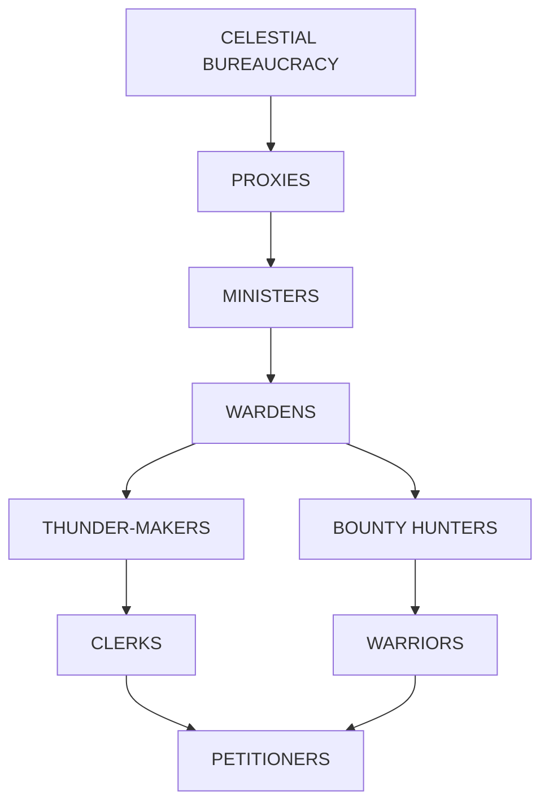

**Petitioners of Lei Kung**
2 parallel tracks of advancement

**Celestial Bureaucracy**: Lei Kung has absolute dominion in his realm, but like all the other deities of his pantheon he is required to bow to the will of the Celestial Bureaucracy.

**Proxies**: Lei Kung's proxies are a mixed breed, all obsessed with vengeance. Most are rarely seen in the realm, as they roam the planes on missions of retribution.

**Ministers**: The ministers report to both Lei Kung and the Celestial Bureaucracy, and so are eternally caught between two competing masters. Few keep their posts for very long. The ministries include Justice, Humility, Retribution, Laughter, Scribes, and Instruction.

**Wardens**: Wardens oversee the vast array of prisoners and new petitioners in the Nine-League Prison. The Courts of Weariness and Suffering are their centers of power.

**Thunder-Makers**: Thunder-makers are mages who serve the ministers and lead expeditions throughout the Great Ring. They are especially revered for their knowledge of the realms outside Resounding Thunder and their skills at subduing difficult enemies of Lei Kung. They also serve as a form of envoy or ambassador to the Celestial Bureaucracy when required, and the best of them are promoted to become ministers.

**Bounty Hunters**: Bounty hunters are the captains of Lei Kung's expeditions to capture wrongdoers. They are expert trackers, ambushers, and fighters, fueled by their mission of divine vengeance.

**Clerks**: Clerks serve both ministers and wardens, keeping track of goods and people throughout the realm.

**Warriors**: Warriors are the foot soldiers of Lei Kung's raids into other realms, appointed to the task of bringing back those who have wronged the Celestial Bureaucracy. They can't be put in the dead-book except within their home realm; at all other times they fade into mist and reform in Resounding Thunder.

**Petitioners**: Lei Kung's petitioners run the prisons, storehouses, and ministries of the realm to ensure efficient, swift justice for those poor sods who are taken here alive. They never leave the realm.

<!-- layout: chart_type: flow_chart -->
<!-- layout: axes_series: Hierarchy of Goblins -->
<!-- layout: dimensions: 1 column x 10 rows -->
<!-- layout: precision: N/A -->
<!-- layout: exceptions: N/A -->
<!-- layout: caption: GOBLINS -->
## GOBLINS

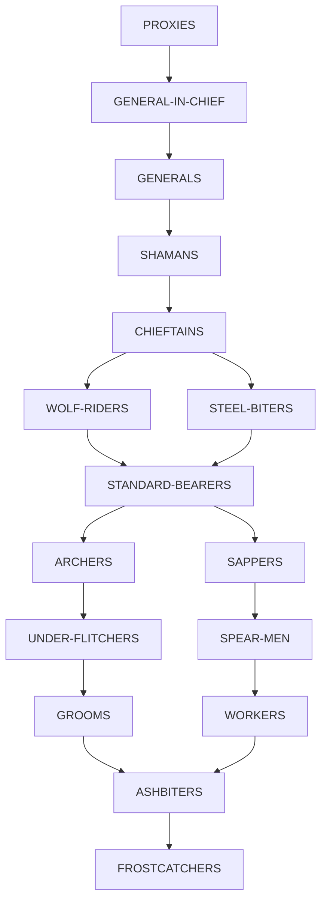

**Proxies**: The proxies are the greatest voice the goblins hear. When they command anyone in the realm, their commands are obeyed without question—even victims are expected to defer to proxies, on pain of death. The realm revolves around them. The most prominent current proxy is Maglubiyet the Foul, an exiled baatezu.

**General-in-Chief**: The General-in-Chief translates the proxies' orders into action. He also keeps a tight rein on the unruly staff of generals.

**Generals**: Each general commands a legion of several thousand chieftains, often of more than one clan or tribe—they spend much of their time arbitrating disputes between the feuding, bloodthirsty chieftains. To protect themselves, all generals have honor guards of wolf-riders.

**Shamans**: The status of the shamans among the goblins varies widely but is directly proportional to the status of the chieftain or general who holds their loyalty. Powerful chieftains and generals sometimes have multiple shamans, each trying to eliminate his rivals.

**Chieftains**: Any chieftain with more than a thousand warriors may declare himself a general. A chieftain's followers are all of a single tribe.

**Wolf-Riders**: The wolf-riders are the finest of the goblin troops, able to fire arrows in massive volleys while galloping at top speed. They find it over the others; each troop of riders also has the right to adopt a distinctive form of dress, called a "silk" or a "squad's privilege." Many squads wear armor with quite outlandish silks: puffed, ribboned, and overlaid with screaming colors.

**Steel-Biters**: The elite warriors of the goblin army, steel-biters befriend them. They ride specially-bred winter wolves.

**Standard-Bearers**: Especially honored because they die so quickly in battle, standard-bearers are deferred to with a smirk and a wink. No matter how the standard-bearers abuse others, their victims know their tormentor has a limited life span. This infuriates standard-bearers and drives them to ever-greater heights of cruelty.

**Archers**: Both an expert fletcher and a marksgoblin, archers are chosen to become wolf-riders. They compete vigorously among themselves at the yearly contest called (obviously if not originally) the Choosing, or sometimes the Wolf-Marking. No one ever said the goblins were inventive berks.

**Sappers**: The best diggers are also powerful fighters, capable of repelling attacks by counter-miners.

**Under-Flitchers**: Under-flitchers are apprentice archers, responsible for keeping the quivers of the archers filled.

**Spear-Men**: Spearmen are the common soldiers, honored but short-lived.

**Grooms**: Treated with the care of wolf steeds, grooms hold status among the juveniles. The grooms themselves are being groomed for leadership.

**Workers**: Most female goblins can only aspire to worker status, though a few become shamans or under-flitchers.

**Ashbiters**: Ashbiters are immature goblins unfit for duty as grooms. They tend fires and watch the warriors hone their skills.

**Frostcatchers**: Frostcatchers are the goblin young, male and female. They forage and fetch water with the worker goblins.

<!-- layout: chart_type: flow_chart -->
<!-- layout: axes_series: Hierarchy of Hobgoblins -->
<!-- layout: dimensions: 1 column x 8 rows -->
<!-- layout: precision: N/A -->
<!-- layout: exceptions: N/A -->
<!-- layout: caption: HOBGOBLINS -->
## HOBGOBLINS

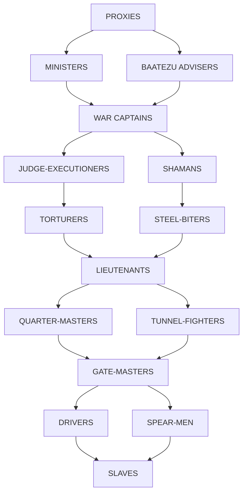

**Proxies**: Chosen by Nomog-Geaya, the proxies can overrule any decision made by their subordinates. Hobgoblin proxies spend most of their time on the battlefield, not in the realm.

**Baatezu Advisers**: Answerable only to the proxies, the baatezu generally strive to please, but intrigue of the ministers and war captains to the cause of evil.

**Ministers**: Ministers control weapons deliveries, food, manufactories, smithies, and armories, issuing orders for clothing and equipment, inspecting goods, squashing corrupt officials, and keeping the war machine oiled and running.

**War Captains**: Chosen by their followers, war captains are promoted lieutenants, or shamans who have gained a loyal following. These are the generals of the hobgoblin army.

**Judge-Executioners**: Judge-executioners are the only officials able to arrest and execute hobgoblins higher in the hierarchy; they are meant to protect others from abuses. In practice, they get blame from both above and below.

**Shamans**: Shamans have little more than a cheerleading function among the hobgoblins, although a few war captains.

**Torturers**: Responsible for obtaining confessions, torturers feared because they have the power of arrest.

**Steel-Biters**: The elite warriors of the hobgoblin army, steel-biters befriend them. They ride specially-bred winter wolves.

**Lieutenants**: As junior officers serving the greater cause of the hobgoblins, lieutenants must answer to judges, shamans, war captains, or any other high-ranking hobgoblin.

**Quarter-Masters**: Responsible for material, supplies, and provisions of all kinds, the quartermasters report to the ministers and war-captains.

**Gatemasters**: Gatemasters are responsible for security in a camp, city, or convoy/caravan.

**Tunnel-Fighters**: The strongest and toughest hobgoblin warriors are chosen for tunnel duty.

**Drivers**: Not trusted with weapons, drivers are often female hobgoblins responsible for moving the quartermasters' provisions.

**Spear-Men**: Spearmen are the average footsoldiers in the hobgoblin ranks.

**Slaves**: Any hobgoblin not immediately contributing to the war effort is considered a slave, to be ordered around by any higher-ranking hobgoblin.

<!-- layout: chart_type: flow_chart -->
<!-- layout: axes_series: Hierarchy of Orcs, Rakshasas, and Yugoloths -->
<!-- layout: dimensions: 2 columns x 7 rows -->
<!-- layout: precision: N/A -->
<!-- layout: exceptions: N/A -->
<!-- layout: caption: ORCS, RAKSHASAS, YUGOLOTHS -->
## ORCS, RAKSHASAS, YUGOLOTHS

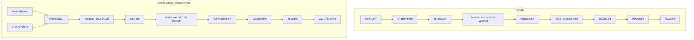

Two tracks of advancement: Nishrek (realm) and Istvarhan (hassitorium)

**Proxies, Rakshasas, and Yugoloths**: These creatures all inspire respect and pure terror in their underlings. They are instantly obeyed and catered to. The most famous of the orcish proxies is Makrete Ironskull.

**Chieftains**: Chieftains rule entire orc tribes of thousands. They answer to no one but Gruumsh and his proxies, though their mates, shamans, concubines, and lieutenants all have their influence.

**Grand Headsman**: The half-orc Estrak Longtooth rules the hassitorium Istvarhan. Though still answerable to the proxies of the orcish powers, the Grand Headsman enjoys a measure of independence greater than the chieftains of the realm, though his post is technically equivalent to the chieftain's rank.

**Shamans**: Shamans bring the word of the powers to the orcs. Their respect and status is greatest when the powers are angry with their followers over some failure on the battlefield.

**Bailiff**: The bailiff commands the resources and machinery of the hassitorium.

**Marshals of the Watch**: Marshals of the Watch are the orcish army constables, able to arrest and punish offenders. The marshal of Istvarhan has absolute command over his relatively small but extremely efficient army.

**Gatekeeper**: Merrina, the gatekeeper of Istvarhan, is responsible for monitoring access to the hassitorium. She's not known taking bribes for entry.

**Warriors**: Warriors are allowed to plunder from the fallen, from the enemy camps. They may sack cities.

**Shieldbearers**: Shieldbearers are allowed to go to war and are paid for their trouble. They need carry nothing other than weapons and armor.

**Bearers**: Bearers must carry all the provisions, gear, and plunder of any orcish army. Though they are allowed to go to war, their only privilege is looting the bodies of the dead.

**Diggers**: Diggers are better fed and better treated than slaves, but only just. They must work long hours without compensation. Diggers are respected for their strength and little else.

**Slaves**: Slaves are held for a period of servitude determined by their prowess; thereafter they are allowed to either fight for their freedom (those who defeat their master's champion are emancipated), or are sent to the front as cannon fodder.

**Wall-Slaves**: Chained or magically fused into the walls of the hassitorium, wall-slaves are the lowest of the low, not considered worthy of the attention of any greater creature. Anyone seen speaking to them or paying them any attention is considered tainted and added to their ranks.

<!-- layout: chart_type: flow_chart -->
<!-- layout: axes_series: Hierarchy of Duergar -->
<!-- layout: dimensions: 1 column x 7 rows -->
<!-- layout: precision: N/A -->
<!-- layout: exceptions: N/A -->
<!-- layout: caption: DUERGAR -->
## DUERGAR

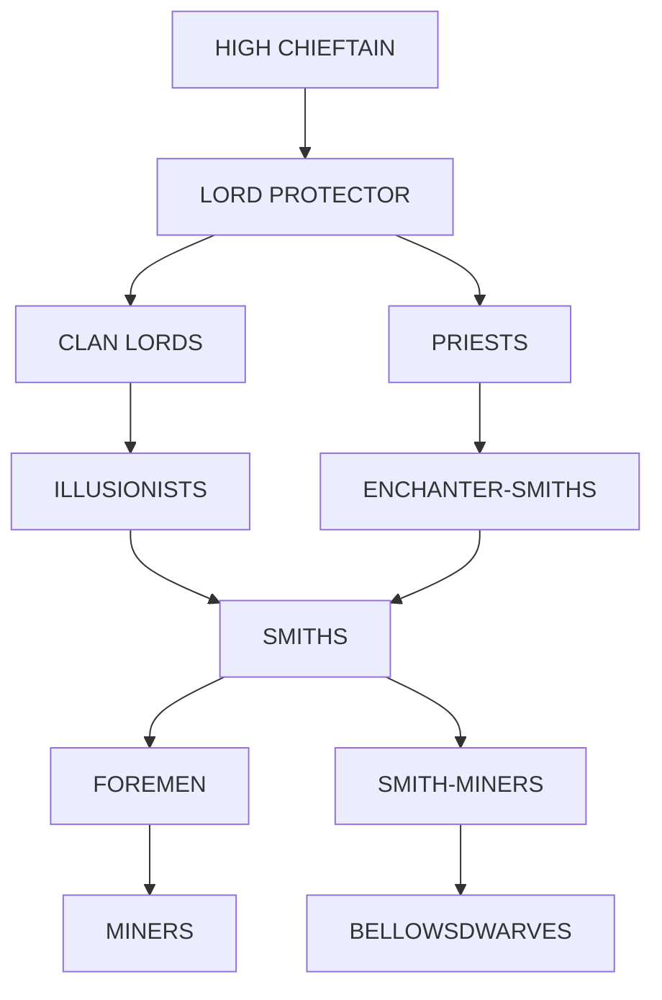

**High Chieftain**: The ruler and unifier of the duergar clans, the High Chieftain is elected by the clan lords. Currently, the High Chieftain is Rathgar the Lesser. The High Chieftain quickly becomes a pawn of the spirits of the Court of Memory. Though technically a very honorable and powerful position, the clans have been known to choose the use- and wits-draining nature of the throne to reduce the threat of chieftains who show too much drive and ambition to unify the clans.

**Lord-Protector**: The High Chieftain's general and commander of field forces, the Lord-Protector is elected by the warriors who must serve him. The position is held for life. When the High Chieftain is not possessed, the Lord-Protector rules with the advice of the priests of Laduguer.

**Clan Lords**: Duergar lords are the clan leaders and chieftains. Most are warriors, but a few are priests as well, and these hold a higher status than the rest. For most of each year, the lords keep to themselves and jealously guard their privileges; they gather only when an assembly is called at court. Most lords avoid the Court of Memory, though many serve as pages or squires when they were young.

**Priests**: The priests of Laduguer are a gloomy lot without much to say for themselves. They spread despair and guilt wherever they go, for in their eyes no one and nothing is worthy of Laduguer's attention or grace.

**Illusionists**: Mages among the duergar have a certain status, though they are as much feared as respected. Most are outsiders, or advisers to clan lords.

**Enchanter-Smiths**: Highly thought of among the mass of petitioners because of their abilities, the enchanter-smiths have little pull in the high councils.

**Smiths**: All smiths are considered better than the mass of common folk.

**Smith-Apprentices**: Apprentices can forge small projects of their own, though they usually simply assist full smiths.

**Bellowsdwarves**: These ordinary laborers gain a glimmer of status from their proximity to the smiths. If they work hard, they sometimes gain the attention of their betters and are given a chance for promotion.

**Foremen**: Despised for their harsh oversight of the miners, foremen nevertheless cow most lesser duergar into obedience and respect.

**Miners**: Most petitioners are miners, with dust in their eyes and splinters of rock permanently embedded in their knees.

<!-- layout: chart_type: flow_chart -->
<!-- layout: axes_series: Hierarchy of Bladelings -->
<!-- layout: dimensions: 1 column x 7 rows -->
<!-- layout: precision: N/A -->
<!-- layout: exceptions: N/A -->
<!-- layout: caption: BLADELINGS -->
## BLADELINGS

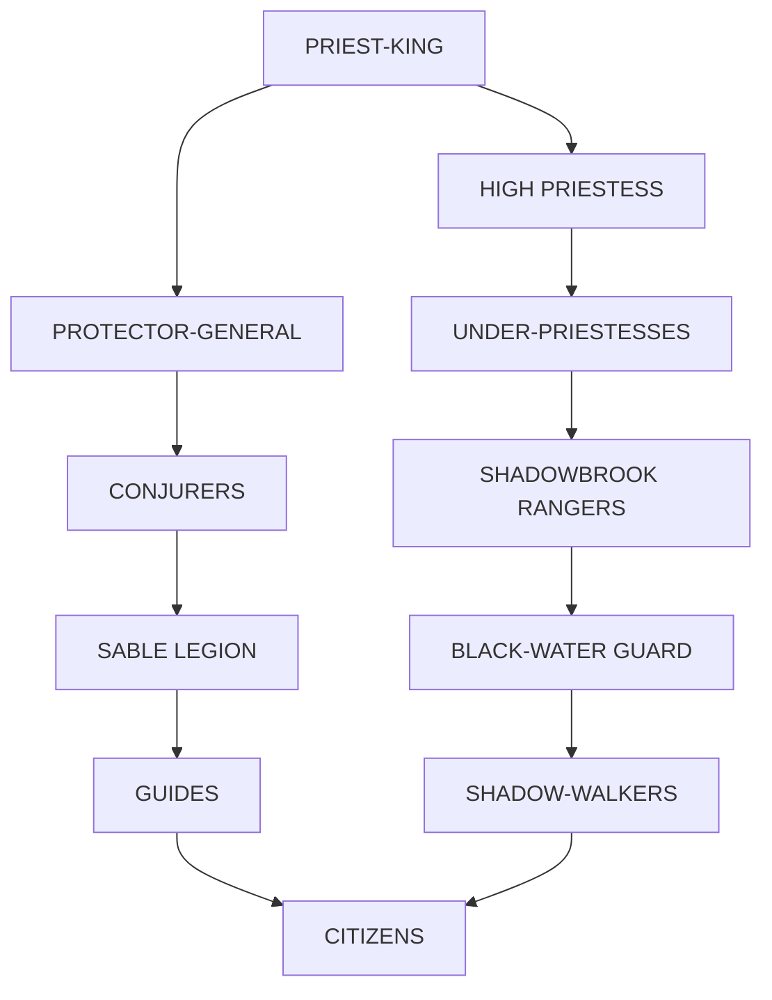

**Priest-King**: The leader of the bladelings is Iron Feather, who led his people to Acheron and founded the city of Zoronor. High Priestess Bloodsmoke covets the job.

**High Priestess**: A sort of evil druidess, the High Priestess tends to the Blood Forest of Zoronor and offers the sacrifices to Hriste, the Gray Whisper. Currently the position is held by Bloodsmoke, who enjoys her work.

**Protector-General**: Nightsilver is the Protector-General, both commander of the bladeling armies and high magistrate of constables in the city of Zoronor. He's far less isolationist than the priest-king, but has no right to adopt a distintere to challenge Iron Feather for his position.

**Under-Priestesses**: The priestesses serve the High Priestess, and her goals are their goals. They rarely leave the Blood Forest.

**Conjurers**: Conjurers are well respected among the bladelings for their bravery and steadfastness, the priestesses of Hriste as for their arcane powers.

**Shadowbrook Rangers**: The honor guard of the priestesses of Hriste, charged with their safety.

**Sable Legion**: The honor guard of the priest-king. They have a fierce rivalry with the Shadowbrook Rangers.

**Blackwater Guard**: The elite corps of the bladelings. Members of Blackwater Guard are the heroes of the commoners.

**Guides**: The guides are the only bladelings who pay much attention to visitors or to creatures of other races in Zoronor. Some even wander to Sigil and other sites along the Great Ring.

**Shadow-Walkers**: Shadow-walkers brave the dangers of the Blood Forest's black ice shards, and patrol the various portals leading to Tintibulus and Thuldanin. They also lead raids into those layers to capture sacrifices for the priest-king.

**Citizens**: Most bladelings pursue their own goals and lives, conforming to the laws of the priestesses and the priest-king.

<!-- layout: chart_type: flow_chart -->
<!-- layout: axes_series: Hierarchy of Mercykillers -->
<!-- layout: dimensions: 1 column x 8 rows -->
<!-- layout: precision: N/A -->
<!-- layout: exceptions: N/A -->
<!-- layout: caption: MERCYKILLERS -->
## MERCYKILLERS

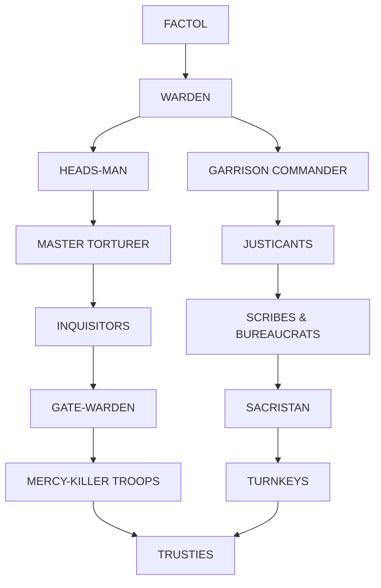

**Factol**: Enmeshed in the never-ending political war in Sigil, the factol only rarely visits Acheron.

**Warden**: The warden rules the entire complex of Vorkehan, from the lowest pits of the Wells of Vorkehan to the highest spire of the Sacrarium.

**Headsman**: Responsible for all executions, the Headsman is an active post and has the ear of the warden. The headsman is also a spymaster, for he maintains the Mercykillers' Spy network.

**Garrison Commander**: The commander mercilessly drills the troops of Vorkehan, in preparation for the factol's call to war or invasions by goblin or orc armies.

**Justicants**: This council of ten judges presides over all trials in Vorkehan.

**Master Torturer**: Melina the Fair, more often simply called the Iron Maiden, is the current master torturer. She is responsible for obtaining confessions and capturing enemies of the faction.

**Scribes and Bureaucrats**: These officials keep the day-to-day operations of the city running smoothly, so that the pursuit of justice is not inhibited by petty details.

**Inquisitors**: The hunters and adventurers of the faction, the inquisitors are the eyes and ears of the factol. While in the faction, the inquisitors seek out and punish criminals near Mercykiller strongholds.

**Gatewarden**: An unrewarded but important post, the gatewarden is responsible for security and serves as head of the watch.

**Sacristan**: The sacristan keeps the sacred relics of the faction and brings them out only on ritual occasions, such as initiations. The sacristan is the Mercykillers' morale officer, and the post is usually held by a priest.

**Mercy-Killer Troops**: Stalwart warriors of the faction, Mercykiller troops are feared throughout the planes.

**Turnkeys**: Turnkeys are servants of the faction who have duties within a headquarters or outpost.

**Trusties**: The trusties are any members of the faction with no other duties.

PLANES OF LAW 26073XX0701 © 1995 TSR, Inc. All Rights Reserved.

# UPDATED PLANESCAPE™ COSMOGRAPHICAL TABLES

A Brief Reference Guide to the Planes and the Realms and Towns Within Them

**ABYSS** (infinite, interchangeable layers & realms — numbers only refer to the order in which they were catalogued by the Guvners)

River Styx

*   LAYER/REALM 1: Plain of Infinite Portals
    *   Broken Reach
    *   Gallowsgate
    *   Raazorforge
    *   Styxoar
    *   Lakes of Molten Iron
    *   Tower of Chiryn (a succubus)
*   LAYER/REALM 2: "DRILLER'S HIVES"
*   LAYER/REALM 3: Forgotten Land
*   LAYER/REALM 4: GRAND ABYSS
*   LAYER/REALM 5: "WORMBLOOD"
*   LAYER/REALM 6: REALM OF A MILLION EYES (beholder realm)
*   LAYER/REALM 7: PHANTOM PLANE (Sess'innek's realm)
*   LAYER/REALM 8: "SKIN-SHEDDER"
*   LAYER/REALM 9: BURNINGWATER
*   LAYER/REALM 10: "THAT HELLHOLE"
*   LAYER/REALM 11: MOLRAT
*   LAYER/REALM 12: TWELVETREES
    *   Ship of Chaos
*   LAYER/REALM 13: BLOOD TOR (Beshaba's realm; Umberlee's realm)
*   LAYER/REALM 23: IRON WASTES (Kostchtchie's realm)
*   LAYER/REALMS 45, 46, 47: AZZAGRAT (Graz'zt's realm)
    *   Argent Palace
    *   Zelatar
    *   Zrintor, the Viper Forest
*   LAYER/REALM 66: DEMONWEB PITS (Lolth's realm)
*   LAYER/REALM 67: HEAVING HILLS
*   LAYER/REALM 68: UNNAMED
*   LAYER/REALM 69: CRUSHING PLAIN
*   LAYER/REALM 70: "Ice Floe"
*   LAYER/REALM 71: SPIRAC
*   LAYER/REALM 72: DARKLIGHT
*   LAYER/REALM 73: WELLS OF DARKNESS
*   LAYER/REALM 74: SMARAGD (Merrshaulk's realm; Ramenos's realm)
*   LAYER/REALM 88: THE GAPING MAW (Demogorgon's realm)
*   LAYER/REALM 113: THANATOS (Kiaransalee's realm)
    *   Forbidden Citadel
    *   Naratyr
*   LAYER/REALM 181: ROTTING PLAIN (Laogzed's realm)
*   LAYER/REALM 222: SHEDAKLAH (Juiblex's realm; Zuggtmoy's realm)
*   LAYER/REALM 274: DURAO (gateway layer)
*   LAYER/REALM 303: SULFANORUM (smoking realm)
*   LAYER/REALM 377: PLAINS OF GALLENSHU (armanite realm)
*   LAYER/REALM 399: WORM REALM (Urdlen's realm)
*   LAYER/REALM 400: WOEFUL ESCARAND (nalfeshnee realm)
*   LAYER/REALM 422: YEENOGHU'S REALM
*   LAYER/REALM 503: TORREMOR (Pazrael's realm)
    *   Onstrakker's Nest
*   LAYER/REALM 586: PRISON OF THE MAD GOD (Diinkarazan's realm)
*   LAYER/REALM 643: CAVERNS OF THE SKULL GODDESS (Kali's realm)

**ACHERON** (four layers)

River Styx

LAYER 1: AVALAS
*   Istvarhan (mobile orc fortress)
*   Mesk (Styx town)
*   Vorkehan (Mercykiller town)
*   Blue Cube
*   Clangor (goblin realm)
    *   Grashmog
    *   Redspike
    *   Shetring
*   Nishrek (orc realm)
    *   Blood Armor
    *   Broken Skull
    *   Iron Fist
    *   Rotting Eye
    *   Three Fang
    *   White Hand
*   Resounding Thunder (Lei Kung's realm)
    *   Black Water
    *   Eight-Devils-Laughing
    *   Nihao
    *   Firecracker Palace (Lei Kung's palace)
LAYER 2: THULDANIN
*   Mines of Marsellin
*   Hammergrim (Laduguer's realm)
    *   Coldember
    *   Deathknell
    *   Forgegloom
    *   Court of Memory
    *   Hopeglimmer
LAYER 3: TINTIBULUS
*   Hopping Tower
LAYER 4: OCANTHUS
*   Zoronor, City of Shadows (bladeling town)

<table>
  <tbody>
    <tr>
        <td>Segment</td>
        <td>Value</td>
    </tr>
    <tr>
        <td>1</td>
        <td>25</td>
    </tr>
    <tr>
        <td>2</td>
        <td>25</td>
    </tr>
    <tr>
        <td>3</td>
        <td>25</td>
    </tr>
    <tr>
        <td>4</td>
        <td>25</td>
    </tr>
  </tbody>
</table>

**ARCADIA** (three layers)

LAYER 1: ABELLIO
*   The Ghetto
*   Mandible (formian city)
*   Citadel of the Cloud King
*   Citadel of the Lightning King
*   Citadel of the Rain King
*   Citadel of the Wind King
*   Izanagi and Izanami
*   Marduk
    *   Marduk
*   Mount Clangeddin
LAYER 2: BUXENUS
*   Melodia (Harmonium town)
*   Harmonium Training Camp
*   Azuth
    *   Mage's Rest
*   Heliopolis (Ra, Isis, Osiris, Horus' realm)
    *   Gizehkhet
    *   Memphir
    *   Thekele-re
*   Meriadar's Realm
LAYER 3: NEMAUSUS (now in Mechanus)

**BAATOR** (nine layers)

River Styx

LAYER 1: AVERNUS
*   Bel's Fortress
*   Darkspine
*   Garden
*   Pillar of Skulls
*   Draukari (Kurtulmak's realm)
*   Frekstavik
*   Midllin
*   Snjarll
*   Tiamat's Lair
LAYER 2: DIS
*   Dis (The Iron City)
LAYER 3: MINAUROS
*   Jangling Hiter, City of Chains
*   Minauros the Sinking
*   Aeaea (Hecate's realm)
LAYER 4: PHLEGETHOS
*   Abriymoch
LAYER 5: STYGIA
*   Tantlin, City of Ice
*   Prince Levistus' iceberg
*   Ankhwugaht (Set's realm)
    *   Khas-tep
    *   Tukhamen
*   Sheyruushk (Sekolah's realm)
LAYER 6: MALBOLGE
LAYER 7: MALADOMINI
*   Grenpoli, City of Diplomacy
*   Malagard
LAYER 8: CANIA
*   Mephistar
*   Glacier Nargus
LAYER 9: NESSUS
*   Malsheem (fortress)

**ARBOREA** (three layers)

River Oceanus
Mount Olympus

*   Seelie Court (wandering realm)

LAYER 1: OLYMPUS
*   Thrassos
*   Gilded Hall (Sensate post)
*   Arvandor (Elven pantheon's realm)
    *   Grandfather Oak (treant town)
    *   Evergold/Canathas (Hanali/Aphrodite)
    *   Gnarl (Erevan)
    *   Ingmar Brook (gate to Alfheim in Ysgard)
    *   Lolth's Grove (abandoned)
    *   Pale Tree (Solonor)
    *   Roaring Gate (gate to the Beastlands)
    *   Sparkling Sea (Deep Sashelas)
*   Brightwater (Lliira's, Sune's, and Tymora's realm)
*   Olympus (Greek realm)
    *   Arkenos
    *   Polykeptolon
    *   Thalassia
    *   Each Greek god's temple or hall
    *   Mount Olympus
LAYER 2: OSSA (Aquallor)
*   Elshava
*   Caletto (Poseidon's realm)
    *   Coldcurrent
    *   Ironilla
    *   Pearldrop
LAYER 3: PELION (Mithardir)
*   Amun-thys (Nephthys's realm)
    *   Bal-tiref

**THE BEASTLANDS** (three layers)

River Oceanus
Yggdrasil

*   Seelie Court (wandering faerie realm)

LAYER 1: KRIGALA
*   Standing Stones
LAYER 2: BRUX
LAYER 3: KARASUTHRA

**BYTOPIA** (two layers)

LAYER 1: DOTHION
*   Yeoman
*   Dothion (gnomish pantheon's realm)
LAYER 2: SHURROCK

**CARCERI** (six layers)

River Styx
Mount Olympus

LAYER 1: OTHYS
*   Titans' Realm
LAYER 2: CATHRYS
LAYER 3: MINETHYS
*   Crius's Temple
LAYER 4: COLOTHYS
*   Gaola
*   Krin-din
*   Crius's Temple
*   Grolantor's Realm
LAYER 5: PORPHYATYS
*   Oceanus's Temple
LAYER 6: AGATHYS

**ELYSIUM** (four layers)

River Oceanus
Yggdrasil

LAYER 1: AMORIA
*   Release From Care
*   City of the Star (Ishtar's realm)
*   Isis's Realm
*   Principality
    *   Pax Benefice
LAYER 2: ERONIA
*   Enlil's Realm
LAYER 3: BELIERIN
LAYER 4: THALASIA

**GEHENNA** (four layers)

River Styx
Mount Olympus

LAYER 1: KHALAS
*   Teardrop Palace (Sung Chiang's realm)
LAYER 2: CHAMADA
LAYER 3: MUNGOTH
LAYER 4: KRANGATH
*   Shargaas's Realm

**THE GRAY WASTE** (three layers)

River Styx
Mount Olympus
Yggdrasil

LAYER 1: OINOS
*   Khin-Oin (yugoloth realm)
LAYER 2: NIFLHEIM
*   Hel's Realm
LAYER 3: PLUTON
*   Hades' Realm
*   Hecate's Realm

**LIMBO** (layers undefined)

Yggdrasil

*   Barnstable (halfling town)
*   Floating City (githzerai town)
*   Shra'kt'lor (githzerai town)
*   Pinwheel
*   Spawning Stone (slaadi)
*   Fennimar (Fenmarel's realm)

**MECHANUS** (each realm is an individual cog; actual number unknown)

*   Delon-Estin Oti
*   Fortress of Disciplined Enlightenment (Guvner town)
*   Haven
*   Anu
*   Jade Palace (Shang-ti's realm)
*   Mycella (Psilofyr's realm)
*   Nemausus (Arcadia's third layer)
*   Regulus (modron realm)
    *   The Great Cathedral
*   Rudra's Realm
*   Varuna's Realm
*   Yama's Realm

<table>
  <tbody>
    <tr>
        <td>Segment</td>
        <td>Value</td>
    </tr>
    <tr>
        <td>1</td>
        <td>12.5</td>
    </tr>
    <tr>
        <td>2</td>
        <td>12.5</td>
    </tr>
    <tr>
        <td>3</td>
        <td>12.5</td>
    </tr>
    <tr>
        <td>4</td>
        <td>12.5</td>
    </tr>
    <tr>
        <td>5</td>
        <td>12.5</td>
    </tr>
    <tr>
        <td>6</td>
        <td>12.5</td>
    </tr>
    <tr>
        <td>7</td>
        <td>12.5</td>
    </tr>
    <tr>
        <td>8</td>
        <td>12.5</td>
    </tr>
  </tbody>
</table>

**MOUNT CELESTIA** (seven layers)

LAYER 1: LUNIA
*   Fortress Eternal and Everlasting
*   Heart's Faith
*   Nemmiron
*   Soul's Desire
*   Tower of Fire
*   Nectar of Life (Brihaspati's realm)
    *   Omyriel
    *   Katsudarma Library
    *   Pinnacle of Indigo
LAYER 2: MERCURIA
*   Bahamut's Palace
*   Goldfire (Surya and Mitra's realm)
    *   Marrashad
    *   Pashrita
LAYER 3: VENYA
*   Vishnu's Realm
*   Glass Tarn
*   Green Fields (halfling pantheon's realm)
LAYER 4: SOLANIA
*   First Monastery of the Planes-Militant
*   Erackinor (Dwarven pantheon's realm)
    *   Berronar's Side
    *   Istor's Forge
    *   The Rift
    *   Stonefall
    *   Soul Forge
*   Kuan Yin's Realm
*   Uroboros, the Gates of Wisdom (Jazerian's realm)
LAYER 5: MERTION
*   Empyrea, City of Tempered Souls
*   Rempha, City of the Sands of Time
*   Soqed Hezi, City of Swords
*   Arve-Manna, the Chanting Grounds
LAYER 6: JOVAR
*   Yetsirah, the Heavenly City
LAYER 7: CHRONIAS

**PANDEMONIUM** (four layers)

River Styx
Yggdrasil

LAYER 1: PANDESMOS
*   The Madhouse
*   Winter's Hall (Loki's realm)
LAYER 2: COCYTUS
*   The Harmonica
*   Howler's Crag
*   Hruggekolobk (bugbear realm)
LAYER 3: PHLEGETHON
*   Windglum
*   Unseelie Court
LAYER 4: AGATHION

**YSGARD** (three layers)

Yggdrasil

*   Seelie Court (wandering realm)

LAYER 1: YSGARD
*   Skeinheim (Ring-giver town)
*   Steadfast (bariaur town)
*   Alfheim (Ysgardian elves' realm)
    *   Frey's Hall
    *   High Grove
    *   Xeno's Tower
*   Asgard (Norse realm)
    *   Himinborg
    *   Bifrost
    *   Norse Gods' Halls, including Valhalla and Gladsheim
*   Gates of the Moon (Selune's realm)
    *   Mahogany
    *   Infinite Staircase
*   Jotunheim (Surtr's and Thrym's realm)
    *   Meertauk
    *   Utgard
    *   Malagard
*   Merratet (Bast's realm)
    *   Bresiris
    *   Eowr
    *   Rummm
*   Vanaheim (Vanir realm)
    *   Noatun
    *   Sessrumnir (Freya's hall)
LAYER 2: MUSPELHEIM
*   Muspelheim (Surtr's realm)
    *   Njallok
    *   Spire of Surtr
LAYER 3: NIDAVELLIR
*   Nidavellir (Ysgardian dwarf and gnome realm)
    *   Ashbringer
*   Svartalfheim (dark elf realm)
    *   Dokkar
    *   Yggwyrd

**THE OUTLANDS** (nine layers)

*   Sigil
*   Excelsior (gate town to Mount Celestia)
*   Tradegate (gate town to Bytopia)
*   Ecstasy (gate town to Elysium)
*   Faunel (gate town to the Beastlands)
*   Sylvania (gate town to Arborea)
*   Glorium (gate town to Ysgard)
*   Xaos (gate town to Limbo)
*   Bedlam (gate town to Pandemonium)
*   Plague-Mort (gate town to the Abyss)
*   Curst (gate town to Carceri)
*   Hopeless (gate town to the Gray Waste)
*   Torch (gate town to Gehenna)
*   Ribcage (gate town to Baator)
*   Rigus (gate town to Acheron)
*   Automata (gate town to Mechanus)
*   Fortitude (gate town to Arcadia)

*   Caverns of Thought (Ilsensine's realm)
*   The Court of Light (Shekinester's realm)
*   The Dwarven Mountain (Vergadain's, Dugmaren Brightmantle's, and Dumathoin's realm)
    *   Ironridge
*   Gzemnid's Realm (beholder realm)
*   A Hidden Realm (Annam's realm)
*   Mausoleum of Chronepsis
*   The Palace of Judgment (Yen-Wang-Yeh's realm)
*   Realm of the Norns
*   Semuanya's Bog
*   Sheela Peryroyl's Realm
*   Thoth's Estate
    *   Thebestys
*   Tir na Og and Tir fo Thiunn (Celtic gods' realms)
*   Tvashtri's Lab

KEY:
**PLANE** (number of layers)
Special Feature (highlighted by bold text)
LAYER (layer number and name)
*   Independent Town
*   Site (within a realm or independent)
*   Realm (key power, powers, or inhabitants)
*   Realm Town (influenced by local powers)

These tables will be expanded periodically as the multiverse is explored and mapped.

quadrone

PLANES OF LAW 2607XXX0503 PLANESCAPE is a trademark owned by TSR, Inc. © 1995 TSR, Inc. All Rights Reserved.

# THE HIERARCHY OF BAATOR

## THE LORDS OF THE NINE

The Lords of the Nine each rule over a layer of Baator, ensuring that the order and regulation imposed upon the plane are maintained. They do not concern themselves with the Blood War, leaving that for the Dark Eight. Instead, they mete out edicts and prevent others from poaching territory from Baator. The Lords of the Nine are mostly dark to mortal knowledge, though the following information has been gleaned at great cost.

* **LORD OF THE FIRST**: Unknown; rumored to have abdicated much of his power to the pit fiend Bel.

* **LORD OF THE SECOND**: Archduke Dispater; rules over his layer from a tower of lead and stone, constantly plotting against the other planes and the Prime.

* **LORD OF THE THIRD**: Unknown, though rumored to be called Minauros after the name of this layer and the city.

* **LORD OF THE FOURTH**: Unknown; rumored to have a fiery temper.

* **LORD OF THE FIFTH**: Prince Levistus; although frozen within the iceberg that makes up his surroundings, he is fully conscious and is plotting to take over another layer of Baator.

* **LORD OF THE SIXTH**: Unknown; rumored to be female.

* **LORD OF THE SEVENTH**: Unknown; an archduke, this lord constantly builds new cities that never quite meet his exacting standards.

* **LORD OF THE EIGHTH**: Baron Molikroth; delights in tormenting his layer's freezing petitioners, while keeping a sharp eye on Prince Levistus.

* **LORD OF THE NINTH**: Unknown.

## THE DARK EIGHT

The baatezu are ruled by the Dark Eight — a quorum of pit fiends named Baalzephon, Corin, Dagos, Furcas, Pearza, Zaebos, Zapan, and Zimimar. The Dark Eight was founded by the pit fiend Cantrum, who was slain early on by a paladin from Mount Celestia. Nevertheless, the Dark Eight lived on, with Zaebos joining the other seven. These eight have ruled the baatezu since Cantrum's death; none have fallen prey to the assassinations so prevalent in the lower ranks. Perhaps this is because in all of Baator, only the Nine Lords are more powerful than these pit fiends — or perhaps it is because the Dark Eight are guarded by 106 cornugons of absolute loyalty, behavior virtually unheard of in Baator.

Four times a year the Dark Eight meet in the fortress of Malsheem in Nessus, the deepest layer of Baator. There the fiends plot the direction of the Blood War, which they wage with unceasing hatred and determination against their ancient foes, the tanar'ri. Once each century, the Dark Eight also attend the Ring of Cantrum, a moot named in honor of the original founder. During the moot, the Dark Eight meet with 100 of the 1,000 osyluths, who present information on promising gelugons who are being considered for promotion to pit fiend status. Nine votes are cast in the Ring, with the ninth comprised of one vote cast by the osyluth quarter. Although an indeterminate number of gelugons are promoted after each Ring, all 1,000 osyluths are promoted, while simultaneously 1,000 new osyluths are promoted from the lower ranks.

## THE BAATEZU

1. **PIT FIEND (Greater Baatezu)**: The highest-ranked of all baatezu, it's not known to what heights pit fiends may rise. Certainly some must have ambitions of joining the Dark Eight, though first one of those members must be removed — a difficult task indeed! And among the truly megalomaniacal pit fiends' minds must cross the speculation that perhaps the Lords of the Nine were once pit fiends. ...

2. **GELUGON (Greater Baatezu)**: Gelugons can only be promoted to pit fiends, but it's a long process. First, they must serve flawlessly for 777 years. Then they must pass the vote at the Ring of Cantrum; if chosen, they must then enter the Pit of Flame, there to be tormented for 1,001 days. They emerge the Pit as pit fiends (hence their new name).

3. **AMNIZU (Greater Baatezu)**: Amnizu have designs against the Dark Eight and other pit fiends. Perhaps as a measure against those machinations, amnizu who wish to continue advancing through the ranks must first be demoted to cornugon status before they can ultimately rise to higher power.

4. **CORNUGON (Greater Baatezu)**: Cornugons may be led in battle only by pit fiends, though they will also serve gelugons as personal guardians. Cornugons are the least treacherous of all baatezu, and 106 of them serve the Dark Eight with absolute loyalty. They are promoted only to gelugon status.

5. **HAMATULA (Lesser Baatezu)**: Hamatulas have the choice of rising to either amnizu or cornugon rank. Some hamatulas seek the power accorded the rank of amnizu, while others seek the shorter promotion route offered through serving as cornugons.

6. **OSYLUTH (Lesser Baatezu)**: There are always 1,000 osyluths in existence at a given time. Every 100 years, following the Ring of Cantrum, all osyluths are promoted to hamatula status. (A few exceptional individuals are promoted directly to amnizu rather than hamatula.) Simultaneously, 1,000 new osyluths are created from the lower ranks.

7. **ERINYES (Lesser Baatezu)**: Erinyes can rise high and fast in the ranks, depending on how well they serve the Dark Eight. (Despite their lesser status, erinyes report directly to the Eight and to no other baatezu.) If they perform poorly they are demoted to barbazu; those marginally more effective are promoted to osyluth. However, most erinyes serve competently and are promoted to hamatula. Very good service is rewarded by promotion to cornugon or amnizu. Occasionally and only very rarely, exceptional service is rewarded by promotion to gelugon. And promotion to pit fiend status for service beyond all call of duty is almost unheard of, though it has occurred. Interestingly, quite a number of erinyes refuse promotion, preferring to enjoy their special status and role of tempting mortals on the Prime rather than return to the ranks of baatezu soldiers.

8A. **BARBAZU (Lesser Baatezu)**: Barbazu are equal in rank to kocrachons. Most often slain in battle, exceptional barbazu who do survive are promoted to osyluth.

8B. **KOCRACHON (Lesser Baatezu)**: Kocrachons are equal in rank to barbazu. If they serve faithfully and well for approximately 223 years, they are promoted to erinyes. Because they are only promoted to erinyes and because erinyes are typically promoted only to greater baatezu, ambitious lesser baatezu often strive to be promoted to kocrachon.

9. **ABISHAI (Lesser Baatezu)**: Abishai are only one step above spinagons. There are three types of abishai: black, green, and red. Only red abishai who have proven themselves worthy in battle are selected for promotion to kocrachon, barbazu, or, rarely, erinyes status.

10. **SPINAGON (Least Baatezu)**: Spinagons serve as the messengers of fiends. They have a variety of advancement options, all based on how well they serve their masters. For example, a spinagon who serves a gelugon extremely well might be promoted to amnizu, only one step below its master. More common, however, is promotion to abishai or barbazu, while osyluth and hamatula are rarer still. Spinagons are never immediately promoted to erinyes, kocrachon, or cornugon.

11. **NUPPERIBO (Least Baatezu)**: Nupperibos are the lowest form of ranked baatezu and are still considered petitioners. They are the remnants of lawful-evil creatures not sufficiently malign enough to start off as lemures. Although slightly higher in station than lemures, nupperibos must first be demoted to lemure level before they can advance to higher baatezu ranks.

12. **LEMURE**: Although true baatezu, lemures are so low in the hierarchy that they aren't even ranked. They are mindless petitioners who are incapable of jockeying for advancement, though sometimes they are randomly selected for promotion to the rank of spinagon.

13. **LARVA**: Evil petitioners who led especially selfish lives, larvae are nearly mindless creatures and are the building blocks for all evil powers. When selected for promotion by baatezu, they spend 11 days in the Pit of Flame before emerging as lemures.

14. **BEZEKIRA**: Neither baatezu nor petitioners, bezekiras are true animals that reproduce normally. However, their numbers are sometimes augmented by the baatezu in two ways. The first entails baatezu who have violated some law and are being punished. These baatezu, regardless of their rank, are transformed into bezekiras for an unspecified time. The second entails petitioners who have performed some monstrous deed. If that deed is witnessed by lesser or greater baatezu, the petitioners are rewarded by being changed into bezekiras, where they remain indefinitely.

# THE HIERARCHY OF MECHANUS

<table>
  <thead>
    <tr>
        <th rowspan="2">Modron Type</th>
        <th colspan="16">Quarter 1 (Regions 1-4, Sectors 1-16)</th>
        <th colspan="16">Quarter 2 (Regions 5-8, Sectors 17-32)</th>
        <th colspan="16">Quarter 3 (Regions 9-12, Sectors 33-48)</th>
        <th colspan="16">Quarter 4 (Regions 13-16, Sectors 49-64)</th>
    </tr>
    <tr>
        <th colspan="4">Region 1</th>
        <th colspan="4">Region 2</th>
        <th colspan="4">Region 3</th>
        <th colspan="4">Region 4</th>
        <th colspan="4">Region 5</th>
        <th colspan="4">Region 6</th>
        <th colspan="4">Region 7</th>
        <th colspan="4">Region 8</th>
        <th colspan="4">Region 9</th>
        <th colspan="4">Region 10</th>
        <th colspan="4">Region 11</th>
        <th colspan="4">Region 12</th>
        <th colspan="4">Region 13</th>
        <th colspan="4">Region 14</th>
        <th colspan="4">Region 15</th>
        <th colspan="4">Region 16</th>
    </tr>
  </thead>
  <tbody>
    <tr>
        <th>Hierarch Modrons</th>
        <th>S1</th>
        <th>S2</th>
        <th>S3</th>
        <th>S4</th>
        <th>S5</th>
        <th>S6</th>
        <th>S7</th>
        <th>S8</th>
        <th>S9</th>
        <th>S10</th>
        <th>S11</th>
        <th>S12</th>
        <th>S13</th>
        <th>S14</th>
        <th>S15</th>
        <th>S16</th>
        <th>S17</th>
        <th>S18</th>
        <th>S19</th>
        <th>S20</th>
        <th>S21</th>
        <th>S22</th>
        <th>S23</th>
        <th>S24</th>
        <th>S25</th>
        <th>S26</th>
        <th>S27</th>
        <th>S28</th>
        <th>S29</th>
        <th>S30</th>
        <th>S31</th>
        <th>S32</th>
        <th>S33</th>
        <th>S34</th>
        <th>S35</th>
        <th>S36</th>
        <th>S37</th>
        <th>S38</th>
        <th>S39</th>
        <th>S40</th>
        <th>S41</th>
        <th>S42</th>
        <th>S43</th>
        <th>S44</th>
        <th>S45</th>
        <th>S46</th>
        <th>S47</th>
        <th>S48</th>
        <th>S49</th>
        <th>S50</th>
        <th>S51</th>
        <th>S52</th>
        <th>S53</th>
        <th>S54</th>
        <th>S55</th>
        <th>S56</th>
        <th>S57</th>
        <th>S58</th>
        <th>S59</th>
        <th>S60</th>
        <th>S61</th>
        <th>S62</th>
        <th>S63</th>
        <th>S64</th>
    </tr>
    <tr>
        <th>(1) Primus</th>
        <th> </th>
        <th> </th>
        <th> </th>
        <th> </th>
        <th> </th>
        <th> </th>
        <th> </th>
        <th> </th>
        <th> </th>
        <th> </th>
        <th> </th>
        <th> </th>
        <th> </th>
        <th> </th>
        <th> </th>
        <th> </th>
        <th> </th>
        <th> </th>
        <th> </th>
        <th> </th>
        <th> </th>
        <th> </th>
        <th> </th>
        <th> </th>
        <th> </th>
        <th> </th>
        <th> </th>
        <th> </th>
        <th> </th>
        <th> </th>
        <th> </th>
        <th> </th>
        <th> </th>
        <th> </th>
        <th> </th>
        <th> </th>
        <th> </th>
        <th> </th>
        <th> </th>
        <th> </th>
        <th> </th>
        <th> </th>
        <th> </th>
        <th> </th>
        <th> </th>
        <th> </th>
        <th> </th>
        <th> </th>
        <th> </th>
        <th> </th>
        <th> </th>
        <th> </th>
        <th> </th>
        <th> </th>
        <th> </th>
        <th> </th>
        <th> </th>
        <th> </th>
        <th> </th>
        <th> </th>
        <th> </th>
        <th> </th>
        <th> </th>
        <th>1</th>
    </tr>
    <tr>
        <th>(4) Secundus</th>
        <th>1</th>
        <th> </th>
        <th> </th>
        <th> </th>
        <th> </th>
        <th> </th>
        <th> </th>
        <th> </th>
        <th> </th>
        <th> </th>
        <th> </th>
        <th> </th>
        <th> </th>
        <th> </th>
        <th> </th>
        <th> </th>
        <th>1</th>
        <th> </th>
        <th> </th>
        <th> </th>
        <th> </th>
        <th> </th>
        <th> </th>
        <th> </th>
        <th> </th>
        <th> </th>
        <th> </th>
        <th> </th>
        <th> </th>
        <th> </th>
        <th> </th>
        <th> </th>
        <th>1</th>
        <th> </th>
        <th> </th>
        <th> </th>
        <th> </th>
        <th> </th>
        <th> </th>
        <th> </th>
        <th> </th>
        <th> </th>
        <th> </th>
        <th> </th>
        <th> </th>
        <th> </th>
        <th> </th>
        <th> </th>
        <th>1</th>
        <th> </th>
        <th> </th>
        <th> </th>
        <th> </th>
        <th> </th>
        <th> </th>
        <th> </th>
        <th> </th>
        <th> </th>
        <th> </th>
        <th> </th>
        <th> </th>
        <th> </th>
        <th> </th>
        <th> </th>
    </tr>
    <tr>
        <th>(9) Tertian</th>
        <th>2</th>
        <th> </th>
        <th> </th>
        <th> </th>
        <th> </th>
        <th> </th>
        <th> </th>
        <th> </th>
        <th> </th>
        <th> </th>
        <th> </th>
        <th> </th>
        <th> </th>
        <th> </th>
        <th> </th>
        <th> </th>
        <th>2</th>
        <th> </th>
        <th> </th>
        <th> </th>
        <th> </th>
        <th> </th>
        <th> </th>
        <th> </th>
        <th> </th>
        <th> </th>
        <th> </th>
        <th> </th>
        <th> </th>
        <th> </th>
        <th> </th>
        <th> </th>
        <th>2</th>
        <th> </th>
        <th> </th>
        <th> </th>
        <th> </th>
        <th> </th>
        <th> </th>
        <th> </th>
        <th> </th>
        <th> </th>
        <th> </th>
        <th> </th>
        <th> </th>
        <th> </th>
        <th> </th>
        <th> </th>
        <th>2</th>
        <th> </th>
        <th> </th>
        <th> </th>
        <th> </th>
        <th> </th>
        <th> </th>
        <th> </th>
        <th> </th>
        <th> </th>
        <th> </th>
        <th> </th>
        <th> </th>
        <th> </th>
        <th> </th>
        <th>1</th>
    </tr>
    <tr>
        <th>(16) Quarton</th>
        <th>1</th>
        <th> </th>
        <th> </th>
        <th> </th>
        <th>1</th>
        <th> </th>
        <th> </th>
        <th> </th>
        <th>1</th>
        <th> </th>
        <th> </th>
        <th> </th>
        <th>1</th>
        <th> </th>
        <th> </th>
        <th> </th>
        <th>1</th>
        <th> </th>
        <th> </th>
        <th> </th>
        <th>1</th>
        <th> </th>
        <th> </th>
        <th> </th>
        <th>1</th>
        <th> </th>
        <th> </th>
        <th> </th>
        <th>1</th>
        <th> </th>
        <th> </th>
        <th> </th>
        <th>1</th>
        <th> </th>
        <th> </th>
        <th> </th>
        <th>1</th>
        <th> </th>
        <th> </th>
        <th> </th>
        <th>1</th>
        <th> </th>
        <th> </th>
        <th> </th>
        <th>1</th>
        <th> </th>
        <th> </th>
        <th> </th>
        <th>1</th>
        <th> </th>
        <th> </th>
        <th> </th>
        <th>1</th>
        <th> </th>
        <th> </th>
        <th> </th>
        <th>1</th>
        <th> </th>
        <th> </th>
        <th> </th>
        <th>1</th>
        <th> </th>
        <th> </th>
        <th> </th>
    </tr>
    <tr>
        <th>(25) Quinton</th>
        <th>1</th>
        <th> </th>
        <th> </th>
        <th> </th>
        <th>1</th>
        <th> </th>
        <th> </th>
        <th> </th>
        <th>1</th>
        <th> </th>
        <th> </th>
        <th> </th>
        <th>1</th>
        <th> </th>
        <th> </th>
        <th> </th>
        <th>1</th>
        <th> </th>
        <th> </th>
        <th> </th>
        <th>1</th>
        <th> </th>
        <th> </th>
        <th> </th>
        <th>1</th>
        <th> </th>
        <th> </th>
        <th> </th>
        <th>1</th>
        <th> </th>
        <th> </th>
        <th> </th>
        <th>1</th>
        <th> </th>
        <th> </th>
        <th> </th>
        <th>1</th>
        <th> </th>
        <th> </th>
        <th> </th>
        <th>1</th>
        <th> </th>
        <th> </th>
        <th> </th>
        <th>1</th>
        <th> </th>
        <th> </th>
        <th> </th>
        <th>1</th>
        <th> </th>
        <th> </th>
        <th> </th>
        <th>1</th>
        <th> </th>
        <th> </th>
        <th> </th>
        <th>1</th>
        <th> </th>
        <th> </th>
        <th> </th>
        <th>1</th>
        <th> </th>
        <th> </th>
        <th>5</th>
    </tr>
    <tr>
        <th>(36) Hexton</th>
        <th>2</th>
        <th> </th>
        <th> </th>
        <th> </th>
        <th>1</th>
        <th> </th>
        <th> </th>
        <th> </th>
        <th>1</th>
        <th> </th>
        <th> </th>
        <th> </th>
        <th>1</th>
        <th> </th>
        <th> </th>
        <th> </th>
        <th>2</th>
        <th> </th>
        <th> </th>
        <th> </th>
        <th>1</th>
        <th> </th>
        <th> </th>
        <th> </th>
        <th>1</th>
        <th> </th>
        <th> </th>
        <th> </th>
        <th>1</th>
        <th> </th>
        <th> </th>
        <th> </th>
        <th>2</th>
        <th> </th>
        <th> </th>
        <th> </th>
        <th>1</th>
        <th> </th>
        <th> </th>
        <th> </th>
        <th>1</th>
        <th> </th>
        <th> </th>
        <th> </th>
        <th>1</th>
        <th> </th>
        <th> </th>
        <th> </th>
        <th>2</th>
        <th> </th>
        <th> </th>
        <th> </th>
        <th>1</th>
        <th> </th>
        <th> </th>
        <th> </th>
        <th>1</th>
        <th> </th>
        <th> </th>
        <th> </th>
        <th>1</th>
        <th> </th>
        <th> </th>
        <th>9</th>
    </tr>
    <tr>
        <th>(49) Septon</th>
        <th>3</th>
        <th> </th>
        <th> </th>
        <th> </th>
        <th>1</th>
        <th> </th>
        <th> </th>
        <th> </th>
        <th>1</th>
        <th> </th>
        <th> </th>
        <th> </th>
        <th>1</th>
        <th> </th>
        <th> </th>
        <th> </th>
        <th>3</th>
        <th> </th>
        <th> </th>
        <th> </th>
        <th>1</th>
        <th> </th>
        <th> </th>
        <th> </th>
        <th>1</th>
        <th> </th>
        <th> </th>
        <th> </th>
        <th>1</th>
        <th> </th>
        <th> </th>
        <th> </th>
        <th>3</th>
        <th> </th>
        <th> </th>
        <th> </th>
        <th>1</th>
        <th> </th>
        <th> </th>
        <th> </th>
        <th>1</th>
        <th> </th>
        <th> </th>
        <th> </th>
        <th>1</th>
        <th> </th>
        <th> </th>
        <th> </th>
        <th>3</th>
        <th> </th>
        <th> </th>
        <th> </th>
        <th>1</th>
        <th> </th>
        <th> </th>
        <th> </th>
        <th>1</th>
        <th> </th>
        <th> </th>
        <th> </th>
        <th>1</th>
        <th> </th>
        <th> </th>
        <th>18</th>
    </tr>
    <tr>
        <th>(64) Octon</th>
        <th>1</th>
        <th>1</th>
        <th>1</th>
        <th>1</th>
        <th>1</th>
        <th>1</th>
        <th>1</th>
        <th>1</th>
        <th>1</th>
        <th>1</th>
        <th>1</th>
        <th>1</th>
        <th>1</th>
        <th>1</th>
        <th>1</th>
        <th>1</th>
        <th>1</th>
        <th>1</th>
        <th>1</th>
        <th>1</th>
        <th>1</th>
        <th>1</th>
        <th>1</th>
        <th>1</th>
        <th>1</th>
        <th>1</th>
        <th>1</th>
        <th>1</th>
        <th>1</th>
        <th>1</th>
        <th>1</th>
        <th>1</th>
        <th>1</th>
        <th>1</th>
        <th>1</th>
        <th>1</th>
        <th>1</th>
        <th>1</th>
        <th>1</th>
        <th>1</th>
        <th>1</th>
        <th>1</th>
        <th>1</th>
        <th>1</th>
        <th>1</th>
        <th>1</th>
        <th>1</th>
        <th>1</th>
        <th>1</th>
        <th>1</th>
        <th>1</th>
        <th>1</th>
        <th>1</th>
        <th>1</th>
        <th>1</th>
        <th>1</th>
        <th>1</th>
        <th>1</th>
        <th>1</th>
        <th>1</th>
        <th>1</th>
        <th>1</th>
        <th>1</th>
        <th>1</th>
    </tr>
    <tr>
        <th>(81) Nonaton</th>
        <th>2</th>
        <th>1</th>
        <th>1</th>
        <th>1</th>
        <th>1</th>
        <th>1</th>
        <th>1</th>
        <th>1</th>
        <th>1</th>
        <th>1</th>
        <th>1</th>
        <th>1</th>
        <th>1</th>
        <th>1</th>
        <th>1</th>
        <th>1</th>
        <th>2</th>
        <th>1</th>
        <th>1</th>
        <th>1</th>
        <th>1</th>
        <th>1</th>
        <th>1</th>
        <th>1</th>
        <th>1</th>
        <th>1</th>
        <th>1</th>
        <th>1</th>
        <th>1</th>
        <th>1</th>
        <th>1</th>
        <th>1</th>
        <th>2</th>
        <th>1</th>
        <th>1</th>
        <th>1</th>
        <th>1</th>
        <th>1</th>
        <th>1</th>
        <th>1</th>
        <th>1</th>
        <th>1</th>
        <th>1</th>
        <th>1</th>
        <th>1</th>
        <th>1</th>
        <th>1</th>
        <th>1</th>
        <th>2</th>
        <th>1</th>
        <th>1</th>
        <th>1</th>
        <th>1</th>
        <th>1</th>
        <th>1</th>
        <th>1</th>
        <th>1</th>
        <th>1</th>
        <th>1</th>
        <th>1</th>
        <th>1</th>
        <th>1</th>
        <th>1</th>
        <th>9</th>
    </tr>
    <tr>
        <th>(100) Decaton</th>
        <th>1</th>
        <th>1</th>
        <th>1</th>
        <th>1</th>
        <th>1</th>
        <th>1</th>
        <th>1</th>
        <th>1</th>
        <th>1</th>
        <th>1</th>
        <th>1</th>
        <th>1</th>
        <th>1</th>
        <th>1</th>
        <th>1</th>
        <th>1</th>
        <th>1</th>
        <th>1</th>
        <th>1</th>
        <th>1</th>
        <th>1</th>
        <th>1</th>
        <th>1</th>
        <th>1</th>
        <th>1</th>
        <th>1</th>
        <th>1</th>
        <th>1</th>
        <th>1</th>
        <th>1</th>
        <th>1</th>
        <th>1</th>
        <th>1</th>
        <th>1</th>
        <th>1</th>
        <th>1</th>
        <th>1</th>
        <th>1</th>
        <th>1</th>
        <th>1</th>
        <th>1</th>
        <th>1</th>
        <th>1</th>
        <th>1</th>
        <th>1</th>
        <th>1</th>
        <th>1</th>
        <th>1</th>
        <th>1</th>
        <th>1</th>
        <th>1</th>
        <th>1</th>
        <th>1</th>
        <th>1</th>
        <th>1</th>
        <th>1</th>
        <th>1</th>
        <th>1</th>
        <th>1</th>
        <th>1</th>
        <th>1</th>
        <th>1</th>
        <th>1</th>
        <th>37</th>
    </tr>
    <tr>
        <th>Base Modrons</th>
        <th>S1</th>
        <th>S2</th>
        <th>S3</th>
        <th>S4</th>
        <th>S5</th>
        <th>S6</th>
        <th>S7</th>
        <th>S8</th>
        <th>S9</th>
        <th>S10</th>
        <th>S11</th>
        <th>S12</th>
        <th>S13</th>
        <th>S14</th>
        <th>S15</th>
        <th>S16</th>
        <th>S17</th>
        <th>S18</th>
        <th>S19</th>
        <th>S20</th>
        <th>S21</th>
        <th>S22</th>
        <th>S23</th>
        <th>S24</th>
        <th>S25</th>
        <th>S26</th>
        <th>S27</th>
        <th>S28</th>
        <th>S29</th>
        <th>S30</th>
        <th>S31</th>
        <th>S32</th>
        <th>S33</th>
        <th>S34</th>
        <th>S35</th>
        <th>S36</th>
        <th>S37</th>
        <th>S38</th>
        <th>S39</th>
        <th>S40</th>
        <th>S41</th>
        <th>S42</th>
        <th>S43</th>
        <th>S44</th>
        <th>S45</th>
        <th>S46</th>
        <th>S47</th>
        <th>S48</th>
        <th>S49</th>
        <th>S50</th>
        <th>S51</th>
        <th>S52</th>
        <th>S53</th>
        <th>S54</th>
        <th>S55</th>
        <th>S56</th>
        <th>S57</th>
        <th>S58</th>
        <th>S59</th>
        <th>S60</th>
        <th>S61</th>
        <th>S62</th>
        <th>S63</th>
        <th>S64</th>
    </tr>
    <tr>
        <td>Pentadrone</td>
        <td>5</td>
        <td>5</td>
        <td>5</td>
        <td>5</td>
        <td>5</td>
        <td>5</td>
        <td>5</td>
        <td>5</td>
        <td>5</td>
        <td>5</td>
        <td>5</td>
        <td>5</td>
        <td>5</td>
        <td>5</td>
        <td>5</td>
        <td>5</td>
        <td>5</td>
        <td>5</td>
        <td>5</td>
        <td>5</td>
        <td>5</td>
        <td>5</td>
        <td>5</td>
        <td>5</td>
        <td>5</td>
        <td>5</td>
        <td>5</td>
        <td>5</td>
        <td>5</td>
        <td>5</td>
        <td>5</td>
        <td>5</td>
        <td>5</td>
        <td>5</td>
        <td>5</td>
        <td>5</td>
        <td>5</td>
        <td>5</td>
        <td>5</td>
        <td>5</td>
        <td>5</td>
        <td>5</td>
        <td>5</td>
        <td>5</td>
        <td>5</td>
        <td>5</td>
        <td>5</td>
        <td>5</td>
        <td>5</td>
        <td>5</td>
        <td>5</td>
        <td>5</td>
        <td>5</td>
        <td>5</td>
        <td>5</td>
        <td>5</td>
        <td>5</td>
        <td>5</td>
        <td>5</td>
        <td>5</td>
        <td>5</td>
        <td>5</td>
        <td>5</td>
        <td>185</td>
    </tr>
    <tr>
        <td>Quadrone</td>
        <td>16</td>
        <td>16</td>
        <td>16</td>
        <td>16</td>
        <td>16</td>
        <td>16</td>
        <td>16</td>
        <td>16</td>
        <td>16</td>
        <td>16</td>
        <td>16</td>
        <td>16</td>
        <td>16</td>
        <td>16</td>
        <td>16</td>
        <td>16</td>
        <td>16</td>
        <td>16</td>
        <td>16</td>
        <td>16</td>
        <td>16</td>
        <td>16</td>
        <td>16</td>
        <td>16</td>
        <td>16</td>
        <td>16</td>
        <td>16</td>
        <td>16</td>
        <td>16</td>
        <td>16</td>
        <td>16</td>
        <td>16</td>
        <td>16</td>
        <td>16</td>
        <td>16</td>
        <td>16</td>
        <td>16</td>
        <td>16</td>
        <td>16</td>
        <td>16</td>
        <td>16</td>
        <td>16</td>
        <td>16</td>
        <td>16</td>
        <td>16</td>
        <td>16</td>
        <td>16</td>
        <td>16</td>
        <td>16</td>
        <td>16</td>
        <td>16</td>
        <td>16</td>
        <td>16</td>
        <td>16</td>
        <td>16</td>
        <td>16</td>
        <td>16</td>
        <td>16</td>
        <td>16</td>
        <td>16</td>
        <td>16</td>
        <td>16</td>
        <td>16</td>
        <td>592</td>
    </tr>
    <tr>
        <td>Tridrone</td>
        <td>81</td>
        <td>81</td>
        <td>81</td>
        <td>81</td>
        <td>81</td>
        <td>81</td>
        <td>81</td>
        <td>81</td>
        <td>81</td>
        <td>81</td>
        <td>81</td>
        <td>81</td>
        <td>81</td>
        <td>81</td>
        <td>81</td>
        <td>81</td>
        <td>81</td>
        <td>81</td>
        <td>81</td>
        <td>81</td>
        <td>81</td>
        <td>81</td>
        <td>81</td>
        <td>81</td>
        <td>81</td>
        <td>81</td>
        <td>81</td>
        <td>81</td>
        <td>81</td>
        <td>81</td>
        <td>81</td>
        <td>81</td>
        <td>81</td>
        <td>81</td>
        <td>81</td>
        <td>81</td>
        <td>81</td>
        <td>81</td>
        <td>81</td>
        <td>81</td>
        <td>81</td>
        <td>81</td>
        <td>81</td>
        <td>81</td>
        <td>81</td>
        <td>81</td>
        <td>81</td>
        <td>81</td>
        <td>81</td>
        <td>81</td>
        <td>81</td>
        <td>81</td>
        <td>81</td>
        <td>81</td>
        <td>81</td>
        <td>81</td>
        <td>81</td>
        <td>81</td>
        <td>81</td>
        <td>81</td>
        <td>81</td>
        <td>81</td>
        <td>81</td>
        <td>2997</td>
    </tr>
    <tr>
        <td>Duodrone</td>
        <td>256</td>
        <td>256</td>
        <td>256</td>
        <td>256</td>
        <td>256</td>
        <td>256</td>
        <td>256</td>
        <td>256</td>
        <td>256</td>
        <td>256</td>
        <td>256</td>
        <td>256</td>
        <td>256</td>
        <td>256</td>
        <td>256</td>
        <td>256</td>
        <td>256</td>
        <td>256</td>
        <td>256</td>
        <td>256</td>
        <td>256</td>
        <td>256</td>
        <td>256</td>
        <td>256</td>
        <td>256</td>
        <td>256</td>
        <td>256</td>
        <td>256</td>
        <td>256</td>
        <td>256</td>
        <td>256</td>
        <td>256</td>
        <td>256</td>
        <td>256</td>
        <td>256</td>
        <td>256</td>
        <td>256</td>
        <td>256</td>
        <td>256</td>
        <td>256</td>
        <td>256</td>
        <td>256</td>
        <td>256</td>
        <td>256</td>
        <td>256</td>
        <td>256</td>
        <td>256</td>
        <td>256</td>
        <td>256</td>
        <td>256</td>
        <td>256</td>
        <td>256</td>
        <td>256</td>
        <td>256</td>
        <td>256</td>
        <td>256</td>
        <td>256</td>
        <td>256</td>
        <td>256</td>
        <td>256</td>
        <td>256</td>
        <td>256</td>
        <td>256</td>
        <td>9472</td>
    </tr>
    <tr>
        <td>Monodrone</td>
        <td>1728</td>
        <td>1728</td>
        <td>1728</td>
        <td>1728</td>
        <td>1728</td>
        <td>1728</td>
        <td>1728</td>
        <td>1728</td>
        <td>1728</td>
        <td>1728</td>
        <td>1728</td>
        <td>1728</td>
        <td>1728</td>
        <td>1728</td>
        <td>1728</td>
        <td>1728</td>
        <td>1728</td>
        <td>1728</td>
        <td>1728</td>
        <td>1728</td>
        <td>1728</td>
        <td>1728</td>
        <td>1728</td>
        <td>1728</td>
        <td>1728</td>
        <td>1728</td>
        <td>1728</td>
        <td>1728</td>
        <td>1728</td>
        <td>1728</td>
        <td>1728</td>
        <td>1728</td>
        <td>1728</td>
        <td>1728</td>
        <td>1728</td>
        <td>1728</td>
        <td>1728</td>
        <td>1728</td>
        <td>1728</td>
        <td>1728</td>
        <td>1728</td>
        <td>1728</td>
        <td>1728</td>
        <td>1728</td>
        <td>1728</td>
        <td>1728</td>
        <td>1728</td>
        <td>1728</td>
        <td>1728</td>
        <td>1728</td>
        <td>1728</td>
        <td>1728</td>
        <td>1728</td>
        <td>1728</td>
        <td>1728</td>
        <td>1728</td>
        <td>1728</td>
        <td>1728</td>
        <td>1728</td>
        <td>1728</td>
        <td>1728</td>
        <td>1728</td>
        <td>1728</td>
        <td>63936</td>
    </tr>
  </tbody>
</table>

## REGULUS

* **1 realm** (comprising 64 wheels on Mechanus); ruled by Primus
* **4 quarters** (each comprising 4 regions); administered by the 4 secundi
* **16 regions** (each comprising 4 sectors); overseen by the 16 quartons
* **64 sectors** (each a single cog or wheel); governed by the 64 octons

## LEGEND

* ● = A hierarch modron of a given type; there is exactly the number indicated for each kind. Any hierarch modrons that die are instantly replaced by modrons promoted from the lower ranks.

* | = Direct chain of command and communication. Modrons can only communicate with those ranks immediately above and below them. Some modrons, particularly octons, serve as messenger go-betweens for multiple septons and nonatons.

* ╎ = Mobile hierarchy outside the existing command structure. These modrons patrol numerous sectors and are not found in any given locale. Communication presumably occurs via outside sources.

* ┆ = Indirect chain of command; communication is via messengers.

Note: (1) Numerals listed for base modrons indicate the quantity of each type within a given hierarch. (2) Designations located at the bottom of the hierarchy indicate the area in which those modrons can generally be found—be it a quarter tower, regional tower, sector bureau, or whatever.

## THE SUPREME MODRON

**Primus:** The total and absolute ruler of all modrons, Primus is unique. The greater power, often called the One and the Prime, rules Regulus, the largest realm on Mechanus and home of the modrons. Regulus is comprised of 64 wheels (or cogs) stacked in a pyramid shape; each wheel is also a sector. The 64 sectors are divided into four quarters, each of which contains 16 sectors. Each quarter is divided into four regions, each region containing four sectors. The modron hierarchy patrols these sectors with clockwork precision. It's said that Primus is always looking for a way to impose law on the rest of the multiverse. Certainly as the ruler of Regulus, Primus has imposed that law on Mechanus. Primus is found in its tower, located in Quarter 4, Region 16, Sector 64. The ruler speaks only to its four secundi.

## THE HIERARCH MODRONS

**Secundus:** Subservient only to Primus, the four secundi individually govern the four quarters of Regulus. Secundi are stationed at quarter towers, which are found in the first region and sector of each quarter. (Specifically: Quarter 1, Region 1, Sector 1; Quarter 2, Region 5, Sector 17; Quarter 3, Region 9, Sector 33; and Quarter 4, Region 13, Sector 49.) Each secundus has two tertians as its staff. Secundi speak only with Primus and the tertians.

**Tertian:** There are nine tertians, two of which report to each secundus. (Who the ninth tertian reports to—or what duties it performs—is unknown, though it is presumed the tertian controls the day-to-day governing of Primus's tower.) The tertians also preside over cases of rogue modrons and those who've shown disobedience to the laws of the plane. Although not in charge of any physical portion of Regulus, the tertians pass judgment on all within the realm. The eight tertians inside the quarter hierarch supervise two quartons apiece. These tertians roam about their respective quarters at will and are not typically located in one specific place; the ninth tertian remains in Primus's tower. Tertians speak only with secundi and quartons.

**Quarton:** There are 16 quartons, and each administers one of the 16 regions of Regulus. Quartons answer to the tertians, who funnel the rules of the secundi down to the quartons. Each quarton oversees 36 pentadrones, who act as their guards, and has one quinton as its staff. Quartons are found in each of the regional bureaus, where they speak only with tertians and quintons.

**Quinton:** The 25 quintons are the record-keepers and bureau chiefs of modron society. One quinton is assigned to oversee each of the 16 regional bureaus, the 4 quarter tower bureaus, and the 5 main bureaus located in Primus's capital tower. Although quintons can speak only with quartons and hextons, each quinton has a staff of one hexton and one septon, filtering commands to the lower modron via the higher one. The quinton shares its septon with the hexton.

**Hexton:** There are 36 hextons; they speak only with quintons and septons, though they filter commands down to lower modrons via higher ones. Each hexton has one septon (which it shares with a quinton), one decaton, and 25 pentadrones as its personal staff; some hextons have more assistants, as outlined below. The hexton's decaton technically serves in the modron army, acting as intermediary between hierarch and base modrons. A hexton's primary duty is to serve as general in one of the 36 modron armies, which accompany the hextons wherever they are posted. Most hextons have additional duties, depending on where they are located, as follows:

* One hexton is stationed at each of 16 regional bureaus. These hextons also act as assistants to the 16 quintons located in these bureaus.

* Two hextons are stationed at each of the four quarter towers. However, there is only one quinton located at each tower, and so only half of these hextons act as assistants to quintons, in addition to their military duties. Who the other four report to is unknown, though supposition is that somehow each serves its respective secundus. Also located in each quarter tower are two nonatons, each acting as an assistant to the two hextons, who pass on commands to the hextons' septon staff members via an octon messenger.

* Three hextons are assigned to the nine tertians, who use various channels to relay their messages. Three tertians each command a hexton and its army to aid in law enforcement and punishment. Each of these hextons routinely patrols 21 sectors, or wheels (for a total of 63 wheels monitored).

* The final nine hextons are stationed in Primus's tower, although they are unaware of the deity's existence. These hextons and their armies patrol the 64th sector, serving as a reserve force should they be needed. Since there are five quintons located at Primus's tower, five of these hextons also act as the quintons' assistants. Each hexton here has an additional septon assistant, making a total of 18 septons at Primus's tower. Nine nonatons are also stationed here, acting as assistants to the nine hextons; they communicate with the septon assistants via a single octon messenger.

**Septon:** There are 49 septons, all working as inspectors throughout Regulus, ensuring that regulations have been obeyed. Thirty-six septons are assistants to the 36 hextons, and 25 of those also do double duty by acting as assistants to the 25 quintons. The remaining 13 septons are assigned as follows: Nine additional septons are stationed at Primus's tower, so the hextons there each have two assistants. One additional septon is stationed at each of the four quarter towers, making a total of three septons at each quarter. Septons speak only with hextons and octons. In each region, one septon oversees four octons. Septons in each quarter tower share a single octon messenger, as do the septons in Primus's tower.

**Octon:** The 64 octons each control the 64 individual sectors or cogs of Regulus, doing so from separate towers. These buildings are similar to the four quarter towers, but considerably smaller. Octons govern each wheel and can command any troops found there that are not actively serving a hexton general. The four octons stationed in a region all report to a single septon, who in turn reports to a hexton, quinton, and quarton. The octons found in Sectors 1, 17, 33, and 49 have additional duties: they must act as messenger for the hierarch found in each quarter tower. Likewise, the octon in Sector 64 must act as go-between for the 18 septons and 9 nonatons stationed there. Each octon maintains a personal staff of one nonaton. Octons speak only with septons and nonatons.

**Nonaton:** The 81 nonatons act as commissars and supervisors of Regulus. They also deal with small invasions from other planes. Nonatons exist to carry out the orders of the octons, who control the 64 wheels of the realm. As such, 64 of the nonatons are assigned to each of the octons; the nonatons, in turn, regulate the actions of the decaton on each wheel. The remaining 17 nonatons are assigned to the hextons: two at each of the four quarter towers, and nine at Primus's tower. Nonatons speak only with octons and decatons, and so they must receive their orders from hextons from a chain of command channel. Each nonaton reporting to an octon controls one decaton; the remaining 17 nonatons have no such assistance, although they pass commands down from each hexton to its decaton. Nonatons speak only with octons and decatons.

**Decaton:** The 100 decatons are the lowest of the hierarch modrons. They watch over the well-being of the base modrons, all of which ultimately report up through their chain of command to the decatons. One decaton reports to one nonaton on each of the 64 sectors of Regulus. The remaining 36 decatons are in the modron armies under the command of the 36 hextons. Each decaton, regardless of its position, is in charge of five pentadrones, 16 quadrones, 81 tridrones, 256 duodrones, and 1,728 monodrones. Decatons speak only with nonatons and pentadrones.

## THE BASE MODRONS

**Pentadrone:** Presumably limitless in number, pentadrones form the police force of the lower orders and act as intermediaries between the base modrons and the decatons. They speak only with decatons and quadrones. They have no assistants.

**Quadrone:** The immeasurable quadrones are the field officers of the modron armies. They speak only with pentadrones and tridrones.

**Tridrone:** The unlimited tridrones are the lowest modrons having native intelligence. Thus, they can think on their own and delegate tasks, but they prefer to receive orders to fulfill. They supervise squads of 12 duodrones, who in turn pass the tridrones' orders on to the monodrones. Tridrones converse only with quadrones and duodrones.

**Duodrone:** Possessed of only a limited interpretive ability, the innumerable duodrones are capable of two tasks at once. Each duodrone supervises 12 squads of 12 monodrones each. Duodrones have limited conversational ability, but they can make clear and understandable reports to tridrones and pass commands to monodrones.

**Monodrone:** The base of all modrons, the monodrones are likened to the leaves of the forests of Arborea: uncountable. Monodrones are single-minded to the point of exclusivity. They will perform whatever simple task is set them until they are either destroyed or receive new orders. They are barely intelligent, functioning below the level of zombies, though they can understand commands spoken by duodrones. They cannot communicate.

PLANES OF LAW • 2607XXX0704 • PLANESCAPE is a trademark owned by TSR, Inc. ©1995 TSR, Inc. All Rights Reserved.

# THE HIERARCHIES OF MOUNT CELESTIA

The creatures of the Seven Layers of Mount Celestia are collectively referred to as "Celestians." The hierarchies of Mount Celestia are determined by merit, faith, and achievement. Though there are strong rivalries and strong opinions among the planes' leaders, few would risk dishonor by resorting to selfish or unlawful tactics.

## AASIMON AND ARCHONS

Petitioners on Mount Celestia arrive as lantern archons, and with good deeds and purity of spirit may eventually become aasimon. Aasimon of all types are found throughout the Upper Planes, and may be of any good alignment. The following hierarchy applies only to the aasimon of Mount Celestia.

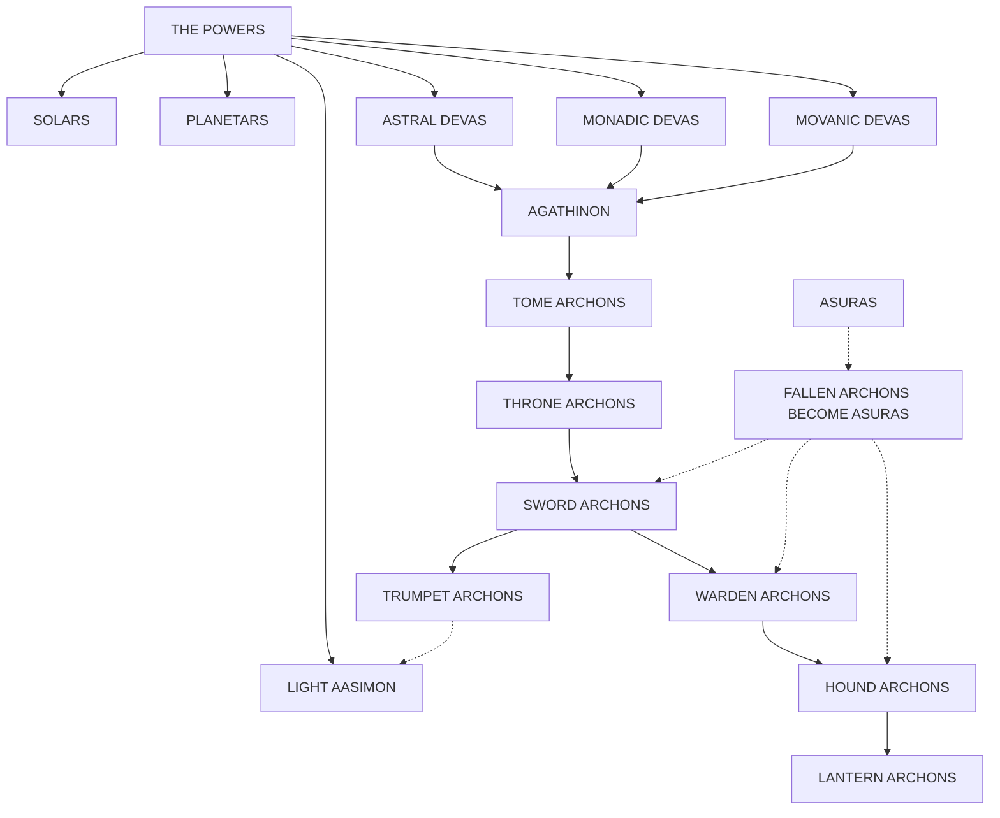

**SOLARS**: Proxies of the greatest powers, solars are almost gods themselves. They rarely interfere with others, since they are very involved with their power's affairs on the Prime. They are all unique, named creatures, each with a particular area of responsibility. The best known solars are Misrael, who serves a power of the sun; Brahmi, who serves a god of knowledge; and Bitternut, who serves Yondalla, the mistress of the halflings.

**PLANETARS**: These celestial stewards command the hosts of the Upper Planes when needed. They sometimes aid the most powerful of mortals on the Prime in missions crucial to their cause. They serve the powers directly and are not answerable to the solars. Like the solars, they are named individuals. The best-known planetars are Esoliel, planetar of light and forgiveness; Jerowan, planetar of wrath and righteousness; and Nikolai, planetar of good eternally triumphant.

**ASTRAL DEVAS**: All devas are proxies, though their status is slightly lower than that of solars and planetars. In times of need, they may be led by a planetar. The astral devas are the greatest of the devas, carrying out missions in the Lower Planes — behind enemy lines, as it were.

**MONADIC DEVAS**: These devas perform missions for the cause of Good in the Elemental and Paraelemental Planes.

**MOVANIC DEVAS**: Most privileged of all the devas, movanic devas aid mortal followers of good causes. When a creature of the Prime is raised or resurrected, they often lead or escort trumpet archons.

**LIGHT AASIMON**: Much like the lantern archons, the lights are the spirits of the greatest good beings, on their way to higher forms. However, since so few creatures reach this stage, there are far fewer light aasimon than lantern archons.

**AGATHINON**: Agathinon are the warriors of the aasimon. They are often sent on missions on the Prime, commanded by the celestial stewards (solars, planetars, and devas) or by the powers themselves.

**TOME ARCHONS**: Aloof, dignified, and learned, the seven tome archons are responsible for ruling the seven layers of Mount Celestia. If they perform their duties well, they are relieved of their responsibilities and transformed into aasimon.

**THRONE ARCHONS**: Great administrators, the thrones are ministers to the commands of the tome archons. They rule individual cities and realms.

**SWORD ARCHONS**: The most powerful of the fighting archons, sword archons are the leaders of the hounds and wardens. They are also the messengers between the powers of Mount Celestia.

**ASURAS**: Winged and clawed, the chaotic good asuras were archons until they fell into the ways of chaos. Though not precisely shunned, most Celestians avoid speaking to asuras if they can.

**WARDEN ARCHONS**: Watchmen, observers, and the guardians of the portals between layers, wardens have many duties similar to those carried out by hound archons. Unlike the hounds, however, they report their findings directly to the tome archons.

**TRUMPET ARCHONS**: Messengers of the greater archons, the trumpets are revered for the chances they take whenever they leave Mount Celestia to carry messages to the Prime and elsewhere. Because of the terrible risks they take, many trumpets are promoted to aasimon after only a few missions.

**HOUND ARCHONS**: Responsible for guarding the lanterns, the hounds report to the wardens. They serve as planar hosts to travelers new to Mount Celestia.

**LANTERN ARCHONS**: Lanterns are the Clueless of Mount Celestia: They are inexperienced, newly arrived petitioners, and are often confused. Most other archons look upon the petitioners with condescension and amusement, much as elders often humor their children.

## ORDER OF THE PLANES-MILITANT

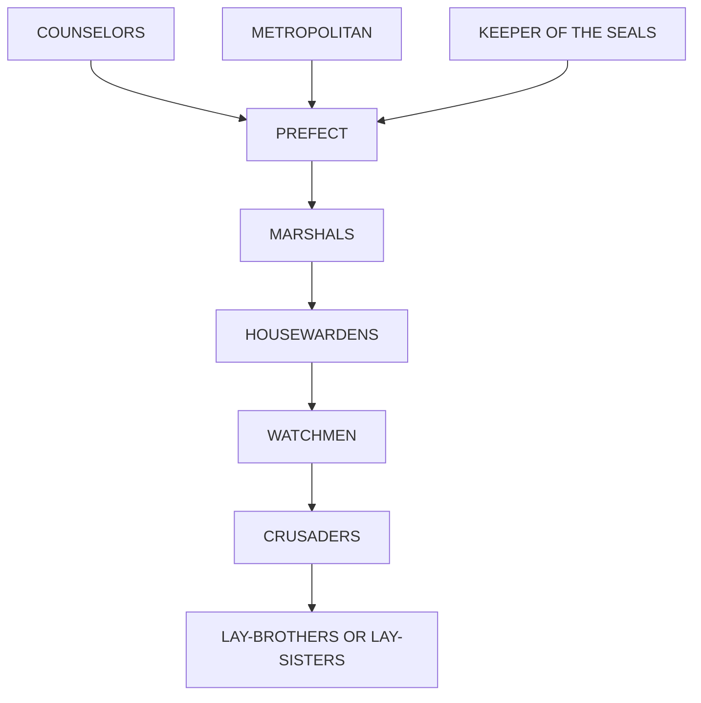

**PREFECT**: The supreme commander of the Order, the Prefect's post is sometimes held by the Metropolitan or the Keeper of the Seals. This is because the Prefect is elected by his peers, the eight greatest champions of the Order: the Metropolitan, the Keeper of the Seals, and the six greatest Marshals of the Order. Together, these champions are called the Council of White Wisdom.
The Council members almost always elect one of their own. The Prefect serves 10 years or until he or she is ousted by a special ballot called a Trial of Trust. Such an ouster has occurred only once in the Order's records, when Neverill the Black was removed following allegations of improper behavior. The charges were never proved, but Neverill the Black left for Arcadia and has not returned.

**COUNSELORS**: Proxies of the powers, the aasimon counselors may advise but may not command the Prefect. Closest to the Prefect's ear is Vestenor, a planetar who takes great interest in the spiritual direction of the Order.

**METROPOLITAN**: The Metropolitan is the religious leader of the Order, responsible for the spiritual well-being of every member, from the Prefect to the greenest lay-sister.

**KEEPER OF THE SEALS**: The post of Keeper is held by the most powerful of the Order's mages, and is often an adviser to the Prefect. The current Keeper is an often-speechless man called Indigo the Stutterer.

**MARSHALS**: Marshals lead the Order's field expeditions to other planes to defend the cold bastions of Law. Marshals are usually priests, mages, or warriors.

**HOUSEWARDENS**: Housewardens are commanders of garrisons, hospices, or other outposts of the Order.

**WATCHMEN**: An officer roughly equivalent to a captain, Watchmen gain their name because they constantly watch against evil.

**CRUSADERS**: Soldiers in the ranks, crusaders of the Order may be road wardens, knights, archers, mages, priests, scouts, or any other active warriors for the cause of Good.

**LAY-BROTHERS OR LAY-SISTERS**: Responsible for the day-to-day operation of the Order's hospices, roads, kitchens, and fields, the lay-brethren bear their heavy tasks with good cheer.

## DWARVES OF ERACKINOR

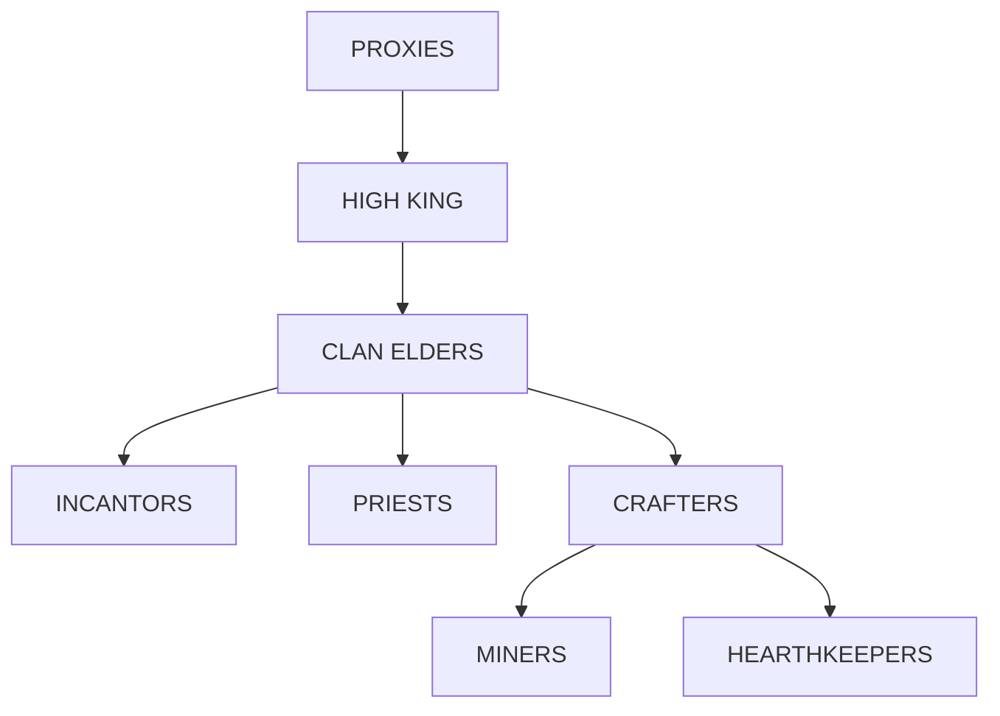

**PROXIES**: The chosen champions of Moradin and the other dwarven powers may command even the High King.

**HIGH KING**: Ruler of all he surveys, the High King is bound by tradition and by the will of the clan elders, for they can remove him from his throne if his ambitions become unstable or dangerous to the dwarves.

**CLAN ELDERS**: By dwarven tradition, the elders are the keepers of wisdom. The dwarves often defer to the elders in times of crisis.

**INCANTORS**: Responsible for chanting the praises of the powers, the incantors are the spiritual guides of the dwarves.

**PRIESTS**: Dwarven priests of various ranks are responsible for the spiritual well-being of all the petitioners of the realm.

**CRAFTERS**: Expert in all manner of artistry, crafters are the makers of all that is wondrous and fine in the physical world, from forge-work to masonry.

**MINERS**: Mostly young dwarves, the miners are a rollicking, hearty mass of dwarves who have chosen the eldest and the most honored profession of their race.

**HEARTHKEEPERS**: Primarily female, the hearthkeepers weave the webs of social ties between families, arrange marriages, and schedule and prepare the feasts and celebrations of the dwarven calendar.

Planes of Law • 2607XXX0503 • © 1995 TSR, Inc. All Rights Reserved.

# PLANES OF LAW

By Colin McComb and Wolfgang Baur

**RIGID, UNBENDING: LAW'S DOMINION E+ERNAL — ORDER +RIUMPHAN+!**

OPEN UP +HIS CAGE, CU++ER, AND EN+ER +HE PLANES OF LAW:

■ ACHERΘN, where armies of evil collide
◑ ARCADIA, where Law and Goodness clash
▼ BAA+ΘR, where malevolence corrupts the spirit
✱ MECH ANUS, where reason and order reign
▲ MΘUN+ CELES+IA, where hope is born anew

Inside this box a berk'll find:

✦ Five 32-page books describing each plane and its inhabitants for the Dungeon Master. Information on the monsters, realms, sites, and dangers of each plane are presented, along with adventure outlines.

✦ A *Player's Guide to Law*, a 32-page, full-color introduction to the wonders and hazards of the lawful planes, for DM and player alike. This book includes sites not found elsewhere.

✦ *Monstrous Supplement*, a 32-page, full-color booklet detailing 13 creatures, including new baatezu, the mysterious bladelings, the wondrous archons, and the "dryads" of Mechanus.

✦ Five fully detailed, poster-sized maps illustrating the layers of each plane, with diagrams of the intricate, formal hierarchies of the lawful planes.

EXHILARA+E in the rarefied air of Mount Celestia . . . EXPLΘRE the dark depths of Baator . . . EXUL+ in the supreme order of the Planes of Law!

TSR, Inc. 201 Sheridan Springs Rd. Lake Geneva WI 53147 U.S.A.

TSR Ltd. 120 Church End Cherry Hinton Cambridge CB1 3LB United Kingdom

**Sug. Retail**
US $30.00
CAN $39.50
UK £18.50

ISBN 0-7869-0093-8
<table>
  <thead>
    <tr>
        <th>Barcode</th>
        <th>Value</th>
    </tr>
  </thead>
  <tbody>
    <tr>
        <td>ISBN-13</td>
        <td>9780786900930</td>
    </tr>
    <tr>
        <td>Price Code</td>
        <td>53000</td>
    </tr>
  </tbody>
</table>

ADVANCED DUNGEONS & DRAGONS is a registered trademark owned by TSR, Inc.
PLANESCAPE, the Lady of Pain logo, and the TSR logo are trademarks owned by TSR, Inc.
©1995 TSR, Inc. All Rights Reserved.