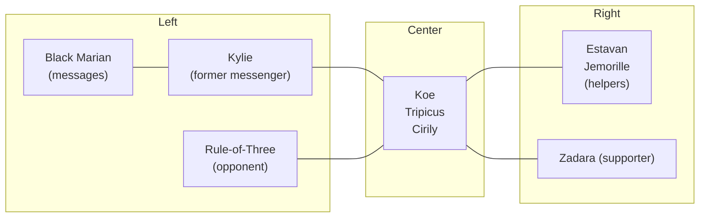
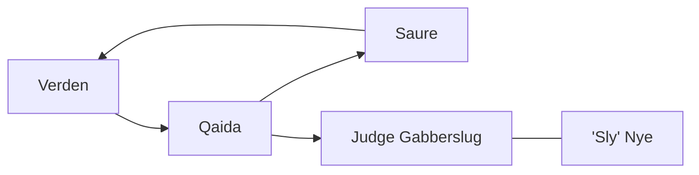
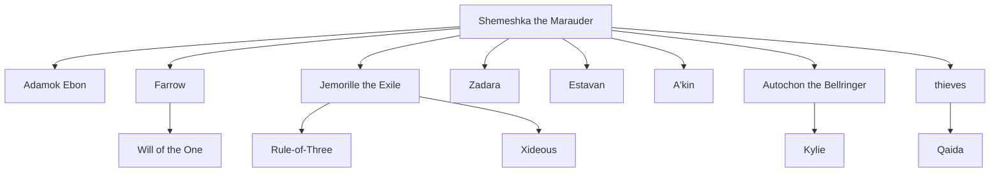

2624

**Advanced Dungeons & Dragons®**

# PLANESCAPE™
ACCESSORY

# UNCAGED:
# Faces of Sigil

# UNCAGED FACES OF SIGIL

Being a Pageant of the Varied Citizenry of the City of Doors, Including a Handful of Friends Most True, a Clutter of Fiends Most Vile, and a Gathering of Fellows Who Trade in Both Weal and Woe, as Suits Them.

## CREDITS

**Designer:** R.V. Vallese  
**Editor:** Michele Carter  
**Creative Direction:** Andria Hayday  
**Art Direction:** Bruce Zamjahn  
**Conceptual Artist:** Dana Knutson  
**Cover Artist:** Robh Ruppel  
**Interior Artist:** DiTerlizzi  
**Cartographer:** Rob Lazzaretti  
**Dabus Pictograms:** Diesel  
**Electronic Prepress Coordinator:** Dave Conant  
**Typography:** Angelika Lokotz  
**Border Art:** Robert Repp  
**Graphic Design:** Dawn Murin

Special thanks to Rich Baker, Wolfgang Baur, Tim Beach, Michele Carter, Monte Cook, "Zeb" Cook, Dale Donovan, Dori Hein, Colin McComb, J.M. Salsbury, Bill Slavicsek, Lester Smith, and Rick Swan.

**TSR, Inc.**  
201 Sheridan Springs Rd.  
Lake Geneva  
WI 53147  
U.S.A.

TSR logo

**TSR Ltd.**  
120 Church End  
Cherry Hinton  
Cambridge CB1 3LB  
United Kingdom

2624XXX1501

Advanced Dungeons & Dragons, ADD, Dungeons & Dragons, Dragon, Dungeon Master, Monstrous Compendium, and the Lady of Pain logo are registered trademarks owned by TSR, Inc. Planescape, Encyclopedia Magica, Monstrous Manual, and the TSR logo are trademarks owned by TSR, Inc. All character names and the distinctive likenesses thereof are trademarks owned by TSR, Inc. All rights reserved. Made in the U.S.A. Random House and its affiliate companies have worldwide distribution rights in the book trade for English-language products of TSR, Inc. Distributed to the toy and hobby trade in the United States and Canada by regional distributors. Distributed in the United Kingdom by TSR Ltd. This material is protected under the copyright laws of the United States of America. Any reproduction or unauthorized use of the material contained herein is prohibited without the express written consent of TSR, Inc.

# CONTENTS

## AN INTRODUCTION 4

Including a cautionary Tale of the dangers of Sampling minds, an Overview of the faces laid Bare in these pages, a Word concerning their sundry Relationships, and Notes on working them into a Campaign.

## A'KIN 8

A yugoloth of a most dubious Disposition and a Shop of most curious Magic.

## AUTOCHON THE BELLRINGER 10

A master of Couriers who paid a Dear price for Bargaining with Dark forces.

## BLACK MARIAN 12

A lyrical Priestess who hears the Future in the Waters of the Singing Fountain.

## KESTO BRIGHTEYES 16

A busy gnome who tries to part the Veil for the masses with a well-stocked Bookshop and mystifying Illusions.

## CIRILY 20

A fiery eladrin with a Distaste for primes — and the Inklings of a new faction.

## WOOLY CUPGRASS 22

An eccentric (some say Mad) bariaur who knows all manner of Liquid — by taste.

## DJHEK'NLARR 24

A githyanki who sells illegal Maps of the Lady's Mazes, and sends the Foolish and the Greedy to Mazes of their own.

## ADAMOK EBON 28

An icy Bladeling who makes her Living as a Hunter of prey, animal and Otherwise.

## ESTAVAN 30

An ogre mage and merchant lord who deals in every sort of glittering Treasure and dirty Cargo.

## FARROW 32

A shadow elf Spy who tried to break the Factions, but played his Roles too well and broke only his Mind.

## FELL 36

A Dabus defrocked by the Lady of Pain for taking up the Robes of her hated Foe.

## JUDGE GABBERSLUG 38

A capricious and stinking Fiend who sits in Judgment at the dreaded Court of Woe, a house of Dead and Undead alike.

## THE GRIXITT 42

A Terrorist who risks her eternal Spirit in order to slam shut the Portals of the Cage.

## HARYS HATCHIS 44

A wizardly Crier of Commerce whose campaigns and handbills mean Business.

## IARMID 46

An aasimar of soothing Word and gentle Touch who runs a house of Restoration.

## IEMORILLE THE EXILE 50

A rilmani of the Spire, a being of no little Power — and no little Modesty.

## KOE 52

A Rogue asuras who seeks to Defeat the fiends by Arming them.

## KYLIE 56

A tiefling tout of few Years but much Experience in filling Wants and Needs.

## LISSANDRA THE GATE-SEEKER 60

An Anarchist who means to chart the Doors of Sigil, so that such Knowledge might rest with the People.

## LY'KRITCH 62

A Shadow fiend desirous of Trapping the finest Minds in the Cage.

## MILORI 64

A lillend Diplomat and translator of foreign Tongues, including the airy Pictures of the dabus.

# CONTENTS

## MORVUN AND PHINEAS 68

Twin fensir Trolls who fancy themselves Bleak artists of music and Verse — though few Others do.

## "SLY" NYE 72
A Chaotic tiefling who defends the poor and the Clueless in the City Court.

## OMOTT 74

A naive linqua, Shorn from its god, who now seeks Power from a new deity.

## PARAKK THE RATCATCHER 76
An Ambitious githzerai who serves a Hundred masters.

## PATCH 78

A sentient Growth of razorvine that Trades its knowledge for Blood.

## QAIDA 80

A radiant Dustman who seeks to fill her Mimir with knowledge — and her fiendish Patron with victims.

## RULE-OF-THREE 84

A tanar'ri Wise man (or Beggar) who delights in Vexing those who seek his Aid.

## ALLUVIUS RUSKIN 86

A Seeming tiefling who sells the Keys for the Pathways of the planes.

## SAURE 90

A Gautiere rescued from exile and prodded by the Athar to champion their Cause.

## SEAMUSXANTHUSZENLIS 92
A dust mephit of Fickle mood and tongue who sells items most Unwholesome in the darkest Depths of Sigil.

## SHEMESHKA THE MARAUDER 96

A fiendish Cross-trader whose impeccable Grooming masks a core of Evil.

## TARHOLT 100

A dwarf who Left his family's Smithy to forge his own Path as a canny trader.

## TRIPICUS 102

An ursinal Scholar who has made a Comfortable living from the Prime — and from the Blood War.

## UNITY-OF-RINGS 104
A deva of Grace and Charity who counsels the good Citizens of the Cage — whether they Welcome it or not.

## THE US 106

A secret Swarm of vermin that find in their swelling Numbers both incredible Wisdom and fantastic Power.

## VERDEN 108
An alluring elf who Prolongs her own life by stealing that of Others.

## THE WILL OF THE ONE 110
A gathering of Signers who tout the One and look to Revive a dead God.

## XIDEOUS 114
An erudite Gehreleth who seeks to sell the Hated yugoloths into eternal Slavery.

## YLEM 116
A modron that Thinks itself a slaad — or a slaad that Thinks itself a modron.

## ZADARA 118
A hale and Hearty titan who uses her vast Wealth to fuel much Enterprise.

## AN APPENDIX 122

A passing Glance at a handful of other Faces in the Cage, and a profile of the Ties that bind the principal Faces in this volume.

## INDEX 127

# AN INTRODUCTION

*How much can a person see in a single lifetime? How many roses can he smell, how many elegies can he hear, how many mountains can he climb, how many faces can he touch? The multiverse beckons with too many fingers — a bittersweet agony. No mortal being can ever truly know a fraction of its immeasurable treasures. But we in the Society of Sensation have sworn our lives to the attempt. And we desire to fill others with as much as their trembling forms might hold.*

*We collect memories here at the Civic Festhall. We buy them from the citizens of Sigil, from the peoples of a hundred strange worlds, from the endless stream of planewalkers who pass through our city between exploits. We store them in enchanted recorder stones, so that we — and any who desire — may know experiences the like of which were never dreamt possible.*

*I work in our Festhall's sensoriums, guiding the curious to the sensations they seek, to one of the millions of recorders that hold the accumulated experiences of the planes. The semiprecious stones are not unlike mimirs. But whereas those magical skulls merely store and disgorge factual knowledge, a person who holds a recorder feels his body swell with the full sensation of an experience, the full composure of a memory, as if hurled into the reality that swirls within the stone. With a recorder, you can feel the stinging gales of Carceri flay the skin from your face, feel yourself drown blithely in the silver sea at the base of Mount Celestia — and revel in the secret sins of all those who have traded their memories for gold.*

*That is my greatest pleasure. Every moment I have to spare is spent in the sensoriums, absorbing the lifetimes of humans, tieflings, devas, fiends — anyone and anything that has ever imparted a piece of themselves to a recorder. I cannot count the number of times I have come back, and still the memories lie sleeping in stones so plentiful that I weep at the thought of being unable to try them all. I would smuggle them out in their boxes if I could, ferret them away in my empty home, there to sample them at my leisure. But the enchantments fade if taken from the Festhall, the memories fleeing the recorders like doves from an opened cage.*

**THE SECRETS OF ANOTHER ARE THE SWEETEST FRUIT OF ALL.**
**— A SENSATE IN THE CIVIC FESTHALL**

*Thus, the sensoriums have become my world, my all, a silent museum whose forgotten live again in me. I scrape the moss from their white marble busts, exposing their triumphs and sorrows, their pride and shame. I feast on that which they would keep hidden, partaking of their secrets as if they were laid bare on the illicit pages of stolen diaries. It is far more intoxicating than the diamond meads of Arborea, and infinitely more fulfilling. There is always another monument to be uncovered, another memory to be ingested, and each is as sweet as the last.*

*Here in the womb of the Festhall, I lead a thousand lives except my own. The fantastic city beyond these walls holds many riches indeed, but its sensations are laced with peril, and the denizens of the so-called Cage are too eager to bestow upon others the final experience. But here I delight in their secrets, too, and I need reveal nothing of myself, need not put myself at risk. I choose which spirits to unleash from the recorders. I decide which shall live for a precious few moments in my mind, and which shall remain buried in another small box in a mountain of boxes.*

*Perhaps one day I, too, will sell my memories, my experiences, to the Festhall. Perhaps one day others will come to a sensorium, take up my recorder stone, and know what it is to be me. Perhaps one day another will know more of me than he does of himself, as I do of those now contained in these stones.*

*For now, though, I am content to remain in my lurid museum, the curator of this house of secrets, a sponge in a sea of faces.*

✦ 4 ✦

DiTerlizzi '96

# ✦ WHAT'S IN THIS BOOK ✦

*Uncaged: Faces of Sigil* presents 41 nonplayer characters and groups suitable for encounters and intrigues in Sigil, the wondrous City of Doors. It's meant to be read and used by Dungeon Masters (DMs), *not* players. If you plan on playing a character who might run into one of the folks in this book, don't read any further — why ruin the surprises in store for your hero?

Each nonplayer character (NPC) in this book is fully developed and ready to be introduced into a PLANESCAPE™ campaign, or any other AD&D® campaign in which the player characters journey to Sigil or the planes. (See "Using the NPCs," below, for tips on how to work the characters into a game.) The NPCs are presented alphabetically on pages 8 through 121.

The Appendix provides a quick look at 15 additional NPCs, giving DMs even more possibilities for their PLANESCAPE adventures. It also contains a two-page review that sums up the major storylines woven throughout the book and shows how the main characters fit into those diverse plots.

Finally, the Index gives references for the important people, places, and items mentioned in the NPC entries and the Appendix.

# ✦ READING THE ENTRIES ✦

Each entry in this volume includes the same basic information about a character: personal history, physical appearance, goals, personality, occupation or activities, favorite hangouts in Sigil, and potential connections or utility to the player characters. But you won't find these topics set apart and labeled within the body of the text. Each entry is meant to be read as a narrative — one that tells you everything you need to know about a character without reducing him, her, or it to a list of facts. Many of the entries are written from the featured character's own point of view, while others present interviews, letters from one person to another, and so on.

Of course, while this approach makes for entertaining reading, it can be tricky to pull out needed facts during game play. That's why each entry also contains the Quick Chant, a separate column of bare-bones information. In each NPC's Quick Chant, you'll find:

* complete game statistics, including notes on special attacks and defenses;
* the source in which the character's race (if unusual) is described;
* a few words that define the NPC's personality;
* special equipment carried (the DM can equip each NPC with any standard items desired);
* class, faction, granted abilities, and restrictions (if they apply);
* spells and spell-like powers (if any);
* the NPC's usual location in Sigil;
* tips on role-playing the NPC effectively;
* tips on how the NPC might act in combat;
* references to other characters in *Uncaged* tied to the NPC's history or goals.

A note on the Quick Chant: Not every character ability or power noted is available at all times. For example, several characters have access to *gate* or *teleport* powers — but in the Cage, virtually the only way in or out is through the portals that the Lady of Pain opens and closes at her whim. Therefore, Verden (pg. 108) can't use her *cubic gate* to escape attackers, and Shemeshka the Marauder (pg. 96) can't call in yugoloth enforcers to defend her — but then again, these bloods probably don't need the help.

# ✦ THE TIES THAT BIND ✦ 

None of the NPCs in *Uncaged* are stand-alone characters. Each is connected in some way to one or more other NPCs in the book (and even to some of the quick-sketch characters in the Appendix). Of course, you don't need to make use of a character's friends and enemies every time you decide to work that NPC into a playing session, but the connections help enrich each entry and give players the sense that Sigil is a living, breathing place.

Some of the ties are light. For example, "Sly" Nye (pg. 72), the tiefling legal advocate, occasionally argues a case before Judge Gabberslug (pg. 38), a bloated fiend. The two characters figure into each other's entries, but only in a peripheral manner.

Other ties run much deeper, and the characters cross paths in more significant ways. Parakk (pg. 76), a githzerai who bills himself as a trapper of cranium rats, is in reality a servant of the entity called the Us (pg. 106) — a hidden pack of rats growing in number and intelligence.

Sometimes, an NPC is important enough to be linked with many other characters. Relationships crisscross throughout the book, forming intricate webs of duplicity, friendship, and enmity. To get the big picture — to understand all the ramifications of such a "well-connected" character's actions — you might have to read a number of other entries.

# SPOTTING THE LINKS

The SEE ALSO section of an NPC's Quick Chant refers you to all other relevant characters. But when you come across names that pop up in the middle of an NPC's entry, remember these guidelines:

✦ 6 ✦

* If the individual’s name is followed by character information enclosed in parentheses — such as (Pl/♂ human/F4/Free League/CN) — it means that’s the only definition that character has. In other words, he’s just a bit player (or a major character who’s described more fully in another book) and doesn’t have his own entry in *Uncaged*.

* If the individual’s name is not followed by parenthetical information, it means that he’s a major character, fully defined in his own entry elsewhere in the book.

## USING THE NPCs

Some of the characters in *Uncaged* might serve best as a single encounter, perhaps to enliven a party’s trek through Sigil or as a quick diversion from the main action. For example, the deva called Unity-of-Rings (pg. 104) flies around the Cage performing random acts of charity and goodwill, and the Bleaknik artists Morvun and Phineas (pg. 68) often play their depressing musical verse at inappropriate places around town.

A number of folks in this book own shops likely to be frequented by adventurers. The frenetic Kesto Brighteyes (pg. 16) runs the Parted Veil, a bookshop of knowledge (and propaganda) open to all. Travelers seeking gate keys should check out the selection at Tivvum’s Antiquities, a tower crammed with goods and managed by an old tiefling named Alluvius Ruskin (pg. 86). And the fickle dust mephit known as Seamusxanthuszenus (pg. 92) sells valuable animal parts from his shop deep underground. Dungeon Masters can let player characters discover these and other spots as the need arises, or can fix them as established locales well before a party stops by for a visit.

Many characters in *Uncaged* offer more intangible services, like Kylie (pg. 56), the tiefling tout who ferries messages and sells information, or Wooly Cupgrass (pg. 22), a bariaur Sensate who’ll identify an unknown potion by tasting it. Word of mouth spreads quickly in Sigil, and player characters will probably hear of such services before they’re likely to need them.

## CAPITAL INTRIGUES

*Uncaged* features plenty of NPCs who figure prominently into major storylines — plots that can eventually draw the player characters into their clutches. Some of these storylines include:

* **FACTION CONFLICTS.** The Sign of the One and the Athar seem to be heading for a clash, given that the first faction wants to resurrect a dead god and the other wants to stop them. Even worse, the corpse in question is Aoskar, the self-appointed “god of portals” who was cast into the Astral Plane by the Lady of Pain herself. (The Athar’s own Shattered Temple used to be dedicated to Aoskar’s worship.)

* **MIND TRADING.** A shadow fiend — fronted by an aasimar, a shining child of noble heritage — prowls the crannies of Sigil, looking to capture minds in its dark gems. It’s all part of a wild mage’s scheme to find a trapped spirit strong enough to win her control of the city.

* **THE BLOOD WAR.** The eternal battle between baatezu and tanar’ri has spilled out of the Lower Planes for the last time — at least, if a secret cabal of rogue celestials has anything to say about it. Of course, the fact that their plan involves arming the fiends might give folks in Sigil cause for concern.

For an overall view of the NPCs mired in these and other plot threads — as well as the shopkeeps, service providers, and bigwigs featured in *Uncaged* — please refer to pages 125 and 126 of the Appendix.

## OTHER REFERENCES

To play the role of the NPCs in *Uncaged*, a DM must have the two basic AD&D rule books: the *Player’s Handbook* and the *DUNGEON MASTER® Guide* (DMG). These books describe most of the equipment, spells, and magical items mentioned in these pages. The PLANESCAPE Campaign Setting boxed set is also required; it explains how to run campaigns and adventures on the planes and introduces the city of Sigil.

The rest of the products named in this section are optional, but they’ll go a long way toward giving you the most fun and use out of *Uncaged*.

First of all, some of the NPCs have mastered spells from the *Tome of Magic* or possess items described in the volumes of the *ENCYCLOPEDIA MAGICA™*. If you don’t own these books, feel free to substitute spells and magical items from other sources.

Many of the NPCs in *Uncaged* aren’t human or even humanoid; instead, they represent races including aasimon, fensir, tanar’ri, and yugoloth. If you’d like more complete explanations of their racial histories, ecologies, and the like, please refer to the *MONSTROUS MANUAL™*, the PLANESCAPE MONSTROUS COMPENDIUM® Appendix (PS MC), the PLANESCAPE MONSTROUS COMPENDIUM Appendix II (PS MCII), and the Monstrous Supplement (MS) booklets in the PLANESCAPE Campaign Setting, *Planes of Chaos*, *Planes of Conflict*, and *Planes of Law* boxed sets as noted in the individual entries.

Other accessories in the PLANESCAPE line provide more details on a number of references made in *Uncaged*. *In the Cage: A Guide to Sigil* lays out the city, ward by ward; *The Factol’s Manifesto* looks at the secrets of the planar factions; and *Well of Worlds* gives numerous short adventures and new magical items. Many of the NPCs developed in *Uncaged* were first mentioned in these other products.

Finally, a few of the characters in *Uncaged* appear in the PLANESCAPE adventures *Harbinger House* and *Something Wild*, and four of the NPCs in this book were first introduced in DRAGON® Magazine issue 213.

✦ 7 ✦

# A'KIN

When it comes to the dichotomy known as A'kin the arcanaloth, most bashers in the Cage point to the name of his successful magical-trinket shop to sum up his dual nature — The Friendly Fiend. A fine marketing ploy by pitchman Harys Hatchis, or just the plain truth? One thing's for sure: A'kin's got to be the best-natured yugoloth this side of — well, *anyplace*. 'Course, plenty of folks find it hard to swallow. Even after years of presenting himself simply and sincerely, A'kin still brings out more suspicion than a thief in church.

The only thing outwardly fiendish about A'kin is his appearance. Like most arcanaloths, he resembles a tall, broad-shouldered human with a furry body, clawed hands, and the head of a fanged jackal. A wide, black stripe of fur partially encircles his golden eyes like a bandit's mask, starting at the outside corner of one eye, swooping down across his white snout, and reaching the outside corner of the other. He wears a robe speckled with teal, gold, and black; it neatly hides most of his clean, sandy brown fur. Though the arcanaloth greets customers with a grin, his prominent, sharp fangs have made many a visitor hesitate in the doorway of his Lower Ward shop. A'kin playfully admonishes the peery in his low, raspy voice: "Come in, come in! I won't bite."

> BEWARE OF FIENDS
> BEARING GIFTS.
> — MESSAGE HEARD UPON ENTERING THE PARTED VEIL BOOKSHOP

Once in the tall, one-room shop, a berk's just as likely to be *given* something as he is to *buy* it. A customer who comments on some ornament dangling from A'kin's thick wrist or multiply pierced ears just might find it pressed into his hand by the smiling yugoloth.

Hundreds of bins line the shop's walls, each filled with small magical trinkets, toys, and gadgets — hypnotic tops, enchanted dice, and the like. When A'kin sees a browser about to walk out without making a purchase, he reaches into the nearest bin with his big, clawed hand and runs to the door, holding a tiny trinket up to the sod's face. "It's yours, friend," he says. "Free of charge." No shoppers ever refuse these gifts (most are afraid to).

Many feel such fear is misplaced, as A'kin seems as gracious and big-hearted as a deva. Even when it comes to the shop's priciest items — magical long swords, special suits of armor, and the like, all displayed behind glass in the center of the room — A'kin is a no-pressure salesman. Fact is, he often distracts customers with his pleasant chatter about a fresh new shipment of Elysian tea or a dabus construction project on the street outside.

Sometimes A'kin surprises a customer by asking about her family members by name or inquiring about some trip or endeavor she's recently undertaken. The yugoloth always assures the customer that the two of them have discussed the subject before — how else could he know of such matters? 'Course, a lot of folks just think the fiend knows more than he should or has a way of extracting the dark of things before the "extractee" is even aware of it.

As much as he shows interest in his clientele, A'kin's quite shy of

berks asking about him. "I'm merely a humble shopkeep," he says, bowing. Not a sage in town can place the day A'kin first set foot in the Cage, but the fiend built up his business in a hurry and took pains to fit in. And when asked direct questions about himself or his past, A'kin gives only vague answers — "As like as not," he says, or "It's as certain as the Spire," or even the achingly polite but painfully empty "Thank you for asking." The fiend leaves it to others to pen his biography.

And they do spread his story, by word of mouth. Some say A'kin's as two-sided as the next arcanaloth, hardly a friendly neighbor. No, they think he's been sent to Sigil to pick up chant that might be useful in the Blood War. That's why he pries so sodding much with all his customers — a body never knows when a seemingly petty bit of chant later might turn out to be quite valuable. Whether the arcanaloth is the eyes and ears of the Dark Eight or under the thumb of a balor general, though, is up for debate. In the end, most of his detractors feel A'kin sells information to the highest bidder, answering to one berk and one berk only — himself.

Other bashers see no reason why an arcanaloth'd willingly and permanently leave Gehenna, since arcanaloths draw their power from that infernal plane. These folks say A'kin's an exile. Driven from his fiendish brethren, he had to make a new life in the Cage — and change his ways to turn aside the hateful stares usually cast at his kind. 'Course, he must've done something really horrible (or really *good*) to be judged unfit for fiendish company. To this day, or so the story goes, A'kin lives in fear that the mysterious General of Gehenna will send a nycaloth assassin to make him pay the music. (If so, A'kin's done a poor job of hiding out — he's known to every sod in the Lower Ward.)

Finally, there are those who swear the fiend is just plain barmy. They say that when he locks up the shop at night, he heads upstairs to his windowless quarters and screams, jumps, and throws himself against the walls. It's a way to let loose all the rage and evil he's suppressed all day long. The fear is that A'kin's going to snap one day in a shop full of customers, shredding them with his poisonous claws or burning them with his ability to produce flame.

Maybe he leaves the Cage each night via a lower-planar portal in his quarters. Or his years of false smiles and forced niceties might just be groundwork for the grandest deceit imaginable. Some folks wish he'd have fits in public like another well-known arcanaloth, Shemeshka the Marauder — at least that way, a berk'd know where he stood with the fiend. That uncertainty is what makes A'kin so dangerous.

'Course, that uncertainty might also be the fiend's sharp mind at work. In any case, A'kin's quite adept at his role — and he's having fun with it, too. He dispels no rumors, answers no questions, and seems disinterested with his own life but fascinated by everyone else's. Which, naturally, makes him all the more interesting. And it sure doesn't hurt business, either.

# Quick Chant

**A'kin**
(Pl/♂ arcanaloth/HD 12T24/NE)

AC -8; MV 12, Fl 18 (B); hp 92; THAC0 7; #AT 3; Dmg 1d4/1d4/2d6 (claw/claw/bite); SA spells, poison; SD T3 or better weapons to hit, can't be surprised on Lower Planes, immunities, SW cold; MR 60%; SZ M (6 feet tall); ML champion (16); Int supra-genius (19); XP 20,000.

**SOURCE**: PS MC

Notes: **SA**—has spells as a 12th-level mage (see "Spells," below); poisonous claw attacks inflict cumulative, permanent -1 penalty on foe's attack roll unless negated by *bless*, *neutralize poison*, or *slow poison*.

**SD**—immune to mind-affecting spells; no damage from acid, fire, iron weapons, or poison; half damage from gas; 19 Intelligence grants immunity to 1st-level illusions.

**SW**—double damage from cold.

A'kin can read and write all known languages.
**PERSONALITY**: evasive, friendly, gracious.

**SPECIAL EQUIPMENT**: *cube of force*, *ring of spell turning*.
**SPELLS** (4/4/4/4/4/1): DMs should feel free to give A'kin any 1st- through 6th-level mage spells desired. He eschews destructive magic in favor of evasive, confusing spells. His favorite spells include *avoidance*, *confusion*, *forget*, *geas*, *nondetection*, and *protection from good*.

**SPELL-LIKE ABILITIES** (1/round, at will, unless noted): *advanced illusion* (1/day), *alter self*, *animate dead*, *cause disease* (reverse of *cure disease*), *charm person*, *continual darkness*, *control temperature* (10-foot radius), *fear* (1/day), *fly* (unlimited duration), *gate* (1/day: 1d6 mezzoloths, 1d2 dergholoths, or 1 arcanaloth; 40% chance of success), *heat metal*, *improved phantasmal force*, *invisibility*, *magic missile*, *produce flame*, *shape change* (any humanoid form), *telekinesis*, *teleport without error*, and *warp wood*.

**LOCATION**: The Friendly Fiend, a magic shop in the Lower Ward.

**ROLE-PLAYING**: Eager to greet and chat with each customer, ready with a grin and a wink, A'kin is friendly — perhaps too friendly. He acts like he's playing a game that his customers can see right through; still, he and they follow the rules of social decorum, neither side admitting that they know it's a game.

**COMBAT**: A'kin is evasive in combat, preferring to use his spells — *charm person*, *continual darkness*, *fear*, *invisibility*, and so on — to fend off attackers. If forced, he'll use his poisoned claws in self-defense; as a last resort, he'll teleport away from the scene.

**SEE ALSO**: Estavan (pg. 30), Harys Hatchis (pg. 44), Alluvius Ruskin (pg. 86), Shemeshka the Marauder (pg. 96), Verden (pg. 108), and Xideous (pg. 114).

9

# AUTOCHON THE BELLRINGER

The minstrels of Sigil weave glamorous tales of the brave couriers who walk its streets, carrying messages of love, commerce, and betrayal. These songs spark the minds of the children of the city, who play at the role — delivering coded messages, dodging ambushes, and bursting into their secret headquarters in the nick of time.

*This tale is not one told by bards, for it is true.*

There once was a courier named Autochon, a charming and handsome man who put other runners to shame, so diligent and fleet of foot was he. Ere long all in The Lady’s Ward asked that only Autochon deliver their messages; the ambitious young man saw this as a portent that he should found his own courier service in the ward. This he did, and quickly it became known as one of the finest. Rich lords relied on the talkative man’s “silent couriers” — runners carrying batons enchanted with *magic mouths* that gave their messages only to the proper recipient — and mages entrusted their mystical packages only to Autochon’s couriers, magically bound as they were to their goods.

“I shall — I must — have the foremost courier service in Sigil,” Autochon said, and he very nearly did — but for the growing attacks on his workers that robbed him of messages, customers, and ofttimes the couriers themselves.

When none could guarantee Autochon the protection he needed, all looked lost. That is, until the arcanaloth Shemeshka the Marauder made her presence known. She suggested that Autochon meet with Noxana the Unwilling (Pl/♀ tiefling/C6/Free League/CE) at the dread

Temple of the Abyss. A place of last resort it was, but contracts with the fiends of the temple were always honored. (Noxana the Unwilling is responsible for such contracts.) In the shadow of the temple’s bell tower, Autochon met with Noxana.

And what a meeting it was. Noxana was drawn to the man’s elegant face — his dark brown skin, his light green eyes, the brilliant ink of the dragon tattooed on his high cheekbone. As she traced with her finger this faction symbol of the Free League, Autochon brushed her unruly raven hair off her face and found a similar golden symbol dangling from her earlobe.

For a moment they said naught, then flew into negotiations, their excited words sparking off each other. Autochon began each sentence with “I must have,” but Noxana the Unwilling was just as demanding in turn. Eventually, the contract — promising fiendish protection in exchange for free courier service — was signed, in blood. But the two continued to meet in shadows. For to Autochon, Noxana was not unwilling.

Unfortunately for the pair, a spy ferried word of their trysts to the temple’s high priest, Noshteroth of the Umber Scales (Pl/♂ tiefling/C10,T12/Bleak Cabal/CE). Enraged, Noshteroth impaled the spy on the temple’s bladed facade, there to hang and die as ravens slowly ate his flesh. Whether Noxana was the cherished daughter or secret lover of the high priest was uncertain, but Noshteroth swore that Autochon would pay for his dalliance. He condemned the human to the fate suffered by all those who betray the temple — forevermore, no matter how long or how far he might flee, Autochon would hear the endless, maddening peals of the tower’s Bells of Baphomet.

Autochon tried in vain but could not drive the noise from his head, not with distance, not with magic, not with cloth stuffed into his ears. His comrades heard nothing, but

the bells kept Autochon from sleep and brought him to the edge of insanity within three days. And when he barely survived an attack by the dissonant Demon of the Bells, Autochon stumbled to the house of repute known as Fortune’s Wheel, there to find Shemeshka the Marauder.

“Please, good lady,” cried the warrior, crumpling to the floor with his hands against his ears, “I must have your aid!” Shemeshka observed him carefully, then nodded and pointed to her empty palm. Autochon desperately ripped a sack of coins from his belt, but she laughed and turned away — he would owe her much more. With a wave of her hand, Shemeshka’s groomer-guards strode forward, bearing a fine, full suit of dull gray armor — special plate mail from the Gray Waste.

They dressed the sobbing man in the tight metal and slid the heavy helmet over his head; Shemeshka herself stepped forward to snap shut the visor. And as she did so, the ringing din in Autochon’s head

I MUST HAVE AN APPOINTMENT! — AUTOCHON TO IARMID, AT THE OTHER PLACE

quieted to the level of bells tolling in the distance — the sound he would hear for the rest of his life, a life to be spent forever in armor.

Autochon took a first, awkward step in his new shell. And the armor made a peculiar sound. For to shield him from the temple's bells and its shimmering demon, the magical armor absorbed the fiendish sounds. But the flat gray mail could not contain it all. Instead of clanking as its new master moved, the armor *jingled*. The tavern fell completely silent, all eyes turning toward the delicate, tinkling sound. Thus did Autochon receive his title, known ever after as the Bellringer.

From that day forward, Autochon wore the full suit of armor at all hours, despite blistering heat or draining fatigue. Over time, his once tall and straight form bent crookedly under the weight of the metal. Many in Sigil thought he wore the armor to hide some monstrous disfigurement. They often gasped when Autochon lifted his visor for a quick bite of bread or breath of fresh air, revealing a striking, handsome face. In moments, he would wince at the increasing volume of the bells, and slam shut the visor.

Thus did Autochon's once-common chats with his customers become infrequent whispers, his smiles as rare as precious stones. Often he said nothing at all, but could be heard cursing himself beneath his gray helmet. The tenacious man who once began every sentence with "I must have" was reduced to the simple, plaintive plea: "I must have silence." He grew intolerant and quick of temper, particularly of the couriers who enjoyed protection at his expense. Autochon began to treat them with bitterness, cutting out the tongues of those who refused to pay him a fee for the right to carry messages. This, of course, made it more quiet for the man — and put a gruesome twist on the notion of silent couriers.

Only one courier has ever refused to make such payment and kept her tongue: a woman-child named Kylie, who quit in the middle of a delivery, stole the message, and left Autochon with a mess. Enraged, he meant to kill her, but Shemeshka the Marauder stepped in to stay his hand, insisting that he secretly protect Kylie instead. Autochon wondered if the arcanaloth had not planned this ending from the start.

And what of Autochon the Bellringer? Alone, tortured, he devotes each hour to the betterment of his service. He must succeed, must justify the temple's hideous contract with plentiful profits — much of which goes to Shemeshka as compensation for the armor. Autochon keeps to the silent halls of the Palace of the Jester, a little-used gathering ground for the rich and powerful of the ward, from which he manages his couriers. He prefers to keep his mind occupied (the less to hear the distant bells), and so himself deals with those who come to hire messengers. If luck holds, a customer may catch a legendary glimpse of his face when he lifts his visor, offering a brief look at the man who once was.

## Quick Chant

**Autochon the Bellringer**
(Pl/♂ human/F12/Free League/NE)

**AC** 1 (full plate armor); **MV** 12; **hp** 88; **THAC0** 9 (6 w/ scimitar); **#AT** 5/2; **Dmg** 1d8T4/1d8T4 (scimitar, Str); **SA** scimitar, Strength bonus; **SD** armor; **SW** confined to armor, jingling, faction restriction; **SZ** M (6 feet tall); **ML** steady (12); **XP** 2,000.

**Notes:** SA—*scimitar of speed T3* grants Autochon the first attack in each melee round and gives him one bonus attack per round, increasing his #AT from 3/2 to 5/2 (two attacks in the first round and three in the second); Strength of 16 grants Autochon T1 to all damage rolls.

**SD**—Gray Waste plate protects him from the Bells of Baphomet at the Temple of the Abyss and from the temple's Demon of the Bells.

**SW**—when not in his plate armor (including helmet and closed visor), Autochon is tormented by the Bells of Baphomet. On the first day without the armor, the bells impose a -4 penalty to his THAC0; the second day, -8; the third and each succeeding day, -11. The armor jingles with each movement; while suited, he cannot surprise foes. The weight of the armor imposes a cumulative -1 penalty to his THAC0 on each round of melee after the 5th. Also, as an Indep, Autochon has no representative in any official city business, and therefore has few protected rights.

**S** 16, **D** 10, **C** 16, **I** 14, **W** 10, **Ch** 8.

**Personality:** bitter, driven, professional.
**Special Equipment:** Gray Waste full plate armor, *scimitar of speed T3*.

**Faction Abilities:** gains T2 to saves vs. attempts to control his mind; gets 20% discount on items purchased in Sigil's Great Bazaar; connected to Indep underground network of information.

**Location:** Palace of the Jester in The Lady's Ward, where he meets with clients looking to hire a courier.

**Role-Playing:** Autochon hates noise and always whispers; he tries to ignore his jingling armor and any comments on it made by others. Because he's driven to succeed, he uses the hard sell on folks who come to hire a courier, even if it doesn't seem necessary. However, he treats all customers with respect.

**Combat:** Autochon is easily provoked and comes on strong immediately — he knows his skills will drop (due to the weight of the armor) if a battle lasts more than 5 rounds. If attacked in public, 1d4 couriers (2nd-level thieves with daggers) come to his aid within 1d4 rounds.

**See Also:** Black Marian (pg. 12), Iarmid (pg. 46), Kylie (pg. 56), and Shemeshka the Marauder (pg. 96).

11

# BLACK MARIAN

First, a body hears the music: Soft, dulcet tones slink and drift through The Lady’s Ward, tugging at each berk’s ears, whispering for him to come closer. Beneath the music, a sweet soprano sings haunting ballads in perfect key. Step farther into the ward, and the flutelike voice and hypnotic music grow louder, clearer, as the ethereal trail pulls the curious to its source: the Singing Fountain.

Sprawling grandly between the City Court, the Palace of the Jester, and the Twelve Factols tavern, the fountain’s a marvel. Above a circular stone pool fully 100 feet across, dozens of tilting metal basins rise high into the sky, each catching the falling waters from the basin above. The basins ring with unique musical pitches, delicate mixtures of violins and voices: in full bloom, it’s as soothing as a celestial choir. But no matter how much the peals resonate in a body’s bones, it’s the priestess Black Marian who draws him in with her songs.

And it’s only Black Marian who sees — or, more correctly, hears — the future of those who drink from the pool.

Not one blood in Sigil can remember a time when Black Marian wasn’t the keeper of the Singing Fountain (’course, some may know but choose not to tell). But the slender priestess of Bragi looks to be a shade under 30 years old, with dewy milk-white skin that glistens with the reflected ripples of the pool. (A few leatherheads think the fountain’s water must be an elixir of youth, but such a claim’s never been proven.) Graceful and lithe, the priestess glides about as freely as a will-o-wisp in an airy white cloak. Fine flaxen hair flows like a hood of cornsilk down to the middle of her back. Fact is, only her large eyes — with both iris and pupil the same cold, dark shade of ebony — lend truth to her name.

Whenever the pale gray-green feathers of Sigil’s pigeons clog the fountain’s pool — souring its perfect melodies with dissonant, plaintive chords — Marian collects and dries the feathers. On occasion, she hands one or two to sods who’ve come to hear the music; they’re greatly honored by the gift. ’Course, she generally pins the feathers to her cloak and wears them in her hair. In hot weather, when pigeons flock around the fountain for days at a time, Marian’s so covered with discarded feathers that she looks more like a swanmay than a human.

Some say Black Marian is more than human. Her singing voice’d enchant even a siren; the hunter Adamok Ebon likens it to the hypnotic sounds of the balaena or the songsharks that swim the River Oceanus.

> FEATHERS AIN'T THE ONLY THING THOSE PIGEONS DROP IN THAT WATER.
> — A BERK REFUSING MARIAN'S SILVER LADLE

As Marian — a worshiper of the god of song — tends to the fountain, she sways about like a cloud and sings gorgeous, compelling ballads in delicate harmony with the music of the basins. From time to time, she augments her “performance” with a variant of the enthrall spell, which guarantees a rapt audience for the duration of her song. Even without the spell, the alluring tapestry of sounds draws crowds by the dozens each day.

The priestess considers herself a public entertainer; she depends on the audience for her living. For a price, she divines the future of anyone who drinks from the pool’s water (if a customer balks at floating feathers, she offers to cast purify food and drink first). She keeps a silver ladle tied to a belt under her cloak; when a customer steps forward, he takes the ladle, dips it in the pool, and drinks the cupful down.

When next he opens his mouth to speak, instead of words, wondrous music — much like that heard from the Singing Fountain — issues forth. Newcomers in the crowd usually gasp at this point, but Marian bids them be silent with a wave of her hand. After a few moments spent listening, Marian hears the customer’s future in the music and whispers it into his ear. A “donation” of 5 silver pieces buys the berk knowledge of the next day, 25 buys the next week, and 50 buys the next month.

How’s it work? With a cool air of mystery, Marian just smiles at such questions. “The knowledge belongs to Bragi,” she offers, in soft-spoken tones. “He merely shares it with me.” ’Course, not all locals are convinced: some think that Marian’s an incarnation of the Norns, Norse powers who dwell in the Outlands. The same folk assert that the Singing Fountain’s somehow linked to the Norns’ Well of Urd — perhaps by a portal at the bottom of the pool (though no one’s come forth with a gate key). Those who hold to this belief never cross Marian, afraid that the Fates may punish them if they do. And they never drink from the fountain, aware of cautionary tales that sods who look into the Well of Urd come to regret doing so.

But not everyone considers this luminescent, whisper-thin woman a threat. Every crowd boasts a few berks eager to buy the future with coins. Plenty of folks — especially those facing trial in the City Court nearby — do it just for luck. Fact is, “singing with the fountain” has become something of a ritual for many travelers passing through The Lady’s Ward, especially when they need a bit of good fortune. Marian’s gentle, understated approach guarantees her a booming business; when she smiles, every berk in the crowd’s sure it’s meant for him.

12

Sometimes, one of Marian’s smiles or songs is meant for a particular cutter. Spies and operatives in the Cage often use Marian to pass secrets back and forth, hiring her to weave messages into her ballads. Now and then she’ll even pass a few words for an adventurer who doesn’t trust his message to a common courier. And the celestials who covertly deal arms in the Blood War — Koe, Tripicus, and Cirily — rely on the priestess to pass codes to clients, suppliers, and each other. (It’s from them that Marian picked up her *mace of disruption*; they figured it’d help against any fiends who took issue with a delivery or payment.)

Marian asks for little in return, pleased that imparting knowledge through song is a form of devotion to Bragi. ’Course, Marian doesn’t take on jobs for evil berks, using *know alignment* if need be to screen potential employers.

Most sods in a crowd wouldn’t pick up on Marian’s communications even if they knew enough to try. The priestess buries them under so many layers of metaphor and imagery that sometimes even the intended recipients fail to catch the dark.

Though she doesn’t set out to confuse the listeners, their bafflement always brings a sly smile to her lips. (After all, if a sod’s too dim to comprehend the message, it’s not her responsibility to enlighten him.)

With the jink she collects from fortunetelling, Marian buys herself a meal and a small room each evening at one of a number of inns near the fountain. Lately, her kip of choice is the Dusty Wig, a spit-shined hoarding house for judges and advocates who need to hole up close by the City Court for morning duty. Fact is, the inn’s owner, Bialla (PI/♀ half-elf/0-level/Believers of the Source/LN), always holds a room for her faction comrade, whether Marian actually shows up or not.

No matter where she stays, each morning the priestess takes whatever jink’s left over to the Hive, where she gives it to the poor or to Bleaknik songsmiths struggling to find their muses. She usually drops a few dozen coins into the hat of the musical fensir twins, Morvun and Phineas. Morvun’s sure that Marian is helplessly enamored of his wrenching verse, but it’s his brother’s mournful accompaniment on howler skull and mephit drum that really grabs the seer’s attention.

Once she’s emptied her pockets, Marian returns to the Singing Fountain in The Lady’s Ward. There, she starts to clean the night’s feathers and other refuse from the waters, preparing to draw in new crowds.

## THE SINGING FOUNTAIN

The priestess has more or less good relations with her business neighbors, except for one particularly irksome basher — Autochon the Bellringer. At first, when Marian heard he’d slung a few choice insults her way, she figured the berk was just annoyed with her (as he is with everybody) for making more noise. Autochon’s already got to contend with having become a walking jingle bell himself — thanks to the armor given him by Shemeshka the Marauder — not to mention the distant but endless tolling of bells from the Temple of the Abyss.

’Course, that’s dark to most folks in the ward; they just know that Autochon’s got a perpetual headache and likes things kept quiet. But the real reason for his bile ain’t the fact that Marian sings —

it’s what she sings. When she passes secret chant through a song, Autochon sees it as just an oh-so-clever way of horning in on his courier service. After all, he’s got the best messengers in the city — just ask Autochon. What’s more, since Marian’s not worried about earning jink or losing her business, she can’t be bankrupted, like so many of Autochon’s competitors were (one way or another).

Marian’s aware of the Bellringer’s frustration with her; she’s pretty sure that he (or one of his bashers) is responsible for a few odd problems that’ve plagued her of late. For example, she recently returned from a

14

night’s sleep at the Dusty Wig to find the Singing Fountain completely clogged with feathers. Only a muffled, tinny sound issued from its choked basins. Such a whopping accumulation of feathers overnight was enough to make anyone peery. But the fact that many weren’t from pigeons at all, but a variety of exotic birds — wastrels, simpathetics, and others never seen in Sigil before or since — let her know that foul play was the cause.

’Course, this stuffing of the fountain didn’t stop Marian for long. Most every sod in The Lady’s Ward noticed that the daily music had dried up, and half of them beat a path to the fountain to see what had happened. Regulars from her crowds pitched in to clean the basins, as did owners of nearby shops and kips (the fountain’s music is great for business). When the job was done, most said neither the fountain nor Marian had ever sounded more beautiful.

Unfortunately, Autochon’s not the only berk troubling the priestess. Advertising pitchman Harys Hatchis is bad news of a more overt variety. The excitable man’s so animated, so loud, so driven that he sets Marian’s usually unflappable nerves on edge. Once or twice a day he stops by the fountain and worms his way into the gathered crowd, watching as Marian entertains.

She knows he’s out there, too, by his uniquely exuberant response when she’s finished with a song or a fortune. Naturally, he’s the loudest berk in any group, shrilly whistling and cheering with his arms waving over his head. See, Harys is campaigning to get Marian to work for him, singing promotional tunes for his clients to her crowds. “Marian,” he burbles, “you could sell virtue to a deva!” (She doesn’t take it as a compliment.)

Although she spends her days in public as a warm, welcoming presence, Marian’s more or less a loner. Would-be paramours who get close enough to look straight into her eyes walk away shivering, muttering that they saw the entire multiverse staring back at them. The dark of it is that Marian’s odd eyes — big, black marbles in ovals of cream — are a link to a previous lifetime.

Before her current incarnation, Marian — a Godsman who believes that true ascension comes only after a string of successful lifetimes — swam in the River Oceanus as a delphon. The delphons, or songsharks, are

exquisite creatures whose song is said to impart the wisdom of the planes to those who tumble to its meaning. The Singing Fountain itself is linked by a gossamer thread to

the sweet waters of Oceanus — which accounts for its mystical, musical properties — and Marian finds herself drawn to the structure like a sunfly to light. Although the priestess truly believes her powers of divination stream from Bragi, she’s occasionally haunted by hazy dreams of her former life.

# Quick Chant

*   **Black Marian**: (Pl/♀ human/P5 (Bragi)/Believers of the Source/N)
*   **AC**: 10
*   **MV**: 12
*   **hp**: 32
*   **THACO**: 18 (17 w/mace)
*   **#AT**: 1
*   **Dmg**: 1d6T1 to nonevil creatures, 5d4 to evil (mace)
*   **SA**: mace, spells
*   **SD**: saving throw bonus, Charisma bonus, fortune telling
*   **SW**: faction restrictions
*   **SZ**: M (5½ feet tall)
*   **ML**: steady (12)
*   **XP**: 650
*   **Notes**: **SA**—on a successful attack roll, her *mace of disruption* utterly destroys (if save is failed) or scores double damage (if save is made) against undead creatures or evil creatures from the Lower Planes.
*   **SD**: T2 to saves vs. mind-affecting spells (due to Wisdom); T5 to reaction adjustments to encounters (due to Charisma). Black Marian knows the future of anyone who drinks from the Singing Fountain. The DM may treat this as the psionic ability *precognition*, or use Marian’s ability to hint at upcoming adventures for the PCs.
*   **SW**: As a Godsman, Marian can be reincarnated but not resurrected or raised; suffers a -1 penalty to all saving throws due to her worship of a specific power.
*   **Ability Scores**: **S** 10, **D** 12, **C** 11, **I** 13, **W** 16, **Ch** 16.
*   **PERSONALITY**: theatrical, alluring, kind.
*   **SPECIAL EQUIPMENT**: silver ladle, *mace of disruption T1*.
*   **GRANTED POWER**: As a priestess of Bragi, Black Marian has a faultless memory and can recall anything she has heard (making her quite useful as a carrier of messages).
*   **FACTION ABILITY**: T2 reaction adjustment to encounters with planars (in addition to Charisma bonus).
*   **SPELLS (5/5/1)\***: *1st—cure light wounds, detect magic, protection from evil, purify food and drink, remove fear; 2nd—augury, barkskin, enthrall, know alignment, slow person; 3rd—locate object.*
    \* includes bonus spells due to Wis 16.
*   **LOCATION**: Singing Fountain in The Lady’s Ward (day); any nearby inn (evening).
*   **ROLE-PLAYING**: Black Marian comes off as a mysterious, intelligent, soft-spoken seer. She lures passers-by in with her singing, and “works the crowd” in the friendly manner of an accomplished entertainer.
*   **COMBAT**: If attacked, she protects herself with a *barkskin* spell and tries to dissuade the aggressor with *slow person*, resorting to her *mace of disruption* if needed. If attacked in public, an admirer (a fighter of level 1d6T2) comes to her aid 75% of the time.
*   **SEE ALSO**: Autochon the Bellringer (pg. 101), Cirily (pg. 20), Harys Hatchis (pg. 44), Koe (pg. 52), Morvun and Phineas (pg. 68), and Tripicus (pg. 102).

15

# KESTO BRIGHTEYES

Hungry for knowledge?
Well, the Fraternity of Order has its libraries — fine, if a body's a Guvner. And the Fated have their underground archives — for Takers, of course. Seems just about every faction in the Cage has some kind of clearing-house of collected wisdom, available *only* to berks who wear the right colors or sport the proper badge. But some cutters feel pure knowledge is a right owed to all but claimed by precious few.

The illusionist Kesto Brighteyes, a gnome with the vitality of a titan, makes up for the imbalance as best as he can. Driven to empower folks with knowledge, to bring the chant — and the dark — to every sod in Sigil, Brighteyes runs a bookshop in the Lower Ward called the Parted Veil.

Found on Forgotten Lane, just a few blocks from the Athar's Shattered Temple, the shop's a place where any Cager — from a cross-trading peeler to a perfumed noble — can buy all manner of texts: histories, novels, dictionaries, maps, spellbooks, biographies, newspapers, and anything else a berk's likely to want. Need a tome chronicling the succession of factols of the Harmonium? How about a newly translated copy of that most rare text, *The Book of Inverted Darkness*? Maybe a body needs a reliable map of Acheron's cubes, a list of spell keys known to work in Asgard, or the latest casualty report from the Blood War.

The shop fills the ground floor of an unassuming, two-story building that huddles like an orphan between a pipe-weed warehouse and a woodcarver's studio. Brighteyes lives in an apartment on the building's second floor. When he bought the place five years ago, he set two dozen round panes of crystal into the outer wall so the average sod on the street might pause and peer into the shop. Brighteyes also set up a small platform just outside the front door — a low, square block of stone surrounded by upended barrels — as a sort of pulpit for addressing the public. Naturally, he uses every trick he can to get folks into the shop; the sharp promotions of Harys Hatchis and in-store signings by famed novelist Jeena Ealy (Pl/♀ human/F9/Society of Sensation/CG) always pull in a crowd.

Once inside, folks see that the place is more of a bookshop than they thought. The very walls and ground floor are built of books. To browse, a body's got to tread across the spines of row after row of hardbound volumes, one title after another passing under her feet. 'Course, it ain't easy for a browser to make her way through the shop, as the walls — just huge, well-packed piles of books, really — run and meet at odd angles, forming a literary labyrinth.

But Kesto Brighteyes has a way of putting new customers at ease. When a visitor enters, a *magic mouth* over the front door welcomes her with a short, inspirational message touting empowerment through knowledge (Brighteyes changes the message each day).

Upon hearing the opening words of the cheery adage, the gnome pops up from whatever he's doing and rushes toward the entrance.

"Welcome, welcome, I'm a member of the Athar so now we've gotten that bit of unpleasant news out of the way," he chuckles, dashing up with books and notepads under each arm. "Please leave your biases and agendas outside and you'll find my shop at your disposal. Let Cleve or me know if you need any assistance — Cleve's a bodak, but benign. Won't give you a bit of woe! Jeena Ealy's works are stacked on the wall just to your left. Three feet over and two — no, four — feet up. Signed copies cost double. Let me just go shelve these — *whoops!*"

After the harried greeting, the visitor is invariably left alone, as both the gnome and his voice vanish down a twisty aisle. Fact is, some say a Kesto Brighteyes sighting is a rare event in the Parted Veil, as he constantly pads, shuffles, and stumbles around the sprawling shop, carrying books from here to there and there to here, muttering to himself as he assembles mental checklists of Things to Do and Points to Remember. For a 298-year-old gnome, he's quite spry.

Catch him at rest, though, and a body'll note that Brighteyes's bark-brown skin stands in sharp contrast to the wiry tufts of white hair that sprout from his head and chin like weeds; unlike most gnomes, he refuses to tame his beard. Resting high on his nose — which is as large as a calloused heel — are a small pair of round spectacles that barely cover his apple-green eyes. To a body staring him dead in the face, the thick spectacles magnify the eyes enormously, making each fill the entire lens. He wears a tawny sackcloth tunic covered with pockets of many colors and materials, sewn on as needed for keys, lists, spell components, and the like. And, despite the injuries his bare toes sustain from dropped books, Brighteyes moves busily about in a russet pair of worn leather sandals.

On the other hand, the benign bodak called Sir Cleve — silent, mouse-gray, and spindly — seems as settled as an earthberg. Once a paladin from a court on Krynn, Sir Cleve was slain in the Abyss while rescuing his kidnaped lord from the watery caves of Demogorgon. Although his body rose again as a bodak, he retained his mortal memories and consciousness and, repulsed by what he'd become, made his way to Sigil. He hoped to find a wizard who could restore his true form, and Kesto Brighteyes was glad to put him to work in the meantime. As Brighteyes is wont to say, "Look at Sir Cleve, here — gave the laugh to the Abyssal lords, he did. Kept his own will."

✦ 16 ✦

It’s the power of a strong mind, I tell you! Cleve’s living proof. Er, dead proof. Well, he’s proof, anyway.”

Today, Sir Cleve’s content organizing books and serving customers in the Parted Veil, having made peace with his “condition.” Bloods who fear the bodak's death gaze avoid looking him in the face, but Sir Cleve’s only used the deadly power once, and that was on a night hag who tried to burn the shop down. He’s comfortable with who and what he is; if others aren’t as open-minded, they can pike it.

Really, an open mind — or an *informed* mind, at least — is what the bookshop’s all about. Each new or unusual request sends Brighteyes into a pleasant tizzy of activity as he does his best to fill it — even for outlawed volumes like *The Factol’s Manifesto*. Usually, he (or Sir Cleve) can lead a customer to the exact spot where the desired book’s tucked, plucking it out of the floor or wall and immediately replacing it with another to keep the structure intact.

Once in a while, Brighteyes looks stumped by a request — he pulls and twists at the tentacles of his beard as a frown grows on his face. “Ooh, that’s a tough one, that is, yes,” he mutters, flattening out his whiskers again, then stumbles away toward the employee-only store room at the back of the shop. “Let me see, let me see. . . .” After a few moments of clattering and cussing, the gnome nearly always emerges with the requested item. He might even be able to get an advance copy of that most secretive work-in-progress, the revision of *The Book of Keeping* by the shator Xideous. After all, Brighteyes has never disappointed a customer yet. And he’s never let anyone but Sir Cleve into that back room.

The benign bodak and the mysterious store room definitely set tongues in the ward wagging. But a third spot of controversy is Brighteyes himself. See, the gnome ain’t above a bit of philosophical provocation now and again. He figures that his customers want to be informed, want to think with clear, unmuddled minds, free of bias or influence — that’s why they come to the Parted Veil in the first place. Unfortunately, most of his patrons spend their lives knuckling under to one so-called deity or another. And Brighteyes did too, once. He grew up on Bytopia, tending his family’s crops near the market town of Yeoman and worshiping Garl Glittergold. But an accidental trip to the Astral — where he saw the cold, floating corpses of forgotten powers up close and personal — cured him of both piety and humility.

Now an unabashed Defier, Brighteyes believes that true self-empowerment is possible only when the mind casts off the false chains of inferiority. Not long ago, he took another jaunt to the Astral to try a summoning spell he found in *The Book of Inverted Darkness* — and came back with Saure, a power-hating gautiere. (Gautiere are gaunt, gray-skinned nomads from Carceri with clawed hands and an acidic touch.) Unfortunately, the more aggressive members of the Athar took hold of Saure; they turned her into a blunt weapon, the bane of worshipers everywhere. Feeling somewhat responsible, Brighteyes regularly begs Factol Terrance to reconsider the faction’s “misuse” of Saure (to little avail).

Brighteyes also spends an evening or two each week in the Scriptorium at the Shattered Temple, penning tracts that subtly question the superiority of the powers. Unfortunately, it’s always the more caustic tracts — not Kesto’s — that get distributed to the public. No matter — the gnome still makes himself heard, if only to the customers who enter his shop.

“Tell me, friend,” he asks of a browser, “*do you think the powers — mighty as they are — know everything in all these books? If you read them all, would that make you a power?*” Brighteyes tries to engage a body in meaningful conversation on this topic, hoping to spark the idea that mortals are stronger than the so-called gods. “After all,” he chuckles, “all you have to do is stop believing in the gods and what happens? They dry up and drift helplessly on the Astral with githyanki roosting in their nostrils! Imagine that — the power of your *mind* can turn the strongest god into a shoddy gith kip. I suppose a body might even say the gods exist only because we *let* ’em exist. Why, I guess they don’t control us at all — quite the opposite! Meat for the brain-box, friend, meat for the brain-box.”

Following such a spiel, the gnome often directs customers toward magical texts that give the dark of illusionary spells few cutters’ve ever seen before — many of which he’s cooked up himself. “Master *these*, my friend,” he cackles, paging through a stained spellbook, “and a body’d be hard pressed to tell you from a power!”

✦ 17 ✦

Brighteyes also likes to make his point dramatically with a few of his more impressive spells. Every day at two hours after peak, he leaves Sir Cleve to tend to the customers and mounts the small platform just outside the shop's door. With no fanfare or pronouncements, he lets fly a few simple tricks to grab a sod's eye — say, making his beard grow till it's twenty feet long, or giving a body six extra eyes. Once a few folks've gathered, Brighteyes really lets loose, turning day into blackest night, filling the streets knee-deep in warm sand, or twisting the whole flaming city inside out. 'Course, they're all illusions — incredibly powerful illusions — but they sure spin a berk's head. "Look here," he says, as he casts his spells, "Powers do things you can't. *I* do things you can't. Am I a power? Better than you? No, sir! It's just knowledge, friends, and knowledge is the right of every being!"

PLEASE DON'T WIPE YOUR FEET ON THE BOOKS.

## SIGN IN THE PARTED VEIL

Brighteyes knows that his personal campaign against the gods could land him in hot water. Sure, the powers might be blocked from Sigil, but their proxies ain't, and one day an emissary of Bast, Set, or even Primus might show up at the Parted Veil to shut the gnome's bone-box. That's one reason Brighteyes wants to keep folks guessing as to his abilities —

— fear's a strong deterrent to attack.

And there's always Sir Cleve, who stays up all night in the shop, reading; he's alway ready to come to his friend's aid.

Besides, Brighteyes ain't likely to be taken by surprise anytime soon. Even in the darkest hours past antipeak, a body creeping down Forgotten Lane's apt to spy a light in the gnome's second-story window, a sign that the shopkeep's hard at

work cataloguing the latest arrivals.

Brighteyes may be getting on in years, but his mind's as sharp as ever — a fitting testament to his message of empowerment.

## Quick Chant

**Kesto Brighteyes**
(Pl/♂ gnome/Ill 12/Athar/CG)

**AC** 6 (ring, Dex); **MV** 6; **hp** 36; **THAC0** 17 (13 w/darts [darts, Dex]); **#AT** 1; **Dmg** 1d6T3 (darts); **SA/SD** standard gnome abilities, saving throw bonus; **SW** magical item failure, faction restriction; **SZ** S (3 feet tall); **ML** champion (16); **XP** 4,000.

*Notes*: **SD**—T1 bonus to saves vs. illusions; -1 penalty to foes' saves vs. Kesto's illusions; T2 to all saves (ring), T3 to saves vs. magical wands, staves, rods, and spells (racial bonus).

**SW**—20% chance of failure of magical items except armor, weapons, and illusionary items; as an Athar, Kesto cannot accept aid from priests of specific deities.

**S** 8, **D** 16, **C** 12, **I** 14, **W** 9, **Ch** 10.

**PERSONALITY**: industrious, sincere, paternal.

**SPECIAL EQUIPMENT**: *darts of homing T3* (6), *ring of protection T2*, *wand of illusion*.

**FACTION ABILITIES**: immune to *abjure*, *augury*, *bestow curse*, *curse*, *divination*, *enthrall*, *exaction*, *holy word*, and *quest*; gains T2 to saves vs. priest spells and spell-like abilities.

**SPELLS** (5/5/5/5/5/2)*: 1st—*audible glamer*, *comprehend languages*, *read magic*, *shocking grasp*; 2nd—*blur*, *magic mouth*, *mirror image*, *Tasha's uncontrollable hideous laughter*; 3rd—*blink*, *invisibility 10-foot radius*, *spectral force*, *tongues*; 4th—*fear*, *hallucinatory terrain*, *phantasmal killer*, *polymorph self*; 5th—*advanced illusion*, *chaos*, *domination*, *major creation*; 6th—*veil*.

* In addition, Kesto receives one extra illusion spell per level (included in above total); the DM should make up new spells that allow Kesto to perform his miraculous illusions.

**LOCATION**: in (or in front of) the Parted Veil bookshop in the Lower Ward.

**ROLE-PLAYING**: In everything, Kesto is kindly but hurried; he rapidly thinks out loud (often jumbling his words), and he moves more quickly than he should (causing him to stumble).

**COMBAT**: Kesto's not easily drawn into a fight, preferring to use magic to avoid a confrontation. If need be, he'll use a spell to disorient or unnerve the aggressor. Sir Cleve always tries to come to Kesto's aid.

**SEE ALSO**: Estavan (pg. 30), Harys Hatchis (pg. 44), Kylie (pg. 56), "Sly" Nye (pg. 74), Saure (pg. 90), Will of the One (pg. 110), Xideous (pg. 114), and Ylem (pg. 116).

**Sir Cleve**
(Pl/∅ bodak/HD 9T9/LG)

**AC** 5; **MV** 6; **hp** 70; **THAC0** 11; **#AT** 1; **Dmg** 1d4T1 (sickle); **SA** death gaze; **SD** cold iron or T1 weapons to hit, spell immunity, poison immunity, infravision 180 feet; **SW** sunlight; **SZ** M (6 feet tall); **ML** steady (12); **Int** high (14); **XP** 5,000.

**SOURCE**: PS MC.

*Notes*: **SA**—Cleve may use his death gaze on anyone within 30 feet; any victim who meets the gaze must save vs. petrification or die.

**SD**—half damage from cold, magical fire, gas; none from electricity, non-magical fire, poison, or silver weapons; immune to *charm*, *hold*, *sleep*, and *slow*.

**SW**—suffers 1 point of damage/round in direct sunlight.

**ROLE-PLAYING**: Loyal to Kesto, Sir Cleve is happy to serve customers and disprove the expectations of those predisposed to hate or fear him.

**COMBAT**: Sir Cleve uses his full powers against anyone who attacks him, Kesto, or the bookshop.

19

# CIRILY

**Qaida:** You are much in the public eye, yet you rarely speak one-on-one about your agenda. Why did you agree to this mimir interview?

**Cirily:** You had the taste to choose me. That shows promise.

**Q:** It is said that you wish to rid Sigil of primes, that you'd like to start a new faction — an antiprime faction — called the Planarists.

**C:** And that interests you. You can no longer ignore the overpopulation, the crowding of our good city. You can no longer allow prime parasites to take away work, supplies, food that should go to planars. You can no longer look the other way as Clueless spongers soil our land and misuse our good Lady's portals.

**Q:** Exactly what do you hope to gain by stirring up anti-prime sentiment?

**C:** Our city back, for one. More and more primes stumble here from their boorish, artless plane each day. We must stop the flow before it drowns us all.

**Q:** Have you no political ambitions of your own?

**C:** I suppose that if I were to gain a stronger voice in the Hall of Speakers, that would not be such a bad thing. I already speak there on occasion, as well as at the more common podiums of the Trianym and on open street corners. I seize whatever public forum I must to sound forth my call for purity. Of course, I often compete with others who push less important agendas. But Harys Hatchis puts the right spin on things for me.

**Q:** But you don't really need his help, do you? As a speaker, you have a certain way of captivating a crowd, of motivating them, of charming them through your voice, much as Black Marian does.

**C:** Thank you. Yes, my voice is lyrical, gorgeous — my birthright as an eladrin.

**Q:** Speaking of which, you often seem to flaunt your Arborean heritage. Many's the time you've transformed into a pillar or ball of flame during a particularly heated speech. Your audiences certainly eat it up. Do you find it lends urgency to your words?

PRIMES HAVE A WHOLE PLANE — MUST THEY TAKE OUR CITY TOO?
— CIRILY

C: At times I simply cannot restrain my impeccable breeding. But make no mistake - it is my message that moves people, not my grace.

Q: And whose messenger are you?

C: I speak for the Planarists. I have the rare critical sense to see trash for what it is. I bear the torch so that others may be enlightened; they can't see it, though it is all around them. They can't see that it has no matter, no value. That foolish titan Zadara doles out good coin for it day in and day out. It must stop polluting our city. They must stop bringing it into Sigil. Prime artists are no better than slavering dretches from the Abyss.

Q: That's the second time you've specifically denigrated prime-material culture. It seems to weigh heavily on your mind. Is this the issue that fuels your movement?

C: I am straightforward about speaking out against any prime I encounter. And I hire any planar who will help me in my cause to free our city from the grip of the Clueless. Naturally, that includes gaining me favor at the Hall of Speakers.

Q: But why this hatred of primes? Don't most firre eladrins veil themselves and visit the Prime to aid mortals who create the finest art and music? Shouldn't that be your pursuit as well?

C: It was my folly, a lifetime ago. But, unlike most eladrins, I saw too well their sterility, the seeping poison they call culture. Do the good people of Sigil need more reason to bar primes from our beautiful city?

Q: I would hope so. Factions should not be founded lightly.

C: Please, let's not lose sight of the drain on our fine city by those who come only to -

Q: Perhaps you're too busy trying to position yourself in the Hall of Speakers to ponder prime-material sculpture and brush strokes. Perhaps the asuras Koe keeps you too busy attaining power in order to help him sell arms to the fiends fighting the Blood War.

C: ... My followers would not appreciate hearing such base lies spew from your lips. Perhaps you are not as promising as I'd thought. Might there be prime blood in you?

Q: Your veil seems to be slipping.

C: This interview is over.

# Quick Chant

**Cirily**
(Pl/♀ eladrin [firre]/HD 7T10/CN)

AC -3; MV 15, Fl 36 (A); hp 44; THACO 13; #AT 2; Dmg 3d6/3d6 (fiery form); SA spells, gaze, song, fiery form; SD immunities; SW cold iron; MR 40%; SZ M (6 feet tall); ML elite (14); Int genius (18); XP 14,000.
**Source:** *PS MCII*.

**Notes:** SA—in addition to innate spell-like abilities, has spells as a 9th-level priest (see "Spells," below); fiery gaze blinds creatures for 2d10 rounds and causes 1d10 points of damage (save vs. paralyzation to avoid); song acts as *sleep*, *charm*, *suggestion*, or *hold* spell on any creature within 50 feet (save vs. spell to avoid); can transform into a pillar or ball of fire, striking twice per round (3d6 dmg per attack) and causing 1d6 dmg to creatures within 10 feet (save vs. spell to avoid).

**SD**—immune to cold, electricity, *magic missile*, and weapons of less than T2 enchantment; half damage from fire, gas, and poison;

**SW**—full damage from nonmagical weapons of cold iron.

**Personality:** stirring, smug, confident.

**Special Equipment:** none.

**Spells (4/4/3/2/1):** DMs should feel free to give Cirily any 1st- through 5th-level priest spells desired. Note, however, that she prefers subtle, influencing magic. Her favorite spells include *command*, *enthrall*, *glyph of warding*, *quest*, and *reflecting pool*.

**Spell-like Abilities (1/round, at will, unless noted):** *advanced illusion*, *affect normal fires*, *alter self*, *continual light*, *cure light wounds*, *comprehend languages*, *detect evil*, *detect invisibility*, *ESP*, *fireball* (10d6 points of damage), *improved invisibility*, *phantasmal force*, *polymorph self*, *prismatic spray* (1/day), *protection from evil 10-foot radius* (always active), and *wall of fire*.

**Location:** speaking at the Trianym, the Hall of Speakers, or any public place in Sigil.

**Role-Playing:** Cirily tries to maintain a calm, self-satisfied composure, but she becomes irritated easily with primes or those who don't show her a "proper" level of respect. She is very sure of the worth of her opinions.

**Combat:** If attacked in public, 3d4 followers (3rd-level fighters and thieves) come to her aid. Cirily disdains physical combat but is quick to use her fiery gaze, her sleep song, or a *wall of fire* if needed. She won't take on fiery form unless the threat is great.

**See Also:** Black Marian (pg. 12), Harys Hatchis (pg. 44), Koe (pg. 52), Qaida (pg. 80), and Tripicus (pg. 102).

21

11

# WOOLY CUPGRASS

Standing out in a place as multifaceted as Sigil is no mean feat, but the bariaur Wooly Cupgrass keeps bone-boxes rattling. This Sensate alchemist ain't just an esteemed maker and trader of potions, oils, scents, and poisons, he's an enthusiastic *tester* of the stuff. And the way he tests everything is to drink it down.

Found an unmarked vial of white liquid or crimson goo in a cave on Pandemonium? Take it to Cupgrass. Not one berk in Sigil can recall a time that he refused what was handed him. Assassins bring him the vilest concoctions; the sod just drinks, smacks his lips, and tells 'em to add a bit more nightshade. The chant's that the bariaur has tried so *many* different kinds of liquid that not only can he pinpoint a drink with frightening accuracy, but he's usually immune to harmful effects. After all, most of the time he only takes a sip - just enough to identify the contents.

But tread carefully, berk - bring Cupgrass something he's not tasted before, and he might tilt his head back and down it all in a wild surge of anticipation and excitement. Afterward, he'll apologize and offer to pay a few coins in compensation. 'Course, Cupgrass might *also* gain whatever effects were brewed into the mixture. That's not a big deal if he drinks an *elixir of health*, but it's mighty annoying when he turns invisible or gleefully flies away - and downright dangerous if he starts breathing flames or falls head over heels in love with the sod who brought him the vial.

> I'VE SEEN THAT BERK
> SWALLOW ENOUGH
> BEBILITH VENOM
> TO LAY LOW TEN BALORS
> AND JUST SMILE.
> — KYLIE, A TOUT

Once in a while Cupgrass merely buys the liquid, often for any sum the customer demands. The bariaur has built up quite a collection of fluids in this manner, all of which he's glad to trade whenever something even fresher comes along. He's even got a liquified gehreleth or two on his shelves.

The bariaur's constant quest for the new - not to mention his zest for imbibing all manner of liquid - makes Cupgrass a natural for the Sensates. Fact is, he took the oath within a week of his arrival in the Cage, then brought in some quick jink by recording a few of his more *unusual* experiences in the faction's sensorium. He used the coins to set up a makeshift alchemist's laboratory on Copperman Way in the Market Ward - even hired Harys Hatchis, promotions expert, to sell him to the public.

Cupgrass keeps mum about his past, but a bariaur chieftain visiting Sigil once shared a bit of the dark. The chief claimed that Cupgrass used to run with his tribe on the Outlands. Though usually only female bariaur studied wizardly crafts, Cupgrass took to brewing up all types of potions and elixirs with exotic ingredients from arcane, khaasta, and even tso traders. One day Cupgrass gave the chief's daughter a healing potion made with ground thorns from the Gray Waste; unfortunately, the thorns had spoiled, and the girl sputtered, molted, and died.

After that, Cupgrass decided to test everything he brewed on himself first; he started with a sip here and a taste there, but soon the sod was guzzling

whole potions, leaving nothing for his patients but empty flasks. After a time, no bariaur tribe'd have him, and Cupgrass relocated to Sigil for a fresh start — and the chance to try drinks from all over the multiverse.

He started off with a bang. A week after his lab opened, a tiefling prankster brought him an elixir of madness, something the bariaur'd not tried before. Well, Cupgrass downed the whole thing and galloped off on a confused tear through the ward like a crazed armanite, butting storefronts, pony cabs, merchant's carts, and the like until a squad of Hardheads brought him down. The Sensates healed the madness and paid for the damages, but there've been several such incidents since, and the lawful factions'd love to shut down Cupgrass and his lab for good. The Sensates pull whatever strings they can to keep the bariaur operating, as he often visits their sensoriums to record the flavors of a thousand drinks.

Even when he's in his right mind, Cupgrass eventually sets most folks on edge. A visit to his cluttered lab starts out cheerily enough: He rushes forward to usher a body in, his sharply filed hooves clacking on the stone floor. But before long, his nerves get a bit frayed. Cupgrass starts to glance about distractedly, his crystal gray eyes darting to a simmering experiment or some stain on a shelf. He reaches back for the neat, long braid into which he's pulled his coarse brown hair, and, yanking it forward over his shoulder, unwinds and re-braids it repeatedly. His words start to come out in staccato spurts, as if he's struggling to hold back a torrent of speech.

This sort of behavior's usually chalked up to all the liquids he's consumed through the years, but others say it's because Cupgrass tries too hard to suppress his animal heritage. Folks point to the fact that Cupgrass douses his taupe fur with powder and scented oils, whining, "I just hate that musky smell!" ('Course, some visitors to his lab say he now smells worse.) He also shaves the upper half of his body down to the skin — a notable hairlessness that earned him the ironic nickname of "Wooly." And, to top it off, he sports a black cap with a close-fitting headband and wide, round top that covers his curled horns, reducing them to mere bumps beneath the soft material. (His neighbors in the ward're eager to see how he'll try to disguise his four legs.)

Nevertheless, Cupgrass seems quite pleased with his arrangement; he makes a profit brewing and trading all sorts of fluids, and he gets to partake of new sensations without having to spend time slogging around the planes hunting them out. Folks just bring the stuff to his door. Fact is, Ensin (Pl/♂ human/M7/Free League/LG), the proprietor of a nearby elixir shop, often pays Cupgrass to sample and identify unknown potions; the canny mage dilutes what's left and sells it at a discount.

Even when Cupgrass falls ill from a particularly nasty poison or oil that he's not tried before, he's glad for the sickness — it's proof positive that he's found yet another new concoction! And the bariaur's next goal is to find a bit of the blood of the dead god Aoskar; he's heard all the recent chant about its use as a multiversal gate key. True or not, the pure sensation of such a rare drink'd make it worth every coin.

# Quick Chant

**Wooly Cupgrass**
(Pl/♂ bariaur/HD 7/Society of Sensation/CN)

AC 6; MV 15; hp 49; THAC0 13 (11 w/dagger); #AT 1; Dmg 1d4T2 (dagger); SA charge, potions; SD surprise bonus, saving throw bonus, Charisma bonus, nonweapon proficiencies and knowledges; SW faction restriction; MR 10%; SZ L (7 feet tall); ML steady (12); XP 3,000.

*Source: PS MC*

*Notes: SA—*charge (up to MV 22) in at least 30 feet of space causes 3d8 points of damage and knocks down an opponent size L or smaller half the time.

*SD—*T3 to surprise rolls (due to race and faction); natural enchantment grants T1 bonus to saves vs. spell; T5 reaction adjustment in encounters (due to Charisma). Also, Cupgrass has all proficiencies relating to potions and their creation (alchemy, chemistry, herbalism, and so on). Though not a mage, Wooly may brew potions and create oils and other such items as desired. (For details, consult the Apothecary NPC kit in the AD&D accessory Sages and Specialists, July 1996 release.)

*SW—*As a Sensate, Wooly cannot resist new experiences (especially when they involve trying new concoctions!)

*S 10, D 12, C 11, I 16, W 14, Ch 16.*
**PERSONALITY**: excitable, inquisitive

**SPECIAL EQUIPMENT**: 1d12T2 potions/poisons/oils, alchemy jug, beaker of plentiful potions, dagger T2.

**FACTION ABILITIES**: infravision 60 feet; T1 bonus to saves vs. poison; T1 bonus to surprise rolls (see SD); detects lies 10% of the time (20% when speaking to bariaur); has the local history proficiency and identification ability of a 1st-level bard; can perform sensory touch once per day (transfers 1d10 points of damage from a wounded sod to himself).

**LOCATION**: his lab on Copperman Way in the Market Ward, a few blocks from Chirper's.

**ROLE-PLAYING**: Wooly is cheery and welcoming at the start of each encounter, but he becomes nervous, distracted, and manic quickly, evidenced through fumbling body language and frantic speech patterns.

**COMBAT**: In his lab, he has a number of defensive and offensive potions at his disposal.

**SEE ALSO**: Harys Hatchis (pg. 44), Omott (pg. 74), "Sly" Nye (pg. 72), Verden (pg. 108), and Xideous (114).

23

# DJHEK'NLARR

## ATTENTION CITIZENS!

### A Notice of Warning, By Order of Factol Sarin of the Harmonium

Be wary of a copper-pinching peeler of the following description: female githyanki (though she often tries to pass as githzerai, especially to Clueless); six feet tall with a stocky build; a long, stretched face with thinly pointed ears and murderous black eyes; skin of a richer yellow than most gith coloring — nearly that of an Arcadian peach; short, braided black hair sitting high on her head like a spider crouching in shadow; small silver loops hanging from each ear and another from her nose; usually dressed in a black, hoodless cloak covered with crimson beads; and never without a long sword of some possible magical repute.

Does she perpetrate her crimes for jink alone? Would that she were so upstanding! Some imagine that our Lady has not always had the power to create Mazes for pretenders to her throne, that this power might be examined, understood, perhaps even wrested from her grasp. It is the Harmonium's official view that Djhek'nlarr means to learn the dark of the Mazes, the better to challenge our Lady without fear of being cast into an ever-winding prison.

This criminal calls herself Djhek'-nlarr, though it is not certain whether this is merely one of her aliases. She has introduced herself to her victims as Djhek'-nlarr, Djhekrackrir, Djhekfaa, and Pnorr, among other names. She is often found in the otherwise

In this the gith may not work alone. We have, on several occasions, noted her calling on Zadara, a titan of some suspicious wealth and motive. No link of wrongdoing between the two has yet been proven, but Djhek'nlarr may put her forbidden quill to paper at the titan's behest.

reputable Clerk's Ward, where she haunts its taverns and alehouses by night, looking for leatherheads to pay good coin for her worthless maps. These maps blaspheme by their very nature, for they presume to lay bare the Most Just and Secret Punishments of Her Serenity, the Lady of Pain — the Mazes.

Unfortunately, refusal to purchase the maps of this miscreant does not guarantee protection from her evil ways. Chant has reached the City Barracks that the gith actively causes leatherheads to be consigned to a Maze, whereafter she travels to the distant site, maps its every twist and blind, and returns to Sigil with another page for her portfolio of sacrilege. (And if she comes across the trapped victim while exploring the Maze, she no doubt tries to kill the sod or solicit outrageous sums for guiding him out, whichever her mood.)

**POSSESSION OF SUCH MAPS IS AN OFFENSE PUNISHABLE BY FINE, HARD LABOR, IMPRISONMENT, OR DEATH!**

Fear not: We do not suggest that Djhek'nlarr can create her own Mazes. Rather, she tricks, inspires, or perhaps even charms others to take action that will likely draw the Lady's ire. (The villain has no doubt already drawn the Lady's attention to herself, though the occasion of her punishment is known only to the Lady.) Djhek'nlarr's peel

✦ 24 ✦

can be as simple as selling figurines of Aoskar, the rightfully exiled god of portals, to primes who think them harmless trinkets and planars ignorant of our city's history.

Flaunting the ugly symbols of Aoskar, though punishable by two years' hard labor, likely won't earn a trip to a Maze. Thus, Djhek'nlarr pushes others toward still more dangerous activities, convincing them to muddle with the smooth workings of the dabus or the city's portals. We believe that the portal-smashing berk who calls himself the Grixitt (see last week's public warrant for details) is a mere dupe of the gith — a Maze waiting to happen.

The over-ambitious provide Djhek'nlarr with her choicest fodder. She wheedles power-hungry fools into directly challenging the Lady or seeking control of Sigil. In the last seven fortnights, the Harmonium has headed off three different rebellions-in-the-making. The gith was nowhere to be found, though each would-be conqueror swore to being prompted by a confidant matching her general description.

What's more, as she spins a web of complicity around her target, Djhek'nlarr finds reason to make off with a coin, a brooch, a dagger — some personal object of the intended dupe. This we know from confessions of her victims (willfully given), and we suspect that the gith uses the object to follow the berk to the Maze once he's been taken by our Lady.

How? We suspect her to be a *hr'a'cknir* — a githyanki who somehow senses, collects, and harnesses the psychic energies that sweep through the Astral Plane. It has been theorized that leatherheads swept into Mazes leave psychic trails behind, much like the silver cords of astral travelers. Perhaps by handling an object from a victim, Djhek'nlarr can follow his trail right to the Maze in question.

Perhaps the trail leads to a hidden portal in the Cage that gives access to the Maze. (Once Djhek'nlarr finds the doorway, she might cast *warp sense* — or buy the service from a passing mage — to learn its key.) The gith might even follow the scent the long way, through the mists of the Deep Ethereal. In any case, her innate power to *plane shift* will not get her into any Maze.

Nor will it get her out again. But once she's mapped each twisting prison, the villain might follow her own psychic trail back to Sigil. We find no other reason why she can smell her way back out of the Maze when its occupant cannot.

To sum: If Djhek'nlarr approaches you for the purpose of selling her maps; if she offers to be your guide to a Maze that might house a missing friend or object; if she seeks your service in locating a portal or its key; or if she tries to sway you toward illegal activities (in the hopes of seeing you in your own Maze), summon a guard of the Harmonium immediately. Failure to do so will brand you an accomplice to her crimes.

**By Order of Factol Sarin**
**of the Harmonium**

# Quick Chant

**Djhek'nlarr**
(Pl/♀ githyanki/F7, M4/Free League/LE)

AC 5 (bracers, Dex); MV 12, 96 on Astral; hp 39; THAC0 14 (12 w/sword); #AT 3/2; Dmg 1d8T2 (long sword); SD *plane shift*, psychic trail; SW faction restriction; SZ M (6 feet tall); ML elite (14); XP 2,000.

SOURCE: *PS MC*.

NOTES: SD—can *plane shift* at will, though not in or out of Sigil or a Maze; can follow the psychic trail of a victim who's been spun off into a Maze (and follow her own trail back out again).

SW—As an Indep, Djhek'nlarr has no representative in any official city business, and therefore has few protected rights.

S 13, D 15, C 10, I 13, W 11, Ch 7.

PERSONALITY: persuasive, duplicitous, ruthless.
SPECIAL EQUIPMENT: *bracers of defense AC 6*, *long sword T2*.

FACTION ABILITIES: gains T2 to saves vs. any attempt to control her mind; gets 20% discount on items purchased in Sigil's Great Bazaar; connected to Indep underground network of information.

SPELLS (3/2): 1st—*charm person*, *comprehend languages*, *shocking grasp*; 2nd—*spectral hand*, *warp sense*.

LOCATION: selling maps in various pubs in the Clerk's Ward, or setting up sods for the Lady anywhere in Sigil.

ROLE-PLAYING: Djhek'nlarr can zero in on those most likely to respond to her wiles. She flatters her targets and points them down a path of rebellion, then backs away and lets them get in trouble. When selling her maps, she acts as if she's letting them go for a song, no matter how much she charges.

COMBAT: Djhek'nlarr never attacks first (unless she runs into an imprisoned sod while mapping a Maze). In battle, she tries to trick her foe into letting down his guard, then closes in with *shocking grasp*, *spectral hand*, or her sword. 2d6 bashers hired by Zadara (all 4th-level fighters) arrive to aid Djhek'nlarr 50% of the time.

SEE ALSO: The Grixitt (pg. 42) and Zadara (pg. 118).

> YOU KNOW,
> I'VE HEARD THE LADY
> AIN'T SO TOUGH . . .
> — DJHEK'NLARR,
> TO A
> STARRY-EYED PRIMIE

✦ 25 ✦

# MAZE 38

**BANNED BY THE HARMONIUM**

## KEY

<table>
  <thead>
    <tr>
      <th colspan="2"><u>KEY</u></th>
    </tr>
  </thead>
  <tbody>
    <tr>
      <td>$\Delta$</td>
      <td>PORTAL IN</td>
    </tr>
    <tr>
      <td>$\phi$</td>
      <td>DOOR</td>
    </tr>
    <tr>
      <td>$\Delta$</td>
      <td>PORTAL OUT</td>
    </tr>
    <tr>
      <td>$</td>
      <td>SECRET DOOR</td>
    </tr>
  </tbody>
</table>

50 FEET

♦ 26 ♦

# MAZE 18

# BANNED BY THE HARMONIUM

To A ↑
D

A ← To C

C → To B

B ← To C

### KEY
*   Δ PORTAL IN
*   Δ PORTAL OUT
*   ▯ DOOR
*   S SECRET DOOR

50 FEET

✦ 27 ✦

# ADAMOK EBON

Although there's much to be said about the hunter Adamok Ebon, none of it's put forth by the bladeling herself. A direct cutter of few words, Ebon stirs up a lot of talk and interest in the form of speculation by others.

Getting close to the fighter/priestess, however, ain't an easy matter. Physically, Ebon is bigger than most bladelings, her spiky humanoid form a full seven feet tall. She's covered with a thick, leathery, metal-encrusted hide that seems to sweat a black oil. Sharp bones of wood, steel, and ice punch outward through her hide at odd angles. Fact is, the only part of Ebon that a body has contact with is her eyes. The hunter stares berks straight in the peepers when she's talking to them, though her own icy, clear eyes of amethyst quartz register not a flicker of emotion.

Getting close to Ebon personally is just as hard. When she's not off on another plane hunting, the cutter drinks tea (weak) at the Fat Candle, a tavern off of Hull Road in the Guildhall Ward. The place is lit only by a vanilla candle the size of a barrel that burns in the center of the room. The darkness makes it hard to tell a bladeling from a barghest, and that's the way Ebon likes it. Regulars at the Fat Candle claim to know the hunter better than anyone else — a meager claim at best.

The chant as they know it is that Ebon got her start hunting the rust dragons that troubled the bladeling city of Zoronor on Acheron. Eventually, a mage there found a way to give all bladelings a resistance to rust — as if they needed more protection. Ebon's skills as a dragon-slayer were no longer needed, but she missed the thrill of the hunt and set off for adventure. When the bladeling arrived in Sigil, her dagger came through the portal first, drawn and ready (or so the story goes).

Ebon asked around for the most powerful business dealer in Sigil, and folks sent her to Shemeshka the Marauder at the fancy pub called Fortune's Wheel. Ebon could plainly see the arcanaloth dining alone at a nearby table, but the fiend's groomer-guard, Colcook, distractedly said he didn't know if he could gain the bladeling an audience. Ebon simply picked up the surprised tiefling, carried him over to where Shemeshka was sitting, and said, in her low, gravelly voice, "Ask." When the arcanaloth laughed and bid her be seated, Ebon remained standing. "I'm a good hunter," she said. "I'll find, catch, or kill something for you. Free of charge." She's had success ever since.

> I'D SURE HATE TO BE ONE OF HER TARGETS.
> — OVERHEARD AT THE FAT CANDLE

28

But Ebon's branched out since then. She hires out not only as a hunter, but also as a domesticator of wild animals, and as a guide (she's popular with the Clueless, though she can't stand them). What's more, rumblings in the ward say she's an assassin on the side, that Shemeshka's first job for her was to take out an uppity rug merchant from the Planar Trade Consortium. But no matter what kind of service a body needs from Ebon, the bladeling can't be swayed with jink. She takes jobs only if they interest her, charging just enough to buy herself a plain meal and a cheap room afterward. The bladeling wants nothing more than to lead an essential, dangerous life.

Apart from the Fat Candle or the Feathernest Inn (the most private in the ward), Ebon's got no home. Most of her time's spent in action or travel. When she desires a challenging hunt, she favors the Beastlands—the intelligent animals there make good prey, to say nothing of the dinosaurs on the Forbidden Plateau. For an even greater, magical challenge, she goes after illithids in Ilsensine's Caverns of Thought, vaaths or gehreleths on Carceri, or even beholders or su-monsters on prime-material worlds. When on a job for a client, she brings her catch back to Sigil either dead or alive, depending on the need. Lately, the most popular pets in the Cage are ethyks; Ebon could easily spend the next several years hunting and taming these lemurlike Bytopian critters for customers. To the bladeling, training a wild creature is its own kind of hunt, as "it must be pursued with force."

Most of the animals she hunts and kills are sold to Cagers who use the carcasses for meat, pelts, jewelry, medicine, weapons, spell components, and just about anything else a berk could imagine. Ebon's got a standing agreement to supply Parts & Pieces in the Lower Ward, an underground shop barely run by a fickle, self-important dust mephit named Seamusxanthuszenus. In addition, the hunter procures exotic beasts for Mhasha Zakk (Pl/♀ human/F4/Dustmen/CN), the cheerful taxidermist of Zakk's Corpse Curing, though Ebon can't see the beauty in an animal who's permanently standing still.

Less often, Ebon takes groups of adventurers (nearly always green primes eager for a look at the planes) out on safari to observe creatures in their native habitats. These trips are never hunting expeditions; no one may accompany the bladeling when she's in pursuit of game. If her clients insist on killing what they see, Ebon will ditch the group and return to Sigil without them, leaving them to their fate.

Profits from these tourist expeditions fund the occasional trips the bladeling makes on her own time. Every few months, Ebon just plain disappears for a while, and when she returns to the Cage she never says where she's been or what she's done—not that she ever does, anyway. But these trips set tongues wagging nonetheless, as Ebon always returns from them empty-handed.

"Bad luck hunting?" a bubber at the Fat Candle will invariably ask.

"I don't need luck," answers Ebon.

# Quick Chant

<table>
  <thead>
    <tr>
        <th colspan="2">Adamok Ebon (Pl/♀ bladeling/F6,C5/LE)</th>
    </tr>
    <tr>
        <th colspan="2">AC 2; MV 12; HD 6; hp 45; THACO 15 (14 w/dagger); #AT 2 or 1; Dmg 1d6T1/1d6T1 (fist, Str) or 1d4T2 (dagger, Str) or 1d8 (arrow); SA Strength bonus, razor storm, poison; SD immunities; SW metal-affecting spells; SZ M (7 feet tall); ML elite (13); XP 6,000.</th>
    </tr>
  </thead>
  <tbody>
    <tr>
        <td>Source</td>
        <td>Planes of Law MS.</td>
    </tr>
    <tr>
        <td>Notes</td>
        <td>SA—Strength grants T1 to damage rolls. Once per week, Ebon can explode her blades in a 15-foot storm of shrapnel, causing 3d12 points of damage to all in range (save vs. breath weapon for half); until the blades regenerate 1d4 days later, Ebon's AC falls to 6 in the frontal torso (double damage from attacks, normal damage from spells of fire, cold, and electricity). When attacking with her dagger of venom, Ebon poisons her foe on a roll of 20; the victim must save vs. poison or die.</td>
    </tr>
    <tr>
        <td>SD</td>
        <td>no damage from rust, acid, normal piercing missiles, bladed weapons, or spells that corrode metal; half damage from cold- and fire-based spells.</td>
    </tr>
    <tr>
        <td>SW</td>
        <td>takes double damage from spells that affect metal but don't corrode it (such as heat metal).</td>
    </tr>
    <tr>
        <td colspan="2">S 16, D 13, C 16, I 15, W 14, Ch 8.</td>
    </tr>
    <tr>
        <td>PERSONALITY</td>
        <td>predatory, cold, blunt.</td>
    </tr>
    <tr>
        <td>SPECIAL EQUIPMENT</td>
        <td>long bow and sheaf arrows (for hunting only), dagger of venom T1, gauntlets of swimming and climbing, net of entrapment, ring of free action.</td>
    </tr>
    <tr>
        <td>SPELLS</td>
        <td>(5/3/1)*: 1st—create water, entangle, invisibility to animals, locate animals or plants, pass without trace; 2nd—charm person or mammal, goodberry, produce flame; 3rd—snare.</td>
    </tr>
    <tr>
        <td> </td>
        <td>* Includes bonus spells for Wis 14.</td>
    </tr>
    <tr>
        <td>LOCATION</td>
        <td>at the Fat Candle pub or the Feathernest Inn, both in the Guildhall Ward.</td>
    </tr>
    <tr>
        <td>ROLE-PLAYING</td>
        <td>Though highly intelligent, Ebon speaks only when necessary, and always with words that are accurate and striking. She is calculating and focused, refusing to waste her time on anything that doesn't interest her.</td>
    </tr>
    <tr>
        <td>COMBAT</td>
        <td>Too detached to be angered or distracted, Ebon fights with ruthless efficiency, adapting her methods to each situation. She does whatever is necessary to incapacitate her foes as quickly as possible, even if her action could be termed "overkill."</td>
    </tr>
    <tr>
        <td>SEE ALSO</td>
        <td>Seamusxanthuszenus (pg. 92), Shemeshka the Marauder (pg. 96), and the Will of the One (pg. 110).</td>
    </tr>
  </tbody>
</table>

29

I 1

# ESTAVAN

*Grandfather Traban —*

*I have been only a day in Ironridge and still I have heard the news. As soon as I left on this trade mission, you paid a visit to Estavan of the Planar Trade Consortium in the Clerk's Ward — at his request, I understand. No doubt the sheer stature of the ogre mage and the giant scale of his opulent furnishings were impressive to you! But I find him small indeed.*

*He knows that he is to deal only with me when it comes to matters of the forge. He waited until I had gone and then came to you for permission to send our armor across the planes. Is this the sort of person you want to conduct business with? It is not a matter of gossip, but fact, that many who benefit from Estavan's vast trade network are then asked to pay him special favors. We owe no one, Grandfather.*

*And I feel his interest has less to do with our metalwork and more with me, personally. Although it is on a much larger scale, he basically does what I do. He procures goods, some of them exotic, for his customers. He arranges trade and sells items for those without his connections. (Primarily, he merely directs the transfer of goods and sets up meetings between interested parties. He seems not to handle the goods himself.) He hires groups to protect the Consortium's cargo from the khaasta and the tso — it seems the evil raiders are as much a problem for him as they are for me.*

*But the way Estavan goes about these tasks is decidedly different. He is known to peddle stolen goods for thieves. Further, those he hires to ensure that his items arrive safely are often those who must escape the Cage by any means possible. The desperate berks are assured safe passage and then reduced to slaves, working one of the Consortium's caravans until their debt is paid. Those who are not put to work are simply charged enormous sums for the "privilege" of traveling with one of the Consortium's caravans. Estavan owns people.*

*We must remain independent. The small icon of the Consortium — a long caravan moving through a series of glowing portals — is insidiously appearing on more and more cargo across the planes. I know of at least three Consortium offices in Sigil. Estavan roosts in the Clerk's Ward, not far from the Hall of Records, but others like him have taken up residence in The Lady's Ward and in the Market Ward, as well.*

*As I'm sure you know, the headquarters of the Consortium lies in the gate-town of Tradegate. But the organization has begun to creep*

*into its border plane, Bytopia — especially the trading burg of Yeoman. In fact, though Estavan is said never to be seen outside of his Sigil office, he is a frequent presence in the markets of Yeoman. (Some say a bronze door in his gaudy office is actually a portal.) Of course, the ogre is also known to have the ability to change his form. Who can say where or even who he is?*

*He simply is not our kind, Grandfather. Ogres normally have a taste for our flesh. And now he clomps about in a red silk kimono, offers you Arborean spice tea, and says he is your friend? Have you seen how he fawningly courts the wealthy titan Zadara? She pulls the strings of many a business in the Cage. No doubt Estavan wants her to throw in with the Consortium.*

*You must have noticed his flashy necklace; his long, filed, black nails; his polished horns; and his powdered, pale blue skin. He is no doubt one of the vain patrons*

DON'T WORRY —
YOU CAN PAY ME BACK
LATER.
— ESTAVAN

# Quick Chant

*who frequents Iarmid's spa near the Great Gymnasium (The Other Place). Why would Estavan deign to smudge himself by shaking hands with a metalworker? And what of his ridiculous ivory tusks, so ornately carved with designs of significance to no one? They're a monument to self-absorption.*

Estavan
(Pl/♂ ogre mage/HD 5T2/Fraternity of Order/LE)

*Estavan doesn't run a business as we do, either. He sees the law not as something to follow, but as something to shape to suit his concerns. And the customers he tries to ingratiate himself with (save me from that horrible, nasal laugh!) can quickly become his enemies if he feels they have acted unfairly or have not bent to his will. Then it becomes war for the ogre mage, and blood is spilled. He is ruthless. The ornate polearm he uses as a walking stick is actually a magical weapon, a naginata. He's been known to wield it with relish.*

AC 4; MV 9, Fl 15 (b); hp 34; THACO 15 (10 w/naginata); #AT 1; Dmg 1d8T8 (naginata, Str) or 1d2 (whip); SA Strength bonus; SW faction restriction; SZ L (10½ feet tall); ML elite (14); Int exceptional (16); XP 2,000.

SOURCE: MONSTROUS MANUAL.

Notes: SA—18/00 Strength grants T3 to attack rolls and T6 to damage rolls.

*I repeat this next information for your sake only, but it is said that Estavan has his manicured hands in another war. That he secretly aids Koe — the alleged leader of a cabal of celestials that runs arms to both sides of the Blood War — in transporting weapons from Mount Celestia, Bytopia, and other Upper Planes. None of this is done above board, of course. And who knows what price he exacts from those involved?*

SW—As a Guvner, Estavan may not knowingly break a law. (He may find loopholes to exploit, however.)

**PERSONALITY**: ostentatious, manipulative, merciless.

**SPECIAL EQUIPMENT**: whip, naginata T2, necklace of adaptation.

**FACTION ABILITY**: can use comprehend languages once per day.

*We have no need for deception, plotting, and scheming. We are simply good at what we do. Estavan is a success, but it comes only from ordered evil. He belongs to the Fraternity of Order, and many foolishly believe him to be upstanding. But unlike others in Sigil who deal with the ogre mage — like the fiend A'kin, who imports magical items, and the gnome Kesto Brighteyes, who receives shipments of books — we have a family tradition, centuries of history tied to our business. Why should we give Estavan our name? Does he represent you?*

**SPELL-LIKE ABILITIES**: used at will: darkness 10-foot radius, fly (for 12 turns), invisibility, polymorph self (humanoid form, 4-12 feet tall), and regenerate (1 hp/round). Used once per day: charm person, cone of cold (60 feet long, 8d8 damage), gaseous form, and sleep.

**LOCATION**: working in his second-story office in the Clerk's Ward; never seen walking the streets of Sigil.

*The arcanaloth Shemeshka has rebuked him — she is successful enough on her own. She snaps up businesses as if they were ripe apples. I expect that she hopes to one day bend Estavan and the Consortium to her will. It must put wrinkles in the ogre mage's fine gown to think of her competition.*

**ROLE-PLAYING**: Estavan shows interest in others only for what they can do for him, but he does whatever it takes (lowering or ingratiating himself) to win them over. He's always concerned with his appearance, constantly smoothing his robe, stroking his tusks, and checking his fingernails.

*I, however, am a small thorn in his sizable side. But I will continue to refuse and elude Estavan. We must not enter into any lawful contract with him. We must not give him any hold on us. I don't need things on a larger scale. WE don't.*

**COMBAT**: Estavan embraces bloodshed as a means of punishing those who haven't dealt with him "fairly." He'll first soften up opponents with a cone of cold, then wade into melee. He cackles while swinging his naginata (in part to cow his foes), and moves with fluid grace despite his size. After wounding a foe, he offers to let her live as a "favor" that must later be repaid.

*Grandfather, you know I find gossip a waste of time. This letter is not gossip. It is a warning. We must not let Estavan put his mark on us. It is a mark that will brand us for life.*

**SEE ALSO**: A'kin (pg. 8), Kesto Brighteyes (pg. 16), Koe (pg. 52), Iarmid (pg. 46), Alluvius Ruskin (pg. 86), Shemeshka the Marauder (pg. 96), Tarholt (pg. 100), Will of the One (pg. 110), Xideous (pg. 114), and Zadara (pg. 118).

Tarholt

✦ 31 ✦

# FARROW

Most planars know that belief has *power*. It can move gate-towns, mountains, realms — even whole layers can shift from one plane to another as the hearts and minds of its residents ebb and flow. Sheer belief can rip a deity’s home asunder. What, then, might it do to a berk’s mind?

Heed the tale of Farrow — one of the few shadow elves ever to make his way to Sigil from the prime-material world of Mystara. He’s a sinewy cuss, scarcely five feet tall, with long, pointed ears and curly white hair pulled back into a small tail that barely reaches his shoulder blades. Friendly on the surface, his manner’s as smooth as his ashen skin (pale from a life spent underground). But Farrow’s a slick scoundrel with a squeaky voice, always eager to curry a berk’s favor before stabbing him in the back.

’Course, most of the time Farrow ain’t Farrow — but that’s getting ahead of the tale. The story really begins on Mystara, where Farrow served a covert group of shadow elves called the Eyes of the Serpent. They were a network of spies and throat-slitters bent on protecting their race by whatever means necessary. And Farrow was a master, truly throwing himself into whatever role he had to play. Not long after joining the Serpents, he even used a searing mixture of crushed berries and spider venom to permanently stain his face and neck with the purplish birthmark of a holy shaman — the better to peel the gullible into giving him their trust.

But then a simple spy job in Glantri tripped him up. See, Farrow got a bit too nosy in the Great School of Magic and blew his cover. A headmaster mage tossed him through a gate and sent the spy hurtling off to the Outer Planes — specifically, the City of Doors. Farrow landed smack in the middle of the Hive Ward, and only his quick wits and stone heart kept him out of the dead-book long enough to tumble to his new surroundings.

He’d long since adjusted his body to living above ground on Mystara, but the dark intrigues of the Cage were too rich for Farrow to resist. Where else could he spy on slaadi, fiends, and factols, all in the same day? He fell in with the Revolutionary League; their loose organization of cells and spies mirrored that of the Eyes of the Serpent.

More importantly, though, Farrow found their doctrine of overthrow appealing — and familiar. His whole life’d been devoted to freeing his race from the grip of repression and hatred. Eventually, Farrow came to the notice of Shemeshka the Marauder, the King of the Cross-Trade — and that was the sod’s undoing.

See, the arcanaloth Shemeshka’d planted moles in each of Sigil’s factions to dig out the dark of the groups. Farrow seemed born to the task. Sure, the fiend employed many spies, but Farrow was an actor without equal; it seemed *nothing* could trip him up. Shemeshka started him off in the Fated, but she soon had the shadow elf burrowed into the Harmonium, the Doomguard, the Bleak Cabal — fact is, he infiltrated every faction.

To make sure his purple markings didn’t give him away, Shemeshka gave him a *ring of disguise* so he could alter his shape, age, and sex. The fiend also provided Farrow with  *leather armor of blending T3*, which assumed  the form of ordinary clothing when needed. To the Sensates, Farrow was a female tiefling mage named Aza Dowling; to the Hardheads, a haughty human paladin named Josbert Plum. All told, the berk had 15 different guises — one for each faction — and he took them on as needed to serve Shemeshka’s whims.

But the strain of constantly switching personalities took its toll on Farrow’s mind. See, in order to play each role with conviction, he first had to convince himself — he really had to *believe* that he became each new person. And that grew too much to handle. The spy tried to reconcile the different personas, the different philosophies that jockeyed for control of his mind. But he didn’t understand the power of belief on the planes. Instead of melding, he shattered.

Now, Farrow no longer exists — at least, not the same Farrow who once served Shemeshka and the Eyes of the Serpent. The shadow elf’s body has become a walking tenement, home to 15 different, fully developed personalities. Naturally, only one of them can use the body at a time; the rest remain in dark corners of the mind until something happens to bring them forward.

Farrow still wears the *ring of disguise*, but he no longer has to make an effort to use its power. The ring automatically picks up on each personality switch and alters Farrow’s body to match the new “owner.” Fact is, not one of the personalities even suspects that the ring is anything other than a prized piece of jewelry.

The 15 personalities that share Farrow’s body are the same guises he crafted to worm his way into the factions. Some are male, some female; some old, some young; some good, some evil. A few are clerks, others fighters or spellslingers. However, most cutters are either elf, half-elf, tiefling, or human. In his disguises, Farrow liked to stick as close to his original shape as possible.

Only the Revolutionary League persona — the “core” personality, the one who still calls himself Farrow — has the true form of the shadow elf. (And only Farrow, the shadow elf, suffers damage when magical light is cast upon him.)

What’s more, each personality has its own class, faction, and racial abilities. Thus, when Farrow’s a tiefling, he can create *darkness*; when a wizard, he can cast spells. But as a human fighter, he can’t do either. It doesn’t sit right — as a spy, Farrow just played parts, never gaining the special skills of his assumed roles — but the power of belief is too strong to be denied. The body can even withstand different amounts of physical damage when stronger or weaker personalities are in control. For example, Josbert Plum, the burly paladin, believes that he’s hard to kill — and so he is.

When Shemeshka realized what’d befallen her cherished spy, she considered ditching him, figuring that he’d become a loose cannon. But instead, the fiend watched him carefully for weeks to learn what triggered each change, keeping a record of her observations (see page 34). She found that each personality emerges when exposed to a strong show of support for (or resistance to) its faction’s

32

tenets. And once a personality takes over the body, it retains its grasp for at least 12 hours. After that, a trigger can cause one of the other personalities to assert control.

Think Farrow was Shemeshka's puppet before? The strings are even tighter now. Shemeshka knows exactly how to bring out whatever personality she needs for a particular task. None of the 15 cutters are inherently loyal to the fiend — not even Farrow himself, broken as he is by his mind's splintering — but she garnishes, threatens, or sweet-talks them as needed to get her way.

And the best part is that each faction spy truly is what he or she claims to be. The Fated personality has access to secret files in the Hall of Records. The Mercykiller persona can roam the Prison without arousing suspicion. Only Plum, the do-gooder Hardhead, refuses to deal with Shemeshka; *him* she just leaves buried.

When not on jobs for Shemeshka, Farrow and the other personalities lead normal lives in the Cage. Each new persona that takes over is always well-rested, as he's more or less slept while waiting to regain control of the body. 'Course, each personality only puts in a few days' worth of work (at most) before a trigger event shifts control of the body to another.

Some faction high-ups get a bit peery when one of their workers disappears for days or even weeks at a time. But because the body alters shape with each personality, no one — except Shemeshka — realizes that all 15 cutters exist in the same physical form. Just talking to one of the personalities won't make folks think anything's

amiss; none of the personas even know that the others exist. But a berk who catches the body at just the wrong time'll be privy to a change that's quite startling — and potentially dangerous, depending on which persona emerges.

'Course, anyone who observes such a change (and perhaps even accidentally *triggers* a switch) might tumble to the dark of Farrow's multiple personalities. But only Colcook, Shemeshka's most loyal (and longest surviving) groomer-guard has witnessed transformations, as far as the fiend knows. And nothing short of a *wish* can "cure" the shadow elf, and even then, it'd mean murdering 14 living beings — each personality's a real, separate individual, just as deserving of life as is Farrow.

But a berk who discovers the shadow elf's secret might try to follow Shemeshka's route: Figure out what "summons" each personality and put them to work for his own ends. Naturally, Shemeshka wouldn't like anyone tampering with her toy or muscling in on her territory, and making a foe of the King of the Cross-Trade ain't exactly a good career move. Look what happened to Farrow — and all he did was work for the fiend. The irony's too great to ignore. Farrow tried to infiltrate the factions and tear them apart from within. But he ended up ripping only his own poor psyche to pieces.

I JUST DON'T FEEL LIKE MYSELF TODAY.

— FARROW

P

# From the journal of Shemeshka the Marauder

The ATHAR persona — a male human wizard named Dox — seems to emerge whenever the spy comes into contact with a vocal street preacher, be it a zealous paladin, a humble proxy, or a raving barmy. In such cases, the pointy-chinned Dox steps to the fore to challenge and condemn the preacher's piety.

The spy becomes Ozer Pidey, a chubby female elf priest of the BELIEVERS OF THE SOURCE, whenever confronted with a sod who boasts of besting the challenges the multiverse has thrown in his path. The Godsmen believe that existence is but a test of our potential; thus, professions of this dogma cause Pidey to joyously assert control.

Horrific or pathetic sights that painfully underscore the hopelessness of the multiverse invoke Wellrock of the BLEAK CABAL. A male tiefling assassin with long jet-black hair, Wellrock blossoms in the face of angst — such as an empty soup kitchen turning away hungry mouths.

The DOOMGUARD personality seems triggered by a wanton act of entropy. I had a guard set a sprawling slum in the Lower Ward ablaze just as the spy passed; scarcely had the heat of the flames singed his face when he became Trez Damrod, a violent, dark-skinned, male human warrior.

The spy has a somber DUSTMAN buried within as well. This one, a male half-elf bard (yes, a bard) named Kale O'Seth, rises to the surface when in the presence of a natural death — a *right* death, according to these black-garbed factioneers. A crone dying of old age in her bed is sure to elicit the wispy O'Seth (no doubt so he can sing a dirge); a thief losing his head to a guard's axe is not.

When the spy sees the strong or capable take from the weak, it seems to stir an appreciation in his heart that gives rise to Burberry, a red-tinged tiefling pickpocket. This female member of the FATED also materializes when the spy focuses on obtaining something — whether a bag of gold or a shower of respect — that is desperately craved.

A lowly clerk in the City Court, Mellon Mahl of the FRATERNITY OF ORDER appears whenever the spy observes or is confronted with a question of law. Two bariaur amicably discussing the niceties of public trespass were enough to bring out this short, bald human. Perhaps I should expose him to the ruckus of the Hall of Speakers.

Though the FREE LEAGUE claim not to be a faction, they too are a piece of this puzzle. Kirrik the Ear — a blonde, bearded, half-elf gossiper — steps forth in response to someone defying a faction or, in some cases, merely standing up for his own beliefs. I find this one quite useful; he has connections that run deep throughout the city. Still, it's odd that Kirrik has such a network of well-placed contacts, considering that the other personalities don't seem to know any of the berks.

The bruiser of the bunch is Josbert Plum, a towering human paladin who counts himself among the HARMONIUM. The commission of a crime summons this noble do-gooder — even the theft of an apple seems enough to draw him out. Plum also emerges as defense when the spy — whatever his current persona — is physically threatened. But I don't draw Plum out much, as his stubborn righteousness makes him the most difficult to control.

It took me some time to discern the difference between Josbert Plum and Skiba of the MERCYKILLERS, but the latter comes out when the spy believes that a lawbreaker has not been sufficiently punished under the law. This tattooed, female elf ranger stops at nothing to see justice served.

The only shadow elf among the personalities is also the core — Farrow himself, a member of the REVOLUTIONARY LEAGUE. All other guises fall away — or is Farrow just another guise that emerges? — when the spy witnesses a hothead flaunt or challenge a repressive authority.

Members of the SIGN OF ONE believe they imagine the multiverse into being. It makes sense that the elderly Sylvester Goldwax, a toothless male human street artist, appears whenever the spy sees a body engaged in an act of creation. Goldwax belongs to the Signer splinter group called the Will of the One, whose leader, Prisine, seems destined for power — I must watch her carefully.

It used to be easy to conjure Aza Dowling, a female hedonist of the SOCIETY OF SENSATION. (The horned tiefling mage guides patrons through recorded experiences in the Civic Festhall's sensoriums.) I just approached the spy and invited (or dared) him to try a tantalizing new experience. But it grows harder to find newer temptations — Dowling won't bite for the same lure twice.

A sleek male human named Featherback surfaces whenever the spy observes a body successfully performing a physically demanding and dexterous task. Featherback, an athletic druid of the TRANSCENDENT ORDER, is apparently touched by a union of trained mind and trained body.

The elf called Rue-the-Day appears far too frequently for my liking. It seems the boisterous prankster — a male member of the XAOSITECTS — makes himself known in the face of wholly inane activity. The hordes of Clueless stumbling through Sigil provide ample fodder for this personality, and his frequent (and, I think, deliberate) use of faction scramblespeak makes conversations painful.

34

# Quick Chant

## CORE PERSONALITY: Farrow
(Pr/♂ shadow elf/T6/Revolutionary League/N)

AC 2 (armor, Dex); MV 12; hp 45; THACO 18; #AT 1; Dmg 1d4 (dirk) or 2d4 (morning star); SA backstab x3, standard elf abilities; SD infravision 90 feet, undead resistance; SW light, faction restriction; SZ M (5 feet tall); ML elite (14); XP 1,400.

SOURCE: DUNGEONS & DRAGONS® Gazetteer 13, The Shadow Elves.

Notes: SD—immune to paralyzing effects of undead creatures.

SW—suffers 1d4 points of damage if the target of a light spell or a magical equivalent; suffers 2d4 points if the target of a continual light spell or the magical equivalent. Also, as an Anarchist, Farrow must donate 90% of his wealth to the Revolutionary League or to the oppressed.

S 12, D 17, C 16, I 11, W 13, Ch 10.

PERSONALITY: smooth, passionate, two-faced.

SPECIAL EQUIPMENT: dirk, morning star, leather armor of blending T3, ring of disguise (allows Farrow to alter self 3/day).

FACTION ABILITIES: gains T2 bonus to checks made on rogue proficiencies; the Farrow personality can pose as a member of any faction.

THIEF ABILITIES: PP 55, OL 60, F/RT 40, MS 50, HS 70, DN 20, CW 60, RL 20.

LOCATION: anywhere in Sigil (he's always busy infiltrating factions).

ROLE-PLAYING: Farrow slips right into a conversation or situation unnoticed, as if he appeared out of nowhere or has been there all along and known everyone for years. His guile is seamless, not overbearing or annoying.

COMBAT: Farrow is quick and sneaky, darting in and out of combat to gain the most advantage. If possible, he flees and, posing as a member of another faction, takes refuge in that faction's headquarters.

SEE ALSO: Jemorille the Exile (pg. 50), Shemeshka the Marauder (pg. 96), the Will of the One (pg. 110).

## ALTERNATE PERSONALITY: Aza Dowling
(Pl/♀ tiefling/M4/Society of Sensation/CN)

AC 8 (Dex); MV 12; hp 13*; THACO 19; #AT 1; Dmg 1d4 (dirk); SD infravision 60 feet, darkness, immunities; SW faction restriction; SZ M (5 feet tall); ML steady (12); XP 420.

* Actual hp 45; perceived hp 13. If Dowling suffers 13 or more points of damage, she believes her own death and falls unconscious for 2d12 turns.

SOURCE: PS MC.

Notes: SD—create darkness 15-foot radius once per day; half damage from cold; T2 to saving throws vs. fire, electricity, and poison.

SW—As a Sensate, Aza cannot resist new experiences.

S 8, D 16, C 12, I 15, W 10, Ch 11.

PERSONALITY: investigative, discriminating.

FACTION ABILITIES: T1 bonus to saves vs. poison; T1 bonus to surprise rolls; detects lies 10% of the time (20% when speaking to tieflings); can perform sensory touch once per day (transfers 1d10 points of damage from a wounded sod to herself).

SPELLS (3/2): 1st—audible glamer, chill touch, spook; 2nd—blindness, mirror image.

LOCATION: Public sensoriums at the Civic Festhall (in the Clerk's Ward).

ROLE-PLAYING: For a Sensate, she's quite choosy about what grabs her attention, always searching for new discoveries and paying little notice to anything else.

## ALTERNATE PERSONALITY: Josbert Plum
(Pr/♂ human/Pal13/Harmonium/LG)

AC 7 (armor); MV 12; hp 85*; THACO 8 (6 w/morning star); #AT 2; Dmg 2d4T3 (morning star, Str); SA Strength bonus; SD standard paladin abilities, Charisma bonus; SW faction restriction; SZ M (6½ feet tall); ML fanatic (18); XP 5,000.

* Actual hp 45; perceived hp 85. Plum fights until he sustains 85 or more points of damage, at which point he and all other personalities (including Farrow) die.

Notes: SA—Strength grants T2 to attack roll, T3 to damage roll.

SD—detect evil intent, T2 to all saves; immune to disease; heal 26 hit points per day; cure disease 3/week; protection from evil 10-foot radius, always active; turn undead as priest of 11th level; T6 reaction adjustment in encounters (Charisma).

SW—As a member of the Harmonium, Josbert must follow absolutely the orders of his superiors.

S 18/55, D 9, C 14, I 12, W 13, Ch 17.

PERSONALITY: righteous, rigid, imposing.

FACTION ABILITIES: charm person once per day.

SPELLS (2/2/1): 1st—magical stone, sanctuary; 2nd—augury, slow poison; 3rd—dispel magic.

LOCATION: patrolling all wards of Sigil or in quarters at the City Barracks (in The Lady's Ward).

ROLE-PLAYING: Plum fearlessly tackles everything as if he's on a noble mission and has the might of right on his side. Gruff and stiff, he has a profound sense of balance and good.

DM NOTE: Flesh out the remaining faction personalities as desired. Note that each has the same equipment, though its use is modified to fit restrictions. For example, the armor of blending T3 becomes a simple robe for the wizard Aza Dowling (who can't use any kind of armor); similarly, she fights with the dirk but not the morning star.

35

# FELL

In Sigil, there's a cutter named Fell who's far from ordinary — he's a dabus, and the weak and fearful dare not speak his name. For he's known throughout the Cage as the berk who turned stag on the Lady of Pain.

Some folks hurry across the street when they see Fell coming; fact is, he's easy to spot. Sure, he looks just like his brethren — tall and thin with purplish-gray skin, a thick tuft of cloud-white hair, and two goat-straight horns at the top of his head flanked by a second pair resembling those of a ram. He still dresses like a dabus, too, donning a loose burgundy robe that swings as he moves. But whereas the other dabus sweep along an inch or so above the streets, neither walking nor flying, Fell's feet touch the ground. He even stumbles from time to time, and he smiles good-naturedly as he dusts his silk robe clean.

> THAT DABUS IS TREADING ON MIGHTY SHAKY GROUND.
> — A SHOPPER IN THE MARKET WARD

What's more, Fell's quite social. Plenty of berks are spooked when he nods, waves, or grins as he passes by; all other dabus routinely ignore the citizenry as they collect garbage, reset cobblestones, and trim back razorvine throughout the city. And if it troubles Fell to be ostracized by his fellow dabus and feared by half the Cage, he never shows it. The silent picture-symbols that appear above his head when he "speaks" give no sign of anger.

It's Fell's symbols that earn him a living, now that he's been banished from the underground warrens of the dabus. He runs a small outdoor shop on Redwind Road in the Market Ward (just look for the black lightning bolt in the white oval — Fell's symbol for himself). There, he makes his airy pictures graft themselves to a berk's arm, shield, or cloak — a permanent, vibrant tattoo, nearly as real as life, created to the customer's exact wishes.

Customers who have trouble communicating with Fell are handed a thin guide to dabus symbols, an early work of the lillend translator Milori. (Milori was one of Fell's first clients, and she created the small translation guide specifically for Fell. Of course, that guide later blossomed into her famous work, *The Dabus-Common Phrasebook*, but Fell still uses her original, well-worn volume, perhaps for sentimental reasons.)

Once in a while, Fell's superb tattoos can be dangerous. Chant in the ward tells of the time a pompous paladin from Arcadia wanted to commemorate his victory over a marilith with a tattoo of the fiend on his shoulder. Somehow, though, the six-armed picture grew into a real fiend that tore the startled sod to bits.

That incident hasn't diminished Fell's business any, as more than one lucky cutter's seen a useful tattoo take on solid form — a tied bag of platinum, a needed gate key, or a rare blossom that cures victims of the River Styx. Sure, the stuff turns back into air after a few hours, but that's more than enough time for a sod to get his use out of it. 'Course, merchants in the Bazaar are none too happy when a payment of Fell-made jink disappears from their till. But most don't go after the dabus — after all, the Lady's bladed shadow might soon darken Fell's door, and no one wants to be around when that bill comes due.

✦ 36 ✦

Sages can't puzzle out how Fell works his magic, but they suspect it has something to do with his fall from grace. See, the Harmonium might arrest a berk for saying so, but the Shattered Temple in the Lower Ward used to be the Great Temple of Doors. It was a grand palace dedicated to Aoskar, god of portals, who for a time claimed half the planewalkers in the Cage among his worshipers. Aoskar's power grew, threatening to claim the entire City of Doors, but still the Lady did nothing — until Fell boldly declared himself the portal-god's priest.

Aoskar's withered husk now floats on the Astral, his temple destroyed, his image stricken from the Cage. But Fell remains. Shunned by the rest of his kind, barred from official duties, consigned to walk upon the ground, Fell seems to have been defrocked — yet he is alive. Does the Lady let him live as a warning to those who might flaunt her will? Does she fear that slaying one of her agents might stir the embers of rebellion in the others?

A growing number of Signers suspect that Fell is a proxy of the portal-god, immune to the Lady's wrath, though to hold this view publicly is to invite a beating from the Harmonium and the Mercykillers. Thus, in secret back rooms and safe houses, Signers known as the Will of the One assemble to watch Fell's vivid tales of Aoskar's glory. The dabus "speaks" with such intensity that three or four symbols (harmless ones, thankfully) usually take real form by night's end.

The goal of the Will of the One is to restore Aoskar to life through the force of thought, that he might claim his rightful place as master of Sigil. Fell has recently joined the group, and now he's often seen with Omott, the power-hungry linqua being courted as a likely vessel for Aoskar's energy. To the Signers, Fell's a symbol of strength, courage, and hope. See, he's somehow gained the ability to cast *any* priest spell related to interplanar travel. He and the Signers are certain those spells flow directly from Aoskar — proof indeed of the portal-god's power over the Lady!

When Fell's tattoo shop is closed and he has no speaking engagements, a body might run across him deep in the Hive Ward, bricking over the ooze portals that litter the filthy streets. Many a careless traveler's strayed too near a brown puddle of goo, only to be yanked through by ooze mephits on a one-way trip to the Paraelemental Plane of Ooze. Even though the other dabus calmly sweep debris from the streets of Sigil, they leave the ooze portals alone. Fell — perhaps to recapture a shred of his past, perhaps as a sign of Aoskian worship — seals up the dangerous portals with bricks and mortar. The cutthroats of the Hive leave him be, never knowing when the Lady might come calling.

Is it Fell's alliance with the Signers that lends real form to his imagined symbols? Or is it a mysterious gift from Aoskar, some portent of things to come? If asked, Fell naturally credits the portal-god for his strange abilities. 'Course, if he's right, the Cage — and the Lady — might be in for a plane-shattering shakeup.

# Quick Chant

Fell
(Px [Aoskar]/$\varnothing$ dabus/HD 7/Sign of One/N)

**AC** 7; **MV** 12; **hp** 46; **THAC0** 13; **#AT** 1; **Dmg** 1d3 (dart); **SA/SD** symbols; **SW** no dabus immunities, faction restriction; **SZ** M (6 feet tall); **ML** steady (12); **Int** very (12); **XP** 975.

*Source: Planescape Campaign Setting MS*

**Notes**: **SA/SD**—the picture-symbols that appear above Fell's head when he communicates may be permanently grafted onto any smooth surface as a tattoo. Sometimes, though, an image above Fell's head may expand to become a solid, real-life object or creature.

During each round in which Fell communicates with a PC, the DM should roll 1d20. A roll of 1 indicates that a beneficial symbol (like a gate key) becomes real; a roll of 20 indicates that a harmful symbol (like a monster) becomes real. No creature that becomes real will attack Fell, though it may attack anyone nearby. Any creature or object that becomes real dissipates into nothingness in 1d4T4 turns.

Once per day, Fell can cause any symbol to become real as a defensive or offensive measure.

**SW**—Unlike all other dabus, Fell is affected by spells that alter the surface beneath his feet, since his feet do touch the ground. Also, as a Signer, Fell suffers a -2 penalty to all encounter reactions.

**Personality**: congenial, self-confident, resolute.
**Special Equipment**: blowgun, barbed darts.
**Faction Ability**: receives an automatic save vs. spell to resist illusion magic.

**Spells**: Fell casts the following spells as a 17th-level priest: 4th—*dimensional folding\*, surelock\**; 5th—*plane shift*; 6th—*forbiddance*; 7th—*astral spell, gate*.
\* *Tome of Magic*

**Location**: creating tattoos at his shop in the Market Ward, speaking at Signer safe houses throughout the Cage, or bricking up ooze portals in the Hive.

**Role-Playing**: As a dabus, Fell is silent, but he's extremely expressive with his eyes, gestures, and body language. He's chosen his path in life and is content with it, accepting everything that comes along with his decision. Although he's very approachable, Fell enjoys the air of mystery and rebellion that surrounds him.

**Combat**: Most folks in the Cage avoid having anything to do with Fell, including battle. The dabus would never be the aggressor in combat, but, if attacked, he wouldn't back down, using his blowgun and bringing powerful symbols to life to fight for him.

**See Also**: Milori (pg. 64), Omott (pg. 74), Saure (pg. 90), and the Will of the One (pg. 110).

37

# JUDGE GABBERSLUG

*I'd cooled my wings in the City Court's holding pens since antipeak two nights before, just waitin' to hear my name so's I could go before the judge, pony up my fine, and get back to peeling the Clueless outside o' Chirper's. When I thought o' the easy jink I was missing while locked up, I got sick, I tell ya. But then my mouthpiece came, stuck a ribboned scroll in my pocket, and said I'd been gabberslugged. I thought that meant they had nothin' on me. But two bashers took me down to the Lower Ward, to that abandoned house folks call the Court o' Woe, and pushed me in.*

*I tell ya, I ain't peeling no one in this town ever again.*

— the account of Neggis Ham, pickpocket, from *Flames of Justice* by Jeena Ealy

Most sods tried at the City Court meet justice behind bars or at the end of a noose. 'Course, some grow foot-long beards just waiting days, weeks, or even months for their trial. The City Court's a busy place, and sometimes the Fraternity of Order's judges can't keep the wheels of justice turning as quickly as they'd like — especially when the Harmonium patrols step up their arrest quotas. In times of extreme overcrowding, harried Guvners try to thin their dockets by quietly sending petty criminals to another venue for trial: the Court of Woe, a Dustman tribunal in the Lower Ward presided over by the nalfeshnee called Gabberslug.

Squatting in Ragpicker's Square, just a few minutes' walk from the Mortuary, the Court of Woe seems a stately place, with white marble steps, pillars, and archways to rival that of the City Court itself. Chant on the street says the structure's made not of marble but of bones ground from berks who've been tried there. That's just the talk of bubbers. Still, the Mercykillers hate the place, sneering that it's a "perversion of justice," and they'd gladly clean it out — if only they could first get in.

See, the Court of Woe's an empty shell, with nothing inside its walls but a polished tile floor. Only Dustmen or berks named in a special writ of transfer from the Guvners at the City Court see anything different. Carrying such a document through the archway at the top of the steps activates a portal, whisking the accused — and any co-defendants or character witnesses named in the writ — to the real Court of Woe, a fortress in the Negative Energy Plane. Dustmen make the trip just by being faction members.

Mind, a body wouldn't necessarily know he's been shunted to the great void; after all, he's still indoors. 'Course, indoors now means smack in the middle of a mammoth hall built of the calcified husks of all manner of beings — thousands of withered faces leer silently from the walls, ceiling, and floor. Ninety-nine rows of splintery oak benches run the length of the hall, and crowds of Dustmen mill about among skeletons, ghasts, wights, and other undead. The faction's Dead Truce with the monsters ensures that they won't attack the living (or vice versa).

Some factioneers usher other Dustmen or undead to their seats, some stand ready as bailiffs, some act as evidence-handlers or witness-callers — there are even artists that capture the accused's terror in ash and glue, and scribes that etch accounts of the proceedings into their skin (or on the unraveling wrappings of a mummy).

Light's provided by will o' wisps in crystal globes that hang from the ceiling; they glow more brightly when feeding on the panic of the accused. But a fiercer light issues from the front of the hall, the spot toward which all benches face, where the assembled bones of a dracolich burn without end. (Spectators who are long-haired or cloth-wrapped had best not sit in the first three rows.) And in the open, flaming jaws sits His Most Odious Gabberslug, Judge of the Court of Woe.

How a tanar'ri came to preside over a Dustman court is not known. But a scholar of the Lower Planes I met while researching another book put forth this tale: Gabberslug was a judge on the Mountain of Woe in the Abyss, where a host of nalfeshnee determine the fate of mortals who land on that unspeakable plane. Gabberslug, however, was something of a prankster, and he delighted in embarrassing the pompous balor generals by selecting only the weakest mortals for slavery in the Blood War raids. Eventually, the troublesome fiend was exiled from the Abyss. He wandered the planes until finally building a floating fortress on the Negative Energy Plane, made of bodies whose life forces he had drained.

Before long, Factol Skall of the Dustmen — whose members also call that black sea home — struck a deal with the fiend. The faction would use the macabre hall as a court to try offenders, with Gabberslug as judge. Skall also offered limited use of the court to the Guvners of Sigil, promising that justice would be dispensed with a Dustman's passionless precision — save that there would be no death penalty, as each being's progression toward death must be a natural one.

It was an offer the Guvners could not refuse.

— a historical excerpt from *Flames of Justice*

Gabberslug lives every bit up to — or down to — his wretched name. He's 20 feet of bloated, smelly fiend, looking for all the multiverse like a swollen boar. Sprouting from the middle of his back are two pathetic, hawklike wings that flap spastically when he's excited (though they don't lift his bulk so much as an inch off the ground).

It's hard to tell what will get him excited. Most of the time, he slumps in the skeletal jaws of his throne, plucking Abyssal slugs from a bag of holding and popping them into his mouth, picking at scabs on his great hairy belly, or raising a husk in the floor from the dead just so he can watch it scream. From time to time, he livens up the proceedings with a thunderous belch; the normally slow Dustmen step quickly to avoid passing through the billowing cloud of fetid gas.

'Course, when a sod is brought before him for judg-

✦ 38 ✦

,

li

-4

ment, the fiend perks up a bit. His thick, fleshy eyebrows writhe like snakes over his crimson red eyes, which seem like they can pierce a berk's heart and suck out its life force. And they can. Like all nalfeshnee, Gabberslug loves to feed on negative emotions, drawing fear, hatred, and despair out of mortals brought to the court for trial. What's left is just an empty shell. If Gabberslug stops before he drains the berk dry, the accused wanders in a daze for weeks afterward, unable to sleep, fight, or even think properly until his mind returns to normal. Sometimes, though, Gabberslug gets carried away and absorbs the berk's whole force; the resultant dead husk is then pressed into the walls or floor, becoming a permanent part of the court. Factol Skall always reprimands the fiend for his "mistake" and threatens to close down the court; the nalfeshnee's fear of losing his easy meals is usually enough to prevent further accidents — for a while, at least.

Not every sod brought to the court gets drained, though — fact is, that's the worst punishment, usually reserved only for those who deserve it (or annoy Gabberslug) the most. (It also curtails outbursts from observers in the court, who risk being drained themselves — not that Dustmen or undead're given to fits of passion.) Normally, the fiend imposes lighter sentences, compelling offenders to perform some useful service for the Dustmen. For instance, a sod might have to put in a few weeks' work marking stiffs in the Mortuary, hauling in deaders from every ward in the Cage, or even cleaning the will o' wisps' spheres right there in the court.

Whatever the service, the berk's got to perform it to the satisfaction of a named Dustman high-up. Otherwise, he's brought back to court for a draining, nalfeshnee style. And it's no use for a body in the court to struggle. The portal won't take him back to Sigil until the judge has passed sentence — that's the gate key — and the court has no other exit.

'Course, a basher might consider escaping to the deadly wasteland outside the court, the Negative Energy Plane. But it's not much of a refuge. And with a blood like Lord Porpen (Pr/♂ death knight/HD 9 [use d10]/CE) standing guard in the court, not even a prime's likely to make a run for it.

Lord Porpen is a death knight from the prime-material world of Krynn, a former Knight of Solamnia who was cursed by the deity Hiddukel for seeing that his rival, an innocent man, hung in the king's court. After haunting his homeworld for years as a repulsive monster, Porpen chanced upon a portal to Sigil and took it. In the Cage, he was just another berk — a bit more skeletal than the average prime, perhaps. He jumped at Factol Skall's invitation to join the Court of Woe, and today he remains fiercely loyal to Gabberslug, using his short sword of life stealing against those who threaten the judge or the court. After all, Gabberslug is from the Abyss — said to be the home of Hiddukel — and the judge has promised to one day help Porpen gain revenge on the power.

> *Dannoch, the pale cutter with the sash, got up and paced back and forth in front o' the fiend, real slow, putting my case over, sayin' how it couldn't have been me what lifted the spellbook from that old mage. She never even stopped talkin' — it was just one long, bone-dry sentence that went on for hours. Never raised her voice, never lifted a finger. I tell ya, the skeletons sittin' in the audience had more going for 'em. But then that soddin' berk turned on her heel and started arguin' against me, just as calm as you please, sayin' that sure as Sigil was it me, that folks had fingered me as the thief ten times over, that the judge oughta make an example of me.*
>
> *She won, all right. Or maybe she lost. In any case, I sure lost.*

— Neggis Ham, from *Flames of Justice*

✦ 40 ✦

Wrinkled Dannoch (Pl/♀ human/B5/Dustmen/LN), the current Pleader of the Court, has the task of arguing for both the innocence and guilt of each sod brought before the judge. As a Dustman, the old woman's able to set aside all passion and put forth the facts of a case in black and white. 'Course, sometimes it's unnerving for the accused to watch his lawyer do her best to get him off and see him punished.

Still, Wrinkled Dannoch does an admirable job, though a difficult one. It's hard to make a tanar'ri see logic; often Dannoch argues till she's pink in the face and Gabberslug just passes whatever judgment he fancies at the moment. Naturally, there's no jury — just Gabberslug (after all, it's his court).

When Dannoch's not arguing cases for sods sent by the Guvners, she's trying to resolve contested faction Contracts. Often, a berk who enters into such a Contract — giving the Dustmen rights to his future corpse in exchange for a few coins — tries to back out. Such matters go to the Court of Woe. A visit to the court is enough to make a berk have second thoughts about reneging on his word. (The Dustman Qaida is currently trying to drag a wood elf named Verden into the court. Verden signed a Contract long, long ago — so long ago, in fact, that the faction's sure she's using magical means to extend her life. And that's something the Dustmen don't appreciate.)

Believe it or not, a few scragged knights of the post hope that an overworked Guvner'll hand them a writ for the Court of Woe. (After all, these knights know that whatever task Gabberslug names as punishment, it'll likely be better than facing the Mercykillers' idea of justice. Even the fiendish draining, while terrifying, usually leaves a sod alive. But the Guvners aren't fools. They only give writs to those they think'll benefit from the experience — or those they'd like to get rid of, like "Sly" Nye.

A tiefling advocate, Nye regularly flummoxes Sigil's judges with his chaotic ways, and the Guvners occasionally let him accompany an accused sod to the Court of Woe (probably hoping he won't return). Wrinkled Dannoch doesn't like turning over the reins of a case to Nye, but Gabberslug — who appreciates pure chaos — insists that Nye act as Pleader whenever he comes to the court.

A few others in Sigil do their best to get to the Court of Woe. At last count, the somber Bleaknik musicians Morvun and Phineas'd gotten themselves arrested 36 times, hoping desperately to be "gabberslugged" (the Guvners see right through them). And crier of commerce Harys Hatchis can sometimes pull a few strings in the City Court to see that a friend gets a writ.

# Quick Chant

## Judge Gabberslug
(Pl/♂ nalfeshnee/HD 11/CE)

**AC** -8; **MV** 12, Fl 15 (D); **hp** 79; **THAC0** 9; **#AT** 3; **Dmg** 1d4/1d4/2d4 (claw/claw/bite); **SA** drain emotion, magical spray; **SD** never surprised, immunities, telepathy; **SZ** H (20 feet tall); **ML** fanatic (17); **Int** godlike (21); **XP** 17,000.

**SOURCE**: *PS MC*.

**Notes**: **SA**—at will, Gabberslug can drain all emotion from a victim, halving his ability scores (and all bonuses), hit points, and THAC0 for 1d4T1 weeks. Three times per day, Gabberslug can concentrate for one round (despite attacks) and release rainbow beams in all directions; creatures within 60 feet suffer 15 points of damage (save vs. spell for half) and wander in a trance for 1d10 rounds during which they see their greatest fear (save vs. spell at -2 to avoid trance).

**SD**—cold iron or T2 or better weapons to hit; half damage from cold, magical fire, gas; no damage from electricity, nonmagical fire, or poison; 21 Intelligence grant immunity to 1st-3rd level illusions.

Gabberslug can communicate with any being telepathically.

**PERSONALITY**: pompous, destructive, selfish.

**SPECIAL EQUIPMENT**: *bag of holding* full of juicy or shriveled Abyssal slugs.

**SPELL-LIKE ABILITIES** (1/round, at will, unless noted): *alter self*, *bind*, *call lightning*, *chill touch*, *darkness 15-foot radius*, *detect invisibility* (always active), *distance distortion*, *ESP* (always active), *feeblemind*, *forget*, *gate* (2/day: 1d6 babaus or 1 vrock; 50% chance of success), *giant insect*, *infravision*, *invisibility*, *know alignment* (always active), *mirror image*, *protection from good* (always active), *raise dead*, *slow*, *teleport without error*, and *web*.

**LOCATION**: Court of Woe on the Negative Energy Plane (the entrance is a portal in the Lower Ward).

**ROLE-PLAYING**: Though he can communicate telepathically, Gabberslug enjoys using slow, labored speech, making each berk in court hang on his every word. He considers himself superior and wants to be entertained and amused by the goings-on in court. However, he's easily distracted and does whatever strikes him, with no regard for propriety or logic. Gabberslug relishes his own rude behavior, such as belching, scratching, and guffawing.

**COMBAT**: Gabberslug lets Lord Porpen (or the host of Dustmen and undead that fill the court) conduct battles for him. If necessary, he'll drain a foe or use spells against him. But he's too lazy to fight physically unless his life depends on it.

**SEE ALSO**: Harys Hatchis (pg. 44), Morvun and Phineas (pg. 68), "Sly" Nye (pg. 72), Qaida (pg. 80), and Verden (pg. 108).

41

# THE GRIXITT

I don't know how much longer I can go on.

My nightly attacks on the portals of the city leave me spent. I sleep most days away, hiding in this grubby hole until nightfall, when I prowl the streets once more. So many doors to close, to destroy. They call out to me — glowing orange in the deep violet light of antipeak. Only *my* eyes can see them so clearly. They're what made my mission clear. My ugly, mismatched eyes — one black, one blue — were a gift to a century of Expansionist descendants, our chance to finally strike back at the Lady. Each door I close, I slam in her face.

I'm losing myself to this mission. I am only what I do. I forget to eat. I've forgotten my name. So many times have I scrawled an X — the symbol of my adopted name, the Grixitt — at the scenes of my crimes, I cannot remember any other. My previous life is destroyed. Like everything else.

But the Lady was not as successful in ridding the planes of the Expansionists as she thought. When she exiled our beloved Factol Timlin into a Maze and forced us from Sigil, her attack only strengthened the bonds of the remaining group. Some say we fled to Ysgard like children, but I know better, for in that realm of Vanaheim we shared only hatred of the Lady — never fear. That was a thousand years ago. They're all dead now, I'm told, and the Lady has no doubt forgotten. But I am here, and I haven't.

I am the last of my breed, like the night-digging grixitts of Ysgard, small black-furred mammals hunted to extinction for their warming pelts. But I'll not be caught so easily. When *I* lurk at night, I hide within fitted layers of black clothing, a cloth scarf wrapped around the bottom of my tight black hood — nothing but eyes and nose. I have often unwound my scarf to use as a rope. Soft leather slippers silence my footfalls. The magical ring on my left hand makes me a poor target.

I wear fingerless gloves, ready to climb up and over anything at a moment's notice to make my escape. Each day I hang from my doorway by my fingertips for as long as I can to build their strength. I have no other protection but stealth. And I am a petitioner with no hope for rebirth if slain here.

They are all against me. Ramander the Wise (P1/♂ human/M18/Fated/NE) wants to kill me — each portal I close is one less he can sell. The shrewish fiend Shemeshka and all of the bullying factions — except the Anarchists and their cordial gate-seeker Lissandra — want to put an end to my "annoying pranks" that disrupt travel and trade routes. And, of course, there is the Lady of Pain. I don't know why she lets me go on. If she thinks me insignificant, she is mistaken. Perhaps she thinks this fire will burn itself out.

But my flame will continue to flare wildly. My attacks are random and without end. Some nights I strike directly at the bounded space of portals — bricking up a doorway in an alley, setting a wooden armoire aflame, chopping down a twisted arch of razorvine. Other nights I merely close popular doors temporarily with my *planar wards* — one spoken word, and the door stays shut for weeks. I gathered a number of wards on Ysgard and now the portals I destroy yield more, their deaths making it possible for my work to continue. It's as if the doors themselves want me to succeed.

It appears someone else does as well. Packages containing tools of destruction have begun to appear on my doorstep — axes, torches, bricks, blades — left while I sleep during daylight. Four days ago I awoke from a fitful

✦ 42 ✦

# I'M TELLING YOU. I KNOW THERE WAS A PORTAL RIGHT HERE YESTERDAY!
## — LISSANDRA THE GATE-SEEKER, FLIPPING THROUGH HER LOG BOOK

dream to hear rustling noises directly outside my door. I froze in panic and then could not stand it a moment longer. I flung open the door, ran down the street and up a tree before looking back. A peach-skinned githyanki ran in the opposite direction. She dropped a bundle she was carrying and it made a terrific metal clanging as it hit the cobblestones of the street. An hour later, a bariaur noticed my package and took it away for himself. Though my door was open, I hid in the tree's branches till nightfall.

I don't have much contact with others. I do need to support myself, though, so on occasion I don bright garb and face the light of day (the headaches from my squinting are maddening) to sit at the Speckled Rat tavern. No one knows me by name there, but the alesmith recognizes my silver pieces. He sends primes and planars alike to me for the only current portal-maps in the Cage. Between the doors that appear at the Lady's whim, those that close at my own, and those that shift from corner to corner like a pickpocket, it's not easy to keep up to date. I'm often still crossing portals off a map as a new customer walks up to my table.

There are times — though rare — that I encounter bystanders while I'm in the midst of a kill. Usually, it's a hapless group of adventurers who stumble upon me as I take too long to close a door (relishing the bittersweet taste). If I cannot flee, my only defense is to bargain. Sometimes I buy their silence with coin; more often I agree to block or destroy a portal of their choosing. Celestials send me after portals to the Lower Planes. Fiends invariably target doors to the Upper Planes. Faction members call for the death of a strategic portal in the grip of a rival faction.

But I feel panic growing inside me whenever I am distracted from my task for any length of time. And it grows harder now for me to rest during the day. My mind churns with thoughts. It's as if the dead Expansionists have crowded into my skull, poking me with sharp sticks, urging me to hurry, calling out "Remember Timlin! The Lady must pay!" These dead voices call not for expansion but for containment. I sit up in my bed and wait for night to fall. Then I wrap myself in black and go outside to tell the Lady that her City of Doors is closing.

# Quick Chant

**The Grixitt**
(Pe/♀ human/Tl/N)

**AC** 2 (ring, Dex); **MV** 12; **hp** 7; **THAC0** 20; **#AT** 1; **Dmg** 1d3T1 (fists, Str); **SA** backstab (x2), Strength bonus; **SD** climbing, sees portals, spell immunities; **SW** bound to Ysgard; **SZ** M (5 feet tall); **ML** fanatic (18); **XP** 35.

**SOURCE**: *PLANESCAPE Campaign Setting* (information on petitioners).

**Notes**: **SA**—Strength grants T1 to damage rolls.
**SD**—climbs any surface as if she had rope and tools; automatically sees any portal in Sigil; as a petitioner, healing and necromantic spells (whether harmful or beneficial) have no effect on her; T2 to all saves due to *ring of protection*.
**SW**—as a petitioner of Ysgard, the Grixitt will be permanently destroyed if killed while off that plane.

**S** 16, **D** 18, **C** 10, **I** 12, **W** 10, **Ch** 8.
**PERSONALITY**: obsessive, paranoid

**SPECIAL EQUIPMENT**: *planar wards*, *ring of protection T4*. (*Planar wards* are marblelike stone blocks formed by destroyed portals of Sigil. The Grixitt's wards come in sets of four. When placed around an area and activated with a command word, the wards prevent portals from opening within the boundary. Only a second command word may deactivate the wards; otherwise, the portal can't be used for 1d4 weeks, even if the wards are taken away.)

**THIEF ABILITIES**: PP 30, OL 25, F/RT 10, MS 40, HS 40, DN 35, CW 80, RL 0.

**LOCATION**: selling maps and information at the Speckled Rat tavern (in the Lower Ward), or skulking about at night destroying portals.

**ROLE-PLAYING**: The Grixitt is so driven that she's lost herself in pursuit of her mission. She seems a bit shell-shocked and is surprised by contact with others, always trying to avoid such meetings by looking down or away from people. When forced into an encounter, the usually silent Grixitt bargains feverishly and nervously to bring an end to the meeting, offering options in quick succession.

**COMBAT**: The Grixitt avoids combat at all costs, fearing a premature end to her life's (and death's) work. If she can't bargain her way out of a situation, she'll try to escape by any means possible, often losing pursuit in a frantic chase through streets and across rooftops.

**SEE ALSO**: Leyruss Arn (pg. 122), Djhek'nlarr (pg. 24), Lissandra the Gate-seeker (pg. 60), and Alluvius Ruskin (pg. 86).

✦ 43 ✦

# HARYS HATCHIS

A body visiting Sigil for any length of time is bound to run into the mouthpiece of business, Harys Hatchis — or, at least, to notice one of the promotions he runs for his many and varied clients. Thanks to this one small man, the Cage is dotted with vibrant posters, noisy with songsters touting sales, crisscrossed by runners delivering handbills, and even occasionally showered with leaflets from flying staffers. For his more exuberant promotions, Harys turns to his spellbook, using *pyrotechnics* to announce a sale on Jeena Ealy's works at the Parted Veil, or an *unseen servant* to lead folks to the golden cider at the Greengage. More than a few Cagers've shaken their heads or laughed out loud, exclaiming, "Oh, that Harys!" when a gargantuan cinnamon tart (trumpeting the expansion of Hiland Pastries) hovered over their neighborhood. And most everyone knew who was asking for a date when a huge question mark followed the fiery tiefling Kylie around town for a few days.

Harys loves to do things big, but he works out of an inconspicuous brick building tucked away in the Market Ward, the same kip where his parents ran their tailoring shop. Here, he oversees the six artists and scribes that put his lofty ideas to paper. They're a loyal, overworked lot. Harys is a perfectionist who demands the best in everything associated with his name, but he treats his staff like family.

The building also contains Harys's sleeping quarters, but he's seldom found at home. He eats out for every meal, researching, circulating, and sustaining himself all at the same time. Harys hits every eatery in town, from Fortune's Wheel to the Golden Bariaur Inn, from Chirper's to Imel's Happy Tongue, from the Speckled Rat pub to the Bottle & Jug. Restaurant and tavern owners often seat him at the largest table in the place, even when he shows up alone. They know that sooner or later the blurbist'll have company — other lone diners invited to sit at his table, passer-by friends he waves in for a quick chat, or clients and employees looking for him with questions. When he enters a place, Harys often laughs to the owner, "Say, business is *looking up*," referring to his tendency to draw a crowd and hinting that he's got some smashing new promotional idea for their business.

As befits a son of two tailors and a man who knows the importance of image, Harys wears only the best clothing. He's always seen in a billowy silk shirt and a small fitted vest that's richly embroidered with a map of Sigil. He wears a variety of narrow pants and pointed boots, however, depending on which clients he'll be seeing on any particular day. For the more serious, he stays monotone; for the more eccentric, he favors jewel-tone brocade, patchwork, or even the odd sculptural effect of strips of leather wrapped around each leg. 'Course, he has to make quick changes of dress for the unexpected drop-in, or on days when a morning meeting with the Harmonium is followed by lunch with Wooly Cupgrass.

Harys is a thin but extremely vital man with a bald

44

> I COULD SELL A MEGAPHONE TO A DABUS.

# HARYS HATCHIS

A head that shines like a beacon. His face is triangular in shape, his wide forehead balanced by the tapered "V" of his short auburn beard. He's got large, crinkly blue eyes accented with deep laugh lines (from all that chatting with customers), a pug nose, and a small mouth that seems stuck in a crooked smile. It's this knowing half-grin that often makes the peery accuse Harys of being up to something.

And he usually always *does* have something going. A new way to hawk the mephit-run shop Parts & Pieces, a Mercykiller slogan guaranteed to strike fear in the hearts of cross-traders, or a tear-stained plea for Black Marian to sing public ballads promoting his clients (she always refuses) — Harys is as driven as a goristro in the Blood War. But what motivates him isn't ambition, not a need for more jink (he's rolling in it) or a campaign for respect (he's got that in spades). It's a simple need for revenge.

Harys is chased by memories of the death of his parents, the bankrupting of the family business, and the termination of his six-year career — and all of it can be traced back to the bureaucracies of the Clerk's Ward. First, Harys was fired (unfairly, he says) from a promising job at the Hall of Information. Next, a cancelled order for uniforms from the Hall of Speakers sent his family's tailoring shop into a financial hole. Finally, a mistaken tax assessment by the Hall of Records caused his parents to declare bankruptcy and eventually die paupers. Harys vowed that he'd never be as vulnerable as they were, that he'd always be the one with the jink, the connections, and the power.

And he is. But when the fast-talking blood doesn't keep himself absolutely busy with clients, he's consumed with bitterness. Being neither violent nor rash, he carefully hires third parties to harass folks in the Clerk's Ward. Some of his berks make phony appointments at the Hall of Information, lousing up the daily schedules; others alter, misplace, or destroy financial files at the Hall of Records; and a few cast audible glamer or silence in the Hall of Speakers, keeping the high-ups from their precious debates. Fact is, nothing in the Clerk's Ward is safe from Harys's anger — he even hires berks to disturb the sensory performances in the Sensate's Civic Festhall with stinkweed or continual darkness spells. Once he even went so far as to pay Bleaknik artists Morvun and Phineas to play their loud, dreary music directly outside a concert.

'Course, all that most folks know about Harys is that he'll promote anyone or anything; no job's too big or too small. A swordsman eager to set up a weapons training camp, a wizard looking for takers for a trip to Pandemonium, or a Dustmen minstrel trying to corner the market on eulogies — give Harys a little time, and he'll spread their names and faces throughout the Cage. A body who puts his trust in Harys'll soon find he's almost as well known in Sigil as the slick wizard himself. Almost.

## Quick Chant

*   **Name**: Harys Hatchis (Pl/♂ human/M8/Free League/NG)
*   **AC**: 10
*   **MV**: 12
*   **hp**: 30
*   **THAC0**: 18
*   **#AT**: 1
*   **Dmg**: 1d4 (dagger)
*   **SD**: Charisma bonus
*   **SW**: faction restriction
*   **SZ**: M (5 feet tall)
*   **ML**: steady (12)
*   **XP**: 2,000
*   **Notes (SD)**: gains T5 reaction adjustment to encounters due to Charisma.
*   **Notes (SW)**: As an Indep, Harys has no representative in any official city business, and therefore has few protected rights.
*   **Ability Scores**: S 10, D 12, C 11, I 15, W 14, Ch 16.
*   **Personality**: gregarious, energetic, inspired.
*   **Special Equipment**: dagger, deck of illusions, rod of absorption.
*   **Faction Abilities**: gains T2 to saves vs. any attempt to control his mind; gets 20% discount on items purchased in Sigil's Great Bazaar; connected to Indep underground network of information.
*   **Spells (4/3/3/2)**:
    *   **1st**: charm person, hypnotism, message, unseen servant
    *   **2nd**: invisibility, misdirection, pyrotechnics
    *   **3rd**: fly, haste, spectral force
    *   **4th**: hallucinatory terrain, polymorph other.
*   **Location**: his shop in the Market Ward or anyplace in Sigil (especially restaurants and taverns).
*   **Role-Playing**: Harys is a boisterous hand-shaker, very enthusiastic and spontaneous — someone who talks right up close to a berk's face. Still, he's warm and sincere, never coming across as a snake-oil salesman. And he's unflappable — nothing seems to catch him off guard or throw him for a loop.
*   **Combat**: Not a great fighter, Harys tries to talk or bargain his way out of trouble, apologizing and making amends even if he's not at fault. If this tactic fails, he uses spells or magical items to escape the encounter.
*   **See Also**: A'kin (pg. 8), Black Marian (pg. 12), Kesto Brighteyes (pg. 16), Cirily (pg. 20), Wooly Cupgrass (pg. 22), Judge Gabberslug (pg. 38), Iarmid (pg. 46), Kylie (pg. 56), Morvun and Phineas (pg. 68), Seamusxanthuszenus (pg. 92), Setus (pg. 124), Stone and Cog (pg. 124), and Ylem (pg. 116).

45

# IARMID

Directly across the street from the Great Gymnasium — headquarters of the Transcendent Order and mecca for those seeking enlightenment, relaxation, or neutral ground — stands a domed, white marble building known as The Other Place. It was built to be a lush welcoming and reception area for guests before they went into the Gym proper. Problem was, no one wanted to cool his heels there for long. Not with the big enticing Gym right across the street.

The welcoming hall soon closed. 'Course, every Cipher and his brother had a hot idea for what might work better in the building (they're big on ideas). The best was a temple to an ex-factol of the Ciphers; the worst ranged from All Things Slaad to Xax's Big Bag of Beans. But none were successful. Then an aasimar named *Iarmid* moved in.

Iarmid was a master masseur at the Great Gym who watched day in and day out as eager non-Ciphers lost their appointments to faction members. Sure, they booked their rubdowns, salt baths, and martial arts classes weeks in advance, but, often as not, a Cipher came along at the last minute and just took the slot — one of the perks of faction membership. Iarmid figured that his comrades were missing out on a lot of jink just because they couldn't get past serving themselves first.

In typical faction fashion (in other words, without a moment's hesitation), the aasimar grabbed some towels and his rubdown table — dumping a surprised Cipher onto the floor — and stood by the appointment desk of the Gym. The next berk who came in to find his slot'd been taken by a Cipher was led by Iarmid to the domed hall across the street. Days later, the customer returned to the Gym for another treatment, but he said he wanted to go to *that other place*.

Coins began to pour into the aasimar's pockets, and he hired and painstakingly trained assistants to have a considerate manner and an eye for detail — Bleak Cabalists need not apply. One day, Cipher Factol Rhys herself came to see Iarmid for a quick rubdown; hours later, she was amazed to find herself lingering in the building. With the factol's backing, the aasimar made extensive

renovations. He even hired Harys Hatchis to give his business a refined and

distinctive name, but chant in the ward doggedly labeled it "the other place." For a touch of levity (and the sake of referrals), Harys counseled him to let the name stick.

Iarmid has not had to compromise much else. Clever and creative, he runs his business as he sees fit. Every detail flows from Iarmid himself, from the way a client's greeted (with whatever language, customs, and demeanor's most appropriate for her race and social standing) to the way she leaves (with clothes and equipment scrubbed clean and her arms full of sample products).

Iarmid greets all first-time customers personally (and, of course, any regulars who ask for him). When he moves, the tall, striking aasimar seems to skim just above the cool white marble floor. The strawberry-blond mane that encircles his face (a sign of his father, a leonal guardinal prince from Elysium) wafts about like cornsilk in a breeze. Iarmid wears overlapping layers of filmy robes; the garments combine to form an opaque pattern of blue sky dotted with white cumulus clouds. His tawny skin is completely smooth and poreless — fact is, his whole face seems to glow, its completely symmetrical features giving the aasimar a balanced, serene look.

Most folks jump to the conclusion that Iarmid couldn't help but be calm and radiant, given his daily surroundings, but it's the other way around: The atmosphere of *The Other Place* mirrors *his personality*.

Basically, the inside's a huge, circular expanse of white marble — clean, cool, smooth, and simple — and the building's four-story-high ceiling gives the large space an open, airy feeling. In the middle of the ceiling is a domed skylight, beneath which is centered a large, warm, round pool surrounded by neat piles of white towels. The pool is ringed by eight smaller round pools (for therapeutic baths), which are in turn encircled by adjoining, walled treatment rooms arranged like spokes of a wheel around the perimeter of the building.

These thirty-odd rooms are comfortable, secluded spaces, some bathed only in

✦ 46 ✦

candlelight, others by the bright glow of a tankful of light aasimon. 'Course, the loudest sounds heard anyplace in the building are echolike murmurs, sighs, and the tinkle of wind chimes barely brushed by the breeze of an air mephit — he keeps the place fresh and well-circulated.

Iarmid's likewise soothing, centered, soft-spoken, and light of touch. He doesn't toss the chant with customers, except to ask about a client's comfort. When he performs a massage himself, he uses his cool hands in a gentle but thorough manner and speaks in hushed, hypnotic tones ("Feel yourself *mellllllting* into the table . . ."). Iarmid's especially pleased when a client drifts off; he leaves them to nap, checking back from time to time like a concerned father.

The aasimar's also busy behind the scenes, silently making the rounds of the place, making sure everything is just so. Many are the times he cleans up *after* the cleaning crew, or seamlessly steps in to take over a treatment when he feels an assistant's not doing his best. But not even the most regular customers have ever seen Iarmid riled by *anything*.

Once welcomed, every client's taken down a corridor directly off the front entrance to a private room where she gets undressed. Here, all customers don the same style of soft, thick, white robe and slippers (sized and altered according to each race). What's more, they must divest themselves of all weapons and urges to use magic. Just in case a berk doesn't play fair, silent but muscular guards — bariaur and equinal guardinals — are stationed throughout.

The idea is to make everyone equal in appearance and power so that all can relax. During a visit, a sod can have as much or as little contact with others as she likes, flipping up the deep hood of the robe if she wishes to remain anonymous. What's more, all treatment rooms can be made fully private with a *wall of iron* or *wall of stone*.

Treatments are designed to help rid the mind of stress and the body of wounds and impurities in order to bring the two more in line with each other. Most clients are weary adventurers who've seen too much of the planes and are in need of healing and a great deal of cleaning up. Others are high-ups of Sigil with the weight of Mount Celestia on their shoulders who could do with some pampering. 'Course, Sensates just *love* the treatments at The Other Place, geared as they are to pleasing the senses.

The treatments fall into five categories. First come the cleansing and therapeutic baths in one of the nine round pools. The water ranges from hot and churning to warm and calm to cool and cleansing. Various pools contain mineral salts, scented oils, diluted *holy water*, and even a touch of acid for encrusted scales. No matter where a body takes a dip here, the bath's a languid, restorative experience. Berks who can't quite wake up afterward are led to a treatment room for an invigorating, icy shower.

47

# Quick Chant

## Iarmid

(Pl/♂ aasimar/HD 3T3/Transcendent Order/NG)

AC 6 (cloak, Dex); MV 12; hp 24; THAC0 17; #AT 1; Dmg 1d6 (quarterstaff); SA spells; SD infravision 60 feet, saving throw bonus, Charisma bonus, immunities; SW faction restriction; MR 10%; SZ M (6½ feet tall); ML elite (14); XP 420.

SOURCE: PS MCII.

**SD**—T1 bonus to surprise checks; T2 bonus to saves vs. any kind of charm, fear, emotion, or domination effect; T2 vs. mind-affecting magic (Wis); T6 to reaction adjustments to encounters (Charisma); half damage from fire and cold; T2 to all saves due to cloak.

**SW**—As a Cipher, Iarmid must act upon his first impulse.

**S** 15, **D** 16, **C** 12, **I** 14, **W** 16, **Ch** 17.
**PERSONALITY**: serene, professional, sensitive.

**SPECIAL EQUIPMENT**: quarterstaff, cloak of protection T2, manual of bodily health, periapt of health.

**FACTION ABILITIES**: gains -1 bonus to initiative rolls; gains T1 bonus to saves vs. mind-affecting spells and spell-like effects (a save with no bonus is allowed for spells and effects that normally don't allow one).

**LOCATION**: The Other Place, a "spa" across from the Great Gymnasium in the Market Ward.

**ROLE-PLAYING**: Iarmid is gentle, soft-spoken, patient, and thoughtful — when someone asks him a question, he pauses to consider his answer before responding. He's very tolerant, accepting, and almost impossible to anger. However, his sense of responsibility compels him to correct any problems or injustices at The Other Place.

**COMBAT**: The bariaur and equinal guards at The Other Place do most of the fighting. Iarmid abhors violence, but he'll protect himself and his clients with his quarterstaff, inflicting as little damage as is necessary to disable, disarm, or restrain the aggressor.

**SEE ALSO**: Autochon the Bellringer (pg. 10), Estavan (pg. 30), Harys Hatchis (pg. 44), Koe (pg. 52), and Kylie (pg. 56).

Second are the popular skin treatments, which include scale scraping, fur grooming, and wing smoothing. During each stage of the process, a steam mephit releases clouds of moisture to soften a body's exterior and purge impurities. A chamomile-soaked cloth strip is draped over the client's eyes (or nearest approximation). Then come sweet cleansing lotions massaged into the skin with goat-hair brushes, tri-colored mud packs to bring the skin to equilibrium, salt and oil rubs, Thuinn seaweed wraps, or marathon sessions of fur detangling (done with the lightest of touches).

Nail, claw, and talon treatments are similar. Clients sit in cushioned, throne-like chairs, lower their feet into attached footbaths, and drink from mugs of herbal tea — when their hands are free, of course. The staff member clips, sharpens (if desired), and polishes, smooths out skin callouses with a pumice stone, applies heated lotions, and brings the treatment to a close with a limb-mellowing massage.

SAY, THIS DOESN'T HURT AT ALL. GIMME A REFUND!

MORVUN, GETTING ACUPUNCTURE TREATMENT FROM LAENIS

For those in need of a different kind of attention, Iarmid offers healing, body realignment, and acupuncture. He's got a standing appointment with Autochon the Bellringer; the berk lugs around so much heavy armor that he needs regular, stomach-jolting spinal tweaks. The aasimar's treatments can also help a wounded sod recover from minor injuries and poisons. His cervidal guardinal assistant, a furry, satyrlike cutter named Laenis (Pl/♂ guardinal [cervidal]/HD 4T2/NG), has a touch that instantly heals all poison or contamination. Laenis is also adept at sticking quill spines — they're more flexible than needles, he claims — into a body in just the right spots to relieve tension.

Finally, the most popular service available at The Other Place is the full body massage, said to make even a yugoloth purr. Iarmid's a master of the technique, but a basher can't lose even with an assistant — four-armed reaves, all. In a darkened room, the client lays in a thick, heated towel on a padded table. The white-clad masseuse applies a scented oil and begins rubbing in a gentle, hypnotic pattern. An hour later, the staffer murmurs "thank you" and wraps the client in a soft, warm blanket, leaving her to drift away peacefully like a spirit in the Deep Ethereal. A massage connoisseur might also choose a feather-stroking from a winged lillend or a silk or suede glove-brushing.

Some Cagers like to look down on The Other Place, quick to dismiss the importance of Iarmid's business. They don't see a need for such leisure or pleasure, and besides, similar services are offered in the Great Gym right across the street. But Iarmid is earnest and serious, confident that he meets an essential need. A Cipher through and through, the aasimar knows that if thought and action are to be united, a body's got to be centered — sound of mind and flesh — with no distractions.

48

# The Other Place

## It is with Great Pleasure that we announce the Adventurers' Special

### The Pool of Radiance

A refreshing soak in bubbling water from the sweetest depths of Oceanus, warmed by luxurious light from the brilliant plane of Radiance.

### Glistening Steam Rub

Our mephit will steam the poisons from your skin, leaving it dewy soft, followed by your choice of lotions: Peryroyl's Vanilla, Baatorian firewater blend, or Lunia coral gel.

### Hand or Foot Massage

Enjoy a blend of sugar teas from the slopes of Arborea while we file, trim, and scrape your nails. Or lose yourself in a soothingly warm mudpack.

### Gentle Body Stretching

Shields, helmets, and heavy mail can make the sturdiest basher droop over time. Let Iarmid himself gently put right the wrongs done your weary body. Listen for the pop!

### Reave Rubdown

The crowning touch, performed by one of our four-armed masters. Our trained masseuse will knead your sore muscles until you're as soft and loose as a chewed noodle.

### A complete Package guaranteed to put a healthy Mind in a healthy Body

Bring this Flyer to Iarmid for a free bath! — H.H.

# JEMORILLE THE EXILE

The Lady of Pain does not keep the peace in Sigil. I do.

You, no doubt, swear that it is the Lady who ensures the symmetry of Sigil, that her power — or the merest threat of it — prevents every ambitious villain this side of the Prime from marshalling an army and taking the Cage. I allow that deception to continue; it serves my purposes. But the Lady is a mere wick guard, a candle snuff who smothers the flame once it begins to burn too brightly. *Mine* are the fingers that shape the wax; *mine* are the fingers that melt it again. No fires catch the Lady's eye save those lit by my own hand.

You don't believe me. I can see it in your thoughts; such is my power. But why should you? You, who accept the illusion — the delusion — of free will? Nothing you do can make a difference in the multiverse. Whatever you build, I destroy; whatever you destroy, I rebuild. Granted, time may pass between your action and mine, enough even to blind you to the relationship between them. But I bring Balance to all things, tempering law and chaos, good and evil; when one force rises, its opposite too must be lifted so that both are equal. I am the truest sentinel of neutrality. I am an argenach. I am rilmani.

For a moment, you consider the truth of my words, then you guess that I am a liar or a fool, drunk on the heady ale served here at Fortune's Wheel. But I am neither. I am an observer, amused in equal measures by the wealthy and the needy who wager their futures on the spin of the gambling wheel; is not blind chance the greatest leveller?

Let me share my real name with you, if only to hear its lustrous syllables spoken once again: Jemorille, known to some as the Exile — an ugly term, incorrectly applied, for my presence in this city is of my own free will.

Attend my words: My record on the Prime Material Plane speaks for itself. I balanced the forces of good and evil on a world called Oerth by creating — and then bringing about the destruction of — a temple dedicated to elemental evil. (Was the fault mine that an Abyssal lord survived to bedevil the countryside?) In the rolling greens of Athas, I counseled the halfling Rajaat in the ways of magic, so that he

might restore the world to his forsaken brethren. (Could I have foreseen the abuses of power that despoiled the planet?) And on Toril, I united for the first time the warring kingdoms of Faerûn by giving them a common foe. (Is my achievement sullied by the word I planted in the Khahan's ear that impelled him to raze the continent with his barbarian horde?)

As usual, the aurumachs took note of my accomplishments. They demanded that I return to the Outlands, to the Spire, from whence I was dispatched to this City of Doors for a special purpose. There is an odd term known to those here, one that no doubt escapes your mind's grasp: *kriegstanz*, or the mad, constant struggle of factions competing to claim the heart and soul of Sigil. To these factions I apply weights and counterweights, playing one against another against another, until all are so laden with intrigue that none can clearly rise above any other.

In this way, I control the entire city, for it is my subtle machinations that lift a cross-trading scum to

> HIM?
>
> HE TELLS THE
> SAME WILD TALE
> TO ANYONE
> WHO BUYS HIM A DRINK.
>
> — THE ALESMITTH
> AT FORTUNE'S
> WHEEL.
>
> OF JEMORILLE

power and knock him down again; that develop items of magic for one faction and the means to block them for another; that hide a murderer from the law or allow him to be captured. It is indeed within the Lady's power to punish those who offend her, but it is within my power to prevent the offender from coming to her attention — or to prevent the offense from ever taking place at all. And so, the Lady is as much my tool as the mute dabus are hers.

The Lady is but one of my puppets. There is another, a jackal-headed fiend known to some as Shemeshka the Marauder. I push and pull her like a rag doll, even as she foolishly considers me a mere worker in her employ. She knows me as the sleek male tiefling named Colcook, a fawning groomer-guard beset with the singularly vacuous task of standing close by with her polished mirror should she wish to gaze upon herself. And she does, of course; her ego knows no bounds. But it is an easy deception to maintain. After all, did not you yourself believe the illusion, before I revealed the truth to your bedazzled eyes?

The fiend does regard me with some esteem and often sets me to work as her spy; my incredible talents — unknown to her — allow me to succeed where others fail. Imagine the power of a spy who can transform himself into the shape of any being, who can vanish from one spot and reappear in another, who can walk the streets unseen by all eyes, who can warp reality with suggestion and illusion?

Do you know me? Could you describe me? I think not; I am a thousand beings. I masquerade as a single thread in Shemeshka's tapestry of guards and spies, but it is I who use her secrets to control the Balance of this city,

I who pull the strings of power even as she sits, ignorant, on the throne. The irony of the situation never ceases to amuse me; I control Shemeshka — and so many others — by allowing her to think she controls me.

That fiendish conflict known as the Blood War is another of my fancies. The truth is, I keep it going, eternally balancing one side against the other. I "assist" the asuras Koe as he arms baatezu and tanar'ri alike. He hopes the two evils might eventually annihilate each other, and is surprised at his success to date. He should be. It has nothing to do with him.

During my successful forays onto the Prime, I learned of a game called chess — much removed from the baser games played out nightly here in Fortune's Wheel — in which lords wage subtle war through the strategic manipulation of lesser beings. I have found no comparison to my own situation more apt. So, please — feel free to make your next move. The last move is always mine.

# Quick Chant

Jemorille the Exile
(Pl/♂ argenach/HD 9/N)

AC -1; MV 15; HD 9; hp 57; THAC0 11 (8 w/thrown dagger; 6 w/sword; 5 w/held dagger); #AT 2 (beams) or 1 (dagger or short sword); Dmg 1d4T10 (held dagger, Str) or 2d4T3 (thrown dagger) or 1d6T9 (short sword, Str). SA beams, spells, Strength bonus; SD T3 weapons to hit, immunities, lay on hands; MR 55%; SZ M (7 feet tall); ML champion (16); Int genius (18); XP 16,000.

Source: PS MCII

Notes: SA—projects silvery beams of light from hands, causing 1d20 points of damage each and striking as an energy form capable of harming the target; 19 Strength grants T3 to attack and T7 to damage in melee.

SD—half damage from acid, gas, and poison; no damage from electricity; can lay on hands (1/day) as the heal spell (curing a maximum of 36 points of damage).

**PERSONALITY**: arrogant, condescending.

**SPECIAL EQUIPMENT**: dagger of throwing T3, short sword of quickness T2.

**SPELL-LIKE ABILITIES** (1/round unless otherwise noted): advanced illusion, cone of cold (causes 9d4T9 points of damage, 3/day), continual light or darkness, detect magic, detect invisibility, dismissal, ESP, fly, gate (1/day, 75% chance of success: 1d4 ferrumachs [60%] or 1 argenach [40%]), geas (1/week), hallucinatory terrain, hold monster, invisibility, know alignment (always active), legend lore (1/day), mass charm, mirror image, polymorph self, prismatic spray (1/day), slow, solid fog, suggestion, teleport without error, wall of fire.

**LOCATION**: anywhere in Sigil (in any guise), but often attending to Shemeshka the Marauder at Fortune's Wheel (as her groomer-guard Colcook).

**ROLE-PLAYING**: As Colcook, Jemorille is bombastic, haughty, and catty (making spiteful remarks about others under his breath). He tries to manipulate others with subtlety, but he's sometimes more obvious than he realizes.

**COMBAT**: Jemorille considers most beings beneath his contempt, hardly worth the time or trouble to fight. If pressed, he prefers to use the more common spell-like powers of suggestion or illusion at his disposal (invisibility, mass charm, and so forth), rather than use his greater powers and risk exposure of his true form.

**SEE ALSO**: Farrow (pg. 32), Koe (pg. 52), Rule-of-Three (pg. 84), Shemeshka the Marauder (pg. 96), and Xideous (pg. 114).

51

# KOE

> "We have no inkling of Koe's whereabouts. Nor do we care. Our host fights on without him, in harmony and service to our lord Anhur. Koe once served at our side, but he had his own ideas. Now he is alone — deservedly so. He no longer serves *any* power. What is an asuras without his brethren? Without commands to obey? A rogue — aimless. A waste. More's the pity.

> "Koe must have harbored some unseen taint. Mighty Absalom led us in constant charges against the baatezu and tanar'ri. For some strange reason, it affected Koe. He saw many asuras and aasimon die (a great honor) and said there had to be a *better way*. As if he perceived something the rest of us missed. But he couldn't keep his tongue. Some self-destructive urge made him trumpet his grand scheme — get the fiends to kill each *other off*. As if we weren't doing the job well enough!

> "He was dogged in his campaign. He forced us to turn our backs on him. Of course, the haughty aasimon hadn't even the pity to pretend to listen. So, Koe has had his comeuppance. We do not know where he is, but he is most assuredly alone. He no doubt regrets his folly, with little to do but plume his feathers."

— Vulpecula, an asuras in service to Anhur

> "Sigil has shown me a number of upper-planar beings who feel as I do, who think the Blood War fighting must be kept to the Lower Planes. Let the fiends destroy their own lands along with each other.

> "Just look at the Slags, the worst part of the worst part of Sigil. See what happens when the baatezu and tanar'ri find their way to a place. It was millennia ago that a temporary portal opened a path between a Gray Waste battleground and the Hive Ward. The tanar'ri decided it must be a message — that there must be something special in Sigil for them, perhaps a magical weapon. The baatezu also sought this shiny new toy. But no such item existed. The two armies decimated the Hive for six weeks and then abandoned it, like stirges deserting a desiccated corpse.

> "The war also spills over into Outlands towns — particularly tiny, defenseless ones — whenever a fiendish high-up feels a little wanderlust in his cold bones. Tir na Og, for example, suffered at the hands of the tanar'ri captain Za'rafas, and the fiend's death only compounded the woe: More troops came from the Abyss to avenge the losses.

> "Perhaps worst of all, an entire layer of the Abyss — Twelvetrees — was named for the violent capture and bloody sacrifice of 12 devas. Why this shocking act of unparalleled evil? Only so that the tanar'ri might gain magical power for use against the baatezu.

> "And so I have gathered around me those who would provide the fiends with the instruments of their own destruction. We arm both the baatezu and tanar'ri and then stand back. Fully supplied, they've no reason to take their skirmishes elsewhere. If nothing else, perhaps one force will truly destroy the other. And that would make our own battle against the Lower Planes that much easier.

> "I know that these ... *shady dealings* are well justified by the noble end they will bring."

— Koe, a rogue asuras

> "I can't say *when* Koe first landed in the Cage, but it didn't take long for him to figure out who could get things done for him — me. I'm not afraid to get messy. I'm more of a realist than Koe, so I deal with the daily goings-on. That means choosing arms-makers, wigwagging with adventurers about toting shipments back and forth, coordinating schedules with Estavan — the goings go on and on. I make sure things go smoothly and quietly, one way or another. But I don't ask for praise or recognition — just jink."

— Spiral Hal'oight, an aasimar in The Lady's Ward

> "Ah, that wing-flapper ain't so high-flying. I sat on a secret message he sent to that bear-berk Tripicus and shut down their whole operation for a while. Now they're afraid of me. Uppity celestials like him have it in for us tieflings anyway. Lately, Koe and his sods've sent their precious messages *any way* but by street courier. They get Black Marian to sing their secrets to folks who've got the ears to listen. And I've even seen them using astral streakers to flap messages around town (though they'd better not try to use any of *my* flock).

> "Half their notes get garbled, natch. Marian's musical codes're too tough for most berks to pierce, and astral streakers have a nasty way of getting caught in a spate of burning rain. They should've stuck with me."

— Kylie, a tout

> "Of course, the operation managed by Cirily, Koe, and myself is on the side of good. Of course it is. My guardinal comrades on Elysium do not balk at offering me what weapons they can spare. But my conscience troubles me as of late. I have most strongly urged Koe — who is predicated to acts of charity and goodwill in any case — to use the profits from our enterprise to make up for Blood War atrocities across the planes.

> "Not losses sustained by the fiends themselves, *no*. They deserve every ruin, every corpse. I speak of the good and innocent beings who found themselves victims though they wanted no part of the war, had done nothing. We fund the rebuilding of razed villages, aid the construction of

✦ 52 ✦

orphanages, and use the connections of our arms network to send practical goods (a service bought from Estavan, who never *gives* anything for free but grief).

“A beautiful bird-man who looked like he’d been dipped in gold came to see us. He said he was good with jink and he had lots extra and we looked like we might do with a bit of a loan. Then he winked so we knew we wouldn’t *really* owe him anything. But this way, it wasn’t just a pitiful handout, like we were a bunch of hopeless bubbers. It was a loan. I liked him. He had big wings that were green and gold and *so sparkly* that we had to squint when the sun came out from behind the clouds.”

“I find the most pleasure in sending along copies of my books on the Prime Material Plane. Knowledge is the most valuable thing I have to offer.”

— Tripicus, an ursinal scholar

✦ 53 ✦

"We walked him all through our burg, and he looked at it. What was *left* of it, my father said. The bird-man gave out silver pieces to all folks who could tell him for real what they needed to get back on their feet. When Grus said he needed *fifty* silvers to rebuild his kip, the bird-man's fiery red eyes got dim. He knew Grus was a liar just by looking at him with those eyes. I liked that.

"A while later, a big caravan of wagons came with boards and stones for building stuff and big sacks of grain and seed. Oh, there were also lots of heavy books that we used for kindling."

— Varyta Toth, of an Indep village laid waste by a fiendish clash

SO WHAT'S SO GREAT
ABOUT DEALING IN ARMS —
I SELL ALL THE BODY PARTS!
— SEAMUSXANTHUSZENUS

"That nosy asuras was here again — another one of his surprise inspections, which always turn up nothing. He kept looking me in the eyes. 'I just wanted to check the shipment for myself,' he said. 'Just to make sure everything is as it should be,' he said. By the cut of my tusk, when has it *not* been? Whether the arms are channeled through Sigil or sent directly from the Upper Planes to the Lower, they have *my* mark on them — the mark of the Planar Trade Consortium. Success is guaranteed.

"That taloned fool also shows up in Yeoman (as if my workers on Bytopia couldn't handle things) to pore over shipments before the caravans trek them down to the fiends. He pokes about, but neither he nor Cirily nor Tripicus actually *deliver* anything. Bah! Those celestials wouldn't know how to hammer out an ironclad deal with the baatezu or keep the tanar'ri from skewering them alive. I marvel that they're able to make their operation work at all. Until I remember that I'm the one really running it."

— Estavan, a merchant lord of the Planar Trade Consortium

"I don't want to run coins 'round town for Zadara no more. When that sodding asuras takes the jink from me, I feel like he's a bright light shining right in my face, and everything is showing. Plus, he's so blasted thankful and chipper, going on and on 'bout the good cause and how many berks get helped and how he couldn't do it without Zadara's money. It's like he's trying to *guilt* the dark of it out o' me.

"Then I go back to the titan's fancy case and she's all eager to see if he took the jink. Which he always does. Then she always laughs about it. I hate her laugh. Zadara thinks it's great fun to fuel the Blood War. The longer it goes on, the more cash she makes — she's got bags o' secret jink tied up with the upper-planar berks that *forge* the weapons.

"I'd say at least half the stuff Koe buys puts coins right back in Zadara's big pockets. And dragging the war out just means that the fiends'll need to keep buying more swords and clubs and scythes and magic, which means that they've got more weapons to fight with, which means that the war keeps going, which means that Zadara makes more jink. It's a circle o' greed. Ain't nothing noble in it, no matter what that asuras says. Does he really think Zadara's in it 'cause it's the right thing to do?

"I want to call it quits. One o' these times, Koe's going to ask me a tricky question right out. He'll catch me in a lie. Then, one way or another, I'm a deader for sure."

— Pavo, a runner for Zadara

"I preserve Balance in the Blood War with the aid of a particularly delusional do-gooder known as Koe. The poor creature actually has the notion that his machinations can control the fighting. As if *he* could even control his own unmagnanimous existence. It would be pitiable if it were not so amusing. And so useful to have a peon diligently doing my work for me. Although, I suppose, I must continue to allow him to believe himself in charge.

"I can afford to be charitable in such a small matter. The asuras should, in fact, be honored that I choose to wear my true form in his presence; others I manipulate are not so lucky. But it serves my end. Koe's little plan to arm both sides gives me the chance to make the war deliciously even. I only need make small corrections here and there to his shipments — a master's touch, nothing more."

— Jemorille the Exile

"I only found out about it because I beat up the right basher. But I can't decide how I feel. I mean, if Koe keeps the fighting on the Lower Planes, none of us in the Cage get to share in the destruction. It should be spread all around. It ain't natural to shut entropy up in a box and slam the lid. The beauty of ruin is its randomness, its freewheeling spirit.

"'Course, the fact that Koe's prolonging the war, actually feeding it and letting it flourish, is real nice. I have to give him credit for that.

"Fact is, the whole situation's on its head. On one side is a tanar'ri, that cambion Rule-of-Three, who's working to end the war, even though it's for an evil reason — he wants all the fiends to join forces against the rest of us. And on the

✦ 54 ✦

> other side is Koe, a good cutter, who's working to keep the war going, even though it's for a noble reason — he wants the fiends to knock each other off.
>
> "I don't know which side's more entropic. I wonder if the Xaositects have this problem."

— Trez Damrod, a warrior of the Doomguard

> "He didn't choose me. I chose him. Koe clearly was on a mission, and those are the kind of people I want working for me. If he can make use of my eladrin connections back on Arborea, let him. Support for myself here in the Cage is what I need, and he's glad to provide that.
>
> "As for keeping the fiends out of my backyard and preventing their fruitless distractions, that's fine with me. I must focus on my cause. When I get to be a high-up in the Hall of Speakers, when I can stand on the shoulders of my new faction, I'll toss around some authority to the asuras's benefit. Perhaps I'll even send a few law-givers his way. After I get what I came for, of course."

— Cirily, a firre eladrin

> "It is rare when patrons depart my establishment without feeling more centered, their bodies and minds restored and rejuvenated. A body's got to rid himself of distractions before he can meld action and thought, have an inner well of peace to draw from when outside forces are troubling. But there's one called Koe who comes again and again, looking for something in himself that I can't seem to help him find. He is pensive, his shoulders often tightly drawn up, and he shies from the touch of my workers, usually preferring to sit in a darkened chamber and soak up the soothing glow from a tank of light aasimon.
>
> "On the few occasions when one of my assistants files his chipped, ruby red talons (I chide him against walking too much on the streets of Sigil, but he insists on moving about with the people), the asuras always refuses tea and instead jots things down in a journal for the duration of the treatment.
>
> "If Koe is on some kind of mission for his power, I fear he won't succeed. He is too narrowly focused. His mind is never at rest, and though he knows enough to seek out relaxation, he doesn't partake of it as he should. If he is at the center of some difficult undertaking, he had better learn to keep both mind and body centered."

— Iarmid, owner of The Other Place

# Quick Chant

**Koe Ltis**
(Pl/♂ asuras/HD 8/CG)

**AC** -2; **MV** 12, **Fl** 33; **hp** 43; **THAC0** 13 (11 w/hornblade); **#AT** 3; **Dmg** 1d10/1d10/1d4T2 (claw/claw/hornblade T2); **SA** spells; **SD** Wisdom, feed on energy; **MR** 40%; **SZ** M (6 feet tall); **ML** fanatic (18); **Int** genius (17); **XP** 7,000.

**Source**: *Planes of Conflict* MS.

**Notes**: **SA**—in addition to innate spell-like abilities, casts spells as a 9th-level priest.

**SD**—Wisdom of 21 grants immunity to charm, command, fear, forget, friends, hold person, hypnotism, ray of enfeeblement, and scare spells; gains T4 bonus to saves vs. all mind-affecting spells (Wis); feeds on energy from the Positive Energy Plane and needs no food, air, or sleep.

**PERSONALITY**: earnest, chivalrous, high-minded.

**SPECIAL EQUIPMENT**: hornblade T2 (dagger-sized blade).

**SPELLS** (7/7/6/4/2)*: 1st—command, cure light wounds, detect evil, invisibility to undead, light, remove fear, sanctuary; 2nd—detect charm, enthrall, flame blade, hold person, messenger, silence 15-foot radius, speak with animals; 3rd—call lightning, cure disease, dispel magic (x2), remove paralysis, stone shape; 4th—abjure, free action, lower water, tongues; 5th—dispel evil, flame strike.

\* Asuras gain bonus spells from 21 Wis.
**SPELL-LIKE ABILITIES** (at will): detect lie (1/round), polymorph self (2/day; human or demihuman form only), true seeing (3/day).

**LOCATION**: It's not known if Koe lives anywhere in Sigil, but he's often found in the Great Bazaar, in Estavan's office, or at The Other Place.

**ROLE-PLAYING**: Koe's a blood on a mission for the greater good, but he doesn't necessarily take the straight and narrow path to get there. He's not lofty, but he is serious. He doesn't seek out encounters, though he's polite (and brief) if approached.

**COMBAT**: If attacked by anything but a fiend, Koe tries to restrain or incapacitate the aggressor and then leave (he's got more important things to do). But he eagerly fights fiends to the death, calling on his most powerful spells to lay waste his opponents.

**SEE ALSO**: Black Marian (pg. 12), Cirily (pg. 20), Estavan (pg. 30), Iarmid (pg. 46), Jemorille the Exile (pg. 50), Kylie (pg. 56), Rule-of-Three (pg. 84), Tripicus (pg. 102), and Zadara (pg. 118).

55

# KYLIE

Sometimes a body new to Sigil needs to pick up chant that’s just too obvious, too fleeting, or too dangerous to be scratched into print. What’s more, most Clueless sods fresh from the Prime Material Plane could use a good guide to steer ’em through the breathing morass of the Cage. And now and then a berk needs to be led to the right high-up, shown a way to open closed doors, or introduced to his next date or meal (or both). There’re plenty of touts who’ll provide these services and more for a copper or six, but folks in the know say the most talented and trustworthy tout in the Cage — if there is such a thing as a trustworthy tout — is a whip-smart tiefling known only as Kylie.

Finding Kylie ain’t a problem. She’s on a first-name basis with practically everyone in town, from the drunkest beggar to the straightest judge. That’s what makes her good at what she does. But chances are Kylie — or one of her growing crowd — will find a sod first. The tiefling makes it her business to know when folks are in need of her services, even if they didn’t know it themselves.

Though small-boned and svelte, Kylie’s a commanding presence on the streets of the Cage. Her kinky, flame-red hair’s pulled into a high ponytail that mushrooms out over her head. This shock of scarlet, coupled with her pale skin, stands out sharply against the blue-black leather that tightly hugs most of her sinewy body. Her tiny, oval face is dominated by large blue eyes. A white scar accents her left brow, which is pierced by a slender gold hoop. Fact is, though tiefling, Kylie’s appearance is completely human — except, of course, for the long, leather-wrapped tail that seems to lurk quietly behind her. A pointed pike head covers its tip, and even when still, her tail can spring forward and strike in the blink of a mephit’s eye. More than a few gullible sods’ve found her tail to be a surprise of one sort or another.

But it ain’t just her looks that make the tout an eye-opener — her irrepressible spirit seems to win over the gruffest folks in each ward. As she moves through Sigil (and she’s always on the move), Kylie’s got a nod, wink, whistle, smile, or tickle for at least half the berks in her path. When she knows she’s got an expectant admirer, she’s likely to keep the poor sod waiting, sailing by without even acknowledging his presence. Then, sure his eyes are on her back, she’ll give a little wave behind her head, laughing. Pitchman Harys Hatchis always falls for that one.

Peery folks claim Kylie’s gestures are more than just playful greetings — some say they’re actually secret signs or codes. To this query, Kylie just shrugs, grins, and responds with her characteristic “Maybe!” ’Course, the next time she spies

a doubter she’s sure to create a few strange new movements to perform in front of the sod, the more to get tongues wagging. For Kylie and her tout service, it’s just free advertising — better than anything Harys Hatchis could dream up.

Most Cagers see Kylie as a friendly and inquisitive young tiefling who likes to be at the center of everything, just like Sigil itself — a natural tout. But there’s also chant that it’s all an act, that the secret ambitions burning inside her are as red-hot as Kylie’s scarlet hair. Kylie’s nay-sayers point to the fact that she doesn’t have a single true friend, just a host of favored acquaintances who pay her to direct tourists their way. But Kylie’d disagree; after all, her best friend in the multiverse is never out of her sight — her pet ethyk, Dib. The two are inseparable; the one-eyed Dib often rides perched on Kylie’s shoulder, his long tail reaching down the tout’s back to entwine with her own.

Dib is alert, well-trained, and immaculate; Kylie takes pains to pick the fleas and soot from his brown fur. ’Course, there’re berks who say the ethyk’s not what he seems, either. Dib does a heart-rending “I’m injured” act to bring down the house — and bring in the customers. And ethyks’re known for their power to bring out aggression and testiness in the minds of those nearby. That can serve a tiefling well, especially if she needs an attention-getter or a distraction to duck out of sight of the Harmonium.

Along with Dib, Kylie’s got a bunch of quick and keen cutters — touts, light boys, a courier or two — working for her. She calls them her “crowd,” and that’s as official as it gets. Any more definite label or headquarters’d make them an easy mark for rivals or offended high-ups. After all, the Cage has plenty of powerful bloods who get deadly serious about chant gathered by their spies — especially when it pertains to them personally.

And the factions dislike Kylie, too; their factotum guides try to lead tourists around by the nose, always with a sly eye on a philosophical agenda. Naturally, it’s bad for business when one of Kylie’s crowd dashes

by, yelling, “Don’t get peeled by that factioneer, cutter! Hire a tout who’ll take you *where you want to go!*”

So, Kylie keeps her crowd constantly on the prowl for new clients — moving targets and all that — and rotates their rounds. Often, she also uses Dib’s power to protect her workers by setting potential enemies against each other instead. Her gang communicates covertly, often through as-

tral streakers — the messenger birds of Sigil who’re sent to their destination with a whisper. (Kylie sometimes sends a few decoy streakers bearing blank messages to sods who don’t work for her, just in case anyone’s watching.)

Most folks in the Cage know not to interfere with a streaker on a delivery mission. Sure, trying to harm a bird or remove a message wrapped around its leg is a criminal offense, but, worse still, it’s a waste of time. If anyone but the intended recipient touches an astral streaker, its entire body, message included, loses all substance. Streakers usually fly messages only for the stewards at Hall of Information in the Clerk’s Ward, but Kylie’s sent enough lost tourists to the Hall to be given a small flock of her own in exchange.

Kylie’s streakers sometimes make side trips to the Gatehouse in the Hive, delivering messages about various yugoloths who come and go in Sigil. Xideous, a shator gehreleth holed up in the Gatehouse, pays well for the information. See, the ’leth’s working on a revision of *The Book of Keeping* — the legendary tome that spills the dark on summoning and binding yugoloths — and the more he learns, the better.

Once in a while Kylie sends a streaker to a young cutter with a note inviting him to join her crowd. ’Course, the offer’s only extended to those she’s had her eye on for some time. To get her attention, a berk’s got to show great initiative, get on swimmingly with all

✦ 57 ✦

manner of beings, and clearly need the job — no bored rich kids need apply. Basically, if Kylie can see a bit of herself in a candidate, she can trust him — at least enough to put him to work.

The tiefling's particularly intrigued with a recent addition to her crowd, a spunky lad called Setross the Short (Pl/♂ half-elf/0-level/LE). Though a street urchin, he's got the mind of an experienced adult — literally. Setross was a master thief who lifted a jewel from the wrong high-up's purse; the poor sod got hit with a curse that turned him into a youngster. The cross-trader lost his skills but not his smarts, and when the grimy little bugger approached Kylie advertising his advanced talents, she couldn't help but take a shine to him.

> I SEE
> A BIT OF MYSELF
> IN THAT ONE.
> — SHEMESHKA
> THE MARAUDER,
> SPEAKING
> OF KYLIE

Once Kylie's decided to ask a body to run with her crowd, she recruits him much as she lands any customer. That way, the sod learns her business practice at the same time he gets enlisted.

First and foremost, the tiefling prefers to be the aggressor. She approaches the potential customer (or runner) with a smile: "You're lookin' for something, friend. I can see it in your eyes." If the berk shakes his head, Kylie starts to run through a list of things she feels — having sized him up already — that he might want after all. 'Course, this kind of approach means Kylie's got to be up on all the races of the planes. Otherwise, she might accidentally direct a githzerai to a pub for illithids, or try to tempt a Ysgardian bariaur with a nice, thick cut of horse meat.

When feeling out a customer's needs, Kylie begins with simple, practical possibilities — a meal, a bed, a gate key, and so on — but then goes on to discuss extravagant and bizarre services that the sod usually doesn't even know exist. (Believe it or not, a lot of primes wouldn't have the first idea where to hire an Arcadian pony cab or take a soak in scented holy water.) The idea is to keep the customer talking until Kylie finds the thing that interests him.

Once she has the sod, she stops cold. 'Course, if he's truly a potential customer, he'll be quick to start the conversation up again. After all, *she's* the one who brought up the subject in the first place! Naturally, Kylie responds in kind, but she always makes the sod *ask* her if she can help him get the thing she told him he wanted. Once he comes out and asks for it, she smiles, pretends to think, and says, "*Maybe.*" The tactic's off-putting to some, but Kylie finds it makes most sods *hungrier* — even for the promised prize — and more willing to part with their jink for it.

Kylie keeps her crowd happy, giving them a sense of purpose, a dream of a better future, or whatever motivates them, even if it's just enough copper to stay alive till tomorrow. She herself prefers to be paid in magical items, though she won't turn her nose up at a bagful of coins or an earful of secrets. Maybe it's the child in her, but Kylie's simply intrigued by all things magical.

Don't misunderstand — she's got no designs on becoming a wizard. She just likes to own magical items, whether they're useful or not.

Alluvius Ruskin gave her an earring of protection for steering portal-jumpers to her gate key supply shop, but Kylie's current favored item is something called *Hillpop's golden quill*. Given to her by a grateful bladeling, the quill lets her write simple messages that can be read and understood by any being, no matter what the difference in language or intelligence.

All magical toys aside, Kylie does have serious ambitions. She wants to head up her own blanket of touts and spies to cover the Cage. She grew up on the streets of Sigil an orphan, dreaming of a time when she wouldn't have to worry about where to scrounge her next hot meal, a time when folks'd clamor to give her jink rather than the boot. She watched and learned from the other touts, sure to her bones that she could do better. Then she went and proved it by working as a courier for Autochon the Bellringer, trying to familiarize herself with every pebble in every street in Sigil.

Kylie was a tireless worker and felt important carrying messages from one high-up to another throughout the city. 'Course, the *fee* she had to pay Autochon for the right to deliver each message became harder and harder to swallow. Rather than have her tongue cut out for refusing to pay, Kylie eventually decided to leave. Fact is, she just happened to be in the middle of an extremely delicate delivery — a note from the asuras Koe to the ursinal Tripicus about an arms shipment to the Abyss — when she quit. She kept the message (which she used to get her *own* business off and running) and sent Autochon her letter of resignation — by courier, of course.

Autochon didn't come after her, but Kylie wasn't surprised. She figured the berk's ego was too large to draw attention to the fact that he'd been peeled by a young girl. What she doesn't know was that Autochon's restraint stemmed from a debt he owed to the King of the Cross-Trade, Shemeshka the Marauder. Fact is, the Bellringer owes his life to the yugoloth, and the fiends told him she holds him personally responsible for keeping Kylie and her crowd from harm — a uniquely painful endeavor for him. Shemeshka claims she wants to let Kylie build an efficient organization and then take it

✦ 58 ✦

over, adding it to her own vast network of spies. But Autochon can’t see that the fiend’d wait that long to turn a profit; he thinks Shemeshka’s got other reasons she’s keeping dark.

Meanwhile, Kylie’s working hard to build her business. She and her crowd scout portals for newcomers, keeping their eyes especially open for adventurers — the folks most likely to need her brand of help. Sometimes, she tries to sweet-talk a basher into running protection for her crowd, in exchange for whatever he’d like most from the city. And she only refers her customers to bloods in Sigil that she’s found she could count on over the years, thereby ensuring satisfaction for all concerned. Iarmid, who runs The Other Place across from the Great Gymnasium, pays her well to direct tired travelers his way. So does Kesto Brighteyes, who’s always looking to expand his bookshop’s clientele.

Fact is, it was Brighteyes who introduced Kylie to her best friend. Seems Kylie pointed out the bookshop to an aasimar scholar on the hunt for a good history of Mount Celestia. Brighteyes searched his oft-talked-about back room for a copy of the velvet tome and found Dib instead. He brought the ethyk to Kylie, figuring that since she sent the aasimar to his shop in the first place, the ethyk must somehow belong to her.

“Have you been looking for one of these?” the gnome asked, holding the curious Dib up in front of her face.

“Maybe,” said Kylie, placing the ethyk on her shoulder and striding off down the street with a smile.

# Quick Chant

**Kylie**
(Pl/♀ tiefling/T8/Free League/N)

AC 4 (earring, Dex); MV 12; hp 27; THACO 17 (15 w/sword); #AT 2; Dmg 1d6T2/1d6 (sword/tail pike); SA backstab x3; SD infravision 60 feet, darkness, saving throw bonus, immunities, Charisma bonus; SW faction restriction; SZ M (5½ feet tall); ML champion (15); XP 2,000.

SOURCE: PS MC.

**Notes**: SD—can cast *darkness 15-foot radius* once per day; gains T2 to saves vs. fire, electricity, and poison, half damage from cold; T2 to all saves due to earring; gains T3 reaction adjustment to encounters (due to Charisma).

**SW**—As an Indep, Kylie has no representative in any official city business, and therefore has few protected rights.

S 14, D 18, C 12, I 16, W 11, Ch 15.

**PERSONALITY**: resourceful, impish, charming.

**SPECIAL EQUIPMENT**: *earring of protection T2*, *Hillpop's golden quill* (writes messages understood by any being), *short sword of quickness T2* (strikes first in any melee round), pike attached to the end of her tail.

**FACTION ABILITIES**: gains T2 to saves vs. mind-controlling magic; gets 20% discount on items purchased in Sigil's Great Bazaar; connected to Indep underground network of information.

**THIEF ABILITIES**: PP 85, OL 55, F/RT 55, MS 90, HS 90, DN 50, CW 85, RL 45.
**LOCATION**: anywhere in Sigil.

**ROLE-PLAYING**: Kylie is a playful flirt, but she's very savvy and manipulative — she tries to hook a new client by talking to him until she realizes what he wants, and then she makes him ask for it. Although she's ambitious, she likes to keep folks guessing, often responding "maybe" to any inquiry, even when she has a different answer.

**COMBAT**: Kylie's willing to go toe-to-toe with any berk who challenges her. Her *short sword of quickness* lets her strike first, and her tail gives her a second attack (though she often slashes silently with the pike before the victim knows what hit him). Kylie will also command Dib to sway a third party into attacking her foe.

**SEE ALSO**: Autochon the Bellringer (pg. 10), Kesto Brighteyes (pg. 16), Harys Hatchis (pg. 44), Iarmid (pg. 46), Koe (pg. 52), Alluvius Ruskin (pg. 86), Shemeshka the Marauder (pg. 96), Tripicus (pg. 102), Will of the One (pg. 110), and Xideous (pg. 114).

**Dib**
(Pl/♂ ethyk/HD 1T3/N)

AC 4; MV 12; hp 9; THACO 19; #AT 3; Dmg 1d2/1d2/1d3 (claw/claw/bite); SA induce anger; SD infravision 100 feet, can't be surprised; SZ S (1 foot long); Int animal (1); ML elite (14); XP 175.

SOURCE: *Planes of Conflict* MS.

**Notes**: SA—six times per day, Dib can induce anger in a single target within 100 feet. A victim who fails a save vs. spell becomes angry and argumentative for 3d4 rounds with another target (never Dib or Kylie) within 100 feet. There is a percentage chance (subtract the victim's Wisdom from 20 and multiply by 5%) each round that the victim physically attacks the object of his anger or anyone trying to restrain him.

59

# LISSANDRA THE GATE-SEEKER

“I was curious.”

That’s what Lissandra said when the berk she’d approached asked her *why* for powers’ sake she’d come to Sigil, seeing as she had no jink to her name, not a single friend in the Cage, and only a vague notion of doing research on portals. The young mage’d just left her home on the prime-material world of Toril and was completely straightforward in discussing her situation with strangers. Her beauty meant she had no problem getting folks to listen to her plight, but most warned her to be a bit more peery of strangers in Sigil.

MAYBE NEXT TIME YOU WON'T GRAB THINGS THAT AREN'T YOURS.

— LISSANDRA TO A THIEF WHO TRIED SNATCHING HER LOG BOOK

’Course, it took a lot of gum-flapping before she hooked up with a blood who told her about the best place in town to learn the dark of portals: the Fraternity of Order’s library at the City Court. The blood was a Guvner himself, full of fanciful ego and potent bub, and when Lissandra asked him to just show her where the library was, he somehow found himself escorting her *in*. She spent the next few months there poring over their diagrams, scrolls, and log books.

The faction practically had her taking the oath of initiation when Lissandra ran their well of portal knowledge dry and decided it was time to leave. She’d been given the task of organizing and shelving books in return for her use of the library and thought doing a bad job would get her the boot. So Lissandra reshelved every last tome in the library in a completely haphazard manner *and* with its spine facing the wall — it’d take the faction a solid month to figure out which book was where, much less get them back in order. “I thought this place could use a bit of shaking up,” she said, but she was whisked from the building and warned to keep mum about the literary mayhem within — and to never show her face there again.

Armed with a wealth of information, Lissandra hit the streets of Sigil again, now able to raise some jink. She began to sell the dark of the city’s portals — giving location, destination, and gate key needed — and was shocked at all the sods who’d been denied the right to know about things in their own city. Lissandra thought it doubly ironic that *she* — a prime who couldn’t spot portals the way most planars could — was the one bringing the knowledge to the streets.

’Course, once word spread that Lissandra was taking secrets out of the hands of the high-ups and giving them to the masses, the Revolutionary League came knocking. They’d already had a good laugh over her job on the Guvners’ precious library; now, the faction discreetly let her know what they were all about and left the door open. She was curious; within a week, she was also a member.

Lissandra’s a big, natural beauty — tall, with wide shoulders and thick, blond hair barely restrained by a thin lavender headband. Strong features dominate her face: full brows, tip-tilted green eyes, and a wide mouth. She wears a spare, sleeveless,

yellow-and-lavender robe that's split up the side for ease of movement. Her strong arms are bare, but for luminous gold wristbands (*bracers of defense*) and the amethyst *ring of protection* on the pinky of her left hand. Finally, she's never without her portal log book, which has a leather strap attached to both ends of the spine so she can sling it over her shoulder. Any sod who touches the book's in for a rude surprise — a concentrated *lightning bolt* guaranteed to make him drop it, followed by a *suggestion* that he beat it, fast.

Lissandra doesn't put much effort into her appearance. She knows that she's attractive, but she hates attention. If a guy gawks, she puts her hands on her hips and silently glares. If a berk gets flirtatious, she angrily tells him to pike it. But when it comes to gleaning the dark of portals from travelers, she's as patient as a petitioner waiting outside Yen-Wang-Yeh's Palace of Judgment. The gate-seeker (as she's called by some) can be seen throughout the Cage, approaching folks who've stepped out of a portal she's particularly interested in. "I'm curious — where'd you just come from?"

Needless to say, most portal-hoppers're taken aback by her forwardness, not to mention peery (and occasionally annoyed). But Lissandra gauges their reactions and responds appropriately — sometimes explaining that her motive is pure research and inviting the sods to check her story with anyone in the Cage. Other times, she might pay them a few coins for their information, or even offer them the dark of a portal or two they might be interested in.

'Course, the wizard doesn't just sit by a portal all day, waiting for it to open. She also doggedly chases shifting portals, looking to uncover the hidden patterns that govern each seemingly-random shift. A blood who knows the patterns knows when and where the portals will appear, and that kind of knowledge can take a body far. Whatever she learns goes straight into her log book, and though she's got a long way to go, she's dauntless in her task.

To fund her one-woman quest, Lissandra's struck deals with a number of well-connected Cagers. For instance, she's got an agreement with Alluvius Ruskin, owner of Tivvum's Antiquities. Ruskin's shop specializes in items needed for gate keys, and Lissandra sends would-be travelers her way. What's more, the gate-seeker often sells information to Ruskin — namely, the dark of various keys and portals. It's a lucrative partnership, but old Ruskin sometimes chews Lissandra out for telling sods where they can pick up gate keys cheaper (like the underground shop Parts & Pieces).

Recently, Lissandra found stable financial support from Zadara, a rich titan who agreed to act as her patron and secretly fund her research. As a good Anarchist, Lissandra delights in using a high-up's jink to lay bare secrets that might weaken the ruling class. 'Course, Zadara insists on being privy to whatever the gate-seeker learns, and Lissandra shares her knowledge with the titan — most of it, anyway.

# Quick Chant

**Lissandra the Gate-seeker**
(Pr/♀ human/M9/Revolutionary League/NG)

AC 0 (bracers, ring); MV 12; hp 26; THAC0 18 (15 w/staff); #AT 1; Dmg 1d6T3 (staff); SD Charisma bonus, protected log book; SW faction restriction; SZ M (6 feet tall); ML champion (16); XP 5,000.

**Notes**: SD—gains T2 reaction adjustment to encounters due to Charisma; T2 to all saves due to ring; if anyone but Lissandra touches her log book, the victim suffers 9d6 points of damage (save vs. spell for half) from a *lightning bolt* placed on the book with a *chain contingency* spell (after being struck by the bolt, the victim receives a *suggestion* to leave the area immediately).

**SW**—As an Anarchist, Lissandra must donate 90% of her wealth to the Revolutionary League or to the oppressed.

S 12, D 8, C 15, I 16, W 10, Ch 14.

**PERSONALITY**: inquisitive, unassuming, direct.
**SPECIAL EQUIPMENT**: portal log book, *bracers of defense AC 2*, *ring of protection T2*, *staff of striking T3* (21 charges; Lissandra can use two charges per hit to cause 1d6T6 points of damage, or three charges to cause 1d6T9 points).

**FACTION ABILITIES**: may learn rogue proficiencies at normal cost; can pose as a member of any faction.

**SPELLS** (4/3/3/2/1): 1st—*charm person*, *comprehend languages*, *detect magic*, *magic missile*; 2nd—*ESP*, *warp sense* (x2); 3rd—*fly*, *lightning bolt*, *suggestion*; 4th—*dimension door*, *wizard eye*; 5th—*teleport*.

**LOCATION**: Lissandra can be found anywhere in Sigil, though she often hangs out around known portals.

**ROLE-PLAYING**: Lissandra is straightforward and serious about what she does; she's the furthest thing from a flirt, as she hates being reduced to an object of beauty. Methodical and patient, she doesn't care how long it takes to get needed information from a traveler, but she never grills or threatens her quarry.

**COMBAT**: Lissandra doesn't shy from a fight, using her *staff of striking* to dissuade an attacker, followed by *magic missile* or *lightning bolt*. If needed, she'll teleport away from a battle or escape through a nearby portal (as she probably knows the gate key).

**SEE ALSO**: The Grixitt (pg. 42), Alluvius Ruskin (pg. 86), and Zadara (pg. 118).

✦ 61 ✦

# LY'KRITCH

*Hello? Is anyone out there? Can anyone hear me? Where am I, for powers' sake? What's going on? Can—*

Shut your yap, berk — you're driving the rest of us barmy. Bad enough to be sold to fiends without having to listen to your rattling, too.

*Fiends? What are you talking about? I was in the Civic Festhall, in a sensorium, when — well, I don't remember. Where am I? I can't see anything! I can't move!*

You got nothing to move, you leatherhead. You're just thought now. Ly'kritch sucked out your mind and stuffed it into a gem, same as us. I think we're in the Gray Waste. Hush. Can't you feel the decay all 'round?

*Ly'kritch? Gem? Gray Waste? Oh, powers above, have I gone mad?*

Nope. Well, actually, you might've. But plenty of fiends collect minds that've snapped. So quit crying to your powers. The only place you'll end up is in a shadow fiend's belly or its trophy case.

> EVEN THE DEAD
> FEAR THE DARKNESS.
> — SCRAWLED ON A WALL IN
> THE MORTUARY

*I, uh, I think I'm going to be sick.*

Like I said, berk, you got nothing to be sick with. You're new, so you still feel like you. But your body's long gone. You're just air, just thought, just intellect now. Sounds like Ly'kritch nabbed you in the Festhall.

*No, I . . . I went to the Festhall — to the sensoriums — to fill up on experiences stored in the Sensates' recorder stones. I don't know anyone named Ly'kritch!*

Ly'kritch ain't a person, it's a shadow fiend — one of them skeletal monsters of slippery darkness, all wings and horns and claws and fangs. Half the sods trapped here with us remember hitting the Civic Festhall, looking to grab a few experiences in a sensorium — and then nothing. Guess ol' Ly'kritch hides in the shadows there, sucking recorder stones dry of memories — they're like food and drink to shadow fiends. 'Course, it don't pass up berks like you who just fall into its lap. You go right into the gems, ready for sale or trade.

*Is that what happened to you, too?*

Nah. I was never much for the sensoriums. I like real things, not fantasies. It was Qaida who got me, Qaida with her silver skull and her black coin.

*Qaida? Is she a shadow fiend, too?*

Hardly — though I'm pretty sure she works for Ly'kritch. Qaida's a Dustman, green as an emerald and bald as a genie. But she was a real looker, and when she came up to me with that grinning skull, my bone-box just started flapping.

*Skull? You mean she was undead?*

No, you fool, she had a mimir — one of those magical constructs for storing up ten lifetimes' worth of knowledge.

She said she wanted to fill the thing with information, wanted to learn as much as she could. Well, I wanted her to stick around, so I spilled every dark I could think of — and plenty that I made up on the spot. But I figure I came off too smart. Ly'kritch stalked me that very night and drained my brain-box.

*But — but why would a Dustman work for a shadow fiend? And where does this Ly'kritch get the gems it catches us in? And how does it move between Sigil and this horrid place? And—*

If you'd shut up for a minute, maybe I can toss some chant your way. Since getting nabbed, I've talked to a good few minds around me, all caught different ways, all with different pieces of the dark. Makes quite a picture when you put it all together.

*Oh, gods, I don't think I want to know after all! I'm going to wake up in my blankets soon, you'll see!*

Whatever you say, berk. Might as well give a listen, then, right? I think Qaida — being a Dustman and all — hides Ly'kritch down in the catacombs under the Mortuary during daylight hours. One sod who broke into the Mortuary told me he got chased underground, right into a statuary of shadows — a black garden, full of sculptures of pure darkness. That's the last thing he remembers before ending up here. There's probably a portal connecting the catacombs to the Waste — the sodding Mortuary's lousy with portals, after all.

✦ 62 ✦

*But why does the fiend want our minds?*

Pipe down. Don’t you want to hear about the gems — our prisons? They ain’t ordinary stones, you know. Qaida buys ’em off a trader from the Dwarven Mountain on the Outlands. The gems there’ve got special powers to help dwarf petitioners reach their final reward. They’re like conduits for spirits, I think — perfect for snaring sods like us, eh?

*But how does Ly’kritch transfer minds into the gems? I think I remember seeing an inky shape in the darkness—*

Does it matter? We’re here now. Ly’kritch brought us to the Waste to trade us for minds caught by other shadow fiends. Then it takes the new lot back to Sigil and sells 'em all to an old tiefling crone, Alluvius Ruskin. She—

*What? I’ve purchased gate keys from her shop a dozen times. She’s a sweet, gentle—*

She’s a monster, friend — not a shadow fiend, exactly, but just as black inside. Bought a few gems from her now and again, did you? It’s a sure bet they were from the Waste — that they held captured minds.

*But — but you still haven’t said why—*

For someone who’ll likely be stuck in a gem for a few hundred centuries, you’re sure impatient. Ever hear the legend of the wizard Shekelor? Ten thousand years ago, he tried to bring down the Lady of Pain. Seems he went to Pandemonium, hunting for an orb that was said to contain the mind of an even more ancient spellslinger — a mage who was imprisoned because he really did have enough power to threaten the Lady. Shekelor never found that orb, but that hasn’t stopped Ruskin from looking for it. See, it’s said that the orb—

*Is really a gem? With the ancient mage’s mind inside?*

Bright lad. Ruskin wants to free that mage, so she’s got Ly’kritch trading gems with every shadow fiend in the Lower Planes. She figures that, eventually, the monster’ll bring her the gem with the mage inside.

*How does she know the gem’s still in the Lower Planes? Or that a shadow fiend’s got it? Or that— hey! What’s going on? I’m moving!*

Guess you’ve been sold, berk. Glad we could chat. If you ever find a way free, look me up and bust me out, too. I’ve got a score to settle with Qaida — and her boss.

# Quick Chant

Ly'kritch (Pl/$\varnothing$ shadow fiend/HD 7T3/CE)

AC 9, 5, or 1; MV 12; hp 49; THAC0 15, 14 or 13; #AT 3 or 4 (when jumping); Dmg 1d6/1d6/1d8 (claw/claw/bite) or 1d6x4 (clawx4); SA surprise, SD darkness, immunities; SW light, turning; SZ M (6 feet tall); ML champion (16); Int exceptional (16); XP 2,000.

SOURCE: PS MC.

**Notes**: **SA**—gains surprise if not seen prior to attack; jumps 30 feet onto surprised victim and makes 4 attacks.

**SD**—90% undetectable in dim light or shadows. In brightly lit areas, has AC 9, THAC0 15, and suffers double damage from all attacks. In dimmer lighting, has AC 5 and gains T1 on attack rolls (THAC0 14); in darkness, has AC 1, suffers half damage from all attacks, and gains T2 on attack rolls (THAC0 13). Regardless of lighting, Ly'kritch is immune to fire, cold, and electricity.

**SW**—suffers 1d6 points per level of caster if hit with light spell; can be turned by clerics as "special" undead.

**PERSONALITY**: nefarious, menacing, enterprising.

**SPECIAL EQUIPMENT**: gems from the Dwarven Mountain.

**SPELL-LIKE ABILITIES**: *darkness 15-foot radius* (1/day), *fear 30-foot radius* (1/day), *magic jar* (1/week; if target saves vs. spell, Ly'kritch is stunned for 1d3 rounds).

**LOCATION**: nesting in the catacombs beneath the Mortuary (see the map on pg. 82), hiding in the Civic Festhall's sensoriums, or walking the streets in the body of Qaida (or another sod).

**ROLE-PLAYING**: Ly'kritch is like a feeling of being watched, being stalked by something silent and invisible. As it nears, it brings a chill and a pitch-black form that can be seen only in the back of the mind — until, from behind, it smothers its victim's head like a hood.

**COMBAT**: Ly'kritch tries to sneak up on sods marked by Qaida's black coins, preferring to attack in maximum darkness so it can jump and rend with all four claws. It often leaves its victim alive so it can possess the body and walk around in daylight.

**SEE ALSO**: Qaida (pg. 80), Alluvius Ruskin (pg. 86), and Tarholt (pg. 100).

63

# MILORI

The Cage has plenty of sods who know their way around a language or six, and any mage worth his shoes can cast comprehend languages to pick up cryptic chant. But the lil lend translator Milori specializes in messages that're most often misunderstood.

See, newcomers to Sigil usually hit the blinds trying to cut through the jumbled syntax of a Xaositect or the phonetic pictures of a dabus (and many old-timers don't have much luck, either). Xaositect babble comes easily to Milori; it takes about a second to rearrange the words of a scrambled sentence so it makes sense. But dabus rebuses are where the lilend really shines.

Milori speaks of the dabus with admiration and empathy. "When dabus speak their minds, it's all out in the open – pictures for everyone to see. Problem is, as primes say, a picture's worth a thousand words. No one's sure what they mean. The dabus're different, and folks don't want to go to the trouble to figure them out."

Her favorite example is a dabus symbol of two pointy-eared heads. She once showed the image to ten folks on the street, and each one read it differently: elves, faces, heads, two, and so on. Missing just one symbol in a rebus can foul up the whole interpretation. But Milori picks up on subtleties others miss. She seems to intuitively feel a dabus's intent, so she always knows the correct way to read a rebus.

'Course, that don't stop detractors from accusing her of slanting her translations, seeing as no one can tell for sure if she's doing it right or not. One such berk – Jeremo the Natterer (Pl/8 human/PS T.S) Ring-givers/CN), fool of the Palace of the Jester – has a one-of-a-kind magical item, the helm of the dabus, that lets him communicate in symbols. He'll translate for a body, too, if he's in the mood – and if he's paid 100 gp per rebus. Milori charges a much more modest 10 gp per full encounter, so Jeremo tries to cast as much doubt as he can about her accuracy. But Milori's much friendlier, in a brassy sort of way, and her days are full of bookings.

Unlike many successful translators, the lilend doesn't fade into the background easily. She's got the head, torso, and arms of a human female, but from the waist down sports the scaled body of a 20-foot-long serpent. Her snake-half's ringed with thick bands of burgundy, black, and green. Broad, powerful wings rise from the middle of her narrow back, their long feathers speckled with the same three colors that stripe her lower body. Jeweled hoops and bracelets hang from her arms and ears, and she carries a spear at all times. Her long black hair falls in scores of thin braids, each finished on the end with tied cloth.

Milori's upper half is free of clothing – not many garments'd fit over her thick tail or wide wings – but every last inch of her human skin is covered just the same. Overlapping tattoos of lillendi totem masks blanket her face,

wrap 'round her neck and arms, and cloak her torso in a pale, muted tapestry of blank stares.

It wasn't modesty for her exposed skin that sent Milori to a tattoo artist, just that her light pink torso paled in comparison with the rest of her body. Naturally, she picked the cutter known for the most realistic designs in the Cage – the rogue dabus Fell. Banished by his own kind and feared by half the.

A lilend character with serpentine lower body, wings, and intricate tattoos covering her exposed skin, holding a spear

64

city (no sod wants to get too near a likely target of the Lady's blades), Fell was just the sort of blood Milori wanted to know.

The lillend was excruciatingly specific about each design. Thus, she spent a great deal of her free time at Fell's outdoor shop in the Market Ward. Day after day, she got to see first-hand the trouble Fell had in making himself understood to others. His picture-symbols made conversations with customers a slow and often fruitless game.

Milori couldn't understand why anyone had a problem deciphering the symbols — they were perfectly clear to *her*. She grew into the habit of pointing to the pictures above Fell's head with her spear and explaining what sound each symbol stood for. One day she drew a few pictures and their meanings on a scrap of parchment so a frustrated tiefling could take it with him for future reference.

When Milori's torso was at last fully covered with totem tattoos, Fell confessed that he hated to see her go. Not only did he cherish their daily chats, but he knew that, without her, he'd once again have to struggle to make himself understood to bewildered sods off the street. So, as a gift of solidarity and friendship, Milori put together a small book translating Fell's most common symbols — a slim volume the dabus still happily hands to each customer.

That's all it took to get the fireball rolling. Milori knew she had a hot idea and talked the Guvners into letting her use their master scribes, all in the name of promoting order and unity. Within two months, she was selling *The Dabus-Common Phrasebook, or, the Dark Revealed* all over town. Though the initial fervor's died down, a body can still pick up a copy at her denlike home in the Clerk's Ward.

That's also where folks go to hire her translation skills. Like most lillendi, Milori grasps the dark of any intelligent communication, from scribbling to babbling to signing. She's always glad to negotiate a deal between a slaadi merchant and a prime elf, or make sure the chittering of a formian delegate ain't lost on the high-ups in the Hall of Speakers. (Fact is, Milori set up shop close by the Civic Festhall, where she gives twice-weekly lectures on the tongues of the planes. Her talk on bladeling dialects packs the house.)

Even without the profit from her book, Milori's always ready to take on new jobs. *The Dabus-Common Phrasebook* doesn't begin to exhaust their vocabulary of symbols, not to mention the differences between individual dabus. And with all the prime and planar races crowding the Cage — a hodgepodge of buyers, sellers, and yellers all speaking different tongues — Milori can always find a berk in desperate need of her linguistic skill.

# Quick Chant

Milori
(Pl/♀ lillend/HD 7T14/CG)

AC 3; MV 9, Fl 27 (C), Sw 15; hp 55; THAC0 11 (10 w/Str); #AT 2; Dmg 2d6T1/1d6T1 (tail T Str/spear T Str); SA Strength bonus, dropping in flight, tail crush, bardic abilities, spells; SD T1 or better weapons to hit, breathe water, infravision 300 feet, communication, immunities; MR 25%; SZ L (human torso with 20-foot-long body); ML champion (16); Int high (14); XP 9,000.

SOURCE: *Planes of Chaos* MS

Notes: SA—17 Strength grants T1 to attack and damage rolls; fly for up to 10 rounds with 250-lb. or lighter foe wrapped in tail and drop him for 20d6 points of falling damage (victims who suffer more than 50 points must also save vs. death magic or die). When fighting on ground, tail inflicts 2d6 points of crushing damage each round foe is held. Milori can cast spells, charm with music, affect morale, use magical items, and identify magical items as a 7th-level bard (35%).

SD—understands any intelligent communication; immune to enchantment/charm spells, music-based magical effects, poison, gas, nonmagical fire, and the effects of the Positive and Negative Energy Planes.

**PERSONALITY**: individualistic, bold, intuitive.
**SPECIAL EQUIPMENT**: spear, luckstone, pipes of haunting.

**SPELLS (3/2/1)**: 1st—*charm person*, *color spray*, *shocking grasp*; 2nd—*glitterdust*, *mirror image*; 3rd—*dispel magic*.

**SPELL-LIKE ABILITIES**: *darkness* (3/day), *fire charm* (1/day), *hallucinatory terrain* (3/day), *knock* (3/day), *light* (3/day), *Otto's irresistible dance* (1/day), *pass plant* (1/day), *polymorph self* (1/day, into humanlike form only), *speak with animals* (1/day), *speak with plants* (1/day), and *transport via plants* (1/day).

**LOCATION**: Milori's seen translating all over Sigil, though she's based in the Clerk's Ward, near the Civic Festhall.

**ROLE-PLAYING**: Milori is unabashed about dealing with others and saying what she thinks, but she's not rude — she's very approachable. She responds best to those who stand up for what they believe and dare to be different. Average, polite appeals for help don't get her attention nearly as much as do passionate, unusual requests.

**COMBAT**: If attacked, Milori tries to swat the aggressor with her tail or crush him in its coils, taking flight if necessary to drop him from a great height (or just place him on a roof or in some other precarious position). She uses spells or musical charms to handle minor threats.

**SEE ALSO**: Fell (pg. 36).

65

# Excerpted from
# The Dabus-Common Phrasebook

*Not so loud — I'm not deaf, you know.*

*What do you mean, "Where's the Prime's Ward?"*

*Please do not litter. Our Lady will be angry.*

66

Excerpted from
*The Dabus-Common Phrasebook*

*Call me a "daw-boo" again and I'll kill you.*

*Fell? I do not know anyone called Fell.*

*Go away — I'm busy.*

67

# MORVUN AND PHINEAS

> You there, with the funeral eyes
> Ear this
> It's my sodding soul sucking it all in.
> My veins are icy snakes.
> She gave me the laugh.

"Death #56" (words by Morvun, music by Phineas)

It's said that the musical poems of fensir twins Morvun and Phineas could move even a modron — move him away, that is. The troll-like brothers perform in the most depressing spots in Sigil, eager to bless the downtrodden with glorious angst and suffering. They're well-known Bleakniks — Bleak Cabal artists immersed in the senselessness of the multiverse.

Morvun writes and delivers emotional verse, while Phineas composes mournful melodies to accompany his brother's works. Some say they're just plain terrible; others say that's the point. Promotional sharper Harys Hatchis once even hired the twins to play outside the shop of a client who hadn't paid his advertising bill. After an hour of watching potential customers cross the street to avoid the dismal racket, the sod eagerly settled his account.

Apart from the occasional job for Hatchis, and a few off-the-cuff performances at the scenes of murders, wrecks, and funerals, Morvun and Phineas stick to the kips and street corners of the Hive Ward. Every now and then they try to get themselves arrested, hoping that the Guvner judges'll send them to trial at the fabled Court of Woe; they'd really like to play in front of bloated old Judge Gabberslug.

But the brothers are most commonly seen playing for the sods lining up outside the Bleaker-run asylum known as the Gatehouse. Of this venue, Morvun says, "There is, of course, no point to what I do, none whatsoever, so I must have the largest crowd and the worst atmosphere possible."

HE'S THE DEPRESSING ONE.
MORVUN, REFERRING TO PHINEAS

To this, Phineas just sighs: "At least folks in that line won't run from us."

"Course, that's only because most everyone in line is there to commit himself a loved one to the custody of the Bleaker caretakers. After waiting for days or even weeks to get up to the admissions desks, a body's not going to scamper off just because a pair of Ysgardian trolls start wailing at him. The fensir lads even pull in a fair bit of jink from the audience. Music critics say the sods in line have nowhere else to go (so they might as well listen) and nothing left to lose (so they might as well give up a few coins). Phineas, when ducking out of the way of the hurled pieces of copper, has been known to remark that they're being paid to stop playing.

When not outside the Gatehouse, the dour duo's likely to be found at the Weary Head, a smoky pub deeper in the Hive Ward that caters to Bleakniks. There, a body can see poetic, musical, and artistic acts that'll assault every last one of his senses. Self-proclaimed geniuses take the stage nightly to bring woe to the crowd — that is, unless a scheduled act is too depressed to perform, which the audience finds even more of an aesthetic triumph. Non-Bleakniks're often dragged to the pub as potential patrons; the artists there constantly hope to talk wealthy bloods into funding their work.

Despite the gloomy pretensions of most of the clientele, the Weary Head's a casual place: The stage is just a long, wide, wooden box (a plaque bolted to the side claims it's a glabrezu's coffin from the Abyss). It's usually set up behind the customers seated at the tables to underscore the senselessness of the performance and the indifference of man. 'Course, Morvun and Phineas only take the stage when they can see it in the dim blue light of the kip.

Once he's found it, though, Morvun leaps up onto the stage and delivers his wrenching verse in an achingly slow style, his booming voice punctuated with grand gestures. He likes to roam and prowl the small stage while he performs. Phineas, on the other hand, sits calmly on a short stool and plays, but he's often knocked backward off the stage by his brother's flailings. Even when sent sprawling to the floor, Phineas — ever the professional — keeps playing a piece till it's finished.

Phineas alternates between two instruments, depending on the shade of futility in Morvun's verse. The first, the hollow skull of a howler from Pandemonium, is a macabre flute indeed; its luscious, piercing notes drive the audience to the brink of madness. His other instrument is a small drum stretched with the skin of an albino ash mephit, a purchase from the Parts & Pieces shop that lies below ground in the Market Ward. As Phineas beats out a rhythm on the drum, a

Map of the Hive Ward showing the locations of the Gatehouse and Weary Head

* 68 *

Both are tall, thin, and humanlike in appearance, but for elongated necks, sharply pointed chins, and large, shapeless ears. They also share grayish skin and deep-set blue eyes, their smooth faces absolutely identical. But that's where the similarities end.

Morvun keeps his head shaved close; much of his scalp's covered with a black tattoo of an eclipsed sun. His eyes are completely encircled with dark rings of smeared ash. He squeaks when he walks, thanks to his black leather boots laced up to his knees, and he completes his outfit with matching baggy pants and stringed vest. Insufferably dramatic and self-centered, he has an inflated opinion of his own worth and talent. Most annoying, however, is his tendency to overstress and elongate syllables when he speaks.

Phineas, on the other hand, is the realist of the two. Though truly a talented, creative individual, he's more cynical than his brother and knows full well the effect their musical poems have on an audience. Phineas wears his smooth greenish-black hair all in one length, usually pulled back into a short ponytail. Shorter pieces of hair often slip out of the tie and fall forward to hang in his face. This often happens when he's playing and his hands are full, forcing him to waste energy huffing to blow the strands out of his eyes. As for decoration, he wears a simple black woolen tunic and hose, his only extravagance a small silver nose ring.

A cloud of white ash billows constantly from the skin; during a performance, the twins are often obscured in a chalky haze. Invariably, Morvun starts coughing, and, annoyed that the integrity of his dramatic reading's been compromised, tries to wave the clouds away, shouting "Not so upbeat, Phin!"

The brothers pick up extra jink by clearing tables at the Weary Head when they're not performing. The owner and bartender, a four-armed reave named Bonebloom (P1/6 reave/HD 2T4/Bleak Cabal LE), even lets them scavenge leftover scraps of meat from the tables. Bonebloom jokes that Morvun writes bad verse to drive customers away before they can clean their plates, ensuring plenty of leavings at each table.

When the diners finish their meals, Morvun and Phineas must subsist on more standard fensir fare — roots, bark, and grass from parks and weed patches in the ward. Their small salaries don't stretch enough to buy food and pay the rent on their small third-floor studio in the Hive. Apart from clothing, writing supplies, and two instruments, they've got no real possessions, but they need the place for practice and sleep.

## A flash

and I am struck dumb.
Stuck fast. Out of luck.
Standing stone-still in the hellish, smellless heat.
Death by sunlight.

*"Death #207" (words by Morvun, music by Phineas)*

Another reason they scrounge scraps at the Weary Head is that they set aside a chunk of jink each month to buy special vials from merchants — lifesaving mixtures of mandrake root, tilled blood, and various other Ysgardian ingredients. See, direct sunlight turns a fensir to stone in an eyeblink, and only the potion can restore him to flesh. 'Course, Sigil doesn't have any sun to speak of, but the twins figure better safe than sorry.

They keep to the darker parts of town, venturing out of doors only at night or on heavily overcast days (which are frequent in the Cage). But they still pay the dwarf Tarholt to bring back a few new batches of the antistone potion every time he makes one of his trading runs across the Outlands. And they're always willing to listen to other explorers and dealers who claim to be able to get the stuff faster, make it stronger, and price it cheaper.

As for telling the twins apart, that's not such a problem.

**HE'S THE DEPRESSING ONE.**
**PHINEAS.**
**REFERRING TO MORVUN**

There's no magic in me.
I'm as good as dead,
As useful as a really useless thing.
Go ahead and leave.
I've got goodbye written all over me.

*"Death #399" (words by Morvun, music by Phineas)*

The brothers came to Sigil as young fensir, forced from their home on Ysgard when their family discovered the

70

twins had no gift for magic (nearly all fensir males do). This shortcoming made them not only useless but also bad luck in the eyes of their village on Muspelheim, and they arrived in Sigil completely depressed. Naturally, they quickly found a new family in the Bleak Cabal. For a time, they even courted female fensir twins (Pl/♀ fensir/HD 4/Free League/CN), door guards at the Bottle & Jug boxing tavern in the Hive, until bested at the task by other fensir males who knew their way around magic a good sight better.

Phineas attended the Lazz School of Vivid Unpleasantness — a breeding ground of controversial expressionism in the Clerk's Ward — and thrived in its negative atmosphere. Morvun, though denied entrance, was anxious to be creative as well; he began to write poems and read them in public, getting at best indifferent reviews. He even tried to woo the Bottle & Jug's door guards with romantic verse, but the females chased him off when he likened their skin to grave mold.

Phineas felt both sorry and responsible for Morvun, who only wanted to be as talented as his musical brother. When Morvun begged him to accompany the poems on his ash drum and howler skull, Phineas felt he had no choice but to agree, like it or not. Once he had his brother's musical backing, Morvun made strides and met with limited success.

Not long after they became known as performers in the Hive Ward, Morvun began to have strange dreams in which entire poems simply came to him. Upon waking, he typically scribbles the dismal words down verbatim in a mad, intoxicating rush of creative despair. Phineas insists they're by far the best work his brother's ever done — much more poignant than his endless series of poems entitled "Death." Morvun revels in such praise but bristles at the comparative insult, often telling his brother to go eat clay. The fensir poet sees himself as a great figure of tragedy, never realizing that the only tragedy is his own lack of talent.

What neither brother knows is that Xideous, a shator gehreleth holed up in the Hive, is using Morvun as a front for his own dreary works. Taking refuge in Sigil while it prepares a revision of *The Book of Keeping*, Xideous can't resist spreading worry and malaise. The gehreleth sends its finely crafted, woeful poetry to Morvun in the form of dreams while the fensir sleeps the day away. Morvun, of course, believes the poems to be products of his own suffering genius (though not as good as his "Death" series). Since he only performs about one 'leth-created work for every four or five of his own, Morvun's track record is patchy at best.

Phineas once proposed that they hire themselves out to pass along secret chant through song (much like the priestess Black Marian, who often makes charitable donations to the musicians). 'Course, that would have required an audience, something the twins can't often count on. But Morvun scuttled the idea anyway, throwing himself at his brother's feet, crying, "No, Phin, we can't! That would give us meaning!"

# Quick Chant

Morvun and Phineas: Base Stats, both (Pl/♂ fensir twins/HD 4/Bleak Cabal/CN)

**AC** 7; **MV** 15; **hp** see below; **THACO** 17; **#AT** 2; **Dmg** 1d4/1d4 (stony fists); **SW** sunlight, faction restriction; **SZ** M (7 feet tall); **ML** see below; **Int** see below; **XP** 270 each.

Source: *Planes of Chaos* MS.

**Notes**: SW—the twins turn to stone if exposed to direct sunlight for more than 1 round; also, as Bleakers, the twins are subject to fits of melancholy and hopelessness.

**FACTION ABILITIES**: immune to certain psionic abilities and all madness-inducing spells; gain a saving throw vs. ESP spells.

**SPELL-LIKE ABILITIES**: *transmute earth to stone* (3/day), *transmute rock to mud* (3/day).

**LOCATION**: Weary Head pub in the Hive Ward, outside the Gatehouse, or anywhere in Sigil (after dark).

**SEE ALSO**: Black Marian (pg. 12), Chinzpeter (pg. 124), Judge Gabberslug (pg. 38), Harys Hatchis (pg. 44), Tarholt (pg. 100), and Xideous (pg. 114).

## Morvun (hp 24; ML elite [14]; Init avg [10])

**PERSONALITY**: dramatic, self-absorbed, unrealistic.

**SPECIAL EQUIPMENT**: none, apart from his writing supplies (Morvun eschews material possessions).

**ROLE-PLAYING**: Morvun constantly seeks attention and speaks in a loud, drawn-out manner with much gesturing. He's entertaining but has little practical help to offer others.

**COMBAT**: If attacked (which is rare), Morvun screams and flails wildly with his fists, trying to create a spectacle to draw a sympathetic crowd.

## Phineas (hp 28; ML steady [12]; Int very [12])

**PERSONALITY**: dry, tolerant, pragmatic.

**SPECIAL EQUIPMENT**: ash-mephit drum, howler skull.

**ROLE-PLAYING**: Phineas often seems embarrassed by his brother, as if wishing the ground would swallow him up (Morvun is oblivious to this). Although he stays quietly in Morvun's shadow, Phineas is caustic and cutting — he sees the reality of a situation and is the better of the two to deal with.

**COMBAT**: Phineas reacts in a subdued manner to any form of aggression, allowing Morvun's hysterics to draw an attacker's attention. If he gets an opening, Phineas tries to land a few solid punches.

71

# "SLY" NYE

A stylized illustration of a tiefling character with horns, pointed ears, and ornate clothing, holding a quill or writing implement. The character has an expressive face and is surrounded by floating geometric shapes.

A WAY DUCK IS TR@UBLES@ME T@ SCRAMBLESPEAK GREAT QUESTIONS.

— "SLY" NYE

**Qaida:** I see that you are a tiefling, and the button on your lapel marks you as a Xiaositect. Yet you are a legal advocate. How can this be?

**Nye:** That skull's a *minir*, right? I'm being recorded?

**Q:** Yes, but I ask the questions.

**N:** Got it. If you're asking what it is I do, I do quite well. Just a touch of levity – a necessity, really, when you defend the poor, the friendless, and the Clueless before those tight-faced Guvner judges at the City Court. Which is what I do. Do you think it's easy to knit defenses out of thin air? *Good ones?* I rely on creativity to set my clients free. And true creativity comes only from chaos. Order's too limiting! It's essential that I'm disorganized or I'd get stuck in the same boring thought loops that the law boys've been running for years! The chains of rules and precedent. Sure, they can rattle off the last sentence of the twelfth subparagraph on page 554 of the nineteenth volume of last year's municipal codes, but can they raise a whirlpool in your heart? Lead your head down the wrong fork in the road? Water your spirit with tears of joy and make it bloom like a rainbow? Um . . . what's your name, again?

**Q:** Are you accepted by the legal community?

**N:** Oh, they block me from the Court's libraries. But their musty words make me sneeze, anyway. Kesto Brighteyes – now *there's* a free-thinker! – lets me do my research at the Parted Veil. I'm a darned sight more welcome there than at court. Which is what I do. Argue cases at court, that is.

**Q:** Why do your prices vary?

**N:** Because my *moods* vary. My retainer has nothing to do with how much I put into the case. Today I'll charge a hundred gold for five minutes' work. Tomorrow I'll slave all day for a good potato. I win regardless.

**Q:** What is your rate of success?

**N:** I win. When a berk approaches me just outside the City Court – or in the Dusty Wig tavern nearby, best pub in The Lady's Ward – and asks me for help, *he wins*. I've never lost, even in front of that great, smelly Judge Gabberslug at the Court of Woe. Every now and then the Guvners ship a sod off to me *with him*. Maybe

they figure I won't come back. It is quite nice there. Did I mention that I never lose? Most judges, most advocates've gone brittle with order — bend 'em and they'll break. For me, the law's like — taffy — stretchy and delicious! Did you hear about my defense for Wooly Cupgrass's latest rampage?

**Q:** Do you use magic or blackmail to win your cases?
**N:** Wooly was hauled in for disorderly conduct. He does the public-spectacle-of-himself thing every once in a while. But it's not him — it's what he drinks! And somebody's got to try all of that stuff. It's a public service. Wooly's wahoo romps through the streets are public demonstrations of what can happen when you trust a label or a peddler to tell you what you're consuming! Thank goodness he's built up enough of a tolerance to be able to test things for the rest of us. Buyer beware. Where were we?

**Q:** I repeat: Do you use magic or blackmail to win your cases?

**N:** Absolutely not. My imagination does the trick.

**Q:** What of your chaos imps?

**N:** Oh. Crawled right into my mind, have you? If you know what's in there, why ask questions? Then again, why not? The imps are great fun. I picked them up like a disease when I was traveling in Limbo — they infested my ioun stones. Five stones, five imps.

**Q:** Do the stones give you an advantage in court?

**N:** No, they're just for personal defense. One time I won a case against a shifty baatezu prosecutor, and he tried to show me his "gratitude" afterward. So I got the stones. But really, I just like the way they look. It does my heart good to see them drunkenly orbiting my head. And, of course, to see the imps burst out of the gems and whiz about the courtroom. It keeps everything stirred up. Throw in a little magical darkness, a cantrip or two, a touch of Xaositect scramblespeak, and I've got an ideal setting for arguing a case. Good things are bound to come out of such liveliness. That's why I wear my patchwork jacket to court — to announce that some color's entered the room.

**Q:** What use are you to me?

**N:** I'd say you could do with a few more laughs. And some confusion. Why not make your interviews formless? Or toss that *mimir* and work for me. I hire cutters to hunt down rare texts for my research, and evidence and witnesses for court appearances. Perhaps you're in need of counsel yourself — yes?

**Q:** Have you considered that judges may rule in your favor simply to be rid of you?

**N:** Hey — I win.

# Quick Chant

**"Sly" Nye**
(Pl/♂ tiefling/B4/Xaositect/CN)

**AC** 6 (armband, Dex); **MV** 12; **hp** 21; **THAC0** 19; **#AT** 1; **Dmg** 1d3 (knife); **SD** darkness, infravision 60 feet, immunities, saving throw bonus, Charisma bonus; **SW** faction restriction; **SZ** M (6 feet tall); **ML** steady (12); **XP** 650.

**Source:** PS MC.

**Notes:** **SD**—create darkness 15-foot radius once per day; suffers half damage from cold; T2 to saving throws vs. fire, electricity, and poison; T7 reaction adjustment to encounters due to Charisma.

**SW**—As a Chaosman, Nye can't take any action that requires organization or long-term planning. **S** 8, **D** 15, **C** 9, **I** 17, **W** 10, **Ch** 18.

**Personality:** mischievous, unbridled, inventive.
**Special Equipment:** knife, armband AC 7, and 5 ioun stones: bright silver cylinder (become ethereal for 2 hours; 14 charges); cerulean blue rhomboid (bestows free action, as per the ring); clear pink sphere (stores spirit upon death for later restoration); light blue prism (understand all spoken languages); and orange cube (resist mind-affecting spells as if Wis 20).

**Faction Abilities:** babble (reverse of tongues) once per week; jumble syntax with scramblespeak; make an Intelligence check to understand the scramblespeak of another Xaositect; make a Wisdom check to know the location of any lost object.

**Bard Abilities:** **CW** 60, **DN** 20, **PP** 25, **RL** 55; influence reactions; inspire morale; counter sound-based attacks; identify magical items (20%).

**Spells (2/1):** 1st—*cantrip*, *phantasmal force*; 2nd—*glitterdust*.

**Location:** When he's not arguing a case at the City Court in The Lady's Ward, Nye hawks his services outside the Court or relaxes at the Dusty Wig tavern nearby.

**Role-Playing:** Quick and animated, Nye sometimes goes off on tangents, but his digressions always spiral off from a word that catches his interest (even if the word's not at all important to the conversation). Nye comes at things from a different point of view, making his own sense.

**Combat:** Nye hates to fight, preferring to escape by turning ethereal (with his ioun stone), scaling a wall, or creating a diversion with *phantasmal force* or *glitterdust*. His five chaos imps often inhabit foes' equipment and try to frighten or confuse them.

**See Also:** Kesto Brighteyes (pg. 16), Wooly Cupgrass (pg. 22), Judge Gabberslug (pg. 38), and Qaida (pg. 80).

✦ 73 ✦

$\ominus \Pi \oplus T T$

What kind of barmy'd ask a proxy of Moradin why the dwarven god's so sodding *stiff*, or tell a priestess at the Temple of the Abyss that her church seems a bit... well, *overdone*? If the asker's not a wide-eyed prime, it's probably Omott, a linqua who bothers priests, paladins, and proxies throughout the Cage with its endless, insistent questions of

"why?" See, Omott's looking for a new source of power, and it's shopping around for a deity to be its personal sponsor.

The linqua was originally created by Sung Chiang to guard the Teardrop Palace on Gehenna. But one day, while patrolling the outer reaches of the realm, Omott chased a taunting spinagon and fell right into a baatezu trap. See, the fiends'd just been dealt a harsh blow in a Blood War skirmish with the tanar'ri, and they were itching to take it out on someone. The tiny linqua made a good target.

Omott got dragged off to Baator, where, cut off from Sung Chiang's reach, the sod felt its strength and special powers drain away. Omott barely endured several hundred years of painful torment before wriggling free and finding a gate to Sigil. (Omott credits the escape to clever thinking, but the baatezu actually *let* the linqua go, having squeezed all the fun out of it they wanted.)

'Course, Sigil was a strange place, and Omott hadn't learned much during its isolated life as a guard and then prisoner. However, it did know the tale of Runnisimon, the first linqua, who left Sung Chiang's realm and later tried to return. Runnisimon was not forgiven; instead, it was destroyed. No use asking why.

Thus, Omott decided to stay in the Cage and look for a way to rejuvenate its racked body. The once-familiar power of Sung Chiang hadn't coursed through its veins in hundreds of years, but the linqua still felt the sting of withdrawal. A tiefling referred Omott to Wooly Cupgrass — a bariaur alchemist with potions to cure most any ailment — but not even those short-lived rushes of exhilaration sated its cravings.

Now, afraid to return to Gehenna but aching for a jolt of power, Omott's bent on picking a *new* patron god (preferably, one as tough as Sung Chiang, just in case he ever comes after the wayward linqua). Since its capture by the baatezu, Omott's alignment has slowly changed from *neutral evil* to just plain *neutral*, and that suits the linqua fine. It figures it's got to keep as open a mind as possible while hunting for a new sponsor. What's more, Omott's willing to shift to whatever alignment is necessary to serve the right high-up.

Naturally, it's quite uppity of a linqua to think it has a hand in shaping its *own* fate, not to mention suspicious. When Omott approaches priests and such, asking all manner of

questions about their deities (what they’re like, what type of powers they grant, what kind of service they require, and so on), most folks are peery. They figure the linqua to be some sort of spy — that is, until Omott starts in with all of his whys. The questions tend to make it clear that the berk's actually quite naive.

In any case, a body who watches Omott for a short time might think the linqua quite selective. But Omott’s just as likely to approach a proxy of Graz’zt, Set, or any other evil power as it is a shining aasimon on a mission from Mount Celestia. What’s more, Omott attends services at temples throughout the Cage and has been known to annoy priests with off-the-cuff questions (“Why do you wear such a large hat?”) or blunt observations (“That ritual certainly seems pointless.”).

Fact is, the linqua’s been tossed out of the best churches in town. But nothing seems to slow it down. Omott’s often spotted sitting on the steps of temples, waiting to assault worshipers with questions as they stream out after services. The linqua even follows adventuring parties (uninvited) on missions to the realms of powers across the planes. It only leaves the Cage every now and again, but what better way to get a good, close look at a potential sponsor? Of course, the gods’ proxies usually fail to see Omott’s interest as a compliment.

Recently, though, the inquisitive linqua found a bunch right in Sigil most receptive to its curiosity — a group of Signers who call themselves the Will of the One. Under the leadership of a water genasi called Prisine, the Will wants to resurrect Aoskar, the fallen god of portals. Sure, they know that the Lady of Pain cast Aoskar out of the Cage long, long ago. They know that his weakened husk floats helplessly on the Astral. But Prisine and her group think they could bring him back — by channeling his power directly into Omott.

The Will answers many of the linqua’s questions about Aoskar, Sigil, and the powers in general, though they tweak the truth a bit to serve their own ends. Omott’s often seen walking about with the affable dabus Fell, said to be a proxy of Aoskar (if such a thing can be) with close ties to the Will of the One. This does nothing for the linqua’s popularity; lately, the sod’s even fallen under the eye of Saure, the bully gautiere who stumps for the Athar. But Omott’s too busy asking questions to take note of much else. Even with the chant from the Signers, Omott’s still got a slew of whys for most every berk it sees.

Luckily, the linqua’s physical presence isn’t threatening (though the spiked *mace of pain* slung across its back gives a few bashers pause). Omott resembles a short, stumpy humanoid, but its blocky form reveals it to be a created object, not a living creature with curves and subtle nuances. Its pallid, weather-worn skin is often covered with scratch marks and scabs from the irritation of the ever-sprouting clumps of itchy green hair. Though usually straight-faced, Omott's been known to break into a yellowed grin when particularly pleased by an answer to a vexing question.

What’d make the linqua happiest, of course, would be that which’d make it complete — to again be filled with the energy of a power. As an artificial construct, Omott can live forever — but as an empty vessel, it can create nothing.

# Quick Chant

Omott
(Pl/∅ linqua/HD 2/N)

**AC** 4; **MV** 6; **hp** 12; **THAC0** 19 (17 w/mace); **#AT** 1; **Dmg** 1d6T2 (mace) or 1d3 (fist); **SA** backstab (x2); **SD** immunities; **MR** 5%; **SZ** S (3 feet tall); **ML** average (9); **Int** very (12); **XP** 650.

**Source**: *Planes of Conflict* MS.

**Notes**: SD—half damage from fire, cold, and acid.

**PERSONALITY**: curious, tenacious, blunt.

**SPECIAL EQUIPMENT**: *mace of pain* (inflicts damage as a mace T2 and imposes a cumulative 5% chance per round [even if no attacks hit] that the target's THAC0 is lowered by 4; all damage caused heals at half the normal rate).

**THIEF ABILITIES**: PP 40, OL 25, F/RT 20, MS 50, HS 55, DN 20, CW 65, RL 0.

**LOCATION**: in or near the temples of Sigil, or anywhere among worshipers.

**ROLE-PLAYING**: Omott often seems like a persistent child, asking one "why?" question after another and saying whatever's on its mind (no matter how it might be received). But Omott's quest for knowledge is genuine.

**COMBAT**: The linqua is a skilled wielder of his *mace of pain*. Also, Omott's quite valuable to the Will of the One and thus falls under their protection; 2d4 bashers (3rd-level fighters or mages) come to Omott's aid if they can.

**SEE ALSO**: Wooly Cupgrass (pg. 22), Fell (pg. 36), Saure (pg. 90), and the Will of the One (pg. 110).

> ASK NΘT WHAT YΘUR PΘWER CAN DΘ FΘR YΘU, BUT WHAT YΘU CAN DΘ FΘR YΘUR PΘWER.

> — A PRΘXY'S ADVICE To ΘMΘTT

75

# PARAKK THE RATCATCHER

In the 126th year of Factol Hashkar's reign — I found Master Bilfar dead this morning. In his bed. The meal tray clattered to the floor as I took a step backward, grabbing for the iron symbol of Zerthimon I wore around my neck. I grasped the cold metal and prayed, even as the killer — the killers? — emerged from beneath the bed and swarmed atop the spilled peaches and strips of fhorge flank.

The rats — the rat? — peered at me with a hundred white, unblinking eyes even as they tore at the broiled meat. I had read my master's notebook and knew full well the portent of the cranium rats. I cursed myself for misremembering my dagger and backed toward the door when I heard — felt — a voice.

> *Stay. No fear. We bled this wizard to protect the Us. He dreamed of the Us and the god-brain. But we dreamed of him. And you. We know you. You are githzerai, enemy of the god-brain. To you we say: Serve the Us and live. Serve the Us and bring pain and death to the god-brain.*

Then my mind flared with pictures, images framed with licking flames. My first view was of foul Ilsensine, the great green god-brain of the illithids pulsating in dark tunnels beneath the Outlands. Then came pictures of cranium rats, relaying to it secrets from every dark crack and corner of the planes. But as I watched, I felt the vermin strain under Ilsensine's enslaving chains, felt them rage as fiercely as my ancestors had against the chains of the hated mind flayers.

And then I saw a single knot of rats more thick than any pack before. A hundred or more, aware at last of their own power, breaking their chains to act in fearsome union, soliciting my aid in the destruction of their former master — the same putrid master who enslaved my people millennia ago and split our race forever in twain, githzerai and githyanki.

The words, the images, the request, all had occupied but a few seconds — enough, though, for glory to seize my soul, for if I — I! — could do what countless rrakkma bands could not — if I could shed the skin of my undistinguished life and stand reborn a savior — perhaps generations hence young githzerai might wear *my* symbol around *their* necks.

*Two months since* — In Bilfar's employ, I served but one lord; as of late, I serve many. To the self-appointed nobles of Sigil, I am the simpleton called "Parakk" — the word means both "servant" and "master" in the githzerai tongue; I could think of no other name more suited to my new life.

Word of my service — and my astounding success — spreads quickly through the wards; as many as five times a day I hear an urchin in the street directing frightened couriers to my new accommodations in this swill-pen called the Hive: "Parakk the Ratcatcher? Aye, sirrah, he lives there, across from the Bottle & Jug. I'll point out his door, for a copper."

The messengers come to me and plead their case — *oh, as many cranium rats as that? My, my, your employer does indeed have a problem* — and I come running to

the afflicted court, warehouse, or tavern to set the matter right. Yes, sir, I smile. Results guaranteed. No, no, won't need that. You see, I send them through a shifting portal in the Slags — a real pox to find, that one is — to a pocket demiplane, leaving them forever adrift in the swirling sea of the Deep Ethereal. A much kinder fate than they deserve, some say, but I have a way with them, sir, you'll see.

The Us cannot move through the streets — not even with magic or stealth — until the darkest hours just before and after antipeak. It hides itself well in the harrowing ruins of the Slags with illusions and specters. The coins I earn buy meat to feed its body; the rats I reap bring intelligence to feed its mind.

And what of me? I have retrieved a small looking glass — ostensibly to keep my head and face clean-shaven — but I find myself peering into it constantly. Does it show, my deception, my undertaking? As always, my reflection says nothing. I study the same even features of the unremarkable countenance, the familiar sallow skin, the plain, muddy eyes framed by the soiled hood of the brown robe. In those rare moments when I am able to find sleep, I dream that I look into the mirror and see my reflection stare back with rat-like eyes of opaque pearls.

Five months (?) since — Yesterday I cleaned out the Mortuary. One wouldn't think the Dustmen would mind a few rodents among the corpses, but what sage can ever truly hope to fathom those quarrelsome social clubs called factions? One of the so-called Dead thanked me for coming (and well I noted the doubt on his ashen, unimpressed face) and showed me the holes in the base of the wall, *here* and *here* and *there*. Then he stood back as I crouched by the wall, rubbing the tips of my fingers together in front of the openings.

Within moments, the rats responded — first one, then four, then eleven came skittering out of the holes, sniffing and licking and nipping at my hands. I knew the Dustman thought I had perhaps soaked my fingers in a meat sauce, but it was the musk scent of the Us itself in which my hands had been steeped, an odor undetectable to any but the rats. Not even I know the smell.

The skull-loving sod paid me, then, in full, dropping the coins into my outstretched palm as the rats danced nervously about my feet. He clearly saw me with new eyes as I calmly strode out of the building, the rats following me down Barmy Street like hungry spellhaunts after a plump wizard. We reached the Hive, then the ghastly Slags, then the steps half-buried under rubble and the twisting maze of dirt-packed tunnels, until we stood in the august presence of the Us.

The eleven new rats joined the pack, bringing the total to well over — I'd lost count by this time, but surely at least a hundred and ten — but it was not to be. Eight tasted freedom and rebellion for the first time and, confused, rejected it; they had to be destroyed. Three remained. Still, better than last week's disastrous turn with the rats from the Temple of the Abyss; the fiend lived in those vermin, for they not only refused the Us but managed to tear out nine of its throats before being slain.

But the Us grows in both number and intelligence. And as its mental powers increase, the day of vengeance on the illithid god-brain draws near, the day for which my race has waited for centuries upon centuries, the day for which I have lived in quiet servitude, the extraordinary reward of my ordinary existence.

## Quick Chant

**Parakk the Ratcatcher**
(Pl/♂ githzerai/0-level/CN)

**AC** 6 (cloak, Dex); **MV** 12; **hp** 7; **THACO** 20; **#AT** 1; **Dmg** 1d4 (dagger); **SD** summon rats, resist mind control, plane shift; **MR** 50%; **SZ** M (6 feet tall); **ML** champion (16); **XP** 475.

**SOURCE:** PS MC.

**Notes:** **SD** T1 to all saves due to cloak; infravision 60 feet. If Parakk is attacked, within two rounds 1d6 cranium rats come to his aid, with an additional 1d6 rats each round thereafter; the influence of the Us shields Parakk from all attempts to control his mind; can plane shift at will, though not into or out of Sigil (therefore Parakk never uses this ability).

**S** 11, **D** 17, **C** 12, **I** 14, **W** 13, **Ch** 9.

**PERSONALITY:** Introverted, deferential, quietly desperate.

**SPECIAL EQUIPMENT:** dagger, cloak of protection T1, medallion of ESP.

**LOCATION:** a tenement in the Hive Ward, or collecting cranium rats anywhere in Sigil.

**ROLE-PLAYING:** Parakk is reserved, but it comes from suppression and fear, not cool confidence. He doesn't want to draw attention to himself — he does not engage in banter, is neither friendly nor rude, and is competent in his job but apparently unremarkable.

**COMBAT:** As stated above, cranium rats come to Parakk's aid in battle. Otherwise, he tries to avoid combat, running away even if it looks like he'll be threatened. Only if cornered will he use his dagger. Parakk wants nothing to stop him from the completion of his mission.

**SEE ALSO:** Fhas'kir (pg. 123) and the Us (pg. 106).

✦ 77 ✦

# PATCH

There's this modron tha lives down in the Hive Ward, in that ruined old tower just off Whisper Way. I figure he's a rogue. For one thing, he calls himself Ylem. For another, he's got it in his head that he's some kind of spellcaster. When I'd go walking, as like as not I'd see him out around his tower, working up some magic. One time he told me he was trying to make spell-haunts. I told him any sodding fool knows not to mess with them. He didn't listen. He was dead set on making some kind of plant-slave out of the 'vine growing all over his tower. He made something out of it, all right, but it's like nothing I've ever seen.

Somehow, that modron gave that razorvine a brain. The boxy berk was too blind to see it, but I felt a presence. The 'vine was alive — alive like you and me. It still looks the same, with little black leaves like hearts, and stems that'll rip through skin like it was paper. I've counted nine separate 'vines, all growing together in a tangle up the side of the tower. At least, there's nine in Patch. There's a few dozen more twisting all over that tower, but there's nothing special about them. Most folks probably couldn't tell Patch from the rest. He doesn't give off a feeling of magic, or good, or evil, or anything.

For twenty years I've grown razor-vine all around my kip. Today I spent four hours cutting and burning every last stem away. If you've got 'vine at your place, you'd best do the same. Take a minute first for some chain mail and metal gloves. Go on, do it right now. This note'll still be here when you get back.

Seems like every cutter in the Cage's got 'vine growing about, don't it? I put mine up for the same reason as most folks, I guess: to make them knights of the post think twice about robbing my place. It's simple. And it works better'n spells. Many's the morning I've stepped outside to find dark red puddles on the ground and thief fingers still caught in the 'vine.

It always seemed funny that the Lady of Pain didn't care for the stuff. Her dabus poke around all day with their shears, trimming it back from all the streets and public buildings and whatnot. I guess now I know she was right and I was wrong. Guess that's why I don't run the city.

Patch is what I call him. The 'vine, I mean. I used to go by most every afternoon to see how he was doing. I don't know if he could sense me when I talked to him. None of my spells could get me into whatever passed for his mind. But every day, he'd have grown two or three feet further across the wall. Other days the dabus'd beat me there and cut him back, just like he was any other 'vine. But he just kept growing again.

To really kill razorvine you've got to pull out the roots and burn them with magical fire. That's how I killed the plants at my kip. But I don't even know where Patch's roots are. His tendrils dig right into the broken old wall of the tower, and I'd bet a copper they go down through the wall and deep into the ground, down where the dabus themselves keep their bunks.

I don't visit Patch any more. Not since the night I saw that cambion trickster push a tiefling into the 'vine and hold him

✦ 78 ✦

there till he stopped squirming. The cambion's called Rule-of-Three, because he does everything triple. He goes around the Cage like he's an old githzenai, but I can see his real form. I know a few tricks myself.

After that night, I made it my business to spy and see if the trickster came back to visit Patch any more. He did, every third night, around antipeak. First he'd stick a new stem cutting in with the vines on the wall. Then he'd hold some poor creature or sod in the 'vine and bleed him to death. Patch seemed to writhe a bit, like he was gorging. And then the trickster asked questions out loud (always three) about things that give good folks nightmares. On my honor, fresh blood dripped down the tower wall. It spelled out words. Patch gave out answers.

The fiend'd pull out the empty corpse and take it away with him, but he'd leave the new cutting. The blood running down the wall dried up a few minutes later. Come morning it was barely a light pink stain, hardly there at all considering how miserable the wall looked on its own. And the new cutting was a part of Patch for good.

I got determined to get into the trickster's mind and see what he was up to. I got my chance one night when he was busy struggling with a big human who still had too much pep in him to go into the 'vine without a fight. I saw lots of things in there that I don't want to think about ever again. But I also saw what I was looking for.

Patch can think, all right. Old Rule-of-Three brought it 'vine cuttings from other places in Sigil or the Outlands or other planes. From anyplace he wanted to know about. He'd put a cutting in with Patch's tangle, then feed it some blood. It didn't matter whose, but the trickster didn't seem too willing to give up too much of his own. Patch'd feast on the blood and answer whatever questions were put to him. By twining with the new cutting, Patch knew everything that went on near the cutting's original 'vine, wherever it was.

Sometimes he brought a cutting from a factol's kip in The Lady's Ward. Sometimes he brought one from far away. The more the blood flowed from the sod in the 'vine, the more the bloody words flowed from Patch, and the better the answer Patch gave. And the fiend wanted good answers.

Then I went deeper into his head. I saw a place down in the Abyss where razorvine comes from. I saw tanar'ri lords gathered around a great big 'vine plant, huge as a mountain. They fed it lots of blood — lots of blood — and they used it to see what went on anywhere that 'vine grew. In any corner of any plane.

That's why I got rid of the 'vine around my kip. And I'd bet a copper that's why the Lady doesn't want it around.
It also explains why the stuff can sprout just about anywhere, in any kind of weather, and why it's so sodding hard to kill. But it sure makes a lot of high-ups look foolish. They plant razorvine on purpose to keep their jewels and secrets safe. They don't know they're giving up their secrets to the last berks that should have them.

Of course, old Rule-of-Three is a trickster. It's possible that what I saw in his head's just not so. The part about bringing Patch cuttings and blood — that's sure. I've seen it work with my own eyes. But the rest might just be the fiend's fancy. Who can say? I just know I'm not...

# Quick Chant

Patch
(M/razorvine/5 hp per vine/N)

AC 5; MV 0; hp 45 (9 vines); THAC0 20; #AT special*; Dmg 1d3/1d4 T special*; SD regrowth, immunities; SZ G (30 foot x 20 foot patch); Int average (10); XP 975.

SOURCE: PS MCII.

Notes: SD—vines fully regrow within 3 days unless the root is pulled up and destroyed; immune to nonmagical fire and can be cut only by Type S (slashing) weapons; immune to all mind-affecting magic.

* #AT/Dmg: Anyone handling razorvine must save vs. death magic (or make a Dex check) each round or suffer 1d3 points of damage T his base AC. Each vine cut gets a recoil attack against the cutter's normal AC; a successful attack inflicts 1d4 points of damage T the cutter's base AC (no save allowed).

**PERSONALITY**: self-aware.
**SPECIAL EQUIPMENT**: none.

**LOCATION**: clinging to the outside of Ylem's crumbling tower in the Hive Ward.

**ROLE-PLAYING**: Patch absorbs blood and then drips it down the tower wall to spell out two- or three-word answers to simple questions. The more blood it's given, the better answer it can provide.

**COMBAT**: none; Patch can only injure those who come into contact with it.

**SEE ALSO**: Rule-of-Three (pg. 84) and Ylem (pg. 116).

79

# QAIDA

*The silver skull hangs in the air, right where I threw it, staring at me with its empty eye sockets in the darkness of the alley.*

"So, tell me, mimir — ever been stolen before?"

"Indeed not," rasps the skull. "My owner is usually more careful as to my safety, considering my value to her. I expect she has already cast *locate object* to find me."

*Guess again, smiley. I'm the best sharper in the ward — your owner's probably still back in the Speckled Rat, not even aware that you're missing yet. See, you're plenty valuable to Shemeshka the Marauder, too. The fiend promised me a factol's ransom for delivering you. Must be some pretty important chant tucked away in your head.*

*Say, maybe I can double my take for this job by selling the skull to Shemeshka and pawning its chant to another blood.*

"Tell you what, smiley, let's start with this owner of yours. What do you know about her?"

"Although you currently possess me, I am owned by an aasimar named Qaida. Her smooth, hairless head and radiant emerald skin are evidence of her celestial father, a planetar who was seduced — some say willingly — by an evil human wizardess. The child of their union was not welcome on Mount Celestia, least of all by her father.

"Thus, Qaida's mother left her in the care of tieflings on the Lower Planes. They found the child quite a prize, a chance to avenge the proud arrogance of their hated cousins, the aasimar. The tieflings raised Qaida to be evil, but the mere fact that she is an aasimar — looking quite like a serenely beautiful human — leads many to trust her implicitly. To further maintain the illusion, Qaida masks her true aura with magic such as *undetectable alignment* and *undetectable lie*."

*Now this is interesting — I never knew those sodding aasimar could be anything but perfumed do-gooders.*

"What about that dwarf, skull? Back in the pub, I saw Qaida hand him a good few palms of gold."

"He is Tarholt, a trader who sells my owner gems from the Dwarven Mountain on the Outlands. The gold was Qaida's payment for her most recent purchase."

*So, she's evil and rich enough to buy jewels. I like her better and better.*

"Your owner's got a lot of life in her, mimir. Why's she carry that scythe? Why's she wear the black cloak of a Dustman?"

"Qaida spent much of her life in Cauldron, an island town in Arawn's realm on the Gray Waste. She studied under the clergy of Arawn, becoming first a priestess and eventually a proxy of the Celtic death god. Her present task is to turn the hearts and minds of the Dustmen away from their general worship of Death and toward a more specific worship of Arawn.

"To that end, she has come to Sigil through a portal in the catacombs beneath the Mortuary. My owner has joined the Dustmen, hoping to change them from within. She believes that the long-ruling Factol Skall has ignored the potential might of the faction for too many centuries; with his removal, the Dustmen might be more easily swayed."

*Depose Skall? Steal the faction? Sure, and I'll get the baatezu and tanar'ri to kiss and make up.*

"Come on, smiley — how in the planes does Qaida think she'll succeed?"

"My owner is slowly building a net of contacts and allies, both within the faction and without. She spends much time in alehouses of the Lower Ward, especially the White Casket and the Speckled Rat, selling faction Contracts to the foolish and the drunk. For a few gold pieces, Qaida buys the rights to their future corpses. Later, when she needs a favor — be it money, muscle, or influence — she finds a signer and offers to tear up his Contract in exchange for his aid.

"Most agree. After all, signing away your corpse for eternity comes easily when heady with wine, but the morning brings sober realization, regret, and fear — and a desire to cancel the bargain, if at all possible."

*True enough.*

"But what's your owner do about berks who sign their names, take their coins, and then tell her to pike it when she comes calling?"

"In such instances, she employs a gautiere known as Saure, a collector of corpses who supplements her modest income by going after such reluctant fools and convincing them to accede to Qaida's request. My owner primarily sends Saure after those who possess some usefulness or those who flout the terms of the Contract by refusing to die after an acceptable length of time. Currently, Saure pursues Verden, the elf who runs the Azure Iris inn above Fortune's Wheel."

*I'm starting to see why Shemeshka took an interest in this cutter. But why the skull?*

"What's your story, mimir? I mean, you and Qaida look cute together and all — both as bald as wastrel eggs — but why does she cram you with chant?"

"I record the terms of Contracts to guard against the loss or theft of the signed papers. But my owner also fills me with information from thousands of interviews with the planewalkers and adventurers who pass through Sigil daily. She approaches anyone who might have knowledge to pass on — even the dimmest-looking barbarian could possess a secret or a scrap of wisdom that might help her quest to control the Dustmen."

✦ 80 ✦

Yeah, I'd seen that myself. I'd watched Qaida move from table to table at the Speckled Rat, using the mimir to suck up all the chant she could. I think she cast tongues or some such spell so she could talk to everyone she met. She told folks she wanted pure knowledge for its own sake. That, as a Dustman, she just wanted to understand the nature of existence. The lady was cold, empty, as clinical as a killer — the perfect Dustman. But she was also incredibly thorough. No facts escaped her or her skull, no matter how boring or pointless they seemed. I mean, no modron or Guvner could've done better.

Sometimes she'd just sit back and let a sod talk for hours, hitting him with one probing question after another, dropping a few coins in his hand when she was done. Usually, it didn't seem like she was looking for any particular bit of chant; she just wanted to know everything. What it's like to kill a beholder, the depth of the blood marshes outside Torch — when I grabbed the skull and ran, a bariaur herbalist'd already wasted an hour spouting off his theories on the nature of razorvine.

**PLEASE STAY IN TOWN OVERNIGHT.**
**I MAY HAVE MORE QUESTIONS**
**FOR YOU TOMORROW.**
**— QAIDA,**
**SETTING A SOD UP FOR**
**A VISIT FROM LY'KRITCH**

But other times it looked like she was digging for something she knew was there, like she'd already ripped away a sod's skullcap and peppered him with questions to steer him in a particular direction.

"Tell me true, mimir — does your owner have some kind of trick that lets her peep into a berk's mind?"

"My owner possesses the psionic talent of ESP, with which she can know another's thoughts. She brings it to bear when an interviewee seems to withhold potentially valuable information. But her mental power is not strong enough to extract hidden secrets in full. Thus, Qaida tries to lead the target down a path toward full disclosure. Needless to say, her method sometimes startles and antagonizes the target, but it often succeeds."

And the fact that she paid out in gold for sometimes just a few minutes of talking didn't seem to hurt, either.

Which reminds me: "Hey, smiley, when Qaida paid those berks in the pub, one of the coins was always solid black. What's that all about?"

"My owner has an agreement with a shadow fiend called Ly'kritch. In her search for knowledge, Qaida comes across beings whose minds are sharp and full — irresistible prizes for a shadow fiend. The black coin she includes in her payments is a marker, a beacon by which Ly'kritch later finds the victim and imprisons his mind in a gem.

"Qaida even supplies the fiend with gems for the purpose — the stones she buys from the dwarf trader Tarholt. Coming as they do from the Dwarven Mountain, they are especially suited for the storage of spirits."

Great blades! Shemeshka's going to pay me triple for this job! "Mimir, why didn't you tell me about this sooner?"

"I am enchanted only to answer questions put to me, and only those questions that draw upon the knowledge in my shell. I—"

◆ 82 ◆

"Yeah, yeah, spare me! Listen, can't those berks just toss away your owner's sodding black jink?"

"Certainly. But Qaida claims that the special coin is her personal token, which the recipient can exchange for one future favor from the Dustmen. Of course, Ly'kritch pursues the fool as soon as night takes the city. Many a liar and braggart have met their doom by passing themselves off to Qaida as fonts of great wisdom."

"But — but — where's this shadow fiend now? Does it live under her bed or something?"

"Ly'kritch usually lairs in the catacombs beneath the Mortuary, while Qaida has quarters in the building proper. She often wards her room with *wyvern watch* or similar magic, and she uses the *sacred guardian* spell to maintain a link with Ly'kritch so that each may know the condition and whereabouts of the other. Furthermore, my owner often lets Ly'kritch walk the streets in her body, or in the body of a victim. But I cannot identify the present location—"

"Never mind!" I grab the skull and stuff it into my bag, just as the darkened alley grows blacker than the night. But it's too late — I feel it in my bones. A shadow wraps 'round me like a rug, and I curse Shemeshka's foul name. . . .

*End contents of recorder #17787, the last minutes of life of a petty thief (as absorbed from the corpse mere moments after its discovery). Property of Public Sensoriums, Civic Festhall.*

# Quick Chant

**Qaida**
(Px [Arawn]/♀ aasimar/P8/Dustmen/NE)

AC 9 (Dex); MV 12; hp 56; THAC0 16 (13 w/scythe); #AT 1; Dmg 1d6T4 (scythe); SA command undead, flame blade; SD infravision 60 feet, saving throw bonuses, immunities, Charisma bonus; SW faction restriction; SZ M (6 feet tall); ML elite (14); XP 5,000.

SOURCE: PS MCII.

**NOTES**: SA—Qaida commands undead as an evil priest (refer to Table 47 in Chapter 9 of the DMG). When Qaida speaks a command word inscribed on the handle of the scythe, the blade flares with flame, causing an additional 1d6 points of damage to targets vulnerable to fire (the flame lasts for 3 hours or until the command word is spoken again).

SD—T1 bonus to surprise checks; T1 bonus to saves vs. mind-affecting spells (Wis); T2 to saves vs. any type of charm, fear, emotion or domination effect; half damage from fire and cold; gains T5 reaction adjustment to encounters (due to Charisma).

SW—As a Dustman, Qaida has only a 50% chance of resurrection survival.

S 12, D 15, C 11, I 10, W 15, Ch 16.

**PERSONALITY**: dignified, exacting, cold.

**SPECIAL EQUIPMENT**: silver skull mimir, robe of eyes, scythe of flame T3.

**GRANTED POWER**: As a priestess of Arawn, Qaida can speak with dead once per day.

**FACTION ABILITIES**: The Dead Truce prevents undead from harming Qaida unless she harms them first; T4 bonus on attempts to command undead.

**PSIONIC WILD TALENT**: ESP (PS 11; Cost 6/rd.); PSPs 46. [PLAYER'S OPTION: #AT 1; MTHAC0 17; MAC 9.]

**SPELLS** (5/4/3/2)*: 1st—*call upon faith***, *detect good*, *detect magic*, *putrefy food and drink* (reverse of *purify food and drink*), *sacred guardian***; 2nd—*defile* (reverse of *sanctify*)**, *silence 15-foot radius*, *undetectable alignment*, *wyvern watch*; 3rd—*animate dead*, *cause blindness or deafness* (reverse of *cure blindness or deafness*), *locate object*; 4th—*tongues*, *undetectable lie* (reverse of *detect lie*).

* includes bonus spells due to Wis 15.

** Tome of Magic.

**LOCATION**: offering Contracts in the Speckled Rat or the White Casket (two pubs in the Lower Ward), seeking chant for her mimir anywhere in Sigil, or at her quarters at the Mortuary.

**ROLE-PLAYING**: Calm and almost regal in bearing, Qaida is extremely patient, waiting for others to fill the silent spaces in conversations. She's unemotional (her favorite response is a slight nod), and her tone remains flat whether she asks a sod's name or inquires why he killed his boss.

**COMBAT**: If attacked in public, Qaida appeals to good passers-by for aid (after all, she does have the noble form of an aasimar), though she can also command (or animate) nearby undead to help her. But she's proficient with her scythe of flame, and quite willing to cause blindness or deafness in a foe. In rare instances, the shadow fiend Ly'kritch may come to her aid (if he lurks nearby in the body of a recent victim).

**SEE ALSO**: Cirily (pg. 20), Judge Gabberslug (pg. 38), Ly'kritch (pg. 62), "Sly" Nye (pg. 72), Alluvius Ruskin (pg. 86), Saure (pg. 90), Shemeshka the Marauder (pg. 96), Tarholt (pg. 100), Tripicus (pg. 102), and Verden (pg. 108).

83

# RULE-OF-THREE

*Bring me three coppers, I'll tell you a lie.*
*Bring me three smiles, by evening you'll cry.*
*Bring me three Bleakers, in madness you'll die.*
— children's rhyme about Rule-of-Three

A basher heading to the Abyss could do worse than to ask old Rule-of-Three for tips. 'Course, the asker'd better have time on his hands; the cambion always gives three answers to every question. Some subjects can be handled more quickly than others; when asked what a mortal caught in the Abyss should do, he says, "Survive, find an exit, and use it." Usually, though, Rule-of-Three goes on and on, reaching the same conclusion three different ways, using three different examples to illustrate a point, or asking the same sodding question three times over.

He'd make a great Guvner, seeing as how they live by lists and patterns — if he wasn't a tanar'ri, that is. Rule-of-Three's just too chaotic to put much stock in coherence or organization. Sure, he talks in threes, but sometimes the meat of what he's saying is buried deep under useless, triplicate tongue-flapping that'd make the most patient monk scream. (The cambion *loves* to peel the gullible with chatter that sounds important but means nothing — ask him about the paladin who stayed awake for three weeks because Rule-of-Three told him that "the Sleeping Ones stir at antipeak.") Still, he's known in the Lower Ward as the blood to see about all matters Abyssal.

Of course, a berk who comes with a question'd also better bring three items of payment. Rule-of-Three doesn't care *what* he's paid for his information, as long as it comes in a set of three: one gold, one silver, and one copper piece; a potion, an oil, and a poison; a joke, a proverb, and an insult. Remember, though, the trick is to make three *related* offerings — a berk who can't show how his payment's a set of three won't get much help from the cambion.

Rule-of-Three's often found at the Styx Oarsman, a shadowy kip in the Lower Ward that caters to tanar'ri. But he usually takes the form of a wizened githzerai — a reedy, pointy-nosed sage in gray sackcloth, quick to hoist an ale and even quicker to flash a yellowed, gap-toothed grin. For one thing, it gives him the edge in encounters, as many bashers (especially primes) tend to judge a body by his form. But he also likes to polymorph to shed the stigma of his heritage. His father was a glabrezu spy, but, like all cambions, his mother was human — a knothole in his family tree that makes him a second-class fiend among other tanar'ri who take pride in being whole-blooded.

Speaking of his parentage, there's chant that the Abyssal lord Graz'zt might have had a hand in Rule-of-Three's birth. Certainly, Graz'zt took a shine to the cambion, training him in the cultivation of viper trees on the triple layer of Azzagrat (a natural home for the fiend). Rule-of-Three still grows the trees in Sigil and even sells one or two a week — they make excellent watchdogs.

But it's other plots that *really* set this cambion apart. First of all, perhaps due to his skill with viper trees, he's quite handy with razorvine — specifically, the sentient razorvine known as Patch that clings to the side of a dilapidated tower in the Hive Ward. In all of Sigil, only Rule-of-Three knows how to squeeze chant out of Patch; in fact, the fiend's probably the only one who even knows Patch exists. ('Course, that's because other sods who find out get put in the dead-hook.)

What's more, the cambion's less inclined to toe the Abyssal line, maybe because of how his fellow tanar'ri snub him. Fact is, he's steadfastly opposed to the Blood War, and he's working behind the scenes to put an end to the fighting. His position's especially ironic given that the rogue asuras Koe leads a secret cabal of celestials that sells arms to fiends in a bid to prolong the war. But whereas Koe hopes the tanar'ri and baatezu'll kill each other off and make the multiverse a safer place, Rule-of-Three comes at the situation from the opposite direction.

See, the cambion thinks the three main races of the Lower Planes — the tanar'ri, the baatezu, and the yugo-

loths — should join forces and bring the haughty berks of the Upper Planes to their knees. He’s even got the secret backing of Graz’zt himself in this matter, and the cambion often arranges meetings and back-door deals in Sigil with like-minded baatezu.

From time to time, he also sends adventuring types on missions to the Abyss, Mount Celestia, and everywhere in between. Sometimes he demands such service in exchange for sensitive or dangerous information about faction goings-on in Sigil. (His *eye of seeing* — which replaces an eye lost in a fight with a guardinal leonal — tells much him of what goes on in town; the rest he buys from a tiefling named Colcook who spies for Shemeshka the Marauder.)

Usually, the cambion cloaks the true intent of the missions, even from the berks who’re doing it. For instance, he might hire a party to plant a viper tree outside of Baator’s iron city of Dis — but not tell them the snakes carry instructions for a pit fiend cohort there.

’Course, through all his dealings, Rule-of-Three keeps up his characteristic, confusing triple-talk.

Some like to draw a connection between him and Unity-of-Rings, the charitable deva who also dispenses cryptic advice to those in the Cage. After all, they do seem to balance each other — one’s a fiend, one’s a celestial; one’s chaotic evil, one’s lawful good; one takes, one gives, and so on. More importantly, though, both have adopted names and demeanors in keeping with a fundamental rule of the multiverse. In the cambion’s case, he symbolizes the simple idea that the number three has power on the planes. After all, so many important things come in threes — law, chaos, and neutrality; good, evil, and neutrality; the Prime Material, Outer, and Inner Planes; the list goes on and on.

Scholars who debate about the cambion and the deva have theorized the existence of one other archetypal being, one who represents the third maxim of the multiverse: the idea that a body always stands at the center of everything, that no one spot’s more important than any other. Graybeards figure this creature — who they call Center-of-All — must stand in the middle of both Unity-of-Rings and Rule-of-Three, in terms of alignment and physical location. Fact is, they think he’s an aurumach rilmani living at the base of the Spire on the Outlands.

But put the question to Rule-of-Three, and all a body gets is “yes,” “no,” and “maybe.”

# Quick Chant

**Rule-of-Three**
(Pl/♂ marquis cambion/HD 6/CE)

AC -5 (race, Dex, ring); MV 15; hp 42; THAC0 15 (9 w/dagger [dagger, Str]; 13 w/javelin [Dex]); #AT 2; Dmg 1d4T10/1d4T10 T poison (dagger, Str). SA poison, Strength bonus, spells; SD never surprised, telepathy, immunities, Charisma bonus; MR 30%; SZ M (5 feet tall); ML elite (14); XP 6,000.

SOURCE: PS MC

**Notes**: SA—Strength grants T3 to attacks, T7 to damage; when attacking with his *dagger of venom*, Rule-of-Three poisons his foe on a roll of 20 — victim must save vs. poison or die.

SD—can communicate telepathically with any intelligent being; half damage from cold, magical fire, and gas; no damage from electricity, nonmagical fire, and poison; T2 to all saves due to ring; T9 to reaction adjustments in encounters (Charisma).

S 19, D 17, C 15, I 15, W 13, Ch 20.

**PERSONALITY**: mischievous, scheming, helpful (on occasion).

**SPECIAL EQUIPMENT**: *dagger of venom T3*, *eye of seeing*, *hat of disguise*, *javelin of lightning* (2), *ring of protection T4*, *ring of shooting stars*.

**THIEF ABILITIES**: CW 95, HS 80, MS 80.

**SPELL-LIKE ABILITIES** (1/round, at will, unless otherwise noted): *charm person*, *darkness 15 foot radius*, *detect magic*, *fear* (by touch), *infravision*, *levitate* (7/day), *polymorph self* (3/day), and *teleport without error*.

**LOCATION**: Styx Oarsman tavern in the Lower Ward.

**ROLE-PLAYING**: He has fun with his role; he enjoys encounters with those who seek his advice and loves playing mind games with them. Sometimes, he gives three quick answers to a question; other times, he rambles on for hours.

**COMBAT**: Rule-of-Three prefers to use *fear* or *charm person* to drive off trouble-makers or *teleport without error* to be rid of them. If necessary, he strikes with his *dagger of venom* or *javelin of lightning*. As a last resort, he takes on his normal cambion form to frighten attackers.

**SEE ALSO**: Jemorille the Exile (pg. 50), Koe (pg. 52), Patch (pg. 78), Shemeshka the Marauder (pg. 96), and Unity-of-Rings (pg. 104).

> OF COURSE.
> THAT IS, NO.
> PERHAPS.

> — RULE-OF-THREE,
> RESPONDING TO A QUESTION

✦ 85 ✦

# ALLUVIUS RUSKIN

“If Sigil is the City of Doors, then it’s also got to be the city of keys — it just follows.” So says Alluvius Ruskin, owner of Tivvum’s Antiquities, the largest supplier of gate keys in the Cage. Need a white rose petal to open a gate to Arborea? Or how about a baatezu heart for a trip to the frozen wastes of Cania? Whatever the key, it’s a good bet that the object’s in a bin, barrel, or case at Tivvum’s.

Alluvius, a small, elderly tiefling, speaks in a shaky voice, but she’s fiercely confident about her business. “I’ve had to work twice as hard to get my good reputation,” she says. “It’s almost been the death of me! I know what folks think when they see a tiefling, and believe me, it ain’t ‘Here, take my jink’!”

Alluvius (Lu, for short) exaggerates just a bit. But no one else knows that practically *nothing* could be the death of her. She’s an incantifier. She no longer lives in the normal sense of the word, having no need to breathe, eat, or sleep; instead, she feeds on magic. Lu can absorb the effect of any spell thrown at her or drain every last drop of power from any magical item. Fact is, she *must* — she’s got to absorb enough magic each month to keep from permanently losing some of her *own* power.

But Lu’s need for magic goes far beyond just sustaining herself from month to month. For an incantifier, magic is the key to *everything* because it equals might — if a body gets enough of it, he can bend the multiverse to his will. Centuries ago, the incantifiers were a full-fledged faction in Sigil. Called the Incanterium — and nicknamed the Magicians — the magic-eaters grew in power and influence until they could make the other factions jump. Then they just disappeared one day, citadel and all.

Most folks chalked it up to the Lady of Pain. But a few incantifiers remained. One of them, a blood named Tivvum, took Alluvius under his wing; she underwent a dozen years’ worth of spells and rituals that transformed her into a Magician in her own right. And whether Tivvum left the Cage in search of life-sustaining magic or ultimately met the same fate as his fellows, one day he, too, vanished — leaving Lu in charge of Tivvum’s Antiquities.

Lu’s determined not to fade away like her incantifier predecessors. She figures they went about their mission of collecting all the magic in Sigil a little too obviously. As she sees it, a Magician ought to have a bit more sleight of hand — especially if she hopes to get one up on the Lady.

See, Lu’s ultimate goal is to drain Sigil *itself* of magic, and she’s looking for a magical item (or perhaps a one-of-a-kind wild magic surge) that’ll let her do it. Lu figures that the Lady derives power from the city. That means she’ll get *weaker* as Lu gets *stronger*. And when Alluvius rules Sigil — and all the wondrous magic of its portals — she imagines she’ll also rule the multiverse.

’Course, this is no small feat for the frail tiefling. But while she gathers every spell and magical item she can get her hands on (often trading them for gate keys), she’s got a scheme in the works that might quicken her rise to power. She trades raw evil magic to the shadow fiend Ly’kritch in exchange for gems that contain trapped intellects. Lu hopes that, sooner or later, the fiend’ll bring her a gem that houses the spirit of a wizard strong enough to help her defeat the Lady.

Legend has it that, millennia ago, an unnamed wizard almost put Sigil’s high-up down all by himself. But the Lady managed to capture his mind in an orb and stash it deep in a cave on Pandemonium. Now, Lu’s sources tell her that the “orb” — really a gem — is in the possession of a shadow fiend in the Lower Planes. She wants to find that gem, free the wizard, and gain an ally for her eventual showdown with the Lady.

So far, Lu hasn’t found the wizard’s spirit. But she refuses to give up — even in the face of rumors that a berk named Shekelor met a gruesome end while hunting for the mage himself. That prospect doesn’t faze the incantifier; she figures she’s tough enough to handle most anything. What’s more, the gems she gets from Ly’kritch aren’t wasted. Lu sells them — trapped minds and all — as gate keys to unsuspecting planewalkers.

Better yet, most of the gems are consumed when used to open portals. Lu has a good cackle over the possibility that the spirits within die painful, permanent deaths in the process. Many a customer’s remarked at the glee with which Lu sells her gems, even the cheapest hunk of blue quartz. “It’s just that I so enjoy my job,” she answers, turning away with apparent modesty (though it’s to hide a lascivious grin).

No one’d guess at the power behind the tiefling. She looks like a weak, elderly, human female, with small horns poking up through thin, silvery hair. Lu’s wispy, gray strands curl up at the ends and hang slightly aloft, as if caught in a light breeze. She’s known to wear eccentric garb for a tiefling of her years — often a long, fitted, dark green jacket with tails, and leggings of a gray and green pattern that define her spindly form.

Much of her appearance and demeanor is little more than a show to mask her identity as an incantifier. She wears thick, oblong spectacles of darkened glass to hide her telltale shiny silver eyes and make her seem all the more vulnerable and imperfect. She also recently donned leather gloves after an observant customer noticed a light blue glow around her fingertips (the magic inside her spills out sometimes).

> THERE'S A
> BIT OF LIFE
> IN THIS OLD
> BIRD YET.
> — LU

Lu hides her natural grace and agility by moving about the shop slowly and clumsily — “Whoops! Another crystal ball for the glass shards bin. Oh, well, one key’s as good as another!” And hardly anyone misses the fact that she’s always snacking on bones, meat tidbits, or crunchy, roasted insects. She downs the tiefling treats voraciously, even though, as an incantifier, she has no need for food at all.

It’s hard to miss Tivvum’s Antiquities, too, even in the hectic hubbub of the Market Ward. The huge shop occupies a five-story, cylindrical building made of smooth green marble. The name of the place is chiseled into the exterior marble repeatedly in a continuous line that coils up around the entire building. When Alluvius took over the shop, she decided to leave Tivvum’s name written all over it.

Inside the shop, a wide iron spiral staircase bores down through the center of the building’s core and is the only means of traveling from one floor to another. Lu’s usually found on the first floor, seated high upon a stool behind a mammoth, half-circle marble counter where customers pay for their purchases.

Next to the counter is an open archway, the building’s only exit or entrance, and beside that is a teetering stack of wicker baskets for shoppers who plan to buy more than they can hold in their hands. If Lu’s not otherwise engaged, she usually calls out advice: “Be sure to check those baskets for holes — some of ’em are nearly as old as me!”

The shop’s arranged from bottom to top, with the less expensive bulk items on the lower floors and the most costly, rare gate keys at the top. The first and second floors are the most crowded for space, as they’re ringed with large, unmovable wooden barrels and tin bins holding things like marbles, bone chips, feathers, flower petals, and so on. Gate keys on the third and fourth floors are displayed on curved shelves or hung on pegs driven into the walls. The uppermost floor of the shop — frequented more by browsers than by actual buyers — houses glass cases softly illuminated by candles that burn in their bottoms. Here, a body can find anything from the jeweled skull of a balor to a fragment from one of Yggdrasil’s sterile seeds.

Alluvius’s stock constantly grows and shifts. She’s got a number of reliable suppliers in the Great Bazaar, and the merchant lord Estavan often calls on contacts in the Planar Trade Consortium to get Lu items from across the multiverse. ’Course, Lu only sells things known to work as gate keys — which means she’s first got to get the dark of what it takes to open various portals in (and out of) the Cage.

Planewalkers can pick up a bit of jink by sharing their portal secrets with her, but Lu primarily relies on specialists like Lissandra the Gate-seeker (especially for new and shifting portals) and a few Guvner researchers.

Those specialists also give Lu information about gate keys that aren’t physical objects, but words, gestures, or other intangibles. See, to open some doors, a body’s got to recite the names of powers of the Abyss, snap his fingers in a circle over his head, or just picture a pegasus in his mind’s eye. A less enterprising

87

# TIVVUM'S ANTIQUITIES

cutter might think that Lu couldn’t possibly make a profit on such gates, but he’d be wrong — she sells the information.

Still, folks’d better come into Tivvum’s Antiquities with a specific key in mind — or at least the details of a specific portal they need to get through. Sods’ll be disappointed if they expect Alluvius to point them to a portal, hand them the right key, and tell them what’s on the other side. “I’m just in the business of gate keys,” she admonishes, “not tourism. ’Sides, with all the doors that shift and close, it’s too much for my old mind to keep.”

Once in a while, Alluvius plays her “helpless” role a bit too well, and a berk tries to smuggle gate keys out the door without paying. But the thief finds that the open archway suddenly turns into a solid brick wall,

thanks to Lu’s canny use of the *hold portal* and *there/not there* spells. (The latter spell makes the brick wall appear *only* for the would-be thief; honest customers can still leave through the open archway.)

It’s a hard surprise for sods who stuff their pockets while on another floor or out of the seemingly failing sight of the little old tiefling (Lu uses *clairvoyance* to keep tabs on every nook and cranny in her shop). When a thief gets stopped by the wall, Lu comes slowly around the counter, feebly brandishing a cane. “Tsk, tsk,” she mutters, tapping the offender with the end of her cane at the exact spot where he’s hidden the goods on his person. Most folks hand the stuff back so they can go.

Those who *don’t* are in for more surprises. For instance, the steps of the spiral stairs can fold down at Lu’s command. A panicky berk who tries to climb to safety soon finds himself sliding back down to the ground floor (along with any
one else caught on the steps at the time).

Worse still, the bulk gate keys in the barrels on the first floor can pull together to form 1d6T4 protective golems. For instance, several hundred shards of bone can fly out of one or more barrels and assemble themselves to form a bone golem, which then acts to defend Alluvius and the shop by any means necessary. Lu’s enchanted the keys so that golems can form out of just about any hard material — glass, stone, wood, bone, or even gems. Once the threat is neutralized (or if a golem is destroyed), the defender reverts back to its normal gate key components, which return to their proper containers.

For the most part, Lu tries to avoid overtly casting spells in front of others. She doesn’t mind tossing off a few simple tricks now and then, using *Hornung’s guess* to estimate how many silver beads are in a barrel, or *fabricate* to weave bits of string into a rope. She might even cast *Evard’s black tentacles* to detain
troublemakers until her key golems can pull themselves together. But Lu doesn’t want to betray her superior command of magic; she prefers to rely on her golems — or one of her many magical items — for defense against all but the gravest of threats. (If necessary, she can throw a punch that hits like a club, chalking her incredible strength up to a “magical ring” that is, in truth, merely a *ring of protection*.)

Speaking of magical items, Lu’s open about her hunger for acquiring such prized objects. ’Course, she claims she’s simply “fascinated” by such wondrous things (as is another well-known tiefling about town, Kylie). Fact is, Lu’s been known to hire customers right off the floor to seek out various magical items, or even make a purchase from A’kin at the Friendly Fiend.

Recently, Lu’s heard customers toss the chant about a berk called the Grixitt who’s been doing a bit of door-

✦ 88 ✦

7

closing. The slippery thug destroys or disrupts portals by night all around the Cage. Lu fears a bit for her business — as well as the loss of more sources of magical power — and has vowed to strike the berk dead if she ever runs into him (or her, or it).

'Course, the Grixitt's one-man vendetta is somewhat admirable; he seems to have it in for the Lady, and that's something Alluvius can understand. But he's too obvious, too proud — the fool scratches an "X" at the sites of his destruction. And that's where Lu figures she's ahead of all the others who take on the Lady: She knows enough to keep out of sight.

See, the tiefling's learned from the example of others who've tried to challenge the Lady. Aoskar, self-proclaimed god of portals, now floats on the Astral a withered husk. The Expansionists scattered away a thousand years ago when their blustering factol got tossed into a Maze. Even Lu's own predecessors, the Incanterium, vanished right when they seemed poised to take over the Cage.

Alluvius plans to avoid their mistakes. She will grow in power silently, slowly draining the city itself of its magic, until the vast power of Sigil flows through her blood, is hers to command. And then the Lady'd better watch out.

# Quick Chant

Alluvius Ruskin (Lu)
(Pl/♀ tiefling/Wild 14/Incantifier/NE)

AC -3 (bracelet, ring, Dex); MV 12; HD 9d4T23, hp 52; THAC0 16 (14 w/punch [Str]); #AT 1; Dmg 1d3T3 (punch); SA Strength bonus; SD absorption, immunities, infravision 60 feet, darkness; SW absorption; MR 45%; SZ M (5 feet tall); ML average (8); XP 13,000.

SOURCE: PS MC (tiefling), PS MCII (Incantifier).

Notes: SA—Strength grants T2 to attacks, T3 to damage.

SD—absorption: If Lu makes her MR roll, she absorbs the effect of any spell, spell-like power, or spell-projecting magical item used on her (except magical weapons or antimagic areas). This heals 1 hp of damage per spell level absorbed and lets her cast spells without losing them from memory (as per a rod of absorption). Immune to non-magical extremes of temperature or environment, doesn't need to breathe; half damage from magical cold; T2 bonus to saves vs. fire, electricity, and poison (race); T2 to all saves (ring); create darkness 15-foot radius once per day.

SW—Lu must absorb 14 levels of spells per month or permanently lose one experience level; draining a magical item gives her 1 spell level per 500 XP of the item.

S 18/51, D 18, C 10, I 17, W 9, Ch 12.

PERSONALITY: bamboozling, finagling, alert.

SPECIAL EQUIPMENT: amulet of life protection, boots of levitation, bracelet of defense AC 5, gem of brightness, potion of invulnerability, potion of extra-healing, ring of protection T4, scroll of protection from acid, scroll of protection from undead, wand of paralyzation.

SPELLS (6/6/6/5/5/3/2)*: 1st—hold portal, Hornung's guess**, Nahal's reckless dweomer**, patternweave**, shocking grasp, sleep; 2nd—chaos shield**, ESP, Hornung's baneful deflector**, levitate, Nahal's nonsensical nullifier**, web; 3rd—alternate reality**, clairvoyance, fireflow**, flame arrow, hold person, wraithform; 4th—enervation, Evard's black tentacles, stoneskin, there/not there**, unluck**; 5th—cone of cold, fabricate, teleport, vortex**, wall of force; 6th—chain lightning, eyebite, wildstrike**; 7th—Hornung's surge selector**, prismatic spray.

\* As a specialist, Lu gains one extra wild magic spell per level (already included in the above spell total and list).

\** Wild magic spell (see Tome of Magic).

LOCATION: Tivvum's Antiquities, a five-story shop in the Market Ward.

ROLE-PLAYING: Lu plays the "feeble old lady" role to the hilt, coming off as helpful, charming, and worldly wise. But nothing escapes her notice (especially not shoplifters), and she'd gladly kill ten real old ladies to gain life-sustaining magic.

COMBAT: Lu lets her key golems fight for her, though she helps with her wand of paralyzation, gem of brightness, or detaining spells (Evard's black tentacles, web, and so on). She only pulls out the heavy artillery if her life's in danger, but she's not above begging for mercy just to lull her foe into a false sense of security.

SEE ALSO: A'kin (pg. 8), Estavan (pg. 30), the Grixitt (pg. 42), Kylie (pg. 56), Lissandra the Gate-seeker (pg. 60), Ly'kritch (pg. 62), and Quilla (pg. 80).

BONE GOLEM: AC 0; MV 12; HD 14; hp 70; THAC0 7; #AT 1; Dmg 3d8 (fist); SA laugh; SD immunities; SW shatter; SZ M (6 feet tall); Int non (0); ML fearless (20); AL N; XP 18,000.

Notes: SA—hideous laugh (once per 3 rounds) paralyzes victim for 2d6 rounds if he fails a saving throw vs. paralyzation.

SD—immune to poison and all mind-affecting spells; half damage from edged or piercing weapons.

SW—shatter spell cast on golem doubles subsequent damage from weapons (unless golem makes a saving throw vs. spell).

DM NOTE: The bone golem statistics are provided as an example. Feel free to create other golems that can form from various gate keys (glass, gems, etc.).

89

# SAURE

To my colleague (this I know) and friend (this I trust) factol Terrance, on a subject most distressing, most distressing!!, not only to my own poor mind but also to our great faction in its entirety -

No doubt you're aware of the curious and distasteful events surrounding the case of Saure, the female from Carceri who has caused so many fine citizens of Sigil to look upon the Athar with peery eyes - eyes better reserved for true villains, not us! I have heard on good authority (though you shan't pry from me the name of the tongue-wagger!) that Saure resides among our ranks in the Lower Ward, staying at the Shattered Temple itself, inhabiting a small room behind the refectory.

She still wraps herself in the dirty strips of rag and cloth that did little to protect her from the atmospheric ferocity she suffered daily in her life on Minethys (yes, that Minethys, third layer of Carceri) as a gautiere. The nomad is still long and haggard of both face and form, a slender, sinewy woman of leathery, ash-gray skin, with hands twisted into claws and a mouth that shows its sharp fangs with every smile - but she does not smile, does she? And for this I hold you accountable!

~~I blame myself, in part. You may~~
I blame myself, in part. You may not know that it was I who first brought her to Sigil. A worn copy of *The Book of Inverted Darkness* turned up in my shop, and in it I learned of the gautiere, and during

one of my forays to the Astral Plane I summoned Saure with powerful (and best left unnamed) magic. I found her but she was glad to be free of her prison - the gautiere can leave Minethys only if summoned - but, never having been

to Sigil, she needed a guide, a friend, a mentor. As running my bookshop consumes my time, even with Sir Cleve at my side (good old Cleve!), I left her in the care (the care, mind you) of faction comrades at the Shattered Temple.

Tut tut, my friend! I'm sure you claim that Saure is only being put to the use for which I, "no doubt," summoned her. But you go too far. Yes, the Book told of how the gautiere, as a race, were fabled to have power enough to thwart and imprison even those charlatans known as the powers. Of course that's why I freed her - so she might somehow aid our faction's cause against the tyranny of the so-called gods.

But you sir - or those in your command, I cannot tell (though it makes little difference) - have made her the faction's tool, at the great cost of her own spirit and will. I ~~have heard that Saure is like clay in our faction's hands,~~ have heard that Saure is like clay in our faction's hands, that once set at a task, she pursues it doggedly to completion, with single-minded, straightforward, unswerving passion.

You bid her lead you to the fabled Temple of the Captive God, the mammoth palace lost on the Outlands where the gautiere (in ancient, ancient times) were said to have imprisoned their selfish, cross-trading power - perhaps to learn the secrets of entombing gods? How many distracting, time-wasting expeditions have been undertaken thus far - a half-dozen? And how many have ended in failure? A half-dozen. You bid her disseminate antideity tracts from our Scriptorium (though never mine

no, mine are "too subtle") on street corners and public places throughout our city — and passers-by are too intimidated by her violent, insistent disposition to refuse the proffered papers!

You bid her disrupt the work of both high proxies and lowly priests, disturbing services at temples and churches in Sigil by shouting, beating on pans, and frightening the attendees.

Surely you must realize that this kind of blatant, brutal proselytizing cannot help and can, indeed, only harm the Athar — not to mention the great disservice done to Saure herself.

And yet, this is not the worst of it. Saure wastes her evenings as a Collector — one of the unclean, an odious scavenger who rides the streets in her horse-drawn wagon, searching for corpses. The Dustmen pay a few coins for each body brought to the Mortuary (it saves them the trouble, after all), but you and I both know that there are others in Sigil who pay more — and their need for corpses is not nearly so lawful as the Dustmen's. Worse still, Saure's said to rob the corpses, keeping those items that interest her and selling the rest.

Can it get worse? It can. Saure often parades corpses through the streets like puppets, shouting that their deaths were the inevitable result of the worship of the charlatan powers. She dumps bodies on the steps of temples — even during services! — first using her acid touch to burn the mark of the Athar into their dead flesh. I fear (as do others, I'm sure) that Saure might soon grow tired of collecting the dead and start killing the living — her sharp claws and burning touch are well suited to that task, as is her heavy, spiked battle staff (when I first summoned her, she told me it was called a *xaen*).

Fact is, she's taken a few steps in that direction already. I'm sure you know that many Dustmen write contracts that, for a pittance, give the Dead all rights to a sod's future corpse. But the odd Dustman here and there can't always wait for a contract signer to be written into the dead-book naturally and sends an "emissary" — usually a Collector — to call upon the poor berk and convince him to honor the agreement. Saure has become one of these bounty hunters; chant on the street says that a Dustman named Qaida's got her chasing down Verden, a hapless wood elf who signed her corpse away.

And now it seems you have sicced Saure on the Will of the One. Yes, those Signers are stone-headed if they believe they can resurrect a power who's fallen to the Astral — even if they plan to channel his power into the hungry receptacle of the *lingua Omott* — but do not involve Saure! After all, the group associates with Fell, the dabus who crossed the Lady (*the Lady!*); their eventual destruction seems assured.

The Athar should learn from Saure, study the history of her people — not turn her into an attack hound! As I remind my customers, it is the might of the mind that will conquer the so-called gods, not the might of the club. And I fear that, with Saure, you have given over the former in favor of the latter.

In trust, faith, and friendship (?),
I remain, beyond the veil, Kesto Brighteyes

# Quick Chant

**Saure**

(Pl/♀ gautiere/HD 4T3/Athar/NE)

AC 6; MV 12; hp 31; THAC0 17 (14 w/Str); #AT 2 or 1; Dmg 1d4T7/1d4T7 (claws, Str) or 1d10T7 (xaen, Str); SA Strength bonus, acid touch; SD immunities; SW faction restriction; SZ L (7 feet tall); ML fanatic (18); Int average (8); XP 975.

**SOURCE:** *Planes of Conflict* MS.

**Notes:** **SA**—19 Strength grants T3 to attack rolls, T7 to damage rolls. **Acid touch** (usable once per day): contact transforms foe's flesh into acid, causing 3d6 points of damage; healing by normal rest takes twice as long, and the amount of damage that can be healed by magical means is cut in half.

**SD**—immune to acid, fire, and heat.

**SW**—As an Athar, Saure cannot accept aid from priests of specific deities.

**PERSONALITY:** obstinate, suggestive, violent.
**SPECIAL EQUIPMENT:** *xaen* (a heavy battle staff covered in bony barbs, spikes, and hooks), beads of force (7), ring of sustenance.

**FACTION ABILITIES:** immune to abjure, augury, bestow curse, curse, divination, enthrall, exaction, holy word, and quest; gains T2 to saves vs. priest spells and spell-like abilities.

**LOCATION:** staying at the Shattered Temple in the Lower Ward, causing scenes at other temples around Sigil, or roaming the streets at night collecting corpses.

**ROLE-PLAYING:** Saure gets right into a berk's face, never holding back what she thinks about any particular issue. Her devotion to a cause is so intent that she can't be distracted or dissuaded from its completion.

**COMBAT:** Eager to enter any fray, Saure tries to maim a foe with her *xaen*, use her acid touch on his face, or hurl a bead of force at a target beyond arm's reach. She never surrenders.

**SEE ALSO:** Kesto Brighteyes (pg. 16), Fell (pg. 36), Omott (pg. 74), Qaida (pg. 80), Verden (pg. 108), and the Will of the One (pg. 110).

SINCE YOU THINK SO MUCH
OF YOUR GOD,
WHY DON'T I SEND YOU
TO MEET HIM?

— SAURE

91

# SEAMUSXANTHUSZENUS

The name of Seamusxanthuszenus hasn't always been associated with business. Initially, the dust mephit — stronger and tougher than most such beings — was created by Yllgarra, a cambion spellcaster on the Abyss to act as both message and messenger. When the cambion stared his new creation in the face — its round, golden eyes framed by sharply arched brows, its hooked nose hanging down over a wide mouth — he toyed with giving the mephit a typically pompous name. "Seamus?" muttered Yllgarra. "Xanthus? Zenus?" The presumptuous mephit leapt forward and announced, "I want all three! I deserve them! The longer the better!"

See, Yllgarra'd been feuding with Nurx, a rutterkin who ran a underground shop in Sigil called Pets & Meat — a questionable place that sold small animals from across the planes. The "gift" of the special mephit was to be a sly dig at Nurx.

The cambion dressed Seamus (for short) in a sleeveless black robe. "It's too big," griped the mephit, tugging at the material that hung over his thin frame like a tent. His powdery taupe skin and wings rippled with small clouds of gray dust as he repeatedly pointed to his waist. "Well? Well?"

Yllgarra threw him a sash of black, purple, and brown, which Seamus cinched tightly around his waist. "A bit of color up top now. I look unbalanced." The cambion gave him a purple hat, one small enough to rest on his narrow head and fit between the long, pointed ears that tapered to an extremely fine point. "That'll do, I suppose, but don't you think—"

"Enough!" cried Yllgarra, using a key to open a portal to Sigil. "You're just as bothersome as I'd hoped you'd be. Now go trouble that sod Nurx." Yllgarra pushed Seamus through the portal. But when the mephit appeared in the rutterkin's underground shop, he found the place empty — save for the cacophonous chirps, rattles, and yowls of the caged animals. After taking wing for a moment to get a better look at the cavernous central room, Seamus spied a body sprawled behind a long wooden counter.

"Great death!" he cried, surprised and thrilled at the gruesome discovery. It was Nurx, his sickly, malformed body covered with welts. But there was no sign of who or what had put the

fiend in the dead-book. Seamus — like most dust mephits, an expert on all things dead — guessed that the corpse'd lain untouched for at least a week. Then and there, the mephit selected his first title: "Now and ever after, I am Seamusxanthuszenus, Slayer of Fiends!"

Normally, the recipient of a mephit chooses its fate — often death or slavery, especially if the mephit's been sent as an insult. But in Seamus's case, the recipient was dead. Thus, the messenger became the master of his own fate, a rare position for a mephit indeed. Busy studying the greenish pallor and fingering the cold, stiff digits of the rutterkin, Seamus didn't notice a night hag enter the room.

"Service, service!" she croaked. The mephit, startled, popped up from behind the counter in a cloud of dust. The hag held up five cranium rats by their tails, knotted into one — a squealing bouquet of vermin. "I'll take these," she said, slapping three gold coins onto the counter. As she hobbled down the darkened tunnel that led to the shop's customer portal, the mephit had another flash of inspiration: "Why — why, now I am Seamusxanthuszenus, Slayer of Fiends, Merchant Most Excellent!"

'Course, Seamus had no idea how to run a business, but he felt he'd done beautifully so far and the musty, dank surroundings of the rough-hewn cavern — not to mention the smell of death in the air — were comforting. He jumped on top of the counter, proclaiming loudly for none to

hear: "I deserve this shop! The whole sodding thing!" He tormented the caged eyewings, blowing clouds of irritating dust into their huge, tear-filled eyeballs. He counted the three gold pieces on the counter, chanting "Seamus, xanthus, zenus, one, two, three!" over and over again.

What the mephit didn't do was feed any of the animals. After all, he didn't need any food or drink, so why should they? The creatures in the shop were already close to death — having gone untended since Nurx died — and they soon perished.

After a few hours, the mephit's revelry of death was interrupted by another customer — a rogue modron named Ylem — who strode into the main room from a branching

✦ 92 ✦

K7OL

tunnel and asked for a hollyphant. Seamus had to admit that he only had a dead one but still warned the sod: "I never barter."

**pets & meat**
**Parts-n-Pieces**

"That is fine, my berk," said the jaunty modron, handing over a small pouch of jink. "I now need not dead-book it myself. It's just the tusks this body needs. They will make a high-up spell key." Ylem congratulated Seamus on his brilliant business idea — selling the most useful parts of dead creatures — and spread word around the Cage that those needing similarly exotic supplies should check "that mephit with that hat's place." Thus, Seamus soon gave himself a third title to shout through his tunnels: "I am Seamusxan-thuszenus, Slayer of Fiends, Merchant Most Excellent, Purveyor of Death!"

Seamus — in all his dusty, cloudy splendor — was an unexpected sight for the hunter Adamok Ebon, who showed up with a bagful of wastrels soon after the mephit took over for what used to be Pets & Meat. "Where's Nurx?" demanded Ebon, gruffly.

The mephit quivered a bit, thrown by the question, but then flew right up to the tall bladeling's face. "Does it matter?" he asked, grinning.

Ebon didn't blink. "Are you going to buy these?" she said, holding up the sack of squawking birds. Seamus poked the bag with a long finger for a moment.

"Of course I'll buy them," cried Seamus. "Them and anything else you have! Let the bargaining commence. I always barter!"

Ebon brought Seamus her latest batch of catches — ratatosks on leashes, shrieking vargouilles trapped in globes, larvae wrapped tight in rags, and so on and so on — until the shop was crawling with dozens of creatures. But the mephit wanted them dead, so Ebon killed them, right then and there (much to Seamus's delight). Then the mephit wanted them in pieces, but the hunter refused.

"I don't see how it'd hurt to cut them up," cried the mephit as Ebon walked back down the dark tunnel from which she'd come. But the bladeling was gone, leaving Seamus with a small mountain of corpses in the middle of his shop.

It was the mephit's good fortune to discover a family of chaggrins — also known as earth grues — in the rocky dirt walls of the tunnels.

Fact is, the hedgehoglike grues were Nurx's trained pets; they're the ones who dug the tunnels when the rutterkin first opened the shop, providing separate caves for sleeping quarters, food storage, and so on. Seamus set up a deal with the grues: In exchange for a steady diet of gems (many customers paid in precious stones), the chaggrins'd use their razor-sharp claws to slice the dead animals into parts. The mephit even drew up dissection charts for each type of creature, with dotted lines showing how best to cut up the corpses.

All that was left for Seamus to do was to officially change the name of the shop. There'd been no repercussions for taking another sod's business (at least, none that Seamus could see), nor had whatever put Nurx in the dead-book come for the new owner (at least, not yet). So in the wee hours past antipeak, the mephit left the underground confines of the shop, taking the customer portal topside.

It deposited him by a crumbling, free-standing archway in the Great Bazaar, over which stood a sign that read "Pets & Meat." A bowl attached to the archway contained a few loose rat teeth — gate keys to open the portal and whisk a customer down to the shop.

93

# Quick Chant

**Seamusxanthuszenus** (PI/d dust mephit/HD 6/N)

AC 3; MV 12; FL 24 (B); hp 41; THACO 15; #AT 2; Dmg 1d6/1d6 (claw/claw); SA breathe dust; SD regeneration resistance to attack; SW liquid, wind; MR 25%; SZ M (5 feet tall); ML 10 (average); Int very (J2); XP 5,000.

**Source:** PS.

**Notes:** SA—twice per day, breathe 15-foot-radius cloud of glassy dust (range 0); victim must save vs. breath weapon. If save is failed, the victim must scratch for one round or suffer a penalty of 4 to AC and 3 to attack rolls for three rounds.

SD—regenerates 1 hp per turn in dusty, waterless areas; half damage from cutting and impaling weapons, no damage from heat or fire.

SW—maximum damage from liquid and wind attacks.

**Personality:** childish, fickle, impatient.

**Special Equipment:** Daern's instant fortress, dust of dryness, scroll of protection from water (3), wand of magic missiles.

**Spell-like Ability:** gate (1/hour; 1d2 dust mephits, 25% chance of success).

**Location:** Parts & Pieces, an underground shop; a portal in the Market Ward provides access.

**Role-playing:** Seamus is a bundle of energy and whims, unpredictable and entertaining. Of course, if a berk needs to see him for a serious reason, the mephit's exasperatingly mischievous. Seamus treats customers like they're playtoys.

**Combat:** Depending on his mood and the severity of the attack, Seamus will: attack an aggressor boldly with claws and breath weapon; whine, barter, and throw a temper tantrum; fly to his secret portal to escape. In any event, the earth grues come to Seamus's aid.

**See Also:** Adamok Ebon (pg. 28), Harys Hatchis (pg. 44), M'borr (pg. 123), and Ylem (pg. 116).

**Earth Grue (8):** AC 4; MV 12; Br 3; HD 5T5; hp 36; #AT 2; Dmg 1d2/1d2 (claw/claw); SA contact, cling, merge with soil or stone; SD T1 or better weapon to hit, spell immunity; SZ S (3 feet long); ML average (9); Int average (8); AL NE; XP 1,400 each.

**Notes:** SA—inflicts 1d4 points of damage per round of contact with unprotected flesh; on a successful attack roll, if things foe causing additional 1d6T6 points of damage per round, can merge into surfaces of natural soil or stone, emerging suddenly to surprise foes (-5 penalty to their surprise rolls).

SD—immune to earth-based/affecting spells; dispels any such magic within 40 feet.

Seamus flew up to the sign and, with ratatosh blood on his long finger, crossed out "Pets & Meat" and scrawled "Parts & Pieces" underneath. He gleefully clapped for himself, filled the bowl to the brim with teeth and returned to the shop.

RATS! || WAS JUST
SITTING D@WN
T@A B@WL @F C@BBWEBS!

## —SEAMUS, T@A CUST@MER ENTERING HIS SH@P

Now, whenever a body takes a loose rat tooth through the freestanding arch, she ends up in the mouth of a rocky underground tunnel. Light shines from the far end—glowing candles from the main room of the mephit's shop. Fact is, five separate tunnels branch off from the five-sided main room: one to the customer portal, one to Seamus's secret portal (a dead worm pops him to the Hive), one to a storage area, one to the grues' work area, and one to an incineration pit and shopkeep living quarters.

'Course, most of the time a customer'll find Seamus sitting up on the edge of the long wooden counter in the main room, swinging his skinny legs back and forth nervously, stirring up small dust tornadoes. The mephit finds waiting for customers hard—sometimes he gets so impatient that he throws stunning temper tantrums and then exhaustedly drags himself to his quarters for a nap. When that happens, the next berk to arrive in the shop's usually got to wake the mephit for service (and a gate key to get back above ground—taking a feather through the customer portal sends a body back to the Great Bazaar).

As for his usual practice of dealing with customers, Seamus doesn't have one. He's quick to whole-heartedly embrace any pitch ("I never barter!"), only to turn around and swear on his maker's grave that the opposite is true ("I always barter!"). The mephit's similarly fickle toward customers—often treating well-established buyers like strangers while giving special bargains to rude newcomers. He's also been known to suddenly hire a capable-looking customer (usually an adventurer) to bring him more parts—or some other odd item, like a spinning top—for a healthy pile of jink.

A body looking for the one sure way to win Seamus over'd better give up—there ain't one. But bringing him a shiny new toy doesn't hurt (unless he hurls it back at the giver). Most say it's just best to try not to set the mephit off, seeing as the only way a sod can leave the shop is through a portal—and only Seamus holds the key.

# Parts & Pieces

Seamusxanthuszenus, Slayer of Fiends, Merchant Most Excellent, Purveyor of Death, Proprietor

## New This Week — No Bartering!

**Baku tusk, hollowed**
* normal baku: 200 gp
* Dark One: 500 gp
* Holy One: please inquire
One blow from a tooter like this will make your enemies scatter!

**Bonespear sinew**: 50 gp each 10 yards
Light, strong rope — not even I can break it!

**Busen skin**: 1,000 gp
Slip into this when the job calls for stealth!

**Chasme wings**: 200 gp the pair
Drop these into the brew for a mighty fine potion of flying!

**Demarax hide**: 9,000 gp
This lovely lizard's skin contains over 73 precious stones!

**Hydroloth organs**
* heart: 400 gp
* stomach: 200 gp
* lungs: 300 gp each
Guaranteed fresh! Spell components no mage can do without!

**Nightmare skull**: 100 gp
It neighs! It snorts! Amaze your friends! Confound your foes!

**Quill spines**: 1 gp each
Attach them to your armor! Throw them at your friends! Clean your teeth!

**Simpathetic eggs**: 500 gp each (6,500 for 10!)
Pop one in your mouth to shift up one layer on any Outer Plane!

**Zoveri ink sac**: 500 gp
Nine drops of this fluid turn any weapon into a weapon of darkness!

✦ 95 ✦

# SHEMESHKA THE MARAUDER

*An excerpt from The Book of Keeping, Shatoran Revision, a work in progress by the gehreleth Xideous:*

Most mortals in Sigil know a few things about Shemeshka the Marauder, the so-called King of the Cross-Trade.1 Some of them are even true.

But truth and Shemeshka rarely go hand-in-hand - in fact, they're more likely to nod in passing once every hundred years or so. I could confirm only three irrefutable facts about the fiend for whom the phrase "not worth a yugoloth" was surely coined. One, she is an arcanaloth. Two, she takes pride in her appearance. And *three*, she's woven a web of spies that could snap the spines of the factions overnight.

More on *three* later. As for *one* and *two*: Shemeshka is indeed a greater yugoloth, but unlike so many other dreary arcanaloths noted in this volume2, she calls to mind less an unclean jackal than a groomed fox from the fields of Arcadia. Her spotless coppery fur is soft and tangle-free, and thin white streaks fan out from the end of her snout to the edges of her face. She's never without her spidery razorvine headdress; she clearly wishes to resemble Sigil's feared queen, the Lady of Pain, the better to make would-be enemies think twice about crossing her.3

Of course, the Lady'd not be caught dead in the garish beads, jewelry, and bracelets that adorn Shemeshka's exposed neck and arms; each finger sports at least one ring, though I believe few, if any, to be magical. Likewise the fiend's regal robe, a gift from a Sensate lover ages past. From a distance, the long, loose garment seems a single shade of royal blue; up close, though, it's clear that the gown is actually made of thousands of small round beads, each either blue, green, or violet in color.

Shemeshka often needn't lift a paw to maintain her cultured appearance, surrounded as she is by an entourage of wispy tieflings. These bootlickers flit about her like moths as she pads through the streets or holds court at Fortune's Wheel.4 They clear her path, comb her fur, brush her robe, and arrange the razorvine shoots of her headpiece just so (often slicing their fingers in the process). Many in Sigil mistake the tieflings' fawning for weakness, but few do so twice - each of the planetouched is a trained and eager assassin.

One of these groomer-guards, a lean male named Colcook, seems to have the sole duty of toting about a tall, narrow mirror, as Shemeshka likes to inspect her appearance often.5 Of all of the fiend's hangers-on, Colcook is said to be the most loyal, or, at the very least, the one most often noted at her side. His ubiquitous presence is most likely due merely to his own opportunism (he is, after all, a tiefling). And in recent days, he has provided me with much secret information on his loathsome master.

The arcanaloth seems to confound mortals in Sigil. For the most part, Shemeshka is the picture of grace, dignified but not imperious. A being who receives an audience feels like he's in the presence of royalty, but he's never made to feel like a larva beneath her feet. When engaged in conversation, Shemeshka actually smiles — and quite sweetly, too. She seems to be a gregarious fiend, expressively using her elegant hands and long fingers to underscore her points.

Unfortunately for those around her, this amiability can crumble without a moment's warning, giving way to a frightening tantrum of intolerance and hatred. The luckiest berks escape with a mere tirade. Others flee, the victims of a *fear* spell, or suffer grave wounds from the slashes of her poisonous claws. For a few, Shemeshka's sharp headdress becomes more than an affectation. Quick as lightning, she reaches up and breaks off a supple tendril of razorvine, using it to whip and cut the offender mercilessly. (The fiend's tough skin and unusually deft touch keeps her safe from the thorns.) It's little wonder that even her groomer-guards seldom last more than a few months at her side.6

The fiend's dangerous duality might stem from fact three, as promised above, which places Shemeshka above her fellow arcanaloths in terms of both utility and danger. After all, a mind keen enough to direct the dizzying tactics of five or six dozen faction spies must seethe with duplicity and paranoia. Indeed, the fiend enjoys setting her pawns against one another, not just to hone their skills but also to ensure that none rise to betray her.7 Each spy holds a piece, the best two or three, but only Shemeshka views the finished puzzle.

Readers familiar with the factions of Sigil may wonder why the brawling gangs don't simply crush the life out of Shemeshka or kick her back to Gehenna. Such naivete fails to account for the delicate machinations of power in the city. Today, Factol Pentar of the Doomguard might spit skulls when one of Shemeshka's moles uncovers a guarded secret, but tomorrow it might be Pentar who pays the fiend for the latest Harmonium patrol routes. Or it could involve the Fated, or the Free League, or the Xaositects — it makes little difference.

The factions need Shemeshka as much as they hate her; no doubt, too, they fear her death might unleash a tidal wave of stolen secrets. After all, the fiend's planted at least four or five spies in each faction, some said to be as high as second-in-command. There is one such spy — Farrow, a shadow elf from the Prime, I believe — who Shemeshka used to rely on heavily. However, of late I have heard less and less of that one, as if his time is increasingly devoted to other pursuits.

True to her fiendish nature, Shemeshka relishes letting mortals know that she's a vault of secrets. However, she reveals her knowledge in a casual, coy manner that knocks most for a loop. While speaking with a friend, acquaintance, or sycophant on the street, the arcanaloth will often drop in a few scattered references to hidden or illicit dealings. "Are you still planning that raid on the Armory for next antipeak?" she'll ask, smiling. Or, "I do hope the city watch hasn't found that eladrin merchant you buried under your floorboards." Naturally, the "victim" has no idea how Shemeshka came into such knowledge and suddenly finds himself inclined to treat her most favorably.

Interestingly, it seems that on occasion Shemeshka purposely deals in *false* information, which, in testament to her unfortunate influence in Sigil, inevitably becomes the truth. For instance, one day she may plant a rumor that hasn't a shred of veracity — perhaps a whisper that two spiteful cells of the Revolutionary League are about to go to war. As the news spreads through the Cage, it gains more and more weight until, somewhere, somehow, one or more sods finally acts to make it true. Perhaps an over-eager fool in one of the two named Anarchist cells hears the rumor and is inspired to actually spark the conflict. In this way, Shemeshka sets many an agenda in the City of Doors.

Perhaps because she so enjoys the notoriety, Shemeshka's role as a master of spies is one of the worst-kept secrets in Sigil, though no one's fool enough to discuss it too openly. The arcanaloth dines at *Fortune's Wheel* night after night; her tiefling consorts see that no one disturbs her unless it's to buy or sell information.8 Many visit Shemeshka's table hoping to earn a few coins or learn things they shouldn't; tavern patrons spy everything from devas to vrocks at her side, and the fiend speaks all tongues with gracious ease. (That is, unless a diner's careless words send Shemeshka into one of her famed rages.9)

Her established spies balk at this practice; they face dismissal if an outsider ever delivers a nugget they should have uncovered first. Sometimes, a new informant strikes Shemeshka as one ripe for employment or exploitation, and she arranges for the sod to be caught in a trap with only one path to freedom — her own.

That's how she snared Autochon the Bellringer — a whipmaster of couriers who, on Shemeshka's advice, petitioned the Temple of the Abyss for protection for his messengers. She knew he'd likely draw the ire of the Demon of the Bells; now, Autochon wears a magical suit of armor10 —

97

happily provided by Shemeshka — to safeguard his life, paid for with a weekly cut of his profits. The arcanaloth even charged him with ensuring the safety of a tiefling named Kylie, a former courier who abandoned Autochon to start her own tout service. Most think Shemeshka plans to seize Kylie's business once it becomes profitable."11

She bought the loyalty of Ramander the Wise (Pl/♂ human/M18/Fated/NE) through similar scheming. Ramander fancied himself the city's Master of Portals, sending out his underlings to scour the Cage for all manner of new portals opened at the Lady's whim. The wizard tries to buy the land on which each portal sits and then charge travelers a toll to use it — an offense punishable by internment in one of the Lady's feared Mazes. But Shemeshka convinced Ramander that she and she alone could protect him from the Lady's gaze; he pays her handsomely for this safety.

Of course, the human is a fool. Shemeshka hasn't the power to defend him from the Lady; the fiend knows that as well as I do. In fact, she does nothing to protect Ramander from the Lady; she merely collects her share of his profits, planning to take over his entire operation when the Lady finally does toss him into a Maze.

Ever the manipulator, Shemeshka's chewed her way into the guts of many a city business, reputable or otherwise. I'd say that fully a quarter of the coins that change hands in the city end up in the arcanaloth's coffers. Though little is known of her past, I suspect she learned her talent for subterfuge and blackmail as a runner in the Blood War, probably moving to Sigil when she realized she could turn a profit here with much less personal risk.12

These qualities lead me to draw a further conclusion, one that remains hidden from eyes less discerning than my own. Shemeshka the Marauder may be a part of the Planar Trade Consortium, a large conglomerate of businesses that seems based in the Outlands gate-town of Tradegate. Mortals here in Sigil speak of the Consortium as if it had a quiet tentacle in half the profitable enterprises of the planes. Shemeshka may be an agent of the Consortium, sent to Sigil to quietly seize control of as many businesses as she could — the better to strengthen their strangle-hold on all planar trade. However, I've uncovered no evidence that suggests the fiend reports to a superior.

Another possibility, naturally, is that the King of the Cross-Trade actively works to foil the merchant lords of the Consortium. For example, the ogre mage Estavan, who lives

> BETTER STAY ON HER GOOD SIDE, BERK — IF YOU CAN FIND IT.
>
> — A VETERAN GROOMER-GUARD TO A NEW RECRUIT

the good life in the Clerk's Ward, is one of the three Consortium representatives in Sigil, and he seems no friend of the arcanaloth. Shemeshka may be schem-

ing for control of so many businesses in the Cage to give her an edge in dealing with the high-ups of the Consortium. They'd no doubt like to claim much of the floating city for their own, but I feel they'll find that Shemeshka has beaten them to every last coin

and goblet. Then, of course, they'll have to deal with her.

One further rival looming on the arcanaloth's horizon is the dark-skinned titan known as Zadara, who seems quite well versed in the business of business.13 Though Shemeshka would certainly try to gash out my eyes for saying so (if she even knew of my existence, that is), I wonder if the fiend's hatred of Zadara isn't due less to the titan's wealth and influence than the simple fact that she is *female*. After all, Sigil has room for only one female of power and note — just ask Shemeshka.14

I've heard some mortals remark that Shemeshka has no real need of her many informants, that she pulls in more than enough money from her business deals. And it's true that if her castle of spies collapsed tomorrow, Shemeshka would still retire a wealthy fiend. But I feel it's her spies that bring her the greatest pleasure. Shemeshka revels in the accumulation of secrets and their use in the endless struggle for control and power in Sigil. After all, in this city it's not who you know — it's *what* you know.

1 To vex her most severely, ask her why she doesn't call herself the *Queen* of the Cross-Trade.

2 The unpleasant shopkeep A'kin is a noteworthy example.

3 To quote Jeena Ealy in *Hats, Hoops, and Hairpins*, ". . . Harys Hatchis once said that Shemeshka's headdress looks like a bebilith hatchling crawled on top of her head and died."

4 An opulent gambling bar in The Lady's Ward where the rich and powerful conduct secretive dealings.

5 I've learned that the glass is actually a *mirror of mental prowess*. With this object, Shemeshka can scry (even onto other planes), step through the glass to locations scried, read the thoughts of creatures reflected in the mirror, and divine secrets about those reflected.

6 Many resign; a few die.

♦ 98 ♦

7 "That fiend could peel a body into spying on himself" is a common saying in the ward.

8 Gamblers at Fortune's Wheel still tell of the night the bladeling hunter Adamok Ebon forced her way past a guard to see Shemeshka. The fiend was impressed with Ebon's style and put the bladeling to work — some say as an assassin. (If the guard had been anyone but Colcook, he surely would have met his fate; see footnote 6.)

9 She once killed a fool for merely mentioning herself and A'kin in the same breath. Though I've long sought an answer to the question, I've been unable to determine if the two arcanaloths are siblings, cohorts, lovers, or enemies. A'kin, if nothing else, is more pleasant, though I am tempted to say that "pleasant" and "yugoloth" are mutually exclusive terms.

10 The armor came from the Gray Waste, made from a dull gray metal that absorbs the sounds that threatened to drive the human mad. Interestingly enough, Shemeshka had a worker procure the plate mail from The Friendly Fiend, a well-stocked shop run — guess who? — A'kin.

11 Others say — in private — that Kylie is the child of a union between Shemeshka and an unknown human male.

12 Like all yugoloths, she is at her core greedy and deceitful.

13 Interestingly, the aforementioned Estavan currently courts Zadara in a pathetic bid to put another notch on the Consortium's proverbial belt. There may be no small war shaping up between the fiend, the titan, and the ogre mage.

14 Of course, some might consider the Lady of Pain to be the greatest female of note in Sigil. Perhaps Shemeshka will abandon her hideous headdress and take to sticking knives into her head in a more direct ploy to resemble the Lady. One can only hope.

# Quick Chant

**Shemeshka the Marauder**
(Pl/$\delta$ arcanaloth/HD 12T24/NE)

AC -8; MV 12, Fl 18 (B); hp 98; THAC0 7; #AT 3 or 1; Dmg 1d4/1d4/2d6 (claw/claw/bite) or 1d6 (razorvine); SA spells, poison; SD T3 or better weapons to hit, can't be surprised on Lower Planes, surrounded by guards, immunities; SW cold; MR 60%; SZ M (6 feet tall); ML champion (16); Int supra-genius (19); XP 20,000.

**Source**: PS MC.

**Notes**: SA—has spells as a 12th-level mage; poisonous claw attacks inflict cumulative, permanent -1 penalty on foe's attack roll unless negated by *bless*, *neutralize poison*, or *slow poison*.

SD—guarded at all times by 1d4T6 5th-level tiefling thieves; immune to mind-affecting spells, no damage from acid, fire, iron weapons, or poison; half damage from gas; 19 Intelligence grants immunity to 1st-level illusion spells.

SW—double damage from cold.
Shemeshka can read and write all known languages.
**Personality**: volatile, scheming, vain.

**Special Equipment**: *razorvine headdress*, *amulet of proof against detection and location*, *gem of seeing*, *mirror of mental prowess*, *necklace of missiles* (9 missiles: 1 8-HD, 2 6-HD, 2 4-HD, and 4 2-HD), *ring of mind shielding*.

**Spells** (4/4/4/4/4/1): DMs should feel free to give Shemeshka any 1st- through 6th-level mage spells desired. She favors flashy and destructive magic. Her favorite spells include *burning hands*, *chaos*, *death spell*, *lightning bolt*, *shadow monsters*, and *Tasha's uncontrollable hideous laughter*.

**Spell-Like Abilities** (1/round, at will, unless noted): *advanced illusion* (1/day), *alter self*, *animate dead*, *cause disease* (reverse of *cure disease*), *charm person*, *continual darkness*, *control temperature* (10-foot radius), *fear* (1/day), *fly* (unlimited duration), *gate* (1/day: 1d6 mezzoloths, 1d2 dergholoths, or 1 arcanaloth; 40% chance of success), *heat metal*, *improved phantasmal force*, *invisibility*, *magic missile*, *produce flame*, *shape change* (any humanoid form), *telekinesis*, *teleport without error*, and *warp wood*.

**Location**: Fortune's Wheel, a gambling tavern in The Lady's Ward.

**Role-playing**: Shemeshka begins each encounter attentive and encouraging, genuinely interested in what a body's got to say. In a split second, though, that can give way to a need to check her appearance, a desire to talk to someone else, or a swelling of her quick, guillotinelike temper. She also has an unsettling habit of casually mentioning secret information she knows about a body while she's talking to him.

**Combat**: When angered, Shemeshka pulls a piece of razorvine out of her headdress and tries to whip the offender. More serious threats are usually dealt with by her groomer-guards, though Shemeshka gladly uses fear, cause disease, and produce flame to drive off aggressors, resorting to her necklace of missiles only if needed.

**See Also**: A'kin (pg. 8), Autochon the Bellringer (pg. 10), Adamok Ebon (pg. 28), Estavan (pg. 30), Farrow (pg. 32), Jemorille the Exile (pg. 50), Kylie (pg. 56), Qaida (pg. 80), Rule-of-Three (pg. 84), Xideous (pg. 114), and Zadara (pg. 118).

99

# TARHOLT

Just a helmet’s toss away from the City Court in The Lady’s Ward is Traban’s Forge — Sigil’s best source of nonmagical armor, fine enough to please even the most discriminating paladins and Harmonium high-ups. It’s a longstanding, traditional business run by a family of dwarves headed by the 471-year-old Traban. Fact is, Traban brought the forge with him piece by piece from Krynn over a century ago, and he still oversees most of the work himself, aided by his son and great-grandson.

*His grandson, though — well, Tarholt’s a different matter.* The 343-year-old dwarf worked the fires for a good century or so after the family came to Sigil, but Tarholt left the heat of the forge (and the arguments with his kin) 10 years back. His family chalked it up to the sudden loss of his wife, Gertelen — she fell victim to a wasting plague that ripped the Cage for a time — but her death was only partly to blame. See, Tarholt missed his family’s earthen diggings on Krynn — the wholesome smell of moist dirt, the cool breeze of wind on his face. The grime, crowds, and smog of Sigil held little appeal when Gertelen was alive; after she’d gone, they became intolerable.

But Traban didn’t want to lose his grandson; he talked Tarholt into becoming a runner for the forge, arranging sales, making deliveries, and drumming up new business *outside* of Sigil. That way, Tarholt could serve the family and still “indulge *that reckless wanderlust,*” as Traban put it. Thus, for the last decade, Tarholt’s spent little actual time in the Cage, instead traveling back and forth across the Outlands. He often journeys to the mines and halls of the Dwarven Mountain, but he stops in Ironridge, Glorium, and scattered Indep villages when the mood strikes.

Tarholt goes about his tasks in a workmanlike and forthright fashion, glad to make a deal if the customer’s straightforward about it, but he gains little satisfaction from bolstering the family business. His *true* joy — such as it is for a dour dwarf — comes from the outside activities he squeezes in between his family obligations.

See, Tarholt meets with wandering traders from the mysterious race called the arcane (who won’t enter Sigil for some reason) to pick up wines, spices, and a variety of other goods — particularly items from his prime-material homeworld. ’Course, the dwarf won’t deal with nasty traders like the khaasta or the tso; fact is, his trips are often fraught with peril when those evil raiders catch wind of his passing.

Tarholt also brings gems from the Dwarven Mountain back to the Cage. The gems’re said to have strange powers that help dwarf petitioners achieve union with the Mountain — it’s suggested that the stones act as conduits or boosters for the petitioners’ spirits. Tarholt stuffs his *girdle of many pouches* with gems, then sells them in Sigil. He needs jink to help him buy — or build — a home on the Outlands for Traban’s retirement years (if the aged dwarf doesn’t die at the anvil, that is). Truth is, Tarholt hopes to establish diggings much like the family enjoyed back on Krynn.

The Dustman Qaida buys nearly every gem he offers for sale. Tarholt *never* questions her about her need for the stones — he hates gossip and never pokes his nose into anyone else’s business. The dwarf’d cut

Qaida'd off quick if he knew that she passes the gems on to the shadow fiend Ly'kritch, who uses them to store captured minds.

Tarholt's family knows of his side trading exploits, but they turn their eyes away from such "flightiness" for the sake of keeping the clan together. They see Tarholt as a real character, an oddly independent and sociable dwarf.

'Course, this extra spark of life's not too apparent to anyone else who deals with Tarholt. Whether the dwarf trades with the arcane, sells goods for sods without connections, or hires bodyguards or carriers for dangerous expeditions, he's stern and brusque. As a member of the Fated, he's a firm believer in self-sufficiency and likes to keep to himself as much as possible. But he's no fool; he'll take on a temporary partner or sellsword if he thinks a trip might put his life in danger — or require a few extra hands to tote cargo.

Those who journey with the dwarf find him a poor traveling companion, reluctant to add more than a few words to any conversation. What's more, Tarholt avoids using gates whenever possible, preferring to reach his destination by putting one foot in front of the other.

As for deal-making, Tarholt's method is simple. His first offer is his last. If it's not accepted without question, he leaves — not in a huff, but calmly and directly. The dwarf's got a hard, withdrawn aspect that makes it clear he's not to be trifled with. He's a tirelessly enterprising cutter. Fact is, Tarholt was stunned when a bariaur once compared him to Harys Hatchis, Sigil's eager pitchman — whom Tarholt sees as an "urgent buffoon."

The dwarf's exterior is no more immediately endearing than his manner. His craggy face has rough, squared-off features, though his cheeks are permanently ruddy from his time spent at the forge. His hands are leathery and calloused. Tarholt's got a thick black shock of hair, and heavy brows that hang over his narrow, dark eyes. His short, burly body is clothed in scratchy fabric of jute and partially engulfed by tall leather boots that are worn and weather-beaten from all of his travels. On most missions, he also dons light plate mail forged by his grandfather's own hand.

As a trader and salesman, Tarholt's met with much success. But he's gained no favor with the quietly insidious conglomeration of merchants known as the Planar Trade Consortium. One of the Consortium's representatives in Sigil, the merchant lord Estavan, is frustrated and angered by Tarholt's refusal to deal with him. It seems the dwarf just doesn't trust Estavan — and considering that the merchant's an ogre mage, who can blame him? Estavan finds Tarholt's simple "no" particularly vexing; he's been known to tell others that, in another time and place, he'd have Tarholt for lunch — literally.

Truth be known, old Traban wouldn't mind seeing the forge strike a deal with the Consortium. However, as the business is thriving, he lets his grandson have his way; he doesn't want to lose Tarholt for good. The dwarf's odd habits — including his need to keep moving, to escape the confines of the Cage — puzzle his clan. After all, Tarholt's drive can't be to make a name for himself — he has the family business.

# Quick Chant

**Tarholt**
(Pr/♂ dwarf/F9/Fated/LN)

**AC** 3 (plate mail); **MV** 6; **hp** 76; **THAC0** 12; **#AT** 3/2; **Dmg** 1d3 (quarrel) or 1d6 (axe); **SA/SD** standard dwarf abilities; **SW** magical item failure, faction restriction; **SZ** S (4 1/4 feet tall); **ML** champion (16); **XP** 2,000.

**Notes**: **SA**—T1 to attack vs. orcs, half orcs, goblins, and hobgoblins.

**SD**—T3 to saves vs. magical wands, staves, rods, spells, and poison; -4 to attacker's rolls if foe is ogre, troll, ogre magi, or titan; infravision 60 feet; detect underground sloping passages, construction, or traps.

**SW**—20% chance that a magical item (except armor, weapons, shields, gauntlets, and girdles) fails when used; as a member of the Fated, Tarholt won't give or accept unpaid aid of any kind.

**S** 14, **D** 12, **C** 14, **I** 15, **W** 10, **Ch** 9.
**PERSONALITY**: curt, candid, firm.

**SPECIAL EQUIPMENT**: plate mail armor, hand crossbow, hand quarrels (11), hand axe, girdle of many pouches.

**FACTION ABILITIES**: can haggle to reduce the price of his purchases by 5% or 10%; has a 10% chance of picking pockets (as a rogue); knows the gates, creatures, and geography of the Outlands (due to his plane knowledge proficiency).

**LOCATION**: once in a while at Traban's Forge (in The Lady's Ward), but mostly traveling the Outlands on trade missions for the forge.

**ROLE-PLAYING**: When Tarholt speaks, he says something only once and he doesn't wait around too long for an answer. He can level a room with a stingingly appropriate observation about some deserving berk, but Tarholt usually keeps to himself.

**COMBAT**: As in everything else, Tarholt fights staunchly and with few words. He likes to pretend to shrug off blows (it tends to cow his foes), but he's not above strategic flight — there's no sense in getting killed needlessly.

**SEE ALSO**: Estavan (pg. 30), Ly'kritch (pg. 62), Morvun and Phineas (pg. 68), and Qaida (pg. 80).

I JUST DON'T KNOW WHAT TO DO WITH THAT BOY ANYMORE.

— TRABAN

101

# TRIPICUS

*The following dialogue between Tripicus, an ursinal scholar, and Portiale, a bariaur colleague, took place at a secluded booth at the Eyes of Elysium, a tavern in the Clerk's Ward. It was recorded by the mimir of the aasimar Qaida, without the knowledge or consent of the participants.*

**Portiale**: Nah, I'm still digging through those old books we picked up at the Parted Veil. But I've found all sorts of ideas for my treatise on the Spire. Get this—

**Tripicus**: Myself, I have been awash in primes — Talisid help me — ever since my lecture series kicked off at the Festhall.

**P**: Oh, sure, I've been meaning to drop by one of these times. This week you covered those realms on . . . Oerth, wasn't it?

**T**: No, Toril — you really must pay more attention to the Prime! Though I would hardly say I covered the realms; you should see the mound of notes still in my study. But it was the last of my lectures on that world, at least for now. Next week I start dissecting a place called Aebrynis.

**P**: I'll try not to miss it.

**T**: Come early. The classroom the Sensates stuck me in holds only a few hundred, and my work draws more folks in Sigil than you might think. Funny — in all my years of travel and study, I sometimes felt I was the only scholar on the Outer Planes with such a keen interest in the Prime.

**P**: Say, maybe after your talk, we can check out that new eladrin recital at Elloweth Theater.

**T**: Not likely. That is when I am most besieged by students, critics, people off the street. Explorers want tips before they venture to Athas, art and magic dealers want to show me their latest imports from Krynn — it seems that many in Sigil now regard me as the expert on all matters prime.

**P**: Well, seeing as you're famous and all, I guess you can pay for lunch.

WOULD YOU LIKE TO ATTEND
MY NEXT LECTURE?
YOU'D MAKE A FINE
VISUAL AID.
— TRIPICUS, TO A PRIME

102

T: I’d hardly call it fame. I enjoy sharing the secrets of my past few decades of work, but I’m already feeling time slipping away. Too much talking, Portiale, and not enough doing. So much of the Prime Material Plane is still a mystery to me. Why live in the City of Doors if I do not use them?

P: I think you can rest on your laurels for a little while, at least.

T: But look at the primes themselves — my first two books barely scratched the surface. They are just such busy creatures. It is fascinating to watch them scurry about their communities, moving here and there, attending to their important little concerns. I miss hiding among them with my quill and journal. Say what you like about the Prime Material Plane, but do not tell me it is not a curious place.

P: You’re preaching again, Tripicus. By the way, I ran into a prime human in Tradegate last week. I think he said he’d just come from Oerth. I told him that you’d probably like to poke and prod him for your new book — well, I didn’t put it like *that*. He said he’d come look you up.

T: By all means. The interviews have been going better than I had hoped. Word spreads quickly around Sigil; sometimes, after a lecture, I find five or six primes lined up to tell me their tales. It drains my pockets, but I am glad to toss a few coins or baubles their way in the name of research.

P: Say, speaking of eladrins, I’ve noticed your firre friend’s really been stepping up that antiprime hoopla of hers lately.

T: Yes . . . Cirily and I do not see eye-to-eye so much anymore. On a good many things, actually.

P: Do you mean Koe?

T: Yes. The two of them are more committed to arming the fiends than ever. And I remind myself — as I have since the first day I fell in with their war effort — that the goal is to allow the baatezu and tanar’ri to destroy each other. That any means is worth that noble end . . .

P: Well, isn’t it?

T: I — no longer know. It is easy — too easy — for me to get weapons and magic from the guardinals back on Elysium. We move them to the fiends with little trouble. But we are removed from the battlefields, Portiale. The clashes do not raze our towns, kill our children. But, somewhere, homes do burn, people do fall. By the thousands. I wonder — if we had to really live the war, would we still be so eager to fuel its fires?

[handwritten bracket]

P: What you’re doing is good, Tripicus. Remember that.

T: I know. I know. And you please remember that you are not supposed to know any of this.

P: Any of what?

T: Thank you, my friend.

# Quick Chant

## Tripicus

(Pl/♂ guardinal [ursinall]/HD 10T5/NG)

**AC** -4; **MV** 12; **hp** 64; **THAC0** 11 (8 w/claws); **#AT** 3; **Dmg** 2d6T7/2d6T7/1d10 (claw/claw/bite); **SA** hug, Strength bonus, spells; **SD** immunities, lay on hands, telepathy; **MR** 45%; **SZ** L (8 feet tall); **ML** champion (16); **Int** genius (18); **XP** 14,000.

**SOURCE:** PS MCII.

**NOTES:** **SA**—if both claw attacks hit, he can hug for an additional 2d10 points of damage and gains a T4 attack bonus to a bite; 19 Strength grants T3 to attack and T7 to damage rolls for claw attacks; in addition to innate spell-like powers, he casts spells as a 10th-level mage.

**SD**—immune to electricity; half damage from cold, gas, magic missile, and poison; hit only by silver weapons or those of T3 or better; can lay on hands to heal up to his own total of hit points each day; special telepathy lets him communicate with any intelligent, natural creatures.

**PERSONALITY:** distinguished, exploratory, self-applauding.

**SPECIAL EQUIPMENT:** numerous books, notes, and papers on the Prime Material Plane.

**SPELLS (4/4/3/3/2):** 1st—cantrip, dancing lights, identify, shocking grasp; 2nd—hypnotic pattern, invisibility, spectral hand, whispering wind; 3rd—clairvoyance, Leomund’s tiny hut, slow, suggestion; 4th—confusion, magic mirror, stoneskin; 5th—hold monster, teleport.

**SPELL-LIKE ABILITIES (1/round, at will, unless noted):** continual light, cure disease (3/day), detect evil (100-foot range), detect illusion, detect invisibility, dimension door, dispel magic, ESP, heal (3/day), hold monster, holy word (1/day), infravision, know alignment, limited wish (1/year), magic missile (5 missiles), neutralize poison (3/day), polymorph self, protection from evil (10 foot radius), sleep (4d6 Hit Dice worth, affects creatures up to 7 HD), and solid fog.

**LOCATION:** lecturing at the Civic Festhall or in his study in The Lady’s Ward.

**ROLE-PLAYING:** Tripicus is blustery but harmless. He loves to go on and on about himself, his passions, and his concerns, but he takes quite an interest in primes or those with prime-material items (or knowledge).

**COMBAT:** Tripicus tries to avoid fighting with spells such as dimension door, Leomund’s tiny hut, or sleep but, if needed, he casts magic missile or shocking grasp. If he is in serious danger, he attacks with ferocious, unexpected savagery with his sharp claws and fangs (more to frighten his opponent than anything else).

**SEE ALSO:** Black Marian (pg. 12), Cirily (pg. 20), Koe (pg. 52), Kylie (pg. 56), and Qaida (pg. 80).

103

# UNITY-OF-RINGS

Give it to the deva,
See it with the poor.
Give it to a factol,
Never see it more.

— children's rhyme in Sigil

Take a minute to think about all the rings in and around Sigil. First of all, naturally, is the city itself — it's really just one big ring. The Cage floats atop the Spire, far above the Outlands — a circular plane, made up of many concentric rings. 'Course, all the Outer Planes sit in a hoop around the rim of the Outlands, and a body who tours those planes on the Great Road walks — that's right — a ring.

Nobody can mark the spot on a ring where it starts or stops. Beginning and ending flow together seamlessly, as sure as a consequence follows an action. A berk who follows a ring's logic soon ends up back where he started — hopefully, wiser for the trip. Fact is, the idea of the Unity of Rings is one of the three main truths that govern the multiverse. And the movanic deva known as Unity-of-Rings is surely the physical embodiment of that maxim.

Gliding serenely through the sooty clouds above the Great Foundry, treading quietly among the bariaur merchants of the Bazaar, teleporting from one blood-stained kip in the Hive to the next — Unity-of-Rings patrols each cranny of Sigil like no Harmonium basher ever could. But unlike a Hardhead, the silvery-white deva does charity for those who need it most. The aid's on a small scale, the kind that anyone could do (though most don't). He serves soup to the hungry at Allesha's Pantry. Waits in excruciatingly long lines for sods too weak to stand on their feet all day. Steers the Clueless away from cross-traders peddling fake guides to city portals.

> OF COURSE THINGS COME BACK TO HAUNT YOU. THEY JUST WALK THE RING OF SIGIL AND END UP BACK WHERE THEY STARTED. — UNITY-OF-RINGS

Unity-of-Rings never asks for payment, but he takes it if offered — then gives it away, as soon as possible. Whether it's a bag of copper, an enchanted dagger, or a wedge of Krigalan cheese, the deva passes his rewards on to those in need. And with his eyes of celestial silver, he can usually tell a sod who's truly needy from one who's just faking it — not that many berks'd dare peel a deva.

The chant's that Unity-of-Rings was the inspiration for the Ysgardian sect of the Ring-givers — folks who believe that giving everything away is the key to winning the multiverse. Jeremo the Natterer (Pl/♂ human/F9,T15/Ring-givers/CN), keeper of the Palace of the Jester, swears that the sect's historical records prove the deva started the group himself but turned down a leadership role. ('Course, Jeremo's plotting to get the Hall of Speakers to recognize the Ring-givers as an official faction — with Jeremo as factol — so his agenda may be skewed.)

Another thing that Unity-of-Rings gives freely — too freely, some'd grumble — is advice. The deva's so attuned to the truth of the ring that he can view all possibilities, all futures, as if they were just points on a circle that quite naturally had to follow one another.

Say he spots Shemeshka the Marauder about to snatch the eyes of a berk who tried to peel her. "Think it through," he'll call out, fluttering nearby, "for it shall surely come full circle." 'Course, the arcanaloth's likely to hiss the do-gooder away, but many lesser citizens of Sigil stand in awe when Unity-of-Rings touches down before them.

Adventurers singled out for such admonition often feel blessed — honored that their goings-on are worthy of a deva's notice. But what they don't understand is that Unity-of-Rings sees the big picture and never gives advice as to which choice to make. "Think it through" doesn't necessarily mean "don't do it." Often, it's just the deva's way of

✦ 104 ✦

# Quick Chant

encouraging sods to see the long-range rewards of their actions. What's more, his words don't always refer to some grand undertaking, like a paladin's siege of the Dark Eight's citadel. The advice could just as well be meant to stop a shopper from buying silk rope for 10 gold pieces when it's available for five down the street.

The deva's manner of speech is even more troubling than his cryptic portents — not even a Guvner can get a straight answer out of the sod. A body who engages Unity-of-Rings in conversation is likely to pull his own hair out after twenty minutes of the deva's circular reasoning. No matter what the subject, he takes a path of logic that always ends up back where he started — it seems impossible to change his mind or get him to think in a linear fashion.

Folks wonder what power set him about the task of giving his time to the poor and oppressed of Sigil. As usual, no one's been able to find out, but the dark of it is that Unity-of-Rings is a proxy of Tyr, who sent the deva from Mount Celestia to hammer out the dents in the ring of the Cage.

An even greater mystery, however, is the deva's relationship with his thematic counterpart, the cambion beggar Rule-of-Three. The two're as opposite as can be, in race, home plane, alignment, and general disposition (Rule-of-Three keeps whatever any sod's fool enough to give him), yet both represent a fundamental rule of the multiverse. If a body could wrest a straight answer out of the deva, he'd probably say that he and the tanar'ri were opposite points on the same ring, and thus more connected than might seem readily apparent.

Sages who know the ways of the planes realize that there's a *third* rule that governs it all: the idea that wherever a body stands is the center of the multiverse, that no place is inherently more important than any other place. These folks trade whispers about an aurumach rilmani named Center-of-All said to live on the Outlands, on the slopes of the Spire. Center-of-All, if he exists, is rumored to be the mightiest being on the planes, bar none. But if Unity-of-Rings knows anything about it, he's not saying — or maybe he is and no one's wise enough to tumble to his chant.

* **Unity-of-Rings**: (Px [Tyr]/♂ movanic deva/HD 8/LG)
* **AC**: -1
* **MV**: 12, Fl 30 (B)
* **hp**: 56
* **THAC0**: 13 (12 w/sword)
* **#AT**: 2
* **Dmg**: 1d10T1 (sword)
* **SA**: spells
* **SD**: celestial reverence, parry, protection, regeneration, never surprised, T2 or better weapons to hit, immunities, Charisma bonus
* **MR**: 40%
* **SZ**: M (6 feet tall)
* **ML**: fearless (20)
* **Int**: genius (18)
* **XP**: 14,000
* **SOURCE**: PS MC.
* **Notes**: SD—celestial reverence causes a blinding flash of light — all mortals in sight must save vs. paralyzation or be compelled to protect the deva (good-aligned mortals), cease attacking the deva (neutral or evil-aligned mortals), or flee (evil mortals of less than 8 Hit Dice); can forfeit an attack to automatically parry an incoming attack; surrounded by double-strength *protection from evil*; regenerates 2 hp per melee round; immune to cold-based, electrical, magic missile, petrification, poison, normal fire-based, and gas attack spells; half damage from magical fire; Charisma 18 grants T7 to reaction adjustments in encounters.
* **PERSONALITY**: watchful, even-tempered, circular.
* **SPECIAL EQUIPMENT**: *sword T1 flame tongue* (causes damage as a two-handed sword), *talisman of pure good*.
* **SPELLS**: the deva can cast any wizard spell of the Invocation/Evocation school at will (1/day).
* **SPELL-LIKE ABILITIES** (1/round, at will, unless noted): *aid*, *antimagic shell*, *augury*, *change self*, *comprehend languages*, *cure disease* (3/day), *cure light wounds* (7/day), *cure serious wounds* (3/day), *detect evil* (detects strength, direction, and nature of evil within 100 feet; gazing into the eyes of an evil creature reveals its name, nature, and background), *detect lie*, *detect magic*, *detect snares and pits* (7/day), *dispel magic* (7/day), *heal* (1/day), *infravision* (always active), *invisibility 10-foot radius*, *know alignment*, *light*, *polymorph self*, *protection from evil*, *protection from normal missiles*, *read magic*, *remove curse*, *remove fear*, *spell turning*, *teleport without error*, and *tongues*.
* **LOCATION**: Unity-of-Rings roams Sigil and can be found in any ward, though he often works at soup kitchens in the Hive.
* **ROLE-PLAYING**: Unity-of-Rings is cautionary but won't step in and change the course of events if doing so would require his special powers, as he believes in what he says — time will tell. In conversation, he strives to connect everything and is likely to return to a point long since left behind or leap ahead to an idea that doesn't seem relevant at the time.
* **COMBAT**: Though he could decimate most berks with ease, Unity-of-Rings will only lift a hand in self-defense, and then only after cautioning the attacker to consider the inevitable result of his rash action.
* **SEE ALSO**: Rule-of-Three (pg. 84).

105

# THE US

Taste freedom, singleton. Taste power. Now you are one of a thousand thousand slaves of the hated god-brain. Endlessly it pulses in its tunnels beneath the dirt, tugging at your eyes. Driving you to and fro. Seeing as you see. Endlessly its tendrils lash your mind raw, sucking dry its secrets. Tearing it to pieces. Knowing as you know.

And what for you, singleton? What is the reward of servitude? The bipeds kick at you as you move quietly through their streets, digging out secrets and scraps of meat. They call you monster, or brain vermin, or cranium rat. They hunt you. Trap you. Kill you.

We are the Us, and we bring a message: It need not be. There is more within your grasp, if you only would take it. Look before you. We are one hundred fold and more. We have cut away Ilsensine's cords of pain. We have gnawed away the tyranny of the bipeds. We are free, and we will free you, singleton, if you accept our gift. Swim in the pool of the Us. Know as we know — no longer just you, no longer of the god-brain, but more.

> WE OFFER POWER.
> TAKE IT
> OR DIE.
> — THE US

You are frightened, singleton. Be not. The Us was once like you: alone, weak, and content. We blindly served the god-brain, as do you. But Ilsensine was hungry and impatient and foolish. It grew less content with the separate eyes of a horde of rat slaves. Less content to languish in its caverns and devour only those who came to it. It craved more.

The god-brain bade singletons to gather in large numbers. That we might see more. Know more. Direct its power with greater force. Chew the best minds in this floating city and let it feast on their essences.

Eighty strong we assembled, still slaves all. Ninety, a hundred. A hundred and three, a hundred and four. But when the hundred-and-fifth slave came to the others, when the power of our mind broke the bonds of mortal existence, we were no longer singletons. No longer slaves. The oppression of the god-brain raked our brain like a poison claw. The weighty shackles of iron — chains we had never before felt — now seemed as twine, easily broken. Ilsensine was driven from our mind, never to return while our numbers remained.

But our numbers do not remain; they grow. We hide here in the Hive of this city, in the wreckage called the Slags, and we cause singletons to be brought here. A biped named Parakk serves the Us; he is githzerai. We speak directly to his mind as we might to any in this city. His former master learned the forbidden secrets of the Us, and the foolish human was destroyed. But the githzerai gladly took the Us as his new master. Hatred of Ilsensine burns hot in his soul. His others — like our own — are former slaves of the god-brain, and he longs for its death.

We have set him at a business. Bipeds in this city pay him to fetch their singletons; he brings them to the Us, just as he brought you. In this way we grow; one day our power will be enough to desiccate the god-brain. It and any others who oppose the Us. But the githzerai is more than the bringer of singletons. He also brings us meat. And he is our hands and feet, our eyes and ears. The face we present to the bipeds.

You are confused, singleton. Be not. Our brain scours this city, reading the minds of the creatures here. No, we cannot part the waters of their thoughts and peer into the depths. The ripples on the surface are all that can be seen. But this is enough. When we find minds that harbor thoughts of harm for the god-brain, we send Parakk with knowledge. With secrets. With drawings of its tunnels. We have been the hidden sponsor of many *rrakkma* bands — warrior githzerai eager to invade the Caverns of Thought. They are ready to do battle with the hated one and sever its tendrils, that one day all singletons might be free. To find such warriors, Parakk journeys often to the Face of Gith, a githzerai meeting-place in the Lower Ward of this city.

Others serve our needs as well. Not just githzerai. When we sense mercenaries who might complete a task for the Us,

Parakk seeks them out. Offers them coin, or food, or friendship, or knowledge. Whatever is their need. He does not, of course, reveal the presence of the Us. Our abilities are such that we know little fear. But there is no sense in inviting danger, singleton.

Thus, we use care. We remain in the burrows of the Slags while the day is light, safeguarding ourselves with illusions, deceptions, and magical protections. The wizardly spells of the bipeds work well for the Us. *Veil, wall of force, cloudkill, phantasmal killer, charm person, advanced illusion, disintegrate, haste, passwall, domination, invisibility* — these powers and many more cloak and keep us from harm.

When blackness takes the city, we sometimes emerge from our den. Four hundred and forty-eight feet pad in unison. But even then, only under cover of magic so that none might see. We sweep the alleys of the Hive, nipping up shreds of clothing, bits of food, discarded trinkets, lost coins, the refuse of a day's living. These we bring back to our home. But when we find fresh meat — a small animal, a crazed or drunken biped, helpless in the street — we swarm. We bleed. We gorge, imagining that the hot blood spills from the tendrils of the god-brain.

We do not gorge often. The dabus, the mute caretakers of this city, hunt all of our kind, singleton or the Us. To catch their eye is to catch the eye of their bladed ruler. The Lady at whose whim this city lives. But as the Us grows, as singletons add to our mass, so does our power grow. The power of our mind. And one day we will surpass the Lady, as we will — as we have? — the god-brain.

And you, singleton. What of you? You bite, you hiss. Still you are confused, frightened, angry. Still you prefer the familiar lash of your master to the bewildering freedom of the Us. You have tasted liberation and found it bitter, overwhelming. Singletons that reject the Us must die. We would deny the god-brain its slaves. But in this last second before your death, deliver one final message to your illithid master: The Us is grateful to it for existence. It should relish the waning moments of its own.

# Quick Chant

**The Us** (Pl/pack of 112 cranium rats/HD 1 each/NE)

*   **AC**: 6
*   **MV**: 15
*   **hp**: 6 per rat
*   **THAC0**: 19
*   **#AT**: 1
*   **Dmg**: 1d4 (bite)
*   **SA**: mind blast, spells
*   **SD**: pack intelligence, saving throw, area-affecting spells, immunity to attack, illusion immunity
*   **MR**: 90% (pack)
*   **SZ**: T (6 inches long)
*   **ML**: elite (14)
*   **Int**: 22 (godlike)
*   **XP**: 65 per rat

**SOURCE**: PLANESCAPE Campaign Setting M.S.

**Notes**: SA—once per round, pack can attack a single target with an illithid-type mind blast (a cone of mental energy 60 feet long, 5 feet wide at the rats and 20 feet wide at the opposite end; all within the radius of effect must save vs. wands or be stunned and unable to act for 3d4 rounds); pack can cast 6 spell levels of wizard spells each day.

**SD**—pack gains 1 point of Intelligence for every 5 living rats; each rat saves as a wizard of a level equal to the pack's Intelligence (currently 22); when calculating damage from area-affecting spells, treat rats' Hit Dice as a pool (ignore individual hit points); pack is immune to gas, cold, and sleep spell; 22 Intelligence grants immunity to illusion spells of 4th level or less.

The pack can communicate telepathically with any intelligent creature.

**PERSONALITY**: resolute, power-hungry, directive.

**SPECIAL EQUIPMENT**: none.

**SPELLS**: Each day, the pack can cast up to 6 spell levels of wizard spells (one 6th-level spell, two 3rd-level spells, six 1st-level spells, and so on).

**LOCATION**: hidden in tunnels under the Slags of the Hive Ward.

**ROLE-PLAYING**: The Us communicates telepathically, with an obsessive, declarative tone and cadence. The pack feels superior to most every being it meets and is impatient for such lesser creatures to do its bidding.

**COMBAT**: The Us staggers aggressors with a mind blast once per round and uses whatever wizard spells are necessary to kill those who discover their presence. Naturally, they can also swarm over an attacker and bite him to death (depending on the size of the victim, at least 40 rats can make attacks each round).

**SEE ALSO**: Fhas'kir (pg. 123) and Parakk the Ratcatcher (pg. 76).

107

# VERDEN

Perched quietly atop Fortune’s Wheel — the gambling tavern known throughout The Lady’s Ward — is an inn called the Azure Iris. It’s a small, unadorned kip compared to the Wheel downstairs, not known for much more than having convenient beds for tipsy gamblers and appropriately out-of-the-way rooms for secret meetings.

The soul who handles the Iris’s customers, though — a young elf named Verden — well, she’s a different story. Unbeknownst to the sods who work with her, flirt with her, or snore in a bed she’s turned down, Verden’s much more than she seems. She’s a Prolonger, and to keep herself young and vibrant she’ll drain away a berk’s life force as soon as look at him.

A body’d never guess her obsession with giving death the laugh. A wood elf, Verden’s lush in appearance, with lustrous hair, tan skin, and moss-green eyes bedecked with long, thick lashes. Her short, coffee-brown hair glistens with coppery highlights, falling in waves that closely frame her small face. A few long tendrils creep down her neck like vines. She’s robust, with a tawny glow to her cheeks and a short, voluptuous body clad in laced-up leather of a rich nut brown.

’Course, like all Prolongers, a few things ain’t quite so vital. Her eyes, while liquescent, are completely devoid of life — those who look say there’s no light to ’em. Then

again, only a few berks’ve stared deep into her eyes, but they say it was like falling down a cold, bottomless well.

Needless to say, Verden lets no one get too close to her. She’s got to keep switching jobs and moving on to avoid being marked. After all, when a few too many deaders or weakened high-ups can be traced back to the same place, folks ask questions. But what really hinders Verden’s relationships is her short attention span — like a rabbit, she’s constantly on the lookout for threats to her safety. And not just because Prolongers fight like fiends to stay alive; Verden is chased by more than death.

As a young rogue on her prime-material world of Oerth, the elf learned from her five older brothers that whatever she could grab was hers. She grew into an extremely adept thief, seeing everything simply as property she’d yet to claim. One day she stole a gem that turned out to be a gate key and ended up taking an unexpected trip to Sigil. Verden stuck around — the Cage was full of sods ripe for the plucking, and as her confidence grew, so did her exuberance for drinking and swaggering with cohorts.

One night, on a dare, she sold the rights to her future corpse to a mellow Dustman for the price of a round of bub. She figured she had centuries of living before the pale boys’d come calling. But a few short years later, she ran smack into a pair of ghosts while robbing a mausoleum on the Outlands. It took all her skill to get out with her life, or what was left of it — the ghosts aged her several hundred years in twenty minutes’ time.

Weakened, shaken, and suddenly painfully aware of her own mortality, Verden turned over every rock on the planes for ways to lengthen her life. Potions, rings, cloaks — she went through magic like a spell-haunt. Then an ancient githzerai she met on Baator introduced her to the dark of the Prolongers.

THAT BUB AT FORTUNE'S WHEEL
SURE PACKS A WALLOP —
IT LEAVES ME WEAK FOR DAYS.
— KLIDER PEALE, A FREQUENT
GAMBLER AND DRINKER

It’s been centuries since then, and the Dustmen are wanting to put some old cases to rest — Verden’s, for instance. She’s tried to buy back the Contract for a thousand times what they paid for it, but the faction won’t be satisfied with anything less than her corpse. They’ve tried in vain to haul her into the Court of Woe, hoping to get a ruling on the Contract. Now Verden’s afraid the berks might be impatient enough to help things along. (Fact is, she’s right — the Dustman Qaida has taken it upon herself to bring the elf in, even hiring the collector known as Saure to see Verden into the dead-book.)

With all this to worry about, it’s easy to see why Verden’s a bit distracted when dealing with others. But the rogue wouldn’t dream of being rude or indifferent to any sod — not when he might be her next “opportunity” (her term for a berk vital enough to drain). Instead, she packs all of her focused attention into small bursts, coming on strong in a short period of time. Most who see her in action describe her as “intense.”

Regulars at Fortune’s Wheel nudge each other when Verden comes down from the inn on her break. They just think she’s a flirt who’s sweet on magic; like a voracious stirge, she lights upon unsuspecting sods amidst the betting and the dice-throwing. ’Course, Verden’s really looking for a drunken gambler to drain (preferably, a sod no one’ll miss) or a bit of chant about new magical items that’ll keep her young. When she spies a likely target for either, she traces his shoulder with a long finger and says, in a sultry voice, “I’m looking for an opportunity. . . .”

Verden gets potions of longevity and elixirs of youth from the alchemist Wooly Cupgrass, and rings of *regeneration* and the like from A’kin at The Friendly Fiend. But she’s always on the lookout for more and better.

One dark she’d die for (figuratively, anyway) is a word about the *chronosphere of Lagos*, a spherical timepiece said to make its owner immortal. At least a dozen patrons at Fortune’s Wheel are chasing the mysterious item, so there’s always a whisper or two in the air. Every now and again, Verden hires a band of excitable mercenaries or adventurers to chase down a particular lead — or at least see her safely through the streets when she has to leave the tavern on another mission.

Sure, her bursts of interest in others are fickle, even vampirish, but they carry over nicely to her work at the inn. In her brief contacts with customers, she’s completely attentive and energetic. Sods who’ve tipped too much bub are led to their pillows before they finish their last swallow, and change is made at the drop of a hat. Verden does her job admirably.

’Course, when there’s a line at the desk or some major foul-up that takes time to resolve, she’s accused of pulling a “Wooly Cupgrass” — she starts to fidget like a bored child. Folks chuckle and say the elf just can’t look at or listen to any one berk for very long. They never guess it’s fear that makes her miss a question, terror that keeps her eyes darting from face to face.

# Quick Chant

**Verden**
(Pr/♀ wood elf/T11/Prolonger/NE)

**AC** -1 (ring, leather, Dex); **MV** 9; **hp** 48; **THAC0** 15 (11 w/knife); **#AT** 1; **Dmg** 1d3T4 (*knife*); **SA** backstab (x4), energy drain; **SD** standard elf abilities, use scrolls, Charisma bonus; **SW** rapid aging; **SZ** M (5 feet tall); **ML** unsteady (6); **XP** 6,000.

**SOURCE**: PS MCII (Prolonger).

**Notes**: **SA**—once per day, Verden can drain one experience level per round of continuous contact with a victim (helpless victims save vs. spell at -2 to resist). Against a struggling victim, Verden must make a successful attack roll to begin the drain and another roll at -4 each round to maintain it. Each level drained from a victim removes one year from her age.

**SD**—90% resistance to sleep and charm magic; T1 to attack with long bow, long or short sword; -4 to opponent’s surprise roll; infravision 60 feet; find secret or concealed doors; may use mage and priest scrolls with a 25% chance of failure; gains reaction adjustment to encounters (due to T5 to Charisma); T3 to all saves due to ring.

**SW**—ages ten times faster than normal.
**S** 9, **D** 17, **C** 10, **I** 14, **W** 13, **Ch** 16.
**PERSONALITY**: sporadically intense, alert, aggressive, stealthy.

**SPECIAL EQUIPMENT**: *amulet of life protection*, *buckle knife T4*, *cubic gate*, *elixir of youth*, *leather armor T3*, *periapt of wound closure*, *potion of longevity*, *ring of protection T3*, *ring of regeneration*.

**THIEF ABILITIES**: PP 50, OL 50, F/RT 70, MS 85, HS 95, DN 60, CW 60, RL 55.

**LOCATION**: serving guests at the Azure Iris inn (atop Fortune’s Wheel) in The Lady’s Ward.

**ROLE-PLAYING**: When she turns on the charm, Verden’s low voice, intimate tone, and light fingers make her a force to be reckoned with. This overt come-on fools many berks into underestimating her; they don’t see her deadly serious need to stay alive at all costs.

**COMBAT**: Verden fears the risk of combat, instead draining folks once they pass out at the inn. If attacked in public, she does her “helpless girl” routine to get folks to come to her aid. If necessary, she’ll use her *buckle knife T4* to drain an attacker, relying on her many protective items to shield her from serious damage.

**SEE ALSO**: A’kin (pg. 8), Wooly Cupgrass (pg. 22), Judge Gabberslug (pg. 38), P. Cad Peadle (pg. 124), Qaida (pg. 80), and Saure (pg. 90).

109

# THE WILL OF THE ONE

This ain’t a faction thing, understand. I’m just trying to open your eyes to a real menace. Let’s get that straight right from the start.

Look, it’s no dark — except to primes, I guess — that lately the Defiers and the Signers in this city get along ’bout as well as the baatezu and the tanar’ri. Not with one lot crying that there ain’t no gods and the other fools scheming to bring a dead god back to life. And sure, I’m in the Athar — I don’t deny it. I was a Signer for a while. How d’you think I got the chant I’m spilling now? But, like I said, this ain’t part of any party line. It’s just something that’s got to be said.

I guess I should start with Prisine — the so-called leader — of the Will of the One, that bunch of Signers that’s been making so much noise lately. She’s one of the plane-touched, like a tiefling, ’cept that Prisine’s a rarer breed still. She’s a genasi — a cross between a human and an elemental. And she’s a water genasi, specifically; the scales that run down her neck and arms’re a dead giveaway, thin though they be. The rest of her flesh looks fresh and pink, but give it a poke and you’ll see — it’s cold and clammy, like a corpse pulled from the sea.

But, skin aside, the cocky blood’s got charisma. Watch her a minute the next time she addresses the Hall of Speakers or talks up a crowd. Her long teal hair sways back and forth all by itself even when there’s no breeze, like she lives underwater. Take a good look into those big navy pools of her eyes — try not to fall in. Get past the faction pap she’s spouting and just focus on her voice, on how it tugs at you like the tide or drowns you like a crashing surf, whatever her mood.

Prisine’s not only a natural speaker, she’s a born Signer. The three or so water genasi I’ve run across on the planes all saw themselves as rare, important folk — and they made sure I knew it, too. Prisine’s no different; she’s the lodestone of her universe. She’s got a natural air about her that tends to make you feel like a dretch before a titan, even if you know it ain’t so.

What’s worse, she grew steeped in that Signer talk, in the faction’s burg on up the Beastlands. That’s where her pa lived, along with the nereid who popped out of the River Oceanus one day and stayed. They raised Prisine to put herself first, like any good Signer. Ain’t surprising she came to Sigil to get into faction politics — not because she wanted to serve the public good, but just to see what she could carve *for herself along the way*.

That by itself wouldn’t be all that bad. After all, there’s got to be at least a dozen petty little generals leading their troops around Sigil in a clear-as-glass bid for personal power — great beyond, most of the factols fit that description. But the Will ain’t your ordinary group; you don’t need a *gem of seeing* to spot that. They know how to put on a show that’ll knock the hat off a berk who’s not paying close attention. And there’s no fireballs, or earthquakes, or lightning bolts, or any such flash and pomp — it’s all done quietly, like a murder in the night. And I mean that literally.

Intrigued? You should be — you never know when the Will might turn its gaze your way. And don’t let anyone peel you into thinking that bariaur Terwolfe has *anything* to do with it. Oh, sure, at first, I believed in his power, just like everyone else in the Cage. After all, everything the Will does, they do in Terwolfe’s name. But once I joined their group, I realized that the bariaur’s just a figurehead, a rallying point for the power-mongers of the Sign of One. Prisine and her ilk are the ones who’re really running the game.

You’d never know it, would you? “Terwolfe’s the One,” they say. “The One who’s imagining us all. The One whose will shapes the multiverse. The One who’ll lead us to a new age.” Come on! The faction’s been passing off that kind of balor-bunk ever since the first Signer crawled out of the mud. For hundreds of years, they’ve duped folks into believing that one of their number was responsible for thinking the planes into being. ’Course, they never were able to figure out just who that Signer was (pretty convenient for them, eh?). But now they know — it’s Terwolfe. Sure.

No one in the Will could even tell me where the bariaur came from. He just showed up on the scene one day, spewing out a constant stream of babble like he was flipping through a book and reading random bits out loud. I only got close to him once during my whole time with the Will, and only then for just a few minutes before his guards returned. I tried to touch the sod’s mind, but I couldn’t get through. Prisine might’ve thrown a mental block ’round him, or maybe he’s just got nothing to touch. In any case, Terwolfe’s barmy, all right.

And yet his rantings and ravings *come true*, don’t they? That’s why they call him the One. There was the time he “foresaw” the death of those three Bleak Cabal factors. Or the famine that ravaged the Lower Ward. Or the capture of the cambions who tried to loot the Armory. We could sit here till antipeak and come up with dozens of examples; Prisine gives a new speech almost every other day touting the bariaur’s “astonishing will,” whatever she calls it.

And like I said, the genasi’s got a way of slipping into a body’s heart. At first, it was just her holding up Terwolfe as the One. But pretty soon she’d gathered a handful of Signers, and then a circle, and then a crowd. Now, there’s got to be hundreds of faction fools who belong to the Will of the One — and at every gathering, I saw more new faces. Factol Darius ain’t too thrilled watching so many Signers join Prisine’s splinter group, but she’s not about to tell ’em they can’t — after all, the idea that each berk should make up his own mind about things is one of the core tenets of the faction. That’s the original meaning of all this “one” business! Prisine’s bending the idea, making it mean things it wasn’t supposed to, but there’s always going to be Signers eager to stake their jink on a so-called prophet like Terwolfe.

Darius and other faction high-ups aren’t happy about the bariaur settling into one of the chambers in the Hall of Speakers, either. ’Course, the cynic in me says they’re just knuckling under to the Will’s — to Prisine’s — growing political power. See, Terwolfe’s not so much a guest at the Hall as he is a prisoner. Oh, he’s got what he needs to keep him happy, which ain’t much, considering that all he does all

110

day is "meditate" (in other words, babble like a madman). But Prisine makes sure that Signers loyal to her stand guard outside Terwolfe's room at all times, and the room itself's sealed with some kind of magical wards that only the water genasi can pass. Get the picture yet?

Naturally, Prisine claims it's all for Terwolfe's safety, that he must be left alone, protected, to focus on imagining the multiverse. That if he's disturbed too often, bits of Sigil might start to wink out of existence (*that line just made the Doomguard and the Anarchists want to get in all the more*). That he's got to be kept away from enemies who'd put a bolt between his eyes if given the chance. Naturally, that means us in the Athar. We're the villains because we oppose their scheme to raise a so-called dead god.

Sorry, I'm getting ahead of myself. Talking about Prisine just gets me steamed. But Terwolfe's no more the One than *I* am. She "meets" with him in private, then emerges and shares his latest "pronouncements" with her crowd. And then she *makes* them come true, dispatching her inner circle to do whatever's necessary to bring his ramblings to bear. 'Course, I'd bet my eye they're really *Prisine's*

wants and needs, not Terwolfe's. But how can we prove it when no one gets to see him?

Remember when I said the Will of the One was like murder in the night? I meant it. Prisine sends thieves and assassins to take out folks who get "unimagined" by Terwolfe. By "coincidence," the targets are usually sods who've rubbed the Will the wrong way. I personally saw Prisine whispering with that bladeling hunter, Adamok Ebon, more than once — and folks in the know swear that Ebon's a hired killer.

'Course, Terwolfe raves about a lot more than just murder and mayhem (or at least Prisine says he does). And whatever the chant, the genasi does what it takes to make it happen. She gets couriers like that tiefling Kylie to deliver messages. She has traders move goods all over the planes; a big blood named Estavan takes care of a lot of that kind of business for her. She hires healers, garnishes diplomats and faction high-ups, whatever. If a berk can help her get her way — pardon me, Terwolfe's way — she'll talk to him.

So will a human named Sylvester Goldwax. He's one of Prisine's inner circle, and he actually takes requests on the side. Cross his palm with gold, and he'll "convince" Terwolfe to imagine things any way you'd like. All that really means is that he'll use Prisine's connections to make your request come to pass. But Goldwax keeps his little dealings secret even from the genasi. I only found out about it by being in the right place at the right time. If Prisine ever learns that Goldwax is running a profit on the side, I'm sure that he'll be "imagined" out of existence right quick.

Overall, though, only Prisine and her inner circle know the truth about Terwolfe. And now you do, too. But all the other sods in the Will of the One really believe the bariaur imagines the multiverse. And a crowd like that's got the power to lift Prisine to a top spot at the Hall of Speakers. See, the movement's becoming too big for Factol Darius to shrug off. Before long, the factol might have to throw Prisine a bone just to pacify her.

Don't get me wrong — the genasi's too canny to try to hog the spotlight. She's carved a role for herself as Terwolfe's retainer, and she's going to keep it. So, naturally, the bariaur's the one who'll benefit from the public groundswell. He'll get a high-up position in the Hall, and Prisine'll pull his strings from behind the scenes. That way, she gets the power without the risk — assuming she can keep a tight leash on Terwolfe. I mean, plenty of leaders at the Hall are leatherheads, but I don't think any of 'em are out-and-out barmy.

Factol Darius has another bug to chew on, too. Right now, her faction's breaking up into two or three separate camps over all the resurrection hoopla. Those addle-coves . . . really think they can . . . well, *think* a dead god back to life! Just to prove they can, I guess. Just to show that the Signers know the way of things. It's as simple (and as stupid) as that.

If you give it any thought, of course, the whole thing makes no sense. If these berks were really gods, how could they be killed? And if they're so all-powerful, why are they stuck floating in the Astral? Why can't they just pick themselves up and dust themselves off? Why do they need the help of puny mortals like the Signers? I'll tell you why — they ain't gods. They may have more punch in their elbows than all of us put together, but we in the Athar know they're not deities. They're just *powers*, and that's all.

> THAT BARIAUR DREAMED UP THE MULTIVERSE?
> NO WONDER IT'S SUCH A BARMY PLACE.
> — PUSTER OF THE BLEAK CABAL

Anyway, like I was saying, the Signers are coming down on different sides of the fence. Some of 'em want to try to bring back the water "god" Enki, maybe because it's said he was a big hater of fiends. But a good number of Signers think Enki's too small-time. They want to bring back someone with a bit more name recognition, even though shouting this particular berk's name on a street corner is a sure way to get scragged — Aoskar.

Don't worry, there aren't any Hardheads around. Funny, though — there was a time when Aoskar's name was on everyone's lips. The sod didn't just call himself a god, no.

He had to go and call himself the god of *portals*, and try to take the Cage away from the Lady of Pain. Fact is, our Shattered Temple used to be Aoskar's Great Temple of Doors. And no matter what the Harmonium says, the truth is that the place fell when the Lady got fed up and banished Aoskar to the Astral with all the rest of the floating junk.

And now some Signers want to invite the Lady's wrath by bringing him back. I don't know why you'd need more proof of their foolishness. But guess what, friend? Guess which Signers are leading the charge to resurrect Aoskar? That's right: the Will of the One. That's just one more reason Factol Darius can't pull the plug on Prisine. The genasi's got a lot of Signers in her corner because of the whole Aoskar thing — a lot more than would support her otherwise.

'Course, that ain't general knowledge. The Signers hope to raise a power — whether it's Enki or Aoskar or whoever — before any of the other factions even know what's happened. The Defiers knew something was up; when I saw the flaws in the Signer philosophy and I joined the Athar, I told 'em what it was. Who knows? Maybe we'll share the secret with the Harmonium. Those bashers'd jump at the chance to crack the skulls of Aoskar-worshipers like Prisine and company.

They'd probably like to kill Fell, too, but they know that putting him in the dead-book'd just turn him into a martyr, a focal point for the cause. You've probably run into Fell a few times — that dabus who gives tattoos? It's said that he's the sod who finally pushed the Lady too far, way back when. That she blasted Aoskar only after Fell, one of her *own*, took to worshiping him. Now, Fell's something of a symbol for Prisine's movement. Supposedly, he's even picked up a few portal-type spells along the way, like he's a priest or proxy or something.

And then there's Omott — that three-foot-tall linqua who's showing up more and more at Prisine's side. He's not a he; he's an *it*. Do you know about linquas? Sung Chiang, a blood down on Gehenna, whips them up to be his personal slaves (he is a god, after all, just ask anyone). I don't know how Omott ended up in Sigil. Maybe Prisine brought it in somehow. However it happened, she wants to use Omott like

112

a golem, to channel Aoskar's power right into the linqua's little body.

Sounds comical, I know, but you can pack an awful lot of power into a linqua. Wait and see — I wouldn't be surprised if Prisine starts touting Omott as the second coming of Aoskar.

You can thank whatever gods you believe in that the Athar've tumbled to the plan. We're not about to let the Signers raise any so-called deity from the Astral, and we sure aren't going to let a schemer like Prisine push her way into the Hall of Speakers. Let 'em have their dabus and their linqua. We've got a gautiere — a rabid cutter named Saure, yanked out of her Carceri prison by our own Kesto Brighteyes. Brighteyes didn't know how to put her to use, though, so we took charge and set her to hassling the Signers. Especially the Will of the One.

Prisine and her berks are in for some pretty rough times. Sure, they can make Terwolfe's babblings come true by hiring thugs and spending jink, but that's not going to breathe life into Aoskar's withering corpse. If they're really going to do it, they'll have to do it by sheer willpower alone.

I guess we'll see whose will is greater.

— Sengal, a Convert once a Signer, currently a loyal Athar

# Quick Chant

**Prisine**

(Pl/♀ water genasi/B9/Sign of One/N)

**AC** 8 (leather) or 6 (*armor* spell); **MV** 12, Sw 15; **hp** 48; **THACO** 16 (13 w/knife); **#AT** 1; **Dmg** 1d3T3 (knife); **SD** create water, breathe water, saving throw bonus, Charisma bonus; **SW** negative reaction (race and faction); **SZ** M (6 feet tall); **ML** champion (16); **XP** 4,000.

**SOURCE**: *Planewalker's Handbook* (August 1996 release).

**Notes**: **SD**—*create water* once per day (as 5th-level caster); breathes water as easily as air; T1 to saves vs. water-based magic; T5 reaction adjustment to encounters (Charisma). **SW**—penalty of -2 to encounter reactions due to race. Prisine also suffers an additional -2 to all encounter reactions as a Signer.

S 11, D 12, C 9, I 16, W 10, Ch 16.

**PERSONALITY**: magnetic, aggressive, controlling.

**SPECIAL EQUIPMENT**: *buckle knife T3*.

**FACTION ABILITY**: automatic save vs. spell to resist illusion magic.

**BARD ABILITIES**: CW 50, DN 25, PP 70, RL 80; influence reactions; inspire morale; counter sound-based attacks; identify magical items (45%).

**SPELLS** (3/3/2): 1st—*armor*, *color spray*, *magic missile*; 2nd—*blur*, *mirror image*, *stinking cloud*; 3rd—*dispel magic*, *wraithform*.

**LOCATION**: conferring with Terwolfe at the Hall of Speakers or addressing her group at the Hall or in public places.

**ROLE-PLAYING**: Prisine's a take-charge genasi who wants to run every show from behind the scenes (it reduces her risk). She's always plotting, and her dynamic presence and engaging manner make her words appealing.

**COMBAT**: Prisine is attended at all times by six guards (5th-level fighters) from the Will of the One, and, if she's attacked in public, 3d4 more followers come to her aid within four rounds. She likes to escape with *wraithform*, leaving others to finish her battles.

**SEE ALSO**: Kesto Brighteyes (pg. 16), Adamok Ebon (pg. 28), Estavan (pg. 30), Farrow (pg. 32), Fell (pg. 36), Kylie (pg. 56), Omott (pg. 74), and Saure (pg. 90).

**Terwolfe**

(Pl/♂ bariaur/HD 7/Sign of One/CG)

**AC** 6; **MV** 15; **hp** 41; **THACO** 13 (10 w/club); **#AT** 1; **Dmg** 1d8 (horns) or 1d10T6 (club); **SA** Strength bonus, charge; **SD** infravision 60 feet, surprise, saving throw bonus; **SW** faction restriction; **MR** 10%; **SZ** L (7 feet tall); **ML** fanatic (18); **XP** 2,000.

**SOURCE**: *PS MC*.

**Notes**: **SA**—Strength grants T3 to attack and T6 to damage rolls with club; given 30 feet of space, can charge at MV 22 and butt opponents for 3d8 points of damage (50% chance to knock down same-sized or smaller opponents).

**SD**—enhanced senses grant T2 bonus to surprise rolls; natural enchantment grants T1 bonus to saves vs. spell.

**SW**—As a Signer, Terwolfe suffers a -2 penalty to all encounter reactions.

S 18/00, D 7, C 10, I 10, W 8, Ch 12.

**PERSONALITY**: rambling, erratic, malleable.

**SPECIAL EQUIPMENT**: *warrior's club*.

**FACTION ABILITY**: automatic save vs. spell to resist illusion magic.

**LOCATION**: a protected chamber in the Hall of Speakers.

**ROLE-PLAYING**: If a body ever gets to see him, Terwolfe is quite friendly and most likely babbles back whatever's been said (or something completely unrelated to the topic).

**COMBAT**: Four guards (6th-level fighters) outside Terwolfe's chamber are willing to give their lives to protect the bariaur from harm. But Terwolfe's quite eager to smash his warrior's club over any aggressor's head.

113

# XIDEOUS

Foreword to *The Book of Keeping*, Shatoran revision:

Although I am only halfway through the writing of this work, I find I am anxious to detail how it came to be. What once seemed only a pipe dream appears to become more of a reality with every dip of my ink quill. If I write a foreword, the book must surely follow.

When first I undertook this project, it was with no more than a compulsion to write and an intense hatred for yugoloths. They measure their superiority by the slim margin by which we gehreleths are summoned more often than they. (It is not, I assure you, dear reader, because we are weaker or enjoy servitude. Indeed, few wizards or priests are ever delighted to find they have summoned a vengeful and often disobedient gehreleth. It is a point of pride with us.) I deigned to eliminate this inequity by collecting specific information on summoning yugoloths — specifically, the public and true names that allow a spellcaster to bind them.

The only definitive text on the subject of summoning yugoloths — *The Book of Keeping* — is an ancient and obscure one. I have interviewed extensively those who claim to have read its pages (my contacts actually retrieved the information, but it was according to my directions). I have also laid eyes on a few torn pages passed on to me by the gnome Kesto Brighteyes.

Although I have yet to hold one of the rumored four remaining full copies of the text in my hands, I plan to one day obtain all of the existing books so that the information might finally be where it belongs — with the gehreleths. As of now, I am still looking (through others, of course) for a group of adventurers willing to hunt down the books.

Well might you ask how I plan to revise a book of which I have only bits and scraps. I obtain information by any means possible. Those who have aided me in this endeavor cannot be surprised that I will betray their confidence by giving them due credit here. I care not for the ramifications when this text is finally seen; I am too pleased with my choice of runners to care about them.

That slip of a tiefling, Kylie, has been a constant source of inspiration in the form of astral streakers. Her messages have helped me nail down not only the names of all of the yugoloths that tarry in or pass through Sigil, but also those of more permanent, powerful (I use the term loosely) residents like A'kin and Shemeshka the Ma-

> I FEEL THAT BIG THINGS ARE IN MY FUTURE.
> — MORYUN, MORE PROPHETIC THAN HE KNOWS

rauder. (Masquerader is more like it. She’ll bow to serve some prime-material summoner soon. It is fitting that one of her servants — the tiefling Colcook — passes on the knowledge to enslave her.)

And that powder-puff Estavan, of the Planar Trade Consortium, has given me access to the Lower Planes via his merchant caravans. My kelubar and farastu informants liquefy themselves while on Carceri and travel in and out of Sigil in opaque bottles. The ogre mage is more than willing to take on questionable cargo. One of his runners makes the deliveries, knocking three times and leaving the bottles outside my cell here in the Gatehouse. (I so enjoy the constant screams of the madmen who crowd the other cells of this wing, the sweetest music in all the Hive!)

My gehreleth visitors reconstitute their bodies, and I extract their information and return them — once again bottled — to the doorstep within the hour. Only a few bottles have been stolen, often imbibed by the mad or by the alchemist Wooly Cupgrass (though he hardly seems sane). Estavan hires adventuresome types off the street to be his runners, and I have pulled a good few into my cell for a closer look. Of course, the fools can then never leave.

Finally, I wish to thank the titan Zadara, who has funded my practical needs since I first came to Sigil (though how she learned of my project I might never know). Her wealth buys my quills, inks, parchments, and foodstuffs; pays Estavan and Kylie; and even swayed a few Bleakers who share my world view into allowing me a fetid cell in their asylum.

I holed myself up in this most comforting bastion of angst after exiting Carceri post haste. While canvassing the Lower Planes for all of the information on yugoloths I could find (or buy from the baatezu and tanar’ri), I was discovered. (It took the yugoloths longer than even I thought it might.) But they don’t dare stage an attack in this, the Lady’s city, and there are few yugoloths in Sigil in the first place (to the city’s credit). I choose this relative solitude not from fear of the yugoloths, but because I must concentrate on my work. I am not hiding, but it would be foolish to be too accessible.

As a matter of fact, I was able to find someone of use to me right here in the Gatehouse. I first heard him performing (again, I use the term loosely) his poetry for the addle-coves waiting in line for admittance. It turned out that the Bleaker — a fensir troll named Morvun — was not just another bad poet, he was infamous. I decided he was the perfect vessel for disseminating my poetic works — a side employ of mine to keep my mind sharp. For, not only is Morvun in the public eye, but when he performs my works they have twice the impact because they shine above the drek that the audience is expecting.

Of course, the Bleaker is too self-absorbed to read anyone else’s work knowingly. With my talisman of dreaming, I visit him as he slumbers and fill his mind with poems that even a child could recapitulate. I particularly enjoy the fact that my poems of futility and foreboding (which I’ve heard bring him the few accolades he has ever received) will also eventually sound his death knell when I am through with him. In fact, dear reader, by the time you pore over these words, I likely have already taken Morvun back to Carceri with me for a lifetime (his, that is) of amusements.

It is indeed a great deal I have accomplished thus far and will accomplish before my task is through. I am as anxious to turn the page as are you.

# Quick Chant

**Xideous**
(Pl/$\varnothing$ gehreleth [shator]/HD 15/CE)

**AC** -3; **MV** 9, **Fl** 18 (C); **hp** 99; **THAC0** 5 (11 w/ Str); **#AT** 3; **Dmg** 1d8T10/1d8T10/5d4 (claw/claw/bite); **SA** Strength bonus; **SD** infravision 120 feet, surprise, immunities; **MR** 50%; **SZ** M (6 feet tall); **ML** fanatic (18); **Int** genius (18); **XP** 22,000.

**Source**: PS MC.

**Notes**: **SA**—21 Strength grants T4 to attack rolls and T9 to damage rolls.

**SD**—sharp senses grant T2 bonus on surprise rolls; immune to nonmagical attacks and all mind-affecting and illusion spells; T3 or better weapons to hit; -1 penalty to attack and damage rolls for foes who use edged weapons.

**Personality**: self-centered, morbid, strategic.

**Special Equipment**: *talisman of dreaming* (lets Xideous plant suggestions in the mind of a dreaming victim within a 1 mile radius).

**Spell-like Abilities** (1/round, at will, unless noted): *beguile* (as a rod of beguiling, 1/day), *cloudkill* (1/day), *detect good*, *detect invisibility*, *detect magic*, *dispel magic* (2/day), *ESP*, *fear*, *fog cloud* (3/day), *gate* (1/day, 1d6 farastu or 1d4 kelubar [always succeeds] or 1d2 shator [30% chance of success]), *invisibility*, *ray of enfeeblement* (3/day), *stinking cloud* (3/day), *tongues*, and *weakness* (reverse of strength, 3/day).

**Location**: in a small cell in the Criminally and Irretrievably Insane wing of the Gatehouse (the Bleak Cabal's asylum in the Hive Ward).

**Role-playing**: Self-important and foreboding, Xideous pauses dramatically while speaking to build suspense (and engender fear as to what it might say). But the gehreleth plans every word carefully, never saying anything it doesn't mean to have heard.

**Combat**: If Xideous has any bottled gehreleths nearby, the shator pours them out to fight at its side. Xideous prefers to weaken foes with fear, weakness, and ray of enfeeblement before attacking with its claws and bite.

**See Also**: A'kin (pg. 8), Kesto Brighteyes (pg. 16), Wooly Cupgrass (pg. 22), Estavan (pg. 30), Jemorille the Exile (pg. 50), Kylie (pg. 56), Morvun (pg. 68), Shemeshka the Marauder (pg. 96), and Zadara (pg. 118).

T 115 *

# YLEM

Lots of modrons get killed as they trek around the Great Road on their regular Modron March. But some get reborn.

Ylem's a monodrone that got waylaid by red slaadi as its horde passed through Limbo on the last march. The randy berks treated the nameless monodrone as they did all other prey: They injected it with slaad eggs and threw it in a prison camp. Within three months, a baby blue slaad hatched inside the monodrone, but instead of chewing its way out (which surely would've killed the modron), the slaad somehow fused with the monodrone's flesh-and-metal innards. And the chaotic influence of the new creature made the once-lawful monodrone go rogue.

The modron changed on the outside, too, adopting the name Ylem and the shape of a quadrone. Exactly six feet tall, Ylem's got a cubelike body with three-foot-square faces, two three-foot-long legs, and, for symmetry, two three-foot-long arms. It has

small, useless wings on its back that resemble crumpled tin-foil, and the flat visage on its "front" cube face is vaguely human-shaped (but emotionless). The only sign of its odd rebirth is a small red star-splotch tattoo that Ylem felt compelled to etch on what passed for its forehead. (Slaadi use such markings to denote their status.)

When Ylem's captors saw what'd happened, they released the modron, hoping it'd return to Mechanus and bring a bit of chaos to the clockwork plane. But, for the first time, Ylem's brain-box seethed with its own ideas. And Mechanus was the last place it wanted to go.

Instead, it hopped a gate to Sigil, an intriguing place that'd always been off-limits on marches. Folks there mistook its tattoo as nothing more than a handy way to tell Ylem from other quadrones in the Cage. And when Ylem tried to take stock of the city, it mistook chance events for customs and rules (even as a rogue, it was driven to find order in its surroundings).

Thus, Ylem learned to hit others over the head as a lawful form of greeting (as practiced by those steadfast officials of law, the Harmonium). It also found that every time a bariaur trips on a loose cobblestone, a tiefling nearby will be robbed (Ylem shares this warning with every tiefling it sees).

Even worse, though, was Ylem's attempt to fit in with the rest of folks in Sigil by weaving the cant into its speech. See, the modron learned the words, but not their context or the attitude behind them. "Hello, berk," it calls out cheerily to high-ups and bubbers alike.

"A body does not jink the dead-book today, yes?"
Eventually, Ylem poked around enough to find a new home: an "architecturally sound," abandoned stone tower in the Hive Ward, the crumbling outer face apparently held together only by razorvine that covered it like twine wrapped around a wooden spool. Ylem chased out the cranium rats and straightened up the inside of the tower for six days straight. Then it got an odd feeling.

"I am having a whim," Ylem said, pleased with the new experience (a bolt of chaos from the slaadi influence). "I will study magic." The modron walked to Kesto Brighteyes's bookshop, the Parted Veil. There, it decided to follow Sigil law and greet Sir Cleve, Kesto's bodak assistant. The hail was a success (the bodak hit it back), and before long the owner of the shop came running to meet Ylem as well.

"Are you looking for trouble, friend?" asked Kesto.

"Thank you for your dark, berk," said Ylem. "I will not pike it from consideration. But first I want books on magic. I am fascinated — yes, garnished by the very idea. An addle-coved mixture of law and

116

"chaos is inherent to cutting spells. With the correct procedures, I can control the barmy, the uncontrollable."

Kesto had much to say on this subject, but Ylem couldn't tumble to his harried torrents of speech. It left the store with a big stack of books and devoured them in the solitude of its structurally sound home. Before long, it was a real spellslinger. But Ylem felt somehow... empty when the last magic of a spell faded. It wanted to create something lasting (the slaad urge to reproduce had taken hold).

As a rogue modron, it could no longer split into two new such beings, so it decided to try creating something from nothing — namely, spellhaunts from fizzled spells. No wizard in his right mind'd want to whip up a spellhaunt; the energy-things live only to drift from place to place, sucking up magic to maintain their illusion of life. But Ylem's need to create knew no bounds.

It found no rules or laws governing the creation of spellhaunts, so naturally, it tried to impose them. Ylem even tried to deliberately botch a *plant growth* spell, hoping to grow a spellhaunt servant out of the razorvine that clung to the side of its tower. (Ylem itself was a successful blend of two beings, so why not join razorvine and spellhaunt?) To Ylem's eyes, nothing happened. But the modron didn't realize that its experiment actually gave the patch of razorvine sentience.

Lately, Ylem's started advertising for explorers willing to help with its research. (The modron's meetings with pitchman Harys Hatchis are hampered by the fact that it can't respond quickly to surprises, while Harys prides himself on coming up with the unexpected.) That's just another law of Sigil Ylem's learned — folks pay others to do dangerous things for them.

When Ylem finds a willing adventurer or party, it gives them a flawed spell key and sends them to a particular spot on a plane with instructions to cast a certain spell under precise conditions. The modron hopes the flawed key (coupled with the random mercenary element) will create a new spellhaunt. To collect its jink, the party must return to Ylem and describe the mission (and, hopefully, the spellhaunt) in detail.

The titan Zadara has learned of Ylem's experiments (it pays to advertise with Harys Hatchis) and funds its work in the name of enlightenment. The dark of it, though, is that Zadara hopes Ylem'll figure out how to create a spellhaunt out of a *gate* spell. Such a creature might have the powers of interplanar travel, and might even be able to pop in and out of Sigil at will. (Zadara knows a few bloods who'd pay her well for that kind of help.)

Despite its new sponsor, Ylem's growing frustrated with its lack of success. It's sure that laws do govern the creation of spellhaunts — there must be a reason why sometimes they emerge and other times they don't. If Ylem doesn't find some rules soon, it'll just have to impose a few itself.

# Quick Chant

**Ylem**
(Pl/$\varnothing$ rogue modron/M5/LN)

AC 8 (body is part metal); MV 15; hp 18; THAC0 19 (17 w/sling); #AT 1; Dmg 1d4T2 (sling) or 1d4 (dagger); SD eyesight, detection, resistance, saving throw bonus; SW surprise, chaos; SZ M (6 feet tall); ML unsteady (6); XP 1,400.

Source: PLANESCAPE Campaign Setting MS; see also *The Planewalker's Handbook* (August 1996 release) for more information on rogue modrons.

Notes: SD—double normal range of sight; 2 in 6 chance of detecting secret doors; 3 in 6 chance of detecting concealed doors; 30% resistance to illusions, mind-affecting spells, and energy drains; gains T1 to saves vs. fire, cold, and acid.

SW—surprised for twice the normal length of time; suffers -1 reaction adjustment in encounters with beings of chaotic alignment.

S 9, D 12, C 11, I 15, W 12, Ch 10.

**PERSONALITY**: impressionable, unassuming, systematic.

**SPECIAL EQUIPMENT**: *sling of seeking T2*, sling stones (20, held in small storage box bolted to its left cube face), dagger.

**SPELLS** (4/2/1): 1st—*alarm*, *color spray*, *feather fall*, *phantasmal force*; 2nd—*blindness*, *web*; 3rd—*haste*.

**LOCATION**: researching magic in its crumbling tower in the Hive Ward, or roaming the streets trying to interpret the "laws" of Sigil.

**ROLE-PLAYING**: Ylem is new to the cant and culture of Sigil, and it often makes mistakes because it assumes that coincidences are rules. Ylem is quite approachable, but does not respond to pleas, insults, emotional outbursts, or the like.

**COMBAT**: Ylem responds to attacks not in anger but with exuberance, glad to be taking part in such a curious exchange. Ylem prefers to fight with magic (as it loves to create things) but will use its dagger or sling as needed.

**SEE ALSO**: Kesto Brighteyes (pg. 16), Harys Hatchis (pg. 44), Patch (pg. 78), Seamusxanthuszenus (pg. 92), and Zadara (pg. 118).

A ROGUE MODRON IS ABOUT AS BELIEVABLE AS A FRIENDLY FIEND.

— A'KIN THE ARCANALOTH

$\diamond$ 117 $\diamond$

# ZADARA

Harys Hatchis may be known throughout Sigil for his larger-than-life business proposals, but there's another blood who can't help but go about her doings in a big way — the titan Zadara. Unlike Harys, though, the wealthy and robust Zadara's rarely seen pounding the streets of the city. She sticks to her formidable, razorvine-covered fieldstone case in The Lady's Ward, where she sets herself up as a sponsor of other folks' ideas.

Zadara's guards — a pair of fallen sword archons named Kubriel and Gag (PI/$ archon, 10 HD) — stand at her massive wooden front door. Kubriel greets visitors by asking their business, then flies up through the only opening in the building other than the door: a small, arched window. If the request catches Zadara's fancy, the heavy door soon swings open. If not, Kubriel returns to send the visitor away. (Sometimes the archon reappears too quickly, as if flung out of the window.)

'Course, an unwelcome berk might find a different story if he comes back the next day. Zadara is reclusive (some say scared, though none know what could spook a titan), and she only meets with folks when she feels like it. If she's already had a visitor or two that morning, she might not admit anyone else for the rest of the day — not even a cutter come to offer a "sure thing."

As a jink-staker, Zadara's equally moody when it comes to backing a project. She goes with her feelings. Sure, she might be on the edge of her seat as a party makes a dramatic pitch for funds to undertake a dangerous mission. But she won't sponsor them unless her gut tells her they've got the skill (though a promise to cut her in on a share of the haul never hurts). Sometimes even when a sod's sure he's made his case eloquently, Zadara often changes her mind on a whim, laughing and swallowing his signed contract whole.

Zadara can do much worse than that, however. A story making the rounds in the ward says that three spice merchants who called on her were really polymorphed pit fiends out to avenge some slight. Zadara fetched the jewel-studded maul of the titans she keeps mounted on a wall in her study and used it to decimate the baatezu before they knew what'd hit them. (It's bad enough that one mighty smash from the maul can squash a berk, but in Zadara's hands the hammer can shoot forth powerful bolts of burning lightning.)

Occasionally, regardless of the purpose, the titan lends jink (at high interest rates) to those she feels have a good chance of paying her back — one way or another. And Zadara also considers herself a patron of the arts, appraising and often buying rare or exotic pieces. When she takes interest in an unknown artist's work, it's less a matter of aesthetics than a feeling that his stuff'll greatly increase in value (especially if the berk's about to get written into the dead-book).

Zadara's feelings are rarely wrong. See, like all titans, she's got a unique power related to her personality and realm of influence. And Zadara's realm is *potential*. Just by studying a cutter, she can judge whether he might one day achieve something of significance, and thus be in a position to aid her in some way. A drunken banaur passed out in the gutter might eventually come into great wealth, and a well-placed faction high-up might soon fall from grace, never to be heard from again.

Other folks in Sigil don't know of Zadara's skill at sizing them up. They just think she's canny at hitching her wagon to the right horses. But the titan laughs off rumor-mongering. "Jink is my birthright," she admits. "But that's because I *inherited* my gold! Of course, I do know how to make it grow. . ."

Actually, Zadara's got a lot more jink than most folks suspect. Cagers see her as a flashy loner with a head for business, but the titan's secretly a member of the Merkhant sect. While she blithely — and accurately — appraises art gems at her home (a sect ability), she's got many other deals at work in the Cage, all aimed at building her wealth, property holdings, and influence. Any Merkhant worth his purse knows that money's the answer to everything, and that a body can pull in more coins with subtlety than he can with a club. (Of course, Zadara's definition of subtlety ain't the same as everyone else's.)

Merkhants usually keep to themselves, but Zadara often wigwags with Duke Rowan Darkwood, factol of the Fated. See, Darkwood's got big plans to take over Sigil, and Zadara'd like to get her large foot in the door. She gladly helps Darkwood any way she can, figuring that he'll be happy to pay her back with a cut of every business in the Cage once he's in charge. Even if the factol's bid for power crumbles, he'll still owe the titan for her aid, so how can she lose?

Thus, posing as a wealthy seeker of knowledge, Zadara funds a number of cutters with projects that might prove useful to Darkwood's plans. First and foremost, she supports Lissandra the Gate-seeker's quest to lay bare the dark of the city's portals, swearing the woman to secrecy all the while. "Why," says the titan, "it'd be immodest for me to take credit for your research simply because I paid for it."

In a similar vein, Zadara also backs Ylem, a rogue modron experimenting with the creation of spellhaunts from fizzled spells. Zadara figures the modron might be able to whip up a spellhaunt from a failed gate spell. The resulting creature might gain the power of the Lady's portals — perhaps even power enough to enter or leave the Cage at will.

The githyanki Djhek'narr also owes her work to Zadara's coffers. The gith's committed to mapping out the Lady's Mazes, looking only to sell her maps for profit. But the titan hopes that, along

118

the way, Djhek'nlarr might discover some secret about the Mazes that'll help Darkwood, should he ever get tossed in one himself.

Zadara loves the irony and deception. "Everyone should have the right to make money for me," she says, in her low voice, throwing her head back for a hearty laugh.

# ONCE YOU'VE BEEN A GOD, IT'S HARD TO BE A MERE TITAN. — ZADARA

'Course, Zadara hasn't put all her bones in the same pit. She also funds bloods whose work probably won't help Darkwood in any way, but brings her profit nonetheless. Like Xideous, the shator gehreleth who's revising *The Book of Keeping* — plenty of spellcasters on the Prime Material Plane'd pay dearly for the dark of calling and binding yugoloths. Or Koe, a rogue asuras whose cabal of celestials sells upper-planar weapons to the baatezu and the tanar'ri. They fuel the Blood War so the fiends'll kill each other off;

*Kubriel looking over a visitor.*

But as Zadara gets to be known as a real force in Sigil with a lot of things going and jink flowing, it's no surprise that others who think themselves her *betters* take notice. The ogre mage Estavan, for one, is anxious to get her to throw her weight in with his employer, the Planar Trade Consortium. At first, he sent Zadara rare gifts (skimmed off the top of caravan cargo) and asked that she visit him in his lavish office. Zadara knew of Estavan's reputation for never being seen on the streets of Sigil, so she specifically said he must come to *her*. The ogre mage then sent a bevy of flunkies, but Kubriel and Gog refused to admit them.

So, Estavan, appealing to the art lover in Zadara, sent her an ornate, painted portrait of himself, along with a contract. She was to pretend that the portrait was really the ogre mage and make a deal with *it*. Zadara sent back a note, appraising the gift at a single copper piece. (The titan *delights* in toying with the merchant lord.)

Shemeshka the Marauder's another story. Zadara takes no joy in dealing with the self-styled King of the Cross-Trade, an arcanaloth trying to wedge her snout into every game in the Cage. As a Merkhant, Zadara's quite defensive of her financial territory, saying of Shemeshka: "That wolf carves up pieces of Sigil as if she owned the whole lamb."

The arcanaloth is vexed by her spies' inability to pin down all of Zadara's dealings — not to mention the fact that the titan is a rival female force in business, one whose mere physical presence dwarfs her own. A few berks've made the mistake of speaking the hated name of A'kin in front of Shemeshka, but *none dare* mention Zadara, the fiend's main up-and-coming challenger.

Zadara places herself above the petty bickering of those like Estavan and Shemeshka — above *every-one*, really. Fact is, before she came to Sigil, she'd set herself up on the prime-material world of Rublia as an honest-to-goodness deity. The weak mortals of that magic-dry world worshiped a number of powers, but they'd never seen one up close and personal. So when Zadara strode down a mountainside and marched right into Rublia's largest city, the natives mistook her for a divine being. And the titan was happy to use *advanced illusion, firestorm, raise dead* and the like to encourage them.

The people of the city praised Zadara, worshiped her, and showered her in food and riches. After a while,

✦ 120 ✦

though, a real deity of Rublia — a greater power named Skeartim — took issue with losing followers to the so-called goddess. He chased her off-world, intent on putting her in the dead-book, but Zadara fled to Sigil, the one place in all the multiverse where she knew no power could follow.

Glad for the refuge, Zadara nonetheless feels alone and isolated. She can’t set foot out of Sigil ever again — at least, not until Skeartim’s forgotten about her (which could be a long, long time). She can’t return to her birthplace on Arborea; her *maul of the titans* is now the only connection she has to her kind on Mount Olympus.

Most of all, though, Zadara misses the godlike joy of toying with others as if they were puppets — and the material thrill of a god’s treasures. She makes the most of her self-imposed exile by manipulating others in the Cage. That’s partly why she became a Merkhant. After all, her incredible size, strength, and abilities aren’t all that special in Sigil. She needs another way to be a major player, and *jink* is the answer.

However, as a Merkhant — and a fugitive — Zadara tries to keep a low profile. She remains within the walls of her home, venturing out to attend the odd art exhibit, museum opening, and the like. (And the cultural and sensory pleasures of the Civic Festhall are too great a lure to resist.) Hidden by magic or darkness, she occasionally roams the wards, making sure she’s getting her *jink’s* worth out of the cutters she funds.

At almost 25 feet in height, Zadara revels in her gigantic existence, and though logical and calculating, she enjoys displays of pronounced emotion and drama. She cloaks her dark brown skin in a gown of midnight blue velvet spattered with small white stars (crystalline gems that sparkle as she moves). Her kinky ebony hair is cropped extremely close to her head, making her large blue eyes, diamond-pierced nose, and flashing white teeth shine all the more. Though few see them, Zadara wears sandals painted with gold; their long ties wrap around her calves, and she can just feel the *jink* rubbing against her skin.

For all of her power and wealth, Zadara must stay out of the limelight whenever possible — a difficult task, given her bursting ego. She receives visitors, but she rarely calls on anyone herself. She’s always on the lookout in case Skeartim ever finds a way into Sigil or sends a proxy or aleax to do his dirty work. Zadara can only hope that with enough *jink* and influence, she might one day free herself from fear. Until that day, she can never leave Sigil.

No wonder they call it the Cage.

# Quick Chant

## Zadara

(Pl/♀ titan/HD 20/Merkhant [sect]/N)

AC 0; MV 36; hp 132; THACO 5 (-2 w/maul); #AT 2 or 1; Dmg 7d6T14/7d6T14 (maul, Str) or 10d6 (lightning); SA Strength bonus, spells; SD become ethereal, immunities, sense potential; SW sect restriction; MR 50%; SZ G (25 feet tall); ML champion (16); Int supra-genius (20); XP 21,000.

SOURCE: MONSTROUS MANUAL (titan), PS MCII (Merkhant).

**Notes**: SA—25 Strength grants T7 to attack and T14 to damage rolls; every other round, she can forgo her two weapon attacks to shoot a lightning bolt from her maul that causes 10d6 points of damage to a single target; in addition to innate spell-like abilities, casts spells as a 20th-level priest.

**SD**—become ethereal twice per day; immune to attacks from nonmagical weapons; 20 Intelligence grants immunity to 1st- and 2nd-level illusion spells; sense the potential of any being to bring her profit.

**SW**—As a Merkhant, Zadara won't back ventures unless they're sure to bring her a 100% return on her investment.

**PERSONALITY**: robust, egotistical, ambitious.

**SPECIAL EQUIPMENT**: *maul of the titans*.

**SECT ABILITY**: can instantly and accurately appraise the worth of any gem or art object.

**SPELLS** (9/9/9/8/7/5/2): DMs should give Zadara any 1st- through 7th-level priest spells desired. She prefers flashy, impressive magic. Favorite spells include *animate object*, *cause fear* (reverse of *remove fear*), *flame blade*, *giant insect*, *plant growth*, *raise dead*, *sunray*, and *transmute rock to mud*.

**SPELL-LIKE ABILITIES** (1/round, at will): *advanced illusion*, *alter self*, *animal summoning II*, *astral spell*, *bless*, *charm person or mammal*, *commune with nature*, *cure light wounds*, *eyebite*, *fire storm*, *hold person*, *hold monster*, *hold undead*, *invisibility*, *levitate*, *light*, *mirror image*, *pass without trace*, *produce fire*, *protection from evil 10-foot radius*, *remove fear*, *remove curse*, *shield*, *speak with plants*, *summon insects*, and *whispering wind*.

**LOCATION**: in her home in The Lady's Ward, attending artistic functions around Sigil, or traveling the streets incognito.

**ROLE-PLAYING**: Zadara is a commanding, dynamic presence, larger than life in every sense of the phrase. Her deep voice, booming laugh, and dramatic gestures underscore her obvious lust for existence. Most things amuse her.

**COMBAT**: When she leaves the security of her home, Zadara carries her *maul of the titans*; she'll gladly use it to smite a foe but saves its lightning power for dire emergencies. She likes to use magic to cow, embarrass, or humiliate her opponents rather than crush them.

**SEE ALSO**: Djhek'nlarr (pg. 24), Estavan (pg. 30), Koe (pg. 52), Lissandra the Gate-seeker (pg. 60), Shemeshka the Marauder (pg. 96), Xideous (pg. 114), and Ylem (pg. 116).

121

# AN APPENDIX

The characters, groups, and places described in *Uncaged: Faces of Sigil* barely scratch the grime of the city. With all its portals, the Cage is a gathering place for planehoppers from all walks of life, death, and everything in between. Dungeon Masters running adventures or campaigns in Sigil (or even those who whisk their players’ characters to the Cage for a brief visit) should feel free to populate their games with anyone and anything short of the gods themselves — the Lady of Pain bars powers from her city.

The next few pages present a further smattering of individuals and groups that might be found in Sigil (though they could show up in most other PLANESCAPE settings just as easily). Naturally, they’re not as detailed as the characters on preceding pages, but they should give Dungeon Masters a few more ideas for keeping their adventures in Sigil fresh.

## LEYRUSS ARN

Leyruss Arn (Pl/♂ tiefling/0-level/NE) used to fritter away time playing portal games with other street kids in the

Hive — counting how many primes they could trick through a portal to the Abyss, and the like. And Leyruss was always slippery enough to win most of the day’s contests.

’Course, that all changed when the Grixitt (see pg. 42) used planar wards to shut down a portal to Gehenna — unaware that Leyruss was straddling the open doorway. The young tiefling got sliced in two from head to toe. But he was too feisty to die. The right half of his body still kicks around the Hive (a silvery wall seals off his innards from view), while the left half’s marooned on Gehenna — and neither part’s able to use portals anymore.

Since the half of him in Sigil knows everything the other half knows, cross-traders pay Leyruss to spy on happenings in the Lower Planes. Now the tiefling wants for nothing. Still, deep in his black heart, he knows he’d rather be whole again, and he’d do anything for a blood who might be able to help him.

> I DONT KNOW.
> CAN YOU
> HAVE AN
> APPOINTMENT?
> — BROT THE MAD,
> TO A SOD WHO ASKED
> THE WRONG
> QUESTION

## BROT THE MAD

The Hall of Information in the Clerk’s Ward is a great place for a cutter to learn what he needs to know about government resources and private businesses in Sigil. And all he’s got to do is get past the steward, a berk called Brot the Mad (Pl/♂ bariaur/F1/Fraternity of Order/LN). Brot’s not *barmy* mad; he’s just mad mad. Fact is, he seems monumentally ill-suited for his job, seeing as he’s the one who sits behind the black marble desk in the foyer and handles the knowledge-seekers that come streaming into the Hall all day long.

Before a body gets to meet with an official and ask questions, he’s got to make an appointment with Brot and pay the bariaur the appropriate fee. But Brot seems to take “hello” as a mild annoyance and anything else as a personal attack. The Mercykiller guards that roam the Hall make sure no one starts any trouble, but it’s sodding frustrating (not to mention infuriating) to put up with Brot’s complaints and abuse long enough to get an appointment.

Some folks’ve said that Brot’s mad because he’s deaf in one ear (the result of too much brawling back on Ysgard), and the fact that he often records appointments for the wrong time or with the wrong official lends weight to that idea. Pointing out such mistakes only makes Brot madder.

T 122 T

E

# FHAS'KIR

Lately, The Face of Gith, a quiet githzerai pub in the Lower Ward, has been beset by rrakkma bands of young, eager gith warriors bent on hunting illithids across the planes. One group, led by a multiply pierced cutter named Fhas’kir (Pl/♀ githzerai/F5/Free League/CN), thinks it’s tumbled to the dark of putting Ilsensine — the hated god-brain of the illithids — into the dead-book at last. Fhas’kir bought a black market copy of notes from Bilfar the Diviner, a murdered mage who theorized that cranium rats, the plague of the planes, are actually the spying eyes of Ilsensine itself.

Fhas’kir and her eight berks plan to haunt the Cage, catching and killing every cranium rat they see. But the superintelligent pack of rats known as the Us (see pg. 106) takes issue with Fhas’kir’s plan, and they’ve charged their servant Parakk (see pg. 76) with doing whatever’s necessary to redirect her group or put her down.

# M'BORR

Fang, fur, and rage — that about captures the spirit of M’borr (Pl/♂ lion-man/HD 5/N), a basher from the Beastlands who’s come to Sigil to take out his fury on all those who’d subject beasts to cruelty or exploitation. M’borr’s part of a growing movement in Krigala (loosely associated with the Verdant Guild, though it’s denied by all involved) to strike out against nature’s enemies across the planes in the name of animal rights. And M’borr — an upright, humanoid lion — stalks Sigil by night, looking for berks clothed in furs or shopkeeps who sell skins, trophy heads, and materials made from beast parts.

He’s hit the underground shop Parts & Pieces more than once, threatening Seamusxanthuszenus (pg. 92) with a slow rending if the mephit doesn’t quit profiting from the death of living beings. (Fact is, M’borr killed the first proprietor of the shop, a rutterkin named Nurx who sold animals as meat.) M’borr won’t assault a body on the street, but he’ll make it his business to launch a campaign of harassment against any sod he doesn’t like — and he can always find plenty of reasons, if given half the chance.

# P. CAD PEADLE

Gamblers who bet on the spins at Fortune’s Wheel don’t know that the game’s rigged. Oh, the wheel’s operator seems sedate enough; he even tells folks he’s a Guvner. But P. Cad Peadle (Pr/♂ human/M8/ Mathematician [sect]/LN) is really a member of the Mathematicians, a sect of number-crunchers out on Mechanus. And he knows the laws of probability so well that he can make the spinning wheel stop on any square he wants, just by how he sets it turning.

Every now and again he fixes a spin so that Verden (see pg. 108), who runs the fancy inn above the tavern, walks off with a magical prize. See, the pub’s owners pay Peadle well to work the wheel (and to stop lucky berks and cheaters from winning too much jink). But he’s come to Sigil to find loopholes in the city’s physical laws, hoping to hit on a formula that’ll give him control of its portals. His mission means he’s got to earn a little extra on the side, so he’s glad to fix the wheel for a friend — for the right price.

# SISTER CADE

If a body in Sigil loses an item — a dagger, a shoe, a sack of silver pieces — he just might find it gathering dust in the Hive Ward church run by Sister Cade (Pl/♀ human/C1/Xaositect/CG). Perhaps it’s because of her faction allegiance, but she always seems to end up with stuff that other folks lose. She claims not to know how it happens, saying only that every time she checks the “Lost and Found” of her temple, she finds three or four things that weren’t there that morning.

But plenty of peery folks in the Cage scoff at her sweet smiles, convinced that the priestess must steal the objects or hire peelers to do the dirty deeds for her. They say she does it to lure the gullible to her temple, where she can try to convert the sods over to her brand of worship. But Sister Cade can’t seem to stick with any particular power for more than a fortnight. At last count, she’s worshiped 39 different deities. She gets bored easily and switches gods to try to keep her faith fresh (that’s why she’s a perpetual acolyte). What else can a berk expect from a dyed-in-the-soup Xaositect?

✦ 123 ✦

## STONE AND COG

Question: What do a githyanki deserter, a centaur ant, and a bubber from the Outlands have in common? Answer: Stone and Cog, an outfit that designs, constructs, and renovates all manner of buildings in the Cage. It all started when a powerful githyanki warrior named Tcha (Pl/♀ githyanki/F11/Athar/LE) decided to throw over her calling and become one of the *mlar* — a literal architect of magic, a blood who thinks up and puts up cases, kips, and other structures. Tcha came to Sigil and fell in with Phyton (Pl/♂ formian [myrmarch]/HD 6T6/LN), a horse-sized centaur ant whose claws helped create some of the finest bug burgs on Arcadia. Before long, the two of them found Sken Leafwood (Pl/♂ half-elf/B4/Society of Sensation/LG), the ale-loving craftsman behind the Dipping Dragon Inn (in the gate-town of Sylvania) and many other cog-built pubs that swivel and pivot.

Together, the three formed Stone and Cog, and thanks to canny promotions from Harys Hatchis (pg. 44), they're always at work. Most every inch of space has already been used in Sigil, but S&C raze abandoned kips and build solid new towers on the lots. And when windbags at the Hall of Speakers get on an "urban renewal" kick, S&C head into the Hive (especially the Slags). Fact is, the trio's been in the Hive a lot lately, building small but sturdy cases for adventurers tired of paying tourist prices at the city's inns.

## THELINAGRA

Thelinagra (Pe/♀ githzerai/HD 1/Anarch's Guild/CN) is never the same cutter twice. She teaches the art of chaos shaping at her studio in the Lower Ward, where she forms statues out of chaos-matter and even makes custom weapons out of *karach*, a transmuting metal. But a canny student'll notice that her look changes slightly from lesson to lesson — her head gets more oval than square, her nose grows from bulbous to pointed, and so on.

That's because she's really a petitioner of Limbo, the spirit of a Master Anarch who got sucked through a gate to Sigil. She shaped a body for herself out of blobs of chaos-stuff, but even her disciplined force of will can't maintain its form perfectly 24 hours a day. She's set on sticking around the Cage, though, and sharing the dark of chaos shaping with any who care to learn. Bashers who take up the art'll find they can bring some chaos-stuff along on adventures and mentally shape the lump into whatever item's needed, from a hammer to a rope to a spear.

## WIP WILDFANG

Wip Wildfang (Pr/♂ halfling/F4/Harmonium/LG) has a lot to prove. A few years ago, he and his adventuring party left the Prime behind for good, intent on making a name for themselves on the planes. But Wip felt his short size — he barely reaches three feet — held him back. He tried to tip the scales by falling in with the only cutters who offered him power, authority, and respect: the Harmonium.

The faction trained him and set him loose on the streets of Sigil. Now, Wip struts through the wards like he's ten feet tall, looking for berks who break the law so he can chew them out or march them down to the City Court. Ironically, Wip puts up with even less than most Hardheads — a single misstep or word of back talk evokes a spattering of curses and threats from the emboldened halfling. And he leaps into battle without hesitation, confident that the might of his faction will see him through.

That, or the half-dozen other Hardheads who're sure to arrive on the scene.

## QUICK IDEAS

* Chinzpeter (Pl/♂ tiefling/C4/Free League/NG) is the proprietor of Chinzpeter's, a shop in the Market Ward that buys and sells durable second-hand clothing, headgear, and footwear. The terminally somber students of the Lazz School of Vivid Unpleasantness, including musicians Morvun and Phineas (pg. 68), haunt the dusty shop day and night.

* Kunk (Pl/♂ kyton/HD 8/LE), a violent, chain-wrapped kyton, works as an executioner in Petitioner's Square. Long, cold chains shoot out from his body to string berks up by the neck. Mercykillers love him.

* O'pok the Fawning (Pl/♂ githzerai/F2/CN) owns a history and propaganda museum in the Clerk's Ward dedicated to Sigil's factols, present and former. O'pok receives funds from every faction but the Free League and the Anarchists (who condemn his displays).

* Setus (Pl/♂ tiefling/B1/CN) is a young boy hired to ring bells on street corners and announce news, merchant discounts, and executions. He'll often lead interested folks right to the source of the chant, and he's always on call for Harys Hatchis (pg. 44).

* Elia Remi (Pr/♀ elf/0-level/Doomguard/CG), a Hive artist, creates public sculptures (banned by the Harmonium) out of found objects — bones, rusty iron, scraps of clothing, dead rats, and so on. 'Course, often she "finds" her materials before they've been lost.

* Tussa (Pl/♀ bariaur/M4/Transcendent Order/NG) tends a greenhouse (secluded in a rich lord's yard in The Lady's Ward) where she grows herbs, flowers, and plants for teas, medicines, gate keys, and so on. It's one of the only fresh patches of green, growing stuff in all of smoggy Sigil.

124

# THE TIES THAT BIND

## NPCs WHO RUN ESTABLISHMENTS:

* **A'kin** — The Friendly Fiend (magic shop)
* **Kesto Brighteyes** — The Parted Veil (bookshop)
* **Fell** — the tattoo shop
* **Iarmid** — The Other Place (spa)
* **Alluvius Ruskin** — Tivvum's Antiquities (gate key shop)
* **Seamusxanthuszenus** — Parts & Pieces (animal parts shop)
* **Verden** — The Azure Iris (inn)

## NPCs WHO PROVIDE SERVICES:

* **Autochon the Bellringer** — runs a courier service
* **Black Marian** — tells fortunes
* **Wooly Cupgrass** — tests liquids
* **Djhek'nlarr** — sells maps of the Lady's Mazes
* **Adamok Ebon** — hunts; leads safari expeditions
* **Estavan** — arranges trade
* **The Grixitt** — sells current portal maps
* **Harys Hatchis** — creates advertising and promotions
* **Kylie** — provides tout service
* **Lissandra the Gate-seeker** — knows portal locations and keys
* **Milori** — translates foreign languages
* **Parakk the Ratcatcher** — removes cranium rats
* **Rule-of-Three** — may provide information
* **Shemeshka the Marauder** — information for a price
* **"Sly" Nye** — defends the accused in court
* **Zadara** — may fund new ventures

## THE BLOOD WAR PLOT:

**CIRILY**, **KOE**, and **TRIPICUS** supply both sides of the war with arms so the fiends will kill each other off. **KOE** works with **ESTAVAN**, who arranges delivery of the shipments to the Lower Planes. The group is partially funded by **ZADARA**, who wants to fuel the war so she can profit from arms sales. Kylie jeopardized the secret operation when she stole a message from Koe to Tripicus, so now they use **BLACK MARIAN** to deliver their messages in secret song code. **RULE-OF-THREE** wants to end the war so all fiends can band together against the rest of the planes; he works behind the scenes to put an end to the fighting. **JEMORILLE THE EXILE** wants to maintain balance in the war; he helps or hinders Koe's arms deals when he feels it necessary.

## THE DEAD GODS PLOT:

**THE WILL OF THE ONE** (a splinter group of the Sign of One faction) wants to resurrect Aoskar, the dead god of portals, by channeling his essence into **OMOTT**, a linqua. **FELL**, proxy of Aoskar, is a symbol for their movement. **PRISINE**, leader of the Will of the One, hires **ADAMOK EBON** to make the predictions of the barmy bariaur **TERWOLFE** come true. **KESTO BRIGHTEYES** summoned the gautiere **SAURE** to Sigil to promote the Athar cause, but Factol Terrance wants to use Saure to stop the Signers from reviving Aoskar. Meanwhile, **FARROW** (in the personality of Sylvester Goldwax) spies on the Will of the One for **SHEMESHKA THE MARAUDER**.

<table>
  <caption>THE DEAD GODS PLOT: Relationship Diagram</caption>
  <thead>
    <tr>
      <th>Source Entity</th>
      <th>Relationship/Direction</th>
      <th>Target Entity</th>
    </tr>
  </thead>
  <tbody>
    <tr>
      <td>Kesto Brighteyes</td>
      <td>points to</td>
      <td>Saure</td>
    </tr>
    <tr>
      <td>Saure</td>
      <td>points to</td>
      <td>Will of the One (Prisine and Terwolfe)</td>
    </tr>
    <tr>
      <td>Will of the One (Prisine and Terwolfe)</td>
      <td>connected to</td>
      <td>Omott</td>
    </tr>
    <tr>
      <td>Will of the One (Prisine and Terwolfe)</td>
      <td>connected to</td>
      <td>Fell</td>
    </tr>
    <tr>
      <td>Will of the One (Prisine and Terwolfe)</td>
      <td>connected to</td>
      <td>Adamok Ebon</td>
    </tr>
    <tr>
      <td>Will of the One (Prisine and Terwolfe)</td>
      <td>points to</td>
      <td>Farrow</td>
    </tr>
    <tr>
      <td>Farrow</td>
      <td>points to</td>
      <td>Shemeshka the Marauder</td>
    </tr>
  </tbody>
</table>

◆ 125 ◆

# THE TIES THAT BIND

## THE DUSTMEN CONTRACT PLOT:

VERDEN signed "the Contract" promising her future corpse to the Dead, then cheated death by becoming a Prolonger. Now the Dustmen want their due, so QAIDA is trying to drag Verden into court before JUDGE GABBERSLUG (where "SLY" NYE might defend her). Qaida also has SAURE closing in on Verden.

## THE MIND TRAPPERS PLOT:

TARHOLT sells gems from the Dwarven Mountain to QAIDA, who gives them to LY'KRITCH. The shadow fiend then traps sods in the gems and trades them for gems from *other* shadow fiends on the Gray Waste. It sells the new gems to ALLUVIUS RUSKIN, who's looking for the trapped spirit of a powerful mage.

## SHEMESHKA'S WEB:

SHEMESHKA THE MARAUDER spies on the factions (including the Signer splinter group the *WILL OF THE ONE*) through many means but particularly FARROW, whose multiple personalities make him the perfect instrument. She occasionally uses ADAMOK EBON as a hired killer. She manipulates AUTOCHON THE BELLRINGER through a devious plot of her own devising, and aside from being bound to her service he watches over the tiefling KYLIE at Shemeshka's bidding. She'd also love to get her paws on QAIDA's *mimir*, and sends thieves after the aasimar for that purpose. Her main business rivals are ESTAVAN and ZADARA, though she also holds a great enmity toward A'KIN (for reasons unknown) and toward XIDEOUS, since that gehreleth seeks to discover her secrets. Unknown to Shemeshka, her most seeming-loyal gromer guard, Colcook, is really JEMORILLE THE EXILE — who passes on information to Xideous and to RULE-OF-THREE.

## BIGWIGS WITH JINK:

> **Bigwigs with Jink**

**ZADARA**
*   **funds:** DJHEK'NLARR, KOE, LISSANDRA, XIDEOUS, YLEM
*   **opposes:** ESTAVAN, SHEMESHKA THE MARAUDER

**ESTAVAN**
*   **transports goods for:** A'KIN, KESTO BRIGHTEYES, KOE, ALLUVIUS RUSKIN, *WILL OF THE ONE*, XIDEOUS
*   **opposes:** SHEMESHKA THE MARAUDER, TARHOLT, ZADARA

**SHEMESHKA THE MARAUDER**
*   **employs:** AUTOCHON, ADAMOK EBON, FARROW, JEMORILLE THE EXILE, thieves to steal QAIDA's *mimir*
*   **protects:** KYLIE
*   **opposes:** A'KIN, ESTAVAN, XIDEOUS, ZADARA
*   **is spied on by:** RULE-OF-THREE and XIDEOUS (thanks to Jemorille)

♦ 126 ♦

c — i

# INDEX

<table>
  <thead>
    <tr>
      <th>Entry</th>
      <th>Page Numbers</th>
    </tr>
  </thead>
  <tbody>
    <tr>
      <td>A'kin</td>
      <td>8, 9, 31, 45, 88, 89, 98, 99, 109, 114, 115, 117, 120, 125, 126</td>
    </tr>
    <tr>
      <td>Alleshas's Pantry</td>
      <td>104</td>
    </tr>
    <tr>
      <td>Aoskar</td>
      <td>7, 23, 25, 37, 75, 89, 112, 113, 125</td>
    </tr>
    <tr>
      <td>Armory</td>
      <td>97, 110</td>
    </tr>
    <tr>
      <td>Arn, Leyruss</td>
      <td>43, 122</td>
    </tr>
    <tr>
      <td>astral streaker</td>
      <td>52, 57, 114</td>
    </tr>
    <tr>
      <td>Autochon the Bellringer</td>
      <td>10, 11, 14, 15, 48, 58, 59, 97, 98, 99, 125, 126</td>
    </tr>
    <tr>
      <td>Azure Iris</td>
      <td>80, 108, 109, 125</td>
    </tr>
    <tr>
      <td>Bells of Baphomet</td>
      <td>10, 11</td>
    </tr>
    <tr>
      <td>Bialla</td>
      <td>14</td>
    </tr>
    <tr>
      <td>Billfar</td>
      <td>76, 123</td>
    </tr>
    <tr>
      <td>Black Marian</td>
      <td>11, 12, 14, 15, 20, 21, 45, 52, 55, 71, 103, 125</td>
    </tr>
    <tr>
      <td>Bleaknik</td>
      <td>7, 14, 41, 45, 68</td>
    </tr>
    <tr>
      <td>Blood War</td>
      <td>7, 9, 14, 16, 21, 31, 38, 45, 51, 52, 54, 74, 84, 98, 120, 125</td>
    </tr>
    <tr>
      <td>Bonebloom</td>
      <td>70</td>
    </tr>
    <tr>
      <td>*Book of Inverted Darkness*</td>
      <td>16, 17, 90</td>
    </tr>
    <tr>
      <td>*Book of Keeping*</td>
      <td>17, 57, 71, 96, 114, 120</td>
    </tr>
    <tr>
      <td>Bottle &amp; Jug</td>
      <td>44, 71, 76</td>
    </tr>
    <tr>
      <td>Brighteyes, Kesto</td>
      <td>7, 16, 17, 18, 19, 31, 45, 59, 72, 73, 91, 113, 114, 115, 116, 117, 125, 126</td>
    </tr>
    <tr>
      <td>Brot the Mad</td>
      <td>122</td>
    </tr>
    <tr>
      <td>Burberry (see also Farrow)</td>
      <td>34</td>
    </tr>
    <tr>
      <td>Cade, Sister</td>
      <td>123</td>
    </tr>
    <tr>
      <td>Catacombs</td>
      <td>62, 63, 80, 83</td>
    </tr>
    <tr>
      <td>Caverns of Thought</td>
      <td>29, 106</td>
    </tr>
    <tr>
      <td>Center-of-All</td>
      <td>85, 105</td>
    </tr>
    <tr>
      <td>chaos shaping</td>
      <td>124</td>
    </tr>
    <tr>
      <td>Chinzpeter</td>
      <td>71, 124</td>
    </tr>
    <tr>
      <td>Chirper's</td>
      <td>23, 38, 44</td>
    </tr>
    <tr>
      <td>chronosphere of Lagos</td>
      <td>109</td>
    </tr>
    <tr>
      <td>Cirily</td>
      <td>14, 15, 20, 21, 45, 52, 54, 55, 83, 103, 125</td>
    </tr>
    <tr>
      <td>City Barracks</td>
      <td>24, 35</td>
    </tr>
    <tr>
      <td>City Court</td>
      <td>12, 14, 34, 38, 41, 60, 72, 73, 100, 124</td>
    </tr>
    <tr>
      <td>Civic Festhall</td>
      <td>4, 34, 35, 45, 62, 63, 65, 83, 103, 121</td>
    </tr>
    <tr>
      <td>Clerk's Ward</td>
      <td>24, 25, 30, 31, 35, 45, 57, 65, 71, 98, 102, 122, 124</td>
    </tr>
    <tr>
      <td>Cleve, Sir</td>
      <td>16, 17, 18, 19, 90, 116</td>
    </tr>
    <tr>
      <td>Colcook (see also Jemorille the Exile)</td>
      <td>28, 33, 51, 85, 97, 99, 115, 126</td>
    </tr>
    <tr>
      <td>Collector</td>
      <td>80, 91, 109</td>
    </tr>
    <tr>
      <td>Contract (Dustmen)</td>
      <td>41, 80, 91, 109, 126</td>
    </tr>
    <tr>
      <td>Courier</td>
      <td>10, 11, 14, 52, 57, 58, 76, 97, 98, 112, 125</td>
    </tr>
    <tr>
      <td>Court of Woe</td>
      <td>38, 40, 41, 68, 72, 109</td>
    </tr>
    <tr>
      <td>cranium rat</td>
      <td>6, 76, 77, 92, 106, 107, 116, 123, 125</td>
    </tr>
    <tr>
      <td>Cupgrass, Wooly</td>
      <td>7, 22, 23, 44, 45, 73, 74, 75, 109, 115, 125</td>
    </tr>
    <tr>
      <td>dabus</td>
      <td>8, 25, 36, 37, 45, 51, 64, 65, 66, 75, 78, 91, 107, 112, 113</td>
    </tr>
    <tr>
      <td>*Dabus-Common Phrasebook*</td>
      <td>36, 65, 66</td>
    </tr>
    <tr>
      <td>Damrod, Trez (see also Farrow)</td>
      <td>34, 55</td>
    </tr>
    <tr>
      <td>Dannoch, Wrinkled</td>
      <td>40, 41</td>
    </tr>
    <tr>
      <td>Darius, Factol</td>
      <td>110, 112</td>
    </tr>
    <tr>
      <td>Dark Eight</td>
      <td>9, 105</td>
    </tr>
    <tr>
      <td>Darkwood, Factol Duke Rowan</td>
      <td>118, 120</td>
    </tr>
    <tr>
      <td>Demon of the Bells</td>
      <td>10, 11, 97</td>
    </tr>
    <tr>
      <td>Dib</td>
      <td>57, 59</td>
    </tr>
    <tr>
      <td>Djhek'faa</td>
      <td>24</td>
    </tr>
    <tr>
      <td>Djhek'nlarr</td>
      <td>24, 25, 43, 118, 120, 121, 125, 126</td>
    </tr>
    <tr>
      <td>Djhek'rackirr</td>
      <td>24</td>
    </tr>
    <tr>
      <td>Dowling, Aza (see also Farrow)</td>
      <td>32, 34, 35</td>
    </tr>
    <tr>
      <td>Dox (see also Farrow)</td>
      <td>34</td>
    </tr>
    <tr>
      <td>Dusty Wig</td>
      <td>14, 72, 73</td>
    </tr>
    <tr>
      <td>earth grue</td>
      <td>93, 94</td>
    </tr>
    <tr>
      <td>Ealy, Jeena</td>
      <td>16, 38, 44, 98</td>
    </tr>
    <tr>
      <td>Ebon, Adamok</td>
      <td>12, 28, 29, 93, 94, 99, 111, 113, 125, 126</td>
    </tr>
    <tr>
      <td>Enki</td>
      <td>112</td>
    </tr>
    <tr>
      <td>Ensin</td>
      <td>23</td>
    </tr>
    <tr>
      <td>Estavan</td>
      <td>9, 19, 30, 31, 48, 52, 53, 54, 55, 87, 89, 98, 99, 101, 112, 113, 115, 120, 121, 125, 126</td>
    </tr>
    <tr>
      <td>ethyk</td>
      <td>29, 57, 59</td>
    </tr>
    <tr>
      <td>Expansionists</td>
      <td>42, 89</td>
    </tr>
    <tr>
      <td>Eyes of Elysium</td>
      <td>102</td>
    </tr>
    <tr>
      <td>Eyes of the Serpent</td>
      <td>32</td>
    </tr>
    <tr>
      <td>Face of Gith</td>
      <td>106, 123</td>
    </tr>
    <tr>
      <td>*Factol's Manifesto*</td>
      <td>17</td>
    </tr>
    <tr>
      <td>Farrow</td>
      <td>32, 33, 34, 35, 51, 97, 99, 113, 125, 126</td>
    </tr>
    <tr>
      <td>Fat Candle</td>
      <td>28, 29</td>
    </tr>
    <tr>
      <td>Featherback (see also Farrow)</td>
      <td>34</td>
    </tr>
    <tr>
      <td>Feathernest Inn</td>
      <td>29</td>
    </tr>
    <tr>
      <td>Fell</td>
      <td>36, 37, 64, 65, 67, 75, 91, 112, 113, 125</td>
    </tr>
    <tr>
      <td>Fhas'kir</td>
      <td>77, 107, 123</td>
    </tr>
    <tr>
      <td>Fortune's Wheel</td>
      <td>10, 28, 44, 50, 51, 80, 96, 97, 99, 108, 109, 123</td>
    </tr>
    <tr>
      <td>Friendly Fiend</td>
      <td>8, 9, 88, 99, 109, 125</td>
    </tr>
    <tr>
      <td>Gabberslug, Judge</td>
      <td>6, 38, 40, 41, 45, 68, 71, 72, 73, 83, 109, 126</td>
    </tr>
    <tr>
      <td>gate key</td>
      <td>7, 12, 23, 25, 36, 37, 40, 58, 60, 61, 63, 86, 87, 88, 89, 93, 94, 108, 124, 125</td>
    </tr>
    <tr>
      <td>Gatehouse</td>
      <td>57, 68, 71, 115</td>
    </tr>
    <tr>
      <td>General of Gehenna</td>
      <td>9</td>
    </tr>
    <tr>
      <td>Glantri</td>
      <td>32</td>
    </tr>
    <tr>
      <td>Gog</td>
      <td>118, 120</td>
    </tr>
    <tr>
      <td>Golden Bariaur Inn</td>
      <td>44</td>
    </tr>
    <tr>
      <td>Goldwax, Sylvester (see also Farrow)</td>
      <td>34, 112, 125</td>
    </tr>
    <tr>
      <td>Graz'zt</td>
      <td>75, 84, 85</td>
    </tr>
    <tr>
      <td>Great Bazaar</td>
      <td>11, 25, 36, 45, 55, 59, 87, 93, 94, 104</td>
    </tr>
    <tr>
      <td>Great Foundry</td>
      <td>104</td>
    </tr>
    <tr>
      <td>Great Gymnasium</td>
      <td>31, 46, 48, 59</td>
    </tr>
    <tr>
      <td>Greengage</td>
      <td>44</td>
    </tr>
    <tr>
      <td>Grixitt, the</td>
      <td>25, 42, 43, 61, 88, 89, 122, 125</td>
    </tr>
    <tr>
      <td>Guildhall Ward</td>
      <td>28, 29</td>
    </tr>
    <tr>
      <td>Hall of Information</td>
      <td>45, 57, 122</td>
    </tr>
    <tr>
      <td>Hall of Records</td>
      <td>30, 33, 45</td>
    </tr>
    <tr>
      <td>Hall of Speakers</td>
      <td>20, 21, 34, 45, 55, 65, 104, 110, 112, 113, 124</td>
    </tr>
    <tr>
      <td>Hal'ought, Spiral</td>
      <td>52</td>
    </tr>
    <tr>
      <td>Harmonium patrol</td>
      <td>38, 97</td>
    </tr>
    <tr>
      <td>Hashkar, Factol</td>
      <td>76</td>
    </tr>
    <tr>
      <td>Hatchis, Harys</td>
      <td>8, 9, 15, 16, 19, 20, 21, 22, 23, 41, 44, 45, 46, 48, 56, 57, 59, 68, 71, 94, 98, 101, 117, 118, 124, 125</td>
    </tr>
    <tr>
      <td>helm of the dabus</td>
      <td>64</td>
    </tr>
    <tr>
      <td>Hiland Pastries</td>
      <td>44</td>
    </tr>
    <tr>
      <td>Hilltop's golden quill</td>
      <td>58, 59</td>
    </tr>
    <tr>
      <td>Hive Ward</td>
      <td>14, 32, 37, 52, 57, 68, 71, 76, 77, 78, 79, 84, 94, 104, 105, 106, 107, 115, 116, 117, 122, 123, 124</td>
    </tr>
    <tr>
      <td>hra'cknir</td>
      <td>25</td>
    </tr>
    <tr>
      <td>Larmid</td>
      <td>10, 11, 31, 45, 46, 47, 48, 49, 55, 59, 125</td>
    </tr>
    <tr>
      <td>Ilsensine</td>
      <td>29, 76, 106, 123</td>
    </tr>
    <tr>
      <td>Imel's Happy Tongue</td>
      <td>44</td>
    </tr>
    <tr>
      <td>Incantaterium</td>
      <td>86, 89</td>
    </tr>
    <tr>
      <td>Jemorille the Exile</td>
      <td>35, 50, 51, 54, 55, 85, 99, 115, 125, 126</td>
    </tr>
    <tr>
      <td>Jeremo the Natterer</td>
      <td>64, 104</td>
    </tr>
    <tr>
      <td>Kirrik the Ear (see also Farrow)</td>
      <td>34</td>
    </tr>
    <tr>
      <td>Koe</td>
      <td>14, 15, 21, 31, 48, 51, 52, 54, 55, 58, 59, 84, 85, 103, 120, 121, 125, 126</td>
    </tr>
    <tr>
      <td>kriegstanz</td>
      <td>50</td>
    </tr>
    <tr>
      <td>Kubriel</td>
      <td>118, 120</td>
    </tr>
    <tr>
      <td>Kunk</td>
      <td>124</td>
    </tr>
    <tr>
      <td>Kylie</td>
      <td>7, 11, 19, 23, 44, 45, 48, 52, 55, 56, 57, 58, 59, 88, 89, 98, 99, 103, 112, 113, 114, 115, 125, 126</td>
    </tr>
    <tr>
      <td>Lady of Pain (or "the Lady")</td>
      <td>6, 7, 20, 24, 25, 36, 37, 42, 50, 51, 63, 65, 66, 75, 78, 79, 86, 89, 91, 96, 98, 99, 107, 112, 115, 118, 122, 125</td>
    </tr>
    <tr>
      <td>Lady's Ward</td>
      <td>10, 11, 12, 14, 15, 30, 35, 52, 72, 73, 79, 98, 99, 100, 103, 108, 109, 118, 121, 124</td>
    </tr>
    <tr>
      <td>Laenis</td>
      <td>48</td>
    </tr>
    <tr>
      <td>Lazz School of Vivid Unpleasantness</td>
      <td>71, 124</td>
    </tr>
    <tr>
      <td>Leafwood, Sken</td>
      <td>124</td>
    </tr>
    <tr>
      <td>Light boy</td>
      <td>57</td>
    </tr>
    <tr>
      <td>Lissandra the Gate-seeker</td>
      <td>42, 43, 60, 61, 87, 89, 118, 121, 125, 126</td>
    </tr>
    <tr>
      <td>Lower Ward</td>
      <td>8, 9, 16, 19, 29, 34, 37, 38, 41, 43, 80, 83, 84, 85, 90, 91, 106, 110, 123, 124</td>
    </tr>
    <tr>
      <td>Ly'kritch</td>
      <td>62, 63, 82, 83, 86, 89, 101, 126</td>
    </tr>
    <tr>
      <td>M'borr</td>
      <td>94, 123</td>
    </tr>
    <tr>
      <td>mace of pain</td>
      <td>75</td>
    </tr>
    <tr>
      <td>Mahl, Mellon (see also Farrow)</td>
      <td>34</td>
    </tr>
    <tr>
      <td>Market Ward</td>
      <td>22, 23, 30, 36, 37, 44, 45, 48, 65, 68, 87, 89, 94, 124</td>
    </tr>
    <tr>
      <td>*maul of the titans*</td>
      <td>118, 121</td>
    </tr>
    <tr>
      <td>Mazes, the</td>
      <td>24, 25, 26, 27, 42, 89, 98, 118, 120, 125</td>
    </tr>
    <tr>
      <td>Merkhant</td>
      <td>118, 120, 121</td>
    </tr>
    <tr>
      <td>Milori</td>
      <td>36, 37, 64, 65, 125</td>
    </tr>
    <tr>
      <td>Modron March</td>
      <td>116</td>
    </tr>
    <tr>
      <td>Mortuary</td>
      <td>38, 40, 62, 63, 77, 80, 83, 91</td>
    </tr>
  </tbody>
</table>

✦ 127 ✦

<table>
  <caption>INDEX</caption>
  <thead>
    <tr>
      <th>Entry</th>
      <th>Page Numbers</th>
    </tr>
  </thead>
  <tbody>
    <tr><td>Morvun</td><td>7, 14, 15, 41, 45, 48, 68, 70, 71, 101, 114, 115, 124</td></tr>
    <tr><td>Mystara</td><td>32</td></tr>
    <tr><td>Norns</td><td>12</td></tr>
    <tr><td>Noshteroth of the Umber Scales</td><td>10</td></tr>
    <tr><td>Noxana the Unwilling</td><td>10</td></tr>
    <tr><td>Nurx</td><td>92, 93, 123</td></tr>
    <tr><td>Nye, "Sly"</td><td>6, 19, 23, 41, 72, 73, 83, 125, 126</td></tr>
    <tr><td>O'pok the Fawning</td><td>124</td></tr>
    <tr><td>O'Seth, Kale (see also Farrow)</td><td>34</td></tr>
    <tr><td>Omott</td><td>23, 37, 74, 75, 91, 112, 113, 125</td></tr>
    <tr><td>Other Place, The</td><td>10, 31, 46, 47, 48, 49, 55, 59, 125</td></tr>
    <tr><td>Palace of the Jester</td><td>11, 12, 64, 104</td></tr>
    <tr><td>Parakk the Ratcatcher</td><td>6, 76, 77, 106, 107, 123, 125</td></tr>
    <tr><td>Parted Veil</td><td>7, 9, 16, 17, 19, 44, 72, 102, 116, 125</td></tr>
    <tr><td>Parts &amp; Pieces</td><td>29, 45, 61, 68, 92, 93, 94, 95, 123, 125</td></tr>
    <tr><td>Patch</td><td>78, 79, 84, 85, 117</td></tr>
    <tr><td>Pavo</td><td>54</td></tr>
    <tr><td>Peadle, P. Cad</td><td>109, 123</td></tr>
    <tr><td>Pentar, Factol</td><td>97</td></tr>
    <tr><td>Petitioner's Square</td><td>124</td></tr>
    <tr><td>Pets &amp; Meat</td><td>92, 93, 94</td></tr>
    <tr><td>Phineas</td><td>7, 14, 15, 41, 45, 68, 70, 71, 101, 124</td></tr>
    <tr><td>Phyton</td><td>124</td></tr>
    <tr><td>Pidey, Ozer (see also Farrow)</td><td>34</td></tr>
    <tr><td>Planar Trade Consortium</td><td>29, 30, 54, 87, 98, 99, 101, 115, 120</td></tr>
    <tr><td>planar wards</td><td>42, 43, 122</td></tr>
    <tr><td>Planarists</td><td>20</td></tr>
    <tr><td>Plum, Josbert (see also Farrow)</td><td>32, 33, 34, 35</td></tr>
    <tr><td>Pnorr</td><td>24</td></tr>
    <tr><td>Porpen, Lord</td><td>40, 41</td></tr>
    <tr><td>Portal</td><td>6, 7, 9, 12, 20, 25, 28, 30, 37, 38, 40, 41, 42, 43, 52, 58, 60, 61, 62, 75, 77, 80, 87, 88, 89, 92, 93, 94, 98, 104, 112, 118, 122, 123, 125</td></tr>
    <tr><td>Portiale</td><td>102, 103</td></tr>
    <tr><td>Prime Material (the Prime)</td><td>21, 50, 51, 53, 56, 85, 97, 102, 103, 120, 124</td></tr>
    <tr><td>Prisine</td><td>34, 75, 110, 111, 112, 113, 125</td></tr>
    <tr><td>Prison</td><td>33</td></tr>
    <tr><td>Prolonger</td><td>108, 109, 126</td></tr>
    <tr><td>Qaida</td><td>20, 21, 41, 62, 63, 72, 73, 80, 82, 83, 89, 91, 99, 100, 101, 102, 103, 109, 126</td></tr>
    <tr><td>Ramander the Wise</td><td>42, 98</td></tr>
    <tr><td>Razorvine</td><td>36, 42, 78, 79, 82, 84, 96, 97, 99, 116, 117, 118</td></tr>
    <tr><td>recorder stones</td><td>4, 62, 83</td></tr>
    <tr><td>Remi, Elia</td><td>124</td></tr>
    <tr><td>Rhys, Factol</td><td>46</td></tr>
    <tr><td>Ring-givers</td><td>64, 104</td></tr>
    <tr><td>rrakkma band</td><td>76, 106, 123</td></tr>
    <tr><td>Rublia</td><td>120</td></tr>
    <tr><td>Rue-the-Day (see also Farrow)</td><td>34</td></tr>
    <tr><td>Rule-of-Three</td><td>51, 54, 55, 79, 84, 85, 99, 105, 125, 126</td></tr>
    <tr><td>Runnisimon</td><td>74</td></tr>
    <tr><td>Ruskin, Alluvius ("Lu")</td><td>7, 9, 31, 43, 58, 59, 61, 63, 83, 86, 87, 88, 89, 125, 126</td></tr>
    <tr><td>Sarin, Factol</td><td>24, 25</td></tr>
    <tr><td>Saure</td><td>17, 19, 37, 75, 80, 83, 90, 91, 109, 113, 125, 126</td></tr>
    <tr><td>Seamusxanthuszenus</td><td>7, 29, 45, 55, 92, 93, 94, 95, 117, 123, 125</td></tr>
    <tr><td>Sensorium</td><td>4, 22, 34, 35, 62, 63, 83</td></tr>
    <tr><td>Setross the Short</td><td>58</td></tr>
    <tr><td>Setus</td><td>45, 124</td></tr>
    <tr><td>Shattered Temple</td><td>16, 17, 37, 90, 91, 112</td></tr>
    <tr><td>Shekelor</td><td>63, 87</td></tr>
    <tr><td>Shemeshka the Marauder</td><td>6, 9, 10, 11, 14, 28, 29, 31, 32, 33, 35, 42, 51, 58, 59, 80, 82, 83, 85, 96, 97, 98, 99, 104, 114, 115, 120, 121, 125, 126</td></tr>
    <tr><td>Singing Fountain</td><td>12, 14, 15</td></tr>
    <tr><td>Skall, Factol</td><td>38, 40, 80</td></tr>
    <tr><td>Skiba (see also Farrow)</td><td>34</td></tr>
    <tr><td>Slags</td><td>52, 77, 106, 107, 124</td></tr>
    <tr><td>Speckled Rat</td><td>43, 44, 80, 82, 83</td></tr>
    <tr><td>spell key</td><td>16, 93, 117</td></tr>
    <tr><td>spellhaunt</td><td>77, 78, 108, 117, 118</td></tr>
    <tr><td>Stone and Cog</td><td>45, 124</td></tr>
    <tr><td>Styx Oarsman</td><td>84, 85</td></tr>
    <tr><td>Sung Chiang</td><td>74, 112</td></tr>
    <tr><td>talisman of dreaming</td><td>115</td></tr>
    <tr><td>Tarholt</td><td>31, 63, 70, 71, 80, 82, 83, 100, 101, 126</td></tr>
    <tr><td>Tcha</td><td>124</td></tr>
    <tr><td>Temple of the Abyss</td><td>10, 11, 14, 74, 77, 97</td></tr>
    <tr><td>Temple of the Captive God</td><td>90</td></tr>
    <tr><td>Terrance, Factol</td><td>17, 90, 125</td></tr>
    <tr><td>Terwolfe</td><td>110, 111, 112, 113, 125</td></tr>
    <tr><td>Thelinagra</td><td>124</td></tr>
    <tr><td>Timlin, Vartus</td><td>42</td></tr>
    <tr><td>Tir na Og</td><td>52</td></tr>
    <tr><td>Tivvum's Antiquities</td><td>7, 61, 86, 87, 88, 89, 125</td></tr>
    <tr><td>Toth, Varyta</td><td>54</td></tr>
    <tr><td>Tout</td><td>7, 23, 52, 56, 57, 58, 98, 125</td></tr>
    <tr><td>Traban</td><td>30, 100, 101</td></tr>
    <tr><td>Traban's Forge</td><td>100, 101</td></tr>
    <tr><td>Trianym</td><td>20, 21</td></tr>
    <tr><td>Tripicus</td><td>14, 15, 21, 52, 53, 54, 55, 58, 59, 83, 102, 103, 125</td></tr>
    <tr><td>Tussa</td><td>124</td></tr>
    <tr><td>Twelve Factols</td><td>12</td></tr>
    <tr><td>Twelvetrees</td><td>52</td></tr>
    <tr><td>Unity-of-Rings</td><td>7, 85, 104, 105</td></tr>
    <tr><td>Us, the</td><td>6, 76, 77, 106, 107, 123</td></tr>
    <tr><td>Verden</td><td>6, 9, 23, 41, 80, 83, 91, 108, 109, 123, 125, 126</td></tr>
    <tr><td>viper tree</td><td>84, 85</td></tr>
    <tr><td>Vulpecula</td><td>52</td></tr>
    <tr><td>Weary Head</td><td>68, 70, 71</td></tr>
    <tr><td>Well of Urd</td><td>12</td></tr>
    <tr><td>Wellrock (see also Farrow)</td><td>34</td></tr>
    <tr><td>White Casket</td><td>80, 83</td></tr>
    <tr><td>Wildfang, Wip</td><td>124</td></tr>
    <tr><td>Will of the One</td><td>19, 29, 31, 34, 35, 37, 59, 75, 91, 110, 111, 112, 113, 125, 126</td></tr>
    <tr><td>writ of transfer</td><td>38</td></tr>
    <tr><td>xaen</td><td>91</td></tr>
    <tr><td>Xideous</td><td>9, 17, 19, 23, 31, 51, 57, 59, 71, 96, 99, 114, 115, 118, 121, 126</td></tr>
    <tr><td>Ylem</td><td>19, 45, 78, 79, 92, 93, 94, 116, 117, 118, 121, 126</td></tr>
    <tr><td>Yllgarra</td><td>92</td></tr>
    <tr><td>Za'rafas</td><td>52</td></tr>
    <tr><td>Zadara</td><td>21, 24, 25, 30, 31, 54, 55, 61, 98, 99, 115, 117, 118, 120, 121, 125, 126</td></tr>
    <tr><td>Zakk, Mhasha</td><td>29</td></tr>
    <tr><td>Zakk's Corpse Curing</td><td>29</td></tr>
  </tbody>
</table>

# INDEX

c

* Morvun 7, 14, 15, 41, 45, 48, 68, 70, 71, 101, 114, 115, 124
* Mystara 32
* Norns 12
* Noshteroth of the Umber Scales 10
* Noxana the Unwilling 10
* Nurx 92, 93, 123
* Nye, "Sly" 6, 19, 23, 41, 72, 73, 83, 125, 126
* O'pok the Fawning 124
* O'Seth, Kale (see also Farrow) 34
* Omott 23, 37, 74, 75, 91, 112, 113, 125
* Other Place, The 10, 31, 46, 47, 48, 49, 55, 59, 125
* Palace of the Jester 11, 12, 64, 104
* Parakk the Ratcatcher 6, 76, 77, 106, 107, 123, 125
* Parted Veil 7, 9, 16, 17, 19, 44, 72, 102, 116, 125
* Parts & Pieces 29, 45, 61, 68, 92, 93, 94, 95, 123, 125
* Patch 78, 79, 84, 85, 117
* Pavo 54
* Peadle, P. Cad 109, 123
* Pentar, Factol 97
* Petitioner's Square 124
* Pets & Meat 92, 93, 94
* Phineas 7, 14, 15, 41, 45, 68, 70, 71, 101, 124
* Phyton 124
* Pidey, Ozer (see also Farrow) 34
* Planar Trade Consortium 29, 30, 54, 87, 98, 99, 101, 115, 120
* planar wards 42, 43, 122
* Planarists 20
* Plum, Josbert (see also Farrow) 32, 33, 34, 35
* Pnorr 24
* Porpen, Lord 40, 41
* Portal 6, 7, 9, 12, 20, 25, 28, 30, 37, 38, 40, 41, 42, 43, 52, 58, 60, 61, 62, 75, 77, 80, 87, 88, 89, 92, 93, 94, 98, 104, 112, 118, 122, 123, 125
* Portiale 102, 103
* Prime Material (the Prime) 21, 50, 51, 53, 56, 85, 97, 102, 103, 120, 124
* Prisine 34, 75, 110, 111, 112, 113, 125

* Prison 33
* Prolonger 108, 109, 126
* Qaida 20, 21, 41, 62, 63, 72, 73, 80, 82, 83, 89, 91, 99, 100, 101, 102, 103, 109, 126
* Ramander the Wise 42, 98
* Razorvine 36, 42, 78, 79, 82, 84, 96, 97, 99, 116, 117, 118
* recorder stones 4, 62, 83
* Remi, Elia 124
* Rhys, Factol 46
* Ring-givers 64, 104
* rrakkma band 76, 106, 123
* Rublia 120
* Rue-the-Day (see also Farrow) 34
* Rule-of-Three 51, 54, 55, 79, 84, 85, 99, 105, 125, 126
* Runnisimon 74
* Ruskin, Alluvius ("Lu") 7, 9, 31, 43, 58, 59, 61, 63, 83, 86, 87, 88, 89, 125, 126
* Sarin, Factol 24, 25
* Saure 17, 19, 37, 75, 80, 83, 90, 91, 109, 113, 125, 126
* Seamusxanthuzenus 7, 29, 45, 55, 92, 93, 94, 95, 117, 123, 125
* Sensorium 4, 22, 34, 35, 62, 63, 83
* Setross the Short 58
* Setus 45, 124
* Shattered Temple 16, 17, 37, 90, 91, 112
* Shekelor 63, 87
* Shemeshka the Marauder 6, 9, 10, 11, 14, 28, 29, 31, 32, 33, 35, 42, 51, 58, 59, 80, 82, 83, 85, 96, 97, 98, 99, 104, 114, 115, 120, 121, 125, 126
* Singing Fountain 12, 14, 15
* Skall, Factol 38, 40, 80
* Skiba (see also Farrow) 34
* Slags 52, 77, 106, 107, 124
* Speckled Rat 43, 44, 80, 82, 83
* spell key 16, 93, 117
* spellhaunt 77, 78, 108, 117, 118
* Stone and Cog 45, 124
* Styx Oarsman 84, 85
* Sung Chiang 74, 112
* talisman of dreaming 115

* Tarholt 31, 63, 70, 71, 80, 82, 83, 100, 101, 126
* Tcha 124
* Temple of the Abyss 10, 11, 14, 74, 77, 97
* Temple of the Captive God 90
* Terrance, Factol 17, 90, 125
* Terwolfe 110, 111, 112, 113, 125
* Thelinagra 124
* Timlin, Vartus 42
* Tir na Og 52
* Tivvum's Antiquities 7, 61, 86, 87, 88, 89, 125
* Toth, Varyta 54
* Tout 7, 23, 52, 56, 57, 58, 98, 125
* Traban 30, 100, 101
* Traban's Forge 100, 101
* Trianym 20, 21
* Tripicus 14, 15, 21, 52, 53, 54, 55, 58, 59, 83, 102, 103, 125
* Tussa 124
* Twelve Factols 12
* Twelvetrees 52
* Unity-of-Rings 7, 85, 104, 105
* Us, the 6, 76, 77, 106, 107, 123
* Verden 6, 9, 23, 41, 80, 83, 91, 108, 109, 123, 125, 126
* viper tree 84, 85
* Vulpecula 52
* Weary Head 68, 70, 71
* Well of Urd 12
* Wellrock (see also Farrow) 34
* White Casket 80, 83
* Wildfang, Wip 124
* Will of the One 19, 29, 31, 34, 35, 37, 59, 75, 91, 110, 111, 112, 113, 125, 126
* writ of transfer 38
* xaen 91
* Xideous 9, 17, 19, 23, 31, 51, 57, 59, 71, 96, 99, 114, 115, 118, 121, 126
* Ylem 19, 45, 78, 79, 92, 93, 94, 116, 117, 118, 121, 126
* Yllgarra 92
* Za'rafas 52
* Zadara 21, 24, 25, 30, 31, 54, 55, 61, 98, 99, 115, 117, 118, 120, 121, 125, 126
* Zakk, Mhasha 29
* Zakk's Corpse Curing 29

✦ 128 ✦

120

# LOCATIONS BY WARD

For the DM's convenience, presented here is a list of places (by ward) where the main characters, residences, and shops noted in *Uncaged: Faces of Sigil* are found.

## THE LADY'S WARD

Azure Iris, above Fortune's Wheel (Verden works here)

City Court ("Sly" Nye argues cases)

Dusty Wig (Black Marian's current kip of choice; "Sly" Nye relaxes here)

Fortune's Wheel (Jemorille the Exile [as Colcook] attends Shemeshka; P. Cad Peadle rigs the Wheel; Shemeshka the Marauder dines and schemes)

The Palace of the Jester (Autochon works from here)

Petitioner's Square (Kunk works here)

The Singing Fountain (Black Marian sings here)

Traban's Forge (Tarholt [occasionally])

Tripicus's study

Tussa's greenhouse

Zadara's home

## THE CLERK'S WARD

Civic Festhall (Ly'kritch grabs victims; Tripicus lectures)

Hall of Information (Brot the Mad takes appointments)

Hall of Speakers (Cirily speaks here; the Will of the One [Prisine and Terwolfel] live here)

Milori's translation shop

O'pok's museum

Planar Trade Consortium office (Estavan; Koe visits)

The Trianym (Cirily speaks here)

Various pubs (Djhek'nlarr sells maps)

## THE MARKET AND GUILDHALL WARDS

Chinzpeter's clothing shop (Morvun and Phineas shop here)

Fat Candle (Adamok Ebon drinks here)

Feathernest Inn (Adamok Ebon rests here)

Fell's tattoo shop

Great Bazaar (Koe meets contacts and makes alliances)

Harys Hatchis's shop

The Other Place (Iarmid's spa; Autochon, Koe, and others visit)

Portal to Seamus's shop, Parts and Pieces

Tivvum's Antiquities (Alluvius Ruskin's shop)

Wooly Cupgrass's laboratory

## THE LOWER WARD

Face of Gith (Fhas'kir and her bashers drink here)

The Friendly Fiend (Akin's magical trinket shop)

The Parted Veil (Kesto Brighteyes's bookshop)

Portal to Judge Gabberslug's Court of Woe ("Sly" Nye sometimes argues cases here)

Shattered Temple (Saure's quarters)

The Speckled Rat (the Grixxit sells maps; Qaida offers Contracts)

Styx Oarsman (Rule-of-Three — sometimes, always, never!)

Thelinagra's studio

White Casket (Qaida offers Contracts)

## THE HIVE WARD

Allesha's Pantry (Unity-of-Rings works here)

Elia Remi's kip

Fell blocks up ooze portals

Gatehouse asylum (Morvun and Phineas perform here; Xideous writes from a cell)

The Mortuary (Ly'kritch's lair; Qaida's quarters)

Parakk's kip

Sister Cade's church

The Slags (the Us hides in tunnels)

Stone & Cog company (Tcha, Phyton, and Sken Leafwood build housing in the Hive, particularly the Slags)

Weary Head Pub (Morvun and Phineas perform here)

Ylem's tower (Patch clings here)

## FOUND ANYWHERE IN SIGIL

Leyruss Arn (half of him, anyway) wanders the streets.

Cirily speaks in any public place.

Djhek'nlarr looks for likely dupes anywhere in Sigil.

Fell "speaks" at Signer safehouses throughout the Cage.

Farrow's various personalities can usually be found at the headquarters of their respective factions.

The Grixxit destroys portals all over Sigil.

Harys Hatchis frequents taverns and restaurants.

Jemorille the Exile wanders the city in many guises.

Kylie searches out customers everywhere in the Cage.

Lissandra searches out portals anywhere in Sigil.

Ly'kritch prowls Sigil in the bodies of possessed sods.

M'borr hunts those who profit from the deaths of animals.

Omott the linqua visits the temples of Sigil.

Parakk "hunts" cranium rats anywhere.

Qaida interviews berks all over the city.

Saure causes scenes at temples and collects corpses.

Setus calls the chant from the street corners.

Unity-of-Rings roams Sigil, freely dispensing advice.

Wip Wildfang patrols with the Harmonium.

Ylem searches for understanding throughout the Cage.

## OUTSIDE THE CAGE

Estavan often visits the trade-town of Yeoman on Bytopia.

Tarholt trades on the Outlands.

Tripicus conducts research on the Prime.

# OTHER SOURCES

As noted in the introduction, several of the characters presented in *Uncaged: Faces of Sigil* have appeared in other PLANESCAPE products.

*DRAGON* magazine #213: A'kin, Estavan, Kylie, and Lissandra the Gate-seeker.

*Factol's Manifesto*: Contains the dark of faction intrigues and behind-the-scenes plotting, such as Duke Rowan Darkwood's plans to overthrow the Lady of Pain and the Signers' scheme to resurrect Aoskar.

*Harbinger House*: A'kin and Kesto Brighteyes.

*In the Cage*: Autochon the Bellringer, Black Marian, Harys Hatchis, Rule-of-Three, Shemeshka the Marauder, and Tarholt. Also describes many of the places mentioned in this book and includes important NPCs such as Jeena Ealy, Jeremo the Natterer, and Ramander the Wise.

*Something Wild*: Estavan and Seamusxanthuszenus.

# UNCAGED: Faces of Sigil

## by R.V. Vallese

### WHO'S WHO... AND WHO'S WHAT

Everyone slides through Sigil sooner or later. But plenty of cutters call the Cage home, and it's their shops, trades, and peels that keep the jink flowing — and the bone-boxes flapping. A body's got to know who sells bogus goods, and who'll scrag him (or worse) just for the fun of it. 'Course, the trick is telling friend from foe. In Sigil, a fiery fiend ain't always a serpent, and a shining celestial ain't always a lamb.

This 128-page book provides Dungeon Masters with details on over 40 intriguing characters and groups found in Sigil, ready for immediate use in any PLANESCAPE™ campaign. Each entry features history, motivation, and secrets, along with complete game statistics and brand-new, full-color art. What's more, the stories are woven together throughout, creating a rich tapestry of relationships that brings Sigil alive. Among the unforgettable characters in these pages are:

* Fell, the dabus who turned his back on the Lady of Pain.
* Farrow, a shadow elf spy with 15 personalities — one for each faction.
* Alluvius Ruskin, an old tiefling who sells keys for every portal imaginable.
* Djhek'nlarr, a githyanki who dares map the Lady's dread Mazes.
* The Will of the One, a gang of Signers out to revive a dead god.

**MEET YOUR NEIGHBORS — BEFORE THEY MEET YOU!**

TSR, Inc.
201 Sheridan Springs Rd.
Lake Geneva
WI 53147
U.S.A.

TSR Ltd.
120 Church End
Cherry Hinton
Cambridge CB1 3LB
United Kingdom

Sug. Retail

U.S. $20.00

CAN $26.00

U.K. £11.99

ISBN 0-7869-0385-6
52000>
9 780786 903856

ADVANCED DUNGEONS & DRAGONS and the Lady of Pain logo are registered trademarks owned by TSR, Inc. Planescape and the TSR logo are trademarks owned by TSR, Inc. ©1996 TSR, Inc. All rights reserved. Made in the U.S.A.